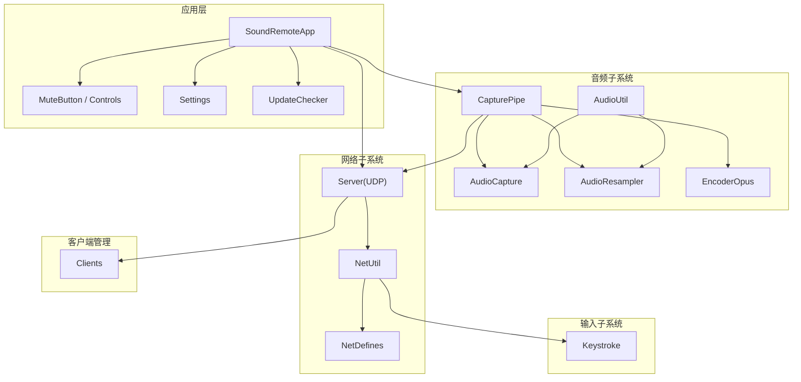
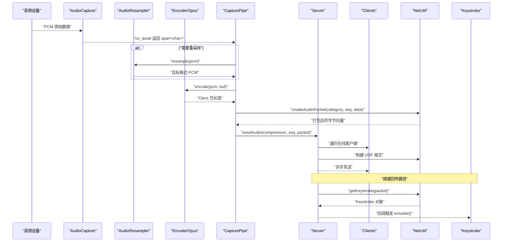
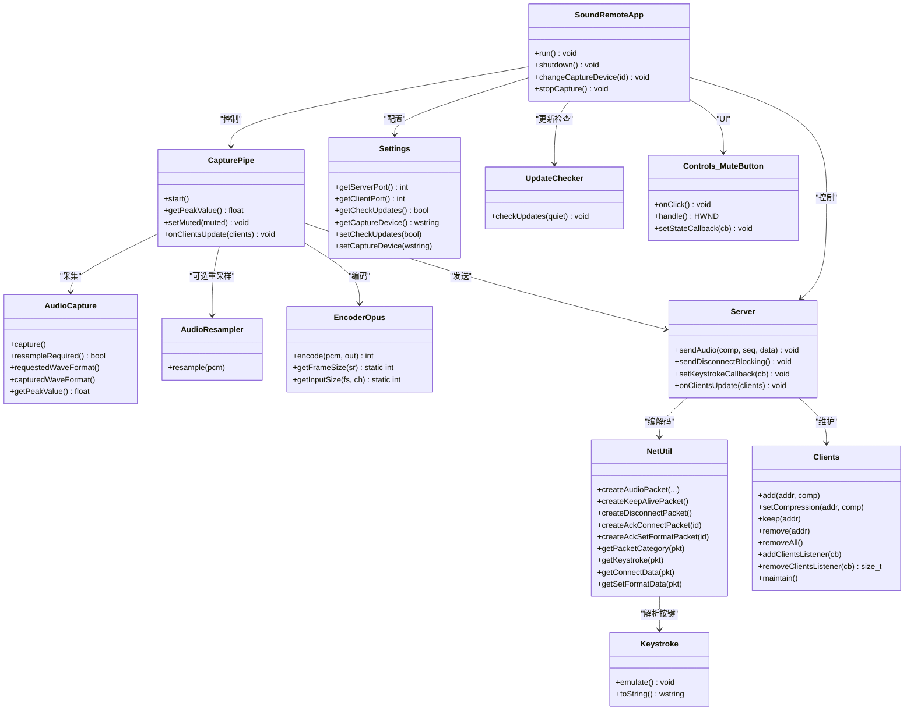

# API 参考

<cite>
**本文引用的文件**   
- [AudioCapture.h](file://SoundRemote/AudioCapture.h)
- [AudioResampler.h](file://SoundRemote/AudioResampler.h)
- [AudioUtil.h](file://SoundRemote/AudioUtil.h)
- [CapturePipe.h](file://SoundRemote/CapturePipe.h)
- [Clients.h](file://SoundRemote/Clients.h)
- [Controls.h](file://SoundRemote/Controls.h)
- [EncoderOpus.h](file://SoundRemote/EncoderOpus.h)
- [Keystroke.h](file://SoundRemote/Keystroke.h)
- [NetDefines.h](file://SoundRemote/NetDefines.h)
- [NetUtil.h](file://SoundRemote/NetUtil.h)
- [Server.h](file://SoundRemote/Server.h)
- [Settings.h](file://SoundRemote/Settings.h)
- [SoundRemoteApp.h](file://SoundRemote/SoundRemoteApp.h)
- [UpdateChecker.h](file://SoundRemote/UpdateChecker.h)
- [Util.h](file://SoundRemote/Util.h)
</cite>

## 目录
1. [简介](#简介)
2. [项目结构](#项目结构)
3. [核心组件](#核心组件)
4. [架构总览](#架构总览)
5. [详细组件分析](#详细组件分析)
6. [依赖关系分析](#依赖关系分析)
7. [性能考虑](#性能考虑)
8. [故障排查指南](#故障排查指南)
9. [结论](#结论)
10. [附录](#附录)

## 简介
本 API 参考文档面向 SoundRemote-WinServer，系统化梳理并记录所有对外暴露的公共接口，覆盖音频捕获、网络通信、客户端管理、键盘模拟与配置管理等模块。文档包含函数签名、参数说明、返回值类型、异常处理、性能特征、数据类型与枚举常量、以及常见用法示例路径。同时提供协议版本兼容性与弃用提示，帮助开发者快速集成与扩展。

## 项目结构
本项目采用分层与按功能域组织的方式：
- 音频子系统：音频采集、重采样、编码（Opus）、峰值检测等
- 网络子系统：UDP 服务器、数据包编解码、心跳与连接管理
- 客户端管理：在线客户端集合、超时维护、压缩格式协商
- 输入子系统：虚拟键码封装与系统级模拟
- 应用层：UI 控制、设置持久化、更新检查、事件驱动主循环

图表来源
- [SoundRemoteApp.h:1-152](file://SoundRemote/SoundRemoteApp.h#L1-L152)
- [Server.h:1-61](file://SoundRemote/Server.h#L1-L61)
- [CapturePipe.h:1-52](file://SoundRemote/CapturePipe.h#L1-L52)
- [AudioCapture.h:1-144](file://SoundRemote/AudioCapture.h#L1-L144)
- [AudioResampler.h:1-24](file://SoundRemote/AudioResampler.h#L1-L24)
- [EncoderOpus.h:1-37](file://SoundRemote/EncoderOpus.h#L1-L37)
- [Clients.h:1-60](file://SoundRemote/Clients.h#L1-L60)
- [NetUtil.h:1-41](file://SoundRemote/NetUtil.h#L1-L41)
- [NetDefines.h:1-69](file://SoundRemote/NetDefines.h#L1-L69)
- [Keystroke.h:1-41](file://SoundRemote/Keystroke.h#L1-L41)
- [Settings.h:1-38](file://SoundRemote/Settings.h#L1-L38)
- [UpdateChecker.h:1-68](file://SoundRemote/UpdateChecker.h#L1-L68)
- [Controls.h:1-35](file://SoundRemote/Controls.h#L1-L35)
- [AudioUtil.h:1-170](file://SoundRemote/AudioUtil.h#L1-L170)

章节来源
- [SoundRemoteApp.h:1-152](file://SoundRemote/SoundRemoteApp.h#L1-L152)
- [Server.h:1-61](file://SoundRemote/Server.h#L1-L61)
- [CapturePipe.h:1-52](file://SoundRemote/CapturePipe.h#L1-L52)
- [AudioCapture.h:1-144](file://SoundRemote/AudioCapture.h#L1-L144)
- [AudioResampler.h:1-24](file://SoundRemote/AudioResampler.h#L1-L24)
- [EncoderOpus.h:1-37](file://SoundRemote/EncoderOpus.h#L1-L37)
- [Clients.h:1-60](file://SoundRemote/Clients.h#L1-L60)
- [NetUtil.h:1-41](file://SoundRemote/NetUtil.h#L1-L41)
- [NetDefines.h:1-69](file://SoundRemote/NetDefines.h#L1-L69)
- [Keystroke.h:1-41](file://SoundRemote/Keystroke.h#L1-L41)
- [Settings.h:1-38](file://SoundRemote/Settings.h#L1-L38)
- [UpdateChecker.h:1-68](file://SoundRemote/UpdateChecker.h#L1-L68)
- [Controls.h:1-35](file://SoundRemote/Controls.h#L1-L35)
- [AudioUtil.h:1-170](file://SoundRemote/AudioUtil.h#L1-L170)

## 核心组件
本节概述各模块职责与关键能力，为后续 API 细节做铺垫。

- 音频捕获与处理
  - AudioCapture：基于 Windows Core Audio 的协程式 PCM 采集，支持设备格式查询与峰值检测
  - AudioResampler：基于 IMFTransform 的重采样器，将设备实际格式转换为目标格式
  - EncoderOpus：Opus 编码器，支持多码率与帧长配置，输出压缩音频包
  - CapturePipe：编排采集、可选重采样、编码与发送流程，维护序列号与静音状态

- 网络通信
  - Server：UDP 服务端，负责连接建立、格式协商、音频分发、心跳与断开
  - NetUtil：协议包构造与解析工具，涵盖音频、按键、连接、心跳与确认包
  - NetDefines：协议常量、类型定义、包结构与类别枚举

- 客户端管理
  - Clients：维护在线客户端集合、压缩格式、最后接触时间，支持监听器通知与超时清理

- 键盘模拟
  - Keystroke：封装虚拟键码与修饰键，调用系统 API 进行按键模拟

- 配置与应用
  - Settings：INI 配置文件读写，默认端口与设备 ID 常量
  - SoundRemoteApp：应用入口、UI 初始化、事件循环、资源生命周期管理
  - UpdateChecker：远程版本检查与结果回调
  - Controls/MuteButton：静音按钮控件与图标切换

章节来源
- [AudioCapture.h:1-144](file://SoundRemote/AudioCapture.h#L1-L144)
- [AudioResampler.h:1-24](file://SoundRemote/AudioResampler.h#L1-L24)
- [EncoderOpus.h:1-37](file://SoundRemote/EncoderOpus.h#L1-L37)
- [CapturePipe.h:1-52](file://SoundRemote/CapturePipe.h#L1-L52)
- [Server.h:1-61](file://SoundRemote/Server.h#L1-L61)
- [NetUtil.h:1-41](file://SoundRemote/NetUtil.h#L1-L41)
- [NetDefines.h:1-69](file://SoundRemote/NetDefines.h#L1-L69)
- [Clients.h:1-60](file://SoundRemote/Clients.h#L1-L60)
- [Keystroke.h:1-41](file://SoundRemote/Keystroke.h#L1-L41)
- [Settings.h:1-38](file://SoundRemote/Settings.h#L1-L38)
- [SoundRemoteApp.h:1-152](file://SoundRemote/SoundRemoteApp.h#L1-L152)
- [UpdateChecker.h:1-68](file://SoundRemote/UpdateChecker.h#L1-L68)
- [Controls.h:1-35](file://SoundRemote/Controls.h#L1-L35)

## 架构总览
下图展示从音频采集到网络分发的端到端数据流，以及按键回传路径。

图表来源
- [AudioCapture.h:1-144](file://SoundRemote/AudioCapture.h#L1-L144)
- [AudioResampler.h:1-24](file://SoundRemote/AudioResampler.h#L1-L24)
- [EncoderOpus.h:1-37](file://SoundRemote/EncoderOpus.h#L1-L37)
- [CapturePipe.h:1-52](file://SoundRemote/CapturePipe.h#L1-L52)
- [Server.h:1-61](file://SoundRemote/Server.h#L1-L61)
- [NetUtil.h:1-41](file://SoundRemote/NetUtil.h#L1-L41)
- [NetDefines.h:1-69](file://SoundRemote/NetDefines.h#L1-L69)
- [Keystroke.h:1-41](file://SoundRemote/Keystroke.h#L1-L41)

## 详细组件分析

### 音频捕获 API（AudioCapture）
- 作用：通过 Windows Core Audio 接口以协程方式获取 PCM 音频，支持设备格式查询与峰值检测。
- 关键方法
  - 构造函数：接收设备 ID、请求格式、boost::asio::io_context 引用
  - capture()：返回可等待的协程，yield 出 span<char> 形式的 PCM 数据
  - resampleRequired()：是否需要对采集数据进行重采样
  - requestedWaveFormat()/capturedWaveFormat()：分别返回请求与实际支持的 WAVEFORMATEXTENSIBLE 指针
  - getPeakValue()：返回当前峰值（0.0~1.0），失败返回 -1
- 参数验证规则
  - deviceId：需为有效设备标识字符串；无效时内部会抛出错误（参见错误处理）
  - requestedFormat：采样率、声道数、位深需符合 Opus 与设备能力范围
  - ioContext：必须为有效的 boost::asio::io_context 引用
- 返回值与异常
  - capture() 协程在底层失败时会通过 unhandled_exception 重新抛出异常
  - getPeakValue() 失败返回 -1
- 性能特征
  - 使用协程避免阻塞线程；峰值检测开销低
  - 若设备不支持请求格式，启用重采样会增加 CPU 占用
- 使用示例路径
  - 创建与启动采集协程：[AudioCapture.h:22-78](file://SoundRemote/AudioCapture.h#L22-L78)
  - 协程等待与数据消费：[AudioCapture.h:80-143](file://SoundRemote/AudioCapture.h#L80-L143)

章节来源
- [AudioCapture.h:1-144](file://SoundRemote/AudioCapture.h#L1-L144)
- [AudioUtil.h:120-170](file://SoundRemote/AudioUtil.h#L120-L170)

### 音频重采样 API（AudioResampler）
- 作用：将设备实际输出的 PCM 转换为期望的目标格式，供编码器或下游处理使用。
- 关键方法
  - 构造函数：输入/输出 WAVEFORMATEXTENSIBLE 指针与输出 streambuf 引用
  - resample(span<char>)：对输入 PCM 执行重采样，结果写入内部缓冲
- 参数验证规则
  - inputFormat/outputFormat：需为合法且兼容的 WAVEFORMATEXTENSIBLE 指针
  - pcmAudio：非空且长度与输入格式一致
- 返回值与异常
  - 失败时通过底层 COM 错误传播（结合 throwOnError/exitOnError）
- 性能特征
  - 基于 IMFTransform，CPU 开销与采样率差值成正比
- 使用示例路径
  - 类定义与接口：[AudioResampler.h:13-23](file://SoundRemote/AudioResampler.h#L13-L23)

章节来源
- [AudioResampler.h:1-24](file://SoundRemote/AudioResampler.h#L1-L24)
- [AudioUtil.h:120-170](file://SoundRemote/AudioUtil.h#L120-L170)

### Opus 编码 API（EncoderOpus）
- 作用：将 PCM 帧编码为 Opus 包，支持多种码率与通道配置。
- 关键方法
  - 构造函数：compression、sampleRate、channels
  - encode(const char*, char*)：返回编码后包长度（0 表示 DTX 无需发送）
  - getFrameSize(sampleRate)/getInputSize(frameSize, channels)：静态辅助计算
- 参数验证规则
  - compression：需在支持的码率集合内
  - sampleRate/channels：需满足 Opus 规范与实现限制
  - pcmAudio：长度需等于 getInputSize(...)
  - encodedPacket：缓冲区大小至少为 maxPacketSize
- 返回值与异常
  - encode 返回 0 表示静默帧；其他情况返回实际字节数
- 性能特征
  - 固定帧长（默认 10ms），高码率下 CPU 占用更高
- 使用示例路径
  - 类定义与接口：[EncoderOpus.h:9-36](file://SoundRemote/EncoderOpus.h#L9-L36)
  - 常量与限制：[AudioUtil.h:29-39](file://SoundRemote/AudioUtil.h#L29-L39)

章节来源
- [EncoderOpus.h:1-37](file://SoundRemote/EncoderOpus.h#L1-L37)
- [AudioUtil.h:29-39](file://SoundRemote/AudioUtil.h#L29-L39)

### 采集管道 API（CapturePipe）
- 作用：串联采集、重采样、编码与发送，维护静音状态与客户端列表变化。
- 关键方法
  - 构造函数：deviceId、server、io_context、muted
  - start()：启动采集协程
  - getPeakValue()：获取当前峰值
  - setMuted(bool)：静音开关
  - onClientsUpdate(forward_list<ClientInfo>)：根据在线客户端调整发送策略
- 内部逻辑要点
  - 协程 process() 持续拉取 PCM，必要时重采样，再编码并按压缩类型发送
  - 维护全局序列号用于去抖与乱序处理（由协议侧使用）
- 参数验证规则
  - deviceId：需有效；server 与 io_context 需非空且有效
- 返回值与异常
  - 启动失败或底层错误会通过上层异常或日志体现
- 性能特征
  - 多编码器缓存（按压缩类型）减少重复创建开销
- 使用示例路径
  - 类定义与接口：[CapturePipe.h:23-51](file://SoundRemote/CapturePipe.h#L23-L51)

章节来源
- [CapturePipe.h:1-52](file://SoundRemote/CapturePipe.h#L1-L52)
- [AudioCapture.h:1-144](file://SoundRemote/AudioCapture.h#L1-L144)
- [AudioResampler.h:1-24](file://SoundRemote/AudioResampler.h#L1-L24)
- [EncoderOpus.h:1-37](file://SoundRemote/EncoderOpus.h#L1-L37)

### 网络通信 API（Server + NetUtil + NetDefines）
- Server
  - 构造函数：clientPort、serverPort、ioContext、clients
  - sendAudio(compression, sequenceNumber, data)：向所有匹配客户端发送音频包
  - sendDisconnectBlocking()：阻塞式向所有客户端发送断开包
  - setKeystrokeCallback(callback)：注册按键回调
  - onClientsUpdate(clients)：同步客户端列表变更
- NetUtil
  - createAudioPacket(category, sequenceNumber, audioData)：构造音频包
  - createKeepAlivePacket()/createDisconnectPacket()：构造心跳/断开包
  - createAckConnectPacket(requestId)/createAckSetFormatPacket(requestId)：构造确认包
  - getPacketCategory(packet)/getKeystroke(packet)/getConnectData(packet)/getSetFormatData(packet)：解析各类包
- NetDefines
  - 协议签名、头部偏移、包类别枚举、默认端口、最大输入包大小等常量
- 参数验证规则
  - category：必须在 Packet::Category 枚举范围内
  - sequenceNumber：无符号 32 位整数，建议单调递增
  - audioData：长度合理且与所选压缩类型匹配
  - requestId：无符号 16 位整数
- 返回值与异常
  - 解析函数返回 optional，失败时为 nullopt
  - sendDisconnectBlocking 失败抛出 boost::system::system_error
- 性能特征
  - UDP 无连接，低延迟；批量发送时注意内存分配与拷贝优化
- 使用示例路径
  - Server 接口：[Server.h:20-60](file://SoundRemote/Server.h#L20-L60)
  - NetUtil 接口：[NetUtil.h:11-40](file://SoundRemote/NetUtil.h#L11-L40)
  - 协议常量与结构：[NetDefines.h:1-69](file://SoundRemote/NetDefines.h#L1-L69)

章节来源
- [Server.h:1-61](file://SoundRemote/Server.h#L1-L61)
- [NetUtil.h:1-41](file://SoundRemote/NetUtil.h#L1-L41)
- [NetDefines.h:1-69](file://SoundRemote/NetDefines.h#L1-L69)

### 客户端管理 API（Clients）
- 作用：维护在线客户端集合、压缩格式、最后接触时间，并提供监听器机制。
- 关键方法
  - add(address, compression)/setCompression(address, compression)/keep(address)/remove(address)/removeAll()
  - addClientsListener(listener)/removeClientsListener(listener)
  - maintain()：定时清理超时客户端
- 数据结构
  - ClientInfo：包含地址与压缩格式
- 参数验证规则
  - address：有效 IPv4 地址
  - compression：需在支持的压缩集合内
- 返回值与异常
  - removeClientsListener 返回移除数量
- 性能特征
  - 使用 shared_mutex 保护并发访问；forward_list 降低插入删除开销
- 使用示例路径
  - 类定义与接口：[Clients.h:15-52](file://SoundRemote/Clients.h#L15-L52)
  - 数据结构：[Clients.h:54-59](file://SoundRemote/Clients.h#L54-L59)

章节来源
- [Clients.h:1-60](file://SoundRemote/Clients.h#L1-L60)

### 键盘模拟 API（Keystroke）
- 作用：封装虚拟键码与修饰键，调用系统 API 进行按键模拟。
- 关键方法
  - 构造函数：key（1~254）、mods（修饰键位域）
  - emulate()：执行按键模拟
  - toString()：生成可读描述
- 参数验证规则
  - key：必须在 1~254 范围内
  - mods：仅允许定义的修饰键组合
- 返回值与异常
  - emulate 失败时可能抛出系统级异常或错误码（具体取决于底层实现）
- 性能特征
  - 单次模拟开销极低，适合高频事件
- 使用示例路径
  - 类定义与接口：[Keystroke.h:6-40](file://SoundRemote/Keystroke.h#L6-L40)

章节来源
- [Keystroke.h:1-41](file://SoundRemote/Keystroke.h#L1-L41)

### 配置管理 API（Settings）
- 作用：读取/写入 INI 配置文件，提供默认端口与设备 ID 常量。
- 关键方法
  - getServerPort()/getClientPort()/getCheckUpdates()/getCaptureDevice()
  - setCheckUpdates(value)/setCaptureDevice(deviceId)
- 参数验证规则
  - value/deviceId：类型正确即可；写入仅在值变化时落盘
- 返回值与异常
  - 读取失败时返回默认值或空串（依实现而定）
- 性能特征
  - 小文件 IO，开销可忽略
- 使用示例路径
  - 类定义与接口：[Settings.h:11-37](file://SoundRemote/Settings.h#L11-L37)
  - 默认常量：[Settings.h:8-9](file://SoundRemote/Settings.h#L8-L9)

章节来源
- [Settings.h:1-38](file://SoundRemote/Settings.h#L1-L38)

### 应用与 UI 控制 API（SoundRemoteApp + Controls + UpdateChecker）
- SoundRemoteApp
  - 应用生命周期：create/exec/shutdown/run/changeCaptureDevice/stopCapture
  - 事件处理：设备选择、客户端列表更新、峰值表更新、按键回调、更新检查
- MuteButton/Controls
  - 静音按钮控件：onClick/handle/setStateCallback/isMuted/updateIcon
- UpdateChecker
  - checkUpdates(quiet)：后台检查新版本并通过消息 WM_UPDATE_CHECK 回调
- 使用示例路径
  - 应用入口与事件：[SoundRemoteApp.h:22-151](file://SoundRemote/SoundRemoteApp.h#L22-L151)
  - 静音控件：[Controls.h:10-24](file://SoundRemote/Controls.h#L10-L24)
  - 更新检查：[UpdateChecker.h:14-67](file://SoundRemote/UpdateChecker.h#L14-L67)

章节来源
- [SoundRemoteApp.h:1-152](file://SoundRemote/SoundRemoteApp.h#L1-L152)
- [Controls.h:1-35](file://SoundRemote/Controls.h#L1-L35)
- [UpdateChecker.h:1-68](file://SoundRemote/UpdateChecker.h#L1-L68)

### 通用工具 API（Util）
- 作用：错误信息构造、版本比较、主窗口句柄设置等。
- 关键方法
  - showError/showInfo/makeAppErrorText/makeFatalErrorText/isNewerVersion
- 使用示例路径
  - 工具集：[Util.h:10-62](file://SoundRemote/Util.h#L10-L62)

章节来源
- [Util.h:1-70](file://SoundRemote/Util.h#L1-L70)

## 依赖关系分析

图表来源
- [AudioCapture.h:1-144](file://SoundRemote/AudioCapture.h#L1-L144)
- [AudioResampler.h:1-24](file://SoundRemote/AudioResampler.h#L1-L24)
- [EncoderOpus.h:1-37](file://SoundRemote/EncoderOpus.h#L1-L37)
- [CapturePipe.h:1-52](file://SoundRemote/CapturePipe.h#L1-L52)
- [Server.h:1-61](file://SoundRemote/Server.h#L1-L61)
- [NetUtil.h:1-41](file://SoundRemote/NetUtil.h#L1-L41)
- [Clients.h:1-60](file://SoundRemote/Clients.h#L1-L60)
- [Keystroke.h:1-41](file://SoundRemote/Keystroke.h#L1-L41)
- [Settings.h:1-38](file://SoundRemote/Settings.h#L1-L38)
- [SoundRemoteApp.h:1-152](file://SoundRemote/SoundRemoteApp.h#L1-L152)
- [UpdateChecker.h:1-68](file://SoundRemote/UpdateChecker.h#L1-L68)
- [Controls.h:1-35](file://SoundRemote/Controls.h#L1-L35)

## 性能考虑
- 音频链路
  - 优先让设备直接支持请求格式以避免重采样
  - 选择合适的 Opus 码率与帧长平衡带宽与 CPU
  - 使用 streambuf 与 span 减少拷贝
- 网络链路
  - UDP 无连接，注意丢包与乱序处理
  - 批量发送时复用缓冲区，避免频繁分配
- 客户端管理
  - 合理设置超时时间，避免过多客户端导致广播放大
- 输入模拟
  - 高频按键事件建议节流或合并

## 故障排查指南
- 音频相关错误
  - 使用 throwOnError/exitOnError/processError 定位错误位置（Location 枚举）
  - 峰值检测失败返回 -1，检查设备权限与独占模式
- 网络相关错误
  - sendDisconnectBlocking 失败抛出 system_error，检查端口占用与防火墙
  - 解析包返回 nullopt 时，检查协议版本与字段完整性
- 配置相关错误
  - 读取失败时回退默认值，检查 INI 文件权限与格式
- 更新检查错误
  - 通过 UPDATE_CHECK_ERROR 消息处理网络异常与 JSON 解析失败

章节来源
- [AudioUtil.h:130-169](file://SoundRemote/AudioUtil.h#L130-L169)
- [Server.h:32-37](file://SoundRemote/Server.h#L32-L37)
- [NetUtil.h:26-39](file://SoundRemote/NetUtil.h#L26-L39)
- [Settings.h:11-37](file://SoundRemote/Settings.h#L11-L37)
- [UpdateChecker.h:8-12](file://SoundRemote/UpdateChecker.h#L8-L12)

## 结论
本参考文档系统化整理了 SoundRemote-WinServer 的公共 API，覆盖音频、网络、客户端、输入与配置五大领域。通过清晰的接口说明、参数校验、异常处理与性能特征，帮助开发者高效集成与扩展。建议在集成时遵循协议版本约束与最佳实践，以获得稳定与高性能的体验。

## 附录

### 数据类型与枚举常量参考
- 压缩与采样
  - Audio::Compression：none、kbps_64、kbps_128、kbps_192、kbps_256、kbps_320
  - Audio::Opus::SampleRate：khz_8、khz_12、khz_16、khz_24、khz_48
  - Audio::Opus::Channels：mono、stereo
  - Audio::Opus::frameLength：10（毫秒）
  - Audio::Opus::maxPacketSize：按最高码率与帧长计算的最大包大小
- 协议常量
  - protocolSignature：0xA571u
  - headerSize/dataOffset/offsets：头部与数据偏移
  - keystrokeSize/ackSize/sequenceNumberSize：包段大小
  - defaultServerPort/defaultClientPort：默认端口
  - inputPacketSize：输入缓冲区大小
  - protocolVersion：1
- 包类别
  - Packet::Category：Error、Connect、Disconnect、SetFormat、Keystroke、AudioDataUncompressed、AudioDataOpus、ClientKeepAlive、ServerKeepAlive、Ack

章节来源
- [AudioUtil.h:27-39](file://SoundRemote/AudioUtil.h#L27-L39)
- [NetDefines.h:1-69](file://SoundRemote/NetDefines.h#L1-L69)

### 协议版本兼容性
- 当前协议版本：1
- 向后兼容策略
  - 客户端与服务端应检查 ProtocolVersionType，不匹配则拒绝连接
  - 新增包类别应在旧版本中忽略未知类别
- 弃用警告
  - 未来可能废弃未压缩音频类别，建议优先使用 Opus 压缩类别

章节来源
- [NetDefines.h:60](file://SoundRemote/NetDefines.h#L60)
- [NetDefines.h:47-58](file://SoundRemote/NetDefines.h#L47-L58)

### 常见用法示例路径
- 音频采集与协程消费
  - 创建与启动：[AudioCapture.h:22-78](file://SoundRemote/AudioCapture.h#L22-L78)
  - 协程等待与数据处理：[AudioCapture.h:80-143](file://SoundRemote/AudioCapture.h#L80-L143)
- 重采样与编码
  - 重采样调用：[AudioResampler.h:13-23](file://SoundRemote/AudioResampler.h#L13-L23)
  - 编码调用与帧尺寸计算：[EncoderOpus.h:9-36](file://SoundRemote/EncoderOpus.h#L9-L36)
- 管道编排
  - 启动与静音控制：[CapturePipe.h:23-51](file://SoundRemote/CapturePipe.h#L23-L51)
- 网络收发
  - 发送音频包：[Server.h:27-31](file://SoundRemote/Server.h#L27-L31)
  - 构造与解析包：[NetUtil.h:26-39](file://SoundRemote/NetUtil.h#L26-L39)
- 客户端管理
  - 添加与监听：[Clients.h:19-27](file://SoundRemote/Clients.h#L19-L27)
- 键盘模拟
  - 构造与模拟：[Keystroke.h:6-18](file://SoundRemote/Keystroke.h#L6-L18)
- 配置读写
  - 读取与写入：[Settings.h:14-29](file://SoundRemote/Settings.h#L14-L29)
- 应用运行
  - 启动与关闭：[SoundRemoteApp.h:140-146](file://SoundRemote/SoundRemoteApp.h#L140-L146)
- 更新检查
  - 触发与消息常量：[UpdateChecker.h:18-23](file://SoundRemote/UpdateChecker.h#L18-L23), [UpdateChecker.h:8-12](file://SoundRemote/UpdateChecker.h#L8-L12)