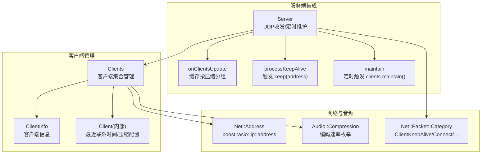
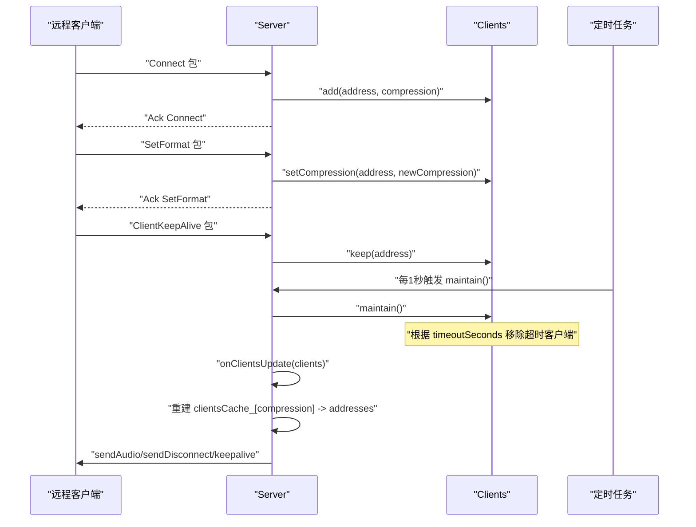
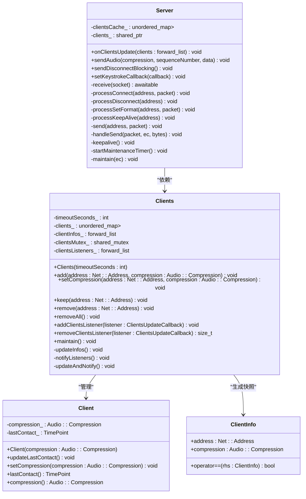
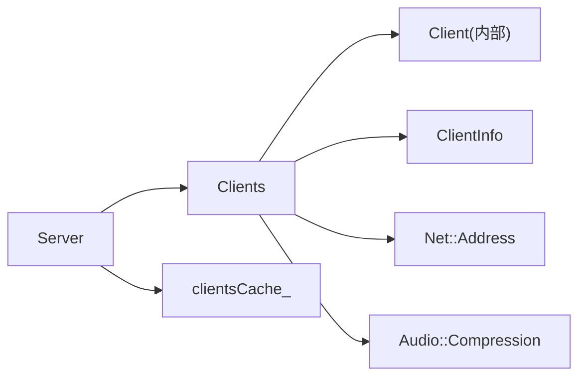

# 客户端管理 API

<cite>
**本文引用的文件**   
- [Clients.h](file://SoundRemote/Clients.h)
- [Clients.cpp](file://SoundRemote/Clients.cpp)
- [Server.h](file://SoundRemote/Server.h)
- [Server.cpp](file://SoundRemote/Server.cpp)
- [NetDefines.h](file://SoundRemote/NetDefines.h)
- [AudioUtil.h](file://SoundRemote/AudioUtil.h)
- [ClientsTest.cpp](file://Tests/ClientsTest.cpp)
</cite>

## 目录
1. [简介](#简介)
2. [项目结构](#项目结构)
3. [核心组件](#核心组件)
4. [架构总览](#架构总览)
5. [详细组件分析](#详细组件分析)
6. [依赖关系分析](#依赖关系分析)
7. [性能与并发特性](#性能与并发特性)
8. [使用示例](#使用示例)
9. [故障排查指南](#故障排查指南)
10. [结论](#结论)

## 简介
本章节面向“客户端管理模块”，聚焦于 Clients 类提供的客户端连接管理能力，包括：
- 客户端添加、删除、批量清理
- 压缩格式设置
- 心跳保持（keep）与超时维护（maintain）
- 客户端列表变更的监听机制
- 数据结构 ClientInfo、音频压缩枚举 Audio::Compression、网络地址类型 Net::Address 的定义与用法
- 与 Server 的协作方式：接收客户端连接、断开、格式更新、心跳包，驱动客户端状态同步

该模块以线程安全为核心设计目标，采用读写锁保护内部容器，并通过观察者模式将客户端集合变化通知给订阅者。

## 项目结构
与客户端管理相关的代码主要分布在以下文件中：
- SoundRemote/Clients.h、SoundRemote/Clients.cpp：客户端管理核心实现
- SoundRemote/Server.h、SoundRemote/Server.cpp：服务端对客户端管理的集成与调用
- SoundRemote/NetDefines.h：网络协议常量、数据包类别、地址类型定义
- SoundRemote/AudioUtil.h：音频压缩枚举等
- Tests/ClientsTest.cpp：并发与功能测试用例

图表来源
- [Clients.h:15-52](file://SoundRemote/Clients.h#L15-L52)
- [Clients.cpp:64-98](file://SoundRemote/Clients.cpp#L64-L98)
- [Server.h:20-61](file://SoundRemote/Server.h#L20-L61)
- [Server.cpp:37-46](file://SoundRemote/Server.cpp#L37-L46)
- [Server.cpp:164-166](file://SoundRemote/Server.cpp#L164-L166)
- [Server.cpp:187-199](file://SoundRemote/Server.cpp#L187-L199)
- [NetDefines.h:62-68](file://SoundRemote/NetDefines.h#L62-L68)
- [AudioUtil.h:27](file://SoundRemote/AudioUtil.h#L27)

章节来源
- [Clients.h:1-60](file://SoundRemote/Clients.h#L1-L60)
- [Clients.cpp:1-125](file://SoundRemote/Clients.cpp#L1-L125)
- [Server.h:1-61](file://SoundRemote/Server.h#L1-L61)
- [Server.cpp:1-210](file://SoundRemote/Server.cpp#L1-L210)
- [NetDefines.h:1-69](file://SoundRemote/NetDefines.h#L1-L69)
- [AudioUtil.h:1-170](file://SoundRemote/AudioUtil.h#L1-L170)

## 核心组件
本节概述 Clients 类的职责与关键接口，以及与之相关的数据结构。

- Clients 类职责
  - 维护已连接的客户端集合（基于 Net::Address 索引）
  - 提供 add/remove/removeAll/setCompression/keep/maintain 等接口
  - 通过 forward_list<ClientInfo> 暴露当前客户端快照
  - 支持多监听器订阅客户端集合变更事件
  - 内部使用 shared_mutex 保证多线程访问安全

- ClientInfo 数据结构
  - 包含 address 与 compression 两个字段
  - 用于向监听器广播客户端集合快照

- 内部 Client 结构
  - 记录 lastContact_（最近一次 keep 的时间点）
  - 记录 compression_（当前压缩配置）
  - 提供 updateLastContact()/compression()/lastContact() 等方法

- 音频压缩枚举 Audio::Compression
  - none、kbps_64、kbps_128、kbps_192、kbps_256、kbps_320
  - 用于区分不同码率的音频数据通道

- 网络地址类型 Net::Address
  - boost::asio::ip::address 的别名
  - 作为客户端唯一标识键

章节来源
- [Clients.h:15-52](file://SoundRemote/Clients.h#L15-L52)
- [Clients.cpp:100-125](file://SoundRemote/Clients.cpp#L100-L125)
- [AudioUtil.h:27](file://SoundRemote/AudioUtil.h#L27)
- [NetDefines.h:62-68](file://SoundRemote/NetDefines.h#L62-L68)

## 架构总览
下图展示了服务端与客户端管理模块之间的交互流程，包括连接建立、格式设置、心跳处理、定时维护与广播发送。

图表来源
- [Server.cpp:127-137](file://SoundRemote/Server.cpp#L127-L137)
- [Server.cpp:143-153](file://SoundRemote/Server.cpp#L143-L153)
- [Server.cpp:164-166](file://SoundRemote/Server.cpp#L164-L166)
- [Server.cpp:187-199](file://SoundRemote/Server.cpp#L187-L199)
- [Server.cpp:37-46](file://SoundRemote/Server.cpp#L37-L46)
- [Clients.cpp:64-98](file://SoundRemote/Clients.cpp#L64-L98)

## 详细组件分析

### Clients 类接口与方法语义
- 构造
  - Clients(int timeoutSeconds = 5)
    - 初始化超时阈值（秒），用于 maintain 中剔除长时间无心跳的客户端
- 客户端生命周期管理
  - void add(const Net::Address& address, Audio::Compression compression)
    - 若已存在：更新 lastContact；如 compression 不同则更新并通知
    - 若不存在：创建新条目，初始化 lastContact 与 compression，并通知
  - void setCompression(const Net::Address& address, Audio::Compression compression)
    - 仅当地址存在且 compression 发生变化时更新并通知
  - void remove(const Net::Address& address)
    - 删除指定地址的客户端，若存在则通知
  - void removeAll()
    - 清空所有客户端，若非空则通知
- 心跳与超时
  - void keep(const Net::Address& address)
    - 刷新指定地址的 lastContact
  - void maintain()
    - 遍历所有客户端，计算 elapsedSeconds，超过 timeoutSeconds_ 则删除，并在有删除发生时通知
- 监听器机制
  - void addClientsListener(ClientsUpdateCallback listener)
    - 注册监听器，立即回调一次当前快照 clientInfos_
  - size_t removeClientsListener(ClientsUpdateCallback listener)
    - 移除监听器（基于函数对象类型名匹配）
- 内部方法
  - void updateInfos()：从 clients_ 构建 clientInfos_ 快照
  - void notifyListeners()：遍历 listeners_ 并推送快照
  - void updateAndNotify()：组合 updateInfos 与 notifyListeners

线程安全说明
- 所有对外可变接口均持有 unique_lock(clientsMutex_)，确保并发安全
- listeners_ 列表在程序启动或设备变更时修改，不在临界区内操作，避免长耗时阻塞

章节来源
- [Clients.h:15-52](file://SoundRemote/Clients.h#L15-L52)
- [Clients.cpp:5-51](file://SoundRemote/Clients.cpp#L5-L51)
- [Clients.cpp:53-62](file://SoundRemote/Clients.cpp#L53-L62)
- [Clients.cpp:64-98](file://SoundRemote/Clients.cpp#L64-L98)

### ClientInfo 与 Audio::Compression
- ClientInfo
  - 字段：address、compression
  - 用途：向监听器传递客户端集合快照
  - 相等性比较：同时比较 address 与 compression
- Audio::Compression
  - 值域：none、kbps_64、kbps_128、kbps_192、kbps_256、kbps_320
  - 用途：区分不同码率通道，服务端据此选择发送未压缩或 Opus 编码数据

章节来源
- [Clients.h:54-60](file://SoundRemote/Clients.h#L54-L60)
- [Clients.cpp:122-125](file://SoundRemote/Clients.cpp#L122-L125)
- [AudioUtil.h:27](file://SoundRemote/AudioUtil.h#L27)

### 连接生命周期与状态同步
- 连接建立
  - 服务端收到 Connect 包后，解析请求 ID 与压缩参数，调用 clients_->add(...)
  - 返回 Ack Connect 包
- 格式设置
  - 服务端收到 SetFormat 包后，调用 clients_->setCompression(...)
  - 返回 Ack SetFormat 包
- 心跳保持
  - 客户端周期性发送 ClientKeepAlive 包
  - 服务端调用 clients_->keep(address) 刷新 lastContact
- 超时清理
  - 定时器每秒触发 Server::maintain()，进而调用 clients_->maintain()
  - 超过 timeoutSeconds_ 的客户端被移除，并触发 onClientsUpdate 回调
- 广播优化
  - Server::onClientsUpdate 将客户端按 compression 分组缓存到 clientsCache_
  - sendAudio 直接按压缩组广播，减少重复查找

章节来源
- [Server.cpp:127-137](file://SoundRemote/Server.cpp#L127-L137)
- [Server.cpp:143-153](file://SoundRemote/Server.cpp#L143-L153)
- [Server.cpp:164-166](file://SoundRemote/Server.cpp#L164-L166)
- [Server.cpp:187-199](file://SoundRemote/Server.cpp#L187-L199)
- [Server.cpp:37-46](file://SoundRemote/Server.cpp#L37-L46)

### 类图（代码级）

图表来源
- [Clients.h:15-52](file://SoundRemote/Clients.h#L15-L52)
- [Clients.cpp:100-125](file://SoundRemote/Clients.cpp#L100-L125)
- [Server.h:20-61](file://SoundRemote/Server.h#L20-L61)

## 依赖关系分析
- 外部依赖
  - boost::asio::ip::address 作为 Net::Address
  - std::shared_mutex 用于并发控制
  - std::forward_list 用于高效迭代与插入
  - std::unordered_map 用于 O(1) 查找
- 内部耦合
  - Clients 与 Client 强耦合（内部类）
  - Server 通过 shared_ptr<Clients> 弱耦合，便于替换与测试
  - Server 维护 clientsCache_ 以降低广播时的查找开销

图表来源
- [Clients.h:15-52](file://SoundRemote/Clients.h#L15-L52)
- [Server.h:53-60](file://SoundRemote/Server.h#L53-L60)

章节来源
- [Clients.h:1-60](file://SoundRemote/Clients.h#L1-L60)
- [Server.h:1-61](file://SoundRemote/Server.h#L1-L61)

## 性能与并发特性
- 并发模型
  - 所有写操作加锁（unique_lock），读路径（notifyListeners）在锁外执行，降低锁竞争
  - 监听器列表不持锁，仅在启动或设备变更时修改，避免长耗时阻塞
- 复杂度
  - add/remove/setCompression/maintain 均为 O(n) 遍历或哈希表操作
  - onClientsUpdate 为 O(n) 重组压缩分组缓存
- 内存与对象
  - 使用 unique_ptr 管理 Client 实例，自动释放
  - forward_list 适合频繁前插与迭代，减少移动开销
- 建议
  - 合理设置 timeoutSeconds_，平衡资源占用与存活检测灵敏度
  - 监听器回调应避免重计算，尽量就地消费快照数据

[本节为通用性能讨论，无需特定文件引用]

## 使用示例
以下为典型使用场景的步骤说明（不包含具体代码内容，仅提供路径参考）：

- 基本用法
  - 创建 Clients 实例并设置超时
    - 参考：[Clients.cpp:3](file://SoundRemote/Clients.cpp#L3)
  - 添加客户端
    - 参考：[Clients.cpp:5-18](file://SoundRemote/Clients.cpp#L5-L18)
  - 设置压缩格式
    - 参考：[Clients.cpp:20-27](file://SoundRemote/Clients.cpp#L20-L27)
  - 刷新心跳
    - 参考：[Clients.cpp:29-35](file://SoundRemote/Clients.cpp#L29-L35)
  - 删除/清空客户端
    - 参考：[Clients.cpp:37-51](file://SoundRemote/Clients.cpp#L37-L51)
  - 注册监听器获取初始快照与后续变更
    - 参考：[Clients.cpp:53-62](file://SoundRemote/Clients.cpp#L53-L62)
  - 定时维护清理超时客户端
    - 参考：[Clients.cpp:64-80](file://SoundRemote/Clients.cpp#L64-L80)

- 与服务端集成
  - 接收连接并加入管理
    - 参考：[Server.cpp:127-137](file://SoundRemote/Server.cpp#L127-L137)
  - 处理格式设置
    - 参考：[Server.cpp:143-153](file://SoundRemote/Server.cpp#L143-L153)
  - 处理心跳包
    - 参考：[Server.cpp:164-166](file://SoundRemote/Server.cpp#L164-L166)
  - 定时维护与广播
    - 参考：[Server.cpp:187-199](file://SoundRemote/Server.cpp#L187-L199)、[Server.cpp:37-46](file://SoundRemote/Server.cpp#L37-L46)

- 多客户端并发处理
  - 并发添加/删除/设置压缩的测试覆盖
    - 参考：[ClientsTest.cpp:48-69](file://Tests/ClientsTest.cpp#L48-L69)、[ClientsTest.cpp:107-132](file://Tests/ClientsTest.cpp#L107-L132)、[ClientsTest.cpp:71-105](file://Tests/ClientsTest.cpp#L71-L105)

- 连接池管理与资源清理策略
  - 使用 removeAll 进行批量清理
    - 参考：[Clients.cpp:44-51](file://SoundRemote/Clients.cpp#L44-L51)
  - 利用 maintain 定期回收超时资源
    - 参考：[Clients.cpp:64-80](file://SoundRemote/Clients.cpp#L64-L80)

章节来源
- [Clients.cpp:3-80](file://SoundRemote/Clients.cpp#L3-L80)
- [Server.cpp:127-199](file://SoundRemote/Server.cpp#L127-L199)
- [ClientsTest.cpp:48-132](file://Tests/ClientsTest.cpp#L48-L132)

## 故障排查指南
- 常见问题定位
  - 客户端未被识别：检查 add 是否被调用、address 是否正确
    - 参考：[Server.cpp:127-137](file://SoundRemote/Server.cpp#L127-L137)
  - 压缩格式未生效：确认 setCompression 是否被调用且 compression 确实变化
    - 参考：[Clients.cpp:20-27](file://SoundRemote/Clients.cpp#L20-L27)
  - 客户端被误删：检查 keep 是否周期性调用、timeoutSeconds_ 是否过小
    - 参考：[Clients.cpp:29-35](file://SoundRemote/Clients.cpp#L29-L35)、[Clients.cpp:64-80](file://SoundRemote/Clients.cpp#L64-L80)
  - 监听器未收到更新：确认 addClientsListener 是否注册成功，是否在变更路径上触发 updateAndNotify
    - 参考：[Clients.cpp:53-62](file://SoundRemote/Clients.cpp#L53-L62)、[Clients.cpp:95-98](file://SoundRemote/Clients.cpp#L95-L98)
- 异常处理
  - 服务端接收异常捕获与退出逻辑
    - 参考：[Server.cpp:111-125](file://SoundRemote/Server.cpp#L111-L125)
  - 发送失败抛出运行时错误
    - 参考：[Server.cpp:176-180](file://SoundRemote/Server.cpp#L176-L180)
  - 定时器错误处理
    - 参考：[Server.cpp:187-199](file://SoundRemote/Server.cpp#L187-L199)

章节来源
- [Clients.cpp:20-27](file://SoundRemote/Clients.cpp#L20-L27)
- [Clients.cpp:29-35](file://SoundRemote/Clients.cpp#L29-L35)
- [Clients.cpp:53-62](file://SoundRemote/Clients.cpp#L53-L62)
- [Clients.cpp:64-80](file://SoundRemote/Clients.cpp#L64-L80)
- [Clients.cpp:95-98](file://SoundRemote/Clients.cpp#L95-L98)
- [Server.cpp:111-125](file://SoundRemote/Server.cpp#L111-L125)
- [Server.cpp:176-180](file://SoundRemote/Server.cpp#L176-L180)
- [Server.cpp:187-199](file://SoundRemote/Server.cpp#L187-L199)

## 结论
Clients 模块提供了简洁而健壮的客户端连接管理能力，具备：
- 清晰的接口边界与职责划分
- 线程安全的并发模型
- 高效的监听器通知机制
- 与服务端的无缝集成（连接、格式、心跳、维护）

在实际部署中，建议：
- 根据网络环境合理设置 timeoutSeconds_
- 监听器回调保持轻量，避免阻塞
- 结合服务端广播缓存（按压缩分组）提升吞吐
- 完善日志与监控，快速定位连接问题

[本节为总结性内容，无需特定文件引用]