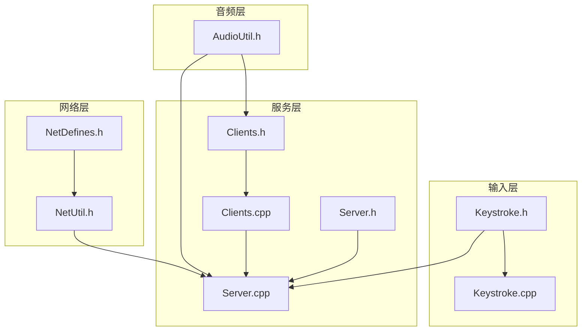
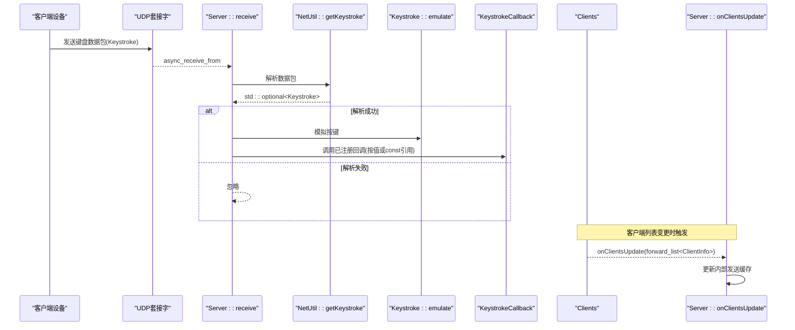
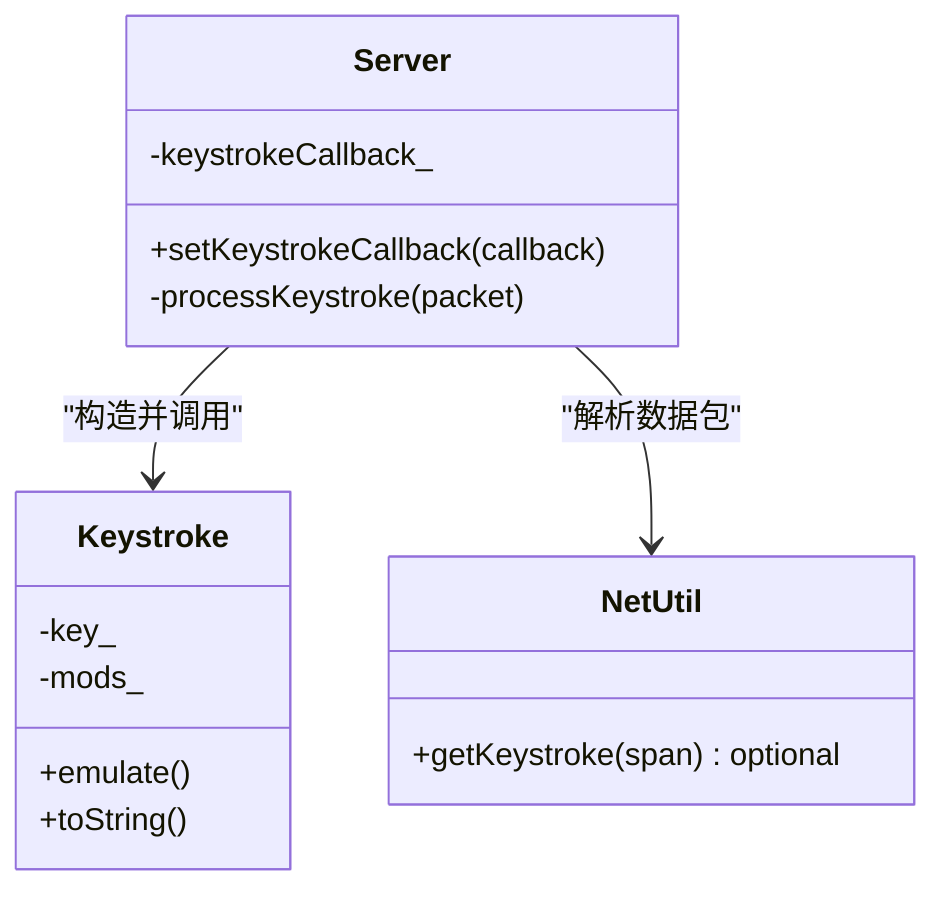
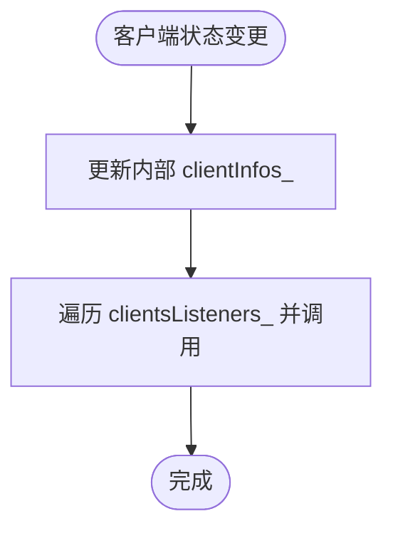
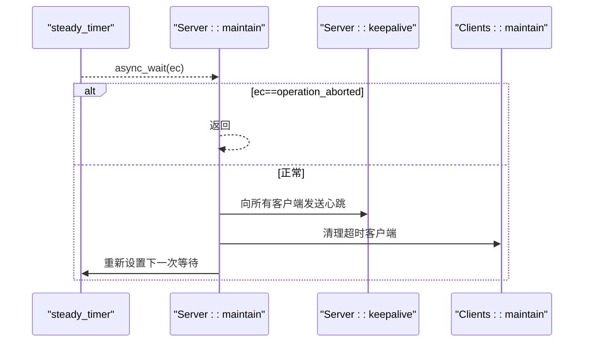
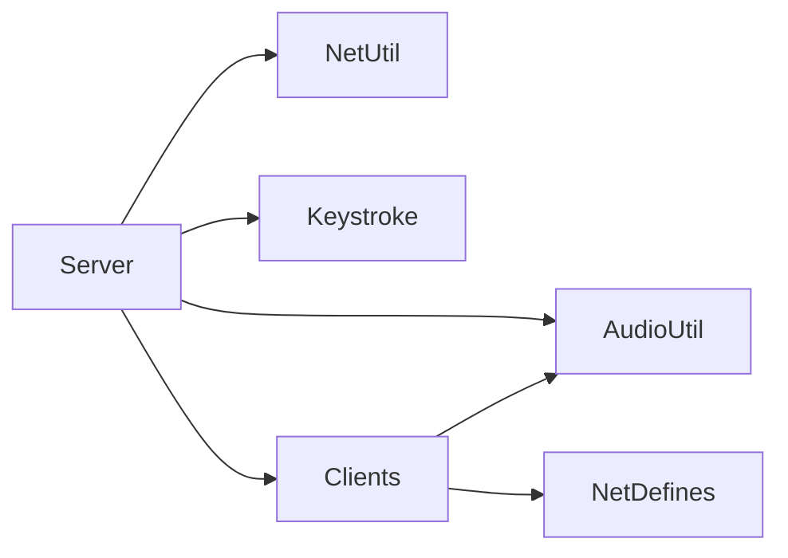

# 事件回调接口

<cite>
**本文引用的文件**   
- [README.md](file://README.md)
- [Server.h](file://SoundRemote/Server.h)
- [Server.cpp](file://SoundRemote/Server.cpp)
- [Clients.h](file://SoundRemote/Clients.h)
- [Clients.cpp](file://SoundRemote/Clients.cpp)
- [Keystroke.h](file://SoundRemote/Keystroke.h)
- [Keystroke.cpp](file://SoundRemote/Keystroke.cpp)
- [NetDefines.h](file://SoundRemote/NetDefines.h)
- [NetUtil.h](file://SoundRemote/NetUtil.h)
- [AudioUtil.h](file://SoundRemote/AudioUtil.h)
- [KeystrokeTest.cpp](file://Tests/KeystrokeTest.cpp)
- [ClientsTest.cpp](file://Tests/ClientsTest.cpp)
</cite>

## 目录
1. [简介](#简介)
2. [项目结构](#项目结构)
3. [核心组件](#核心组件)
4. [架构总览](#架构总览)
5. [详细组件分析](#详细组件分析)
6. [依赖关系分析](#依赖关系分析)
7. [性能与并发考虑](#性能与并发考虑)
8. [故障排查指南](#故障排查指南)
9. [结论](#结论)
10. [附录：最佳实践示例](#附录最佳实践示例)

## 简介
本文件为服务器端事件回调系统的API文档，聚焦以下目标：
- KeystrokeCallback 键盘事件回调的注册与使用规范、参数传递机制
- onClientsUpdate 客户端更新回调的实现原理与触发时机
- 异步事件处理模型与线程安全注意事项
- 事件驱动编程的最佳实践（错误处理、日志记录、性能监控）
- 回调生命周期管理与资源清理策略

该项目是一个桌面服务端，通过UDP与Android客户端通信，实现音频采集转发与远程键盘模拟。

**章节来源**
- [README.md:1-14](file://README.md#L1-L14)

## 项目结构
与事件回调系统直接相关的核心模块如下：
- Server：网络接收、协议解析、事件分发、回调调用
- Clients：客户端连接状态维护、客户端列表变更通知
- Keystroke：键盘事件封装与系统级模拟
- NetDefines/NetUtil：网络包格式与编解码工具
- AudioUtil：音频压缩类型等公共定义

**图示来源**
- [Server.h:1-61](file://SoundRemote/Server.h#L1-L61)
- [Server.cpp:1-210](file://SoundRemote/Server.cpp#L1-L210)
- [Clients.h:1-60](file://SoundRemote/Clients.h#L1-L60)
- [Clients.cpp:1-125](file://SoundRemote/Clients.cpp#L1-L125)
- [Keystroke.h:1-41](file://SoundRemote/Keystroke.h#L1-L41)
- [Keystroke.cpp:1-153](file://SoundRemote/Keystroke.cpp#L1-L153)
- [NetDefines.h:1-69](file://SoundRemote/NetDefines.h#L1-L69)
- [NetUtil.h:1-41](file://SoundRemote/NetUtil.h#L1-L41)
- [AudioUtil.h:1-170](file://SoundRemote/AudioUtil.h#L1-L170)

**章节来源**
- [Server.h:1-61](file://SoundRemote/Server.h#L1-L61)
- [Clients.h:1-60](file://SoundRemote/Clients.h#L1-L60)
- [Keystroke.h:1-41](file://SoundRemote/Keystroke.h#L1-L41)
- [NetDefines.h:1-69](file://SoundRemote/NetDefines.h#L1-L69)
- [NetUtil.h:1-41](file://SoundRemote/NetUtil.h#L1-L41)
- [AudioUtil.h:1-170](file://SoundRemote/AudioUtil.h#L1-L170)

## 核心组件
- Server
  - 提供 setKeystrokeCallback 用于注册键盘事件回调
  - 在收到并解析键盘数据包后，调用已注册的回调
  - 监听 Clients 的 onClientsUpdate 以维护发送缓存
- Clients
  - 维护客户端集合及压缩配置
  - 提供 addClientsListener/removeClientsListener 订阅客户端列表变更
  - 内部使用共享互斥锁保证多线程访问安全
- Keystroke
  - 封装虚拟键码与修饰键组合
  - emulate() 将按键序列注入系统输入栈
- NetDefines/NetUtil
  - 定义协议字段、类别枚举、包大小常量
  - 提供 getKeystroke 等解析函数

**章节来源**
- [Server.h:20-61](file://SoundRemote/Server.h#L20-L61)
- [Server.cpp:76-78](file://SoundRemote/Server.cpp#L76-L78)
- [Server.cpp:155-162](file://SoundRemote/Server.cpp#L155-L162)
- [Clients.h:15-52](file://SoundRemote/Clients.h#L15-L52)
- [Clients.cpp:53-62](file://SoundRemote/Clients.cpp#L53-L62)
- [Keystroke.h:6-41](file://SoundRemote/Keystroke.h#L6-L41)
- [Keystroke.cpp:20-52](file://SoundRemote/Keystroke.cpp#L20-L52)
- [NetDefines.h:47-58](file://SoundRemote/NetDefines.h#L47-L58)
- [NetUtil.h:36-39](file://SoundRemote/NetUtil.h#L36-L39)

## 架构总览
下图展示了从网络接收到回调触发的完整流程，以及客户端更新回调的触发路径。

**图示来源**
- [Server.cpp:80-125](file://SoundRemote/Server.cpp#L80-L125)
- [Server.cpp:155-162](file://SoundRemote/Server.cpp#L155-L162)
- [NetUtil.h:36-39](file://SoundRemote/NetUtil.h#L36-L39)
- [Keystroke.cpp:20-52](file://SoundRemote/Keystroke.cpp#L20-L52)
- [Server.cpp:37-46](file://SoundRemote/Server.cpp#L37-L46)
- [Clients.cpp:89-98](file://SoundRemote/Clients.cpp#L89-L98)

## 详细组件分析

### KeystrokeCallback 键盘事件回调
- 注册方式
  - 通过 Server::setKeystrokeCallback 设置回调函数对象
  - 回调类型为 std::function<void(const Keystroke&)>
- 触发时机
  - 当 receive 循环收到 Category=Keystroke 的数据包，且解析成功时触发
  - 先执行本地按键模拟，再调用用户回调
- 参数传递机制
  - 回调参数为 const 引用，避免拷贝开销
  - Keystroke 包含主键码与修饰键集合，支持 Win/Ctrl/Shift/Alt
- 线程上下文
  - 回调在 boost::asio 协程上下文中被调用（由 co_spawn 启动的 receive 协程内）
  - 若回调中需要跨线程操作，应自行进行同步或投递到目标线程

**图示来源**
- [Server.h:22-26](file://SoundRemote/Server.h#L22-L26)
- [Server.cpp:76-78](file://SoundRemote/Server.cpp#L76-L78)
- [Server.cpp:155-162](file://SoundRemote/Server.cpp#L155-L162)
- [Keystroke.h:6-41](file://SoundRemote/Keystroke.h#L6-L41)
- [NetUtil.h:36-39](file://SoundRemote/NetUtil.h#L36-L39)

**章节来源**
- [Server.h:20-61](file://SoundRemote/Server.h#L20-L61)
- [Server.cpp:76-78](file://SoundRemote/Server.cpp#L76-L78)
- [Server.cpp:155-162](file://SoundRemote/Server.cpp#L155-L162)
- [Keystroke.h:6-41](file://SoundRemote/Keystroke.h#L6-L41)
- [Keystroke.cpp:20-52](file://SoundRemote/Keystroke.cpp#L20-L52)
- [NetUtil.h:36-39](file://SoundRemote/NetUtil.h#L36-L39)

### onClientsUpdate 客户端更新回调
- 回调类型
  - ClientsUpdateCallback = std::function<void(std::forward_list<ClientInfo>)>
- 注册与移除
  - addClientsListener(listener)：注册监听器，并在注册时立即推送当前快照
  - removeClientsListener(listener)：移除指定监听器
- 触发时机
  - 客户端加入、断开、压缩格式变更、定时维护剔除超时客户端时
  - 每次变化都会更新内部 clientInfos_ 并遍历调用所有监听器
- 线程安全
  - 对 clients_ 的读写使用 shared_mutex 保护
  - listeners_ 列表未加锁，但仅在程序启动和设备变更时修改；回调遍历期间不修改列表
- 数据语义
  - forward_list<ClientInfo> 表示当前在线客户端快照，包含地址与压缩配置

**图示来源**
- [Clients.h:17-26](file://SoundRemote/Clients.h#L17-L26)
- [Clients.cpp:53-62](file://SoundRemote/Clients.cpp#L53-L62)
- [Clients.cpp:82-98](file://SoundRemote/Clients.cpp#L82-L98)
- [Clients.cpp:64-80](file://SoundRemote/Clients.cpp#L64-L80)

**章节来源**
- [Clients.h:15-52](file://SoundRemote/Clients.h#L15-L52)
- [Clients.cpp:53-62](file://SoundRemote/Clients.cpp#L53-L62)
- [Clients.cpp:82-98](file://SoundRemote/Clients.cpp#L82-L98)
- [Clients.cpp:64-80](file://SoundRemote/Clients.cpp#L64-L80)

### 异步事件处理模型与线程安全
- 异步模型
  - 使用 boost::asio 的协程（co_spawn/use_awaitable）启动 receive 循环
  - 定时器使用 steady_timer 周期性触发 maintain，进而调用 keepalive 和 clients_->maintain
- 线程安全要点
  - Clients 内部使用 shared_mutex 保护客户端集合
  - 回调遍历过程中不修改监听器列表，避免迭代失效
  - 网络收发与回调在同一 IO 上下文，避免额外线程切换
- 异常处理
  - receive 捕获系统错误与未知异常，显示错误信息并退出进程
  - 发送完成回调 handleSend 在出现错误时抛出运行时异常

**图示来源**
- [Server.cpp:182-199](file://SoundRemote/Server.cpp#L182-L199)
- [Server.cpp:201-209](file://SoundRemote/Server.cpp#L201-L209)
- [Clients.cpp:64-80](file://SoundRemote/Clients.cpp#L64-L80)

**章节来源**
- [Server.cpp:18-28](file://SoundRemote/Server.cpp#L18-L28)
- [Server.cpp:80-125](file://SoundRemote/Server.cpp#L80-L125)
- [Server.cpp:182-199](file://SoundRemote/Server.cpp#L182-L199)
- [Clients.cpp:64-80](file://SoundRemote/Clients.cpp#L64-L80)

## 依赖关系分析
- Server 依赖
  - NetUtil：解析/构建网络包
  - Keystroke：构造并模拟按键
  - Clients：管理客户端集合与更新通知
  - AudioUtil：压缩类型等公共定义
- Clients 依赖
  - AudioUtil：Compression 枚举
  - NetDefines：Address 类型
- Keystroke 依赖
  - Windows API：SendInput、GetKeyNameTextW 等

**图示来源**
- [Server.h:13-18](file://SoundRemote/Server.h#L13-L18)
- [Clients.h:10-12](file://SoundRemote/Clients.h#L10-L12)
- [NetDefines.h:62-68](file://SoundRemote/NetDefines.h#L62-L68)
- [AudioUtil.h:24-39](file://SoundRemote/AudioUtil.h#L24-L39)

**章节来源**
- [Server.h:13-18](file://SoundRemote/Server.h#L13-L18)
- [Clients.h:10-12](file://SoundRemote/Clients.h#L10-L12)
- [NetDefines.h:62-68](file://SoundRemote/NetDefines.h#L62-L68)
- [AudioUtil.h:24-39](file://SoundRemote/AudioUtil.h#L24-L39)

## 性能与并发考虑
- 回调开销控制
  - KeystrokeCallback 使用 const 引用参数，避免大对象拷贝
  - 建议回调中仅做轻量处理（如入队、打点），耗时逻辑投递至后台线程
- 客户端列表广播
  - Clients 使用 forward_list 存储监听器，遍历时不持有锁，减少持锁时间
  - 变更频率高时，注意监听器数量增长带来的线性遍历成本
- 网络I/O与定时器
  - 使用协程避免回调地狱，保持单IO上下文，降低上下文切换
  - 定时器间隔合理设置，避免频繁心跳导致带宽占用过高

[本节为通用指导，无需具体文件来源]

## 故障排查指南
- 接收异常
  - receive 捕获 system_error 与未知异常，打印错误文本并退出进程
  - 检查端口绑定、防火墙规则、网络连通性
- 发送异常
  - handleSend 在错误码非空时抛出运行时异常
  - 关注 socket 关闭顺序与异常路径
- 回调未触发
  - 确认是否已调用 setKeystrokeCallback
  - 确认客户端发送的包类别为 Keystroke，且长度/字段合法
- 客户端列表不同步
  - 确认 addClientsListener 是否被正确调用
  - 检查 maintain 定时器是否正常调度

**章节来源**
- [Server.cpp:111-124](file://SoundRemote/Server.cpp#L111-L124)
- [Server.cpp:176-180](file://SoundRemote/Server.cpp#L176-L180)
- [Server.cpp:182-199](file://SoundRemote/Server.cpp#L182-L199)

## 结论
- 键盘事件回调通过 setKeystrokeCallback 注册，在解析成功后触发，适合用于审计、日志与二次处理
- 客户端更新回调通过 addClientsListener 订阅，适用于UI刷新、统计上报等场景
- 整体采用协程驱动的异步模型，配合共享互斥锁保障关键数据结构一致性
- 建议在回调中遵循“快速返回”原则，将重任务异步化，确保系统低延迟与高吞吐

[本节为总结性内容，无需具体文件来源]

## 附录：最佳实践示例

### 注册并使用 KeystrokeCallback
- 在应用初始化阶段创建 Server 实例并设置回调
- 回调中记录日志、上报指标或入队到消息总线
- 如需跨线程，使用线程安全的队列或事件循环投递

参考位置
- [Server.h:22-26](file://SoundRemote/Server.h#L22-L26)
- [Server.cpp:76-78](file://SoundRemote/Server.cpp#L76-L78)
- [Server.cpp:155-162](file://SoundRemote/Server.cpp#L155-L162)

### 订阅 onClientsUpdate 并刷新界面
- 在UI线程注册监听器，收到快照后刷新列表
- 注意只读消费，不要在回调中修改客户端集合
- 使用 removeClientsListener 在销毁时注销，避免悬挂引用

参考位置
- [Clients.h:25-26](file://SoundRemote/Clients.h#L25-L26)
- [Clients.cpp:53-62](file://SoundRemote/Clients.cpp#L53-L62)
- [Clients.cpp:89-98](file://SoundRemote/Clients.cpp#L89-L98)

### 错误处理与日志记录
- 在回调中捕获异常，避免影响主循环
- 使用结构化日志记录事件ID、时间戳、源地址、按键描述
- 对关键路径添加性能埋点（开始/结束时间、耗时分布）

参考位置
- [Server.cpp:111-124](file://SoundRemote/Server.cpp#L111-L124)
- [Keystroke.cpp:54-77](file://SoundRemote/Keystroke.cpp#L54-L77)

### 性能监控集成
- 在 receive 入口与回调出口打点，统计端到端延迟
- 对客户端列表变更计数，观察高频变更场景
- 监控定时器抖动与心跳成功率

参考位置
- [Server.cpp:80-125](file://SoundRemote/Server.cpp#L80-L125)
- [Server.cpp:182-199](file://SoundRemote/Server.cpp#L182-L199)

### 回调生命周期管理与资源清理
- 在析构或停止流程中：
  - 移除所有监听器，防止后续通知
  - 关闭Socket、取消定时器，确保资源释放
- 使用 RAII 包装回调对象，确保异常安全

参考位置
- [Server.cpp:30-35](file://SoundRemote/Server.cpp#L30-L35)
- [Clients.cpp:58-62](file://SoundRemote/Clients.cpp#L58-L62)