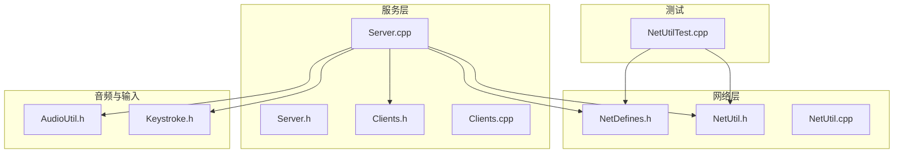
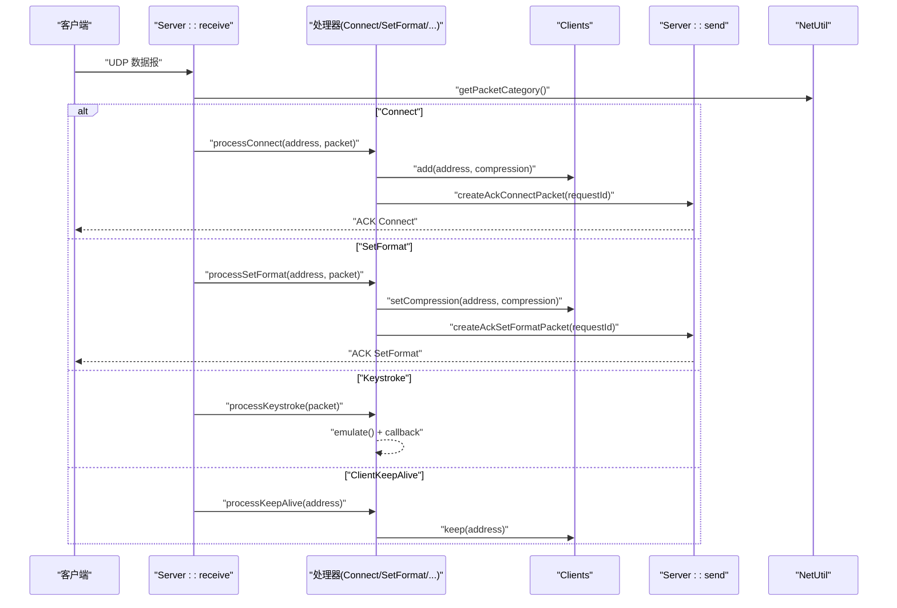
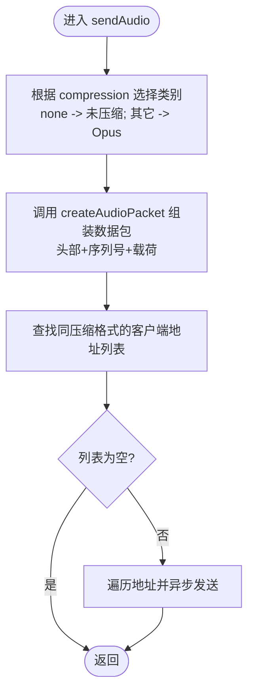
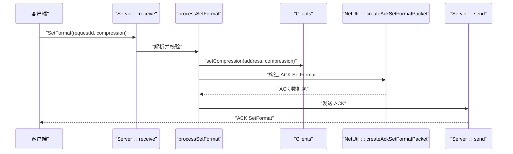
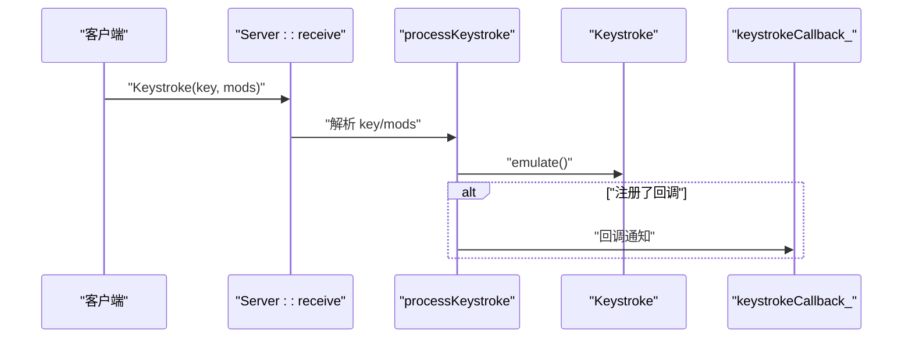
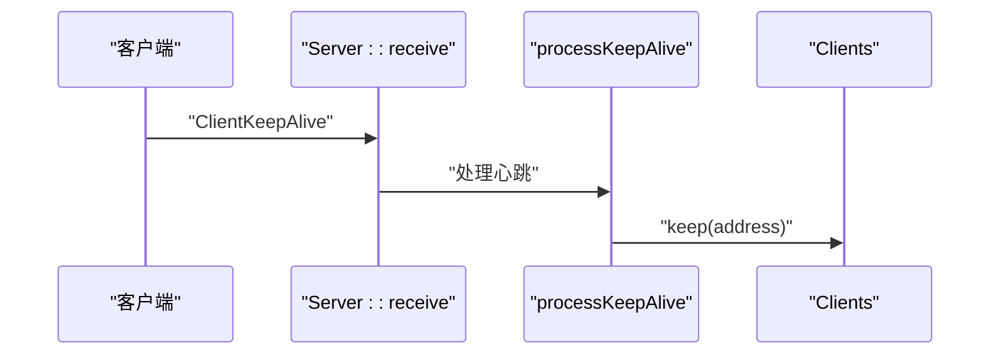
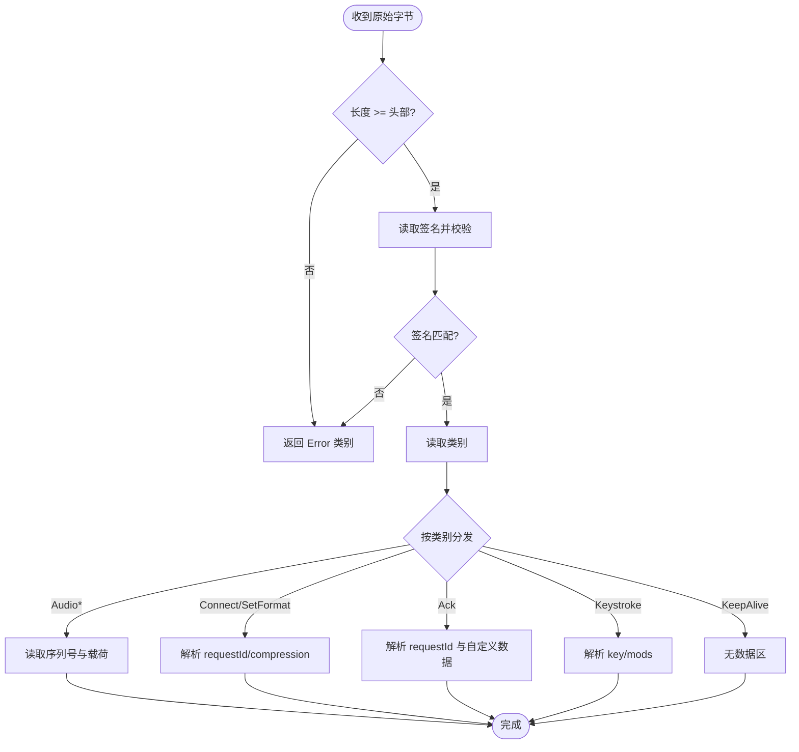
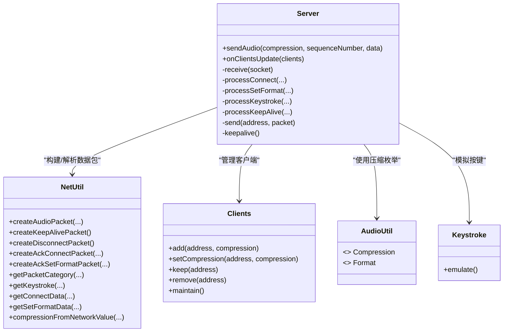

# 数据处理接口

<cite>
**本文引用的文件**   
- [NetDefines.h](file://SoundRemote/NetDefines.h)
- [NetUtil.cpp](file://SoundRemote/NetUtil.cpp)
- [NetUtil.h](file://SoundRemote/NetUtil.h)
- [Server.h](file://SoundRemote/Server.h)
- [Server.cpp](file://SoundRemote/Server.cpp)
- [Clients.h](file://SoundRemote/Clients.h)
- [Clients.cpp](file://SoundRemote/Clients.cpp)
- [AudioUtil.h](file://SoundRemote/AudioUtil.h)
- [Keystroke.h](file://SoundRemote/Keystroke.h)
- [NetUtilTest.cpp](file://Tests/NetUtilTest.cpp)
</cite>

## 目录
1. [简介](#简介)
2. [项目结构](#项目结构)
3. [核心组件](#核心组件)
4. [架构总览](#架构总览)
5. [详细组件分析](#详细组件分析)
6. [依赖关系分析](#依赖关系分析)
7. [性能与内存管理](#性能与内存管理)
8. [错误码与异常处理](#错误码与异常处理)
9. [结论](#结论)
10. [附录：协议与数据包格式](#附录协议与数据包格式)

## 简介
本文件为服务器端数据处理功能的API参考文档，聚焦于音频数据发送接口 sendAudio 的实现细节、UDP 数据包封装与解包流程、各类数据包的处理方法（如 processSetFormat、processKeystroke、processKeepAlive），以及序列号管理、压缩格式支持、分片策略、性能优化与内存管理、错误码与异常处理机制。读者可据此快速理解并正确使用服务器的网络与音频处理接口。

## 项目结构
本项目采用分层组织方式：
- 网络定义与工具：NetDefines.h、NetUtil.h/.cpp
- 服务端逻辑：Server.h/.cpp
- 客户端集合管理：Clients.h/.cpp
- 音频工具与类型：AudioUtil.h/.cpp
- 键盘事件模型：Keystroke.h/.cpp
- 单元测试：Tests/*

图表来源
- [NetDefines.h:1-69](file://SoundRemote/NetDefines.h#L1-L69)
- [NetUtil.h:1-41](file://SoundRemote/NetUtil.h#L1-L41)
- [NetUtil.cpp:1-218](file://SoundRemote/NetUtil.cpp#L1-L218)
- [Server.h:1-61](file://SoundRemote/Server.h#L1-L61)
- [Server.cpp:1-210](file://SoundRemote/Server.cpp#L1-L210)
- [Clients.h:1-60](file://SoundRemote/Clients.h#L1-L60)
- [Clients.cpp:1-125](file://SoundRemote/Clients.cpp#L1-L125)
- [AudioUtil.h:1-170](file://SoundRemote/AudioUtil.h#L1-L170)
- [Keystroke.h:1-41](file://SoundRemote/Keystroke.h#L1-L41)
- [NetUtilTest.cpp:1-133](file://Tests/NetUtilTest.cpp#L1-L133)

章节来源
- [NetDefines.h:1-69](file://SoundRemote/NetDefines.h#L1-L69)
- [NetUtil.h:1-41](file://SoundRemote/NetUtil.h#L1-L41)
- [NetUtil.cpp:1-218](file://SoundRemote/NetUtil.cpp#L1-L218)
- [Server.h:1-61](file://SoundRemote/Server.h#L1-L61)
- [Server.cpp:1-210](file://SoundRemote/Server.cpp#L1-L210)
- [Clients.h:1-60](file://SoundRemote/Clients.h#L1-L60)
- [Clients.cpp:1-125](file://SoundRemote/Clients.cpp#L1-L125)
- [AudioUtil.h:1-170](file://SoundRemote/AudioUtil.h#L1-L170)
- [Keystroke.h:1-41](file://SoundRemote/Keystroke.h#L1-L41)
- [NetUtilTest.cpp:1-133](file://Tests/NetUtilTest.cpp#L1-L133)

## 核心组件
- 网络协议常量与类型：定义协议签名、类别、头部偏移、各数据包大小、默认端口等。
- 网络工具：提供创建/解析 UDP 数据包、本地地址枚举、压缩值转换等能力。
- 服务端：基于 Boost.Asio 的异步 UDP 收发、连接/断开/设置格式/心跳/按键事件处理、向客户端广播音频数据。
- 客户端集合：维护在线客户端及其压缩配置、超时清理、变更通知。
- 音频工具：音频采样率/通道/编码参数、Opus 帧长与最大包大小等。
- 键盘事件：虚拟键码与修饰键位域，支持模拟按键。

章节来源
- [NetDefines.h:1-69](file://SoundRemote/NetDefines.h#L1-L69)
- [NetUtil.h:1-41](file://SoundRemote/NetUtil.h#L1-L41)
- [NetUtil.cpp:1-218](file://SoundRemote/NetUtil.cpp#L1-L218)
- [Server.h:1-61](file://SoundRemote/Server.h#L1-L61)
- [Server.cpp:1-210](file://SoundRemote/Server.cpp#L1-L210)
- [Clients.h:1-60](file://SoundRemote/Clients.h#L1-L60)
- [Clients.cpp:1-125](file://SoundRemote/Clients.cpp#L1-L125)
- [AudioUtil.h:1-170](file://SoundRemote/AudioUtil.h#L1-L170)
- [Keystroke.h:1-41](file://SoundRemote/Keystroke.h#L1-L41)

## 架构总览
服务器通过两个 UDP socket 分别负责接收与发送。接收协程循环读取数据报，按协议类别分发到对应处理器；发送侧将音频数据按目标客户端的压缩格式选择类别，组装后批量异步发送。

图表来源
- [Server.cpp:80-125](file://SoundRemote/Server.cpp#L80-L125)
- [Server.cpp:127-166](file://SoundRemote/Server.cpp#L127-L166)
- [NetUtil.cpp:171-218](file://SoundRemote/NetUtil.cpp#L171-L218)
- [Clients.cpp:5-42](file://SoundRemote/Clients.cpp#L5-L42)

## 详细组件分析

### 音频数据包发送接口 sendAudio
- 功能概述
  - 根据传入的压缩格式选择音频数据类别（未压缩或 Opus）。
  - 使用 NetUtil::createAudioPacket 组装包含协议头、序列号与音频载荷的数据包。
  - 遍历同压缩格式的客户端列表，异步发送。
- 关键参数
  - compression：音频压缩格式（none 表示未压缩，其他为 Opus 比特率档位）。
  - sequenceNumber：32 位递增序列号，用于对端去重/乱序检测。
  - data：音频载荷字节向量（已编码或未编码）。
- 行为说明
  - 当 compression 为 none 时，类别为“未压缩音频”；否则为“Opus 音频”。
  - 内部复用共享指针传递数据包，避免重复拷贝。
  - 仅向缓存中相同压缩格式的客户端广播。
- 序列号管理
  - 调用方需保证 sequenceNumber 单调递增，建议每帧加一。
  - 若出现跳变或回绕，对端应能容忍并丢弃旧包。
- 数据分片处理
  - 当前实现以完整帧为单位打包发送，不主动进行应用层分片。
  - 若单帧超过 MTU，建议在编码器侧控制帧大小，或在更高层做分片与重组（当前代码未实现）。
- 压缩格式支持
  - 网络侧压缩值映射到 Audio::Compression 枚举，支持 none、kbps_64、kbps_128、kbps_192、kbps_256、kbps_320。
  - 未知压缩值将被拒绝，不会加入客户端列表。
- 典型调用路径
  - 上层编码器生成音频帧 -> 递增序列号 -> 调用 sendAudio(compression, seq, frame)。

图表来源
- [Server.cpp:48-62](file://SoundRemote/Server.cpp#L48-L62)
- [NetUtil.cpp:129-140](file://SoundRemote/NetUtil.cpp#L129-L140)
- [AudioUtil.h:27-39](file://SoundRemote/AudioUtil.h#L27-L39)

章节来源
- [Server.h:27-31](file://SoundRemote/Server.h#L27-L31)
- [Server.cpp:48-62](file://SoundRemote/Server.cpp#L48-L62)
- [NetUtil.cpp:129-140](file://SoundRemote/NetUtil.cpp#L129-L140)
- [AudioUtil.h:27-39](file://SoundRemote/AudioUtil.h#L27-L39)

### 数据包类型处理方法

#### processSetFormat（设置音频格式）
- 触发条件：收到类别为 SetFormat 的数据包。
- 处理步骤
  - 解析请求 ID 与压缩值。
  - 校验压缩值是否合法，非法则忽略。
  - 更新该客户端的压缩格式。
  - 回复 ACK SetFormat（携带请求 ID）。
- 注意事项
  - 仅在客户端存在时生效；不存在则无法更新。
  - 后续音频发送将按新压缩格式广播。

图表来源
- [Server.cpp:143-153](file://SoundRemote/Server.cpp#L143-L153)
- [NetUtil.cpp:163-169](file://SoundRemote/NetUtil.cpp#L163-L169)

章节来源
- [Server.cpp:143-153](file://SoundRemote/Server.cpp#L143-L153)
- [NetUtil.cpp:207-217](file://SoundRemote/NetUtil.cpp#L207-L217)

#### processKeystroke（键盘事件）
- 触发条件：收到类别为 Keystroke 的数据包。
- 处理步骤
  - 解析 key 与 mods。
  - 在本地模拟按键。
  - 可选回调通知上层。
- 注意
  - 若解析失败则直接忽略。

图表来源
- [Server.cpp:155-162](file://SoundRemote/Server.cpp#L155-L162)
- [Keystroke.h:6-18](file://SoundRemote/Keystroke.h#L6-L18)

章节来源
- [Server.cpp:155-162](file://SoundRemote/Server.cpp#L155-L162)
- [NetUtil.cpp:182-191](file://SoundRemote/NetUtil.cpp#L182-L191)
- [Keystroke.h:6-18](file://SoundRemote/Keystroke.h#L6-L18)

#### processKeepAlive（心跳）
- 触发条件：收到类别为 ClientKeepAlive 的数据包。
- 处理步骤
  - 更新该客户端的最后接触时间。
  - 定时任务会清理长时间无心跳的客户端。

图表来源
- [Server.cpp:164-166](file://SoundRemote/Server.cpp#L164-L166)
- [Clients.cpp:29-35](file://SoundRemote/Clients.cpp#L29-L35)

章节来源
- [Server.cpp:164-166](file://SoundRemote/Server.cpp#L164-L166)
- [Clients.cpp:29-35](file://SoundRemote/Clients.cpp#L29-L35)

#### 连接与断开
- processConnect
  - 解析 ConnectData（协议版本、请求 ID、压缩值）。
  - 校验压缩值合法性，合法则添加客户端并回复 ACK Connect（含协议版本）。
- processDisconnect
  - 移除客户端。

章节来源
- [Server.cpp:127-141](file://SoundRemote/Server.cpp#L127-L141)
- [NetUtil.cpp:193-205](file://SoundRemote/NetUtil.cpp#L193-L205)
- [NetUtil.cpp:154-161](file://SoundRemote/NetUtil.cpp#L154-L161)

### UDP 数据包封装与解包流程
- 协议头字段
  - 签名（固定值）、类别、长度。
  - 数据区起始偏移由 headerSize 决定。
- 音频数据包
  - 头部 + 32 位序列号 + 音频载荷。
  - 未压缩与 Opus 使用不同类别区分。
- 控制类数据包
  - Connect/SetFormat/Ack/KeepAlive/Disconnect 等，各自有固定数据区布局。
- 解析流程
  - 先校验长度与签名，再提取类别。
  - 根据类别解析具体数据区。

图表来源
- [NetDefines.h:22-32](file://SoundRemote/NetDefines.h#L22-L32)
- [NetUtil.cpp:67-76](file://SoundRemote/NetUtil.cpp#L67-L76)
- [NetUtil.cpp:171-180](file://SoundRemote/NetUtil.cpp#L171-L180)
- [NetUtil.cpp:129-140](file://SoundRemote/NetUtil.cpp#L129-L140)
- [NetUtil.cpp:182-217](file://SoundRemote/NetUtil.cpp#L182-L217)

章节来源
- [NetDefines.h:1-69](file://SoundRemote/NetDefines.h#L1-L69)
- [NetUtil.cpp:67-76](file://SoundRemote/NetUtil.cpp#L67-L76)
- [NetUtil.cpp:171-180](file://SoundRemote/NetUtil.cpp#L171-L180)
- [NetUtil.cpp:129-140](file://SoundRemote/NetUtil.cpp#L129-L140)
- [NetUtil.cpp:182-217](file://SoundRemote/NetUtil.cpp#L182-L217)

## 依赖关系分析
- Server 依赖 NetUtil 进行数据包构建与解析，依赖 Clients 管理在线客户端，依赖 AudioUtil 的压缩枚举与 Opus 参数。
- Clients 维护客户端状态与超时清理，并通过监听器通知变化。
- NetUtil 依赖系统 API 获取本地 IP 列表，并提供跨平台字节序读写辅助。

图表来源
- [Server.h:20-61](file://SoundRemote/Server.h#L20-L61)
- [Server.cpp:1-210](file://SoundRemote/Server.cpp#L1-L210)
- [Clients.h:15-52](file://SoundRemote/Clients.h#L15-L52)
- [Clients.cpp:1-125](file://SoundRemote/Clients.cpp#L1-L125)
- [NetUtil.h:11-40](file://SoundRemote/NetUtil.h#L11-L40)
- [NetUtil.cpp:1-218](file://SoundRemote/NetUtil.cpp#L1-L218)
- [AudioUtil.h:24-39](file://SoundRemote/AudioUtil.h#L24-L39)
- [Keystroke.h:6-18](file://SoundRemote/Keystroke.h#L6-L18)

章节来源
- [Server.h:20-61](file://SoundRemote/Server.h#L20-L61)
- [Server.cpp:1-210](file://SoundRemote/Server.cpp#L1-L210)
- [Clients.h:15-52](file://SoundRemote/Clients.h#L15-L52)
- [Clients.cpp:1-125](file://SoundRemote/Clients.cpp#L1-L125)
- [NetUtil.h:11-40](file://SoundRemote/NetUtil.h#L11-L40)
- [NetUtil.cpp:1-218](file://SoundRemote/NetUtil.cpp#L1-L218)
- [AudioUtil.h:24-39](file://SoundRemote/AudioUtil.h#L24-L39)
- [Keystroke.h:6-18](file://SoundRemote/Keystroke.h#L6-L18)

## 性能与内存管理
- 减少拷贝
  - sendAudio 使用 std::shared_ptr<std::vector<char>> 传递数据包，避免多次复制。
  - 发送前统一构建一次，多个目标复用同一缓冲。
- 异步 I/O
  - 使用 Boost.Asio 的 async_send_to 与协程 receive，降低阻塞开销。
- 批量广播
  - onClientsUpdate 将客户端按压缩格式分组缓存，sendAudio 可直接遍历同组地址，减少查找成本。
- 内存池与对象复用
  - 可在高频路径引入对象池复用 vector 或 span，减少分配释放抖动。
- 帧大小与 MTU
  - 编码器侧控制帧大小，确保单包不超过链路 MTU，避免 IP 层分片带来的丢包风险。
- 心跳与清理
  - 定期 maintain 清理超时客户端，防止资源泄漏。

[本节为通用指导，无需特定文件引用]

## 错误码与异常处理
- 网络层错误
  - 接收协程捕获 boost::asio::system_error，若非操作中止则显示错误并退出进程。
  - 发送回调 handleSend 在发生错误时抛出运行时异常。
- 协议校验错误
  - getPacketCategory 在长度不足或签名不匹配时返回 Error 类别。
  - 解析 Connect/SetFormat/Keystroke 时若数据不完整，返回空结果，调用方忽略。
- 音频错误
  - AudioUtil 提供 throwOnError/exitOnError/processError 等工具，结合 Location 定位错误位置。
- 常见异常场景
  - 未知压缩值：被拒绝，不会加入客户端列表。
  - 心跳缺失：客户端被清理。
  - 发送失败：记录错误并终止进程（当前实现）。

章节来源
- [Server.cpp:111-124](file://SoundRemote/Server.cpp#L111-L124)
- [Server.cpp:176-180](file://SoundRemote/Server.cpp#L176-L180)
- [NetUtil.cpp:171-180](file://SoundRemote/NetUtil.cpp#L171-L180)
- [NetUtil.cpp:182-217](file://SoundRemote/NetUtil.cpp#L182-L217)
- [AudioUtil.cpp:77-101](file://SoundRemote/AudioUtil.cpp#L77-L101)

## 结论
本 API 围绕 UDP 协议实现了稳定的音频流与控制面交互。sendAudio 作为核心出口，配合序列号管理与压缩格式选择，满足低延迟音频传输需求。通过分类处理与异步 I/O，系统在并发与吞吐方面具备良好表现。建议在生产环境中进一步引入对象池、MTU 适配与更完善的错误恢复策略。

[本节为总结性内容，无需特定文件引用]

## 附录：协议与数据包格式
- 协议常量
  - 签名：固定 16 位值。
  - 类别：包括 Connect、Disconnect、SetFormat、Keystroke、AudioDataUncompressed、AudioDataOpus、ClientKeepAlive、ServerKeepAlive、Ack、Error。
  - 头部大小与偏移：headerSize、signatureOffset、categoryOffset、sizeOffset、dataOffset。
- 音频数据包
  - 头部 + 32 位序列号 + 音频载荷。
  - 未压缩与 Opus 使用不同类别区分。
- 控制类数据包
  - Connect：protocol、requestId、compression。
  - SetFormat：requestId、compression。
  - Ack：requestId、自定义数据（例如协议版本）。
  - Keystroke：key、mods。
  - KeepAlive：无数据区。
  - Disconnect：无数据区。
- 压缩值映射
  - 0 -> none；1..5 -> kbps_64..kbps_320；其他无效。
- 默认端口
  - 服务器端口与客户端端口常量定义。

章节来源
- [NetDefines.h:10-38](file://SoundRemote/NetDefines.h#L10-L38)
- [NetDefines.h:45-68](file://SoundRemote/NetDefines.h#L45-L68)
- [NetUtil.cpp:110-127](file://SoundRemote/NetUtil.cpp#L110-L127)
- [NetUtil.cpp:129-169](file://SoundRemote/NetUtil.cpp#L129-L169)
- [NetUtilTest.cpp:29-120](file://Tests/NetUtilTest.cpp#L29-L120)