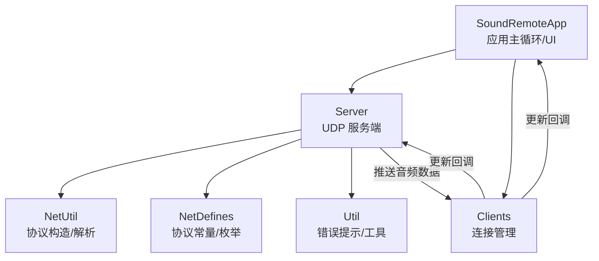
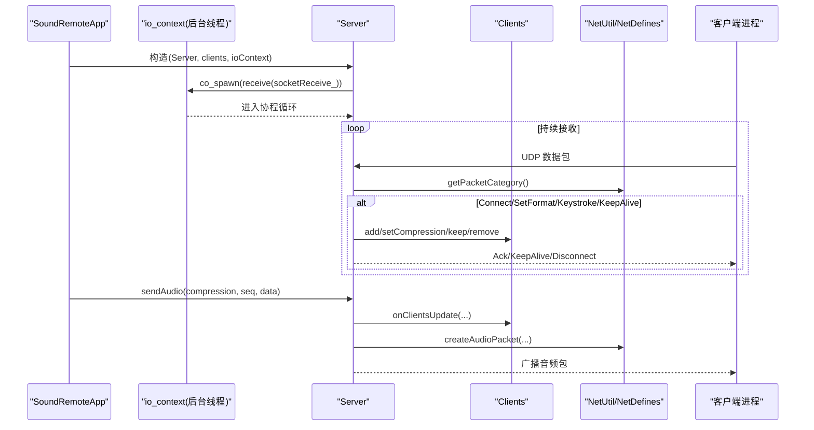
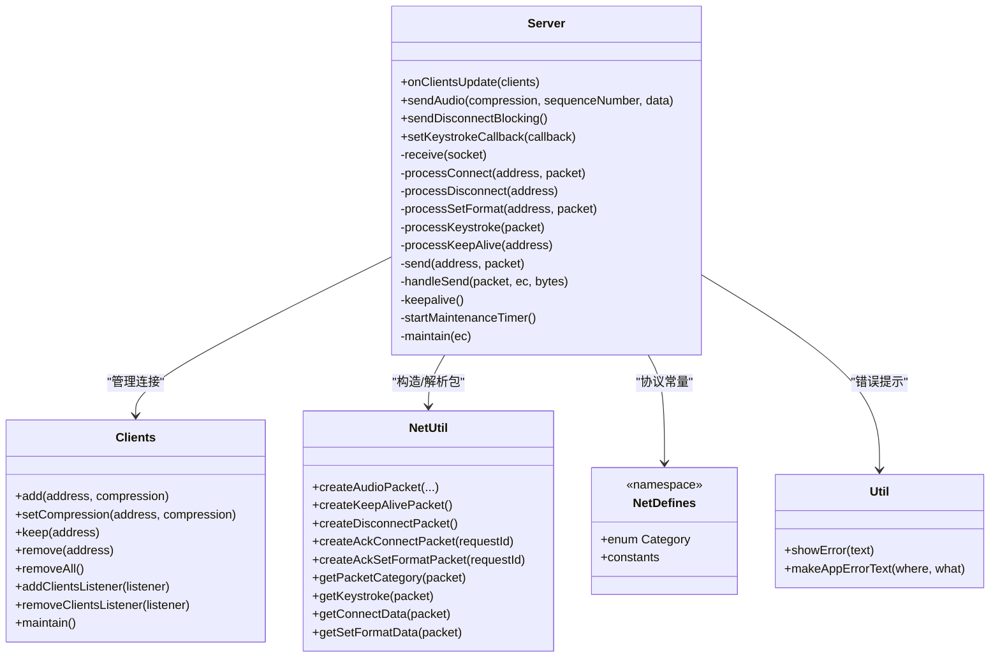
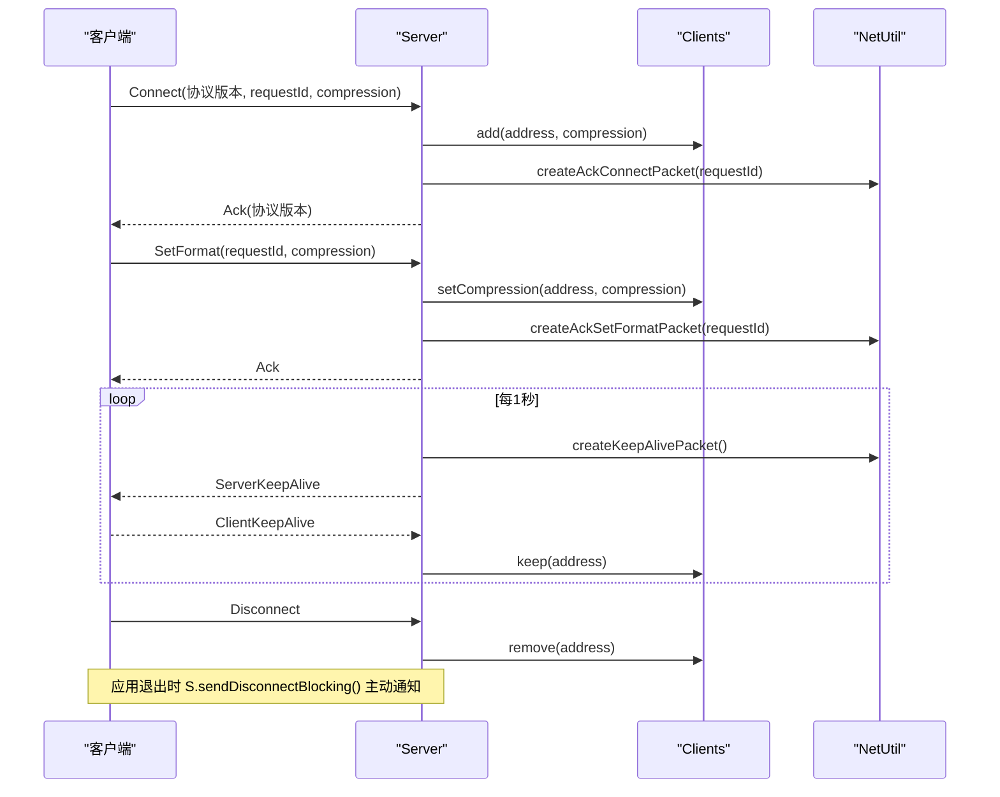

# 服务器接口

<cite>
**本文引用的文件**   
- [Server.h](file://SoundRemote/Server.h)
- [Server.cpp](file://SoundRemote/Server.cpp)
- [Clients.h](file://SoundRemote/Clients.h)
- [Clients.cpp](file://SoundRemote/Clients.cpp)
- [NetDefines.h](file://SoundRemote/NetDefines.h)
- [NetUtil.h](file://SoundRemote/NetUtil.h)
- [NetUtil.cpp](file://SoundRemote/NetUtil.cpp)
- [Util.h](file://SoundRemote/Util.h)
- [SoundRemoteApp.h](file://SoundRemote/SoundRemoteApp.h)
- [SoundRemoteApp.cpp](file://SoundRemote/SoundRemoteApp.cpp)
</cite>

## 目录
1. [简介](#简介)
2. [项目结构](#项目结构)
3. [核心组件](#核心组件)
4. [架构总览](#架构总览)
5. [详细组件分析](#详细组件分析)
6. [依赖关系分析](#依赖关系分析)
7. [性能与并发](#性能与并发)
8. [故障排查指南](#故障排查指南)
9. [结论](#结论)
10. [附录：API参考](#附录api参考)

## 简介
本文件为 Server 类的完整 API 参考文档，覆盖以下方面：
- 服务器的启动与停止（生命周期）
- 客户端连接管理方法
- 数据包发送与接收函数
- 异步网络 IO 实现机制、回调函数使用方式与错误处理策略
- 客户端连接生命周期管理的示例流程（建立、传输、断开）
- 性能监控接口、日志输出方法与调试工具集成
- 多线程安全考虑与资源管理最佳实践

## 项目结构
本项目采用分层组织：
- 应用层：SoundRemoteApp 负责 UI、设置、事件循环与整体编排
- 网络层：Server 基于 Boost.Asio 提供 UDP 收发、协议解析分发、心跳与定时维护
- 连接管理：Clients 维护活跃客户端集合、压缩格式映射、超时清理与监听器通知
- 协议与编解码：NetDefines/NetUtil 定义协议头、包类别、构造/解析函数；Audio/Keystroke 等模块负责媒体与输入事件
- 通用工具：Util 提供错误提示、版本比较等

图表来源
- [SoundRemoteApp.cpp:91-125](file://SoundRemote/SoundRemoteApp.cpp#L91-L125)
- [Server.cpp:18-28](file://SoundRemote/Server.cpp#L18-L28)
- [Clients.cpp:64-80](file://SoundRemote/Clients.cpp#L64-L80)
- [NetUtil.cpp:129-169](file://SoundRemote/NetUtil.cpp#L129-L169)
- [NetDefines.h:47-58](file://SoundRemote/NetDefines.h#L47-L58)

章节来源
- [SoundRemoteApp.cpp:91-125](file://SoundRemote/SoundRemoteApp.cpp#L91-L125)
- [Server.cpp:18-28](file://SoundRemote/Server.cpp#L18-L28)
- [Clients.cpp:64-80](file://SoundRemote/Clients.cpp#L64-L80)
- [NetUtil.cpp:129-169](file://SoundRemote/NetUtil.cpp#L129-L169)
- [NetDefines.h:47-58](file://SoundRemote/NetDefines.h#L47-L58)

## 核心组件
- Server：封装 UDP 套接字、协程接收循环、协议分发、保活与定时维护、按键事件回调、音频广播。
- Clients：线程安全的客户端集合，支持添加/删除/保持、压缩格式切换、超时清理、监听器通知。
- NetUtil/NetDefines：协议头、包类别、构造与解析工具。
- SoundRemoteApp：应用入口，创建并运行 Server，绑定监听器，驱动 io_context。

章节来源
- [Server.h:20-60](file://SoundRemote/Server.h#L20-L60)
- [Server.cpp:18-28](file://SoundRemote/Server.cpp#L18-L28)
- [Clients.h:15-52](file://SoundRemote/Clients.h#L15-L52)
- [Clients.cpp:5-18](file://SoundRemote/Clients.cpp#L5-L18)
- [NetUtil.h:26-40](file://SoundRemote/NetUtil.h#L26-L40)
- [NetDefines.h:47-58](file://SoundRemote/NetDefines.h#L47-L58)
- [SoundRemoteApp.cpp:104-110](file://SoundRemote/SoundRemoteApp.cpp#L104-L110)

## 架构总览
Server 在独立线程中运行 boost::asio::io_context，内部通过协程 receive 持续从 UDP socketReceive_ 接收数据包，按协议类别分发给具体处理器；同时每秒钟触发一次维护任务，向所有已知客户端发送保活包并清理超时连接。音频数据由上层通过 sendAudio 批量发送到已注册客户端。

图表来源
- [Server.cpp:18-28](file://SoundRemote/Server.cpp#L18-L28)
- [Server.cpp:80-125](file://SoundRemote/Server.cpp#L80-L125)
- [Server.cpp:127-166](file://SoundRemote/Server.cpp#L127-L166)
- [Server.cpp:168-180](file://SoundRemote/Server.cpp#L168-L180)
- [Server.cpp:182-209](file://SoundRemote/Server.cpp#L182-L209)
- [Server.cpp:48-62](file://SoundRemote/Server.cpp#L48-L62)
- [NetUtil.cpp:129-169](file://SoundRemote/NetUtil.cpp#L129-L169)
- [NetDefines.h:47-58](file://SoundRemote/NetDefines.h#L47-L58)

## 详细组件分析

### Server 类 API 参考
- 构造函数
  - 作用：初始化发送/接收 UDP socket，启动接收协程与定时维护任务。
  - 参数：clientPort（客户端端口）、serverPort（服务端监听端口）、ioContext（Boost.Asio I/O上下文）、clients（客户端管理器）。
  - 行为：co_spawn 启动 receive 协程；startMaintenanceTimer 启动每秒维护。
  - 异常：构造过程可能抛出系统或配置相关异常，需由调用方捕获。
  - 参考路径：[Server.cpp:18-28](file://SoundRemote/Server.cpp#L18-L28)

- 析构函数
  - 作用：关闭接收/发送 socket，释放资源。
  - 参考路径：[Server.cpp:30-35](file://SoundRemote/Server.cpp#L30-L35)

- onClientsUpdate(std::forward_list<ClientInfo>)
  - 作用：根据客户端列表重建本地缓存（按压缩类型分组），用于高效广播。
  - 线程模型：由 Clients 监听器回调触发，通常在 UI 线程或任意线程调用，内部无锁直接替换缓存。
  - 参考路径：[Server.cpp:37-46](file://SoundRemote/Server.cpp#L37-L46)

- sendAudio(Audio::Compression, SequenceNumberType, std::vector<char>)
  - 作用：将音频数据打包并按压缩类型广播到对应客户端集合。
  - 行为：选择包类别（未压缩/Opus），构造音频包，遍历地址列表调用 send。
  - 参考路径：[Server.cpp:48-62](file://SoundRemote/Server.cpp#L48-L62)

- sendDisconnectBlocking()
  - 作用：阻塞式向所有已知客户端发送断开包。
  - 行为：若缓存为空则返回；否则同步 send_to 逐个发送。
  - 异常：底层发送失败会抛出系统错误。
  - 参考路径：[Server.cpp:64-74](file://SoundRemote/Server.cpp#L64-L74)

- setKeystrokeCallback(KeystrokeCallback)
  - 作用：注册按键事件回调，收到 Keystroke 后先模拟按键，再调用用户回调。
  - 参考路径：[Server.cpp:76-78](file://SoundRemote/Server.cpp#L76-L78), [Server.cpp:155-162](file://SoundRemote/Server.cpp#L155-L162)

- receive(boost::asio::ip::udp::socket&)
  - 作用：协程接收循环，持续读取 UDP 数据报，解析类别并分发。
  - 错误处理：捕获 system_error（忽略 operation_aborted）、std::exception 与未知异常，记录错误并退出进程。
  - 参考路径：[Server.cpp:80-125](file://SoundRemote/Server.cpp#L80-L125)

- processConnect / processDisconnect / processSetFormat / processKeystroke / processKeepAlive
  - 作用：分别处理连接、断开、格式设置、按键、保活四类消息。
  - 行为：调用 Clients 进行增删改查与时间戳更新，必要时回复 Ack/KeepAlive。
  - 参考路径：[Server.cpp:127-166](file://SoundRemote/Server.cpp#L127-L166)

- send(address, packet_ptr)
  - 作用：异步发送数据报至指定地址与 clientPort。
  - 完成回调：handleSend 检查错误码，出错时抛出运行时异常。
  - 参考路径：[Server.cpp:168-180](file://SoundRemote/Server.cpp#L168-L180)

- startMaintenanceTimer / maintain / keepalive
  - 作用：每秒触发一次，发送保活包并执行 Clients::maintain 清理超时连接。
  - 参考路径：[Server.cpp:182-209](file://SoundRemote/Server.cpp#L182-L209)

- 成员变量
  - socketSend_/socketReceive_：UDP 套接字
  - maintainenanceTimer_：定时器
  - clientPort_：客户端端口
  - keystrokeCallback_：按键回调
  - clients_：客户端管理器
  - clientsCache_：按压缩类型分组的地址缓存

章节来源
- [Server.h:20-60](file://SoundRemote/Server.h#L20-L60)
- [Server.cpp:18-28](file://SoundRemote/Server.cpp#L18-L28)
- [Server.cpp:30-35](file://SoundRemote/Server.cpp#L30-L35)
- [Server.cpp:37-46](file://SoundRemote/Server.cpp#L37-L46)
- [Server.cpp:48-62](file://SoundRemote/Server.cpp#L48-L62)
- [Server.cpp:64-74](file://SoundRemote/Server.cpp#L64-L74)
- [Server.cpp:76-78](file://SoundRemote/Server.cpp#L76-L78)
- [Server.cpp:80-125](file://SoundRemote/Server.cpp#L80-L125)
- [Server.cpp:127-166](file://SoundRemote/Server.cpp#L127-L166)
- [Server.cpp:168-180](file://SoundRemote/Server.cpp#L168-L180)
- [Server.cpp:182-209](file://SoundRemote/Server.cpp#L182-L209)

### Clients 类 API 参考
- 构造(Clients(int timeoutSeconds = 5))
  - 作用：设置超时秒数，默认 5 秒。
  - 参考路径：[Clients.cpp:3](file://SoundRemote/Clients.cpp#L3)

- add(address, compression)
  - 作用：新增或更新客户端压缩格式，更新时间戳，触发监听器。
  - 线程安全：加锁。
  - 参考路径：[Clients.cpp:5-18](file://SoundRemote/Clients.cpp#L5-L18)

- setCompression(address, compression)
  - 作用：仅当存在且不同才更新压缩格式并通知。
  - 线程安全：加锁。
  - 参考路径：[Clients.cpp:20-27](file://SoundRemote/Clients.cpp#L20-L27)

- keep(address)
  - 作用：刷新最近联系时间。
  - 线程安全：加锁。
  - 参考路径：[Clients.cpp:29-35](file://SoundRemote/Clients.cpp#L29-L35)

- remove(address) / removeAll()
  - 作用：移除单个或全部客户端，触发监听器。
  - 线程安全：加锁。
  - 参考路径：[Clients.cpp:37-51](file://SoundRemote/Clients.cpp#L37-L51)

- addClientsListener(listener) / removeClientsListener(listener)
  - 作用：注册/注销客户端变化监听器；注册时会立即推送当前快照。
  - 注意：监听器列表修改不在互斥保护下，建议在程序启动期或设备变更时操作。
  - 参考路径：[Clients.cpp:53-62](file://SoundRemote/Clients.cpp#L53-L62)

- maintain()
  - 作用：扫描并移除超过 timeoutSeconds 的客户端，若有删除则通知监听器。
  - 线程安全：加锁。
  - 参考路径：[Clients.cpp:64-80](file://SoundRemote/Clients.cpp#L64-L80)

- ClientInfo 结构体
  - 字段：address、compression；提供相等性比较。
  - 参考路径：[Clients.h:54-60](file://SoundRemote/Clients.h#L54-L60)

章节来源
- [Clients.h:15-52](file://SoundRemote/Clients.h#L15-L52)
- [Clients.cpp:3-80](file://SoundRemote/Clients.cpp#L3-L80)
- [Clients.cpp:53-62](file://SoundRemote/Clients.cpp#L53-L62)
- [Clients.cpp:64-80](file://SoundRemote/Clients.cpp#L64-L80)
- [Clients.h:54-60](file://SoundRemote/Clients.h#L54-L60)

### 协议与工具（NetUtil/NetDefines）
- 包类别 Category：包含 Connect、Disconnect、SetFormat、Keystroke、AudioDataUncompressed、AudioDataOpus、ClientKeepAlive、ServerKeepAlive、Ack、Error 等。
- 关键常量：protocolSignature、headerSize、dataOffset、inputPacketSize、defaultServerPort/defaultClientPort。
- 构造/解析函数：createAudioPacket、createKeepAlivePacket、createDisconnectPacket、createAckConnectPacket、createAckSetFormatPacket、getPacketCategory、getKeystroke、getConnectData、getSetFormatData。
- 参考路径：
  - [NetDefines.h:47-58](file://SoundRemote/NetDefines.h#L47-L58)
  - [NetDefines.h:60-68](file://SoundRemote/NetDefines.h#L60-L68)
  - [NetUtil.h:26-40](file://SoundRemote/NetUtil.h#L26-L40)
  - [NetUtil.cpp:129-169](file://SoundRemote/NetUtil.cpp#L129-L169)
  - [NetUtil.cpp:171-217](file://SoundRemote/NetUtil.cpp#L171-L217)

章节来源
- [NetDefines.h:47-58](file://SoundRemote/NetDefines.h#L47-L58)
- [NetDefines.h:60-68](file://SoundRemote/NetDefines.h#L60-L68)
- [NetUtil.h:26-40](file://SoundRemote/NetUtil.h#L26-L40)
- [NetUtil.cpp:129-169](file://SoundRemote/NetUtil.cpp#L129-L169)
- [NetUtil.cpp:171-217](file://SoundRemote/NetUtil.cpp#L171-L217)

### 应用集成（SoundRemoteApp）
- 启动流程：创建 Clients，注册监听器给 Server 和 UI；创建 Server 并绑定按键回调；启动 io_context 线程。
- 停止流程：发送断开包、停止采集、stop io_context。
- 参考路径：
  - [SoundRemoteApp.cpp:104-110](file://SoundRemote/SoundRemoteApp.cpp#L104-L110)
  - [SoundRemoteApp.cpp:127-131](file://SoundRemote/SoundRemoteApp.cpp#L127-L131)

章节来源
- [SoundRemoteApp.cpp:104-110](file://SoundRemote/SoundRemoteApp.cpp#L104-L110)
- [SoundRemoteApp.cpp:127-131](file://SoundRemote/SoundRemoteApp.cpp#L127-L131)

## 依赖关系分析
- Server 依赖：
  - Clients：连接状态与压缩格式管理
  - NetUtil/NetDefines：协议构造与解析
  - Util：错误提示
  - Boost.Asio：异步/协程网络 IO
- Clients 依赖：
  - Audio::Compression、Net::Address、标准库容器与互斥量
- SoundRemoteApp 依赖：
  - Server、Clients、Settings、CapturePipe、UI 控件

图表来源
- [Server.h:20-60](file://SoundRemote/Server.h#L20-L60)
- [Clients.h:15-52](file://SoundRemote/Clients.h#L15-L52)
- [NetUtil.h:26-40](file://SoundRemote/NetUtil.h#L26-L40)
- [NetDefines.h:47-58](file://SoundRemote/NetDefines.h#L47-L58)
- [Util.h:10-44](file://SoundRemote/Util.h#L10-L44)

章节来源
- [Server.h:20-60](file://SoundRemote/Server.h#L20-L60)
- [Clients.h:15-52](file://SoundRemote/Clients.h#L15-L52)
- [NetUtil.h:26-40](file://SoundRemote/NetUtil.h#L26-L40)
- [NetDefines.h:47-58](file://SoundRemote/NetDefines.h#L47-L58)
- [Util.h:10-44](file://SoundRemote/Util.h#L10-L44)

## 性能与并发
- 异步网络 IO
  - 接收端使用协程 receive 配合 use_awaitable 实现非阻塞接收循环，避免回调地狱与额外线程开销。
  - 发送端使用 async_send_to 异步发送，通过 handleSend 回调处理完成与错误。
- 定时维护
  - 每秒触发一次，发送保活包并清理超时连接，避免内存泄漏与僵尸连接。
- 线程安全
  - Clients 内部使用 shared_mutex 保护客户端集合，确保多线程访问安全。
  - Server 对客户端缓存的更新在 onClientsUpdate 中直接替换，避免长时间持锁。
- 资源管理
  - 析构中显式关闭 socket，防止句柄泄漏。
  - 发送时使用 shared_ptr 持有数据包，确保回调期间对象存活。
- 建议
  - 在高负载场景下，可考虑批量合并发送、零拷贝优化与更细粒度的缓存更新策略。
  - 对高频音频数据，建议在上层控制帧率与压缩率，平衡带宽与 CPU。

章节来源
- [Server.cpp:80-125](file://SoundRemote/Server.cpp#L80-L125)
- [Server.cpp:168-180](file://SoundRemote/Server.cpp#L168-L180)
- [Server.cpp:182-209](file://SoundRemote/Server.cpp#L182-L209)
- [Clients.cpp:64-80](file://SoundRemote/Clients.cpp#L64-L80)
- [Server.cpp:30-35](file://SoundRemote/Server.cpp#L30-L35)

## 故障排查指南
- 常见错误来源
  - 接收循环中的系统错误：除 operation_aborted 外均视为致命错误，记录并退出进程。
  - 发送回调错误：handleSend 抛出运行时异常，需在上层捕获或调整网络环境。
  - 定时器错误：非 operation_aborted 的错误同样抛出异常。
- 定位步骤
  - 检查端口占用与防火墙规则（defaultServerPort/defaultClientPort）。
  - 确认客户端是否正确发送 Connect/SetFormat/KeepAlive 包。
  - 查看 Util::showError 输出的错误文本，结合 makeAppErrorText 的上下文信息。
- 恢复措施
  - 重启服务并重新建立连接。
  - 调整超时时间以适配网络抖动。
  - 在 shutdown 前调用 sendDisconnectBlocking 主动通知客户端断开。

章节来源
- [Server.cpp:111-124](file://SoundRemote/Server.cpp#L111-L124)
- [Server.cpp:176-180](file://SoundRemote/Server.cpp#L176-L180)
- [Server.cpp:187-194](file://SoundRemote/Server.cpp#L187-L194)
- [Util.h:18-44](file://SoundRemote/Util.h#L18-L44)

## 结论
Server 类提供了简洁而强大的 UDP 服务端能力：协程驱动的接收循环、按类别分发的协议处理、高效的客户端缓存与广播、以及健壮的定时维护与错误处理。结合 Clients 的线程安全管理与 NetUtil 的协议工具，能够稳定支撑实时音频流与按键转发场景。

## 附录：API参考

### Server 公共接口一览
- 构造/析构
  - Server(int clientPort, int serverPort, boost::asio::io_context& ioContext, std::shared_ptr<Clients> clients)
  - ~Server()
- 连接与数据
  - void onClientsUpdate(std::forward_list<ClientInfo> clients)
  - void sendAudio(Audio::Compression compression, Net::Packet::SequenceNumberType sequenceNumber, std::vector<char> data)
  - void sendDisconnectBlocking()
- 回调与事件
  - void setKeystrokeCallback(KeystrokeCallback callback)

章节来源
- [Server.h:20-60](file://SoundRemote/Server.h#L20-L60)
- [Server.cpp:18-28](file://SoundRemote/Server.cpp#L18-L28)
- [Server.cpp:30-35](file://SoundRemote/Server.cpp#L30-L35)
- [Server.cpp:37-46](file://SoundRemote/Server.cpp#L37-L46)
- [Server.cpp:48-62](file://SoundRemote/Server.cpp#L48-L62)
- [Server.cpp:64-74](file://SoundRemote/Server.cpp#L64-L74)
- [Server.cpp:76-78](file://SoundRemote/Server.cpp#L76-L78)

### 客户端连接生命周期示例流程
- 建立连接
  - 客户端发送 Connect 包（含协议版本、请求 ID、压缩类型）
  - 服务端解析并调用 Clients::add，回复 AckConnect（携带协议版本）
- 数据传输
  - 客户端可选 SetFormat 更新压缩格式，服务端回复 AckSetFormat
  - 服务端周期性发送 ServerKeepAlive，客户端回发 ClientKeepAlive 维持活跃
  - 上层调用 sendAudio 广播音频数据
- 断开处理
  - 客户端发送 Disconnect，服务端调用 Clients::remove
  - 应用退出时调用 sendDisconnectBlocking 主动通知所有客户端

图表来源
- [Server.cpp:127-153](file://SoundRemote/Server.cpp#L127-L153)
- [Server.cpp:164-166](file://SoundRemote/Server.cpp#L164-L166)
- [Server.cpp:182-209](file://SoundRemote/Server.cpp#L182-L209)
- [NetUtil.cpp:154-169](file://SoundRemote/NetUtil.cpp#L154-L169)
- [NetUtil.cpp:142-152](file://SoundRemote/NetUtil.cpp#L142-L152)

### 错误处理策略
- 接收循环
  - 捕获 boost::system::system_error，忽略 operation_aborted，其他错误记录并退出进程
  - 捕获 std::exception 与未知异常，记录并退出进程
- 发送回调
  - 若 error_code 非空，抛出运行时异常
- 定时器
  - 非 operation_aborted 的错误抛出运行时异常

章节来源
- [Server.cpp:111-124](file://SoundRemote/Server.cpp#L111-L124)
- [Server.cpp:176-180](file://SoundRemote/Server.cpp#L176-L180)
- [Server.cpp:187-194](file://SoundRemote/Server.cpp#L187-L194)

### 性能监控与日志
- 性能监控
  - 可通过外部指标收集客户端数量、丢包率、延迟等（当前代码未内置专用监控接口）
  - 建议在上层统计 sendAudio 调用频率与大小、handleSend 错误计数
- 日志输出
  - 使用 Util::showError 显示错误弹窗
  - 可使用 Util::makeAppErrorText 生成带上下文的错误文本
- 调试工具
  - 使用 NetUtil::getLocalAddresses 获取本机 IPv4 列表辅助调试
  - 通过 Wireshark 抓包验证协议字段与序列号

章节来源
- [Util.h:18-44](file://SoundRemote/Util.h#L18-L44)
- [NetUtil.h:15-16](file://SoundRemote/NetUtil.h#L15-L16)

### 多线程安全与资源管理最佳实践
- 多线程安全
  - Clients 内部使用互斥量保护客户端集合，对外暴露线程安全接口
  - Server 的 onClientsUpdate 直接替换缓存，避免长时间持锁
- 资源管理
  - 析构中关闭 socket，防止句柄泄漏
  - 发送时使用 shared_ptr 保证回调期间对象存活
- 建议
  - 在应用退出前调用 sendDisconnectBlocking 优雅断开
  - 合理设置超时时间与保活间隔，避免误删活跃连接

章节来源
- [Clients.cpp:5-18](file://SoundRemote/Clients.cpp#L5-L18)
- [Clients.cpp:64-80](file://SoundRemote/Clients.cpp#L64-L80)
- [Server.cpp:30-35](file://SoundRemote/Server.cpp#L30-L35)
- [Server.cpp:64-74](file://SoundRemote/Server.cpp#L64-L74)