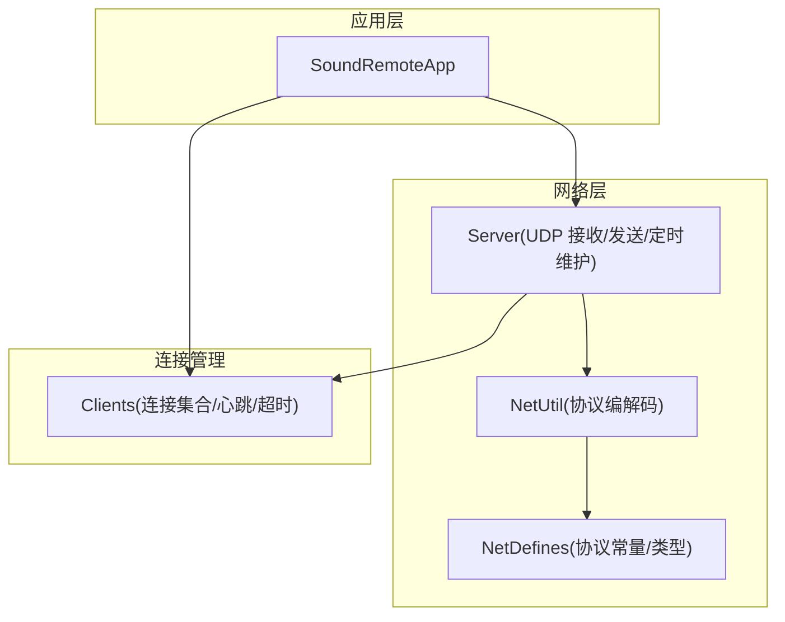
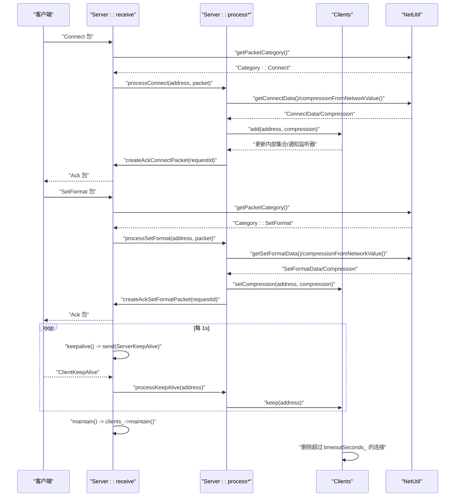
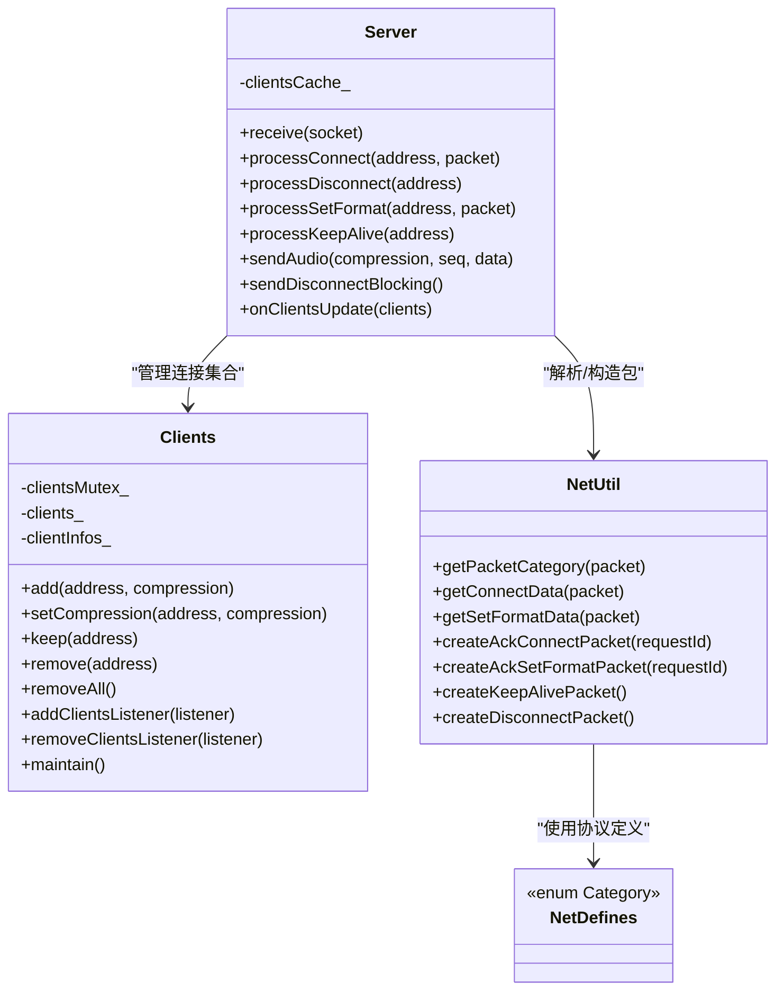

# 连接管理接口

<cite>
**本文引用的文件**   
- [Clients.h](file://SoundRemote/Clients.h)
- [Clients.cpp](file://SoundRemote/Clients.cpp)
- [Server.h](file://SoundRemote/Server.h)
- [Server.cpp](file://SoundRemote/Server.cpp)
- [NetDefines.h](file://SoundRemote/NetDefines.h)
- [NetUtil.h](file://SoundRemote/NetUtil.h)
- [NetUtil.cpp](file://SoundRemote/NetUtil.cpp)
- [SoundRemoteApp.h](file://SoundRemote/SoundRemoteApp.h)
- [SoundRemoteApp.cpp](file://SoundRemote/SoundRemoteApp.cpp)
- [ClientsTest.cpp](file://Tests/ClientsTest.cpp)
</cite>

## 目录
1. [简介](#简介)
2. [项目结构](#项目结构)
3. [核心组件](#核心组件)
4. [架构总览](#架构总览)
5. [详细组件分析](#详细组件分析)
6. [依赖关系分析](#依赖关系分析)
7. [性能与并发特性](#性能与并发特性)
8. [故障排查指南](#故障排查指南)
9. [结论](#结论)
10. [附录：API 参考与示例](#附录api-参考与示例)

## 简介
本文件为服务器端“连接管理”功能的完整 API 文档，聚焦于客户端连接的建立、维护与断开处理机制。重点覆盖以下方面：
- processConnect、processDisconnect 的实现原理与参数说明
- 客户端生命周期管理：连接状态跟踪、心跳检测与超时清理
- 多客户端并发连接的处理策略与最佳实践
- 连接池（按压缩格式分组）管理与资源清理机制
- 错误处理与异常恢复建议

## 项目结构
本项目采用分层设计：
- 网络协议定义与编解码：NetDefines.h、NetUtil.h/.cpp
- 服务端主逻辑与异步 I/O：Server.h/.cpp
- 客户端连接集合与生命周期：Clients.h/.cpp
- 应用入口与 UI 集成：SoundRemoteApp.h/.cpp
- 单元测试：ClientsTest.cpp

图表来源
- [Server.cpp:18-28](file://SoundRemote/Server.cpp#L18-L28)
- [Clients.cpp:1-10](file://SoundRemote/Clients.cpp#L1-L10)
- [NetUtil.cpp:171-180](file://SoundRemote/NetUtil.cpp#L171-L180)

章节来源
- [SoundRemoteApp.cpp:104-110](file://SoundRemote/SoundRemoteApp.cpp#L104-L110)
- [Server.cpp:18-28](file://SoundRemote/Server.cpp#L18-L28)
- [Clients.cpp:1-10](file://SoundRemote/Clients.cpp#L1-L10)
- [NetDefines.h:47-58](file://SoundRemote/NetDefines.h#L47-L58)

## 核心组件
- Clients：维护已连接客户端集合，提供添加、更新压缩格式、保活、移除、全量清理、监听器通知、以及基于最后接触时间的超时维护能力。内部使用共享互斥保证线程安全。
- Server：基于 Boost.Asio 的 UDP 收发与协程化 receive；解析数据包类别并分发到具体处理器；维护客户端缓存（按压缩格式分组），周期性发送心跳并触发连接维护。
- NetUtil/NetDefines：定义协议头、包类别、字段偏移与编解码函数，负责将原始字节流转换为结构化数据。

章节来源
- [Clients.h:15-52](file://SoundRemote/Clients.h#L15-L52)
- [Clients.cpp:5-80](file://SoundRemote/Clients.cpp#L5-L80)
- [Server.h:20-60](file://SoundRemote/Server.h#L20-L60)
- [Server.cpp:80-125](file://SoundRemote/Server.cpp#L80-L125)
- [NetDefines.h:47-69](file://SoundRemote/NetDefines.h#L47-L69)
- [NetUtil.h:26-40](file://SoundRemote/NetUtil.h#L26-L40)

## 架构总览
下图展示了从客户端发起连接到服务端处理的端到端流程，包括握手、设置音频格式、心跳与超时清理。

图表来源
- [Server.cpp:80-125](file://SoundRemote/Server.cpp#L80-L125)
- [Server.cpp:127-166](file://SoundRemote/Server.cpp#L127-L166)
- [NetUtil.cpp:171-180](file://SoundRemote/NetUtil.cpp#L171-L180)
- [NetUtil.cpp:193-217](file://SoundRemote/NetUtil.cpp#L193-L217)
- [Clients.cpp:64-80](file://SoundRemote/Clients.cpp#L64-L80)

## 详细组件分析

### 连接建立：processConnect
- 功能：处理来自客户端的连接请求，校验协议版本与压缩格式，登记客户端，并返回 Ack。
- 输入参数：
  - address：客户端地址（boost::asio::ip::address）
  - packet：原始数据包（std::span<char>）
- 关键步骤：
  - 解析头部类别为 Connect
  - 解析 ConnectData（包含协议版本、requestId、压缩格式）
  - 将网络压缩值映射为本地 Audio::Compression
  - 调用 Clients::add 登记或更新连接
  - 构造并发送 AckConnect 包（携带 requestId 与协议版本）
- 返回值：无（void）
- 异常与错误：
  - 若解析失败（长度不足、非法压缩值等），直接返回不处理
  - 发送失败在 handleSend 中抛出运行时异常（见后文“错误处理”）

章节来源
- [Server.cpp:127-137](file://SoundRemote/Server.cpp#L127-L137)
- [NetUtil.cpp:193-205](file://SoundRemote/NetUtil.cpp#L193-L205)
- [NetUtil.cpp:110-127](file://SoundRemote/NetUtil.cpp#L110-L127)
- [NetDefines.h:33-38](file://SoundRemote/NetDefines.h#L33-L38)

### 连接断开：processDisconnect
- 功能：处理客户端主动断开的请求，从连接集合中移除该客户端。
- 输入参数：
  - address：客户端地址
- 关键步骤：
  - 调用 Clients::remove 删除对应地址
  - 通过监听器通知上层（如 UI 列表刷新）
- 返回值：无（void）

章节来源
- [Server.cpp:139-141](file://SoundRemote/Server.cpp#L139-L141)
- [Clients.cpp:37-42](file://SoundRemote/Clients.cpp#L37-L42)

### 设置音频格式：processSetFormat
- 功能：动态更新某客户端的压缩格式，并返回 Ack。
- 输入参数：
  - address：客户端地址
  - packet：原始数据包（含 SetFormatData）
- 关键步骤：
  - 解析 SetFormatData（requestId、压缩格式）
  - 映射压缩值并调用 Clients::setCompression
  - 构造并发送 AckSetFormat 包

章节来源
- [Server.cpp:143-153](file://SoundRemote/Server.cpp#L143-L153)
- [NetUtil.cpp:207-217](file://SoundRemote/NetUtil.cpp#L207-L217)
- [Clients.cpp:20-27](file://SoundRemote/Clients.cpp#L20-L27)

### 心跳与保活：processKeepAlive 与 keepalive/maintain
- 客户端心跳：
  - 客户端定期发送 ClientKeepAlive 包
  - Server::processKeepAlive 调用 Clients::keep 更新该客户端的最后接触时间
- 服务端心跳：
  - 定时器每秒触发 keepalive()，向所有已知客户端广播 ServerKeepAlive
- 超时清理：
  - maintain() 周期调用 clients_->maintain()
  - Clients::maintain 遍历连接集合，删除 lastContact 超过 timeoutSeconds_ 的连接，并通知监听器

章节来源
- [Server.cpp:164-166](file://SoundRemote/Server.cpp#L164-L166)
- [Server.cpp:182-199](file://SoundRemote/Server.cpp#L182-L199)
- [Clients.cpp:64-80](file://SoundRemote/Clients.cpp#L64-L80)

### 连接集合与监听器：Clients
- 数据结构：
  - 内部 map：Address -> Client（含压缩格式与最后接触时间）
  - 外部视图：forward_list<ClientInfo> 用于监听器回调
- 线程安全：
  - 使用 shared_mutex 保护内部 map 的读写
  - 监听器列表未加锁（仅在程序启动和设备变更时修改）
- 主要方法：
  - add/setCompression/keep/remove/removeAll
  - addClientsListener/removeClientsListener
  - maintain：超时清理
  - updateAndNotify：重建 ClientInfo 列表并通知监听器

章节来源
- [Clients.h:15-52](file://SoundRemote/Clients.h#L15-L52)
- [Clients.cpp:5-98](file://SoundRemote/Clients.cpp#L5-L98)

### 连接缓存与广播：Server::onClientsUpdate / sendAudio
- onClientsUpdate：当 Clients 内部集合变化时，Server 将其按压缩格式分组缓存到 clientsCache_，便于后续按格式快速广播
- sendAudio：根据压缩格式选择包类别，构建音频包，并向对应组内所有地址发送

章节来源
- [Server.cpp:37-62](file://SoundRemote/Server.cpp#L37-L62)
- [Server.h:27-31](file://SoundRemote/Server.h#L27-L31)

### 退出与资源清理：sendDisconnectBlocking / shutdown
- sendDisconnectBlocking：阻塞式向所有已知客户端发送 Disconnect 包（用于优雅退出）
- shutdown：先发送断开消息，再停止捕获与 io_context

章节来源
- [Server.cpp:64-74](file://SoundRemote/Server.cpp#L64-L74)
- [SoundRemoteApp.cpp:127-131](file://SoundRemote/SoundRemoteApp.cpp#L127-L131)

## 依赖关系分析
- Server 依赖：
  - Clients：连接集合与生命周期管理
  - NetUtil/NetDefines：协议解析与构造
- Clients 依赖：
  - NetDefines：Address 类型
  - AudioUtil：Compression 枚举
- NetUtil 依赖：
  - NetDefines：协议常量与结构体
  - Keystroke：键盘事件解析（非连接管理核心）

图表来源
- [Server.h:20-60](file://SoundRemote/Server.h#L20-L60)
- [Clients.h:15-52](file://SoundRemote/Clients.h#L15-L52)
- [NetUtil.h:26-40](file://SoundRemote/NetUtil.h#L26-L40)
- [NetDefines.h:33-58](file://SoundRemote/NetDefines.h#L33-L58)

章节来源
- [Server.cpp:80-125](file://SoundRemote/Server.cpp#L80-L125)
- [Clients.cpp:1-10](file://SoundRemote/Clients.cpp#L1-L10)
- [NetUtil.cpp:171-180](file://SoundRemote/NetUtil.cpp#L171-L180)

## 性能与并发特性
- 并发模型：
  - 接收路径使用协程 async_receive_from，避免阻塞
  - 发送路径使用异步 async_send_to，并通过 shared_ptr 持有数据包直到回调完成
- 线程安全：
  - Clients 内部使用 shared_mutex 保护 map 操作
  - 监听器列表未加锁，但仅在主线程或初始化阶段修改
- 超时与心跳：
  - 定时器每秒触发一次，维持低开销的心跳与清理
- 广播优化：
  - 按压缩格式分组缓存客户端地址，减少重复查找

章节来源
- [Server.cpp:168-180](file://SoundRemote/Server.cpp#L168-L180)
- [Clients.cpp:6-18](file://SoundRemote/Clients.cpp#L6-L18)
- [Server.cpp:182-199](file://SoundRemote/Server.cpp#L182-L199)

## 故障排查指南
- 接收异常：
  - receive 协程捕获 boost::system::system_error 与 std::exception，若非 operation_aborted 则显示错误并退出进程
- 发送异常：
  - handleSend 在出现错误码时抛出运行时异常，需在上层捕获或确保 io_context 正确关闭
- 定时器异常：
  - maintain 对 timer error_code 进行处理，operation_aborted 忽略，其他错误抛出异常
- 优雅退出：
  - shutdown 中先发送 disconnect 给所有客户端，再停止 io_context，避免半开连接残留

章节来源
- [Server.cpp:111-125](file://SoundRemote/Server.cpp#L111-L125)
- [Server.cpp:176-180](file://SoundRemote/Server.cpp#L176-L180)
- [Server.cpp:187-199](file://SoundRemote/Server.cpp#L187-L199)
- [SoundRemoteApp.cpp:127-131](file://SoundRemote/SoundRemoteApp.cpp#L127-L131)

## 结论
该连接管理方案以轻量 UDP 协议为基础，结合协程异步 I/O 与共享互斥的集合管理，实现了高效的多客户端并发连接处理。通过心跳与超时清理保障连接健康，按压缩格式分组缓存提升广播效率。整体设计清晰、可扩展性强，适合实时音频传输场景。

## 附录：API 参考与示例

### 关键 API 概览
- Server
  - processConnect(const Address& address, const span<char>& packet)
  - processDisconnect(const Address& address)
  - processSetFormat(const Address& address, const span<char>& packet)
  - processKeepAlive(const Address& address)
  - sendAudio(Audio::Compression compression, SequenceNumberType sequenceNumber, vector<char> data)
  - sendDisconnectBlocking()
- Clients
  - add(const Address& address, Audio::Compression compression)
  - setCompression(const Address& address, Audio::Compression compression)
  - keep(const Address& address)
  - remove(const Address& address)
  - removeAll()
  - addClientsListener(ClientsUpdateCallback listener)
  - removeClientsListener(ClientsUpdateCallback listener)
  - maintain()

章节来源
- [Server.h:27-51](file://SoundRemote/Server.h#L27-L51)
- [Clients.h:19-27](file://SoundRemote/Clients.h#L19-L27)

### 多客户端并发连接示例（概念性流程）
- 客户端侧
  - 启动后向服务器端口发送 Connect 包（包含协议版本、requestId、压缩格式）
  - 收到 AckConnect 后进入活跃状态，可发送 SetFormat 调整压缩格式
  - 定期发送 ClientKeepAlive 保持连接
  - 退出前发送 Disconnect 包
- 服务器侧
  - receive 协程持续接收数据包，按类别分发到 process* 方法
  - processConnect 登记客户端并回发 Ack
  - processSetFormat 更新压缩格式并回发 Ack
  - processKeepAlive 更新最后接触时间
  - 定时器触发 keepalive 与 maintain，实现心跳与超时清理

章节来源
- [Server.cpp:80-125](file://SoundRemote/Server.cpp#L80-L125)
- [Server.cpp:127-166](file://SoundRemote/Server.cpp#L127-L166)
- [Clients.cpp:64-80](file://SoundRemote/Clients.cpp#L64-L80)

### 连接池管理策略与资源清理
- 连接池策略：
  - 以 Address 为键的哈希表存储连接信息
  - 按压缩格式分组缓存（clientsCache_）用于快速广播
- 资源清理：
  - 定时器触发 maintain 清理超时连接
  - 应用退出时 sendDisconnectBlocking 通知所有客户端
  - 析构时关闭 socket 并停止接收

章节来源
- [Server.cpp:37-46](file://SoundRemote/Server.cpp#L37-L46)
- [Server.cpp:64-74](file://SoundRemote/Server.cpp#L64-L74)
- [Server.cpp:30-35](file://SoundRemote/Server.cpp#L30-L35)

### 错误处理与异常恢复最佳实践
- 统一捕获网络异常，区分 operation_aborted 与非致命错误
- 发送失败时抛出异常，由上层决定重试或降级策略
- 优雅退出流程优先发送断开消息，再释放资源
- 监听器回调中避免长时间阻塞，必要时异步处理

章节来源
- [Server.cpp:111-125](file://SoundRemote/Server.cpp#L111-L125)
- [Server.cpp:176-180](file://SoundRemote/Server.cpp#L176-L180)
- [SoundRemoteApp.cpp:127-131](file://SoundRemote/SoundRemoteApp.cpp#L127-L131)