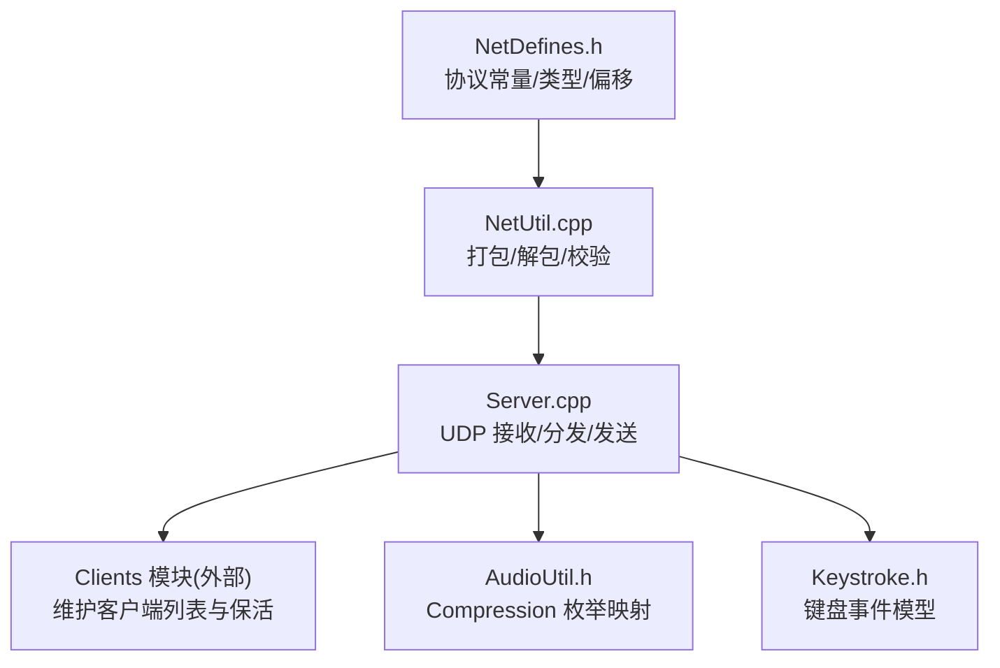
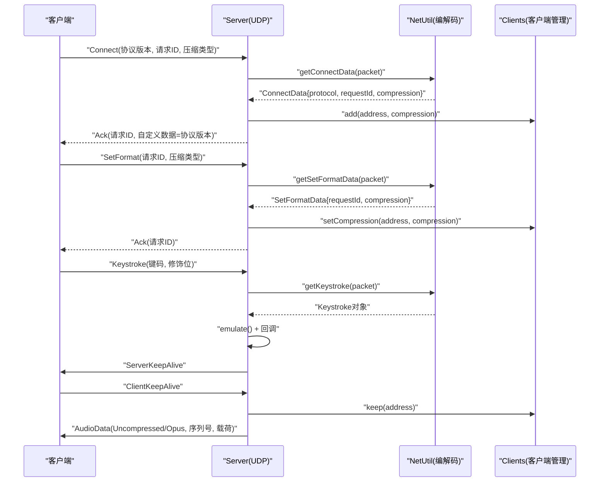
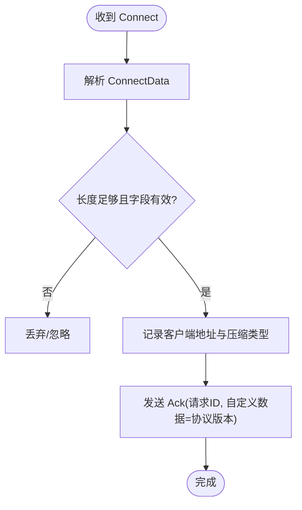
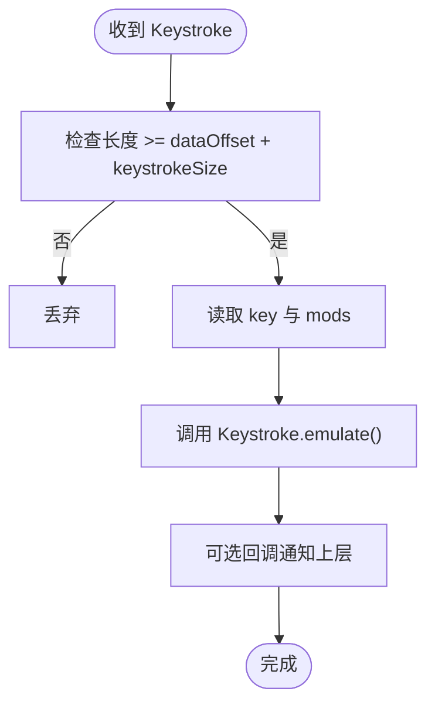
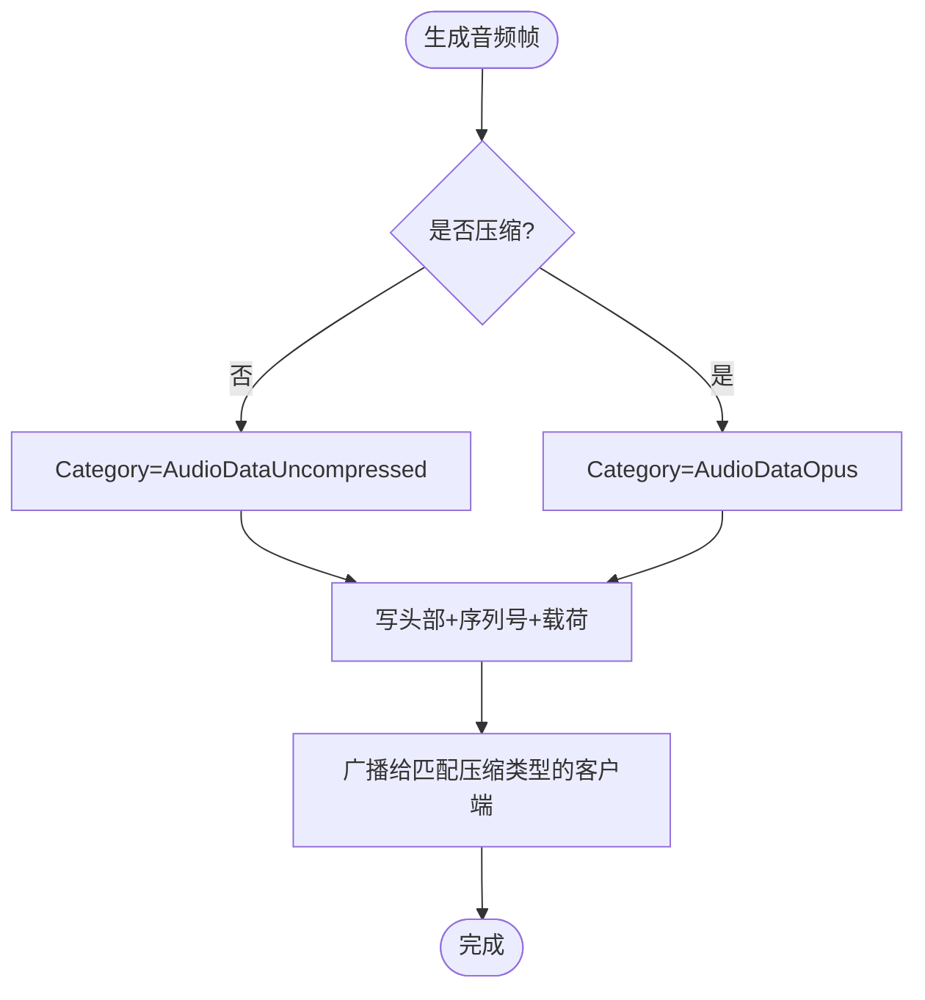
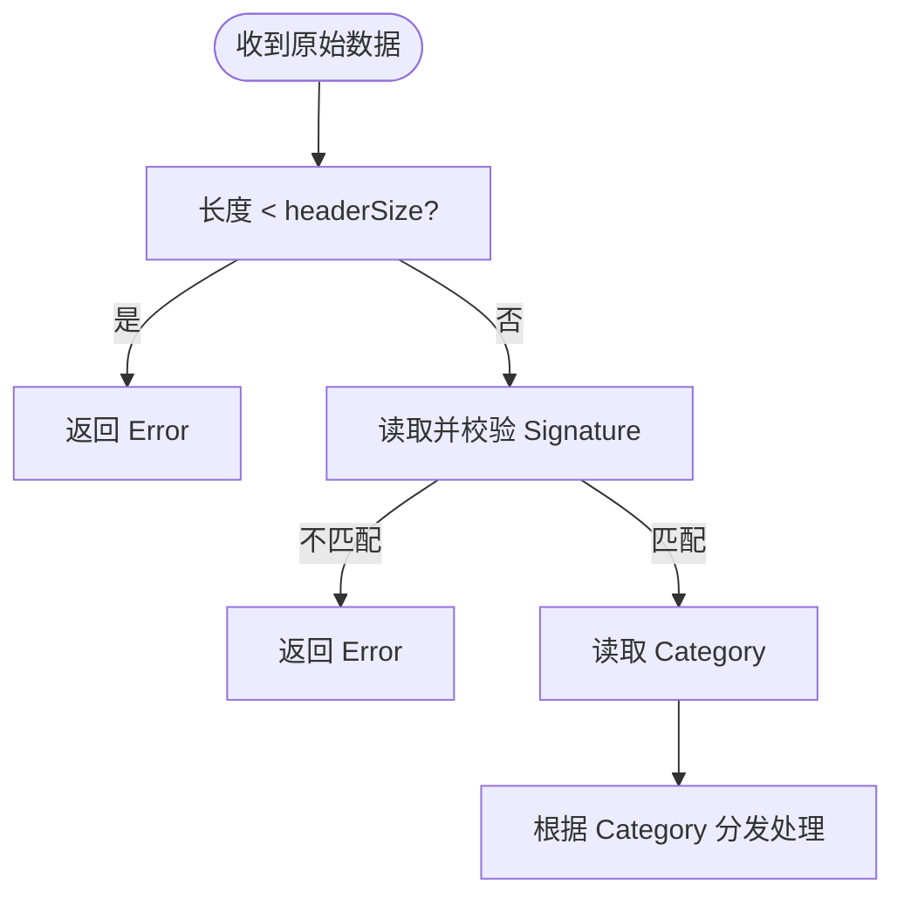
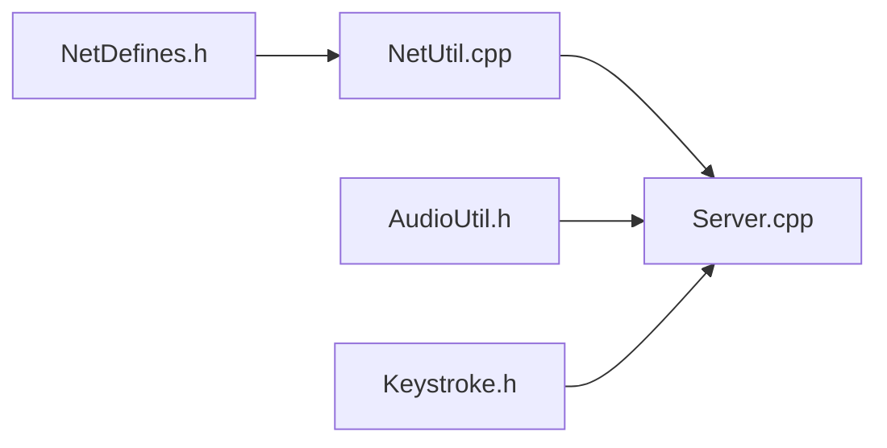

# 网络协议规范

<cite>
**本文引用的文件**   
- [NetDefines.h](file://SoundRemote/NetDefines.h)
- [NetUtil.cpp](file://SoundRemote/NetUtil.cpp)
- [NetUtil.h](file://SoundRemote/NetUtil.h)
- [Server.cpp](file://SoundRemote/Server.cpp)
- [Server.h](file://SoundRemote/Server.h)
- [AudioUtil.h](file://SoundRemote/AudioUtil.h)
- [Keystroke.h](file://SoundRemote/Keystroke.h)
</cite>

## 目录
1. [简介](#简介)
2. [项目结构](#项目结构)
3. [核心组件](#核心组件)
4. [架构总览](#架构总览)
5. [详细组件分析](#详细组件分析)
6. [依赖关系分析](#依赖关系分析)
7. [性能考虑](#性能考虑)
8. [故障排查指南](#故障排查指南)
9. [结论](#结论)
10. [附录](#附录)

## 简介
本规范定义 SoundRemote 服务端与客户端之间的 UDP 通信协议。协议采用固定头部加可变数据体的格式，支持连接协商、音频流传输（未压缩与 Opus 压缩）、键盘事件上报、保活与断开等消息类别。文档涵盖：
- 数据包头部结构与字段类型定义
- 各消息类别的数据包结构与用途
- 协议版本管理、请求 ID 机制、压缩类型选择与序列号处理
- 完整数据包示例与解析流程说明
- 错误处理与兼容性策略
- 协议扩展点与未来版本规划

## 项目结构
与网络协议直接相关的代码主要位于以下文件：
- 协议常量与数据结构定义：[NetDefines.h](file://SoundRemote/NetDefines.h)
- 数据包编解码工具：[NetUtil.h](file://SoundRemote/NetUtil.h)、[NetUtil.cpp](file://SoundRemote/NetUtil.cpp)
- 服务器端接收与分发逻辑：[Server.h](file://SoundRemote/Server.h)、[Server.cpp](file://SoundRemote/Server.cpp)
- 音频相关类型与压缩枚举映射：[AudioUtil.h](file://SoundRemote/AudioUtil.h)
- 键盘事件模型：[Keystroke.h](file://SoundRemote/Keystroke.h)

**图表来源** 
- [NetDefines.h:1-69](file://SoundRemote/NetDefines.h#L1-L69)
- [NetUtil.cpp:1-218](file://SoundRemote/NetUtil.cpp#L1-L218)
- [Server.cpp:1-210](file://SoundRemote/Server.cpp#L1-L210)
- [AudioUtil.h:1-170](file://SoundRemote/AudioUtil.h#L1-L170)
- [Keystroke.h:1-41](file://SoundRemote/Keystroke.h#L1-L41)

**章节来源**
- [NetDefines.h:1-69](file://SoundRemote/NetDefines.h#L1-L69)
- [NetUtil.h:1-41](file://SoundRemote/NetUtil.h#L1-L41)
- [NetUtil.cpp:1-218](file://SoundRemote/NetUtil.cpp#L1-L218)
- [Server.h:1-61](file://SoundRemote/Server.h#L1-L61)
- [Server.cpp:1-210](file://SoundRemote/Server.cpp#L1-L210)
- [AudioUtil.h:1-170](file://SoundRemote/AudioUtil.h#L1-L170)
- [Keystroke.h:1-41](file://SoundRemote/Keystroke.h#L1-L41)

## 核心组件
- 协议常量与类型
  - 头部字段类型：SignatureType(uint16)、CategoryType(uint8)、SizeType(uint16)
  - 数据字段类型：ProtocolVersionType(uint8)、RequestIdType(uint16)、CompressionType(uint8)、KeyType(uint8)、ModsType(uint8)、SequenceNumberType(uint32)
  - 头部大小与偏移：headerSize、signatureOffset、categoryOffset、sizeOffset、dataOffset
  - 特定消息体大小与偏移：keystrokeSize、ackSize、ackCustomDataOffset、sequenceNumberSize、audioDataOffset
  - 协议签名常量：protocolSignature
  - 协议版本常量：protocolVersion
  - 默认端口：defaultServerPort、defaultClientPort
  - 输入缓冲区大小：inputPacketSize

- 消息类别（Category）
  - Error、Connect、Disconnect、SetFormat、Keystroke、AudioDataUncompressed、AudioDataOpus、ClientKeepAlive、ServerKeepAlive、Ack

- 关键数据结构
  - ConnectData：包含 protocol、requestId、compression
  - SetFormatData：包含 requestId、compression

- 编解码工具
  - createAudioPacket：构建音频数据包（含序列号）
  - createKeepAlivePacket / createDisconnectPacket：构造保活/断开包
  - createAckConnectPacket / createAckSetFormatPacket：构造确认包（携带协议版本或空自定义数据）
  - getPacketCategory：校验签名并提取类别
  - getKeystroke / getConnectData / getSetFormatData：解析对应消息体
  - compressionFromNetworkValue：将网络压缩值映射到内部 Audio::Compression

**章节来源**
- [NetDefines.h:1-69](file://SoundRemote/NetDefines.h#L1-L69)
- [NetUtil.h:1-41](file://SoundRemote/NetUtil.h#L1-L41)
- [NetUtil.cpp:1-218](file://SoundRemote/NetUtil.cpp#L1-218)

## 架构总览
服务端通过 UDP 监听 serverPort，接收客户端发来的数据包，依据头部 Category 分派到相应处理器；对需要响应的消息返回 Ack 或控制类报文；周期性向已注册客户端发送 ServerKeepAlive，并在客户端超时后移除。

**图表来源** 
- [Server.cpp:80-166](file://SoundRemote/Server.cpp#L80-L166)
- [NetUtil.cpp:129-169](file://SoundRemote/NetUtil.cpp#L129-L169)
- [NetUtil.cpp:171-217](file://SoundRemote/NetUtil.cpp#L171-L217)

**章节来源**
- [Server.cpp:1-210](file://SoundRemote/Server.cpp#L1-L210)
- [NetUtil.cpp:1-218](file://SoundRemote/NetUtil.cpp#L1-L218)

## 详细组件分析

### 数据包头部与偏移量
- 头部布局（按字节序为网络大端）：
  - SignatureType（2 字节）：协议签名，用于快速识别合法协议帧
  - CategoryType（1 字节）：消息类别
  - SizeType（2 字节）：整个数据包长度（包括头部）
- 偏移量计算：
  - signatureOffset = 0
  - categoryOffset = sizeof(SignatureType)
  - sizeOffset = sizeof(SignatureType) + sizeof(CategoryType)
  - dataOffset = headerSize
- 头部大小 headerSize = sizeof(SignatureType) + sizeof(CategoryType) + sizeof(SizeType)

**章节来源**
- [NetDefines.h:10-26](file://SoundRemote/NetDefines.h#L10-L26)
- [NetUtil.cpp:67-71](file://SoundRemote/NetUtil.cpp#L67-L71)

### 数据类型与对齐
- 所有多字节整数在网络侧使用大端序写入与读取
- 无显式填充字段，结构体按顺序紧凑排列
- 各类数据体大小在头文件中以 constexpr 给出，便于静态计算

**章节来源**
- [NetDefines.h:14-32](file://SoundRemote/NetDefines.h#L14-L32)
- [NetUtil.cpp:9-65](file://SoundRemote/NetUtil.cpp#L9-L65)

### 消息类别与数据包结构

#### Connect（客户端发起）
- 用途：建立会话，协商协议版本与压缩方式
- 数据体字段：
  - ProtocolVersionType protocol
  - RequestIdType requestId
  - CompressionType compression
- 服务器响应：
  - Ack(requestId, customData=protocolVersion)

**图表来源** 
- [NetDefines.h:33-38](file://SoundRemote/NetDefines.h#L33-L38)
- [NetUtil.cpp:193-205](file://SoundRemote/NetUtil.cpp#L193-L205)
- [NetUtil.cpp:154-161](file://SoundRemote/NetUtil.cpp#L154-L161)
- [Server.cpp:127-137](file://SoundRemote/Server.cpp#L127-L137)

**章节来源**
- [NetDefines.h:33-38](file://SoundRemote/NetDefines.h#L33-L38)
- [NetUtil.cpp:154-161](file://SoundRemote/NetUtil.cpp#L154-L161)
- [NetUtil.cpp:193-205](file://SoundRemote/NetUtil.cpp#L193-L205)
- [Server.cpp:127-137](file://SoundRemote/Server.cpp#L127-L137)

#### Disconnect（客户端发起）
- 用途：主动断开连接
- 数据体：无
- 服务器行为：从客户端列表中移除该地址

**章节来源**
- [NetDefines.h:47-58](file://SoundRemote/NetDefines.h#L47-L58)
- [Server.cpp:139-141](file://SoundRemote/Server.cpp#L139-L141)

#### SetFormat（客户端发起）
- 用途：动态设置音频格式（当前仅协商压缩类型）
- 数据体字段：
  - RequestIdType requestId
  - CompressionType compression
- 服务器响应：
  - Ack(requestId)

**章节来源**
- [NetDefines.h:39-43](file://SoundRemote/NetDefines.h#L39-L43)
- [NetUtil.cpp:163-169](file://SoundRemote/NetUtil.cpp#L163-L169)
- [NetUtil.cpp:207-217](file://SoundRemote/NetUtil.cpp#L207-L217)
- [Server.cpp:143-153](file://SoundRemote/Server.cpp#L143-L153)

#### Keystroke（客户端上报）
- 用途：上报键盘按键事件
- 数据体字段：
  - KeyType key
  - ModsType mods（修饰键位图）
- 服务器行为：模拟按键并触发回调

**图表来源** 
- [NetDefines.h:28](file://SoundRemote/NetDefines.h#L28)
- [NetUtil.cpp:182-191](file://SoundRemote/NetUtil.cpp#L182-L191)
- [Server.cpp:155-162](file://SoundRemote/Server.cpp#L155-L162)
- [Keystroke.h:6-18](file://SoundRemote/Keystroke.h#L6-L18)

**章节来源**
- [NetDefines.h:28](file://SoundRemote/NetDefines.h#L28)
- [NetUtil.cpp:182-191](file://SoundRemote/NetUtil.cpp#L182-L191)
- [Server.cpp:155-162](file://SoundRemote/Server.cpp#L155-L162)
- [Keystroke.h:1-41](file://SoundRemote/Keystroke.h#L1-L41)

#### AudioData（服务端下发）
- 类别：
  - AudioDataUncompressed：未压缩 PCM
  - AudioDataOpus：Opus 编码数据
- 数据体字段：
  - SequenceNumberType sequenceNumber（32 位，大端）
  - 音频载荷（变长）
- 注意：音频载荷的采样率、声道数、位深由上层配置决定，本协议不在此处承载格式元信息

**图表来源** 
- [NetDefines.h:31-32](file://SoundRemote/NetDefines.h#L31-L32)
- [NetUtil.cpp:129-140](file://SoundRemote/NetUtil.cpp#L129-L140)
- [Server.cpp:48-62](file://SoundRemote/Server.cpp#L48-L62)

**章节来源**
- [NetDefines.h:31-32](file://SoundRemote/NetDefines.h#L31-L32)
- [NetUtil.cpp:129-140](file://SoundRemote/NetUtil.cpp#L129-L140)
- [Server.cpp:48-62](file://SoundRemote/Server.cpp#L48-L62)

#### KeepAlive（双向）
- 客户端 -> 服务器：ClientKeepAlive
- 服务器 -> 客户端：ServerKeepAlive
- 用途：维持连接状态，配合客户端超时清理

**章节来源**
- [NetDefines.h:55-56](file://SoundRemote/NetDefines.h#L55-L56)
- [NetUtil.cpp:142-146](file://SoundRemote/NetUtil.cpp#L142-L146)
- [Server.cpp:201-209](file://SoundRemote/Server.cpp#L201-L209)

#### Ack（服务器响应）
- 用途：确认请求（Connect/SetFormat）
- 数据体字段：
  - RequestIdType requestId
  - 自定义数据（Connect 时携带协议版本，SetFormat 时无）
- 自定义数据偏移：ackCustomDataOffset

**章节来源**
- [NetDefines.h:29-30](file://SoundRemote/NetDefines.h#L29-L30)
- [NetUtil.cpp:154-169](file://SoundRemote/NetUtil.cpp#L154-L169)

### 协议版本管理与兼容性
- 全局协议版本常量：protocolVersion
- Connect 握手阶段，服务器在 Ack 的自定义数据中回显协议版本，供客户端校验
- 建议客户端在收到 Ack 后比对自身支持的协议版本范围，决定是否继续通信

**章节来源**
- [NetDefines.h:60](file://SoundRemote/NetDefines.h#L60)
- [NetUtil.cpp:154-161](file://SoundRemote/NetUtil.cpp#L154-L161)

### 请求 ID 机制
- 每个需要应答的请求（Connect、SetFormat）均携带唯一 RequestIdType
- 服务器在对应的 Ack 中回显相同 RequestIdType，便于客户端关联请求与响应
- 客户端应实现去重与超时重试逻辑

**章节来源**
- [NetDefines.h:15](file://SoundRemote/NetDefines.h#L15)
- [NetUtil.cpp:154-169](file://SoundRemote/NetUtil.cpp#L154-L169)

### 压缩类型选择
- 网络层 CompressionType 为 uint8，取值与内部 Audio::Compression 枚举存在映射关系
- 映射函数：compressionFromNetworkValue
- 支持的压缩等级：none、kbps_64、kbps_128、kbps_192、kbps_256、kbps_320
- 未知值将被拒绝（返回 nullopt），客户端需避免发送非法值

**章节来源**
- [NetDefines.h:16](file://SoundRemote/NetDefines.h#L16)
- [AudioUtil.h:27](file://SoundRemote/AudioUtil.h#L27)
- [NetUtil.cpp:110-127](file://SoundRemote/NetUtil.cpp#L110-L127)

### 序列号处理
- 音频数据体前 4 字节为 SequenceNumberType（大端）
- 用于乱序重组、丢包检测与播放缓冲管理
- 服务端每帧递增序列号，客户端据此进行平滑播放与丢包补偿

**章节来源**
- [NetDefines.h:19](file://SoundRemote/NetDefines.h#L19)
- [NetDefines.h:31-32](file://SoundRemote/NetDefines.h#L31-L32)
- [NetUtil.cpp:129-140](file://SoundRemote/NetUtil.cpp#L129-L140)

### 错误处理与健壮性
- 头部校验：若长度不足或签名不匹配，解析为 Error 类别
- 数据体解析：长度不足或字段越界时返回空结果，调用方应丢弃
- 未知压缩类型：映射失败则拒绝处理
- 网络异常：接收循环捕获系统错误并退出进程（生产环境可改为告警与恢复）

**图表来源** 
- [NetUtil.cpp:171-180](file://SoundRemote/NetUtil.cpp#L171-L180)

**章节来源**
- [NetUtil.cpp:171-180](file://SoundRemote/NetUtil.cpp#L171-L180)
- [NetUtil.cpp:182-217](file://SoundRemote/NetUtil.cpp#L182-L217)
- [Server.cpp:80-125](file://SoundRemote/Server.cpp#L80-L125)

### 数据包示例与解析步骤（文字描述）
- Connect 示例（客户端 -> 服务器）
  - 头部：Signature=0xA571、Category=Connect、Size=headerSize+ConnectData.size
  - 数据体：protocol=1、requestId=任意16位、compression=0~5
  - 服务器解析后回复 Ack：Category=Ack、数据体=requestId、自定义数据=protocolVersion
- SetFormat 示例（客户端 -> 服务器）
  - 头部：Category=SetFormat
  - 数据体：requestId、compression
  - 服务器回复 Ack：Category=Ack、数据体=requestId（无自定义数据）
- Keystroke 示例（客户端 -> 服务器）
  - 头部：Category=Keystroke
  - 数据体：key、mods
- AudioData 示例（服务器 -> 客户端）
  - 头部：Category=AudioDataUncompressed 或 AudioDataOpus
  - 数据体：sequenceNumber、音频载荷

解析步骤要点：
- 先读头部三字段，校验签名与长度
- 根据 Category 定位数据体起始位置 dataOffset
- 按对应结构体顺序读取字段，严格检查剩余长度
- 对压缩类型执行映射校验
- 对需要应答的消息，构造 Ack 并回写 requestId 与必要自定义数据

**章节来源**
- [NetDefines.h:22-32](file://SoundRemote/NetDefines.h#L22-L32)
- [NetUtil.cpp:129-169](file://SoundRemote/NetUtil.cpp#L129-L169)
- [NetUtil.cpp:171-217](file://SoundRemote/NetUtil.cpp#L171-L217)

## 依赖关系分析
- 协议定义与编解码
  - NetDefines.h 提供类型、偏移与常量
  - NetUtil.cpp 基于这些常量进行读写与校验
- 服务器逻辑
  - Server.cpp 负责 UDP I/O、消息分发与业务联动（客户端管理、音频发送）
  - 依赖 NetUtil 进行编解码，依赖 AudioUtil 的压缩枚举映射
  - 依赖 Keystroke 模型执行按键模拟与回调
- 客户端管理
  - Clients 模块维护地址与压缩类型缓存，驱动保活与超时清理

**图表来源** 
- [NetDefines.h:1-69](file://SoundRemote/NetDefines.h#L1-L69)
- [NetUtil.cpp:1-218](file://SoundRemote/NetUtil.cpp#L1-L218)
- [Server.cpp:1-210](file://SoundRemote/Server.cpp#L1-L210)
- [AudioUtil.h:1-170](file://SoundRemote/AudioUtil.h#L1-L170)
- [Keystroke.h:1-41](file://SoundRemote/Keystroke.h#L1-L41)

**章节来源**
- [Server.h:1-61](file://SoundRemote/Server.h#L1-L61)
- [Server.cpp:1-210](file://SoundRemote/Server.cpp#L1-L210)

## 性能考虑
- 零拷贝思路：使用 span 与 vector<char> 共享内存，减少复制
- 批量发送：按压缩类型分组客户端地址，复用同一数据包指针广播
- 序列号单调递增：避免重复分配与随机数开销
- 压缩级别选择：高码率提升音质但增大带宽占用，需结合网络状况动态调整
- 保活间隔：合理设置定时器周期，平衡实时性与资源消耗

[本节为通用指导，无需源码引用]

## 故障排查指南
- 无法建立连接
  - 检查防火墙与端口（serverPort/clientPort）
  - 核对协议签名与版本号
  - 确认客户端发送的压缩类型在服务端支持范围内
- 音频无声或卡顿
  - 检查序列号是否连续，是否存在丢包
  - 验证压缩类型与编码器参数一致
  - 观察保活是否正常工作
- 键盘事件无效
  - 检查 Keystroke 数据体长度与字段范围
  - 确认操作系统权限与快捷键限制（如 Ctrl+Alt+Del）

**章节来源**
- [NetDefines.h:64-68](file://SoundRemote/NetDefines.h#L64-L68)
- [NetUtil.cpp:171-180](file://SoundRemote/NetUtil.cpp#L171-L180)
- [Server.cpp:80-125](file://SoundRemote/Server.cpp#L80-L125)

## 结论
本规范明确了 SoundRemote 的 UDP 协议格式、消息语义与交互流程。通过统一的头部校验、请求-应答机制、压缩类型映射与序列号管理，实现了稳定高效的远程音频与键盘事件传输。建议在客户端实现严格的长度与签名校验、请求去重与超时重试，并根据网络质量动态调整压缩级别与保活频率。

[本节为总结，无需源码引用]

## 附录

### 协议扩展点
- 新增消息类别：在 Category 枚举中预留区间，保持向后兼容
- 扩展数据体：在现有结构体末尾追加字段，旧客户端忽略未知尾部
- 压缩算法扩展：在 compressionFromNetworkValue 中增加新映射项
- 版本协商增强：可在 Ack 自定义数据中扩展能力位或特性标志

### 未来版本规划
- v2 可能引入：
  - 更丰富的音频格式协商（采样率、声道、位深）
  - 带时间戳的同步播放
  - 选择性重传与 FEC 机制
  - 加密与完整性校验

[本节为概念性内容，无需源码引用]