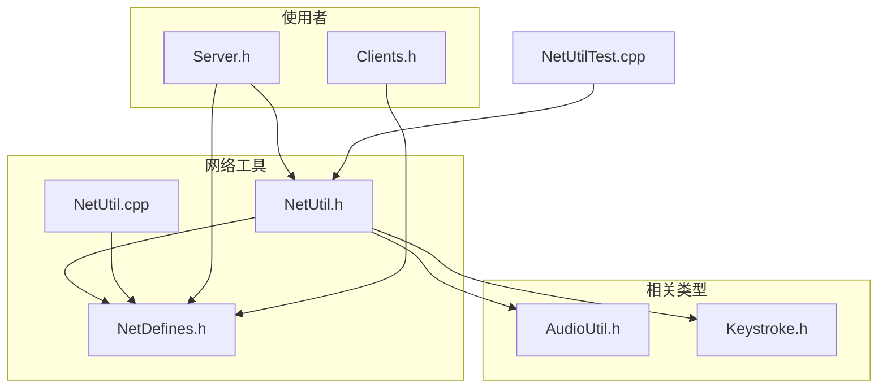
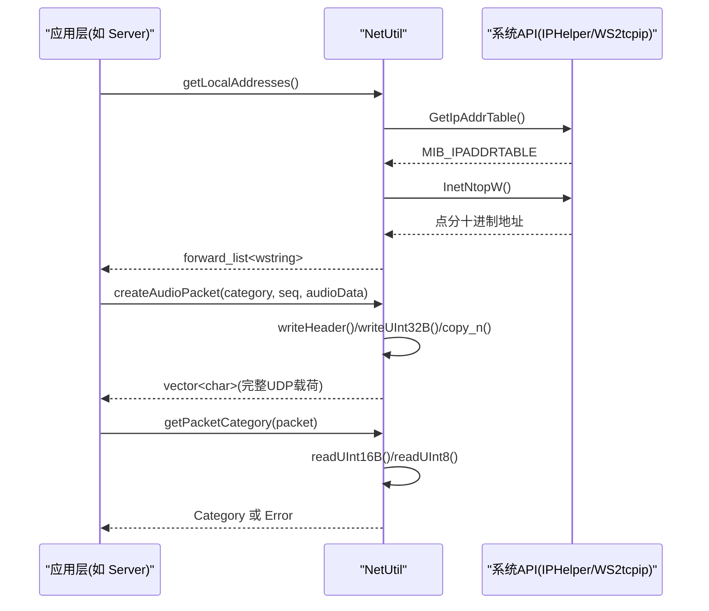
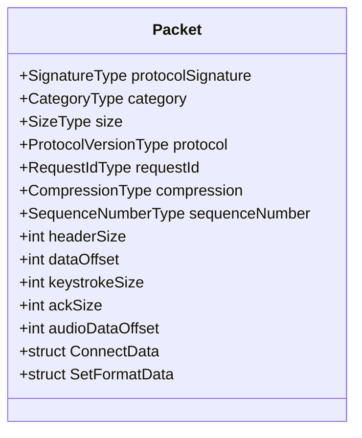
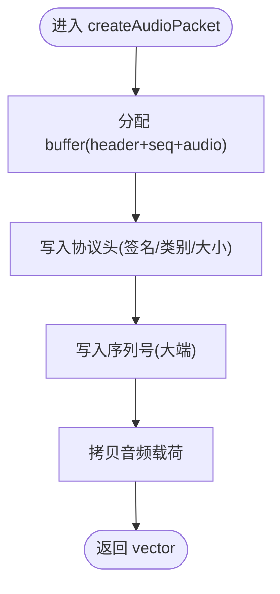
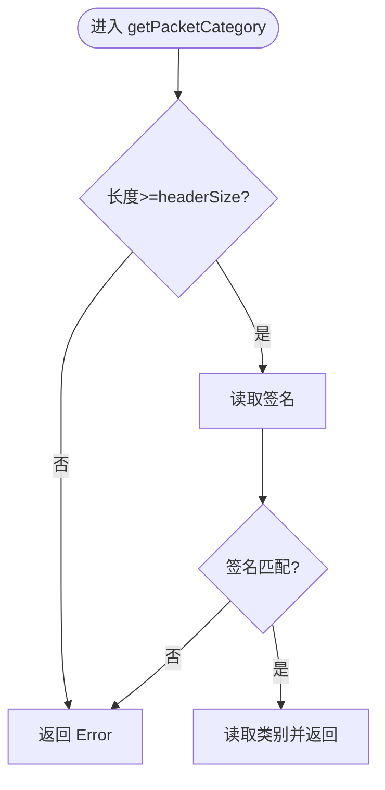
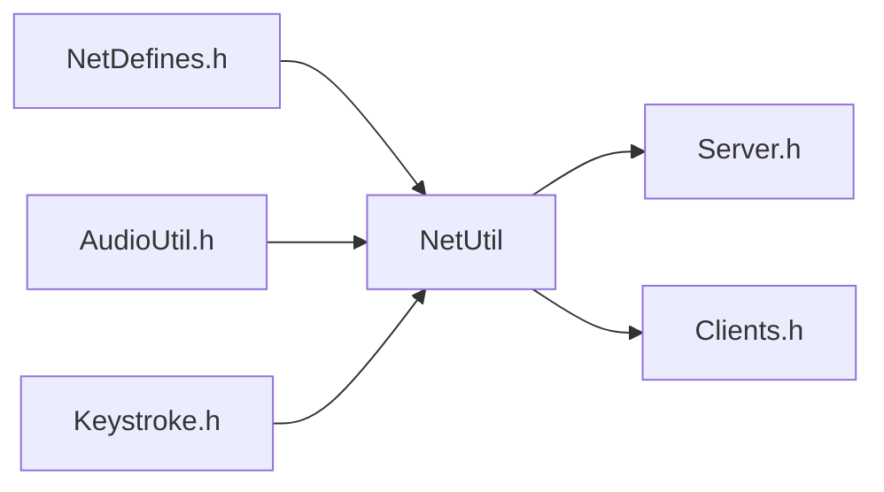

# 网络工具函数

<cite>
**本文引用的文件**   
- [NetUtil.h](file://SoundRemote/NetUtil.h)
- [NetUtil.cpp](file://SoundRemote/NetUtil.cpp)
- [NetDefines.h](file://SoundRemote/NetDefines.h)
- [AudioUtil.h](file://SoundRemote/AudioUtil.h)
- [Keystroke.h](file://SoundRemote/Keystroke.h)
- [Server.h](file://SoundRemote/Server.h)
- [Clients.h](file://SoundRemote/Clients.h)
- [NetUtilTest.cpp](file://Tests/NetUtilTest.cpp)
</cite>

## 目录
1. [简介](#简介)
2. [项目结构](#项目结构)
3. [核心组件](#核心组件)
4. [架构总览](#架构总览)
5. [详细组件分析](#详细组件分析)
6. [依赖关系分析](#依赖关系分析)
7. [性能与内存优化](#性能与内存优化)
8. [线程安全说明](#线程安全说明)
9. [错误处理与重试机制指南](#错误处理与重试机制指南)
10. [网络诊断与质量评估建议](#网络诊断与质量评估建议)
11. [结论](#结论)

## 简介
本模块提供面向 UDP 音频传输场景的网络辅助能力，包括：
- 本地 IPv4 地址枚举
- 协议包序列化/反序列化工具（音频、按键、连接控制等）
- 压缩类型在网络值与内部枚举之间的转换
- 基础网络常量与数据包格式定义

该模块为上层服务器与客户端逻辑提供稳定的数据编解码与轻量网络辅助接口。

## 项目结构
围绕网络工具的相关源文件组织如下：
- 协议与常量定义：NetDefines.h
- 网络工具实现：NetUtil.h / NetUtil.cpp
- 相关类型与错误模型：AudioUtil.h、Keystroke.h
- 使用方示例（服务端）：Server.h
- 单元测试用例：NetUtilTest.cpp

图表来源
- [NetDefines.h:1-69](file://SoundRemote/NetDefines.h#L1-L69)
- [NetUtil.h:1-41](file://SoundRemote/NetUtil.h#L1-L41)
- [NetUtil.cpp:1-218](file://SoundRemote/NetUtil.cpp#L1-L218)
- [AudioUtil.h:1-170](file://SoundRemote/AudioUtil.h#L1-L170)
- [Keystroke.h:1-41](file://SoundRemote/Keystroke.h#L1-L41)
- [Server.h:1-61](file://SoundRemote/Server.h#L1-L61)
- [Clients.h:1-60](file://SoundRemote/Clients.h#L1-L60)
- [NetUtilTest.cpp:1-133](file://Tests/NetUtilTest.cpp#L1-L133)

章节来源
- [NetDefines.h:1-69](file://SoundRemote/NetDefines.h#L1-L69)
- [NetUtil.h:1-41](file://SoundRemote/NetUtil.h#L1-L41)
- [NetUtil.cpp:1-218](file://SoundRemote/NetUtil.cpp#L1-L218)

## 核心组件
本节聚焦 Net::NetUtil 提供的 API 与其职责边界。

- 本地地址获取
  - getLocalAddresses(): 返回本机所有 IPv4 地址的宽字符串列表；失败时返回空列表。
- 压缩类型映射
  - compressionFromNetworkValue(): 将网络协议中的压缩值映射到 Audio::Compression 枚举；非法值返回空可选。
- 数据包构造
  - createAudioPacket(): 构造音频数据包（含头部、序列号与音频载荷）。
  - createKeepAlivePacket(): 构造保活包。
  - createDisconnectPacket(): 构造断开连接包。
  - createAckConnectPacket(): 构造“连接确认”包，包含请求 ID 与协议版本。
  - createAckSetFormatPacket(): 构造“设置格式确认”包，包含请求 ID。
- 数据包解析
  - getPacketCategory(): 校验签名并返回包类别；不合法或过短返回 Error。
  - getKeystroke(): 从包中解析按键事件。
  - getConnectData(): 从包中解析连接参数（协议版本、请求 ID、压缩类型）。
  - getSetFormatData(): 从包中解析格式设置参数（请求 ID、压缩类型）。

章节来源
- [NetUtil.h:11-40](file://SoundRemote/NetUtil.h#L11-L40)
- [NetUtil.cpp:78-218](file://SoundRemote/NetUtil.cpp#L78-L218)

## 架构总览
NetUtil 作为纯工具层，向上层 Server 和 Clients 提供统一的编解码与地址辅助能力。其输入输出均为无状态的数据缓冲与基本类型，便于在异步 I/O 环境中复用。

图表来源
- [NetUtil.cpp:78-108](file://SoundRemote/NetUtil.cpp#L78-L108)
- [NetUtil.cpp:129-140](file://SoundRemote/NetUtil.cpp#L129-L140)
- [NetUtil.cpp:171-180](file://SoundRemote/NetUtil.cpp#L171-L180)

## 详细组件分析

### 数据包格式与字段布局
协议头采用固定长度与明确偏移，确保跨平台一致性与高效解析。关键字段与常量定义位于 NetDefines.h，NetUtil 通过读写小端/大端通用函数进行填充与解析。

图表来源
- [NetDefines.h:8-59](file://SoundRemote/NetDefines.h#L8-L59)

章节来源
- [NetDefines.h:8-59](file://SoundRemote/NetDefines.h#L8-L59)

### 地址转换与本地地址枚举
- 功能要点
  - 使用系统 API 获取 IPv4 地址表，转换为点分十进制字符串。
  - 失败路径返回空列表，调用方可据此判断是否可用。
- 复杂度
  - 时间复杂度 O(N)，N 为网卡条目数。
  - 空间复杂度 O(N)，用于存储结果列表。
- 注意事项
  - 仅枚举 IPv4；IPv6 需另行扩展。
  - 异常路径以空容器表示错误，避免抛出异常影响上层异步流程。

章节来源
- [NetUtil.cpp:78-108](file://SoundRemote/NetUtil.cpp#L78-L108)

### 压缩类型映射
- 功能要点
  - 将网络侧 0..5 的压缩值映射到 Audio::Compression 枚举。
  - 未知值返回 std::nullopt，调用方可据此拒绝或降级处理。
- 设计考量
  - 保持与音频编码配置的一致性，便于上层统一策略。

章节来源
- [NetUtil.cpp:110-127](file://SoundRemote/NetUtil.cpp#L110-L127)
- [AudioUtil.h:27](file://SoundRemote/AudioUtil.h#L27)

### 数据包构造器
- createAudioPacket
  - 组装头部、32 位序列号与大端序写入，随后拷贝音频载荷。
  - 适用于未压缩与 Opus 两种音频类别。
- createKeepAlivePacket / createDisconnectPacket
  - 最小头部包，用于心跳与优雅关闭。
- createAckConnectPacket / createAckSetFormatPacket
  - 应答包携带请求 ID 与必要自定义数据（如协议版本）。

图表来源
- [NetUtil.cpp:129-140](file://SoundRemote/NetUtil.cpp#L129-L140)

章节来源
- [NetUtil.cpp:129-140](file://SoundRemote/NetUtil.cpp#L129-L140)
- [NetUtil.cpp:142-169](file://SoundRemote/NetUtil.cpp#L142-L169)

### 数据包解析器
- getPacketCategory
  - 校验包长度与协议签名，再读取类别字段；否则返回 Error。
- getKeystroke / getConnectData / getSetFormatData
  - 按偏移顺序读取字段，若长度不足则返回空可选。

图表来源
- [NetUtil.cpp:171-180](file://SoundRemote/NetUtil.cpp#L171-L180)

章节来源
- [NetUtil.cpp:171-180](file://SoundRemote/NetUtil.cpp#L171-L180)
- [NetUtil.cpp:182-217](file://SoundRemote/NetUtil.cpp#L182-L217)

### 测试覆盖与行为验证
- 针对音频包构造（未压缩/Opus）、保活/断开包、压缩映射、ACK 包构造与类别解析均提供了断言式用例，确保字节级一致性。

章节来源
- [NetUtilTest.cpp:29-130](file://Tests/NetUtilTest.cpp#L29-L130)

## 依赖关系分析
- NetUtil 依赖
  - 系统网络 API（IPHelper、Winsock）用于地址枚举。
  - 协议常量与数据结构（NetDefines.h）。
  - 音频压缩枚举（AudioUtil.h）。
  - 按键事件结构（Keystroke.h）。
- 被依赖方
  - Server 与 Clients 通过 NetUtil 完成包的构建与解析，从而与对端交互。

图表来源
- [NetDefines.h:1-69](file://SoundRemote/NetDefines.h#L1-L69)
- [NetUtil.h:1-41](file://SoundRemote/NetUtil.h#L1-L41)
- [AudioUtil.h:1-170](file://SoundRemote/AudioUtil.h#L1-L170)
- [Keystroke.h:1-41](file://SoundRemote/Keystroke.h#L1-L41)
- [Server.h:1-61](file://SoundRemote/Server.h#L1-L61)
- [Clients.h:1-60](file://SoundRemote/Clients.h#L1-L60)

章节来源
- [NetDefines.h:1-69](file://SoundRemote/NetDefines.h#L1-L69)
- [NetUtil.h:1-41](file://SoundRemote/NetUtil.h#L1-L41)
- [AudioUtil.h:1-170](file://SoundRemote/AudioUtil.h#L1-L170)
- [Keystroke.h:1-41](file://SoundRemote/Keystroke.h#L1-L41)
- [Server.h:1-61](file://SoundRemote/Server.h#L1-L61)
- [Clients.h:1-60](file://SoundRemote/Clients.h#L1-L60)

## 性能与内存优化
- 零拷贝思路
  - 使用 std::span 作为只读视图，避免不必要的中间拷贝。
- 预分配与复用
  - 构造包时一次性分配所需容量，减少多次扩容开销。
- 字节序操作
  - 内联的小端/大端读写函数避免分支与额外函数调用。
- 缓冲区管理
  - 返回 vector<char> 交由上层决定发送时机；上层可结合 IO 多路复用批量发送以降低系统调用次数。

[本节为通用性能建议，不直接分析具体文件]

## 线程安全说明
- NetUtil 自身为无状态工具函数集合，不包含共享可变状态，因此其函数本身是线程安全的。
- 上层并发访问注意
  - 若多个线程同时向同一 socket 发送数据，应在 Socket 层加锁或使用单发送协程/任务队列。
  - 客户端列表维护由 Clients 类负责，其内部使用 shared_mutex 保护并发访问。

章节来源
- [Clients.h:49](file://SoundRemote/Clients.h#L49)

## 错误处理与重试机制指南
- 返回值约定
  - 地址枚举失败返回空列表；包解析失败返回空可选或 Error 类别。
- 建议的重试策略
  - 对于 ACK 缺失或超时：基于请求 ID 记录待确认项，配合定时器进行指数退避重试。
  - 对于丢包导致的音频中断：在上层引入滑动窗口与重传阈值，结合拥塞控制动态调整码率。
- 错误分类与日志
  - 将网络错误分为“可恢复”（超时、丢包）与“不可恢复”（协议不匹配、致命错误），分别采取重试或快速失败策略。
- 与现有错误模型的衔接
  - 音频子系统已提供 HRESULT 错误文本化与异常封装，可在需要时将网络错误转换为统一错误对象以便上层处理。

章节来源
- [AudioUtil.h:130-169](file://SoundRemote/AudioUtil.h#L130-L169)

## 网络诊断与质量评估建议
以下为实践建议，非当前代码内置功能：
- 延迟测量
  - 利用 KeepAlive/Ack 往返时间估算 RTT；统计均值与抖动，用于自适应码率。
- 带宽测量
  - 周期性发送探测包，根据接收速率估算可用带宽，动态切换压缩等级。
- 连接质量评估
  - 综合丢包率、RTT、抖动与重传次数计算质量分数，触发降码率或提示用户。
- 可视化与告警
  - 将指标上报至监控面板，设定阈值触发告警或自动降级。

[本节为概念性指导，不直接分析具体文件]

## 结论
NetUtil 模块以简洁清晰的接口实现了 UDP 音频流的关键编解码与地址辅助能力，具备高内聚、低耦合的特点。结合上层的异步 I/O 与客户端管理，能够支撑稳定高效的远程音频传输。建议在应用层完善错误分类、重试与质量评估机制，以获得更鲁棒的体验。