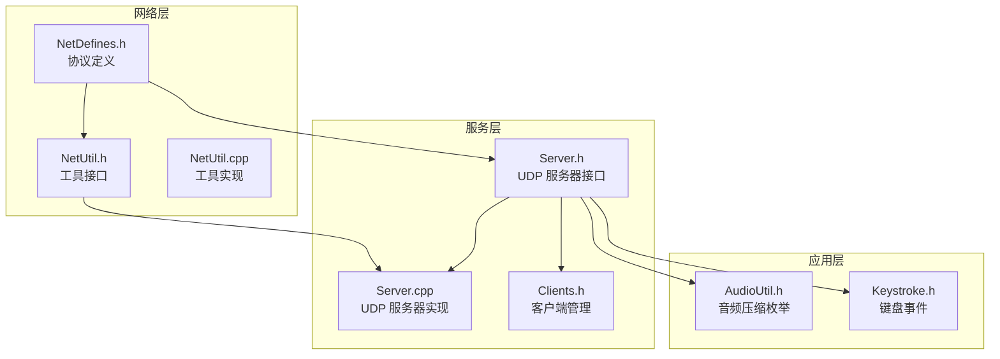
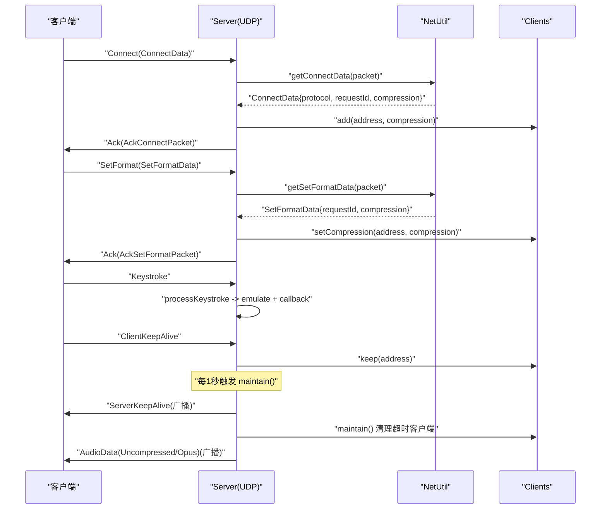
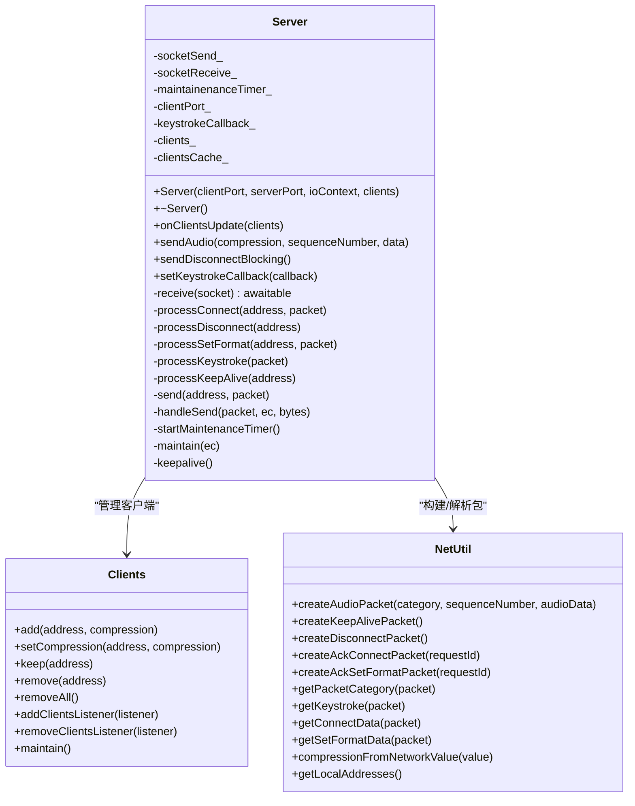
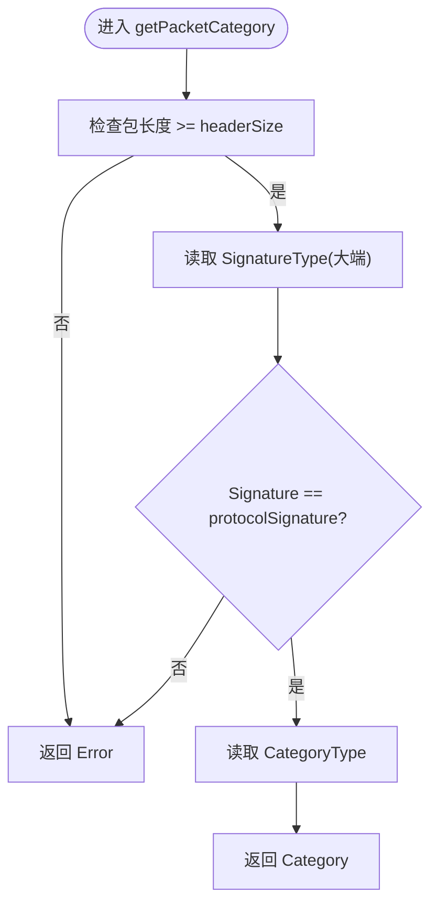
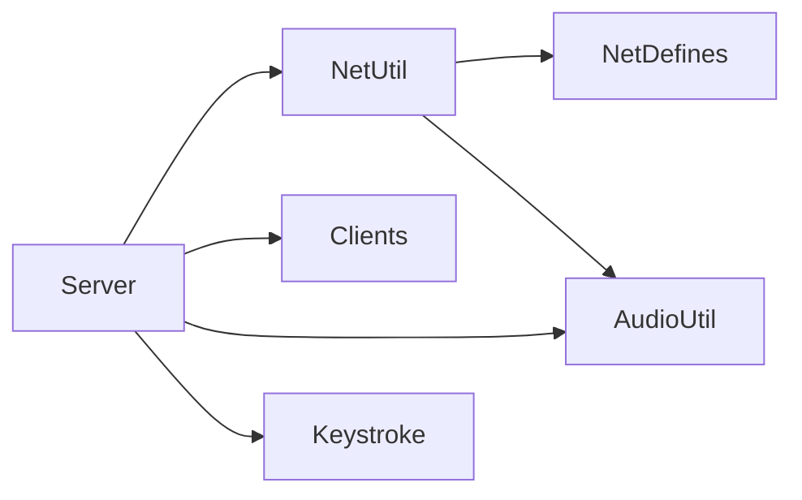

# 网络通信 API

<cite>
**本文引用的文件**   
- [NetDefines.h](file://SoundRemote/NetDefines.h)
- [NetUtil.h](file://SoundRemote/NetUtil.h)
- [NetUtil.cpp](file://SoundRemote/NetUtil.cpp)
- [Server.h](file://SoundRemote/Server.h)
- [Server.cpp](file://SoundRemote/Server.cpp)
- [Clients.h](file://SoundRemote/Clients.h)
- [AudioUtil.h](file://SoundRemote/AudioUtil.h)
- [Keystroke.h](file://SoundRemote/Keystroke.h)
- [NetUtilTest.cpp](file://Tests/NetUtilTest.cpp)
</cite>

## 目录
1. [简介](#简介)
2. [项目结构](#项目结构)
3. [核心组件](#核心组件)
4. [架构总览](#架构总览)
5. [详细组件分析](#详细组件分析)
6. [依赖关系分析](#依赖关系分析)
7. [性能考虑](#性能考虑)
8. [故障排除指南](#故障排除指南)
9. [结论](#结论)
10. [附录：协议规范与示例](#附录协议规范与示例)

## 简介
本文件为 SoundRemote-WinServer 项目的网络通信模块提供完整 API 文档，覆盖以下范围：
- Server 类的 UDP 服务器接口（发送、接收、连接管理、心跳）
- NetUtil 网络工具函数（数据包构造与解析、本地地址枚举、压缩类型转换）
- NetDefines 中的协议定义（包头、消息类型、数据结构、常量）
- UDP 通信建立流程、数据包的发送与接收机制
- 错误处理与超时策略
- 网络协议规范、数据包格式说明
- 完整的通信示例代码路径指引
- 网络性能调优建议与故障排除指南

## 项目结构
与网络通信相关的核心文件位于 SoundRemote 目录下，测试用例位于 Tests 目录。关键文件职责如下：
- NetDefines.h：协议常量、数据类型、包结构体、消息类别枚举、默认端口等
- NetUtil.h/.cpp：网络工具函数，负责构建和解析数据包、获取本地 IPv4 地址、压缩值映射
- Server.h/.cpp：UDP 服务器实现，基于 Boost.Asio 协程异步收发、客户端维护、音频广播、按键事件回调
- Clients.h：客户端集合管理与超时维护
- AudioUtil.h：音频压缩枚举与相关常量
- Keystroke.h：键盘事件封装与模拟

图表来源
- [NetDefines.h:1-69](file://SoundRemote/NetDefines.h#L1-L69)
- [NetUtil.h:1-41](file://SoundRemote/NetUtil.h#L1-L41)
- [NetUtil.cpp:1-218](file://SoundRemote/NetUtil.cpp#L1-L218)
- [Server.h:1-61](file://SoundRemote/Server.h#L1-L61)
- [Server.cpp:1-210](file://SoundRemote/Server.cpp#L1-L210)
- [Clients.h:1-60](file://SoundRemote/Clients.h#L1-L60)
- [AudioUtil.h:1-170](file://SoundRemote/AudioUtil.h#L1-L170)
- [Keystroke.h:1-41](file://SoundRemote/Keystroke.h#L1-L41)

章节来源
- [NetDefines.h:1-69](file://SoundRemote/NetDefines.h#L1-L69)
- [NetUtil.h:1-41](file://SoundRemote/NetUtil.h#L1-L41)
- [NetUtil.cpp:1-218](file://SoundRemote/NetUtil.cpp#L1-L218)
- [Server.h:1-61](file://SoundRemote/Server.h#L1-L61)
- [Server.cpp:1-210](file://SoundRemote/Server.cpp#L1-L210)
- [Clients.h:1-60](file://SoundRemote/Clients.h#L1-L60)
- [AudioUtil.h:1-170](file://SoundRemote/AudioUtil.h#L1-L170)
- [Keystroke.h:1-41](file://SoundRemote/Keystroke.h#L1-L41)

## 核心组件
本节概述各组件的职责与对外暴露的 API 要点。

- NetDefines
  - 定义协议签名、包头字段、各类数据包大小与偏移
  - 定义消息类别 Category 枚举（Connect、Disconnect、SetFormat、Keystroke、AudioDataUncompressed、AudioDataOpus、ClientKeepAlive、ServerKeepAlive、Ack、Error）
  - 定义 ConnectData、SetFormatData 等数据包结构体
  - 定义默认端口、输入缓冲区大小、协议版本等常量

- NetUtil
  - 创建音频数据包 createAudioPacket
  - 创建心跳/断开/Ack 数据包
  - 解析包类别 getPacketCategory
  - 解析按键 getKeystroke
  - 解析连接请求 getConnectData
  - 解析设置格式请求 getSetFormatData
  - 将网络压缩值转换为内部 Audio::Compression 枚举 compressionFromNetworkValue
  - 获取本机 IPv4 地址列表 getLocalAddresses

- Server
  - 构造函数初始化发送/接收 UDP socket，启动接收协程与维护定时器
  - sendAudio 按目标客户端压缩类型广播音频帧
  - sendDisconnectBlocking 阻塞式向所有客户端发送断开包
  - setKeystrokeCallback 注册按键回调
  - onClientsUpdate 更新客户端缓存
  - 内部 receive 协程循环接收并分发到具体处理器
  - processConnect/processSetFormat/processKeystroke/processKeepAlive 处理不同消息
  - send/handleSend 异步发送与完成回调
  - startMaintenanceTimer/maintain/keepalive 定时任务与心跳

- Clients
  - 维护客户端集合、压缩配置、最后接触时间
  - 支持添加、删除、更新压缩、保持活跃、超时清理
  - 通过监听器通知客户端列表变化

章节来源
- [NetDefines.h:1-69](file://SoundRemote/NetDefines.h#L1-L69)
- [NetUtil.h:1-41](file://SoundRemote/NetUtil.h#L1-L41)
- [NetUtil.cpp:1-218](file://SoundRemote/NetUtil.cpp#L1-L218)
- [Server.h:1-61](file://SoundRemote/Server.h#L1-L61)
- [Server.cpp:1-210](file://SoundRemote/Server.cpp#L1-L210)
- [Clients.h:1-60](file://SoundRemote/Clients.h#L1-L60)

## 架构总览
下图展示了 UDP 服务器在运行时的主要交互：客户端发起连接、设置音频格式、发送按键与心跳；服务端周期性发送心跳并广播音频数据。

图表来源
- [Server.cpp:80-125](file://SoundRemote/Server.cpp#L80-L125)
- [Server.cpp:127-166](file://SoundRemote/Server.cpp#L127-L166)
- [Server.cpp:182-209](file://SoundRemote/Server.cpp#L182-L209)
- [NetUtil.cpp:171-218](file://SoundRemote/NetUtil.cpp#L171-L218)
- [Clients.h:15-52](file://SoundRemote/Clients.h#L15-L52)

## 详细组件分析

### Server 类（UDP 服务器）
- 构造与生命周期
  - 使用两个 UDP socket：socketReceive_ 绑定 serverPort 用于接收；socketSend_ 用于发送
  - 启动 receive 协程持续接收数据报
  - 启动维护定时器，每秒执行一次 keepalive 与 clients_->maintain()
  - 析构时关闭 socket

- 对外接口
  - sendAudio(compression, sequenceNumber, data)：根据压缩类型选择音频类别，调用 NetUtil 构建包，遍历对应压缩类型的客户端地址进行广播
  - sendDisconnectBlocking()：阻塞式向所有已知客户端发送断开包
  - setKeystrokeCallback(callback)：注册按键回调
  - onClientsUpdate(clients)：更新客户端缓存（按压缩类型分组）

- 内部处理
  - receive：循环 async_receive_from，解析包类别后分派到具体处理器
  - processConnect：解析 ConnectData，校验压缩类型，加入客户端列表，返回 AckConnectPacket
  - processSetFormat：解析 SetFormatData，更新客户端压缩类型，返回 AckSetFormatPacket
  - processKeystroke：解析按键，调用 emulate 并在可选回调中上报
  - processKeepAlive：标记客户端活跃
  - send/handleSend：异步发送，错误时抛出运行时异常
  - startMaintenanceTimer/maintain/keepalive：定时任务，发送心跳并维护客户端状态

图表来源
- [Server.h:20-61](file://SoundRemote/Server.h#L20-L61)
- [Server.cpp:18-210](file://SoundRemote/Server.cpp#L18-L210)
- [Clients.h:15-52](file://SoundRemote/Clients.h#L15-L52)
- [NetUtil.h:11-41](file://SoundRemote/NetUtil.h#L11-L41)

章节来源
- [Server.h:1-61](file://SoundRemote/Server.h#L1-L61)
- [Server.cpp:1-210](file://SoundRemote/Server.cpp#L1-L210)
- [Clients.h:1-60](file://SoundRemote/Clients.h#L1-L60)
- [NetUtil.h:1-41](file://SoundRemote/NetUtil.h#L1-L41)

### NetUtil 工具函数
- 数据包构造
  - createAudioPacket：写入包头、序列号、音频数据
  - createKeepAlivePacket：仅包含包头的 ServerKeepAlive 包
  - createDisconnectPacket：仅包含包头的 Disconnect 包
  - createAckConnectPacket：Ack 包，包含 requestId 与协议版本
  - createAckSetFormatPacket：Ack 包，包含 requestId

- 数据包解析
  - getPacketCategory：校验签名与长度，返回类别
  - getKeystroke：从数据区读取键码与修饰位
  - getConnectData：读取协议版本、请求 ID、压缩类型
  - getSetFormatData：读取请求 ID、压缩类型

- 其他
  - compressionFromNetworkValue：将网络压缩值映射到 Audio::Compression
  - getLocalAddresses：通过 Windows IP Helper API 枚举本机 IPv4 地址

图表来源
- [NetUtil.cpp:171-180](file://SoundRemote/NetUtil.cpp#L171-L180)

章节来源
- [NetUtil.h:1-41](file://SoundRemote/NetUtil.h#L1-L41)
- [NetUtil.cpp:1-218](file://SoundRemote/NetUtil.cpp#L1-L218)

### NetDefines 协议定义
- 包头字段
  - SignatureType：协议签名（uint16_t）
  - CategoryType：消息类别（uint8_t）
  - SizeType：包长度（uint16_t）
  - 偏移量：signatureOffset、categoryOffset、sizeOffset、dataOffset
  - headerSize：包头总大小

- 数据包字段
  - ProtocolVersionType：协议版本（uint8_t）
  - RequestIdType：请求 ID（uint16_t）
  - CompressionType：压缩类型（uint8_t）
  - KeyType/ModsType：按键与修饰位
  - SequenceNumberType：序列号（uint32_t）
  - ackCustomDataSize：Ack 自定义数据大小（4）
  - keystrokeSize、ackSize、sequenceNumberSize、audioDataOffset 等

- 数据包结构体
  - ConnectData：包含 protocol、requestId、compression，size 固定
  - SetFormatData：包含 requestId、compression，size 固定

- 消息类别枚举 Category
  - Error、Connect、Disconnect、SetFormat、Keystroke、AudioDataUncompressed、AudioDataOpus、ClientKeepAlive、ServerKeepAlive、Ack

- 常量
  - protocolSignature：0xA571u
  - protocolVersion：1u
  - defaultServerPort：15711u
  - defaultClientPort：15712u
  - inputPacketSize：1024

章节来源
- [NetDefines.h:1-69](file://SoundRemote/NetDefines.h#L1-L69)

## 依赖关系分析
- Server 依赖 NetUtil 进行包构建与解析，依赖 Clients 管理客户端集合
- NetUtil 依赖 NetDefines 提供的类型与常量，依赖 AudioUtil 的压缩枚举映射
- Server 依赖 AudioUtil 的压缩枚举以决定音频类别
- Server 依赖 Keystroke 以模拟按键事件

图表来源
- [Server.h:1-61](file://SoundRemote/Server.h#L1-L61)
- [NetUtil.h:1-41](file://SoundRemote/NetUtil.h#L1-L41)
- [NetDefines.h:1-69](file://SoundRemote/NetDefines.h#L1-L69)
- [AudioUtil.h:1-170](file://SoundRemote/AudioUtil.h#L1-L170)
- [Keystroke.h:1-41](file://SoundRemote/Keystroke.h#L1-L41)

章节来源
- [Server.h:1-61](file://SoundRemote/Server.h#L1-L61)
- [NetUtil.h:1-41](file://SoundRemote/NetUtil.h#L1-L41)
- [NetDefines.h:1-69](file://SoundRemote/NetDefines.h#L1-L69)
- [AudioUtil.h:1-170](file://SoundRemote/AudioUtil.h#L1-L170)
- [Keystroke.h:1-41](file://SoundRemote/Keystroke.h#L1-L41)

## 性能考虑
- 使用 Boost.Asio 协程进行异步 I/O，避免阻塞线程，提高并发能力
- 音频广播按压缩类型分组缓存客户端地址，减少重复查找开销
- 心跳周期为 1 秒，兼顾实时性与资源消耗
- 输入缓冲区大小为 1024 字节，适合小帧音频与低延迟场景
- 建议在高频音频流场景下：
  - 合理设置 Opus 帧长与码率，平衡带宽与延迟
  - 批量发送或合并小包以降低系统调用开销
  - 监控丢包与重传策略（如需可靠性，可在上层引入序列号确认机制）

[本节为通用指导，不直接分析具体文件]

## 故障排除指南
- 接收异常
  - receive 协程捕获 boost::asio::system_error 与 std::exception，非 operation_aborted 的错误会显示错误文本并退出进程
  - 若出现“operation aborted”，通常为正常关闭流程，无需处理

- 发送异常
  - handleSend 回调中若检测到 error_code，则抛出运行时异常，需在上层捕获并记录日志

- 定时器异常
  - maintain 回调中若 timer 错误且非 operation_aborted，抛出运行时异常

- 客户端超时
  - Clients::maintain 会清理超过 timeoutSeconds 未收到 KeepAlive 的客户端，确保资源释放

- 常见排查步骤
  - 检查防火墙是否放行默认端口（serverPort/clientPort）
  - 验证协议签名与包长度是否正确
  - 确认压缩类型是否在支持范围内（0-5）
  - 查看本地 IPv4 地址列表是否正确

章节来源
- [Server.cpp:111-124](file://SoundRemote/Server.cpp#L111-L124)
- [Server.cpp:176-180](file://SoundRemote/Server.cpp#L176-L180)
- [Server.cpp:187-199](file://SoundRemote/Server.cpp#L187-L199)
- [Clients.h:15-52](file://SoundRemote/Clients.h#L15-L52)

## 结论
该网络通信模块采用清晰的协议定义与分层设计：NetDefines 定义协议，NetUtil 提供工具函数，Server 实现 UDP 服务器逻辑并与 Clients 协作管理客户端状态。整体架构简洁高效，适合低延迟音频传输与远程控制场景。通过合理的性能优化与完善的错误处理，可稳定支撑生产环境使用。

[本节为总结性内容，不直接分析具体文件]

## 附录：协议规范与示例

### 协议规范
- 包头
  - SignatureType（2 字节，大端）：固定为 0xA571
  - CategoryType（1 字节）：消息类别
  - SizeType（2 字节，大端）：包总长度
  - 数据区起始偏移为 headerSize

- 消息类别
  - Connect：客户端连接请求
  - Disconnect：客户端断开
  - SetFormat：设置音频格式（压缩类型）
  - Keystroke：按键事件
  - AudioDataUncompressed：未压缩音频数据
  - AudioDataOpus：Opus 压缩音频数据
  - ClientKeepAlive：客户端心跳
  - ServerKeepAlive：服务器心跳
  - Ack：应答包
  - Error：错误包

- 数据包结构体
  - ConnectData：protocol（1）、requestId（2）、compression（1），size=4
  - SetFormatData：requestId（2）、compression（1），size=3
  - Keystroke：key（1）、mods（1），size=2
  - Ack：requestId（2）+ 自定义数据（4）

- 常量
  - protocolVersion = 1
  - defaultServerPort = 15711
  - defaultClientPort = 15712
  - inputPacketSize = 1024

章节来源
- [NetDefines.h:1-69](file://SoundRemote/NetDefines.h#L1-L69)

### 数据包格式说明
- 音频数据包
  - 类别：AudioDataUncompressed 或 AudioDataOpus
  - 数据区前 4 字节为大端序列号
  - 后续为音频载荷

- 心跳包
  - 类别：ServerKeepAlive 或 ClientKeepAlive
  - 仅含包头

- 断开包
  - 类别：Disconnect
  - 仅含包头

- Ack 包
  - 类别：Ack
  - 数据区包含 requestId（2 字节，大端）与自定义数据（4 字节）

章节来源
- [NetUtil.cpp:129-169](file://SoundRemote/NetUtil.cpp#L129-L169)
- [NetDefines.h:22-33](file://SoundRemote/NetDefines.h#L22-L33)

### 通信示例代码路径
- 构建音频数据包
  - 参考：[NetUtil.cpp:129-140](file://SoundRemote/NetUtil.cpp#L129-L140)
- 构建心跳/断开/Ack 数据包
  - 参考：[NetUtil.cpp:142-169](file://SoundRemote/NetUtil.cpp#L142-L169)
- 解析包类别与数据
  - 参考：[NetUtil.cpp:171-218](file://SoundRemote/NetUtil.cpp#L171-L218)
- 服务器接收与分发
  - 参考：[Server.cpp:80-125](file://SoundRemote/Server.cpp#L80-L125)
- 连接与格式设置处理
  - 参考：[Server.cpp:127-153](file://SoundRemote/Server.cpp#L127-L153)
- 按键处理与回调
  - 参考：[Server.cpp:155-162](file://SoundRemote/Server.cpp#L155-L162)
- 心跳与定时维护
  - 参考：[Server.cpp:182-209](file://SoundRemote/Server.cpp#L182-L209)
- 单元测试验证数据包格式
  - 参考：[NetUtilTest.cpp:29-130](file://Tests/NetUtilTest.cpp#L29-L130)

章节来源
- [NetUtil.cpp:129-218](file://SoundRemote/NetUtil.cpp#L129-L218)
- [Server.cpp:80-209](file://SoundRemote/Server.cpp#L80-L209)
- [NetUtilTest.cpp:29-130](file://Tests/NetUtilTest.cpp#L29-L130)