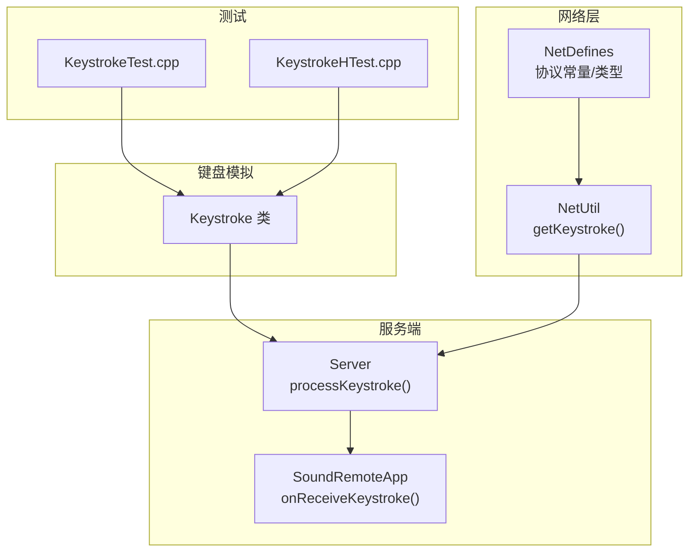
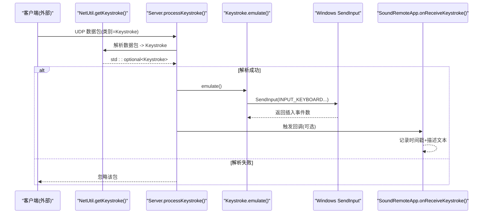
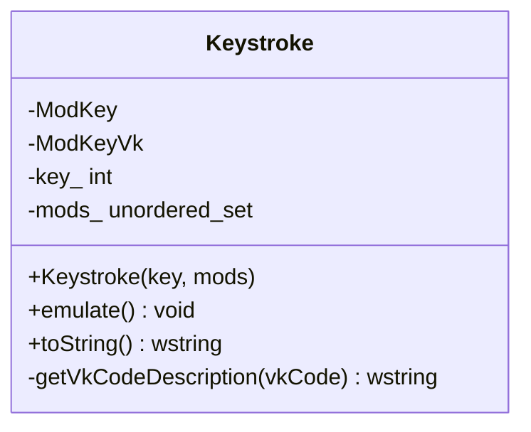
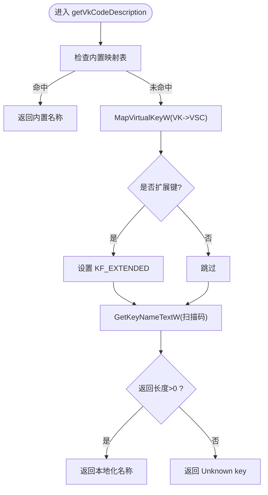
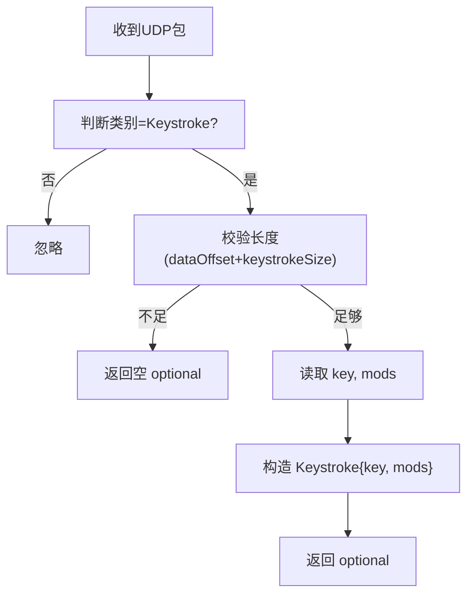
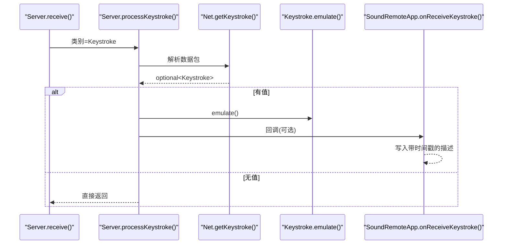
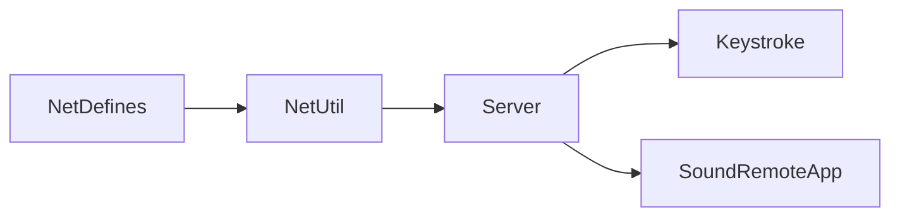

# 输入模拟 API

<cite>
**本文引用的文件**   
- [SoundRemote/Keystroke.h](file://SoundRemote/Keystroke.h)
- [SoundRemote/Keystroke.cpp](file://SoundRemote/Keystroke.cpp)
- [Tests/KeystrokeTest.cpp](file://Tests/KeystrokeTest.cpp)
- [Tests/header_tests/KeystrokeHTest.cpp](file://Tests/header_tests/KeystrokeHTest.cpp)
- [SoundRemote/NetDefines.h](file://SoundRemote/NetDefines.h)
- [SoundRemote/NetUtil.h](file://SoundRemote/NetUtil.h)
- [SoundRemote/NetUtil.cpp](file://SoundRemote/NetUtil.cpp)
- [SoundRemote/Server.h](file://SoundRemote/Server.h)
- [SoundRemote/Server.cpp](file://SoundRemote/Server.cpp)
- [SoundRemote/SoundRemoteApp.cpp](file://SoundRemote/SoundRemoteApp.cpp)
</cite>

## 目录
1. [简介](#简介)
2. [项目结构](#项目结构)
3. [核心组件](#核心组件)
4. [架构总览](#架构总览)
5. [详细组件分析](#详细组件分析)
6. [依赖关系分析](#依赖关系分析)
7. [性能考虑](#性能考虑)
8. [故障排查指南](#故障排查指南)
9. [结论](#结论)
10. [附录](#附录)

## 简介
本文件为键盘输入模拟模块的API文档，聚焦于 Keystroke 类及其在网络协议与服务器处理流程中的集成。内容涵盖：
- 按键按下、释放与组合键（修饰键）模拟接口
- 虚拟键码映射与可读描述生成
- 网络数据包中键盘事件的解析与构造
- 安全限制机制与兼容性注意事项
- 完整的键盘事件处理示例路径（快捷键绑定、事件过滤、安全控制）

## 项目结构
与键盘输入模拟相关的代码主要分布在以下位置：
- 核心实现：SoundRemote/Keystroke.{h,cpp}
- 网络协议定义：SoundRemote/NetDefines.h
- 网络工具函数：SoundRemote/NetUtil.{h,cpp}
- 服务器接收与回调：SoundRemote/Server.{h,cpp}
- UI显示与回调注册：SoundRemote/SoundRemoteApp.cpp
- 单元测试：Tests/KeystrokeTest.cpp、Tests/header_tests/KeystrokeHTest.cpp

图表来源
- [SoundRemote/Keystroke.h:1-41](file://SoundRemote/Keystroke.h#L1-L41)
- [SoundRemote/NetDefines.h:1-69](file://SoundRemote/NetDefines.h#L1-L69)
- [SoundRemote/NetUtil.h:1-41](file://SoundRemote/NetUtil.h#L1-L41)
- [SoundRemote/Server.h:1-61](file://SoundRemote/Server.h#L1-L61)
- [SoundRemote/SoundRemoteApp.cpp:325-345](file://SoundRemote/SoundRemoteApp.cpp#L325-L345)

章节来源
- [SoundRemote/Keystroke.h:1-41](file://SoundRemote/Keystroke.h#L1-L41)
- [SoundRemote/NetDefines.h:1-69](file://SoundRemote/NetDefines.h#L1-L69)
- [SoundRemote/NetUtil.h:1-41](file://SoundRemote/NetUtil.h#L1-L41)
- [SoundRemote/Server.h:1-61](file://SoundRemote/Server.h#L1-L61)
- [SoundRemote/SoundRemoteApp.cpp:325-345](file://SoundRemote/SoundRemoteApp.cpp#L325-L345)

## 核心组件
- Keystroke 类
  - 构造函数：接受虚拟键码与修饰键位图，内部将修饰键转换为集合存储
  - emulate()：通过 Windows Input API 发送 INPUT 事件序列，完成按下与释放
  - toString()：生成人类可读的“修饰键 + 主键”字符串
  - getVkCodeDescription()：将虚拟键码映射为本地化名称或特殊键名
- 网络协议相关
  - Net::Packet::KeyType / ModsType：用于传输单个按键与修饰键位图
  - Net::getKeystroke()：从原始数据包解析出 Keystroke 对象
- 服务器端处理
  - Server::processKeystroke()：解析并调用 emulate()，随后触发回调
  - SoundRemoteApp::onReceiveKeystroke()：将按键信息追加到UI日志

章节来源
- [SoundRemote/Keystroke.h:6-41](file://SoundRemote/Keystroke.h#L6-L41)
- [SoundRemote/Keystroke.cpp:7-52](file://SoundRemote/Keystroke.cpp#L7-L52)
- [SoundRemote/NetDefines.h:17-28](file://SoundRemote/NetDefines.h#L17-L28)
- [SoundRemote/NetUtil.cpp:182-191](file://SoundRemote/NetUtil.cpp#L182-L191)
- [SoundRemote/Server.cpp:155-162](file://SoundRemote/Server.cpp#L155-L162)
- [SoundRemote/SoundRemoteApp.cpp:329-340](file://SoundRemote/SoundRemoteApp.cpp#L329-L340)

## 架构总览
下图展示了从客户端网络包到系统级键盘事件的完整链路。

图表来源
- [SoundRemote/NetUtil.cpp:182-191](file://SoundRemote/NetUtil.cpp#L182-L191)
- [SoundRemote/Server.cpp:155-162](file://SoundRemote/Server.cpp#L155-L162)
- [SoundRemote/Keystroke.cpp:20-52](file://SoundRemote/Keystroke.cpp#L20-L52)
- [SoundRemote/SoundRemoteApp.cpp:329-340](file://SoundRemote/SoundRemoteApp.cpp#L329-L340)

## 详细组件分析

### Keystroke 类 API 参考
- 构造
  - 参数 key：虚拟键码，取值范围需符合平台约定（见下节“安全限制”）
  - 参数 mods：修饰键位图，支持 Win/Ctrl/Shift/Alt
- emulate()
  - 行为：按顺序构建 INPUT 数组，先按下所有修饰键，再按下主键，然后依次释放主键与修饰键
  - 底层：调用 SendInput 提交 INPUT_KEYBOARD 事件
- toString()
  - 行为：输出形如 “Win + Ctrl + Shift + Alt + <键名>” 的可读字符串
  - 键名来源：优先使用内置映射；否则通过 MapVirtualKeyW + GetKeyNameTextW 获取本地化名称
- 内部枚举
  - ModKey：修饰键位图标志（Win/Ctrl/Shift/Alt）
  - ModKeyVk：对应 Windows 虚拟键码（左/右修饰键统一映射到特定VK）

图表来源
- [SoundRemote/Keystroke.h:6-41](file://SoundRemote/Keystroke.h#L6-L41)
- [SoundRemote/Keystroke.cpp:7-77](file://SoundRemote/Keystroke.cpp#L7-L77)

章节来源
- [SoundRemote/Keystroke.h:6-41](file://SoundRemote/Keystroke.h#L6-L41)
- [SoundRemote/Keystroke.cpp:7-77](file://SoundRemote/Keystroke.cpp#L7-L77)

### 虚拟键码映射与描述生成
- 内置映射覆盖浏览器、媒体、电源等常用功能键
- 通用键名通过 MapVirtualKeyW 与 GetKeyNameTextW 获取，并对扩展键进行 KF_EXTENDED 修正
- 未知键返回“Unknown key”

图表来源
- [SoundRemote/Keystroke.cpp:79-152](file://SoundRemote/Keystroke.cpp#L79-L152)

章节来源
- [SoundRemote/Keystroke.cpp:79-152](file://SoundRemote/Keystroke.cpp#L79-L152)

### 网络协议与解析
- 数据包字段
  - KeyType：单字节虚拟键码
  - ModsType：单字节修饰键位图
  - keystrokeSize = sizeof(KeyType) + sizeof(ModsType)
- 解析流程
  - 校验数据长度 >= dataOffset + keystrokeSize
  - 读取 key 与 mods，构造 Keystroke 对象

图表来源
- [SoundRemote/NetDefines.h:17-28](file://SoundRemote/NetDefines.h#L17-L28)
- [SoundRemote/NetUtil.cpp:182-191](file://SoundRemote/NetUtil.cpp#L182-L191)

章节来源
- [SoundRemote/NetDefines.h:17-28](file://SoundRemote/NetDefines.h#L17-L28)
- [SoundRemote/NetUtil.cpp:182-191](file://SoundRemote/NetUtil.cpp#L182-L191)

### 服务器端处理与回调
- 接收循环根据类别分发，Keystroke 类别交由 processKeystroke 处理
- processKeystroke 解析后调用 emulate()，并可选择触发回调
- UI 层在回调中将时间戳与描述追加至只读编辑框

图表来源
- [SoundRemote/Server.cpp:100-102](file://SoundRemote/Server.cpp#L100-L102)
- [SoundRemote/Server.cpp:155-162](file://SoundRemote/Server.cpp#L155-L162)
- [SoundRemote/NetUtil.cpp:182-191](file://SoundRemote/NetUtil.cpp#L182-L191)
- [SoundRemote/SoundRemoteApp.cpp:329-340](file://SoundRemote/SoundRemoteApp.cpp#L329-L340)

章节来源
- [SoundRemote/Server.cpp:100-102](file://SoundRemote/Server.cpp#L100-L102)
- [SoundRemote/Server.cpp:155-162](file://SoundRemote/Server.cpp#L155-L162)
- [SoundRemote/SoundRemoteApp.cpp:329-340](file://SoundRemote/SoundRemoteApp.cpp#L329-L340)

### 单元测试要点
- 无修饰键时，toString 应仅包含主键名
- 同时包含 Win/Ctrl/Shift/Alt 时，结果字符串应包含各修饰键子串

章节来源
- [Tests/KeystrokeTest.cpp:12-30](file://Tests/KeystrokeTest.cpp#L12-L30)
- [Tests/header_tests/KeystrokeHTest.cpp:5-7](file://Tests/header_tests/KeystrokeHTest.cpp#L5-L7)

## 依赖关系分析
- Keystroke 依赖 Windows 输入子系统（SendInput、INPUT_KEYBOARD、KEYEVENTF_*）
- NetUtil 依赖 NetDefines 定义的协议常量与类型
- Server 依赖 NetUtil 解析数据包，并持有 KeystrokeCallback 以通知上层
- SoundRemoteApp 注册回调并在UI中展示

图表来源
- [SoundRemote/NetDefines.h:1-69](file://SoundRemote/NetDefines.h#L1-L69)
- [SoundRemote/NetUtil.h:1-41](file://SoundRemote/NetUtil.h#L1-L41)
- [SoundRemote/Server.h:1-61](file://SoundRemote/Server.h#L1-L61)

章节来源
- [SoundRemote/NetDefines.h:1-69](file://SoundRemote/NetDefines.h#L1-L69)
- [SoundRemote/NetUtil.h:1-41](file://SoundRemote/NetUtil.h#L1-L41)
- [SoundRemote/Server.h:1-61](file://SoundRemote/Server.h#L1-L61)

## 性能考虑
- 单次 emulate() 会批量构造 INPUT 数组并通过一次 SendInput 提交，减少系统调用次数
- 修饰键数量越多，INPUT 数组越大；建议合理合并高频组合键以减少重复构造
- 网络侧解析采用 span 与固定大小字段，避免额外拷贝

[本节为通用指导，不直接分析具体文件]

## 故障排查指南
- SendInput 返回值不等于预期事件数
  - 现象：emulate() 内记录了错误分支但未抛出异常
  - 排查：确认进程权限、前台窗口焦点、是否被安全软件拦截
- 解析失败导致 no-op
  - 现象：processKeystroke 直接返回
  - 排查：检查数据包长度是否满足 dataOffset + keystrokeSize，以及 key/mods 字段是否正确
- 键名显示为“Unknown key”
  - 现象：toString 中出现未知键
  - 排查：确认 VK 值有效，必要时检查键盘布局与扩展键标志

章节来源
- [SoundRemote/Keystroke.cpp:48-51](file://SoundRemote/Keystroke.cpp#L48-L51)
- [SoundRemote/NetUtil.cpp:182-191](file://SoundRemote/NetUtil.cpp#L182-L191)
- [SoundRemote/Server.cpp:155-162](file://SoundRemote/Server.cpp#L155-L162)

## 结论
Keystroke 模块提供了简洁而强大的键盘事件模拟能力，结合网络协议可在远程场景下安全地注入按键。其设计将“协议解析—事件模拟—回调展示”解耦，便于扩展与测试。建议在接入业务逻辑时增加安全白名单与速率限制，确保系统稳定性与用户体验。

[本节为总结性内容，不直接分析具体文件]

## 附录

### 安全限制与兼容性说明
- 虚拟键码范围
  - 构造参数 key 应在 1..254 范围内（遵循平台约定）
- 修饰键支持
  - 支持 Win/Ctrl/Shift/Alt 四种修饰键的组合
- 扩展键处理
  - 对部分键（如方向键、Insert/Delete、左右修饰键等）使用 KEYEVENTF_EXTENDEDKEY 以确保正确识别
- 兼容性与权限
  - 需要足够的用户态权限才能注入系统级输入事件
  - 不同键盘布局会影响 GetKeyNameTextW 的输出，但不影响 VK 语义

章节来源
- [SoundRemote/Keystroke.h:11-13](file://SoundRemote/Keystroke.h#L11-L13)
- [SoundRemote/Keystroke.cpp:44-46](file://SoundRemote/Keystroke.cpp#L44-L46)
- [SoundRemote/Keystroke.cpp:135-143](file://SoundRemote/Keystroke.cpp#L135-L143)

### 键盘事件处理完整示例（路径指引）
- 快捷键绑定
  - 在应用层监听回调，将特定组合键映射为业务动作
  - 参考路径：[SoundRemote/SoundRemoteApp.cpp:329-340](file://SoundRemote/SoundRemoteApp.cpp#L329-L340)
- 事件过滤
  - 在 Server::processKeystroke 前或回调中进行白名单/黑名单过滤
  - 参考路径：[SoundRemote/Server.cpp:155-162](file://SoundRemote/Server.cpp#L155-L162)
- 安全控制
  - 对 key 与 mods 做范围与组合校验，拒绝危险组合（如 Win+Esc、Ctrl+Alt+Del 等）
  - 参考路径：[SoundRemote/NetUtil.cpp:182-191](file://SoundRemote/NetUtil.cpp#L182-L191)、[SoundRemote/Keystroke.cpp:7-18](file://SoundRemote/Keystroke.cpp#L7-L18)