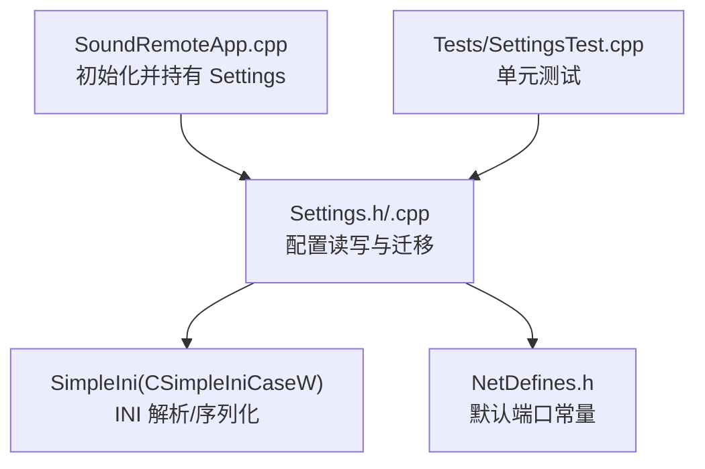
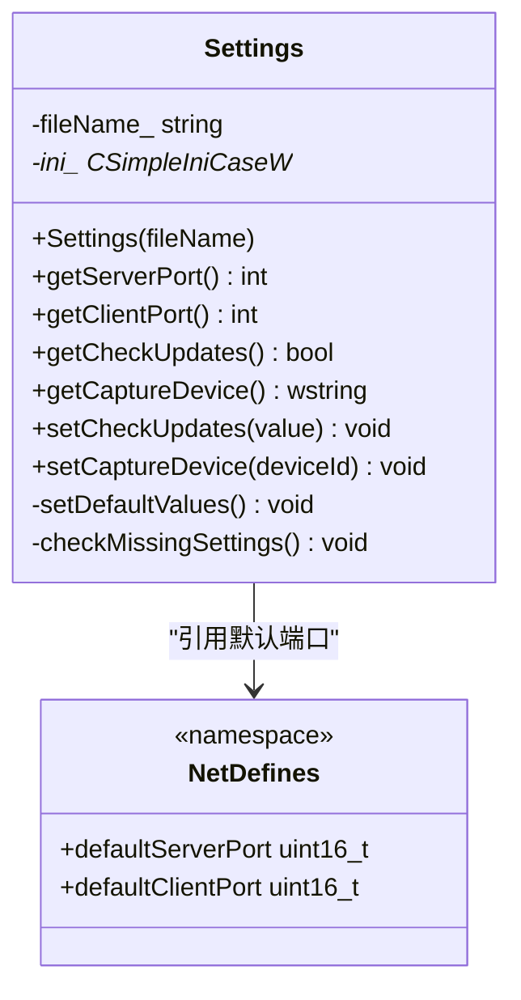
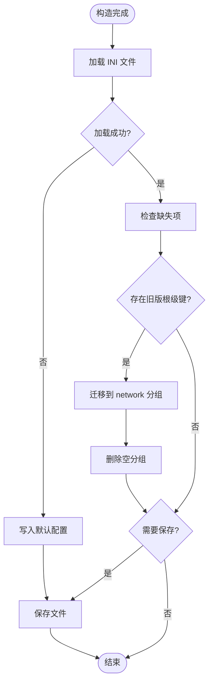
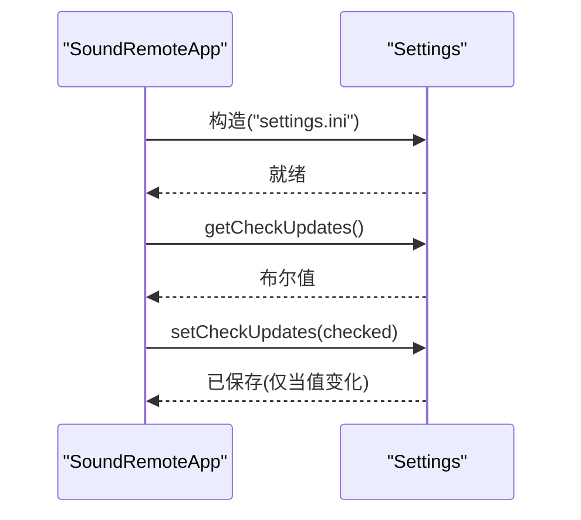
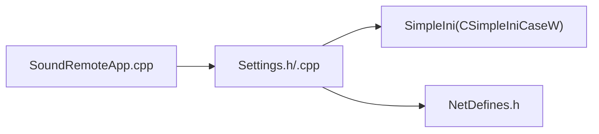

# 配置管理 API

<cite>
**本文引用的文件**
- [Settings.h](file://SoundRemote/Settings.h)
- [Settings.cpp](file://SoundRemote/Settings.cpp)
- [NetDefines.h](file://SoundRemote/NetDefines.h)
- [SoundRemoteApp.cpp](file://SoundRemote/SoundRemoteApp.cpp)
- [SettingsTest.cpp](file://Tests/SettingsTest.cpp)
</cite>

## 目录
1. [简介](#简介)
2. [项目结构](#项目结构)
3. [核心组件](#核心组件)
4. [架构总览](#架构总览)
5. [详细组件分析](#详细组件分析)
6. [依赖关系分析](#依赖关系分析)
7. [性能与并发特性](#性能与并发特性)
8. [故障排查指南](#故障排查指南)
9. [结论](#结论)
10. [附录：使用示例与规范](#附录使用示例与规范)

## 简介
本文件为配置管理模块的 API 文档，聚焦于 Settings 类的配置读写接口。该模块基于 INI 文件格式持久化应用设置，提供默认值管理、缺失项检测与迁移、以及“仅当变更时写入”的优化策略。当前实现未包含配置项校验器、权限控制、热重载、备份恢复等高级能力；本文在相应章节明确说明现状并提供扩展建议。

## 项目结构
配置相关代码位于 SoundRemote 子项目中，主要包含以下文件：
- Settings.h / Settings.cpp：配置类定义与实现
- NetDefines.h：网络相关常量（被用于默认端口）
- SoundRemoteApp.cpp：应用初始化中创建并持有 Settings 实例
- Tests/SettingsTest.cpp：覆盖默认值、读取、写入与迁移逻辑的测试用例

图表来源
- [SoundRemoteApp.cpp:506-508](file://SoundRemote/SoundRemoteApp.cpp#L506-L508)
- [Settings.h:11-37](file://SoundRemote/Settings.h#L11-L37)
- [Settings.cpp:24-33](file://SoundRemote/Settings.cpp#L24-L33)
- [NetDefines.h:64-65](file://SoundRemote/NetDefines.h#L64-L65)
- [SettingsTest.cpp:27-87](file://Tests/SettingsTest.cpp#L27-L87)

章节来源
- [SoundRemoteApp.cpp:506-508](file://SoundRemote/SoundRemoteApp.cpp#L506-L508)
- [Settings.h:11-37](file://SoundRemote/Settings.h#L11-L37)
- [Settings.cpp:24-33](file://SoundRemote/Settings.cpp#L24-L33)
- [NetDefines.h:64-65](file://SoundRemote/NetDefines.h#L64-L65)
- [SettingsTest.cpp:27-87](file://Tests/SettingsTest.cpp#L27-L87)

## 核心组件
- Settings 类
  - 负责加载/保存 INI 配置文件
  - 提供只读访问器与受控写入器
  - 内置默认值与缺失项迁移逻辑
  - 采用“差异比较后写入”的策略减少磁盘 I/O

- 配置分组与键名
  - 分组：network、general
  - 键名：server_port、client_port、check_updates、capture_device

- 默认值来源
  - server_port、client_port 来自 Net::defaultServerPort、Net::defaultClientPort
  - check_updates 默认为 true
  - capture_device 默认为 defaultRenderDeviceId

章节来源
- [Settings.h:11-37](file://SoundRemote/Settings.h#L11-L37)
- [Settings.cpp:5-22](file://SoundRemote/Settings.cpp#L5-L22)
- [NetDefines.h:64-65](file://SoundRemote/NetDefines.h#L64-L65)

## 架构总览
Settings 通过 SimpleIni 库完成 INI 文件的加载与保存。构造阶段优先尝试加载现有文件，若失败则生成默认配置并立即落盘。运行时对可写配置进行“值不变不写盘”的优化。

图表来源
- [Settings.h:11-37](file://SoundRemote/Settings.h#L11-L37)
- [Settings.cpp:17-22](file://SoundRemote/Settings.cpp#L17-L22)
- [NetDefines.h:64-65](file://SoundRemote/NetDefines.h#L64-L65)

## 详细组件分析

### Settings 类 API 概览
- 构造函数
  - 参数：配置文件路径（字符串）
  - 行为：加载现有 INI；若不存在或加载失败，则写入默认配置并保存
- 读取接口
  - getServerPort()：返回 network.server_port（整型）
  - getClientPort()：返回 network.client_port（整型）
  - getCheckUpdates()：返回 general.check_updates（布尔）
  - getCaptureDevice()：返回 general.capture_device（宽字符串）
- 写入接口
  - setCheckUpdates(bool)：仅在值变化时更新并保存
  - setCaptureDevice(wstring)：仅在值变化时更新并保存

章节来源
- [Settings.h:13-29](file://SoundRemote/Settings.h#L13-L29)
- [Settings.cpp:35-65](file://SoundRemote/Settings.cpp#L35-L65)

### 配置数据结构与分组
- 分组
  - network：网络相关配置
  - general：通用配置
- 键名与类型
  - network/server_port：整型
  - network/client_port：整型
  - general/check_updates：布尔
  - general/capture_device：宽字符串

章节来源
- [Settings.cpp:5-15](file://SoundRemote/Settings.cpp#L5-L15)

### 默认值管理
- 默认值集中定义于 DefaultValue 命名空间
- 端口默认值来源于 Net::defaultServerPort 与 Net::defaultClientPort
- 布尔与设备 ID 默认值直接内联定义

章节来源
- [Settings.cpp:17-22](file://SoundRemote/Settings.cpp#L17-L22)
- [NetDefines.h:64-65](file://SoundRemote/NetDefines.h#L64-L65)

### 配置迁移机制
- 启动时检查缺失项，自动补齐
- 兼容旧版无分组的 INI：将根级 server_port、client_port 迁移至 network 分组
- 清理根级残留键（空分组），避免脏数据

图表来源
- [Settings.cpp:24-33](file://SoundRemote/Settings.cpp#L24-L33)
- [Settings.cpp:74-106](file://SoundRemote/Settings.cpp#L74-L106)

章节来源
- [Settings.cpp:74-106](file://SoundRemote/Settings.cpp#L74-L106)

### 写入优化与一致性
- 写入前比较当前值与新值，相同则跳过保存，降低磁盘 I/O
- 所有写入均调用 SaveFile 确保持久化

章节来源
- [Settings.cpp:51-65](file://SoundRemote/Settings.cpp#L51-L65)

### 应用集成点
- 应用启动时创建 Settings 实例，文件名固定为 settings.ini
- 菜单项“启动时检查更新”的勾选状态由 getCheckUpdates/setCheckUpdates 驱动

图表来源
- [SoundRemoteApp.cpp:506-508](file://SoundRemote/SoundRemoteApp.cpp#L506-L508)
- [SoundRemoteApp.cpp:514-519](file://SoundRemote/SoundRemoteApp.cpp#L514-L519)
- [SoundRemoteApp.cpp:629-633](file://SoundRemote/SoundRemoteApp.cpp#L629-L633)
- [Settings.cpp:51-57](file://SoundRemote/Settings.cpp#L51-L57)

章节来源
- [SoundRemoteApp.cpp:506-508](file://SoundRemote/SoundRemoteApp.cpp#L506-L508)
- [SoundRemoteApp.cpp:514-519](file://SoundRemote/SoundRemoteApp.cpp#L514-L519)
- [SoundRemoteApp.cpp:629-633](file://SoundRemote/SoundRemoteApp.cpp#L629-L633)

## 依赖关系分析
- Settings 依赖 SimpleIni 进行 INI 解析与序列化
- Settings 依赖 NetDefines 中的默认端口常量
- 应用层通过 SoundRemoteApp 持有 Settings 实例，并在 UI 交互中调用其 API

图表来源
- [SoundRemoteApp.cpp:506-508](file://SoundRemote/SoundRemoteApp.cpp#L506-L508)
- [Settings.cpp:1-3](file://SoundRemote/Settings.cpp#L1-L3)
- [Settings.cpp:3](file://SoundRemote/Settings.cpp#L3)

章节来源
- [SoundRemoteApp.cpp:506-508](file://SoundRemote/SoundRemoteApp.cpp#L506-L508)
- [Settings.cpp:1-3](file://SoundRemote/Settings.cpp#L1-L3)

## 性能与并发特性
- 写入优化：仅在值发生变化时执行保存，减少不必要的磁盘 I/O
- 单例式持有：应用层以成员变量持有 Settings 实例，避免重复构造与频繁 IO
- 并发注意：当前实现未提供线程安全保证；多线程并发读写需在上层加锁或使用同步原语保护

章节来源
- [Settings.cpp:51-65](file://SoundRemote/Settings.cpp#L51-L65)
- [SoundRemoteApp.cpp:506-508](file://SoundRemote/SoundRemoteApp.cpp#L506-L508)

## 故障排查指南
- 无法读取配置
  - 确认配置文件路径是否存在且可读
  - 若文件不存在，构造时会生成默认配置并保存
- 旧版本配置不生效
  - 检查是否仍保留根级键；构造时会尝试迁移到 network 分组并清理空分组
- 写入未生效
  - 确认新值与旧值不同；相同值不会触发保存
  - 检查进程是否有目标目录的写权限

章节来源
- [Settings.cpp:24-33](file://SoundRemote/Settings.cpp#L24-L33)
- [Settings.cpp:74-106](file://SoundRemote/Settings.cpp#L74-L106)
- [Settings.cpp:51-65](file://SoundRemote/Settings.cpp#L51-L65)

## 结论
Settings 模块提供了简洁可靠的 INI 配置管理能力，涵盖默认值、缺失项补齐、旧版迁移与写入优化。当前未实现配置项校验、权限控制、热重载与备份恢复等功能。建议在后续迭代中按需引入这些能力，以满足更复杂的运维需求。

## 附录：使用示例与规范

### 配置文件格式规范（INI）
- 分组与键
  - [network]
    - server_port = 整数
    - client_port = 整数
  - [general]
    - check_updates = 布尔(true/false)
    - capture_device = 宽字符设备标识
- 兼容性
  - 支持旧版无分组形式（根级 server_port、client_port），构造时将自动迁移至 [network] 并清理空分组

章节来源
- [Settings.cpp:74-106](file://SoundRemote/Settings.cpp#L74-L106)
- [SettingsTest.cpp:73-87](file://Tests/SettingsTest.cpp#L73-L87)

### 配置项分组与含义
- network
  - server_port：服务端监听端口（默认来自 Net::defaultServerPort）
  - client_port：客户端端口（默认来自 Net::defaultClientPort）
- general
  - check_updates：启动时是否检查更新（默认 true）
  - capture_device：捕获设备标识（默认 defaultRenderDeviceId）

章节来源
- [Settings.cpp:5-22](file://SoundRemote/Settings.cpp#L5-L22)
- [NetDefines.h:64-65](file://SoundRemote/NetDefines.h#L64-L65)

### 典型使用流程
- 初始化
  - 在应用启动时创建 Settings 实例，传入配置文件路径
- 读取
  - 通过 getServerPort/getClientPort/getCheckUpdates/getCaptureDevice 获取配置
- 修改
  - 通过 setCheckUpdates/setCaptureDevice 修改配置；仅在值变化时落盘
- 验证
  - 参考单元测试中对默认值、读取、写入与迁移的断言

章节来源
- [SoundRemoteApp.cpp:506-508](file://SoundRemote/SoundRemoteApp.cpp#L506-L508)
- [SettingsTest.cpp:27-124](file://Tests/SettingsTest.cpp#L27-L124)

### 配置项验证
- 现状：当前未实现显式的配置项校验逻辑
- 建议：在读取入口增加范围/格式校验，或在写入前进行预校验，失败时抛出异常或回退默认值

[本节为概念性建议，不涉及具体源码]

### 权限控制
- 现状：未实现基于角色的配置访问控制
- 建议：在 Settings 上层封装访问策略，按用户/角色限制可读写键集合

[本节为概念性建议，不涉及具体源码]

### 热重载支持
- 现状：未实现运行时热重载
- 建议：提供 reload() 方法，在后台线程监听文件变更事件，增量合并并原子替换内存态配置，再通知订阅者刷新 UI

[本节为概念性建议，不涉及具体源码]

### 配置备份与恢复
- 现状：未实现备份/恢复功能
- 建议：在每次保存前创建带时间戳的副本；提供 restore(path) 从备份恢复；必要时在迁移失败时自动回滚

[本节为概念性建议，不涉及具体源码]

### 版本兼容性处理
- 现状：已实现从旧版无分组 INI 的迁移，并清理空分组
- 建议：引入配置版本号字段，在迁移过程中根据版本逐步升级，避免一次性大改导致兼容风险

章节来源
- [Settings.cpp:74-106](file://SoundRemote/Settings.cpp#L74-L106)