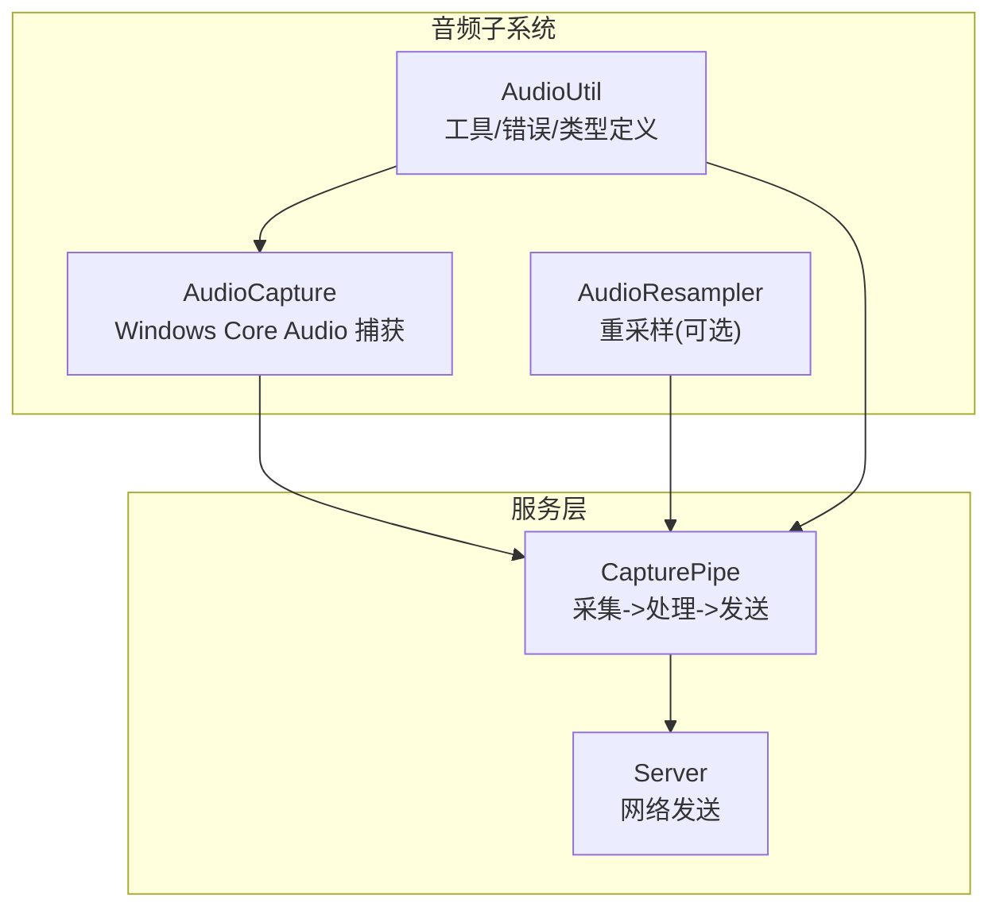
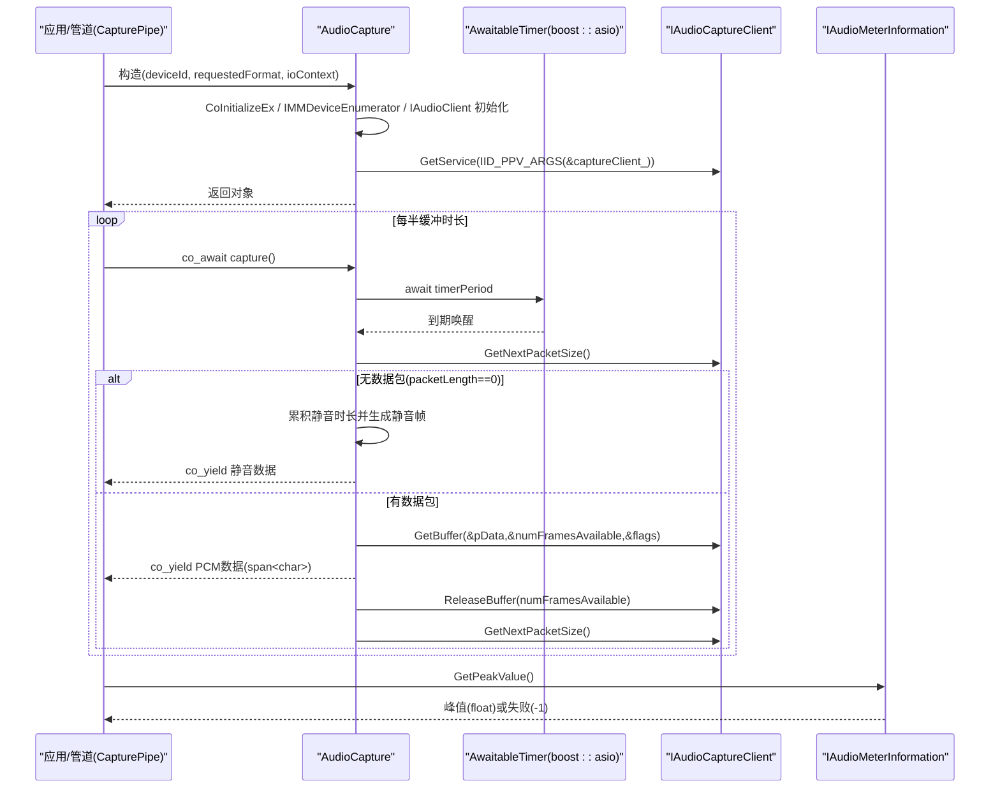
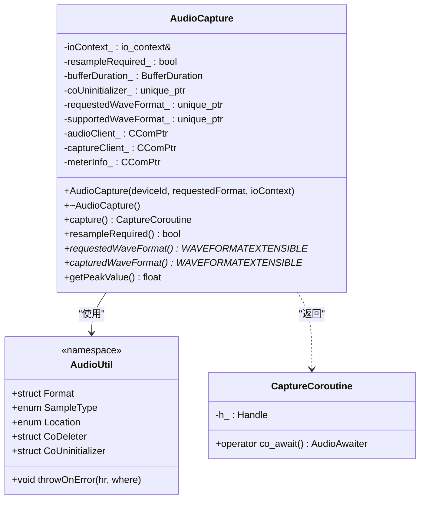

# 音频捕获 API

<cite>
**本文引用的文件**   
- [AudioCapture.h](file://SoundRemote/AudioCapture.h)
- [AudioCapture.cpp](file://SoundRemote/AudioCapture.cpp)
- [AudioUtil.h](file://SoundRemote/AudioUtil.h)
- [CapturePipe.cpp](file://SoundRemote/CapturePipe.cpp)
</cite>

## 目录
1. [简介](#简介)
2. [项目结构](#项目结构)
3. [核心组件](#核心组件)
4. [架构总览](#架构总览)
5. [详细组件分析](#详细组件分析)
6. [依赖关系分析](#依赖关系分析)
7. [性能考虑](#性能考虑)
8. [故障排查指南](#故障排查指南)
9. [结论](#结论)
10. [附录：完整使用示例路径](#附录完整使用示例路径)

## 简介
本文件为 AudioCapture 类的权威 API 文档，聚焦于 Windows Core Audio API 集成的音频捕获能力。内容涵盖：
- 构造参数与验证规则（设备ID、请求的音频格式、IO上下文）
- capture() 协程方法的使用方式与数据流
- resampleRequired() 重采样检测
- requestedWaveFormat() 与 capturedWaveFormat() 格式查询
- getPeakValue() 峰值获取
- C++20 协程使用模式、异常处理机制与性能优化建议
- 结合 CapturePipe 的端到端流程说明

## 项目结构
本项目采用分层组织：
- 音频子系统：AudioCapture、AudioResampler、AudioUtil
- 网络与服务：Server、Clients、NetUtil
- 管道与封装：CapturePipe 将音频捕获、可选重采样、编码与发送串联起来
- 测试：头文件编译性测试等

图表来源
- [AudioCapture.h:22-78](file://SoundRemote/AudioCapture.h#L22-L78)
- [AudioCapture.cpp:118-214](file://SoundRemote/AudioCapture.cpp#L118-L214)
- [AudioUtil.h:120-126](file://SoundRemote/AudioUtil.h#L120-L126)
- [CapturePipe.cpp:40-51](file://SoundRemote/CapturePipe.cpp#L40-L51)
- [CapturePipe.cpp:97-111](file://SoundRemote/CapturePipe.cpp#L97-L111)

章节来源
- [AudioCapture.h:22-78](file://SoundRemote/AudioCapture.h#L22-L78)
- [AudioCapture.cpp:118-214](file://SoundRemote/AudioCapture.cpp#L118-L214)
- [AudioUtil.h:120-126](file://SoundRemote/AudioUtil.h#L120-L126)
- [CapturePipe.cpp:40-51](file://SoundRemote/CapturePipe.cpp#L40-L51)
- [CapturePipe.cpp:97-111](file://SoundRemote/CapturePipe.cpp#L97-L111)

## 核心组件
- AudioCapture：基于 Windows Core Audio (IAudioClient/IAudioCaptureClient/IAudioMeterInformation) 实现共享模式的音频捕获，提供协程化的数据产出接口与元信息访问。
- CapturePipe：上层管道，负责调用 AudioCapture::capture() 协程，按需进行重采样、编码与网络发送。
- AudioUtil：公共类型与错误处理工具，包括 Format 结构体、SampleType、Location 枚举以及 throwOnError 等。

章节来源
- [AudioCapture.h:22-78](file://SoundRemote/AudioCapture.h#L22-L78)
- [AudioCapture.cpp:118-214](file://SoundRemote/AudioCapture.cpp#L118-L214)
- [AudioUtil.h:120-126](file://SoundRemote/AudioUtil.h#L120-L126)
- [CapturePipe.cpp:40-51](file://SoundRemote/CapturePipe.cpp#L40-L51)

## 架构总览
下图展示了从构造到持续捕获的数据与控制流，包含协程调度、定时器驱动、缓冲区释放与静音补偿逻辑。

图表来源
- [AudioCapture.cpp:118-214](file://SoundRemote/AudioCapture.cpp#L118-L214)
- [AudioCapture.cpp:218-280](file://SoundRemote/AudioCapture.cpp#L218-L280)
- [AudioCapture.cpp:294-301](file://SoundRemote/AudioCapture.cpp#L294-L301)

## 详细组件分析

### AudioCapture 类概览
- 职责
  - 初始化 COM、枚举设备、激活 IAudioClient/IAudioCaptureClient/IAudioMeterInformation
  - 根据请求格式与设备支持情况决定是否需要重采样
  - 通过协程周期性产出 PCM 数据块
  - 提供峰值电平读取与格式查询
- 关键成员
  - 内部计时器周期：bufferDuration_/2
  - 静音补偿：当连续多个周期无数据时，产出静音帧以维持下游节拍
  - 资源管理：RAII 包装 CoUninitialize、WAVEFORMATEXTENSIBLE 内存释放、捕获缓冲自动释放

章节来源
- [AudioCapture.h:22-78](file://SoundRemote/AudioCapture.h#L22-L78)
- [AudioCapture.cpp:118-214](file://SoundRemote/AudioCapture.cpp#L118-L214)
- [AudioCapture.cpp:218-280](file://SoundRemote/AudioCapture.cpp#L218-L280)

#### 构造函数
- 签名
  - AudioCapture(const std::wstring& deviceId, Audio::Format requestedFormat, boost::asio::io_context& ioContext)
- 参数说明
  - deviceId：目标音频设备的 ID 字符串（由系统枚举得到）
  - requestedFormat：请求的音频格式，包含 sampleRate、channelCount、sampleSize、sampleType、byteOrder
  - ioContext：Boost.Asio 的 IO 上下文，用于内部定时器驱动
- 行为与验证
  - 初始化 COM（多线程），创建设备枚举器，按设备ID获取设备
  - 激活 IAudioMeterInformation 与 IAudioClient
  - 判断设备数据流方向（eCapture/eRender），设置循环回环标志（仅渲染流）
  - 构建 WAVEFORMATEXTENSIBLE 请求格式，并通过 IsFormatSupported 判定是否受支持
    - S_OK：无需重采样；复制请求格式作为实际格式
    - S_FALSE 或 AUDCLNT_E_UNSUPPORTED_FORMAT：需要重采样；取混合格式作为实际格式
  - Initialize 共享模式流，计算实际缓冲大小与时长，保存 bufferDuration_
  - 通过 GetService 获取 IAudioCaptureClient
- 异常处理
  - 所有 HRESULT 均通过 throwOnError 转换为异常，携带 Location 定位信息
- 返回值
  - 无（构造成功即完成初始化）

章节来源
- [AudioCapture.cpp:118-214](file://SoundRemote/AudioCapture.cpp#L118-L214)
- [AudioUtil.h:48-116](file://SoundRemote/AudioUtil.h#L48-L116)

#### capture() 协程方法
- 签名
  - CaptureCoroutine capture()
- 语义
  - 启动音频流，进入无限循环，每 bufferDuration_/2 触发一次数据收集
  - 若 GetNextPacketSize 返回 0，则累积静音时长并在超过一个缓冲时长后产出静音帧
  - 否则循环拉取所有可用包，GetBuffer 后 co_yield 原始 PCM 数据 span<char>
  - 使用 BufferReleaser RAII 确保 ReleaseBuffer 被调用
  - 析构时停止流（Stop）
- 返回值
  - CaptureCoroutine：可被 co_await 的协程对象，yield_value 产出 std::span<char> 指向 PCM 数据
- 异常处理
  - 任何底层调用失败都会抛出异常（throwOnError）
- 使用注意
  - 调用方需持有 AudioCapture 生命周期，直到协程结束
  - 每次 co_await 得到的 span 仅在下次 yield 前有效

章节来源
- [AudioCapture.h:33-36](file://SoundRemote/AudioCapture.h#L33-36)
- [AudioCapture.h:80-143](file://SoundRemote/AudioCapture.h#L80-L143)
- [AudioCapture.cpp:218-280](file://SoundRemote/AudioCapture.cpp#L218-L280)

#### resampleRequired()
- 签名
  - bool resampleRequired() const
- 语义
  - 返回是否需要对捕获数据进行重采样（请求格式不被设备直接支持）
- 返回值
  - true：需要重采样；false：不需要
- 异常处理
  - 无异常

章节来源
- [AudioCapture.h:38-42](file://SoundRemote/AudioCapture.h#L38-42)
- [AudioCapture.cpp:282-284](file://SoundRemote/AudioCapture.cpp#L282-L284)

#### requestedWaveFormat()
- 签名
  - WAVEFORMATEXTENSIBLE* requestedWaveFormat() const
- 语义
  - 返回构造时传入的请求格式指针
- 返回值
  - 指向 WAVEFORMATEXTENSIBLE 的指针，生命周期与 AudioCapture 对象一致
- 异常处理
  - 无异常

章节来源
- [AudioCapture.h:44-49](file://SoundRemote/AudioCapture.h#L44-L49)
- [AudioCapture.cpp:286-288](file://SoundRemote/AudioCapture.cpp#L286-L288)

#### capturedWaveFormat()
- 签名
  - WAVEFORMATEXTENSIBLE* capturedWaveFormat() const
- 语义
  - 返回设备实际支持的格式（可能等于请求格式或混合格式）
- 返回值
  - 指向 WAVEFORMATEXTENSIBLE 的指针，生命周期与 AudioCapture 对象一致
- 异常处理
  - 无异常

章节来源
- [AudioCapture.h:51-57](file://SoundRemote/AudioCapture.h#L51-L57)
- [AudioCapture.cpp:290-292](file://SoundRemote/AudioCapture.cpp#L290-L292)

#### getPeakValue()
- 签名
  - float getPeakValue() const
- 语义
  - 通过 IAudioMeterInformation 获取当前峰值电平
- 返回值
  - 范围 [0.0, 1.0]；失败返回 -1
- 异常处理
  - 内部不抛异常，失败时返回 -1

章节来源
- [AudioCapture.h:59-63](file://SoundRemote/AudioCapture.h#L59-L63)
- [AudioCapture.cpp:294-301](file://SoundRemote/AudioCapture.cpp#L294-L301)

#### CaptureCoroutine 与协程模型
- 设计要点
  - promise_type 维护 pcmAudio 与 awaiting_coroutine_
  - yield_value 产出 std::span<char>，并返回自定义 transfer_awaitable
  - operator co_await 返回 AudioAwaiter，在 await_suspend 中挂起调用方协程
  - initial_suspend/final_suspend 均为 suspend_never，简化控制流
- 使用模式
  - auto coro = audioCapture.capture();
  - for (;;) { auto data = co_await coro; /* 处理 data */ }

章节来源
- [AudioCapture.h:80-143](file://SoundRemote/AudioCapture.h#L80-L143)

### 与 CapturePipe 的集成
- 构造阶段
  - 创建 AudioCapture，若 resampleRequired() 为真，则根据 capturedWaveFormat 与 requestedWaveFormat 初始化 AudioResampler
- 运行阶段
  - process() 协程内反复 co_await audioCapture，得到 PCM 数据
  - 如需重采样，先经 AudioResampler 转换，再写入 streambuf
  - 达到编码器帧长后，按客户端压缩需求进行编码或直接透传
- 峰值监控
  - 通过 audioCapture_->getPeakValue() 暴露给上层

章节来源
- [CapturePipe.cpp:40-51](file://SoundRemote/CapturePipe.cpp#L40-L51)
- [CapturePipe.cpp:97-111](file://SoundRemote/CapturePipe.cpp#L97-L111)
- [CapturePipe.cpp:124-155](file://SoundRemote/CapturePipe.cpp#L124-L155)

## 依赖关系分析
- 外部依赖
  - Windows Core Audio API：Audioclient.h、mmdeviceapi.h、endpointvolume.h
  - Boost.Asio：io_context、steady_timer、use_awaitable
  - ATL：CComPtr 智能指针
- 内部依赖
  - AudioUtil：Format、SampleType、Location、throwOnError、CoDeleter、CoUninitializer
  - Util：makeAppErrorText、showError 等辅助

图表来源
- [AudioCapture.h:22-78](file://SoundRemote/AudioCapture.h#L22-L78)
- [AudioCapture.h:80-143](file://SoundRemote/AudioCapture.h#L80-L143)
- [AudioUtil.h:120-126](file://SoundRemote/AudioUtil.h#L120-L126)
- [AudioUtil.h:130-147](file://SoundRemote/AudioUtil.h#L130-L147)

章节来源
- [AudioCapture.h:22-78](file://SoundRemote/AudioCapture.h#L22-L78)
- [AudioUtil.h:120-126](file://SoundRemote/AudioUtil.h#L120-L126)

## 性能考虑
- 定时器周期
  - 内部使用 bufferDuration_/2 作为定时周期，保证更频繁地检查新数据，降低延迟
- 静音补偿
  - 当设备长时间无数据时，产出静音帧以避免下游卡顿
- 零拷贝输出
  - co_yield 直接返回底层缓冲的 span<char>，避免额外拷贝
- 缓冲释放
  - 使用 RAII 的 BufferReleaser 确保 ReleaseBuffer 及时调用，防止泄漏
- 线程模型
  - COM 初始化为多线程模式，适合与 Asio 事件循环协作
- 建议
  - 合理选择请求格式以减少重采样开销
  - 在高负载场景下关注 CPU 占用与网络吞吐，必要时调整编码器帧长与压缩策略

[本节为通用指导，不直接分析具体文件]

## 故障排查指南
- 常见异常位置
  - COM 初始化、设备枚举、激活接口、格式支持检查、初始化流、获取缓冲、开始/停止流等步骤均有明确的 Location 标识
- 诊断手段
  - 捕获异常后打印 Location 与错误文本，快速定位失败点
  - 使用 getPeakValue() 确认设备是否正常工作（返回 -1 表示失败）
- 静音问题
  - 若长期收到静音帧，检查设备是否有数据、是否正确配置了 eRender 的回环模式（仅渲染流）

章节来源
- [AudioUtil.h:48-116](file://SoundRemote/AudioUtil.h#L48-L116)
- [AudioCapture.cpp:118-214](file://SoundRemote/AudioCapture.cpp#L118-L214)
- [AudioCapture.cpp:294-301](file://SoundRemote/AudioCapture.cpp#L294-L301)

## 结论
AudioCapture 提供了稳定高效的 Windows Core Audio 捕获能力，配合 C++20 协程实现了简洁的异步数据流。通过 resampleRequired() 与格式查询接口，上层可以灵活决定是否引入重采样。结合 CapturePipe 的端到端流程，可实现低延迟、可扩展的音频传输方案。

[本节为总结，不直接分析具体文件]

## 附录：完整使用示例路径
以下路径展示了从构造到持续捕获的完整流程，可作为参考实现：
- 构造与重采样决策：[CapturePipe.cpp:40-51](file://SoundRemote/CapturePipe.cpp#L40-L51)
- 协程化捕获循环：[CapturePipe.cpp:97-111](file://SoundRemote/CapturePipe.cpp#L97-L111)
- 数据处理与编码发送：[CapturePipe.cpp:124-155](file://SoundRemote/CapturePipe.cpp#L124-L155)
- 音频捕获核心实现：[AudioCapture.cpp:118-214](file://SoundRemote/AudioCapture.cpp#L118-L214)、[AudioCapture.cpp:218-280](file://SoundRemote/AudioCapture.cpp#L218-L280)
- 协程与 Awaiter 定义：[AudioCapture.h:80-143](file://SoundRemote/AudioCapture.h#L80-L143)
- 公共类型与错误处理：[AudioUtil.h:120-126](file://SoundRemote/AudioUtil.h#L120-L126)、[AudioUtil.h:130-147](file://SoundRemote/AudioUtil.h#L130-L147)