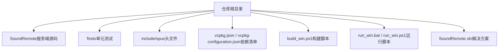
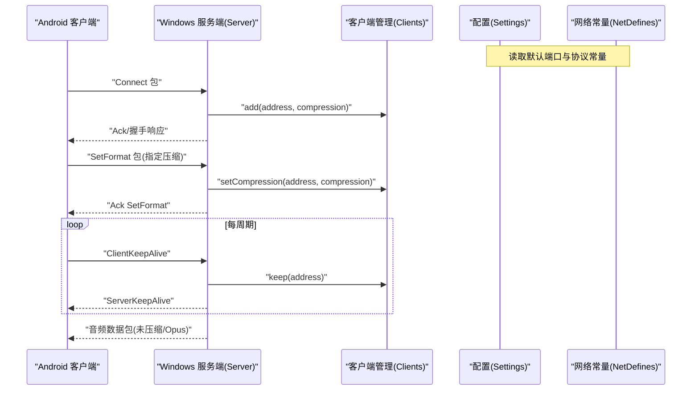
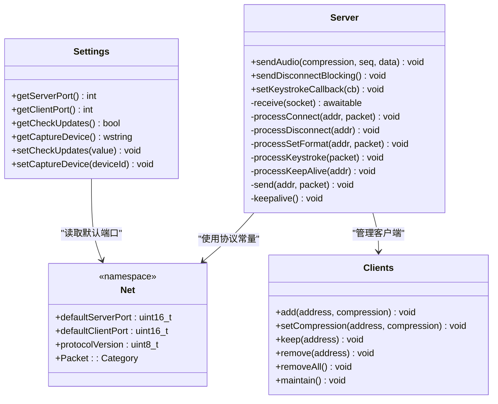
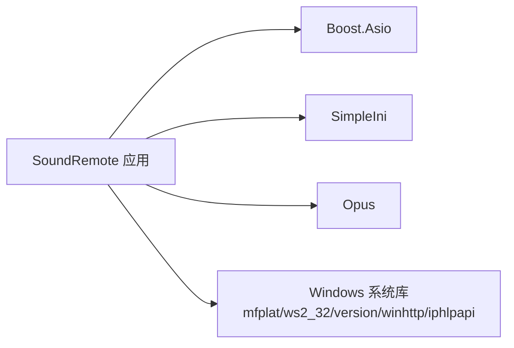

# 快速开始

<cite>
**本文引用的文件**   
- [README.md](file://README.md)
- [vcpkg.json](file://vcpkg.json)
- [vcpkg-configuration.json](file://vcpkg-configuration.json)
- [build_win.ps1](file://build_win.ps1)
- [run_win.bat](file://run_win.bat)
- [run_win.ps1](file://run_win.ps1)
- [SoundRemote.vcxproj](file://SoundRemote/SoundRemote.vcxproj)
- [Settings.h](file://SoundRemote/Settings.h)
- [Settings.cpp](file://SoundRemote/Settings.cpp)
- [NetDefines.h](file://SoundRemote/NetDefines.h)
- [Server.h](file://SoundRemote/Server.h)
- [Server.cpp](file://SoundRemote/Server.cpp)
- [Clients.h](file://SoundRemote/Clients.h)
</cite>

## 目录
1. [简介](#简介)
2. [项目结构](#项目结构)
3. [核心组件](#核心组件)
4. [架构总览](#架构总览)
5. [详细组件分析](#详细组件分析)
6. [依赖关系分析](#依赖关系分析)
7. [性能与运行建议](#性能与运行建议)
8. [故障排除指南](#故障排除指南)
9. [结论](#结论)
10. [附录：命令行与配置说明](#附录命令行与配置说明)

## 简介
本指南面向首次接触 SoundRemote-WinServer 的用户，帮助你在 Windows 环境下快速完成环境搭建、构建与运行，并了解与 Android 客户端配对连接的基本流程。服务端通过 UDP 将音频流发送至客户端，同时接收来自客户端的键盘事件以在桌面端模拟按键。

## 项目结构
仓库采用 Visual Studio 解决方案组织，核心服务端代码位于 SoundRemote 目录；测试位于 Tests 目录；顶层提供构建与运行脚本以及 vcpkg 清单与配置。

**图示来源** 
- [SoundRemote.vcxproj:1-200](file://SoundRemote/SoundRemote.vcxproj#L1-L200)
- [vcpkg.json:1-10](file://vcpkg.json#L1-L10)
- [vcpkg-configuration.json:1-15](file://vcpkg-configuration.json#L1-L15)
- [build_win.ps1:1-140](file://build_win.ps1#L1-L140)
- [run_win.bat:1-3](file://run_win.bat#L1-L3)
- [run_win.ps1:1-140](file://run_win.ps1#L1-L140)

**章节来源**
- [README.md:1-14](file://README.md#L1-L14)
- [SoundRemote.vcxproj:1-200](file://SoundRemote/SoundRemote.vcxproj#L1-L200)

## 核心组件
- 网络协议与默认端口：定义于 NetDefines.h，包含协议签名、包类别、默认服务器/客户端端口等常量。
- 设置与持久化：Settings 类负责加载/保存 settings.ini，提供端口、更新检查开关、捕获设备等配置项。
- 服务端主逻辑：Server 类基于 Boost.Asio 实现 UDP 收发、客户端管理、心跳与按键转发。
- 客户端列表与保活：Clients 类维护已连接的客户端集合、压缩格式与最后联系时间，支持超时清理。

**章节来源**
- [NetDefines.h:1-69](file://SoundRemote/NetDefines.h#L1-L69)
- [Settings.h:1-38](file://SoundRemote/Settings.h#L1-L38)
- [Settings.cpp:1-106](file://SoundRemote/Settings.cpp#L1-L106)
- [Server.h:1-61](file://SoundRemote/Server.h#L1-L61)
- [Server.cpp:71-174](file://SoundRemote/Server.cpp#L71-L174)
- [Clients.h:1-60](file://SoundRemote/Clients.h#L1-L60)

## 架构总览
下图展示了服务端与 Android 客户端之间的交互流程：客户端发起连接、协商压缩格式、发送心跳与服务端回发心跳；服务端周期性维护连接并广播音频数据。

**图示来源** 
- [Server.h:20-61](file://SoundRemote/Server.h#L20-L61)
- [Server.cpp:80-174](file://SoundRemote/Server.cpp#L80-L174)
- [Clients.h:15-60](file://SoundRemote/Clients.h#L15-L60)
- [NetDefines.h:47-69](file://SoundRemote/NetDefines.h#L47-L69)

## 详细组件分析

### 环境与依赖准备
- 安装 Visual Studio 2022（需包含 C++ 工作负载）。
- 安装 vcpkg 并通过 VS 集成 MSBuild（或使用脚本自动集成）。
- 依赖项由 vcpkg 清单声明：boost-asio、boost-json、simpleini、opus。

常见命令示例（在仓库根目录执行）：
- 初始化并集成 vcpkg（若未集成）：
  - vcpkg integrate install
- 使用脚本构建（默认 Release|x64）：
  - .\build_win.ps1 -Build
- 直接运行已构建产物：
  - .\run_win.ps1 -Run
- 通过批处理快捷入口运行：
  - .\run_win.bat -Run

注意：
- 脚本会自动检测并调用 vswhere 定位 VS 安装，必要时会尝试导入 DevShell 模块以正确设置编译环境变量。
- 若本地存在旧版本进程，脚本会在构建前强制退出以避免文件被占用。

**章节来源**
- [README.md:9-14](file://README.md#L9-L14)
- [vcpkg.json:1-10](file://vcpkg.json#L1-L10)
- [vcpkg-configuration.json:1-15](file://vcpkg-configuration.json#L1-L15)
- [build_win.ps1:28-106](file://build_win.ps1#L28-L106)
- [run_win.ps1:28-106](file://run_win.ps1#L28-L106)
- [run_win.bat:1-3](file://run_win.bat#L1-L3)

### 构建与运行
- 构建目标：生成可执行文件 SoundRemote.exe，输出目录默认为 x64/Release（或 Debug）。
- 运行方式：
  - 双击生成的 exe 或通过脚本启动。
  - 脚本会在启动前尝试关闭同名进程，避免端口冲突或文件锁定。

**章节来源**
- [build_win.ps1:61-106](file://build_win.ps1#L61-L106)
- [run_win.ps1:123-139](file://run_win.ps1#L123-L139)

### 与 Android 客户端配对连接
- 默认端口：
  - 服务端监听端口：15711
  - 客户端发送端口：15712
- 基本流程：
  1) 客户端向服务端发送 Connect 包进行握手。
  2) 客户端发送 SetFormat 包协商音频压缩格式（如 Opus）。
  3) 双方周期性互发 KeepAlive 保持连接。
  4) 服务端按协商格式发送音频数据至客户端。

提示：
- 若客户端无法连接，请确认防火墙允许上述 UDP 端口通信。
- 可在 settings.ini 中修改端口后重启服务端生效。

**章节来源**
- [NetDefines.h:64-69](file://SoundRemote/NetDefines.h#L64-L69)
- [Server.cpp:80-174](file://SoundRemote/Server.cpp#L80-L174)

### 配置文件说明（settings.ini）
- 位置：程序同目录下自动生成（若不存在则创建）。
- 主要键值（节名与键名）：
  - [network]
    - server_port：服务端监听端口（默认 15711）
    - client_port：客户端发送端口（默认 15712）
  - [general]
    - check_updates：启动时是否检查更新（布尔）
    - capture_device：音频捕获设备标识（字符串）
- 行为特性：
  - 首次运行或字段缺失时，会自动写入默认值。
  - 兼容旧版无节结构的 port 字段，迁移到 [network] 下对应键。

**章节来源**
- [Settings.h:11-38](file://SoundRemote/Settings.h#L11-L38)
- [Settings.cpp:24-106](file://SoundRemote/Settings.cpp#L24-L106)
- [NetDefines.h:64-69](file://SoundRemote/NetDefines.h#L64-L69)

### 关键类关系图

**图示来源** 
- [Settings.h:11-38](file://SoundRemote/Settings.h#L11-L38)
- [Settings.cpp:24-106](file://SoundRemote/Settings.cpp#L24-L106)
- [NetDefines.h:60-69](file://SoundRemote/NetDefines.h#L60-L69)
- [Clients.h:15-60](file://SoundRemote/Clients.h#L15-L60)
- [Server.h:20-61](file://SoundRemote/Server.h#L20-L61)
- [Server.cpp:80-174](file://SoundRemote/Server.cpp#L80-L174)

## 依赖关系分析
- 外部库（通过 vcpkg 管理）：
  - boost-asio：异步网络 I/O
  - boost-json：JSON 解析（当前工程可能用于扩展）
  - simpleini：INI 配置读写
  - opus：音频编码（Opus）
- 系统库（链接器附加依赖）：
  - mfplat.lib、ws2_32.lib、version.lib、winhttp.lib、iphlpapi.lib
- 语言标准：C++20

**图示来源** 
- [vcpkg.json:1-10](file://vcpkg.json#L1-L10)
- [SoundRemote.vcxproj:110-184](file://SoundRemote/SoundRemote.vcxproj#L110-L184)

**章节来源**
- [vcpkg.json:1-10](file://vcpkg.json#L1-L10)
- [SoundRemote.vcxproj:110-184](file://SoundRemote/SoundRemote.vcxproj#L110-L184)

## 性能与运行建议
- 平台选择：推荐 x64|Release 以获得更好性能与体积优化。
- 线程模型：服务端基于协程与异步 I/O，适合高并发场景。
- 音频编码：优先使用 Opus 以降低带宽占用；确保客户端与服务端协商一致。
- 资源释放：服务停止时会断开所有客户端连接，避免残留句柄。

[本节为通用建议，不直接分析具体文件]

## 故障排除指南
- 找不到 vswhere 或未检测到 VS：
  - 请确认已安装 Visual Studio 2022 且包含 C++ 工作负载。
- 未找到 MSBuild：
  - 检查 VS 安装路径是否正确，或手动打开 Developer PowerShell 后再执行脚本。
- NuGet/vcpkg 不可用：
  - 脚本会给出警告并跳过相应步骤；如需自动还原，请确保 nuget 与 vcpkg 命令可用并已加入 PATH。
- 端口冲突或服务端无法启动：
  - 检查是否有旧进程仍在运行；脚本会在构建/运行前尝试终止同名进程。
  - 确认防火墙放行 UDP 15711/15712。
- 客户端无法连接或无音频：
  - 核对 settings.ini 中的 server_port/client_port 是否与客户端一致。
  - 确认客户端与服务端协商的压缩格式一致。
- 单元测试失败：
  - 先执行 -Build 生成 Tests.exe，再执行 -Test 查看错误详情。

**章节来源**
- [build_win.ps1:28-106](file://build_win.ps1#L28-L106)
- [run_win.ps1:123-139](file://run_win.ps1#L123-L139)
- [Settings.cpp:74-106](file://SoundRemote/Settings.cpp#L74-L106)
- [NetDefines.h:64-69](file://SoundRemote/NetDefines.h#L64-L69)

## 结论
通过以上步骤，你可以在 Windows 上快速完成 SoundRemote-WinServer 的环境搭建、构建与运行，并与 Android 客户端建立稳定的音频传输链路。建议在正式使用前根据实际网络与硬件条件调整压缩格式与端口配置，以获得最佳体验。

[本节为总结性内容，不直接分析具体文件]

## 附录：命令行与配置说明

### 常用命令（在仓库根目录执行）
- 显示帮助：
  - .\build_win.ps1
- 构建（Release|x64）：
  - .\build_win.ps1 -Build
- 构建自定义配置/平台/输出目录：
  - .\build_win.ps1 -Build -Configuration Debug -Platform Win32 -Output out
- 运行最新构建产物：
  - .\run_win.ps1 -Run
- 通过批处理快捷入口运行：
  - .\run_win.bat -Run
- 运行单元测试：
  - .\build_win.ps1 -Test

### 配置文件（settings.ini）要点
- 节与键：
  - [network]
    - server_port：服务端监听端口（默认 15711）
    - client_port：客户端发送端口（默认 15712）
  - [general]
    - check_updates：是否检查更新（布尔）
    - capture_device：音频捕获设备 ID（字符串）
- 行为：
  - 首次运行自动写入默认值。
  - 兼容旧版无节结构的 port 字段，自动迁移。

**章节来源**
- [build_win.ps1:1-20](file://build_win.ps1#L1-L20)
- [run_win.ps1:1-20](file://run_win.ps1#L1-L20)
- [Settings.cpp:67-106](file://SoundRemote/Settings.cpp#L67-L106)
- [NetDefines.h:64-69](file://SoundRemote/NetDefines.h#L64-L69)