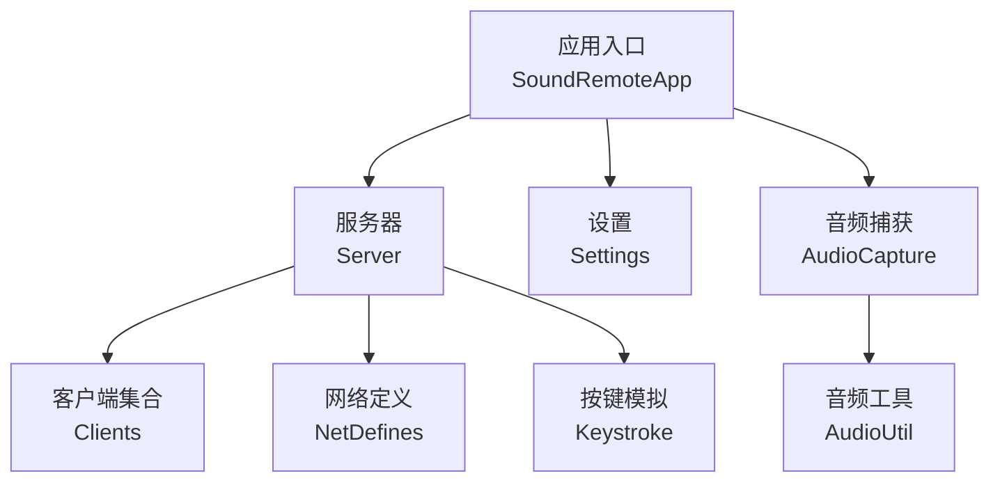
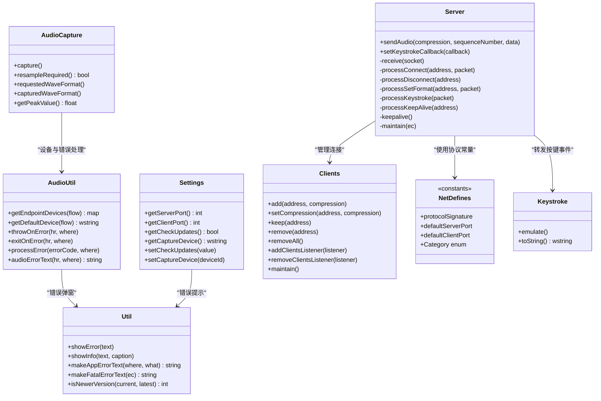
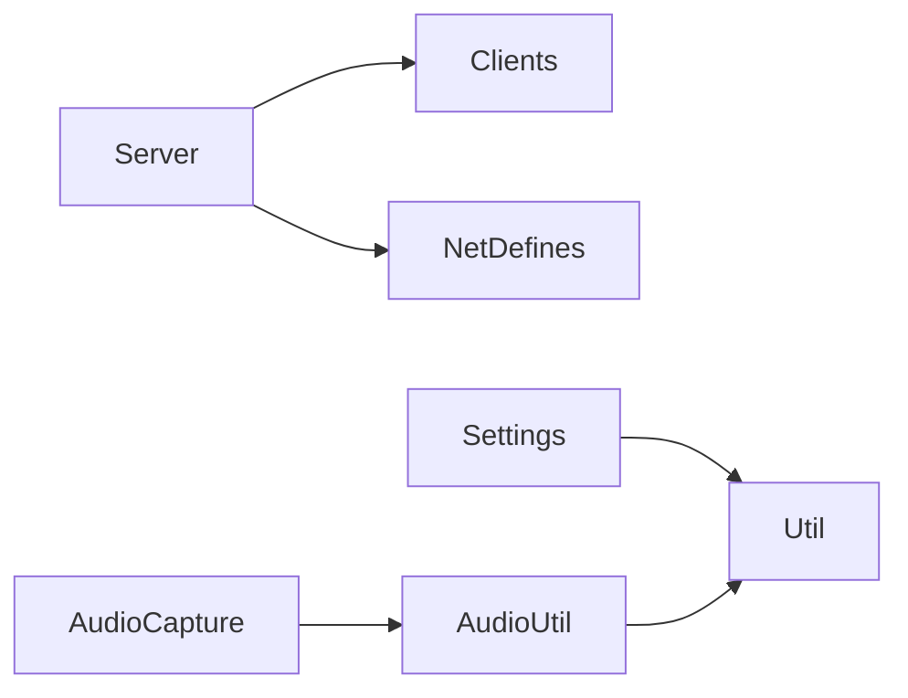
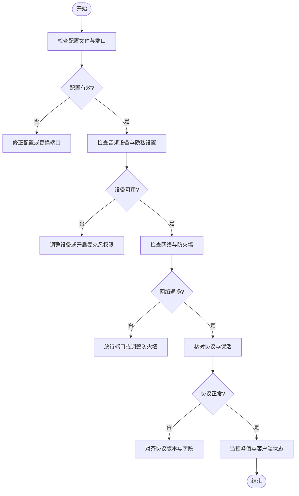

# 故障排除

<cite>
**本文引用的文件**   
- [README.md](file://README.md)
- [Server.h](file://SoundRemote/Server.h)
- [AudioCapture.h](file://SoundRemote/AudioCapture.h)
- [Clients.h](file://SoundRemote/Clients.h)
- [Settings.h](file://SoundRemote/Settings.h)
- [NetDefines.h](file://SoundRemote/NetDefines.h)
- [Util.h](file://SoundRemote/Util.h)
- [Util.cpp](file://SoundRemote/Util.cpp)
- [AudioUtil.h](file://SoundRemote/AudioUtil.h)
- [AudioUtil.cpp](file://SoundRemote/AudioUtil.cpp)
- [Keystroke.h](file://SoundRemote/Keystroke.h)
- [framework.h](file://SoundRemote/framework.h)
</cite>

## 目录
1. [简介](#简介)
2. [项目结构](#项目结构)
3. [核心组件](#核心组件)
4. [架构总览](#架构总览)
5. [详细组件分析](#详细组件分析)
6. [依赖关系分析](#依赖关系分析)
7. [性能考虑](#性能考虑)
8. [故障排除指南](#故障排除指南)
9. [结论](#结论)
10. [附录](#附录)

## 简介
本指南面向 SoundRemote-WinServer 的使用者与运维人员，聚焦于常见问题的定位与解决，包括音频捕获失败、网络连接异常、键盘模拟异常以及配置加载错误。文档提供日志分析方法、调试技巧、诊断流程、性能瓶颈识别、内存泄漏检测、CPU 使用率优化建议，并给出错误代码参考、异常堆栈分析思路、系统兼容性检查、权限与防火墙设置指导，以及社区支持与问题报告模板。

## 项目结构
本项目为 Windows 桌面服务端应用，主要职责：
- 通过 Windows Audio Session API 捕获音频流
- 将音频数据压缩（如 Opus）并通过 UDP 发送给客户端
- 接收客户端的按键事件并在本地模拟输入
- 管理客户端连接、保活与格式协商
- 从配置文件读取端口、设备与更新策略等设置

图表来源
- [Server.h:1-61](file://SoundRemote/Server.h#L1-L61)
- [AudioCapture.h:1-144](file://SoundRemote/AudioCapture.h#L1-L144)
- [Clients.h:1-60](file://SoundRemote/Clients.h#L1-L60)
- [Settings.h:1-38](file://SoundRemote/Settings.h#L1-L38)
- [NetDefines.h:1-69](file://SoundRemote/NetDefines.h#L1-L69)
- [AudioUtil.h:1-170](file://SoundRemote/AudioUtil.h#L1-L170)
- [Keystroke.h:1-41](file://SoundRemote/Keystroke.h#L1-L41)

章节来源
- [README.md:1-14](file://README.md#L1-L14)

## 核心组件
- 服务器 Server：基于 Boost.Asio 的 UDP 收发、协议处理、保活与维护定时器；负责向已连接的客户端发送音频数据。
- 音频捕获 AudioCapture：封装 Windows Core Audio API，支持请求格式与实际设备格式差异检测与重采样标记。
- 客户端集合 Clients：维护客户端地址、压缩方式、最后接触时间，支持监听器通知与超时清理。
- 设置 Settings：读取 INI 配置项（端口、更新检查、捕获设备等），并提供默认值与缺失项检查。
- 网络定义 NetDefines：协议签名、包头字段、类别枚举、默认端口等常量。
- 音频工具 AudioUtil：设备枚举、默认设备获取、HRESULT 错误转换与退出逻辑。
- 按键模拟 Keystroke：封装虚拟键码与修饰键组合，调用系统 API 进行输入模拟。
- 通用工具 Util：错误消息框、致命错误文本生成、版本比较等。

章节来源
- [Server.h:1-61](file://SoundRemote/Server.h#L1-L61)
- [AudioCapture.h:1-144](file://SoundRemote/AudioCapture.h#L1-L144)
- [Clients.h:1-60](file://SoundRemote/Clients.h#L1-L60)
- [Settings.h:1-38](file://SoundRemote/Settings.h#L1-L38)
- [NetDefines.h:1-69](file://SoundRemote/NetDefines.h#L1-L69)
- [AudioUtil.h:1-170](file://SoundRemote/AudioUtil.h#L1-L170)
- [Keystroke.h:1-41](file://SoundRemote/Keystroke.h#L1-L41)
- [Util.h:1-70](file://SoundRemote/Util.h#L1-L70)

## 架构总览
下图展示了关键模块之间的交互关系与数据流向，便于快速定位问题域。

图表来源
- [Server.h:1-61](file://SoundRemote/Server.h#L1-L61)
- [AudioCapture.h:1-144](file://SoundRemote/AudioCapture.h#L1-L144)
- [Clients.h:1-60](file://SoundRemote/Clients.h#L1-L60)
- [Settings.h:1-38](file://SoundRemote/Settings.h#L1-L38)
- [NetDefines.h:1-69](file://SoundRemote/NetDefines.h#L1-L69)
- [AudioUtil.h:1-170](file://SoundRemote/AudioUtil.h#L1-L170)
- [Keystroke.h:1-41](file://SoundRemote/Keystroke.h#L1-L41)
- [Util.h:1-70](file://SoundRemote/Util.h#L1-L70)

## 详细组件分析

### 音频捕获与重采样
- 关键点
  - 请求格式与实际设备格式可能不一致，需通过 resampleRequired 判断是否需要重采样。
  - 可通过 getPeakValue 获取峰值电平用于质量监控。
  - 设备枚举与默认设备选择由 AudioUtil 提供。
- 常见问题
  - 无法访问麦克风：Windows 隐私设置阻止应用访问麦克风。
  - 设备不存在或不可用：配置的 capture_device 无效。
  - 格式不支持：请求的采样率/声道数不被设备支持，需要启用重采样。
- 诊断步骤
  - 确认设备列表与默认设备是否正确。
  - 检查 resampleRequired 返回值与 requested/captured 波形格式。
  - 观察 getPeakValue 是否返回有效范围（0.0~1.0）。
- 相关实现路径
  - [AudioCapture.h:22-78](file://SoundRemote/AudioCapture.h#L22-L78)
  - [AudioUtil.h:150-169](file://SoundRemote/AudioUtil.h#L150-L169)
  - [AudioUtil.cpp:8-75](file://SoundRemote/AudioUtil.cpp#L8-L75)

章节来源
- [AudioCapture.h:1-144](file://SoundRemote/AudioCapture.h#L1-L144)
- [AudioUtil.h:1-170](file://SoundRemote/AudioUtil.h#L1-L170)
- [AudioUtil.cpp:1-102](file://SoundRemote/AudioUtil.cpp#L1-L102)

### 网络通信与协议
- 关键点
  - 使用 UDP 端口 defaultServerPort 与 defaultClientPort。
  - 协议类别包含 Connect、Disconnect、SetFormat、Keystroke、AudioData*、KeepAlive、Ack 等。
  - 服务器端维护客户端列表、保活与定时维护。
- 常见问题
  - 客户端无法连接：端口被占用、防火墙拦截、IP 不匹配。
  - 连接频繁断开：保活未生效、客户端未正确发送 KeepAlive。
  - 数据包解析失败：协议版本或签名不匹配。
- 诊断步骤
  - 验证端口可用性与防火墙规则。
  - 抓包核对协议类别与字段是否符合 NetDefines 定义。
  - 检查 keepalive 与 maintain 定时器是否正常触发。
- 相关实现路径
  - [NetDefines.h:45-69](file://SoundRemote/NetDefines.h#L45-L69)
  - [Server.h:20-61](file://SoundRemote/Server.h#L20-L61)
  - [Clients.h:15-52](file://SoundRemote/Clients.h#L15-L52)

章节来源
- [NetDefines.h:1-69](file://SoundRemote/NetDefines.h#L1-L69)
- [Server.h:1-61](file://SoundRemote/Server.h#L1-L61)
- [Clients.h:1-60](file://SoundRemote/Clients.h#L1-L60)

### 按键模拟
- 关键点
  - 通过 Keystroke::emulate 调用系统 API 模拟按键。
  - 部分快捷键（如 Ctrl+Alt+Delete、Win+L）在 README 中明确说明暂不支持。
- 常见问题
  - 按键无响应：目标窗口未激活、权限不足、UAC 限制。
  - 特殊组合键无效：受系统保护，不在支持范围内。
- 诊断步骤
  - 确认前台焦点窗口与应用权限。
  - 避免使用受限组合键，改用替代方案。
- 相关实现路径
  - [Keystroke.h:6-41](file://SoundRemote/Keystroke.h#L6-L41)
  - [README.md:3-6](file://README.md#L3-L6)

章节来源
- [Keystroke.h:1-41](file://SoundRemote/Keystroke.h#L1-L41)
- [README.md:1-14](file://README.md#L1-L14)

### 配置加载
- 关键点
  - Settings 从 INI 文件读取 server_port、client_port、check_updates、capture_device 等。
  - 提供 setDefaultValues 与 checkMissingSettings 确保必要项存在。
- 常见问题
  - 配置文件缺失或字段缺失导致默认值覆盖或行为异常。
  - 端口冲突：server_port 或 client_port 被其他进程占用。
- 诊断步骤
  - 检查配置文件是否存在且可读。
  - 校验端口可用性，必要时调整端口号。
- 相关实现路径
  - [Settings.h:11-37](file://SoundRemote/Settings.h#L11-L37)

章节来源
- [Settings.h:1-38](file://SoundRemote/Settings.h#L1-L38)

### 错误处理与日志
- 关键点
  - 音频错误统一通过 AudioUtil 的错误函数抛出或终止应用。
  - 应用级错误通过 Util 弹出消息框或生成致命错误文本。
  - 框架层预留了 Boost.Log 的注释，当前未启用文件日志。
- 常见问题
  - 缺少持久化日志导致问题复现困难。
  - 错误信息不够具体，难以定位到具体位置。
- 诊断步骤
  - 关注弹窗错误信息与 HRESULT 值。
  - 结合 Location 枚举定位出错阶段。
- 相关实现路径
  - [AudioUtil.cpp:77-101](file://SoundRemote/AudioUtil.cpp#L77-L101)
  - [Util.cpp:15-31](file://SoundRemote/Util.cpp#L15-L31)
  - [framework.h:10-15](file://SoundRemote/framework.h#L10-L15)

章节来源
- [AudioUtil.cpp:1-102](file://SoundRemote/AudioUtil.cpp#L1-L102)
- [Util.cpp:1-69](file://SoundRemote/Util.cpp#L1-L69)
- [framework.h:1-15](file://SoundRemote/framework.h#L1-L15)

## 依赖关系分析
- 组件耦合
  - Server 依赖 Clients 管理连接状态，依赖 NetDefines 的协议常量。
  - AudioCapture 依赖 AudioUtil 的设备与错误处理。
  - Settings 依赖 Util 进行错误提示。
- 外部依赖
  - Windows Core Audio API（IAudioClient、IMMDeviceEnumerator 等）
  - Boost.Asio（UDP 套接字、定时器）
  - SimpleIni（INI 配置解析）
  - Opus（音频编码，见 AudioUtil 中的帧长与最大包大小常量）

图表来源
- [Server.h:1-61](file://SoundRemote/Server.h#L1-L61)
- [Clients.h:1-60](file://SoundRemote/Clients.h#L1-L60)
- [NetDefines.h:1-69](file://SoundRemote/NetDefines.h#L1-L69)
- [AudioCapture.h:1-144](file://SoundRemote/AudioCapture.h#L1-L144)
- [AudioUtil.h:1-170](file://SoundRemote/AudioUtil.h#L1-L170)
- [Settings.h:1-38](file://SoundRemote/Settings.h#L1-L38)
- [Util.h:1-70](file://SoundRemote/Util.h#L1-L70)

## 性能考虑
- 音频链路
  - 合理选择压缩码率与帧长，避免过高码率导致 CPU 与带宽压力。
  - 若设备不支持请求格式，启用重采样会增加 CPU 开销，应权衡音质与性能。
- 网络传输
  - UDP 丢包与抖动会影响实时性，建议在局域网内运行并关闭不必要的网络优化。
  - 控制发送频率与批量大小，避免阻塞 IO 线程。
- 资源管理
  - 注意 COM 对象释放与 CoInitializeEx/CoUninitialize 配对，避免泄漏。
  - 使用 unique_ptr 与自定义删除器（如 CoDeleter）管理非托管内存。
- 监控指标
  - 峰值电平（getPeakValue）可用于判断音频活动。
  - 客户端数量与保活状态可反映服务负载。

[本节为通用性能建议，无需特定文件引用]

## 故障排除指南

### 音频捕获失败
- 症状
  - 启动后无音频输出或客户端收不到数据。
  - 弹窗提示“麦克风访问被拒绝”。
- 可能原因
  - Windows 隐私设置禁止应用访问麦克风。
  - 配置的 capture_device 无效或设备被独占。
  - 请求格式不被设备支持且未启用重采样。
- 排查步骤
  - 打开系统隐私设置，允许应用访问麦克风。
  - 使用设备枚举功能确认设备 ID 与友好名称。
  - 检查 resampleRequired 返回值与 requested/captured 波形格式。
  - 观察 getPeakValue 是否为有效范围。
- 相关实现路径
  - [AudioUtil.cpp:93-101](file://SoundRemote/AudioUtil.cpp#L93-L101)
  - [AudioCapture.h:39-63](file://SoundRemote/AudioCapture.h#L39-L63)

章节来源
- [AudioUtil.cpp:1-102](file://SoundRemote/AudioUtil.cpp#L1-L102)
- [AudioCapture.h:1-144](file://SoundRemote/AudioCapture.h#L1-L144)

### 网络连接问题
- 症状
  - 客户端无法连接或频繁断开。
  - 收到 Ack 但无音频数据。
- 可能原因
  - 端口冲突或被防火墙拦截。
  - 保活未生效或客户端未发送 KeepAlive。
  - 协议版本或签名不匹配。
- 排查步骤
  - 检查 defaultServerPort/defaultClientPort 是否可用。
  - 临时关闭防火墙测试连通性，再添加放行规则。
  - 抓包核对协议类别与字段，确认 Connect/SetFormat/Ack 流程。
  - 检查 keepalive 与 maintain 定时器是否触发。
- 相关实现路径
  - [NetDefines.h:64-69](file://SoundRemote/NetDefines.h#L64-L69)
  - [Server.h:40-58](file://SoundRemote/Server.h#L40-L58)
  - [Clients.h:27-52](file://SoundRemote/Clients.h#L27-L52)

章节来源
- [NetDefines.h:1-69](file://SoundRemote/NetDefines.h#L1-L69)
- [Server.h:1-61](file://SoundRemote/Server.h#L1-L61)
- [Clients.h:1-60](file://SoundRemote/Clients.h#L1-L60)

### 键盘模拟异常
- 症状
  - 按键无响应或仅部分键有效。
- 可能原因
  - 目标窗口未激活或权限不足。
  - 使用了受限组合键（如 Ctrl+Alt+Delete、Win+L）。
- 排查步骤
  - 确保前台窗口具备输入焦点。
  - 避免使用受限组合键，改用替代操作。
- 相关实现路径
  - [Keystroke.h:16-20](file://SoundRemote/Keystroke.h#L16-L20)
  - [README.md:4-6](file://README.md#L4-L6)

章节来源
- [Keystroke.h:1-41](file://SoundRemote/Keystroke.h#L1-L41)
- [README.md:1-14](file://README.md#L1-L14)

### 配置加载错误
- 症状
  - 启动时报错或端口冲突。
- 可能原因
  - 配置文件缺失或字段缺失。
  - 端口被其他进程占用。
- 排查步骤
  - 检查配置文件是否存在且可读。
  - 修改 server_port/client_port 为未被占用的端口。
- 相关实现路径
  - [Settings.h:13-29](file://SoundRemote/Settings.h#L13-L29)

章节来源
- [Settings.h:1-38](file://SoundRemote/Settings.h#L1-L38)

### 日志分析与调试技巧
- 现状
  - 当前未启用文件日志，错误主要通过弹窗提示。
- 建议
  - 启用 Boost.Log 文件后端，记录关键节点（设备初始化、网络收发、按键模拟）。
  - 在关键路径增加结构化日志（时间戳、模块名、错误码）。
- 相关实现路径
  - [framework.h:10-15](file://SoundRemote/framework.h#L10-L15)
  - [Util.cpp:15-31](file://SoundRemote/Util.cpp#L15-L31)

章节来源
- [framework.h:1-15](file://SoundRemote/framework.h#L1-L15)
- [Util.cpp:1-69](file://SoundRemote/Util.cpp#L1-L69)

### 错误代码参考与异常堆栈分析
- 音频错误
  - 使用 audioErrorText 生成的文本包含 Location 与 HRESULT，便于定位阶段。
  - 特别处理 E_ACCESSDENIED 场景，提示隐私设置。
- 应用错误
  - makeAppErrorText 与 makeFatalErrorText 用于组装错误信息。
- 堆栈分析
  - 捕获 std::exception 与 boost::system::system_error，记录上下文。
- 相关实现路径
  - [AudioUtil.cpp:77-101](file://SoundRemote/AudioUtil.cpp#L77-L101)
  - [Util.cpp:23-31](file://SoundRemote/Util.cpp#L23-L31)

章节来源
- [AudioUtil.cpp:1-102](file://SoundRemote/AudioUtil.cpp#L1-L102)
- [Util.cpp:1-69](file://SoundRemote/Util.cpp#L1-L69)

### 根本原因定位流程图

[此图为概念性流程，无需图表来源]

### 系统兼容性检查
- 操作系统
  - 需要 Windows 平台与 Visual Studio 2022 构建环境。
- 权限
  - 需要麦克风访问权限（隐私设置）。
  - 某些系统快捷键不受支持，避免使用。
- 依赖库
  - vcpkg 集成与依赖安装（Boost、SimpleIni、Opus）。
- 相关实现路径
  - [README.md:9-14](file://README.md#L9-L14)
  - [AudioUtil.cpp:93-101](file://SoundRemote/AudioUtil.cpp#L93-L101)

章节来源
- [README.md:1-14](file://README.md#L1-L14)
- [AudioUtil.cpp:1-102](file://SoundRemote/AudioUtil.cpp#L1-L102)

### 权限配置与防火墙设置
- 权限
  - 在系统隐私设置中允许应用访问麦克风。
- 防火墙
  - 放行 defaultServerPort 与 defaultClientPort 的 UDP 入站与出站规则。
- 相关实现路径
  - [NetDefines.h:64-69](file://SoundRemote/NetDefines.h#L64-L69)
  - [AudioUtil.cpp:93-101](file://SoundRemote/AudioUtil.cpp#L93-L101)

章节来源
- [NetDefines.h:1-69](file://SoundRemote/NetDefines.h#L1-L69)
- [AudioUtil.cpp:1-102](file://SoundRemote/AudioUtil.cpp#L1-L102)

### 性能瓶颈识别与优化
- 识别方法
  - 使用系统性能监视器跟踪 CPU、内存与网络吞吐。
  - 观察 getPeakValue 与客户端数量变化。
- 优化建议
  - 降低压缩码率或增大帧长以降低 CPU 压力。
  - 减少不必要的重采样，尽量匹配设备原生格式。
  - 合并发送批次，减少 UDP 小包数量。
- 相关实现路径
  - [AudioUtil.h:29-39](file://SoundRemote/AudioUtil.h#L29-L39)
  - [AudioCapture.h:59-63](file://SoundRemote/AudioCapture.h#L59-L63)

章节来源
- [AudioUtil.h:1-170](file://SoundRemote/AudioUtil.h#L1-L170)
- [AudioCapture.h:1-144](file://SoundRemote/AudioCapture.h#L1-L144)

### 内存泄漏检测
- 方法
  - 使用 CRT 内存泄漏检测或第三方工具（如 Visual Studio 诊断工具）。
  - 重点检查 COM 对象释放与 CoTaskMemFree 使用。
- 相关实现路径
  - [AudioUtil.h:135-147](file://SoundRemote/AudioUtil.h#L135-L147)
  - [AudioUtil.cpp:36-74](file://SoundRemote/AudioUtil.cpp#L36-L74)

章节来源
- [AudioUtil.h:1-170](file://SoundRemote/AudioUtil.h#L1-L170)
- [AudioUtil.cpp:1-102](file://SoundRemote/AudioUtil.cpp#L1-L102)

### CPU 使用率优化
- 方法
  - 调整 Opus 帧长与码率，平衡音质与 CPU。
  - 避免频繁格式切换与重采样。
- 相关实现路径
  - [AudioUtil.h:34-39](file://SoundRemote/AudioUtil.h#L34-L39)

章节来源
- [AudioUtil.h:1-170](file://SoundRemote/AudioUtil.h#L1-L170)

### 社区支持与问题报告模板
- 社区资源
  - 项目仓库与 Issue 区（参考 README 中的链接）。
- 问题报告模板
  - 基本信息：操作系统版本、应用版本、构建方式。
  - 问题描述：现象、复现步骤、期望结果。
  - 环境信息：端口配置、设备列表、防火墙规则。
  - 日志与截图：错误弹窗内容、抓包结果、性能截图。
  - 附加信息：崩溃堆栈、最近变更。

[本节为通用指导，无需特定文件引用]

## 结论
通过系统化地检查配置、设备权限、网络与协议一致性，并结合错误信息与监控指标，大多数问题可以快速定位与解决。建议引入持久化日志与更丰富的诊断接口，以提升排障效率与用户体验。

## 附录
- 常用端口
  - 服务器端口：defaultServerPort
  - 客户端端口：defaultClientPort
- 协议类别
  - Error、Connect、Disconnect、SetFormat、Keystroke、AudioDataUncompressed、AudioDataOpus、ClientKeepAlive、ServerKeepAlive、Ack

章节来源
- [NetDefines.h:45-69](file://SoundRemote/NetDefines.h#L45-L69)