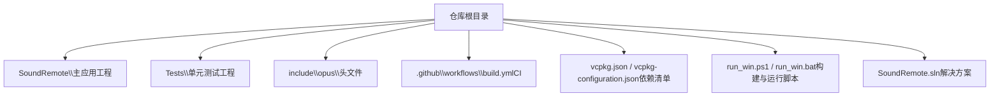
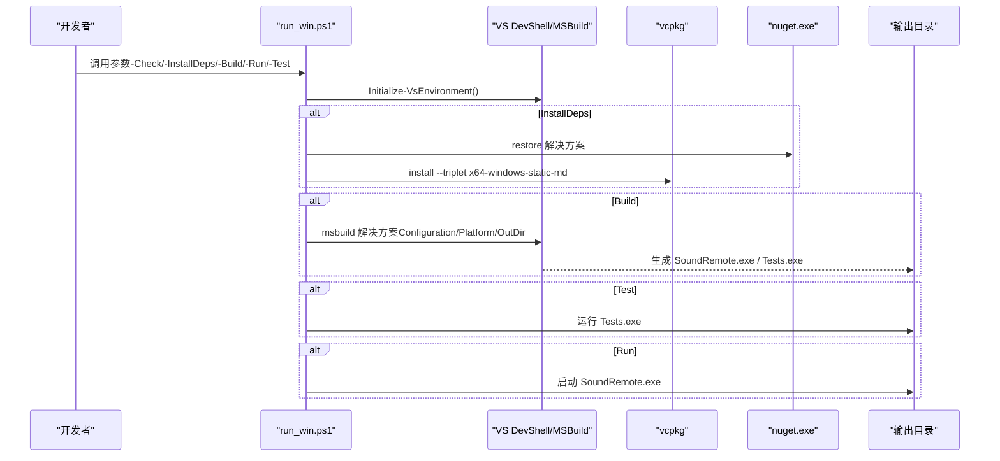
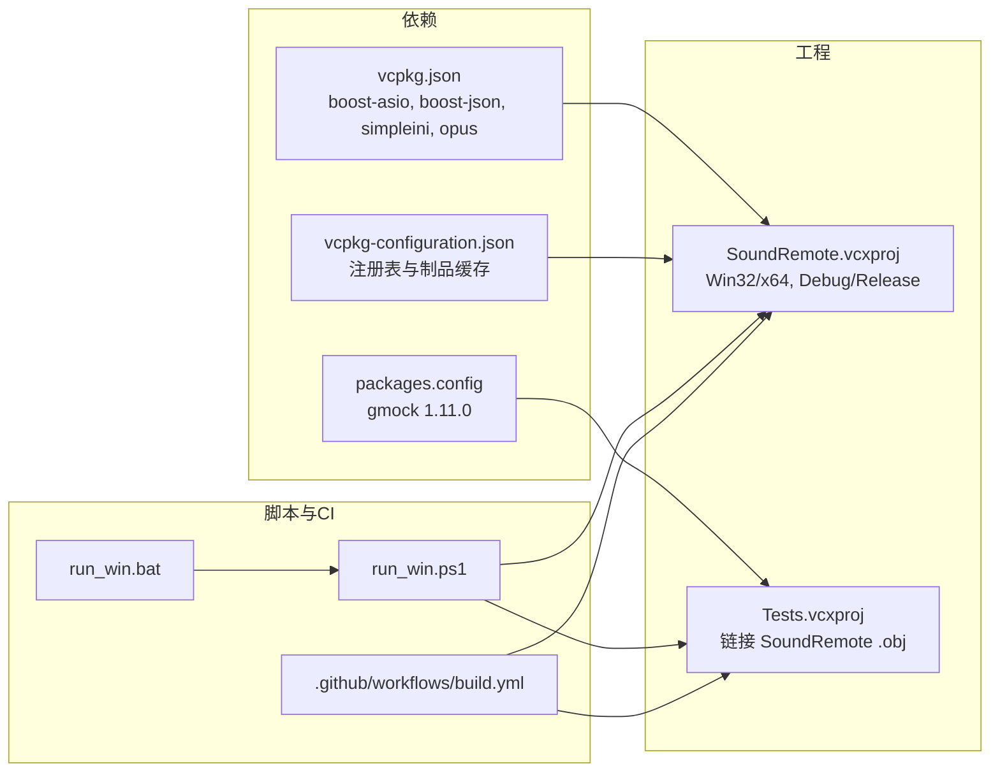
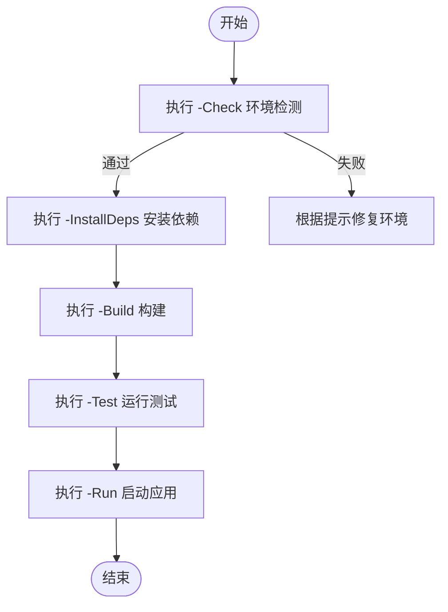

# 构建与部署

<cite>
**本文引用的文件列表**
- [README.md](file://README.md)
- [CLAUDE.md](file://CLAUDE.md)
- [vcpkg.json](file://vcpkg.json)
- [vcpkg-configuration.json](file://vcpkg-configuration.json)
- [run_win.ps1](file://run_win.ps1)
- [run_win.bat](file://run_win.bat)
- [SoundRemote.sln](file://SoundRemote.sln)
- [SoundRemote.vcxproj](file://SoundRemote/SoundRemote.vcxproj)
- [Tests.vcxproj](file://Tests/Tests.vcxproj)
- [packages.config](file://Tests/packages.config)
- [build.yml](file://.github/workflows/build.yml)
</cite>

## 目录
1. [简介](#简介)
2. [项目结构](#项目结构)
3. [核心组件](#核心组件)
4. [架构总览](#架构总览)
5. [详细组件分析](#详细组件分析)
6. [依赖关系分析](#依赖关系分析)
7. [性能考虑](#性能考虑)
8. [故障排除指南](#故障排除指南)
9. [结论](#结论)
10. [附录](#附录)

## 简介
本文件面向 SoundRemote-WinServer 的开发者与运维人员，提供从本地开发环境搭建、构建脚本使用、编译选项与链接器设置说明，到发布打包、分发与安装程序制作、多平台构建与交叉编译、自动化流水线以及部署最佳实践与运维监控建议的全流程文档。内容严格基于仓库中的构建配置与脚本进行整理，确保可复现与可维护。

## 项目结构
仓库采用 Visual Studio 解决方案组织，包含主应用与测试两个工程；依赖通过 vcpkg 清单管理，NuGet 用于测试框架 gmock；根目录提供一键式 PowerShell 构建脚本与批处理启动包装。

图表来源
- [SoundRemote.sln:1-48](file://SoundRemote.sln#L1-L48)
- [SoundRemote.vcxproj:1-232](file://SoundRemote/SoundRemote.vcxproj#L1-L232)
- [Tests.vcxproj:1-201](file://Tests/Tests.vcxproj#L1-L201)
- [vcpkg.json:1-10](file://vcpkg.json#L1-L10)
- [vcpkg-configuration.json:1-15](file://vcpkg-configuration.json#L1-L15)
- [run_win.ps1:1-277](file://run_win.ps1#L1-L277)
- [run_win.bat:1-3](file://run_win.bat#L1-L3)
- [build.yml:1-61](file://.github/workflows/build.yml#L1-L61)

章节来源
- [README.md:1-14](file://README.md#L1-L14)
- [CLAUDE.md:1-68](file://CLAUDE.md#L1-L68)
- [SoundRemote.sln:1-48](file://SoundRemote.sln#L1-L48)

## 核心组件
- 构建系统：Visual Studio 2022 + MSBuild（工具集 v145），C++20 标准。
- 包管理：
  - vcpkg 清单 vcpkg.json 声明 boost-asio、boost-json、simpleini、opus。
  - vcpkg-configuration.json 指定默认注册表与制品缓存源。
  - NuGet 用于测试依赖 gmock 1.11.0（由 packages.config 管理）。
- 构建脚本：run_win.ps1 提供环境检查、依赖安装、构建、运行与测试的一体化能力；run_win.bat 作为便捷入口。
- CI 流水线：GitHub Actions 在 windows-latest 上执行 nuget restore、vcpkg integrate、msbuild 构建并上传产物。

章节来源
- [vcpkg.json:1-10](file://vcpkg.json#L1-L10)
- [vcpkg-configuration.json:1-15](file://vcpkg-configuration.json#L1-L15)
- [run_win.ps1:1-277](file://run_win.ps1#L1-L277)
- [run_win.bat:1-3](file://run_win.bat#L1-L3)
- [build.yml:1-61](file://.github/workflows/build.yml#L1-L61)
- [Tests.vcxproj:1-201](file://Tests/Tests.vcxproj#L1-L201)
- [packages.config:1-4](file://Tests/packages.config#L1-L4)

## 架构总览
下图展示本地构建与运行时的关键交互：PowerShell 脚本驱动 VS 环境初始化、MSBuild 构建、vcpkg/NuGet 集成与依赖安装、测试执行与应用启动。

图表来源
- [run_win.ps1:32-63](file://run_win.ps1#L32-L63)
- [run_win.ps1:98-165](file://run_win.ps1#L98-L165)
- [run_win.ps1:167-196](file://run_win.ps1#L167-L196)
- [run_win.ps1:198-243](file://run_win.ps1#L198-L243)
- [run_win.ps1:245-277](file://run_win.ps1#L245-L277)

## 详细组件分析

### 开发环境搭建
- 必需组件
  - Visual Studio 2022（含“使用 C++ 的桌面开发”工作负载，工具集 v145，Windows 10 SDK）。
  - vcpkg（可通过 VS 内置或独立安装，脚本会优先检测 VS 内置路径）。
  - NuGet（脚本会自动下载至用户目录，若未找到则自动拉取）。
- 一键检查与修复
  - 使用 -Check 检测 vswhere、VS 工作负载、MSBuild、平台工具集、SDK、vcpkg、关键头文件、NuGet 与 gmock 目标文件是否就绪。
  - 使用 -InstallDeps 自动完成 nuget restore 与 vcpkg install（triplet 为 x64-windows-static-md）。
- 推荐步骤
  - 首次克隆后执行：.\run_win.ps1 -Check
  - 缺失时执行：.\run_win.ps1 -InstallDeps
  - 构建：.\run_win.ps1 -Build
  - 运行：.\run_win.ps1 -Run
  - 测试：.\run_win.ps1 -Test

章节来源
- [run_win.ps1:98-165](file://run_win.ps1#L98-L165)
- [run_win.ps1:167-196](file://run_win.ps1#L167-L196)
- [run_win.ps1:198-243](file://run_win.ps1#L198-L243)
- [run_win.ps1:245-277](file://run_win.ps1#L245-L277)
- [README.md:9-14](file://README.md#L9-L14)

### 构建脚本使用方法
- 入口
  - 批处理包装：run_win.bat 直接调用 run_win.ps1 并透传参数。
- 常用参数
  - -Check：环境检测
  - -InstallDeps：安装依赖（nuget restore + vcpkg install）
  - -Build：构建（支持 -Configuration 与 -Platform，默认 Release|x64）
  - -Run：退出旧版本并启动最新构建
  - -Test：运行 Tests.exe
  - -Output：自定义输出目录
- 行为要点
  - 构建前会尝试停止同名进程以避免文件锁定。
  - 自动恢复 NuGet 包与集成 vcpkg（若命令行可用）。
  - 通过 MSBuild 传入 Configuration、Platform、OutDir 等属性。

章节来源
- [run_win.bat:1-3](file://run_win.bat#L1-L3)
- [run_win.ps1:1-277](file://run_win.ps1#L1-L277)

### 编译选项与链接器设置
- 语言与标准
  - C++20（LanguageStandard=stdcpp20）
  - Unicode 字符集
- 优化与安全
  - Release 启用函数级链接、内联函数、COMDAT 折叠与引用优化
  - SDL 检查开启
- 预处理器宏
  - 定义 _WIN32_WINNT=0x0601、WIN32_LEAN_AND_MEAN 等
  - 禁用部分 Boost 库导入宏（BOOST_JSON_NO_LIB、BOOST_CONTAINER_NO_LIB）
- 链接子系统
  - Windows 子系统（无控制台窗口）
- 附加依赖库
  - opus.lib、mfplat.lib、ws2_32.lib、version.lib、winhttp.lib、iphlpapi.lib
- 运行时库
  - 静态链接第三方库，动态链接 MSVC 运行时（MultiThreadedDLL）
- vcpkg 集成
  - 启用 Manifest 模式，静态链接第三方库，使用 MD 运行时
- 输出目录
  - 默认 $(SolutionDir)$(Platform)\$(Configuration)\
  - 可通过 -p:OutDir 覆盖

章节来源
- [SoundRemote.vcxproj:29-54](file://SoundRemote/SoundRemote.vcxproj#L29-L54)
- [SoundRemote.vcxproj:73-90](file://SoundRemote/SoundRemote.vcxproj#L73-L90)
- [SoundRemote.vcxproj:91-109](file://SoundRemote/SoundRemote.vcxproj#L91-L109)
- [SoundRemote.vcxproj:110-184](file://SoundRemote/SoundRemote.vcxproj#L110-L184)
- [run_win.ps1:225-243](file://run_win.ps1#L225-L243)

### 依赖项管理
- vcpkg 清单
  - 依赖：boost-asio、boost-json、simpleini、opus
  - 配置：默认 git 注册表 baseline 与 microsoft artifact 注册表
  - 构建 triplet：x64-windows-static-md（静态第三方库 + 动态 MSVC 运行时）
- NuGet
  - 测试依赖 gmock 1.11.0，由 packages.config 管理
- 安装顺序
  - 先 nuget restore，再 vcpkg install（脚本已按此顺序执行）

章节来源
- [vcpkg.json:1-10](file://vcpkg.json#L1-L10)
- [vcpkg-configuration.json:1-15](file://vcpkg-configuration.json#L1-L15)
- [Tests/packages.config:1-4](file://Tests/packages.config#L1-L4)
- [run_win.ps1:167-196](file://run_win.ps1#L167-L196)

### 发布打包与分发
- 产物位置
  - 默认输出目录：x64\Release（或 Win32\Release）
  - 可执行文件：SoundRemote.exe
- 最小运行包
  - 由于使用 vcpkg 静态链接第三方库且仅动态链接 MSVC 运行时，需随包附带对应版本的 MSVC 运行时（如 Visual C++ Redistributable）。
- 可选增强
  - 使用 WiX Toolset 或 Inno Setup 制作安装包，将 SoundRemote.exe 及必要的运行时安装到 Program Files 或 AppData。
  - 添加资源文件（图标、配置文件模板）、快捷方式与卸载逻辑。
- 签名与完整性
  - 对最终二进制进行代码签名，便于企业环境信任与更新机制。

[本节为通用指导，不直接分析具体文件]

### 不同平台构建与交叉编译
- 当前支持平台
  - Win32 与 x64（Debug/Release）
- 切换平台
  - 使用 -Platform Win32 或 -Platform x64
- 交叉编译说明
  - 本项目为纯 Windows 桌面应用，依赖 Windows API 与 WASAPI/Media Foundation，不支持 Linux/macOS 原生构建。
  - 如需在其他主机上构建，请使用 Windows 虚拟机或容器镜像（windows-latest）。

章节来源
- [SoundRemote.sln:17-40](file://SoundRemote.sln#L17-L40)
- [run_win.ps1:1-277](file://run_win.ps1#L1-L277)

### 自动化构建流水线（GitHub Actions）
- 触发条件
  - push/pull_request 到 main 分支
- 主要步骤
  - 检出代码、setup-msbuild、nuget restore、vcpkg cache 恢复、vcpkg integrate、msbuild 构建、运行测试、上传产物
- 环境变量
  - SOLUTION_FILE_PATH、BINARY_FILE_PATH、BUILD_CONFIGURATION、PLATFORM
- 产物
  - 上传 release-x64 工件（SoundRemote.exe）

章节来源
- [build.yml:1-61](file://.github/workflows/build.yml#L1-L61)

## 依赖关系分析
下图展示构建期依赖与产物关系：

图表来源
- [vcpkg.json:1-10](file://vcpkg.json#L1-L10)
- [vcpkg-configuration.json:1-15](file://vcpkg-configuration.json#L1-L15)
- [Tests/packages.config:1-4](file://Tests/packages.config#L1-L4)
- [SoundRemote.vcxproj:1-232](file://SoundRemote/SoundRemote.vcxproj#L1-L232)
- [Tests.vcxproj:1-201](file://Tests/Tests.vcxproj#L1-L201)
- [run_win.ps1:1-277](file://run_win.ps1#L1-L277)
- [run_win.bat:1-3](file://run_win.bat#L1-L3)
- [build.yml:1-61](file://.github/workflows/build.yml#L1-L61)

章节来源
- [SoundRemote.sln:1-48](file://SoundRemote.sln#L1-L48)
- [Tests.vcxproj:184-187](file://Tests/Tests.vcxproj#L184-L187)

## 性能考虑
- 编译器优化
  - Release 配置已启用函数级链接、内联与 COMDAT 折叠，有助于减小体积与提升性能。
- 运行时库
  - 使用动态运行时（MD）可减少二进制体积，但需确保目标机器具备相应 VC++ 运行时。
- 并发与异步
  - 网络层使用协程与异步 I/O，避免阻塞线程；音频采集与编码管线应保持低延迟。
- 日志与诊断
  - 建议在关键路径增加结构化日志与性能计数器，便于线上定位瓶颈。

[本节为通用指导，不直接分析具体文件]

## 故障排除指南
- 常见错误与修复
  - 未找到 vswhere 或 VS 工作负载：安装 Visual Studio 2022 并勾选“使用 C++ 的桌面开发”。
  - 找不到 MSBuild：确认工具集 v145 与 Windows 10 SDK 已安装。
  - vcpkg 未集成或未安装依赖：执行 vcpkg integrate install 与 -InstallDeps。
  - NuGet 还原失败：手动执行 nuget restore 或检查网络代理。
  - 运行时缺失：安装对应版本的 Visual C++ Redistributable。
- 快速自检命令
  - 环境检查：.\run_win.ps1 -Check
  - 安装依赖：.\run_win.ps1 -InstallDeps
  - 构建：.\run_win.ps1 -Build
  - 运行：.\run_win.ps1 -Run
  - 测试：.\run_win.ps1 -Test

章节来源
- [run_win.ps1:98-165](file://run_win.ps1#L98-L165)
- [run_win.ps1:167-196](file://run_win.ps1#L167-L196)
- [run_win.ps1:198-243](file://run_win.ps1#L198-L243)
- [run_win.ps1:245-277](file://run_win.ps1#L245-L277)

## 结论
本项目以 Visual Studio 2022 + MSBuild 为核心构建系统，配合 vcpkg 与 NuGet 管理依赖，并通过 PowerShell 脚本实现一键化构建与运行。CI 流水线保证每次提交均可复现构建与测试。遵循本文的环境搭建、构建与发布流程，可稳定产出可分发的 Windows 桌面应用。

[本节为总结性内容，不直接分析具体文件]

## 附录

### 常用命令速查
- 环境检查：.\run_win.ps1 -Check
- 安装依赖：.\run_win.ps1 -InstallDeps
- 构建（默认 Release|x64）：.\run_win.ps1 -Build
- 指定平台：.\run_win.ps1 -Build -Platform Win32
- 指定输出目录：.\run_win.ps1 -Build -Output build_out
- 运行：.\run_win.ps1 -Run
- 测试：.\run_win.ps1 -Test
- 批处理入口：run_win.bat

章节来源
- [run_win.ps1:1-277](file://run_win.ps1#L1-L277)
- [run_win.bat:1-3](file://run_win.bat#L1-L3)

### 构建流程图（本地）

图表来源
- [run_win.ps1:98-165](file://run_win.ps1#L98-L165)
- [run_win.ps1:167-196](file://run_win.ps1#L167-L196)
- [run_win.ps1:198-243](file://run_win.ps1#L198-L243)
- [run_win.ps1:245-277](file://run_win.ps1#L245-L277)