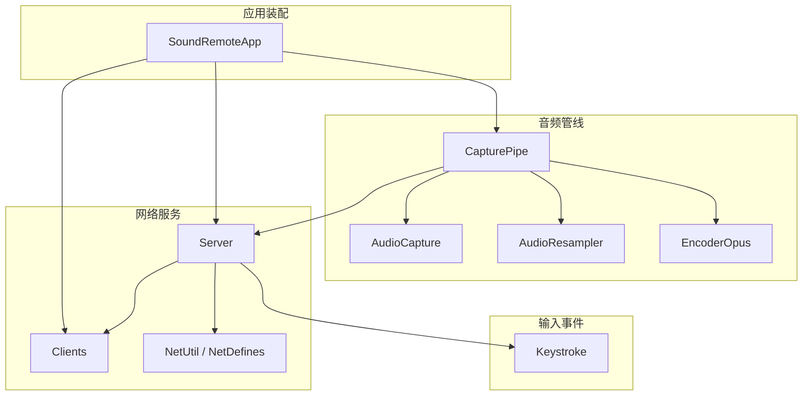
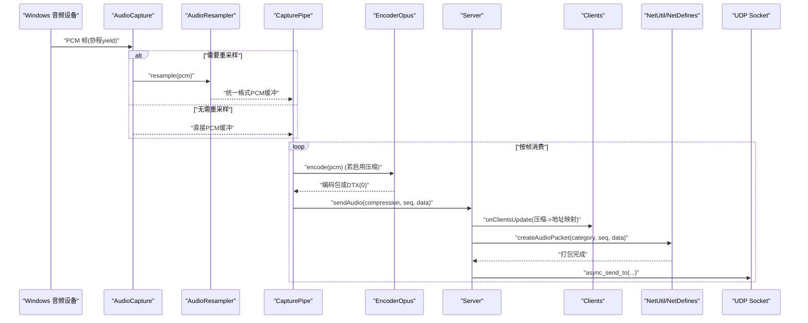
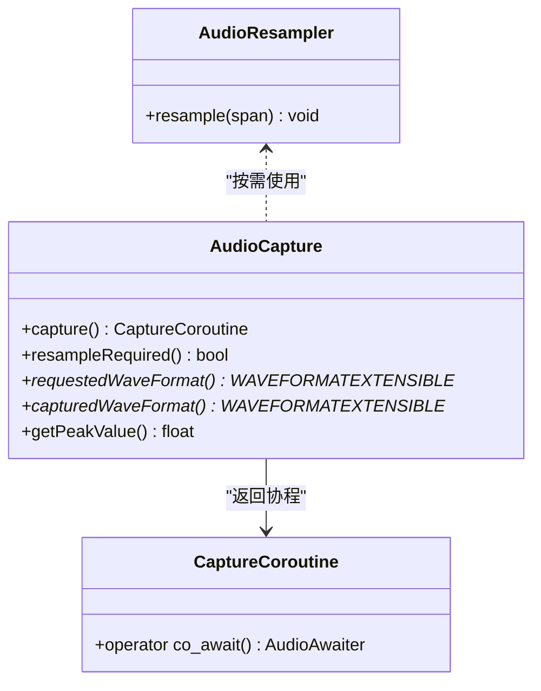
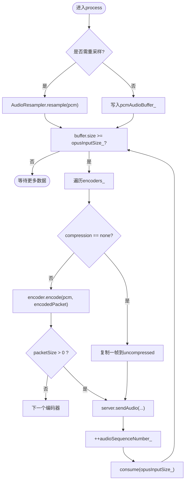
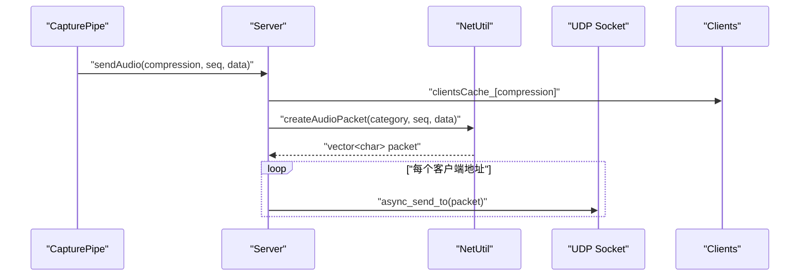
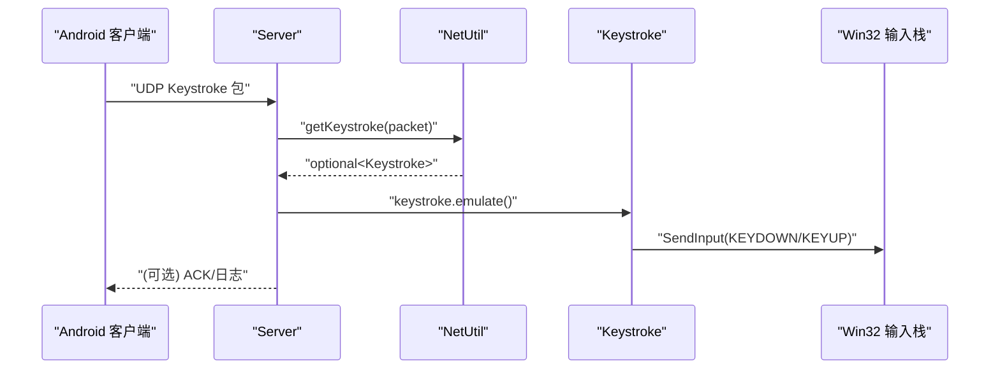
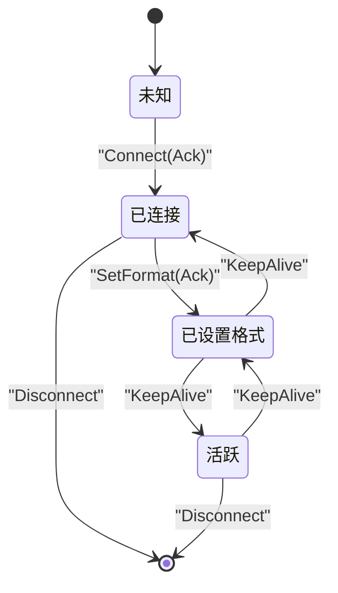
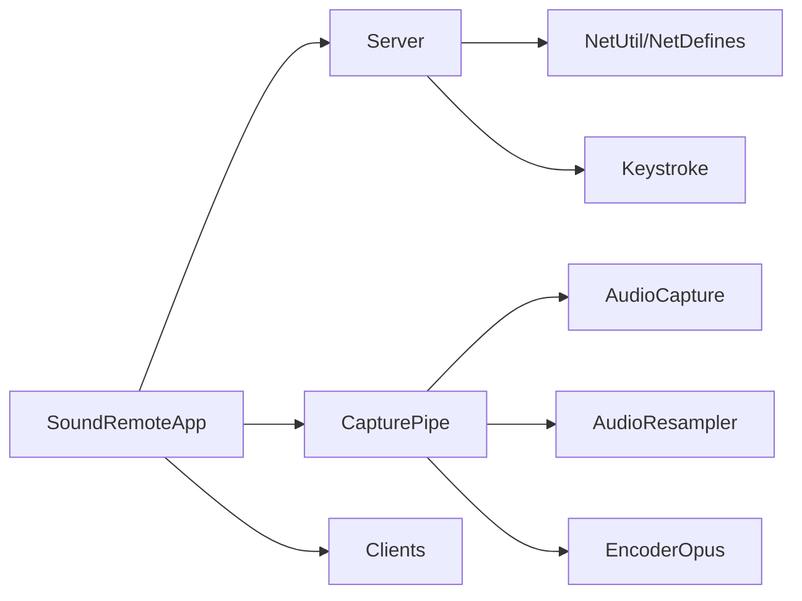

# 数据流设计

<cite>
**本文引用的文件**
- [AudioCapture.h](file://SoundRemote/AudioCapture.h)
- [AudioResampler.h](file://SoundRemote/AudioResampler.h)
- [EncoderOpus.h](file://SoundRemote/EncoderOpus.h)
- [CapturePipe.h](file://SoundRemote/CapturePipe.h)
- [CapturePipe.cpp](file://SoundRemote/CapturePipe.cpp)
- [Server.h](file://SoundRemote/Server.h)
- [Server.cpp](file://SoundRemote/Server.cpp)
- [Clients.h](file://SoundRemote/Clients.h)
- [NetDefines.h](file://SoundRemote/NetDefines.h)
- [NetUtil.h](file://SoundRemote/NetUtil.h)
- [NetUtil.cpp](file://SoundRemote/NetUtil.cpp)
- [Keystroke.h](file://SoundRemote/Keystroke.h)
- [Keystroke.cpp](file://SoundRemote/Keystroke.cpp)
- [AudioUtil.h](file://SoundRemote/AudioUtil.h)
- [SoundRemoteApp.h](file://SoundRemote/SoundRemoteApp.h)
- [SoundRemoteApp.cpp](file://SoundRemote/SoundRemoteApp.cpp)
</cite>

## 目录
1. [引言](#引言)
2. [项目结构](#项目结构)
3. [核心组件](#核心组件)
4. [架构总览](#架构总览)
5. [详细组件分析](#详细组件分析)
6. [依赖关系分析](#依赖关系分析)
7. [性能与内存优化](#性能与内存优化)
8. [故障排查指南](#故障排查指南)
9. [结论](#结论)

## 引言
本文件面向 SoundRemote-WinServer，系统化描述音频与键盘事件在 Windows 端的完整数据流：从系统音频设备捕获、格式转换与压缩编码、网络打包与发送，到 Android 客户端接收；以及键盘事件从网络解析、模拟执行到 UI 反馈的链路。文档同时给出数据流图与状态转换图，并说明缓冲区管理、内存优化策略和数据一致性保证机制。

## 项目结构
本项目采用分层与按功能模块组织的方式：
- 音频采集与处理层：AudioCapture、AudioResampler、EncoderOpus
- 管道编排层：CapturePipe（协程驱动）
- 网络服务层：Server、Clients、NetUtil、NetDefines
- 输入事件层：Keystroke
- 应用装配层：SoundRemoteApp

图表来源
- [SoundRemoteApp.cpp:91-125](file://SoundRemote/SoundRemoteApp.cpp#L91-L125)
- [CapturePipe.cpp:40-51](file://SoundRemote/CapturePipe.cpp#L40-L51)
- [Server.cpp:18-28](file://SoundRemote/Server.cpp#L18-L28)

章节来源
- [SoundRemoteApp.h:22-64](file://SoundRemote/SoundRemoteApp.h#L22-L64)
- [SoundRemoteApp.cpp:91-125](file://SoundRemote/SoundRemoteApp.cpp#L91-L125)

## 核心组件
- AudioCapture：基于 Windows Core Audio API 的异步采集器，提供协程式 yield 的 PCM 帧，支持峰值电平查询与重采样需求判断。
- AudioResampler：使用 Media Foundation IMFTransform 将设备实际输出格式转换为统一目标格式（如 48kHz 立体声）。
- EncoderOpus：封装 Opus 编码器，按固定帧长对 PCM 进行压缩编码，返回可传输包长度（含 DTX 零包判定）。
- CapturePipe：协程驱动的“采集-转码-打包-发送”流水线，维护多路编码器缓存与序列号，按客户端支持的压缩类型分发。
- Server：UDP 服务端，负责连接/断开/设置格式/心跳/按键等协议处理，并将音频数据广播给对应客户端集合。
- Clients：维护已连接客户端列表、最近联系时间、压缩能力，周期性维护超时清理，并向监听者推送更新。
- NetUtil/NetDefines：定义协议头、类别、字段偏移与编解码工具函数，确保跨端一致的数据布局。
- Keystroke：解析键值与修饰键位，调用 Win32 SendInput 模拟按键。
- SoundRemoteApp：组装各子系统，启动 IO 循环、UI 与音频管线，桥接回调。

章节来源
- [AudioCapture.h:22-78](file://SoundRemote/AudioCapture.h#L22-L78)
- [AudioResampler.h:13-23](file://SoundRemote/AudioResampler.h#L13-L23)
- [EncoderOpus.h:9-36](file://SoundRemote/EncoderOpus.h#L9-L36)
- [CapturePipe.h:23-51](file://SoundRemote/CapturePipe.h#L23-L51)
- [Server.h:20-60](file://SoundRemote/Server.h#L20-L60)
- [Clients.h:15-52](file://SoundRemote/Clients.h#L15-L52)
- [NetDefines.h:7-68](file://SoundRemote/NetDefines.h#L7-L68)
- [NetUtil.h:11-40](file://SoundRemote/NetUtil.h#L11-L40)
- [Keystroke.h:6-40](file://SoundRemote/Keystroke.h#L6-L40)
- [SoundRemoteApp.h:22-64](file://SoundRemote/SoundRemoteApp.h#L22-L64)

## 架构总览
整体数据流分为两条主线：
- 音频流：设备 -> 采集 -> 可选重采样 -> 分帧 -> 编码/直通 -> 网络打包 -> UDP 广播
- 控制流：客户端握手/设置格式/心跳 -> 服务器维护客户端表 -> 按键事件解析与本地模拟

图表来源
- [CapturePipe.cpp:97-155](file://SoundRemote/CapturePipe.cpp#L97-L155)
- [Server.cpp:48-62](file://SoundRemote/Server.cpp#L48-L62)
- [NetUtil.cpp:129-140](file://SoundRemote/NetUtil.cpp#L129-L140)

章节来源
- [AudioCapture.h:34-42](file://SoundRemote/AudioCapture.h#L34-L42)
- [AudioResampler.h:15-18](file://SoundRemote/AudioResampler.h#L15-L18)
- [EncoderOpus.h:14-23](file://SoundRemote/EncoderOpus.h#L14-L23)
- [CapturePipe.cpp:124-155](file://SoundRemote/CapturePipe.cpp#L124-L155)
- [Server.cpp:48-62](file://SoundRemote/Server.cpp#L48-L62)
- [NetUtil.cpp:129-140](file://SoundRemote/NetUtil.cpp#L129-L140)

## 详细组件分析

### 音频采集与重采样
- 设备协商：AudioCapture 根据请求格式与设备支持情况决定是否需要重采样，并提供 requested/captured WAVEFORMATEXTENSIBLE 供上层决策。
- 协程产出：capture() 返回 CaptureCoroutine，通过 co_await 获取 span<char> 形式的 PCM 帧，内部使用 boost::asio io_context 定时器驱动。
- 峰值电平：getPeakValue() 用于 UI 显示与静音检测辅助。

图表来源
- [AudioCapture.h:22-78](file://SoundRemote/AudioCapture.h#L22-L78)
- [AudioResampler.h:13-23](file://SoundRemote/AudioResampler.h#L13-L23)

章节来源
- [AudioCapture.h:22-78](file://SoundRemote/AudioCapture.h#L22-L78)
- [AudioResampler.h:13-23](file://SoundRemote/AudioResampler.h#L13-L23)

### 编码与分帧
- 帧尺寸：Opus 帧长固定为 10ms，结合采样率与声道数计算输入样本数与最大包大小。
- 编码流程：每帧 PCM 送入 EncoderOpus::encode，返回有效字节数；若为 0 表示 DTX，不发送。
- 多路复用：CapturePipe 维护按压缩类型索引的编码器缓存，避免重复创建销毁。

图表来源
- [CapturePipe.cpp:124-155](file://SoundRemote/CapturePipe.cpp#L124-L155)
- [EncoderOpus.h:14-23](file://SoundRemote/EncoderOpus.h#L14-L23)
- [AudioUtil.h:29-39](file://SoundRemote/AudioUtil.h#L29-L39)

章节来源
- [CapturePipe.cpp:124-155](file://SoundRemote/CapturePipe.cpp#L124-L155)
- [EncoderOpus.h:14-23](file://SoundRemote/EncoderOpus.h#L14-L23)
- [AudioUtil.h:29-39](file://SoundRemote/AudioUtil.h#L29-L39)

### 网络打包与发送
- 协议头：包含签名、类别、长度；音频数据包额外携带 32 位序列号与音频载荷。
- 类别选择：无压缩使用 AudioDataUncompressed，Opus 使用 AudioDataOpus。
- 发送路径：Server::sendAudio 构造包后，按 compression 维度查找客户端地址列表，批量异步发送。

图表来源
- [Server.cpp:48-62](file://SoundRemote/Server.cpp#L48-L62)
- [NetUtil.cpp:129-140](file://SoundRemote/NetUtil.cpp#L129-L140)
- [NetDefines.h:22-32](file://SoundRemote/NetDefines.h#L22-L32)

章节来源
- [Server.cpp:48-62](file://SoundRemote/Server.cpp#L48-L62)
- [NetUtil.cpp:129-140](file://SoundRemote/NetUtil.cpp#L129-L140)
- [NetDefines.h:22-32](file://SoundRemote/NetDefines.h#L22-L32)

### 键盘事件链路
- 接收：Server::receive 解析 UDP 包，识别 Keystroke 类别后交由 processKeystroke。
- 解析：Net::getKeystroke 读取 key 与 mods 字段，构造 Keystroke 对象。
- 执行：Keystroke::emulate 组合修饰键与主键的 KEYDOWN/KEYUP 事件，调用 SendInput 注入系统输入栈。
- 回调：可选回调通知 UI 展示按键信息。

图表来源
- [Server.cpp:155-162](file://SoundRemote/Server.cpp#L155-L162)
- [NetUtil.cpp:182-191](file://SoundRemote/NetUtil.cpp#L182-L191)
- [Keystroke.cpp:20-52](file://SoundRemote/Keystroke.cpp#L20-L52)

章节来源
- [Server.cpp:155-162](file://SoundRemote/Server.cpp#L155-L162)
- [NetUtil.cpp:182-191](file://SoundRemote/NetUtil.cpp#L182-L191)
- [Keystroke.cpp:20-52](file://SoundRemote/Keystroke.cpp#L20-L52)

### 客户端管理与状态机
- 生命周期：Connect/SetFormat/KeepAlive/Disconnect 四类控制消息驱动客户端状态变更。
- 超时清理：定时任务 maintain 周期扫描，移除长时间未更新的客户端。
- 压缩能力：按 compression 维度维护地址列表，便于音频广播定向。

图表来源
- [Server.cpp:127-166](file://SoundRemote/Server.cpp#L127-L166)
- [Clients.h:15-52](file://SoundRemote/Clients.h#L15-L52)

章节来源
- [Server.cpp:127-166](file://SoundRemote/Server.cpp#L127-L166)
- [Clients.h:15-52](file://SoundRemote/Clients.h#L15-L52)

## 依赖关系分析
- 低耦合高内聚：CapturePipe 仅依赖抽象接口与具体实现类，通过 onClientsUpdate 解耦客户端变化与编码资源管理。
- 明确边界：NetUtil/NetDefines 集中协议细节，Server 仅关注业务路由与发送。
- 外部依赖：Core Audio、Media Foundation、Opus、Boost.Asio、Win32 API。

图表来源
- [SoundRemoteApp.cpp:91-125](file://SoundRemote/SoundRemoteApp.cpp#L91-L125)
- [CapturePipe.cpp:40-51](file://SoundRemote/CapturePipe.cpp#L40-L51)
- [Server.cpp:18-28](file://SoundRemote/Server.cpp#L18-L28)

章节来源
- [SoundRemoteApp.cpp:91-125](file://SoundRemote/SoundRemoteApp.cpp#L91-L125)
- [CapturePipe.cpp:40-51](file://SoundRemote/CapturePipe.cpp#L40-L51)
- [Server.cpp:18-28](file://SoundRemote/Server.cpp#L18-L28)

## 性能与内存优化
- 帧级分片与顺序消费：CapturePipe 使用 streambuf 累积 PCM，按固定 opusInputSize 切分，减少拷贝与分配次数。
- 编码器复用：按压缩类型缓存 EncoderOpus，避免频繁创建/销毁带来的抖动。
- 零拷贝倾向：尽量使用 span 与 buffer 引用，仅在必要时复制到临时 vector 再发送。
- 并发模型：IO 线程运行 asio event loop，UI 线程与后台线程分离，避免阻塞。
- 序列号单调递增：全局原子序列号保障客户端乱序/丢包检测与播放平滑。
- 建议
  - 预分配发送缓冲池，降低高频分配开销。
  - 针对弱网环境可引入自适应码率与丢包补偿策略（当前为静态码率）。
  - 对大流量场景考虑批量化发送与更细粒度的拥塞控制。

[本节为通用性能建议，不直接分析具体文件]

## 故障排查指南
- 接收异常：Server::receive 捕获 system_error 与 std::exception，记录错误并退出；检查端口占用与防火墙规则。
- 发送失败：handleSend 中抛出运行时异常，确认 socket 状态与远端可达性。
- 定时器异常：maintain 中 timer 错误分支会抛错，检查 IO 上下文是否仍在运行。
- 音频问题：确认设备 ID 正确、重采样路径可用、Opus 帧尺寸与采样率匹配。
- 按键无效：检查修饰键组合是否被系统拦截（如 Ctrl+Alt+Del），确认 SendInput 返回值。

章节来源
- [Server.cpp:111-125](file://SoundRemote/Server.cpp#L111-L125)
- [Server.cpp:176-180](file://SoundRemote/Server.cpp#L176-L180)
- [Server.cpp:187-199](file://SoundRemote/Server.cpp#L187-L199)
- [Keystroke.cpp:48-52](file://SoundRemote/Keystroke.cpp#L48-L52)

## 结论
SoundRemote-WinServer 以协程驱动的音频管线为核心，结合稳定的 UDP 协议与客户端管理能力，实现了低延迟、可扩展的远程音频与按键转发方案。通过明确的职责划分、合理的缓冲与编码策略，系统在性能与稳定性之间取得良好平衡。后续可在自适应码率、丢包恢复与更精细的拥塞控制方面持续演进。