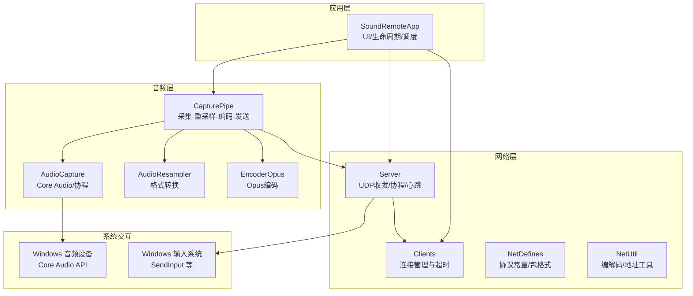
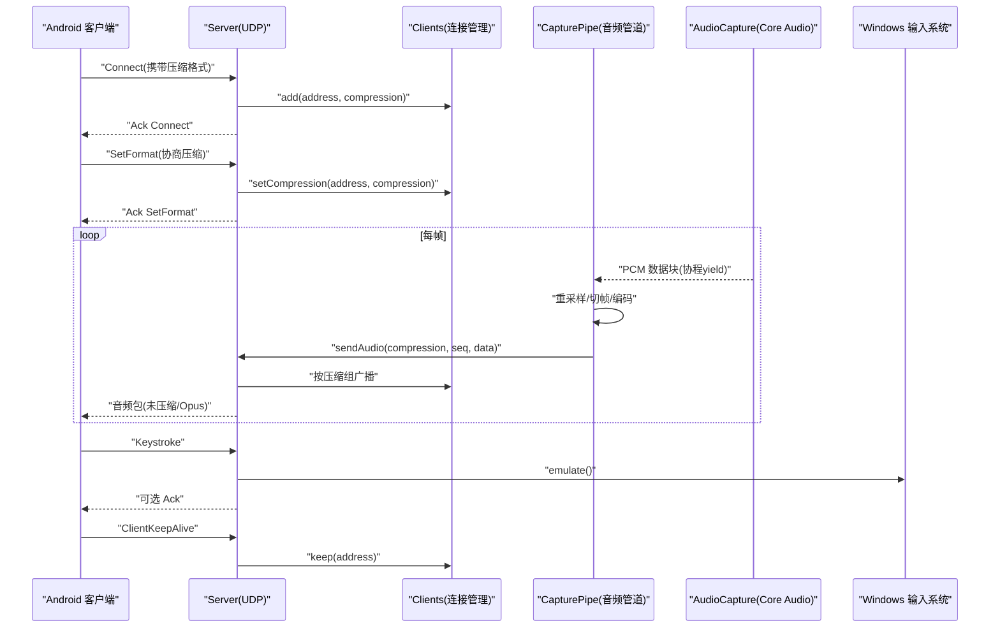
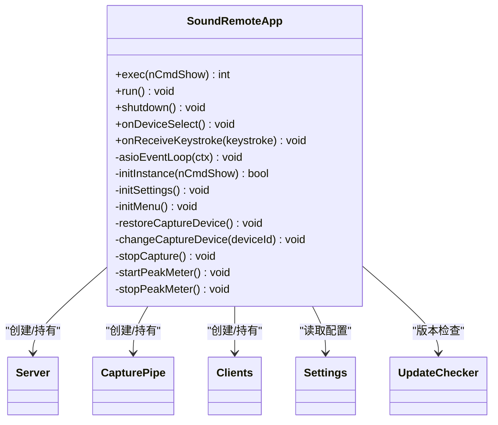
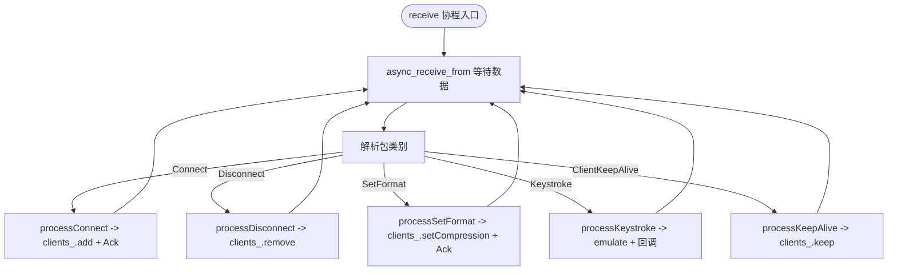
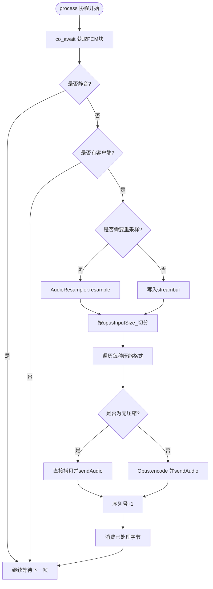
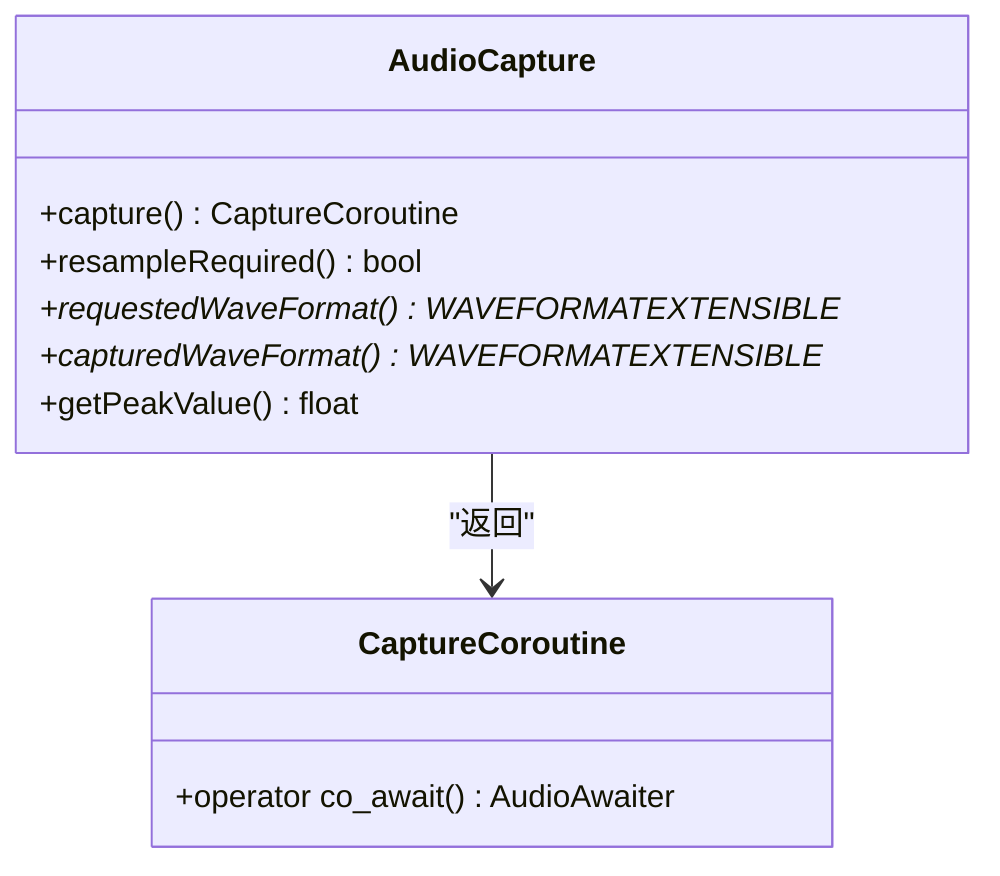
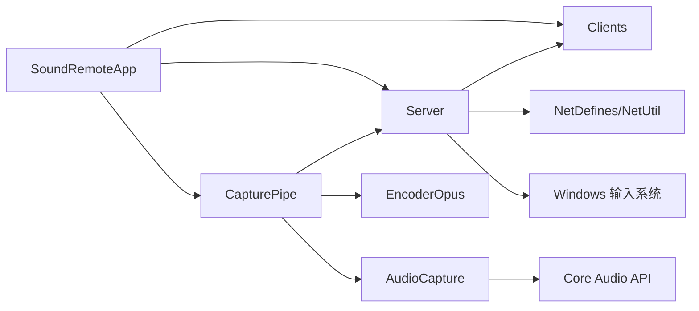

# 整体架构概览

<cite>
**本文引用的文件**   
- [SoundRemoteApp.h](file://SoundRemote/SoundRemoteApp.h)
- [SoundRemoteApp.cpp](file://SoundRemote/SoundRemoteApp.cpp)
- [Server.h](file://SoundRemote/Server.h)
- [Server.cpp](file://SoundRemote/Server.cpp)
- [CapturePipe.h](file://SoundRemote/CapturePipe.h)
- [CapturePipe.cpp](file://SoundRemote/CapturePipe.cpp)
- [AudioCapture.h](file://SoundRemote/AudioCapture.h)
- [AudioUtil.h](file://SoundRemote/AudioUtil.h)
- [EncoderOpus.h](file://SoundRemote/EncoderOpus.h)
- [Clients.h](file://SoundRemote/Clients.h)
- [NetDefines.h](file://SoundRemote/NetDefines.h)
- [NetUtil.h](file://SoundRemote/NetUtil.h)
- [Keystroke.h](file://SoundRemote/Keystroke.h)
- [README.md](file://README.md)
</cite>

## 目录
1. [简介](#简介)
2. [项目结构](#项目结构)
3. [核心组件](#核心组件)
4. [架构总览](#架构总览)
5. [详细组件分析](#详细组件分析)
6. [依赖关系分析](#依赖关系分析)
7. [性能考量](#性能考量)
8. [故障排查指南](#故障排查指南)
9. [结论](#结论)
10. [附录](#附录)

## 简介
本文件为 SoundRemote-WinServer 的整体架构概览，面向希望理解系统设计与实现的技术读者。系统是一个 Windows 桌面应用，通过 UDP 与 Android 客户端通信，将本地音频捕获并（可选）编码后发送给客户端；同时支持从客户端接收键盘事件并在本机模拟输入。系统采用 C++20 协程与 Boost.Asio 的异步 I/O 模型，结合 Windows Core Audio API 进行低延迟音频采集，并使用 Opus 编码器降低网络带宽占用。

## 项目结构
- 顶层包含解决方案、构建脚本与 vcpkg 配置，用于在 Windows 平台使用 Visual Studio 2022 构建。
- 源代码位于 SoundRemote 目录，按功能模块组织：
  - 应用主类与 UI 初始化：SoundRemoteApp.*
  - 网络服务与协议：Server.*, NetDefines.h, NetUtil.h
  - 音频管道：CapturePipe.*, AudioCapture.*, AudioResampler.*, EncoderOpus.*
  - 客户端管理：Clients.*
  - 输入模拟：Keystroke.*
  - 通用工具与错误处理：AudioUtil.*, Util.*
- 测试代码位于 Tests 目录，覆盖各模块头文件与关键逻辑。

图表来源
- [SoundRemoteApp.h:22-151](file://SoundRemote/SoundRemoteApp.h#L22-L151)
- [Server.h:20-60](file://SoundRemote/Server.h#L20-L60)
- [CapturePipe.h:23-51](file://SoundRemote/CapturePipe.h#L23-L51)
- [AudioCapture.h:22-78](file://SoundRemote/AudioCapture.h#L22-L78)
- [Clients.h:15-52](file://SoundRemote/Clients.h#L15-L52)
- [NetDefines.h:7-68](file://SoundRemote/NetDefines.h#L7-L68)
- [NetUtil.h:11-40](file://SoundRemote/NetUtil.h#L11-L40)

章节来源
- [README.md:1-14](file://README.md#L1-L14)

## 核心组件
- 应用程序主类 SoundRemoteApp
  - 负责 Windows 消息循环、UI 初始化、设置加载、设备枚举与选择、启动服务器与音频管道、更新检查、挂起/恢复通知注册等。
  - 维护一个独立的 io_context 线程，运行 Boost.Asio 的事件循环。
- 服务器模块 Server
  - 基于 Boost.Asio 的 UDP socket，使用协程 awaitable 接收数据包，解析协议类别并分发到具体处理器。
  - 维护客户端列表与压缩格式缓存，周期性发送心跳，向所有匹配压缩格式的客户端广播音频数据。
- 音频管道 CapturePipe
  - 协调 AudioCapture、可选的重采样器 AudioResampler、Opus 编码器 EncoderOpus，以及 Server 的发送接口。
  - 以协程方式持续拉取 PCM 帧，按需重采样，按目标帧大小切分，逐路编码或直通，调用 Server::sendAudio 发送。
- 音频采集 AudioCapture
  - 封装 Windows Core Audio API，提供可等待的采集协程，返回 PCM 数据片段，并提供峰值电平查询。
- 客户端管理 Clients
  - 维护已连接的客户端地址与其支持的压缩格式，提供添加、更新、保持、移除、定时维护与监听器通知。
- 网络协议定义 NetDefines / NetUtil
  - 定义包签名、类别、字段类型、默认端口、固定头部偏移等；提供创建/解析各类包的函数。
- 输入模拟 Keystroke
  - 封装按键与修饰键信息，提供在本机模拟按键的方法。

章节来源
- [SoundRemoteApp.h:22-151](file://SoundRemote/SoundRemoteApp.h#L22-L151)
- [SoundRemoteApp.cpp:36-125](file://SoundRemote/SoundRemoteApp.cpp#L36-L125)
- [Server.h:20-60](file://SoundRemote/Server.h#L20-L60)
- [Server.cpp:18-125](file://SoundRemote/Server.cpp#L18-L125)
- [CapturePipe.h:23-51](file://SoundRemote/CapturePipe.h#L23-L51)
- [CapturePipe.cpp:40-156](file://SoundRemote/CapturePipe.cpp#L40-L156)
- [AudioCapture.h:22-78](file://SoundRemote/AudioCapture.h#L22-L78)
- [Clients.h:15-52](file://SoundRemote/Clients.h#L15-L52)
- [NetDefines.h:7-68](file://SoundRemote/NetDefines.h#L7-L68)
- [NetUtil.h:11-40](file://SoundRemote/NetUtil.h#L11-L40)
- [Keystroke.h:6-40](file://SoundRemote/Keystroke.h#L6-L40)

## 架构总览
下图展示系统的高层交互：Android 客户端通过 UDP 与服务端建立连接、协商压缩格式、维持心跳；服务端周期性采集音频，经重采样与编码后按客户端能力分组发送；客户端的按键事件上行至服务端，由服务端注入系统输入。

图表来源
- [Server.cpp:80-166](file://SoundRemote/Server.cpp#L80-L166)
- [CapturePipe.cpp:97-156](file://SoundRemote/CapturePipe.cpp#L97-L156)
- [AudioCapture.h:80-143](file://SoundRemote/AudioCapture.h#L80-L143)
- [Clients.h:15-52](file://SoundRemote/Clients.h#L15-L52)
- [NetDefines.h:47-58](file://SoundRemote/NetDefines.h#L47-L58)

## 详细组件分析

### 应用程序主类 SoundRemoteApp
- 职责
  - 初始化 Windows UI、菜单、字符串资源、设置与更新检查。
  - 创建并持有 Server、Clients、CapturePipe、Settings、UpdateChecker 等对象。
  - 启动独立线程运行 boost::asio::io_context，避免阻塞 UI 线程。
  - 处理设备选择、静音切换、客户端列表刷新、按键事件显示等。
- 控制流要点
  - exec() 中进入消息循环；run() 中完成服务器与管道的初始化与启动。
  - shutdown() 中发送断开包、停止采集、停止 io_context。
- 与系统的集成
  - 使用 Windows API 枚举渲染/录制设备，保存/恢复默认设备。
  - 注册系统挂起/恢复通知，保证运行时稳定性。

图表来源
- [SoundRemoteApp.h:22-151](file://SoundRemote/SoundRemoteApp.h#L22-L151)
- [SoundRemoteApp.cpp:36-125](file://SoundRemote/SoundRemoteApp.cpp#L36-L125)

章节来源
- [SoundRemoteApp.h:22-151](file://SoundRemote/SoundRemoteApp.h#L22-L151)
- [SoundRemoteApp.cpp:36-125](file://SoundRemote/SoundRemoteApp.cpp#L36-L125)

### 服务器模块 Server（基于 Boost.Asio 的异步 UDP）
- 设计要点
  - 使用两个 UDP socket：socketReceive_ 用于接收，socketSend_ 用于发送。
  - receive() 协程无限循环，co_await 接收数据报，根据协议类别分发处理。
  - onClientsUpdate() 将客户端按压缩格式分组缓存，便于快速广播。
  - sendAudio() 根据压缩类型选择包类别，构造音频包并发送到对应客户端集合。
  - keepalive() 周期发送心跳，maintain() 定时器驱动心跳与客户端维护。
- 错误处理
  - 接收协程内捕获系统错误与未知异常，必要时弹出错误并退出进程。
  - 发送回调 handleSend() 对错误码进行处理。

图表来源
- [Server.cpp:80-166](file://SoundRemote/Server.cpp#L80-L166)
- [NetDefines.h:47-58](file://SoundRemote/NetDefines.h#L47-L58)

章节来源
- [Server.h:20-60](file://SoundRemote/Server.h#L20-L60)
- [Server.cpp:18-209](file://SoundRemote/Server.cpp#L18-L209)
- [NetDefines.h:7-68](file://SoundRemote/NetDefines.h#L7-L68)
- [NetUtil.h:11-40](file://SoundRemote/NetUtil.h#L11-L40)

### 音频管道 CapturePipe（采集-重采样-编码-发送）
- 设计要点
  - 构造时创建 AudioCapture，若设备实际格式与请求不一致则创建 AudioResampler。
  - start() 启动 process() 协程，循环 co_await 获取 PCM 数据块。
  - 当有活跃客户端且未静音时，将 PCM 送入 resampler 或直接入缓冲，按 opusInputSize_ 切分。
  - 对每种压缩格式（none 或不同 Opus 码率）分别编码或直通，调用 Server::sendAudio 发送。
  - onClientsUpdate() 动态增删编码器实例，避免不必要的 CPU 消耗。
- 复杂度与优化
  - 每帧 O(Nc) 的编码/复制开销，Nc 为当前客户端使用的不同压缩格式数量。
  - 通过复用 streambuf 与编码器实例减少分配与重建成本。

图表来源
- [CapturePipe.cpp:97-156](file://SoundRemote/CapturePipe.cpp#L97-L156)
- [AudioCapture.h:80-143](file://SoundRemote/AudioCapture.h#L80-L143)
- [EncoderOpus.h:9-36](file://SoundRemote/EncoderOpus.h#L9-L36)

章节来源
- [CapturePipe.h:23-51](file://SoundRemote/CapturePipe.h#L23-L51)
- [CapturePipe.cpp:40-156](file://SoundRemote/CapturePipe.cpp#L40-L156)
- [AudioCapture.h:22-78](file://SoundRemote/AudioCapture.h#L22-L78)
- [EncoderOpus.h:9-36](file://SoundRemote/EncoderOpus.h#L9-L36)

### 音频采集 AudioCapture（Windows Core Audio）
- 设计要点
  - 使用 COM 智能指针管理 IAudioClient/IAudioCaptureClient/IAudioMeterInformation。
  - capture() 返回 CaptureCoroutine，内部 yield_value 传递 PCM span，外部通过 co_await 获取。
  - 提供 requestedWaveFormat()/capturedWaveFormat() 判断是否需要重采样。
  - getPeakValue() 提供峰值电平供 UI 显示。
- 协程模式
  - 自定义 promise_type 与 awaiter，使外部协程可以像普通异步操作一样等待音频数据。

图表来源
- [AudioCapture.h:22-78](file://SoundRemote/AudioCapture.h#L22-L78)
- [AudioCapture.h:80-143](file://SoundRemote/AudioCapture.h#L80-L143)

章节来源
- [AudioCapture.h:22-78](file://SoundRemote/AudioCapture.h#L22-L78)

### 客户端管理 Clients
- 设计要点
  - 维护 Address -> Client 映射，记录最后接触时间与压缩格式。
  - add/setCompression/keep/remove 等方法由 Server 在收到相应包时调用。
  - maintain() 定期清理超时客户端，并通过监听器通知 UI 更新。
- 并发安全
  - 使用 shared_mutex 保护客户端集合，监听器列表在程序启动与设备变更时修改，非热路径。

章节来源
- [Clients.h:15-52](file://SoundRemote/Clients.h#L15-L52)

### 网络协议与工具 NetDefines / NetUtil
- 协议要点
  - 固定头部包含签名、类别、长度；数据区包含序列号、音频载荷或控制信息。
  - 类别涵盖连接、断开、格式设置、按键、音频数据（未压缩/Opus）、心跳、应答等。
  - 默认端口：服务端 15711，客户端 15712。
- 工具函数
  - 创建/解析各类包，压缩值在网络与本地枚举间转换，获取本地 IPv4 地址列表。

章节来源
- [NetDefines.h:7-68](file://SoundRemote/NetDefines.h#L7-L68)
- [NetUtil.h:11-40](file://SoundRemote/NetUtil.h#L11-L40)

### 输入模拟 Keystroke
- 设计要点
  - 封装虚拟键码与修饰键位图，提供 emulate() 在本机注入按键事件。
  - toString() 用于调试与日志输出。

章节来源
- [Keystroke.h:6-40](file://SoundRemote/Keystroke.h#L6-L40)

## 依赖关系分析
- 耦合与内聚
  - SoundRemoteApp 作为装配中心，松耦合地组合 Server、CapturePipe、Clients 等模块。
  - Server 仅依赖 Clients 与协议工具，不感知音频细节，职责清晰。
  - CapturePipe 聚合音频子系统与网络发送，是音频路径的核心编排者。
- 外部依赖
  - Boost.Asio：异步 I/O 与协程支持。
  - Windows Core Audio API：低延迟音频采集与设备枚举。
  - Opus 库：高质量低延迟音频编码。
  - Windows 输入 API：按键模拟。

图表来源
- [SoundRemoteApp.h:22-151](file://SoundRemote/SoundRemoteApp.h#L22-L151)
- [Server.h:20-60](file://SoundRemote/Server.h#L20-L60)
- [CapturePipe.h:23-51](file://SoundRemote/CapturePipe.h#L23-L51)
- [AudioCapture.h:22-78](file://SoundRemote/AudioCapture.h#L22-L78)
- [EncoderOpus.h:9-36](file://SoundRemote/EncoderOpus.h#L9-L36)
- [NetDefines.h:7-68](file://SoundRemote/NetDefines.h#L7-L68)
- [NetUtil.h:11-40](file://SoundRemote/NetUtil.h#L11-L40)

章节来源
- [SoundRemoteApp.h:22-151](file://SoundRemote/SoundRemoteApp.h#L22-L151)
- [Server.h:20-60](file://SoundRemote/Server.h#L20-L60)
- [CapturePipe.h:23-51](file://SoundRemote/CapturePipe.h#L23-L51)
- [AudioCapture.h:22-78](file://SoundRemote/AudioCapture.h#L22-L78)
- [EncoderOpus.h:9-36](file://SoundRemote/EncoderOpus.h#L9-L36)
- [NetDefines.h:7-68](file://SoundRemote/NetDefines.h#L7-L68)
- [NetUtil.h:11-40](file://SoundRemote/NetUtil.h#L11-L40)

## 性能考量
- 异步与协程
  - 使用 Boost.Asio 的协程 awaitable 简化异步逻辑，避免回调地狱，提高可读性与可维护性。
  - 音频采集与网络收发均在后台线程执行，UI 线程保持响应。
- 编码与带宽
  - 针对每个客户端的压缩格式单独编码，避免重复计算；无压缩路径用于兼容旧客户端或特殊场景。
  - Opus 帧长与最大包大小在 AudioUtil 中定义，兼顾低延迟与带宽效率。
- 内存与分配
  - 使用 streambuf 累积 PCM 数据并按固定帧大小切分，减少频繁分配。
  - 发送时使用共享指针持有数据包，确保异步回调期间数据有效。
- 设备与重采样
  - 仅在设备不支持请求格式时启用重采样，减少不必要的 CPU 开销。

[本节为通用指导，无需列出具体文件来源]

## 故障排查指南
- 常见问题定位
  - 无法访问麦克风：检查系统隐私设置中的麦克风权限。
  - 客户端无法连接：确认防火墙放行默认端口（服务端 15711，客户端 15712）。
  - 音频卡顿或爆音：调整缓冲区时长、检查重采样路径与编码器参数。
  - 按键无效：部分系统级快捷键（如 Ctrl+Alt+Del、Win+L）受系统限制，可能不被支持。
- 错误处理策略
  - 音频错误：AudioUtil 提供统一的错误文本生成与退出流程，便于定位失败位置。
  - 网络错误：Server 接收协程捕获系统错误与未知异常，必要时弹窗并终止进程，防止静默失败。
  - 定时器错误：维护定时器异常会抛出运行时错误，需关注日志与崩溃堆栈。

章节来源
- [AudioUtil.h:130-169](file://SoundRemote/AudioUtil.h#L130-L169)
- [Server.cpp:111-125](file://SoundRemote/Server.cpp#L111-L125)
- [Server.cpp:187-199](file://SoundRemote/Server.cpp#L187-L199)

## 结论
SoundRemote-WinServer 采用清晰的模块化设计与现代 C++ 异步编程范式，结合 Windows Core Audio 与 Opus 编码，实现了低延迟、可扩展的远程音频传输方案。基于 Boost.Asio 的协程化网络层提升了开发体验与运行效率；客户端-服务器通过轻量 UDP 协议交互，兼顾实时性与兼容性。未来可在多通道混音、自适应码率、丢包补偿等方面进一步增强。

[本节为总结性内容，无需列出具体文件来源]

## 附录
- 技术决策与权衡
  - 选择 UDP：满足低延迟需求，适合实时音视频；通过心跳与序列号弥补不可靠性。
  - 选择 C++20 协程：简化异步逻辑，提升可维护性；与 Boost.Asio 良好集成。
  - 选择 Opus：在音质与带宽之间取得平衡，支持多种码率以适应不同网络条件。
  - 选择 Windows Core Audio：原生 API，低延迟、高可靠性，适配广泛设备。
  - 选择模块化设计：降低耦合度，便于单元测试与扩展。

[本节为概念性内容，无需列出具体文件来源]