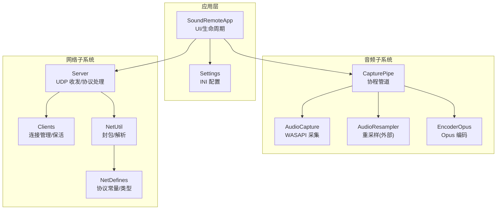
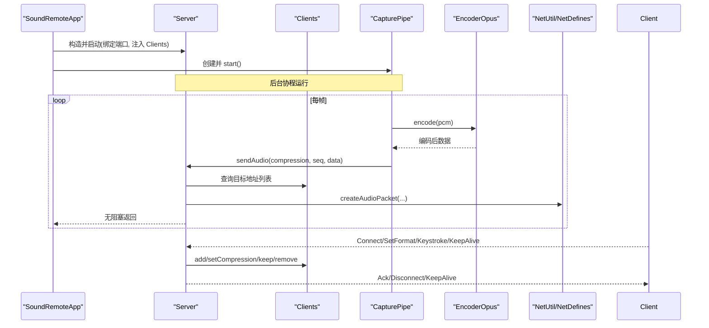
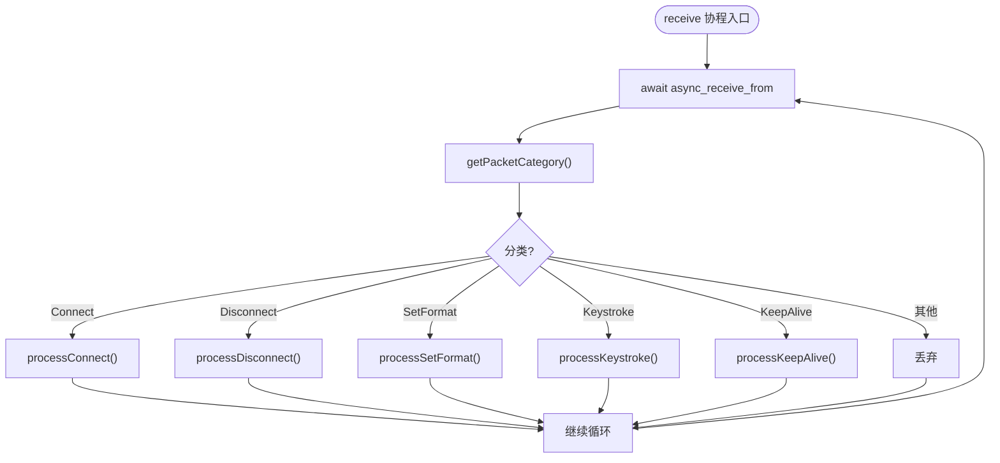
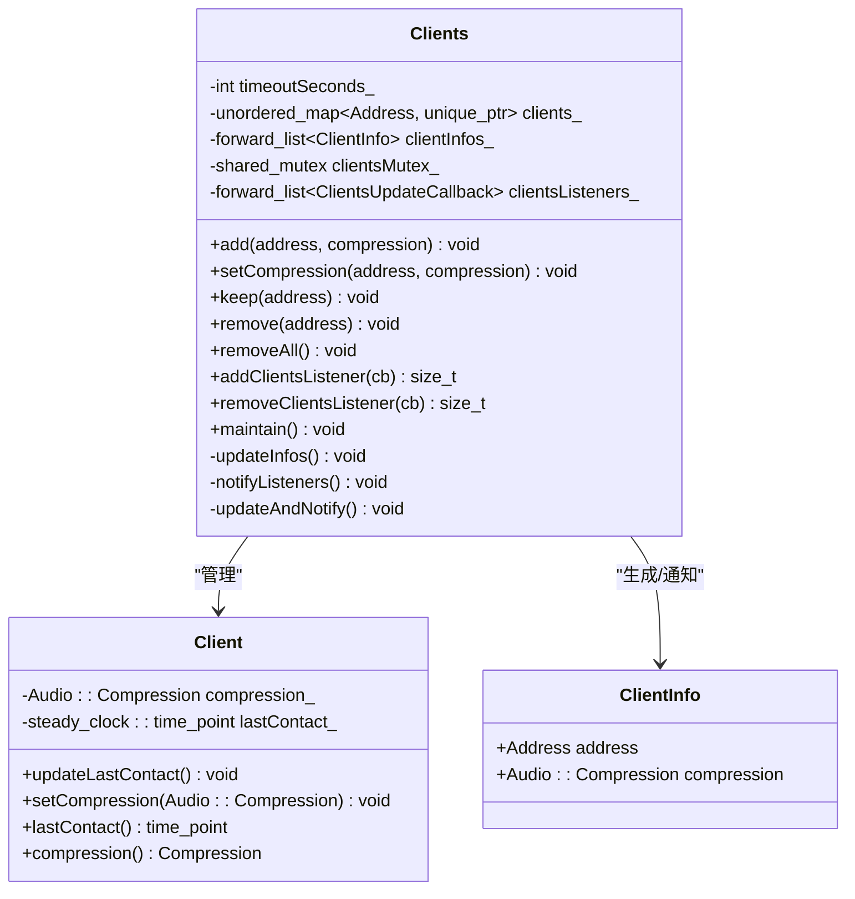
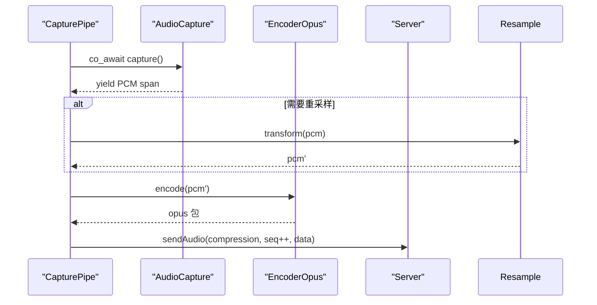
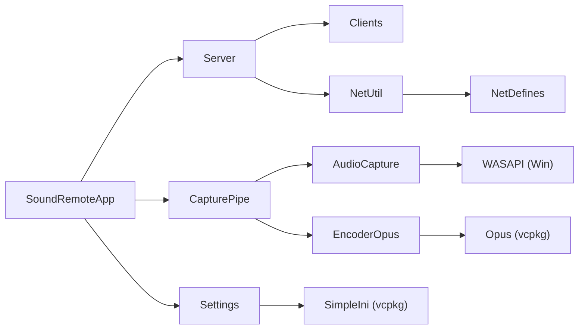

# 架构设计

<cite>
**本文引用的文件**   
- [README.md](file://README.md)
- [vcpkg.json](file://vcpkg.json)
- [vcpkg-configuration.json](file://vcpkg-configuration.json)
- [build_win.ps1](file://build_win.ps1)
- [SoundRemoteApp.h](file://SoundRemote/SoundRemoteApp.h)
- [Server.h](file://SoundRemote/Server.h)
- [Server.cpp](file://SoundRemote/Server.cpp)
- [Clients.h](file://SoundRemote/Clients.h)
- [CapturePipe.h](file://SoundRemote/CapturePipe.h)
- [AudioCapture.h](file://SoundRemote/AudioCapture.h)
- [EncoderOpus.h](file://SoundRemote/EncoderOpus.h)
- [NetDefines.h](file://SoundRemote/NetDefines.h)
- [NetUtil.h](file://SoundRemote/NetUtil.h)
</cite>

## 目录
1. [简介](#简介)
2. [项目结构](#项目结构)
3. [核心组件](#核心组件)
4. [架构总览](#架构总览)
5. [详细组件分析](#详细组件分析)
6. [依赖关系分析](#依赖关系分析)
7. [性能与可扩展性](#性能与可扩展性)
8. [安全、监控与错误恢复](#安全监控与错误恢复)
9. [技术栈与兼容性](#技术栈与兼容性)
10. [部署拓扑与基础设施要求](#部署拓扑与基础设施要求)
11. [故障排查指南](#故障排查指南)
12. [结论](#结论)

## 简介
SoundRemote-WinServer 是一个 Windows 桌面服务端应用，通过 UDP 与 Android 客户端配对，实现：
- 捕获系统音频并发送到客户端设备（支持无损与 Opus 压缩）。
- 将客户端发送的键盘快捷键在本地模拟执行。

本架构文档聚焦于高层设计、架构模式、组件边界、数据流与集成模式，解释基于 Boost.Asio 的异步网络架构、C++20 协程的使用以及模块化设计原则，并提供部署拓扑、横切关注点（安全性、监控、错误恢复）与技术栈说明。

## 项目结构
- 顶层包含构建脚本、依赖清单与解决方案文件；核心代码位于 SoundRemote 目录；测试位于 Tests 目录；第三方库头文件 include/opus 用于编译期可见接口。
- 关键模块划分：
  - 应用入口与 UI 控制：SoundRemoteApp
  - 网络服务：Server、Clients、NetDefines、NetUtil
  - 音频采集与处理：AudioCapture、CapturePipe、EncoderOpus
  - 配置与工具：Settings、AudioUtil、Util

图表来源
- [SoundRemoteApp.h:1-152](file://SoundRemote/SoundRemoteApp.h#L1-L152)
- [Server.h:1-61](file://SoundRemote/Server.h#L1-L61)
- [Server.cpp:1-210](file://SoundRemote/Server.cpp#L1-L210)
- [Clients.h:1-60](file://SoundRemote/Clients.h#L1-L60)
- [CapturePipe.h:1-52](file://SoundRemote/CapturePipe.h#L1-L52)
- [AudioCapture.h:1-144](file://SoundRemote/AudioCapture.h#L1-L144)
- [EncoderOpus.h:1-37](file://SoundRemote/EncoderOpus.h#L1-L37)
- [NetDefines.h:1-69](file://SoundRemote/NetDefines.h#L1-L69)
- [NetUtil.h:1-41](file://SoundRemote/NetUtil.h#L1-L41)

章节来源
- [README.md:1-14](file://README.md#L1-L14)
- [SoundRemoteApp.h:1-152](file://SoundRemote/SoundRemoteApp.h#L1-L152)

## 核心组件
- SoundRemoteApp：Windows 应用入口，负责 UI 初始化、设置加载、启动 IO 线程、协调音频采集与网络服务。
- Server：基于 Boost.Asio 的 UDP 服务器，使用协程接收数据包，分发到具体处理器；维护客户端缓存并按需广播音频数据；周期性保活。
- Clients：维护已连接客户端集合、压缩格式、最后接触时间，提供监听器机制通知上层更新。
- CapturePipe：封装音频采集、可选重采样、按目标压缩格式编码、序列号递增与发送；内部使用 C++20 协程驱动采集循环。
- AudioCapture：基于 WASAPI 的音频采集抽象，暴露可等待的协程以产出 PCM 片段。
- EncoderOpus：封装 Opus 编码器，按帧大小和通道数进行编码。
- NetDefines/NetUtil：定义协议常量、枚举、数据结构与封包/解析函数。

章节来源
- [SoundRemoteApp.h:1-152](file://SoundRemote/SoundRemoteApp.h#L1-L152)
- [Server.h:1-61](file://SoundRemote/Server.h#L1-L61)
- [Server.cpp:1-210](file://SoundRemote/Server.cpp#L1-L210)
- [Clients.h:1-60](file://SoundRemote/Clients.h#L1-L60)
- [CapturePipe.h:1-52](file://SoundRemote/CapturePipe.h#L1-L52)
- [AudioCapture.h:1-144](file://SoundRemote/AudioCapture.h#L1-L144)
- [EncoderOpus.h:1-37](file://SoundRemote/EncoderOpus.h#L1-L37)
- [NetDefines.h:1-69](file://SoundRemote/NetDefines.h#L1-L69)
- [NetUtil.h:1-41](file://SoundRemote/NetUtil.h#L1-L41)

## 架构总览
系统采用“事件驱动 + 协程”的异步架构：
- 网络层：Boost.Asio io_context 驱动 UDP socket 的异步收发；接收协程持续 await 数据报，按类别路由至处理函数。
- 音频层：WASAPI 采集通过自定义协程包装，yield 出 PCM 片段；CapturePipe 根据目标压缩格式选择编码器并打包发送。
- 连接管理：Clients 维护连接状态与保活计时，Server 定时触发 keepalive 并清理超时客户端。
- 模块化：UI、网络、音频、配置相互解耦，通过回调或共享对象交互。

图表来源
- [Server.cpp:1-210](file://SoundRemote/Server.cpp#L1-L210)
- [CapturePipe.h:1-52](file://SoundRemote/CapturePipe.h#L1-L52)
- [EncoderOpus.h:1-37](file://SoundRemote/EncoderOpus.h#L1-L37)
- [NetUtil.h:1-41](file://SoundRemote/NetUtil.h#L1-L41)
- [NetDefines.h:1-69](file://SoundRemote/NetDefines.h#L1-L69)
- [Clients.h:1-60](file://SoundRemote/Clients.h#L1-L60)

## 详细组件分析

### 网络与服务端（Server）
- 职责
  - 启动两个 UDP socket：一个用于接收（绑定 serverPort），一个用于发送（clientPort 作为目的端口）。
  - 使用协程 receive 循环读取数据报，解析 Packet::Category 并调用对应处理器。
  - 维护 clientsCache_ 按压缩格式索引客户端地址，用于高效广播。
  - 定时器 maintain 周期触发 keepalive 与客户端维护。
- 关键流程
  - 连接建立：processConnect -> clients_->add -> 发送 Ack。
  - 格式协商：processSetFormat -> clients_->setCompression -> 发送 Ack。
  - 心跳：processKeepAlive -> clients_->keep。
  - 断开：processDisconnect -> clients_->remove。
  - 按键：processKeystroke -> Keystroke::emulate -> 可选回调。
  - 音频发送：sendAudio -> 根据 compression 选择类别 -> 组装包 -> 遍历地址 async_send_to。
- 错误处理
  - 接收协程捕获 boost::system::system_error 与 std::exception，非操作中止则显示错误并退出进程。
  - 发送完成回调 handleSend 若存在错误码则抛出运行时异常。
  - 定时器回调 maintain 对 operation_aborted 做静默处理，其他错误抛出异常。

图表来源
- [Server.cpp:80-125](file://SoundRemote/Server.cpp#L80-L125)
- [Server.cpp:127-166](file://SoundRemote/Server.cpp#L127-L166)
- [NetDefines.h:47-58](file://SoundRemote/NetDefines.h#L47-L58)

章节来源
- [Server.h:1-61](file://SoundRemote/Server.h#L1-L61)
- [Server.cpp:1-210](file://SoundRemote/Server.cpp#L1-L210)
- [NetDefines.h:1-69](file://SoundRemote/NetDefines.h#L1-L69)
- [NetUtil.h:1-41](file://SoundRemote/NetUtil.h#L1-L41)

### 客户端管理（Clients）
- 职责
  - 维护 Address -> Client 映射，记录压缩格式与最后接触时间。
  - 提供 add/setCompression/keep/remove/removeAll/maintain 等接口。
  - 通过监听器回调向 UI 或其他组件推送 ClientInfo 列表变更。
- 并发模型
  - 使用 shared_mutex 保护 clients_ 读写。
  - 监听器列表未加锁，假定仅在程序启动或设备切换时修改。
- 保活策略
  - maintain 依据 timeoutSeconds_ 清理超时客户端。

图表来源
- [Clients.h:1-60](file://SoundRemote/Clients.h#L1-L60)

章节来源
- [Clients.h:1-60](file://SoundRemote/Clients.h#L1-L60)

### 音频采集与管道（AudioCapture / CapturePipe）
- AudioCapture
  - 基于 WASAPI 初始化采集会话，暴露 capture() 协程，yield 出 PCM span。
  - 提供 resampleRequired()/requestedWaveFormat()/capturedWaveFormat() 等能力探测接口。
  - 提供 getPeakValue() 供 UI 峰值表展示。
- CapturePipe
  - 持有 AudioCapture、可选 AudioResampler、按压缩格式缓存 EncoderOpus。
  - process() 协程循环：从 AudioCapture 获取 PCM -> 可选重采样 -> 编码 -> 调用 Server::sendAudio。
  - onClientsUpdate 根据客户端压缩格式集合按需创建/复用编码器。
  - 静态序列号 audioSequenceNumber_ 保证音频包顺序。

图表来源
- [AudioCapture.h:1-144](file://SoundRemote/AudioCapture.h#L1-L144)
- [CapturePipe.h:1-52](file://SoundRemote/CapturePipe.h#L1-L52)
- [EncoderOpus.h:1-37](file://SoundRemote/EncoderOpus.h#L1-L37)
- [Server.h:27-31](file://SoundRemote/Server.h#L27-L31)

章节来源
- [AudioCapture.h:1-144](file://SoundRemote/AudioCapture.h#L1-L144)
- [CapturePipe.h:1-52](file://SoundRemote/CapturePipe.h#L1-L52)
- [EncoderOpus.h:1-37](file://SoundRemote/EncoderOpus.h#L1-L37)

### 协议与编解码（NetDefines / NetUtil / EncoderOpus）
- NetDefines
  - 定义协议签名、头部字段偏移、各类别枚举、默认端口、输入包大小等。
- NetUtil
  - 提供本地 IPv4 地址枚举、压缩值转换、封包创建与解析函数。
- EncoderOpus
  - 封装 Opus 编码器，提供 encode/getFrameSize/getInputSize 等接口。

章节来源
- [NetDefines.h:1-69](file://SoundRemote/NetDefines.h#L1-L69)
- [NetUtil.h:1-41](file://SoundRemote/NetUtil.h#L1-L41)
- [EncoderOpus.h:1-37](file://SoundRemote/EncoderOpus.h#L1-L37)

### 应用入口与配置（SoundRemoteApp / Settings）
- SoundRemoteApp
  - 创建并持有 io_context 与独立线程运行 asioEventLoop。
  - 初始化 UI、菜单、字符串资源、设备下拉框、峰值表等。
  - 启动 run()：创建 Settings、Clients、Server、CapturePipe，注册回调，开始采集与网络服务。
- Settings
  - 基于 SimpleIni 读写 INI 文件，提供端口、检查更新、捕获设备等配置项。

章节来源
- [SoundRemoteApp.h:1-152](file://SoundRemote/SoundRemoteApp.h#L1-L152)
- [Settings.h:1-38](file://SoundRemote/Settings.h#L1-L38)

## 依赖关系分析
- 外部依赖（由 vcpkg 管理）
  - boost-asio：异步 I/O 与协程支持。
  - boost-json：JSON 解析（当前代码未见直接引用，可能用于扩展）。
  - simpleini：INI 配置文件读写。
  - opus：音频压缩编码。
- 平台依赖
  - Windows WASAPI（mmdeviceapi.h）用于音频采集。
  - Visual Studio 2022 与 MSBuild 构建。

图表来源
- [vcpkg.json:1-10](file://vcpkg.json#L1-L10)
- [SoundRemoteApp.h:1-152](file://SoundRemote/SoundRemoteApp.h#L1-L152)
- [Server.h:1-61](file://SoundRemote/Server.h#L1-L61)
- [CapturePipe.h:1-52](file://SoundRemote/CapturePipe.h#L1-L52)
- [AudioCapture.h:1-144](file://SoundRemote/AudioCapture.h#L1-L144)
- [EncoderOpus.h:1-37](file://SoundRemote/EncoderOpus.h#L1-L37)
- [NetUtil.h:1-41](file://SoundRemote/NetUtil.h#L1-L41)
- [NetDefines.h:1-69](file://SoundRemote/NetDefines.h#L1-L69)
- [Settings.h:1-38](file://SoundRemote/Settings.h#L1-L38)

章节来源
- [vcpkg.json:1-10](file://vcpkg.json#L1-L10)
- [vcpkg-configuration.json:1-15](file://vcpkg-configuration.json#L1-L15)

## 性能与可扩展性
- 异步与协程
  - 使用 Boost.Asio 协程简化异步逻辑，避免回调地狱；receive 协程单循环处理所有入站包，降低上下文切换开销。
  - 音频采集协程 yield 数据，保持低延迟流水线。
- 内存与缓冲
  - 发送路径使用 shared_ptr<vector<char>> 传递包数据，确保异步回调期间存活。
  - 输入包固定大小 inputPacketSize=1024，限制单次分配与拷贝成本。
- 广播优化
  - clientsCache_ 按压缩格式分组，减少重复查找；仅对匹配压缩格式的客户端发送。
- 可扩展性建议
  - 引入多队列或多 io_context 分离网络与音频工作负载。
  - 为不同压缩格式启用并行编码线程池，结合任务调度器。
  - 增加环形缓冲区与零拷贝路径，减少向量复制。
  - 支持多网卡/多播以提升局域网广播效率。

[本节为通用指导，不直接分析具体文件]

## 安全、监控与错误恢复
- 安全
  - 当前协议未包含认证与加密，适用于受信任局域网环境。如需跨网段或公网，应引入 TLS 或应用层鉴权。
  - 键盘模拟涉及系统级输入，需谨慎授权与白名单校验。
- 监控
  - 可通过 Clients 监听器上报在线客户端数量、压缩格式分布、丢包统计。
  - 峰值表与日志可用于观察音频质量与网络抖动。
- 错误恢复
  - 接收协程捕获系统错误与未知异常，非操作中止则提示并退出进程，确保快速失败。
  - 定时器与发送回调对错误码进行区分处理，operation_aborted 视为正常关闭。
  - 建议在更高层统一错误上报与重试策略，避免频繁崩溃。

章节来源
- [Server.cpp:111-125](file://SoundRemote/Server.cpp#L111-L125)
- [Server.cpp:176-180](file://SoundRemote/Server.cpp#L176-L180)
- [Server.cpp:187-199](file://SoundRemote/Server.cpp#L187-L199)

## 技术栈与兼容性
- 语言与标准
  - C++20 协程（co_await/co_spawn/use_awaitable）。
- 第三方库
  - Boost.Asio：异步 I/O 与协程。
  - SimpleIni：INI 配置。
  - Opus：音频压缩。
- 平台与工具链
  - Windows 10+，Visual Studio 2022，MSBuild，vcpkg。
- 版本兼容
  - vcpkg 配置指定 baseline 与 artifact registry，确保可复现构建。

章节来源
- [vcpkg.json:1-10](file://vcpkg.json#L1-L10)
- [vcpkg-configuration.json:1-15](file://vcpkg-configuration.json#L1-L15)
- [README.md:9-14](file://README.md#L9-L14)

## 部署拓扑与基础设施要求
- 部署形态
  - 单机桌面应用，运行在 Windows 主机上，监听 UDP serverPort，向客户端 device 的 clientPort 发送数据。
- 网络要求
  - 同一局域网内可达；防火墙放行 serverPort 与 clientPort。
  - 默认端口：serverPort=15711，clientPort=15712。
- 硬件与系统
  - 具备可用音频输出设备；WASAPI 驱动正常。
- 构建与发布
  - 使用 build_win.ps1 脚本一键构建、运行与测试；支持 x64/Win32 与 Release/Debug。

章节来源
- [NetDefines.h:64-66](file://SoundRemote/NetDefines.h#L64-L66)
- [build_win.ps1:1-140](file://build_win.ps1#L1-L140)

## 故障排查指南
- 无法收到客户端连接
  - 检查防火墙是否放行 serverPort；确认客户端 IP 与端口正确。
  - 查看 Server::receive 的错误日志，确认是否为 operation_aborted 以外的系统错误。
- 音频无声或卡顿
  - 确认所选捕获设备有效且未被独占；检查是否需要重采样。
  - 调整 Opus 码率与帧长，平衡带宽与延迟。
- 按键无效
  - 部分系统快捷键（如 Ctrl+Alt+Del、Win+L）不受支持；确认客户端发送的键值合法。
- 构建失败
  - 确保 VS 2022 安装完整 C++ 工作负载；执行 vcpkg integrate install；必要时手动 nuget restore。

章节来源
- [Server.cpp:111-125](file://SoundRemote/Server.cpp#L111-L125)
- [build_win.ps1:61-106](file://build_win.ps1#L61-L106)

## 结论
SoundRemote-WinServer 采用清晰的模块化设计与基于 Boost.Asio 的异步协程架构，实现了低延迟的音频传输与可靠的连接管理。通过按压缩格式分组的客户端缓存与定时器保活，系统在易用性与性能之间取得良好平衡。未来可在多核并行编码、零拷贝路径、安全加固与可观测性方面进一步增强，以满足更大规模与更高安全要求的场景。