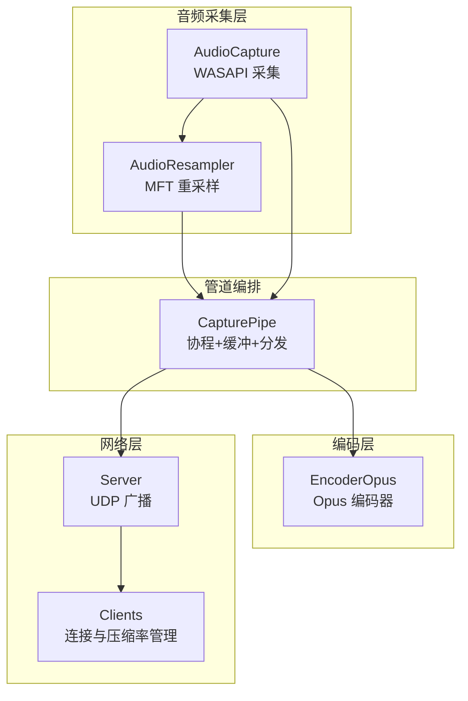
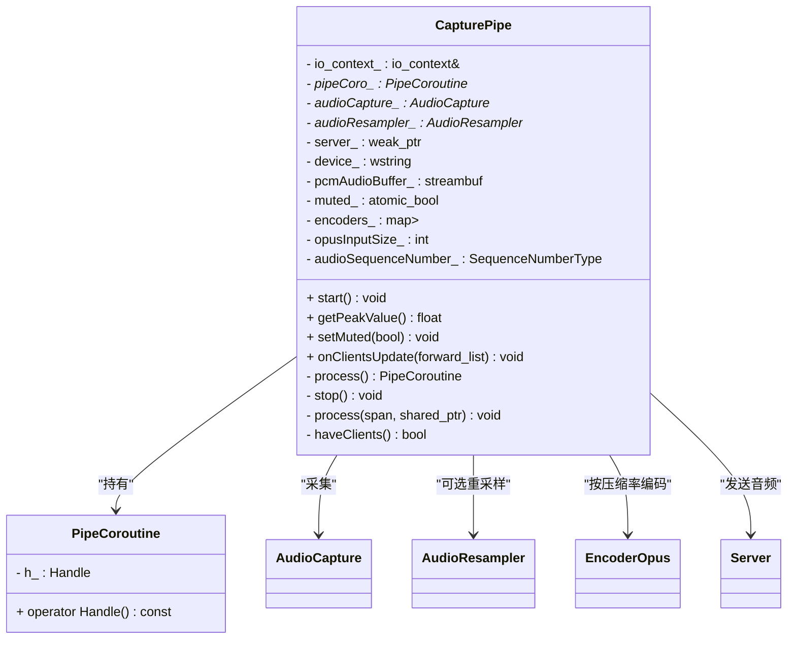
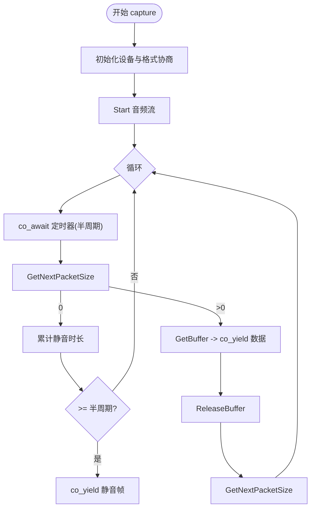
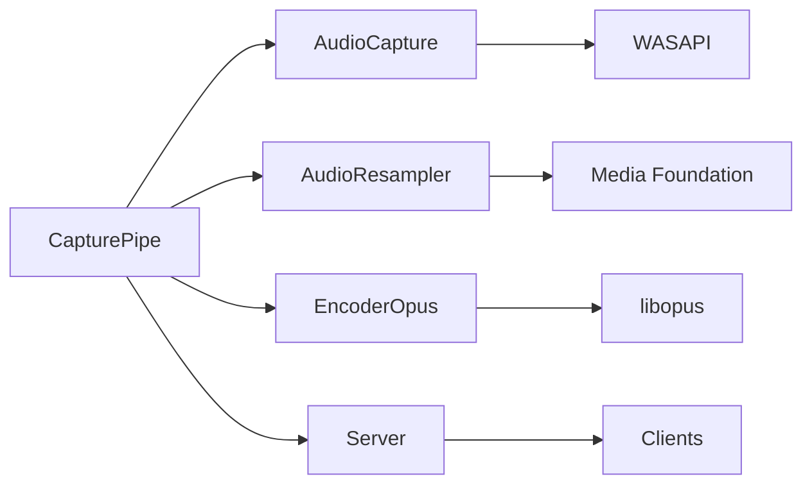

# CapturePipe 音频管道模块

<cite>
**本文引用的文件**
- [CapturePipe.h](file://SoundRemote/CapturePipe.h)
- [CapturePipe.cpp](file://SoundRemote/CapturePipe.cpp)
- [AudioCapture.h](file://SoundRemote/AudioCapture.h)
- [AudioCapture.cpp](file://SoundRemote/AudioCapture.cpp)
- [AudioResampler.h](file://SoundRemote/AudioResampler.h)
- [AudioResampler.cpp](file://SoundRemote/AudioResampler.cpp)
- [EncoderOpus.h](file://SoundRemote/EncoderOpus.h)
- [EncoderOpus.cpp](file://SoundRemote/EncoderOpus.cpp)
- [Server.h](file://SoundRemote/Server.h)
- [Server.cpp](file://SoundRemote/Server.cpp)
- [Clients.h](file://SoundRemote/Clients.h)
- [Clients.cpp](file://SoundRemote/Clients.cpp)
- [NetDefines.h](file://SoundRemote/NetDefines.h)
- [AudioUtil.h](file://SoundRemote/AudioUtil.h)
</cite>

## 目录
1. [简介](#简介)
2. [项目结构](#项目结构)
3. [核心组件](#核心组件)
4. [架构总览](#架构总览)
5. [详细组件分析](#详细组件分析)
6. [依赖关系分析](#依赖关系分析)
7. [性能考量](#性能考量)
8. [故障排除指南](#故障排除指南)
9. [结论](#结论)
10. [附录](#附录)

## 简介
本设计文档聚焦于 SoundRemote 服务端中的 CapturePipe 音频管道模块，系统阐述其整体架构与数据流转过程。重点覆盖：
- 音频采集、重采样、编码与传输的完整流水线
- 协程在异步音频捕获中的应用（包括背压控制）
- 与 AudioCapture、AudioResampler、EncoderOpus、Server 等组件的协作关系
- 音频格式协商、缓冲区管理与性能优化策略
- 异常处理、资源清理与错误恢复机制
- 提供数据流图、协程时序图与性能监控指标建议
- 配置参数调优与常见问题排查方法

## 项目结构
围绕 CapturePipe 的核心代码分布在以下文件中：
- 管道编排与协程调度：CapturePipe.h/.cpp
- 底层音频采集：AudioCapture.h/.cpp
- 重采样：AudioResampler.h/.cpp
- Opus 编码：EncoderOpus.h/.cpp
- 网络发送：Server.h/.cpp
- 客户端状态与压缩率协商：Clients.h/.cpp
- 协议常量与包结构：NetDefines.h
- 通用工具与错误码：AudioUtil.h



图表来源
- [CapturePipe.cpp:97-155](file://SoundRemote/CapturePipe.cpp#L97-L155)
- [AudioCapture.cpp:219-280](file://SoundRemote/AudioCapture.cpp#L219-L280)
- [AudioResampler.cpp:60-133](file://SoundRemote/AudioResampler.cpp#L60-L133)
- [EncoderOpus.cpp:27-38](file://SoundRemote/EncoderOpus.cpp#L27-L38)
- [Server.cpp:48-62](file://SoundRemote/Server.cpp#L48-L62)
- [Clients.cpp:1-49](file://SoundRemote/Clients.cpp#L1-L49)

章节来源
- [CapturePipe.h:23-51](file://SoundRemote/CapturePipe.h#L23-L51)
- [CapturePipe.cpp:40-51](file://SoundRemote/CapturePipe.cpp#L40-L51)
- [AudioCapture.h:22-78](file://SoundRemote/AudioCapture.h#L22-L78)
- [AudioResampler.h:13-23](file://SoundRemote/AudioResampler.h#L13-L23)
- [EncoderOpus.h:9-36](file://SoundRemote/EncoderOpus.h#L9-L36)
- [Server.h:20-60](file://SoundRemote/Server.h#L20-L60)
- [Clients.h:15-59](file://SoundRemote/Clients.h#L15-L59)
- [NetDefines.h:7-69](file://SoundRemote/NetDefines.h#L7-L69)
- [AudioUtil.h:24-169](file://SoundRemote/AudioUtil.h#L24-L169)

## 核心组件
- CapturePipe：管道编排器，负责协程驱动、缓冲聚合、按帧切分、按需编码与多目标分发。
- AudioCapture：基于 WASAPI 的异步音频采集，提供可等待的协程接口，支持静音补偿与峰值测量。
- AudioResampler：基于 Media Foundation Transform 的重采样器，将设备实际格式转换到统一输出格式。
- EncoderOpus：封装 Opus 编码器，按帧编码 PCM 为 Opus 包，并支持 DTX 静默丢弃。
- Server：UDP 网络服务，根据客户端压缩率缓存与广播音频包。
- Clients：维护客户端列表、压缩率与心跳，向监听者推送变更。

章节来源
- [CapturePipe.h:23-51](file://SoundRemote/CapturePipe.h#L23-L51)
- [AudioCapture.h:22-78](file://SoundRemote/AudioCapture.h#L22-L78)
- [AudioResampler.h:13-23](file://SoundRemote/AudioResampler.h#L13-L23)
- [EncoderOpus.h:9-36](file://SoundRemote/EncoderOpus.h#L9-L36)
- [Server.h:20-60](file://SoundRemote/Server.h#L20-L60)
- [Clients.h:15-59](file://SoundRemote/Clients.h#L15-L59)

## 架构总览
CapturePipe 作为“生产者-消费者”协调者，将来自 AudioCapture 的原始 PCM 数据通过可选的 AudioResampler 转换为统一格式，再按固定帧长切分为 opusInputSize_ 大小的块，对每个客户端支持的压缩率进行编码或直接透传，最后由 Server 以 UDP 广播给所有对应客户端。

```mermaid
sequenceDiagram
participant Dev as "音频设备(WASAPI)"
participant AC as "AudioCapture"
participant CP as "CapturePipe"
participant AR as "AudioResampler"
participant ENC as "EncoderOpus"
participant SRV as "Server"
participant CLI as "Clients"
Note over CP,CLI : 初始化阶段
CP->>AC : capture() 获取协程
CP->>CP : 计算 opusInputSize_
CP->>CLI : onClientsUpdate(压缩率集合)
CLI-->>CP : 返回当前压缩率映射
loop 每帧周期
AC-->>CP : co_yield PCM 片段
alt 需要重采样
CP->>AR : resample(pcm)
AR-->>CP : 写入 streambuf
else 无需重采样
CP->>CP : sputn 直接入队
end
while 缓冲区 >= opusInputSize_
for each 压缩率 in encoders_
alt none(不压缩)
CP->>SRV : sendAudio(未压缩, seq, 帧)
else Opus
CP->>ENC : encode(帧)
ENC-->>CP : 编码后包
CP->>SRV : sendAudio(Opus, seq, 包)
end
end
CP->>CP : consume(opusInputSize_)
CP->>CP : ++audioSequenceNumber_
end
end
```

图表来源
- [CapturePipe.cpp:97-155](file://SoundRemote/CapturePipe.cpp#L97-L155)
- [AudioCapture.cpp:219-280](file://SoundRemote/AudioCapture.cpp#L219-L280)
- [AudioResampler.cpp:60-133](file://SoundRemote/AudioResampler.cpp#L60-L133)
- [EncoderOpus.cpp:27-38](file://SoundRemote/EncoderOpus.cpp#L27-L38)
- [Server.cpp:48-62](file://SoundRemote/Server.cpp#L48-L62)
- [Clients.cpp:1-49](file://SoundRemote/Clients.cpp#L1-L49)

## 详细组件分析

### CapturePipe：协程驱动的音频管道
- 职责
  - 启动并持有 PipeCoroutine，循环从 AudioCapture 协程中拉取 PCM 数据
  - 根据是否需重采样选择走 AudioResampler 或直接入队
  - 将累积的 PCM 按 opusInputSize_ 切分，遍历 encoders_ 进行编码或透传
  - 使用全局序列号递增，调用 Server::sendAudio 广播
  - 响应 onClientsUpdate 动态增删不同压缩率的编码器实例
- 关键数据结构
  - pipeCoro_: 自定义协程句柄，用于生命周期管理
  - pcmAudioBuffer_: boost::asio::streambuf 作为环形缓冲
  - encoders_: 按压缩率索引的 EncoderOpus 实例池
  - audioSequenceNumber_: 全局音频包序列号
- 背压与实时性
  - 采用“定时器 + co_await”的节拍驱动，避免忙等
  - 仅在缓冲区达到一帧大小才出队，减少频繁网络发送
  - muted_ 开关可在运行时跳过处理路径，降低 CPU 占用
- 资源与异常
  - stop() 显式销毁协程句柄，析构时确保停止
  - 异常通过上层 Util/AudioUtil 抛出或显示错误信息



图表来源
- [CapturePipe.h:23-51](file://SoundRemote/CapturePipe.h#L23-L51)
- [CapturePipe.cpp:14-36](file://SoundRemote/CapturePipe.cpp#L14-L36)
- [CapturePipe.cpp:97-155](file://SoundRemote/CapturePipe.cpp#L97-L155)

章节来源
- [CapturePipe.h:23-51](file://SoundRemote/CapturePipe.h#L23-L51)
- [CapturePipe.cpp:40-51](file://SoundRemote/CapturePipe.cpp#L40-L51)
- [CapturePipe.cpp:97-155](file://SoundRemote/CapturePipe.cpp#L97-L155)

### AudioCapture：WASAPI 异步采集与静音补偿
- 职责
  - 初始化 COM、枚举设备、激活 IAudioClient/IAudioCaptureClient/IAudioMeterInformation
  - 协商请求格式与实际支持格式，决定是否需要重采样
  - 提供 capture() 协程，周期性读取数据包并 co_yield PCM 片段
  - 实现静音补偿：当 GetNextPacketSize 为 0 时，按半周期长度生成静音帧
- 协程与计时
  - 内部 AwaitableTimer 基于 steady_timer 提供可等待的定时节拍
  - 节拍周期为 bufferDuration_/2，保证稳定产出
- 峰值测量
  - 暴露 getPeakValue() 供 UI 或监控使用



图表来源
- [AudioCapture.cpp:118-214](file://SoundRemote/AudioCapture.cpp#L118-L214)
- [AudioCapture.cpp:219-280](file://SoundRemote/AudioCapture.cpp#L219-L280)

章节来源
- [AudioCapture.h:22-78](file://SoundRemote/AudioCapture.h#L22-L78)
- [AudioCapture.cpp:118-214](file://SoundRemote/AudioCapture.cpp#L118-L214)
- [AudioCapture.cpp:219-280](file://SoundRemote/AudioCapture.cpp#L219-L280)

### AudioResampler：MFT 重采样
- 职责
  - 创建 CResamplerMediaObject，设置输入/输出媒体类型
  - 将输入 PCM 转为 IMFSample 送入 ProcessInput，循环 ProcessOutput 取出结果
  - 将输出字节追加至外部 streambuf，供后续切分
- 质量与容量估算
  - 设置 HalfFilterLength=60 提升音质
  - 输出缓冲倍数 = 2 * outAvgBytesPerSec / inAvgBytesPerSec，避免频繁扩容

章节来源
- [AudioResampler.h:13-23](file://SoundRemote/AudioResampler.h#L13-L23)
- [AudioResampler.cpp:11-51](file://SoundRemote/AudioResampler.cpp#L11-L51)
- [AudioResampler.cpp:60-133](file://SoundRemote/AudioResampler.cpp#L60-L133)

### EncoderOpus：Opus 编码
- 职责
  - 构造时创建 OpusEncoder，设置比特率为客户端压缩率
  - encode 将固定帧长的 PCM 编码为 Opus 包，DTX 时返回 0 表示丢弃
- 帧与输入尺寸
  - frameLength=10ms；getFrameSize 与 getInputSize 用于计算帧样本数与字节数

章节来源
- [EncoderOpus.h:9-36](file://SoundRemote/EncoderOpus.h#L9-L36)
- [EncoderOpus.cpp:10-25](file://SoundRemote/EncoderOpus.cpp#L10-L25)
- [EncoderOpus.cpp:27-38](file://SoundRemote/EncoderOpus.cpp#L27-L38)
- [EncoderOpus.cpp:40-46](file://SoundRemote/EncoderOpus.cpp#L40-L46)

### Server：UDP 广播与客户端缓存
- 职责
  - 维护各压缩率对应的客户端地址列表
  - sendAudio 组装音频包并按压缩率广播
  - 维护心跳与断开通知
- 与 CapturePipe 的交互
  - 接收压缩后的音频包，按类别区分未压缩/Opus 包

章节来源
- [Server.h:20-60](file://SoundRemote/Server.h#L20-L60)
- [Server.cpp:48-62](file://SoundRemote/Server.cpp#L48-L62)

### Clients：连接与压缩率管理
- 职责
  - 维护客户端地址、压缩率与最后接触时间
  - 线程安全地更新并通知监听者（如 CapturePipe）
  - 定期维护超时清理

章节来源
- [Clients.h:15-59](file://SoundRemote/Clients.h#L15-L59)
- [Clients.cpp:1-49](file://SoundRemote/Clients.cpp#L1-L49)

## 依赖关系分析
- CapturePipe 强依赖 AudioCapture、AudioResampler（条件）、EncoderOpus（按压缩率）、Server
- AudioCapture 依赖 WASAPI 与 COM 环境
- AudioResampler 依赖 Media Foundation Transform
- EncoderOpus 依赖 libopus
- Server 依赖 boost::asio UDP 套接字与 Clients 状态



图表来源
- [CapturePipe.cpp:97-155](file://SoundRemote/CapturePipe.cpp#L97-L155)
- [AudioCapture.cpp:219-280](file://SoundRemote/AudioCapture.cpp#L219-L280)
- [AudioResampler.cpp:60-133](file://SoundRemote/AudioResampler.cpp#L60-L133)
- [EncoderOpus.cpp:27-38](file://SoundRemote/EncoderOpus.cpp#L27-L38)
- [Server.cpp:48-62](file://SoundRemote/Server.cpp#L48-L62)

章节来源
- [NetDefines.h:7-69](file://SoundRemote/NetDefines.h#L7-L69)
- [AudioUtil.h:24-169](file://SoundRemote/AudioUtil.h#L24-L169)

## 性能考量
- 帧粒度与缓冲
  - opusInputSize_ 由 48kHz 立体声 10ms 帧推导，确保每次发送一个完整帧，减少网络小包开销
  - streambuf 累积直到满足一帧再消费，降低系统调用频率
- 重采样开销
  - 仅当设备不支持请求格式时才启用 MFT 重采样；否则直通入队
  - 输出缓冲倍数预分配，减少内存抖动
- 编码并行度
  - 单线程顺序编码，但可通过多压缩率并行编码提升吞吐（见“扩展建议”）
- 静音补偿
  - 半周期静音帧维持播放连续性，避免卡顿
- 网络发送
  - 按压缩率分组广播，避免重复打包
- 监控指标建议
  - 平均/最大延迟：从 co_yield 到 sendAudio 的时间差
  - 丢帧率：pcmAudioBuffer_.data().size() 长期不足一帧的比例
  - 编码耗时：encode 调用耗时分布
  - 网络吞吐：各压缩率下的平均包大小与发送速率
  - 峰值电平：getPeakValue() 统计分布

[本节为通用指导，不直接分析具体文件]

## 故障排除指南
- 无声音或断续
  - 检查设备是否支持请求格式；若需重采样，确认 AudioResampler 初始化成功
  - 观察静音补偿逻辑是否触发过多静音帧
- 高 CPU 占用
  - 确认 muted_ 已开启且无客户端；检查 encoders_ 数量是否过大
  - 评估是否同时存在多种高码率压缩率导致多次编码
- 网络卡顿或带宽过高
  - 调整客户端压缩率（kbps），减少不必要的未压缩通道
  - 检查是否有大量客户端导致广播放大
- 崩溃或异常
  - 关注 AudioUtil 的错误位置枚举，定位 WASAPI/MFT/Opus 失败点
  - 确认 COM 初始化与释放路径正常

章节来源
- [AudioUtil.h:48-116](file://SoundRemote/AudioUtil.h#L48-L116)
- [AudioCapture.cpp:118-214](file://SoundRemote/AudioCapture.cpp#L118-L214)
- [AudioResampler.cpp:11-51](file://SoundRemote/AudioResampler.cpp#L11-L51)
- [EncoderOpus.cpp:10-25](file://SoundRemote/EncoderOpus.cpp#L10-L25)

## 结论
CapturePipe 通过协程驱动的节拍化采集、按需重采样、固定帧切分与多压缩率编码，实现了低延迟、可扩展的音频管道。结合 Server 的 UDP 广播与 Clients 的连接管理，形成端到端的实时音频传输链路。通过合理的帧大小、缓冲策略与监控指标，可在不同硬件与网络环境下取得良好平衡。

[本节为总结性内容，不直接分析具体文件]

## 附录

### 音频数据流图（概念）


[此图为概念示意，不对应具体源码结构]

### 协程调用时序图（代码级）
```mermaid
sequenceDiagram
participant CP as "CapturePipe : : process"
participant AC as "AudioCapture : : capture"
participant AR as "AudioResampler : : resample"
participant ENC as "EncoderOpus : : encode"
participant SRV as "Server : : sendAudio"
CP->>AC : capture() 获取协程
loop 每帧
AC-->>CP : co_yield PCM
alt 需要重采样
CP->>AR : resample(pcm)
AR-->>CP : 写入 streambuf
else 直通
CP->>CP : sputn 入队
end
while 缓冲区>=帧大小
for each 压缩率
alt none
CP->>SRV : sendAudio(未压缩)
else Opus
CP->>ENC : encode(帧)
ENC-->>CP : 包
CP->>SRV : sendAudio(Opus)
end
end
CP->>CP : consume(帧大小)
end
end
```

图表来源
- [CapturePipe.cpp:97-155](file://SoundRemote/CapturePipe.cpp#L97-L155)
- [AudioCapture.cpp:219-280](file://SoundRemote/AudioCapture.cpp#L219-L280)
- [AudioResampler.cpp:60-133](file://SoundRemote/AudioResampler.cpp#L60-L133)
- [EncoderOpus.cpp:27-38](file://SoundRemote/EncoderOpus.cpp#L27-L38)
- [Server.cpp:48-62](file://SoundRemote/Server.cpp#L48-L62)

### 配置参数调优指南
- 帧长与采样率
  - 默认 48kHz、10ms 帧；如需更低延迟可考虑更短帧（需权衡 CPU 与网络开销）
- 压缩率
  - 根据网络状况与音质需求选择 kbps_64 ~ kbps_320；尽量只保留必要的压缩率集合
- 静音补偿阈值
  - 半周期静音策略已在实现中；若出现明显停顿，可检查设备驱动与共享模式缓冲
- 重采样质量
  - HalfFilterLength=60 为高质量；若 CPU 紧张可适当降低（需修改重采样器）
- 网络端口与协议版本
  - 参考 NetDefines 中的默认端口与协议版本，确保与服务端一致

章节来源
- [AudioUtil.h:29-39](file://SoundRemote/AudioUtil.h#L29-L39)
- [NetDefines.h:60-69](file://SoundRemote/NetDefines.h#L60-L69)
- [AudioResampler.cpp:20-25](file://SoundRemote/AudioResampler.cpp#L20-L25)

### 错误与异常处理要点
- 统一错误位置枚举便于定位
- 关键 API 失败均通过 throwOnError/processError 上报
- 资源释放遵循 RAII（CoUninitializer、unique_ptr、CComPtr）

章节来源
- [AudioUtil.h:48-116](file://SoundRemote/AudioUtil.h#L48-L116)
- [AudioCapture.cpp:118-214](file://SoundRemote/AudioCapture.cpp#L118-L214)
- [AudioResampler.cpp:11-51](file://SoundRemote/AudioResampler.cpp#L11-L51)
- [EncoderOpus.cpp:10-25](file://SoundRemote/EncoderOpus.cpp#L10-L25)