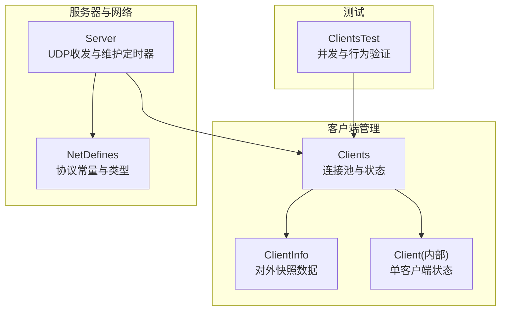
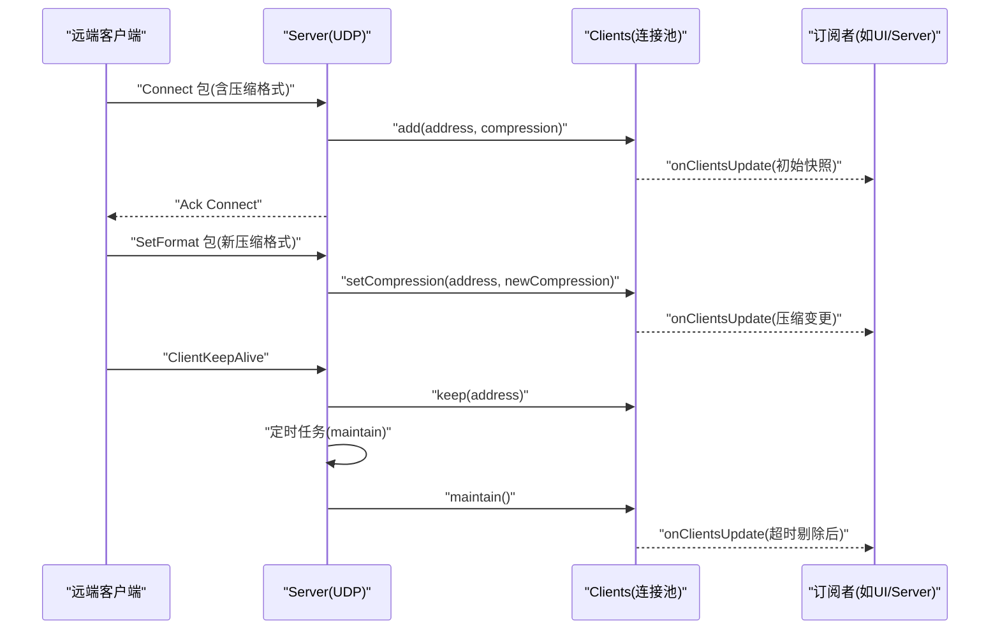
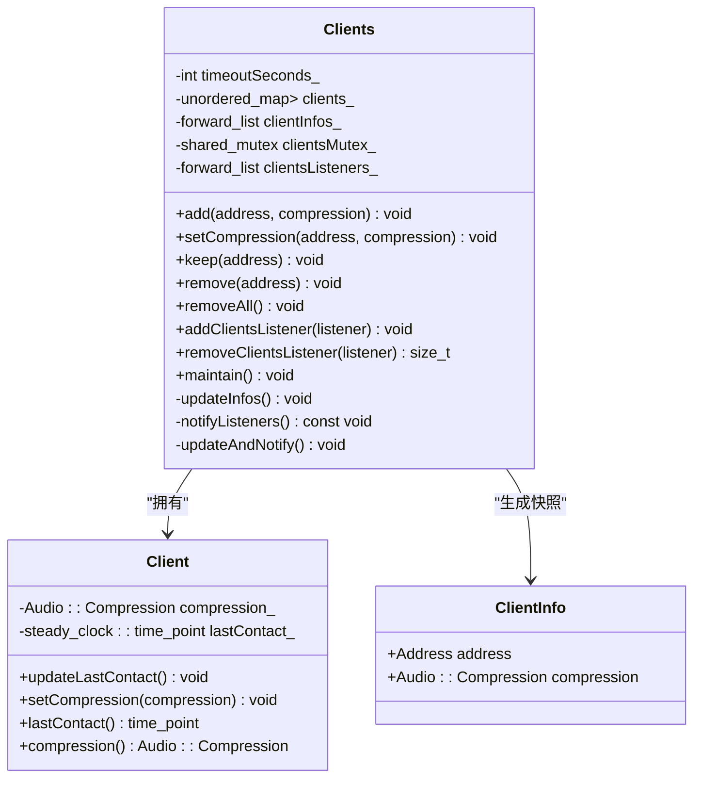
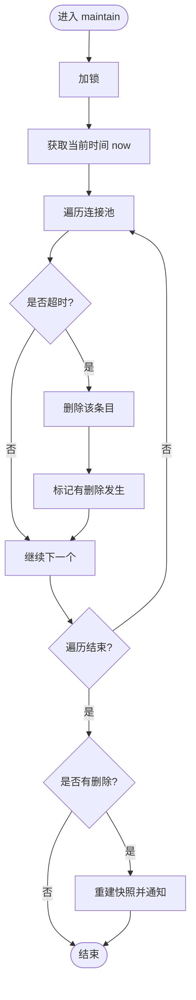
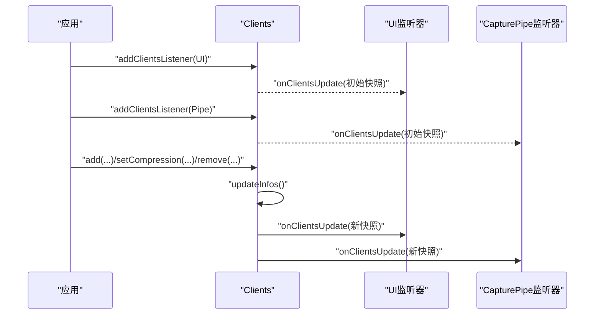
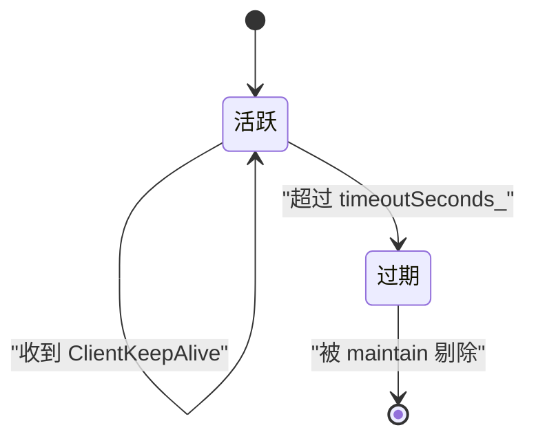
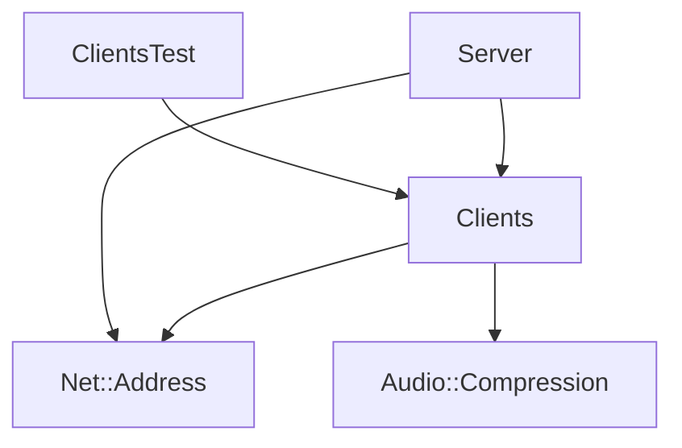

# Clients 客户端管理模块

<cite>
**本文引用的文件**   
- [Clients.h](file://SoundRemote/Clients.h)
- [Clients.cpp](file://SoundRemote/Clients.cpp)
- [Server.h](file://SoundRemote/Server.h)
- [Server.cpp](file://SoundRemote/Server.cpp)
- [NetDefines.h](file://SoundRemote/NetDefines.h)
- [ClientsTest.cpp](file://Tests/ClientsTest.cpp)
</cite>

## 目录
1. [简介](#简介)
2. [项目结构](#项目结构)
3. [核心组件](#核心组件)
4. [架构总览](#架构总览)
5. [详细组件分析](#详细组件分析)
6. [依赖关系分析](#依赖关系分析)
7. [性能与并发特性](#性能与并发特性)
8. [故障排查指南](#故障排查指南)
9. [结论](#结论)
10. [附录：使用示例与最佳实践](#附录使用示例与最佳实践)

## 简介
本设计文档聚焦于“Clients 客户端管理模块”，系统性阐述其连接池管理机制、数据结构设计、状态维护与生命周期、多客户端并发访问策略、线程安全与同步原语、注册/注销/状态更新的核心算法、缓存机制与地址映射表、连接超时处理，以及观察者模式在状态通知中的应用。文档同时提供关键流程图、状态转换图与内存管理策略说明，并给出使用示例与最佳实践建议。

## 项目结构
该模块位于 SoundRemote 工程中，主要实现文件为 Clients.h 与 Clients.cpp；与网络层和服务器调度相关的交互由 Server.cpp 驱动，协议常量定义在 NetDefines.h。测试用例集中于 Tests/ClientsTest.cpp，覆盖并发场景下的注册、压缩格式变更与移除等路径。

图表来源
- [Clients.h:15-52](file://SoundRemote/Clients.h#L15-L52)
- [Clients.cpp:1-125](file://SoundRemote/Clients.cpp#L1-L125)
- [Server.h:17-61](file://SoundRemote/Server.h#L17-L61)
- [Server.cpp:1-210](file://SoundRemote/Server.cpp#L1-L210)
- [NetDefines.h:1-69](file://SoundRemote/NetDefines.h#L1-L69)
- [ClientsTest.cpp:1-133](file://Tests/ClientsTest.cpp#L1-L133)

章节来源
- [Clients.h:15-52](file://SoundRemote/Clients.h#L15-L52)
- [Clients.cpp:1-125](file://SoundRemote/Clients.cpp#L1-L125)
- [Server.h:17-61](file://SoundRemote/Server.h#L17-L61)
- [Server.cpp:1-210](file://SoundRemote/Server.cpp#L1-L210)
- [NetDefines.h:1-69](file://SoundRemote/NetDefines.h#L1-L69)
- [ClientsTest.cpp:1-133](file://Tests/ClientsTest.cpp#L1-L133)

## 核心组件
- Clients：对外暴露的客户端连接池管理器，负责增删改查、保活、维护清理、监听器注册与通知。
- Client（内部）：封装单个客户端的最近联系时间与音频压缩配置。
- ClientInfo：对外发布的客户端信息快照（地址+压缩格式），用于观察者回调。
- Server：基于 UDP 的服务器端，负责解析协议包、调用 Clients 接口、维护定时任务与广播发送。
- NetDefines：协议头字段、类别枚举、默认端口等常量与类型定义。

章节来源
- [Clients.h:15-52](file://SoundRemote/Clients.h#L15-L52)
- [Clients.cpp:100-125](file://SoundRemote/Clients.cpp#L100-L125)
- [Server.h:17-61](file://SoundRemote/Server.h#L17-L61)
- [NetDefines.h:1-69](file://SoundRemote/NetDefines.h#L1-L69)

## 架构总览
从系统层面看，Server 作为 UDP 接收与发送中心，将收到的 Connect/SetFormat/KeepAlive 等事件转换为对 Clients 的管理操作；Clients 维护一个以地址为键的连接池，并在状态变化时通过观察者模式向订阅者（如 UI、捕获管道、Server 自身）推送最新列表。Server 还维护一份按压缩格式分组的地址缓存，用于高效广播音频数据与心跳。

图表来源
- [Server.cpp:127-166](file://SoundRemote/Server.cpp#L127-L166)
- [Server.cpp:187-199](file://SoundRemote/Server.cpp#L187-L199)
- [Clients.cpp:5-27](file://SoundRemote/Clients.cpp#L5-L27)
- [Clients.cpp:29-35](file://SoundRemote/Clients.cpp#L29-L35)
- [Clients.cpp:64-80](file://SoundRemote/Clients.cpp#L64-L80)

## 详细组件分析

### 数据结构与内存模型
- 连接池：以 Net::Address 为键，值为 std::unique_ptr<Client> 的无序映射。每个 Client 持有当前压缩格式与最近联系时间。
- 对外快照：std::forward_list<ClientInfo>，每次状态变更后重建，供观察者消费。
- 监听器列表：std::forward_list<ClientsUpdateCallback>，采用前插方式添加，注册时立即推送一次当前快照。
- 线程同步：使用 std::shared_mutex 保护连接池与快照的读写。

图表来源
- [Clients.h:15-52](file://SoundRemote/Clients.h#L15-L52)
- [Clients.cpp:100-125](file://SoundRemote/Clients.cpp#L100-L125)

章节来源
- [Clients.h:15-52](file://SoundRemote/Clients.h#L15-L52)
- [Clients.cpp:100-125](file://SoundRemote/Clients.cpp#L100-L125)

### 连接池管理与生命周期
- 注册 add：若地址已存在则更新最近联系时间，仅在压缩格式变化时触发通知；否则新建 Client 并通知。
- 设置压缩 setCompression：仅当地址存在且压缩格式不同才更新并通知。
- 保活 keep：命中则更新时间戳，不触发通知。
- 注销 remove/removeAll：删除条目后触发通知。
- 维护 maintain：周期性扫描，超过 timeoutSeconds_ 的条目被剔除，若有删除则触发通知。

图表来源
- [Clients.cpp:64-80](file://SoundRemote/Clients.cpp#L64-L80)
- [Clients.cpp:82-98](file://SoundRemote/Clients.cpp#L82-L98)

章节来源
- [Clients.cpp:5-18](file://SoundRemote/Clients.cpp#L5-L18)
- [Clients.cpp:20-27](file://SoundRemote/Clients.cpp#L20-L27)
- [Clients.cpp:29-35](file://SoundRemote/Clients.cpp#L29-L35)
- [Clients.cpp:37-51](file://SoundRemote/Clients.cpp#L37-L51)
- [Clients.cpp:64-80](file://SoundRemote/Clients.cpp#L64-L80)

### 多客户端并发访问与线程安全
- 互斥策略：所有修改连接池或快照的方法均使用 std::unique_lock 锁定 shared_mutex，确保原子性。
- 读多写少：由于 snapshot 在写入时重建，读取方（观察者）获得的是不可变快照，避免额外锁竞争。
- 监听器列表：注释表明监听器列表在程序启动和设备变更时修改，不在热路径中频繁变更，因此未加锁。但需注意在极端情况下，若在监听器列表中插入/删除的同时进行 notify，可能产生迭代器失效风险。当前实现中 notify 发生在持有主锁期间，而监听器列表的修改发生在外部（非热路径），需遵循“先注册再使用”的约定。

章节来源
- [Clients.h:46-52](file://SoundRemote/Clients.h#L46-L52)
- [Clients.cpp:5-18](file://SoundRemote/Clients.cpp#L5-L18)
- [Clients.cpp:53-62](file://SoundRemote/Clients.cpp#L53-L62)

### 观察者模式与状态通知
- 注册：addClientsListener 将回调加入列表，并立即推送一次当前快照，便于订阅者快速初始化。
- 通知：任何导致连接池变化的操作都会调用 updateAndNotify，即重建快照并逐个调用监听器。
- 取消：removeClientsListener 根据函数对象类型名匹配移除对应监听器。

图表来源
- [Clients.cpp:53-62](file://SoundRemote/Clients.cpp#L53-L62)
- [Clients.cpp:82-98](file://SoundRemote/Clients.cpp#L82-L98)

章节来源
- [Clients.cpp:53-62](file://SoundRemote/Clients.cpp#L53-L62)
- [Clients.cpp:82-98](file://SoundRemote/Clients.cpp#L82-L98)

### 地址映射表与缓存机制
- 连接池索引：以 Net::Address 为键，O(1) 平均查找复杂度，适合高频 keep/add/remove。
- 广播缓存：Server 内部维护 unordered_map<Audio::Compression, forward_list<Net::Address>>，按压缩格式分组，用于 sendAudio 与 keepalive 的高效广播。
- 缓存更新：Server 订阅 Clients 的 onClientsUpdate，收到新快照后重建压缩到地址的映射表。

图表来源
- [Server.cpp:37-46](file://SoundRemote/Server.cpp#L37-L46)
- [Server.cpp:48-62](file://SoundRemote/Server.cpp#L48-L62)
- [Server.cpp:201-209](file://SoundRemote/Server.cpp#L201-L209)

章节来源
- [Server.cpp:37-46](file://SoundRemote/Server.cpp#L37-L46)
- [Server.cpp:48-62](file://SoundRemote/Server.cpp#L48-L62)
- [Server.cpp:201-209](file://SoundRemote/Server.cpp#L201-L209)

### 连接超时与心跳机制
- 客户端侧：Server 周期性发送 KeepAlive 包给所有已知客户端，客户端收到后回发 ClientKeepAlive。
- 服务端侧：收到 ClientKeepAlive 时调用 clients_->keep(address) 刷新最近联系时间；定时任务 maintain 会剔除超过阈值的条目。
- 阈值：timeoutSeconds_ 构造时传入，默认 5 秒。

图表来源
- [Server.cpp:164-166](file://SoundRemote/Server.cpp#L164-L166)
- [Clients.cpp:29-35](file://SoundRemote/Clients.cpp#L29-L35)
- [Clients.cpp:64-80](file://SoundRemote/Clients.cpp#L64-L80)

章节来源
- [Server.cpp:164-166](file://SoundRemote/Server.cpp#L164-L166)
- [Clients.cpp:29-35](file://SoundRemote/Clients.cpp#L29-L35)
- [Clients.cpp:64-80](file://SoundRemote/Clients.cpp#L64-L80)

### 核心算法要点
- 去重与最小化通知：add 在已有地址且压缩不变时直接返回，避免重复通知。
- 增量更新：setCompression 仅在值变化时更新并通知。
- 惰性清理：maintain 一次性扫描并批量删除超时项，减少多次通知开销。
- 快照一致性：updateInfos 在持有锁的情况下重建快照，保证观察者看到一致视图。

章节来源
- [Clients.cpp:5-18](file://SoundRemote/Clients.cpp#L5-L18)
- [Clients.cpp:20-27](file://SoundRemote/Clients.cpp#L20-L27)
- [Clients.cpp:64-80](file://SoundRemote/Clients.cpp#L64-L80)
- [Clients.cpp:82-98](file://SoundRemote/Clients.cpp#L82-L98)

## 依赖关系分析
- 模块内依赖：Clients 依赖 Net::Address 与 Audio::Compression；Client 内部仅依赖 chrono 与压缩类型。
- 跨模块依赖：Server 依赖 Clients 并通过 onClientsUpdate 同步本地缓存；NetDefines 提供协议常量与类型。
- 测试依赖：ClientsTest 通过多线程 barrier 验证并发安全性与通知次数。

图表来源
- [Clients.h:1-12](file://SoundRemote/Clients.h#L1-L12)
- [Server.h:17-61](file://SoundRemote/Server.h#L17-L61)
- [NetDefines.h:1-69](file://SoundRemote/NetDefines.h#L1-L69)
- [ClientsTest.cpp:1-133](file://Tests/ClientsTest.cpp#L1-L133)

章节来源
- [Clients.h:1-12](file://SoundRemote/Clients.h#L1-L12)
- [Server.h:17-61](file://SoundRemote/Server.h#L17-L61)
- [NetDefines.h:1-69](file://SoundRemote/NetDefines.h#L1-L69)
- [ClientsTest.cpp:1-133](file://Tests/ClientsTest.cpp#L1-L133)

## 性能与并发特性
- 时间复杂度
  - add/remove/keep/setCompression：哈希表操作 O(1) 平均；通知阶段重建快照 O(N)。
  - maintain：线性扫描 O(N)，N 为当前连接数。
- 空间复杂度
  - 连接池 O(N)，快照 O(N)，监听器列表 O(L)。
- 并发特性
  - 写路径加锁，读路径（观察者）无锁，降低竞争。
  - 监听器列表未加锁，需在应用启动期完成注册，避免热路径修改。
- 优化建议
  - 若 N 较大，可考虑延迟通知或批处理通知，减少快照重建频率。
  - 监听器列表可引入读写锁或版本戳，提升并发安全性。

[本节为通用性能讨论，无需特定文件引用]

## 故障排查指南
- 现象：客户端频繁掉线
  - 检查 Server 的定时任务是否正常触发 maintain。
  - 确认客户端是否持续发送 ClientKeepAlive，服务端是否正确调用 keep。
  - 调整 timeoutSeconds_ 以适应网络抖动。
- 现象：观察者未收到更新
  - 确认是否在正确时机注册监听器。
  - 检查是否存在重复注册或误删监听器的情况。
- 现象：崩溃或异常
  - 关注 receive 与 handleSend 的错误分支，确保错误码处理符合预期。
  - 检查监听器回调中是否抛出异常，避免传播至核心路径。

章节来源
- [Server.cpp:187-199](file://SoundRemote/Server.cpp#L187-L199)
- [Server.cpp:164-166](file://SoundRemote/Server.cpp#L164-L166)
- [Server.cpp:176-180](file://SoundRemote/Server.cpp#L176-L180)

## 结论
Clients 模块以简洁的数据结构与严格的锁粒度实现了高并发安全的客户端连接池管理。通过快照式观察者通知与按压缩格式的地址缓存，系统在保持低耦合的同时提供了高效的广播能力。结合心跳与超时清理，整体具备良好健壮性与可扩展性。建议在大规模客户端场景下进一步优化通知批量化与监听器并发安全。

[本节为总结性内容，无需特定文件引用]

## 附录：使用示例与最佳实践

- 基本用法
  - 创建 Clients 实例并注册监听器，随后在收到 Connect/SetFormat/KeepAlive 时调用相应接口。
  - 参考路径：[Clients.cpp:5-18](file://SoundRemote/Clients.cpp#L5-L18)、[Clients.cpp:20-27](file://SoundRemote/Clients.cpp#L20-L27)、[Clients.cpp:29-35](file://SoundRemote/Clients.cpp#L29-L35)
- 并发安全
  - 多线程环境下，add/remove/setCompression 均可安全调用；监听器列表应在启动阶段注册完毕。
  - 参考路径：[ClientsTest.cpp:48-69](file://Tests/ClientsTest.cpp#L48-L69)、[ClientsTest.cpp:71-105](file://Tests/ClientsTest.cpp#L71-L105)、[ClientsTest.cpp:107-133](file://Tests/ClientsTest.cpp#L107-L133)
- 超时与心跳
  - 合理设置 timeoutSeconds_，并确保服务端定时任务与客户端心跳配合。
  - 参考路径：[Clients.cpp:64-80](file://SoundRemote/Clients.cpp#L64-L80)、[Server.cpp:187-199](file://SoundRemote/Server.cpp#L187-L199)
- 广播优化
  - 利用 Server 的压缩->地址缓存进行定向广播，避免全量遍历。
  - 参考路径：[Server.cpp:48-62](file://SoundRemote/Server.cpp#L48-L62)、[Server.cpp:201-209](file://SoundRemote/Server.cpp#L201-L209)

章节来源
- [Clients.cpp:5-18](file://SoundRemote/Clients.cpp#L5-L18)
- [Clients.cpp:20-27](file://SoundRemote/Clients.cpp#L20-L27)
- [Clients.cpp:29-35](file://SoundRemote/Clients.cpp#L29-L35)
- [Clients.cpp:64-80](file://SoundRemote/Clients.cpp#L64-L80)
- [Server.cpp:48-62](file://SoundRemote/Server.cpp#L48-L62)
- [Server.cpp:187-199](file://SoundRemote/Server.cpp#L187-L199)
- [Server.cpp:201-209](file://SoundRemote/Server.cpp#L201-L209)
- [ClientsTest.cpp:48-69](file://Tests/ClientsTest.cpp#L48-L69)
- [ClientsTest.cpp:71-105](file://Tests/ClientsTest.cpp#L71-L105)
- [ClientsTest.cpp:107-133](file://Tests/ClientsTest.cpp#L107-L133)