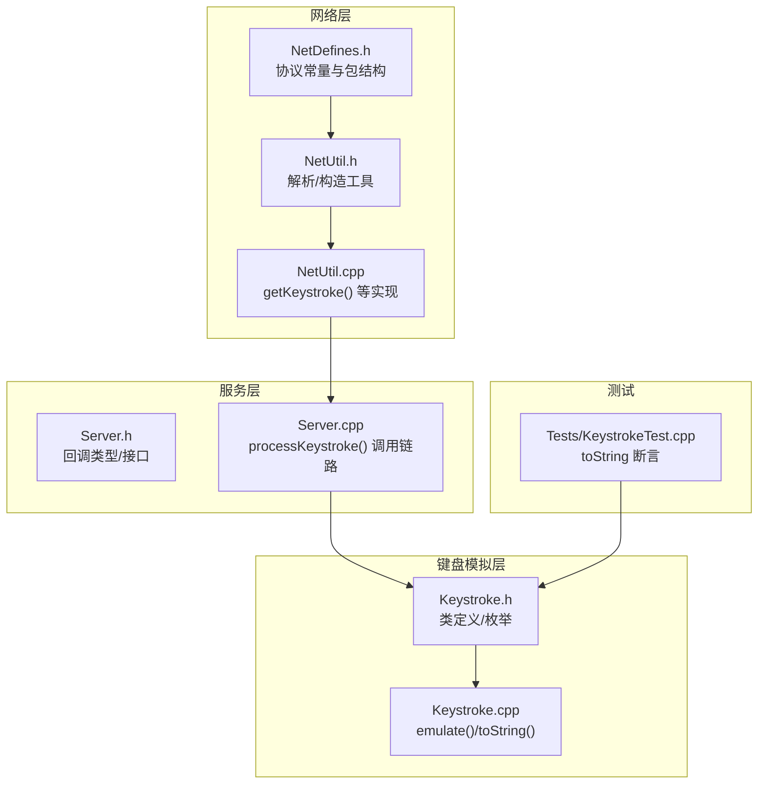
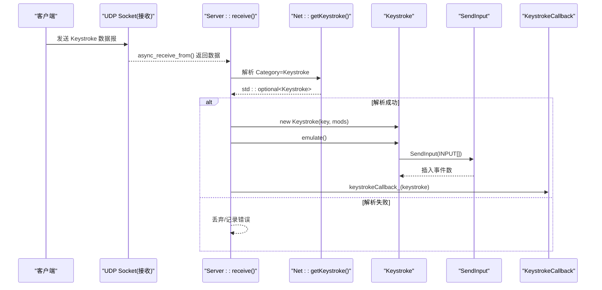
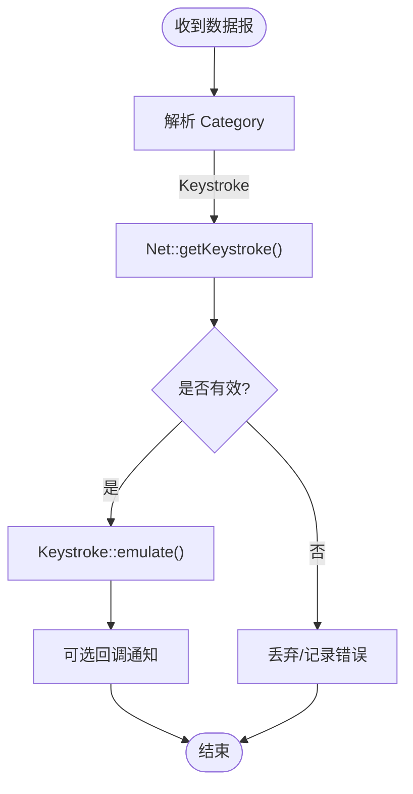
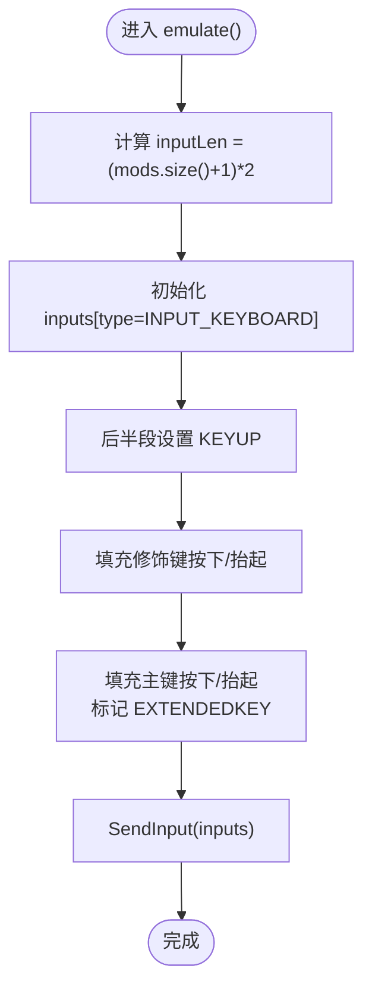
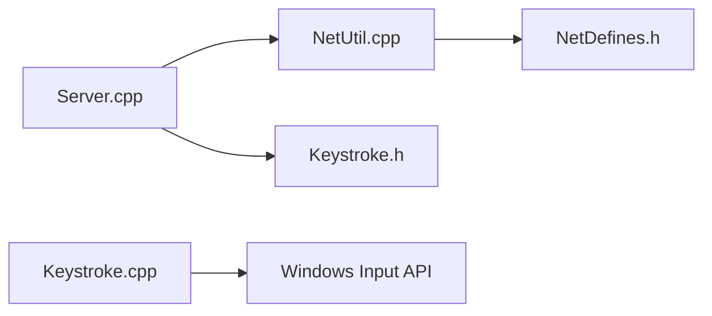

# Keystroke 键盘模拟模块

<cite>
**本文引用的文件**   
- [SoundRemote/Keystroke.h](file://SoundRemote/Keystroke.h)
- [SoundRemote/Keystroke.cpp](file://SoundRemote/Keystroke.cpp)
- [SoundRemote/NetDefines.h](file://SoundRemote/NetDefines.h)
- [SoundRemote/NetUtil.h](file://SoundRemote/NetUtil.h)
- [SoundRemote/NetUtil.cpp](file://SoundRemote/NetUtil.cpp)
- [SoundRemote/Server.h](file://SoundRemote/Server.h)
- [SoundRemote/Server.cpp](file://SoundRemote/Server.cpp)
- [Tests/KeystrokeTest.cpp](file://Tests/KeystrokeTest.cpp)
</cite>

## 目录
1. [简介](#简介)
2. [项目结构](#项目结构)
3. [核心组件](#核心组件)
4. [架构总览](#架构总览)
5. [详细组件分析](#详细组件分析)
6. [依赖关系分析](#依赖关系分析)
7. [性能考虑](#性能考虑)
8. [故障排查指南](#故障排查指南)
9. [结论](#结论)
10. [附录](#附录)

## 简介
本设计文档聚焦于 SoundRemote-WinServer 中的 Keystroke 键盘模拟模块，系统性阐述 Windows 键盘事件注入的实现原理与技术细节。重点包括：
- SendInput API 的使用方法与 INPUT 数组构造策略
- 虚拟键码（VK）与修饰键映射机制
- 修饰键组合处理、按键状态跟踪与事件序列生成
- 异步网络接收模型下的线程安全考量
- 安全性限制与防恶意注入建议
- 快捷键映射配置系统与自定义键位绑定的扩展思路
- 流程图、时序图、虚拟键码对照表与测试调试方法

## 项目结构
Keystroke 模块位于服务端侧，负责将客户端通过网络发送的键盘事件转换为本地 Windows 键盘输入。其关键文件组织如下：
- 接口与实现：Keystroke.h / Keystroke.cpp
- 网络协议定义：NetDefines.h
- 网络工具函数：NetUtil.h / NetUtil.cpp
- 服务器主循环与回调分发：Server.h / Server.cpp
- 单元测试：Tests/KeystrokeTest.cpp



图表来源
- [SoundRemote/NetDefines.h:1-69](file://SoundRemote/NetDefines.h#L1-L69)
- [SoundRemote/NetUtil.h:1-41](file://SoundRemote/NetUtil.h#L1-L41)
- [SoundRemote/NetUtil.cpp:176-217](file://SoundRemote/NetUtil.cpp#L176-L217)
- [SoundRemote/Server.h:1-60](file://SoundRemote/Server.h#L1-L60)
- [SoundRemote/Server.cpp:155-162](file://SoundRemote/Server.cpp#L155-L162)
- [SoundRemote/Keystroke.h:1-41](file://SoundRemote/Keystroke.h#L1-L41)
- [SoundRemote/Keystroke.cpp:1-153](file://SoundRemote/Keystroke.cpp#L1-L153)
- [Tests/KeystrokeTest.cpp:1-32](file://Tests/KeystrokeTest.cpp#L1-L32)

章节来源
- [SoundRemote/NetDefines.h:1-69](file://SoundRemote/NetDefines.h#L1-L69)
- [SoundRemote/NetUtil.h:1-41](file://SoundRemote/NetUtil.h#L1-L41)
- [SoundRemote/NetUtil.cpp:176-217](file://SoundRemote/NetUtil.cpp#L176-L217)
- [SoundRemote/Server.h:1-60](file://SoundRemote/Server.h#L1-L60)
- [SoundRemote/Server.cpp:155-162](file://SoundRemote/Server.cpp#L155-L162)
- [SoundRemote/Keystroke.h:1-41](file://SoundRemote/Keystroke.h#L1-L41)
- [SoundRemote/Keystroke.cpp:1-153](file://SoundRemote/Keystroke.cpp#L1-L153)
- [Tests/KeystrokeTest.cpp:1-32](file://Tests/KeystrokeTest.cpp#L1-L32)

## 核心组件
- Keystroke 类
  - 职责：封装一次“按键+修饰键”的组合，提供 emulate() 执行本地注入，toString() 用于日志显示。
  - 关键成员：
    - key_：目标虚拟键码（VK）
    - mods_：修饰键集合（Win/Ctrl/Shift/Alt），内部以 ModKeyVk 枚举值存储
  - 关键方法：
    - emulate()：构造 INPUT 数组并调用 SendInput 完成键入
    - toString()：拼接修饰键与键名文本，便于 UI 展示或日志记录
    - getVkCodeDescription()：将 VK 转为可读名称，支持浏览器/媒体/系统功能键

- 网络协议与工具
  - NetDefines.h：定义 Keystroke 数据包大小、字段类型、类别常量等
  - NetUtil.cpp：getKeystroke() 从原始字节流中解析出 Keystroke 对象

- 服务器集成
  - Server.cpp：在收到 Keystroke 类别的数据报后，解析为 Keystroke 并调用 emulate()，随后触发可选回调

章节来源
- [SoundRemote/Keystroke.h:1-41](file://SoundRemote/Keystroke.h#L1-L41)
- [SoundRemote/Keystroke.cpp:1-153](file://SoundRemote/Keystroke.cpp#L1-L153)
- [SoundRemote/NetDefines.h:1-69](file://SoundRemote/NetDefines.h#L1-L69)
- [SoundRemote/NetUtil.cpp:176-217](file://SoundRemote/NetUtil.cpp#L176-L217)
- [SoundRemote/Server.cpp:155-162](file://SoundRemote/Server.cpp#L155-L162)

## 架构总览
下图展示了从网络接收到本地键盘注入的完整流程，以及可插拔的回调机制。



图表来源
- [SoundRemote/Server.cpp:80-102](file://SoundRemote/Server.cpp#L80-L102)
- [SoundRemote/NetUtil.cpp:182-191](file://SoundRemote/NetUtil.cpp#L182-L191)
- [SoundRemote/Keystroke.cpp:20-52](file://SoundRemote/Keystroke.cpp#L20-L52)
- [SoundRemote/Server.h:22-22](file://SoundRemote/Server.h#L22-L22)

## 详细组件分析

### Keystroke 类设计与实现
- 修饰键表示
  - ModKey：逻辑修饰键位掩码（Win/Ctrl/Shift/Alt）
  - ModKeyVk：对应的 Windows 虚拟键码（0x5B/0x11/0x10/0x12）
- 构造函数
  - 根据传入的 mods 位域，将对应 ModKeyVk 加入 mods_ 集合
- emulate() 事件序列生成
  - 计算 inputs 数量 = (修饰键个数 + 1) * 2
  - 前半段为 KEYDOWN，后半段为 KEYUP
  - 修饰键按顺序先按下再释放；中间一对为主键按下/抬起
  - 主键使用 KEYEVENTF_EXTENDEDKEY 标记，确保扩展键语义正确
  - 调用 SendInput 一次性提交所有事件
- toString() 与 getVkCodeDescription()
  - 将修饰键与主键名用 “ + ” 连接
  - 对常见特殊键（浏览器、媒体、系统）直接返回友好名称
  - 其他键通过 MapVirtualKeyW + GetKeyNameTextW 获取本地化键名

```mermaid
classDiagram
class Keystroke {
- int key_
- unordered_set~ModKeyVk~ mods_
+ Keystroke(int key, int mods)
+ void emulate() const
+ wstring toString() const
- wstring getVkCodeDescription(int vkCode) const
}
enum ModKey {
Win
Ctrl
Shift
Alt
}
enum ModKeyVk {
Win = 0x5B
Ctrl = 0x11
Shift = 0x10
Alt = 0x12
}
Keystroke --> ModKeyVk : "使用"
```

图表来源
- [SoundRemote/Keystroke.h:6-40](file://SoundRemote/Keystroke.h#L6-L40)
- [SoundRemote/Keystroke.cpp:7-18](file://SoundRemote/Keystroke.cpp#L7-L18)
- [SoundRemote/Keystroke.cpp:54-77](file://SoundRemote/Keystroke.cpp#L54-L77)
- [SoundRemote/Keystroke.cpp:79-152](file://SoundRemote/Keystroke.cpp#L79-L152)

章节来源
- [SoundRemote/Keystroke.h:1-41](file://SoundRemote/Keystroke.h#L1-L41)
- [SoundRemote/Keystroke.cpp:1-153](file://SoundRemote/Keystroke.cpp#L1-L153)

### 网络解析与服务器集成
- 协议字段
  - Keystroke 数据包包含 KeyType 与 ModsType 两个字节
  - 类别 Category 为 Keystroke
- 解析流程
  - Net::getKeystroke() 校验长度后读取 key 与 mods，构造 Keystroke
- 服务器处理
  - receive() 中根据 Category 路由到 processKeystroke()
  - processKeystroke() 调用 Net::getKeystroke()，成功后执行 emulate() 并触发回调



图表来源
- [SoundRemote/NetDefines.h:47-58](file://SoundRemote/NetDefines.h#L47-L58)
- [SoundRemote/NetUtil.cpp:182-191](file://SoundRemote/NetUtil.cpp#L182-L191)
- [SoundRemote/Server.cpp:155-162](file://SoundRemote/Server.cpp#L155-L162)

章节来源
- [SoundRemote/NetDefines.h:1-69](file://SoundRemote/NetDefines.h#L1-L69)
- [SoundRemote/NetUtil.cpp:176-217](file://SoundRemote/NetUtil.cpp#L176-L217)
- [SoundRemote/Server.cpp:80-102](file://SoundRemote/Server.cpp#L80-L102)
- [SoundRemote/Server.cpp:155-162](file://SoundRemote/Server.cpp#L155-L162)

### 事件序列生成算法（emulate）
- 输入：key_（主键 VK），mods_（修饰键集合）
- 输出：通过 SendInput 注入的按键序列
- 步骤
  - 计算 inputs 总数 = (|mods_| + 1) * 2
  - 初始化 type = INPUT_KEYBOARD
  - 后半段设置 dwFlags = KEYEVENTF_KEYUP
  - 遍历 mods_，对称填充前后段的 wVk
  - 中间一对设置主键 wVk，并标记 KEYEVENTF_EXTENDEDKEY
  - 调用 SendInput 提交



图表来源
- [SoundRemote/Keystroke.cpp:20-52](file://SoundRemote/Keystroke.cpp#L20-L52)

章节来源
- [SoundRemote/Keystroke.cpp:20-52](file://SoundRemote/Keystroke.cpp#L20-L52)

### 虚拟键码映射与描述
- 内置映射
  - 浏览器键：后退、前进、刷新、停止、搜索、收藏、主页
  - 多媒体键：静音、音量下/上、下一曲、上一曲、停止、播放/暂停
  - 应用启动键：邮件、媒体选择、应用1/2
  - 系统键：睡眠、打印屏幕、暂停
- 通用映射
  - 使用 MapVirtualKeyW(VK_TO_VSC) 获取扫描码
  - 针对扩展键（如右控制、方向键、编辑键等）手动置 KF_EXTENDED
  - 使用 GetKeyNameTextW 获取本地化键名
- 用途
  - toString() 用于用户界面展示与日志记录
  - 辅助定位与调试

章节来源
- [SoundRemote/Keystroke.cpp:79-152](file://SoundRemote/Keystroke.cpp#L79-L152)

## 依赖关系分析
- 模块内依赖
  - Server.cpp 依赖 NetUtil.cpp 的 getKeystroke()
  - NetUtil.cpp 依赖 NetDefines.h 的协议常量
  - Keystroke.cpp 依赖 Windows 输入 API（SendInput、MapVirtualKeyW、GetKeyNameTextW）
- 外部依赖
  - Windows 内核输入子系统（SendInput）
  - Boost.Asio（服务器异步 I/O，间接影响线程模型）



图表来源
- [SoundRemote/Server.cpp:155-162](file://SoundRemote/Server.cpp#L155-L162)
- [SoundRemote/NetUtil.cpp:182-191](file://SoundRemote/NetUtil.cpp#L182-L191)
- [SoundRemote/NetDefines.h:1-69](file://SoundRemote/NetDefines.h#L1-L69)
- [SoundRemote/Keystroke.cpp:48-51](file://SoundRemote/Keystroke.cpp#L48-L51)

章节来源
- [SoundRemote/Server.cpp:155-162](file://SoundRemote/Server.cpp#L155-L162)
- [SoundRemote/NetUtil.cpp:182-191](file://SoundRemote/NetUtil.cpp#L182-L191)
- [SoundRemote/NetDefines.h:1-69](file://SoundRemote/NetDefines.h#L1-L69)
- [SoundRemote/Keystroke.cpp:48-51](file://SoundRemote/Keystroke.cpp#L48-L51)

## 性能考虑
- 批量注入
  - 使用单次 SendInput 提交多个 INPUT，减少系统调用开销
- 内存分配
  - inputs 向量在栈上分配，避免频繁堆分配
- 字符串转换
  - toString() 仅在需要时调用（UI/日志），避免热路径上的额外开销
- 扩展键处理
  - 仅对必要键设置 EXTENDEDKEY，避免不必要的标志位

[本节为通用性能建议，不直接分析具体文件]

## 故障排查指南
- SendInput 返回值检查
  - 当前实现未处理返回值差异，建议记录 eventsInserted != inputLen 的情况并上报
- 解析失败
  - 当 getKeystroke() 返回空时，检查数据包长度与字段偏移
- 键名显示异常
  - 若 GetKeyNameTextW 返回 0，会回退为“未知键”，需确认键盘布局与扩展键标志
- 线程安全
  - emulate() 无共享可变状态，但跨线程并发调用 SendInput 时应注意系统输入队列稳定性
- 回调阻塞
  - 若 KeystrokeCallback 耗时过长，可能阻塞接收循环，建议异步处理

章节来源
- [SoundRemote/Keystroke.cpp:48-51](file://SoundRemote/Keystroke.cpp#L48-L51)
- [SoundRemote/NetUtil.cpp:182-191](file://SoundRemote/NetUtil.cpp#L182-L191)
- [SoundRemote/Server.cpp:155-162](file://SoundRemote/Server.cpp#L155-L162)

## 结论
Keystroke 模块以简洁的类封装了“按键+修饰键”的注入逻辑，结合网络层的轻量协议与服务器异步接收，实现了端到端的远程键盘事件模拟。其优势在于：
- 事件序列构造清晰，符合 Windows 输入子系统要求
- 修饰键组合与扩展键处理完备
- 易于扩展为更丰富的快捷键映射与配置系统

建议在后续迭代中完善错误处理、线程安全边界与配置系统，以提升鲁棒性与可维护性。

[本节为总结性内容，不直接分析具体文件]

## 附录

### 虚拟键码对照表（部分）
- 修饰键
  - Win: 0x5B
  - Ctrl: 0x11
  - Shift: 0x10
  - Alt: 0x12
- 常用功能键（示例）
  - 浏览器：后退、前进、刷新、停止、搜索、收藏、主页
  - 媒体：静音、音量下/上、下一曲、上一曲、停止、播放/暂停
  - 系统：睡眠、打印屏幕、暂停
- 扩展键（需置 KF_EXTENDED）
  - 右控制、右菜单、Insert/Delete/Home/End/Prior/Next
  - 方向键、NumLock/Cancel/Divide、左右 Win、Apps

章节来源
- [SoundRemote/Keystroke.cpp:80-143](file://SoundRemote/Keystroke.cpp#L80-L143)

### 快捷键映射配置系统与自定义键位绑定（扩展方案）
- 目标
  - 支持将一组按键组合（如 Ctrl+Alt+T）映射到特定动作（如打开某应用、发送音频命令等）
- 数据结构建议
  - 映射项：{组合键序列, 动作ID/参数}
  - 组合键序列：有序列表，含修饰键与主键
- 配置来源
  - 配置文件（INI/JSON/YAML），由 Settings 模块加载
- 匹配流程
  - 收到 Keystroke 后，累积按键历史（去抖/超时）
  - 与映射表进行前缀匹配或精确匹配
  - 命中后执行动作，并可重置匹配缓冲
- 线程安全
  - 映射表只读访问，修改时加锁或使用无锁替换
  - 匹配缓冲按会话隔离，避免跨会话污染

[本节为概念性扩展方案，不直接分析具体文件]

### 键盘事件测试方法与调试技巧
- 单元测试
  - 验证 toString() 在无修饰键与全修饰键情况下的输出片段
  - 参考用例：Tests/KeystrokeTest.cpp
- 集成测试
  - 构造最小 Keystroke 数据包，经 Server 解析后观察 emulate() 行为
  - 使用抓包工具验证网络包格式与长度
- 调试技巧
  - 在 emulate() 前后增加日志，记录 inputs 数量与 SendInput 返回值
  - 使用 UI 中的 Keystrokes 显示区域核对键名是否正确
  - 切换不同键盘布局，验证 GetKeyNameTextW 结果

章节来源
- [Tests/KeystrokeTest.cpp:12-30](file://Tests/KeystrokeTest.cpp#L12-L30)
- [SoundRemote/Server.cpp:155-162](file://SoundRemote/Server.cpp#L155-L162)
- [SoundRemote/Keystroke.cpp:54-77](file://SoundRemote/Keystroke.cpp#L54-L77)