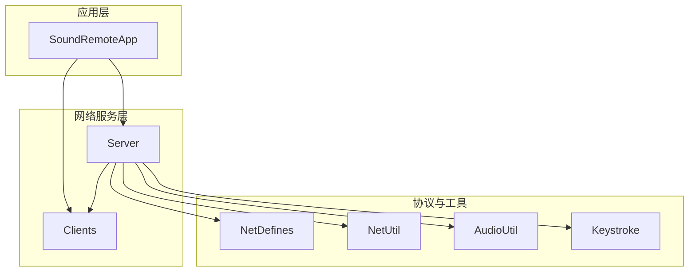
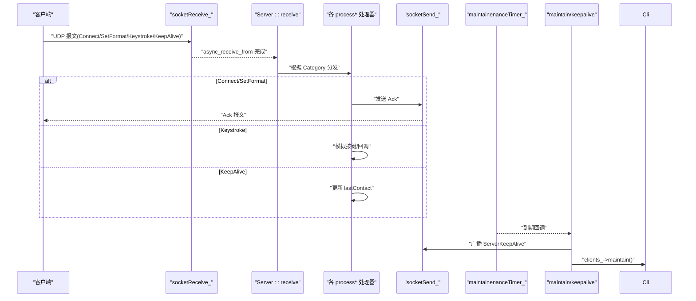
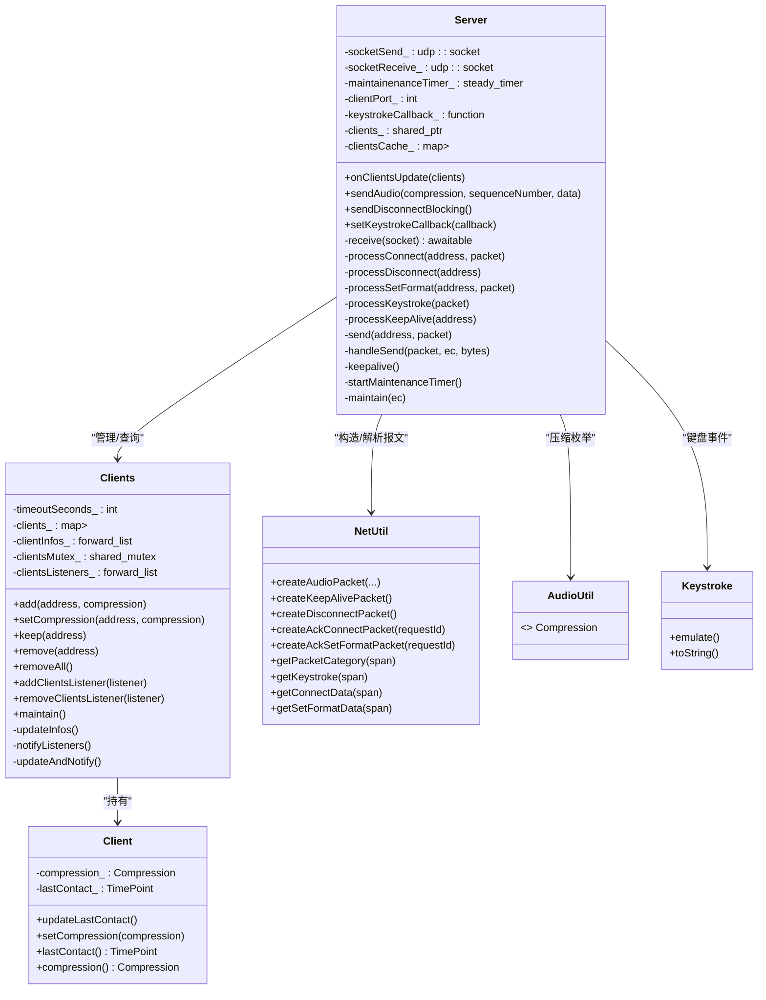
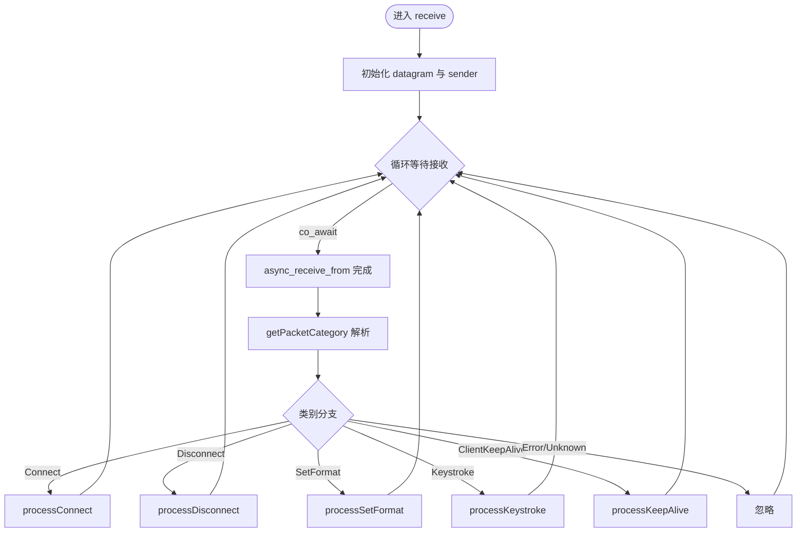
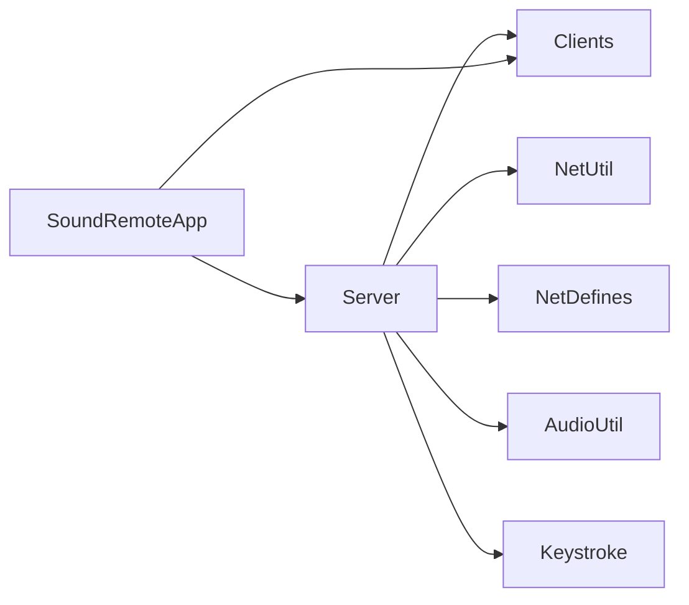

# Server 服务器模块

<cite>
**本文引用的文件**
- [Server.h](file://SoundRemote/Server.h)
- [Server.cpp](file://SoundRemote/Server.cpp)
- [Clients.h](file://SoundRemote/Clients.h)
- [Clients.cpp](file://SoundRemote/Clients.cpp)
- [NetDefines.h](file://SoundRemote/NetDefines.h)
- [NetUtil.h](file://SoundRemote/NetUtil.h)
- [NetUtil.cpp](file://SoundRemote/NetUtil.cpp)
- [AudioUtil.h](file://SoundRemote/AudioUtil.h)
- [Keystroke.h](file://SoundRemote/Keystroke.h)
- [SoundRemoteApp.h](file://SoundRemote/SoundRemoteApp.h)
- [SoundRemoteApp.cpp](file://SoundRemote/SoundRemoteApp.cpp)
</cite>

## 目录
1. [简介](#简介)
2. [项目结构](#项目结构)
3. [核心组件](#核心组件)
4. [架构总览](#架构总览)
5. [详细组件分析](#详细组件分析)
6. [依赖关系分析](#依赖关系分析)
7. [性能考量](#性能考量)
8. [故障排查指南](#故障排查指南)
9. [结论](#结论)
10. [附录：集成与使用示例](#附录集成与使用示例)

## 简介
本设计文档聚焦于基于 Boost.Asio 的 UDP 服务器模块，阐述其异步 I/O 模型、协程处理机制与事件循环架构。重点覆盖以下能力：
- UDP 数据包接收与分类处理（连接、断开、格式设置、键盘事件、心跳）
- 客户端连接管理与超时维护
- 音频数据广播（按压缩格式分发）
- 键盘事件转发与模拟
- 双套接字设计（socketSend_ 与 socketReceive_）的原因与优势
- 心跳检测与定时器维护逻辑
- 错误处理策略与健壮性保障

## 项目结构
该模块位于 SoundRemote 工程中，核心文件包括 Server 类及其协作的 Clients、网络协议定义与工具、以及应用入口对服务器的装配与运行。

图表来源
- [Server.cpp:18-28](file://SoundRemote/Server.cpp#L18-L28)
- [SoundRemoteApp.cpp:104-110](file://SoundRemote/SoundRemoteApp.cpp#L104-L110)

章节来源
- [Server.h:20-60](file://SoundRemote/Server.h#L20-L60)
- [Server.cpp:18-28](file://SoundRemote/Server.cpp#L18-L28)
- [SoundRemoteApp.cpp:104-110](file://SoundRemote/SoundRemoteApp.cpp#L104-L110)

## 核心组件
- Server：封装 UDP 收发、协程接收循环、包分发、心跳与定时维护、音频广播等。
- Clients：维护已连接的客户端集合、压缩格式映射、最后接触时间、超时清理与监听器通知。
- NetDefines/NetUtil：定义协议头、类别、字段偏移与编解码函数。
- AudioUtil：音频压缩枚举、常量与辅助类型。
- Keystroke：键盘事件封装与系统模拟。
- SoundRemoteApp：应用主流程，负责创建并启动 Server、绑定回调、驱动 io_context 事件循环。

章节来源
- [Server.h:20-60](file://SoundRemote/Server.h#L20-L60)
- [Clients.h:15-52](file://SoundRemote/Clients.h#L15-L52)
- [NetDefines.h:7-68](file://SoundRemote/NetDefines.h#L7-L68)
- [NetUtil.h:11-40](file://SoundRemote/NetUtil.h#L11-L40)
- [AudioUtil.h:24-40](file://SoundRemote/AudioUtil.h#L24-L40)
- [Keystroke.h:6-40](file://SoundRemote/Keystroke.h#L6-L40)
- [SoundRemoteApp.cpp:104-110](file://SoundRemote/SoundRemoteApp.cpp#L104-L110)

## 架构总览
Server 采用“单接收协程 + 异步发送”的架构：
- 接收端：在独立协程中持续从 socketReceive_ 异步接收 UDP 报文，解析类别后分派到对应处理器。
- 发送端：通过 socketSend_ 异步向客户端发送响应或广播数据；发送完成回调用于资源生命周期管理。
- 维护端：steady_timer 周期性触发 keepalive 与客户端超时清理。
- 事件循环：由外部 io_context 驱动，Server 内部协程与定时器均挂入同一上下文。

图表来源
- [Server.cpp:80-125](file://SoundRemote/Server.cpp#L80-L125)
- [Server.cpp:127-166](file://SoundRemote/Server.cpp#L127-L166)
- [Server.cpp:182-209](file://SoundRemote/Server.cpp#L182-L209)

## 详细组件分析

### 类图与职责

图表来源
- [Server.h:20-60](file://SoundRemote/Server.h#L20-L60)
- [Clients.h:15-52](file://SoundRemote/Clients.h#L15-L52)
- [NetUtil.h:11-40](file://SoundRemote/NetUtil.h#L11-L40)
- [AudioUtil.h:24-40](file://SoundRemote/AudioUtil.h#L24-L40)
- [Keystroke.h:6-40](file://SoundRemote/Keystroke.h#L6-L40)

章节来源
- [Server.h:20-60](file://SoundRemote/Server.h#L20-L60)
- [Clients.h:15-52](file://SoundRemote/Clients.h#L15-L52)
- [NetUtil.h:11-40](file://SoundRemote/NetUtil.h#L11-L40)
- [AudioUtil.h:24-40](file://SoundRemote/AudioUtil.h#L24-L40)
- [Keystroke.h:6-40](file://SoundRemote/Keystroke.h#L6-L40)

### receive() 协程工作流程
- 初始化本地缓冲区与发送端 endpoint。
- 进入无限循环，使用 use_awaitable 发起 async_receive_from。
- 收到报文后，调用 getPacketCategory 解析类别，switch 分发至具体处理器。
- 异常捕获：忽略 operation_aborted；其他错误显示并退出进程。

图表来源
- [Server.cpp:80-125](file://SoundRemote/Server.cpp#L80-L125)

章节来源
- [Server.cpp:80-125](file://SoundRemote/Server.cpp#L80-L125)

### 数据包处理方法详解
- processConnect：解析 ConnectData，校验压缩值，注册客户端，回发 AckConnect。
- processDisconnect：移除客户端。
- processSetFormat：解析 SetFormatData，更新客户端压缩格式，回发 AckSetFormat。
- processKeystroke：解析键码与修饰位，执行 emulate，并可选触发上层回调。
- processKeepAlive：仅更新 lastContact 时间戳。

章节来源
- [Server.cpp:127-166](file://SoundRemote/Server.cpp#L127-L166)
- [NetUtil.cpp:193-217](file://SoundRemote/NetUtil.cpp#L193-L217)

### 双套接字设计（socketSend_ 与 socketReceive_）
- 原因与优势：
  - 分离收/发路径，避免同一 socket 上并发 send_to 与 receive_from 的潜在竞争与状态耦合。
  - 便于分别控制 shutdown/close 行为，析构时更安全。
  - 发送端可复用固定端口，减少地址切换开销；接收端绑定 serverPort，简化路由。
- 实现要点：
  - 构造函数中分别创建两个 udp::socket，接收端绑定 serverPort。
  - 发送统一走 send() -> async_send_to -> handleSend。

章节来源
- [Server.cpp:18-28](file://SoundRemote/Server.cpp#L18-L28)
- [Server.cpp:168-180](file://SoundRemote/Server.cpp#L168-L180)
- [Server.cpp:30-35](file://SoundRemote/Server.cpp#L30-L35)

### 音频数据广播
- 入口：sendAudio(compression, sequenceNumber, data)。
- 依据 compression 选择音频类别（未压缩/Opus），构建音频包。
- 遍历 clientsCache_[compression] 中的地址，逐个异步发送。
- clientsCache_ 由 onClientsUpdate 同步更新，保证广播目标集最新。

章节来源
- [Server.cpp:48-62](file://SoundRemote/Server.cpp#L48-L62)
- [Server.cpp:37-46](file://SoundRemote/Server.cpp#L37-L46)
- [NetUtil.cpp:129-140](file://SoundRemote/NetUtil.cpp#L129-L140)

### 键盘事件转发
- 解析 Keystroke，调用 emulate 进行系统级模拟。
- 若设置了 keystrokeCallback_，则回调通知上层（例如 UI 记录）。

章节来源
- [Server.cpp:155-162](file://SoundRemote/Server.cpp#L155-L162)
- [SoundRemoteApp.cpp:106-108](file://SoundRemote/SoundRemoteApp.cpp#L106-L108)

### 心跳检测与维护定时器
- startMaintenanceTimer：设置 1s 间隔，注册 maintain 回调。
- maintain：
  - 检查 error_code，忽略 operation_aborted，否则抛出异常。
  - 调用 keepalive 广播 ServerKeepAlive。
  - 调用 clients_->maintain() 清理超时客户端。
  - 再次调度自身以形成周期任务。
- keepalive：遍历 clientsCache_，向所有客户端发送 ServerKeepAlive。

章节来源
- [Server.cpp:182-209](file://SoundRemote/Server.cpp#L182-L209)

### 客户端连接管理与超时
- add/setCompression/keep/remove：线程安全地增删改查客户端信息，并更新 clientInfos_ 通知监听者。
- maintain：扫描所有客户端，超过 timeoutSeconds_ 则删除，并在有变更时通知监听者。
- 监听器：Server 与 CapturePipe 等订阅客户端列表变化，用于刷新缓存与 UI。

章节来源
- [Clients.cpp:5-80](file://SoundRemote/Clients.cpp#L5-L80)
- [Clients.cpp:82-98](file://SoundRemote/Clients.cpp#L82-L98)
- [Server.cpp:37-46](file://SoundRemote/Server.cpp#L37-L46)

### 错误处理策略
- receive 协程：
  - 捕获 boost::system::system_error，若非 operation_aborted，则显示错误并退出进程。
  - 捕获 std::exception 与未知异常，同样显示错误并退出。
- 发送回调 handleSend：
  - 若存在错误码，抛出运行时异常（由上层 io_context 捕获）。
- 定时器 maintain：
  - 忽略 operation_aborted，其它错误抛出异常。
- 应用层 asioEventLoop：
  - 捕获 Audio::Error 与 std::exception，必要时停止采集或退出进程。

章节来源
- [Server.cpp:111-124](file://SoundRemote/Server.cpp#L111-L124)
- [Server.cpp:176-180](file://SoundRemote/Server.cpp#L176-L180)
- [Server.cpp:187-194](file://SoundRemote/Server.cpp#L187-L194)
- [SoundRemoteApp.cpp:388-408](file://SoundRemote/SoundRemoteApp.cpp#L388-L408)

## 依赖关系分析

图表来源
- [Server.cpp:1-8](file://SoundRemote/Server.cpp#L1-L8)
- [SoundRemoteApp.cpp:104-110](file://SoundRemote/SoundRemoteApp.cpp#L104-L110)

章节来源
- [Server.cpp:1-8](file://SoundRemote/Server.cpp#L1-L8)
- [SoundRemoteApp.cpp:104-110](file://SoundRemote/SoundRemoteApp.cpp#L104-L110)

## 性能考量
- 异步 I/O：receive 协程与 async_send_to 充分利用 Boost.Asio 的异步能力，避免阻塞。
- 双套接字：降低收发竞争，提升吞吐稳定性。
- 缓存优化：clientsCache_ 按压缩格式分组，广播时直接迭代，减少查找开销。
- 定时器粒度：1s 心跳与清理频率平衡了实时性与 CPU 占用。
- 内存管理：发送时使用 shared_ptr 传递报文，确保回调期间对象存活。

[本节为通用指导，不直接分析具体文件]

## 故障排查指南
- 无法接收数据：
  - 检查 socketReceive_ 是否成功绑定 serverPort。
  - 确认防火墙允许 UDP 端口通信。
- 客户端频繁掉线：
  - 调整 Clients 的 timeoutSeconds_（默认 5s）。
  - 检查客户端是否定期发送 ClientKeepAlive。
- 音频未到达客户端：
  - 确认 sendAudio 的 compression 与客户端一致。
  - 检查 clientsCache_ 是否包含目标地址。
- 键盘无响应：
  - 确认 processKeystroke 成功解析且 emulate 未被拦截。
  - 检查 setKeystrokeCallback 是否正确注册。

章节来源
- [Server.cpp:18-28](file://SoundRemote/Server.cpp#L18-L28)
- [Clients.cpp:64-80](file://SoundRemote/Clients.cpp#L64-L80)
- [Server.cpp:48-62](file://SoundRemote/Server.cpp#L48-L62)
- [Server.cpp:155-162](file://SoundRemote/Server.cpp#L155-L162)

## 结论
Server 模块以简洁清晰的协程+异步 I/O 模式实现了稳定的 UDP 服务端功能。通过双套接字分离收发、按压缩格式缓存客户端、周期心跳与超时清理，兼顾了可靠性与性能。配合应用层的装配与回调，形成了完整的远程音频与键盘联动方案。

[本节为总结，不直接分析具体文件]

## 附录：集成与使用示例
以下为最小化集成步骤（不含代码片段，仅提供路径参考）：
- 创建 io_context 与线程，启动事件循环。
- 创建 Clients 实例，并注册监听器以获取客户端列表。
- 创建 Server 实例，传入 clientPort、serverPort、io_context 与 clients。
- 将 Clients 的更新回调注册到 Server::onClientsUpdate，以便刷新发送缓存。
- 可选：设置键盘回调以记录或展示按键事件。
- 启动音频采集管道，按需调用 Server::sendAudio 广播音频。
- 退出前调用 Server::sendDisconnectBlocking 通知客户端断开。

章节来源
- [SoundRemoteApp.cpp:104-110](file://SoundRemote/SoundRemoteApp.cpp#L104-L110)
- [SoundRemoteApp.cpp:127-131](file://SoundRemote/SoundRemoteApp.cpp#L127-L131)
- [Server.h:24-38](file://SoundRemote/Server.h#L24-L38)
- [Server.cpp:48-62](file://SoundRemote/Server.cpp#L48-L62)