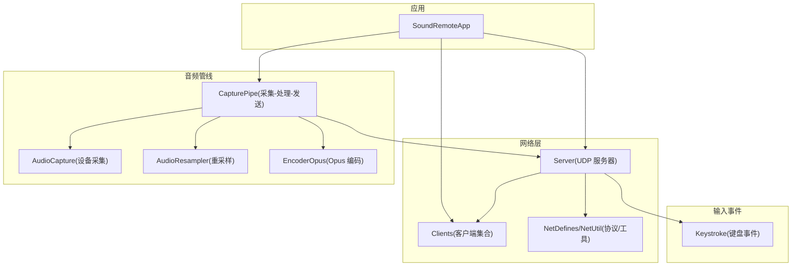
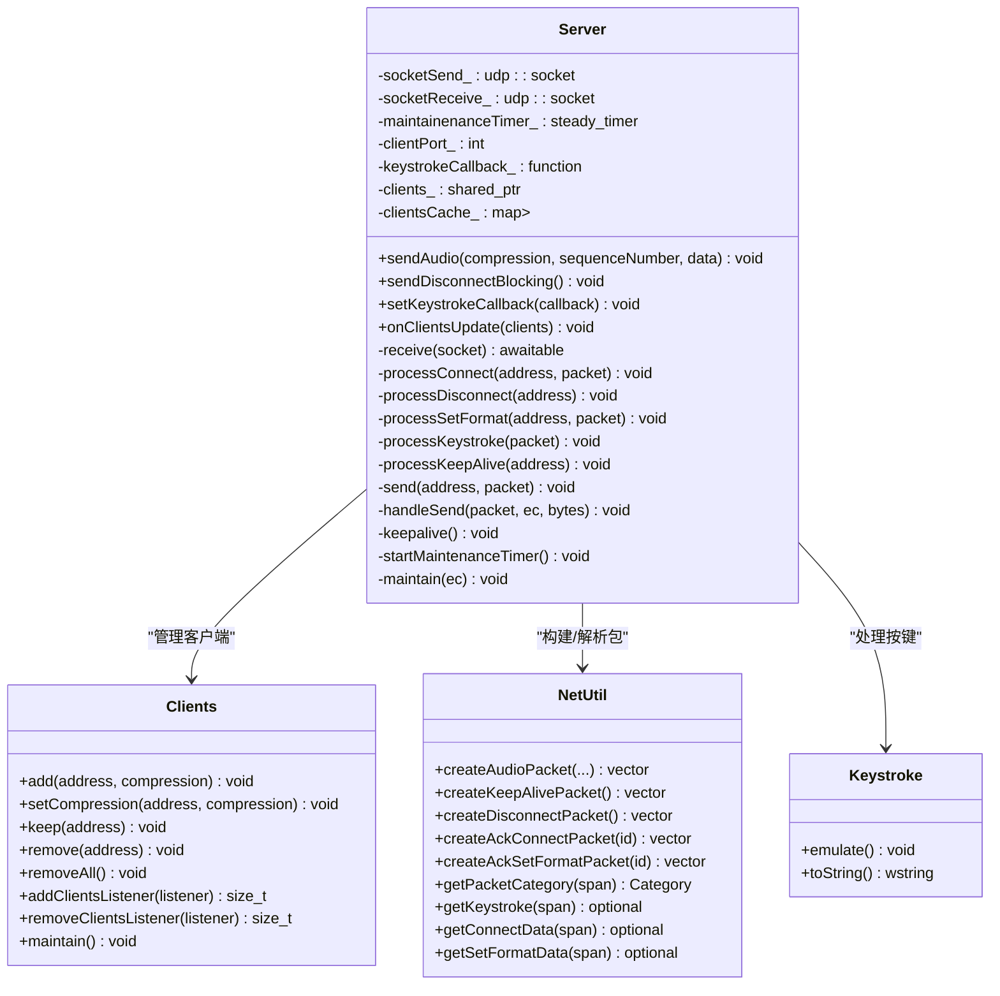
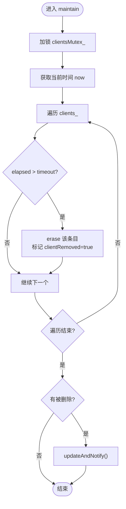
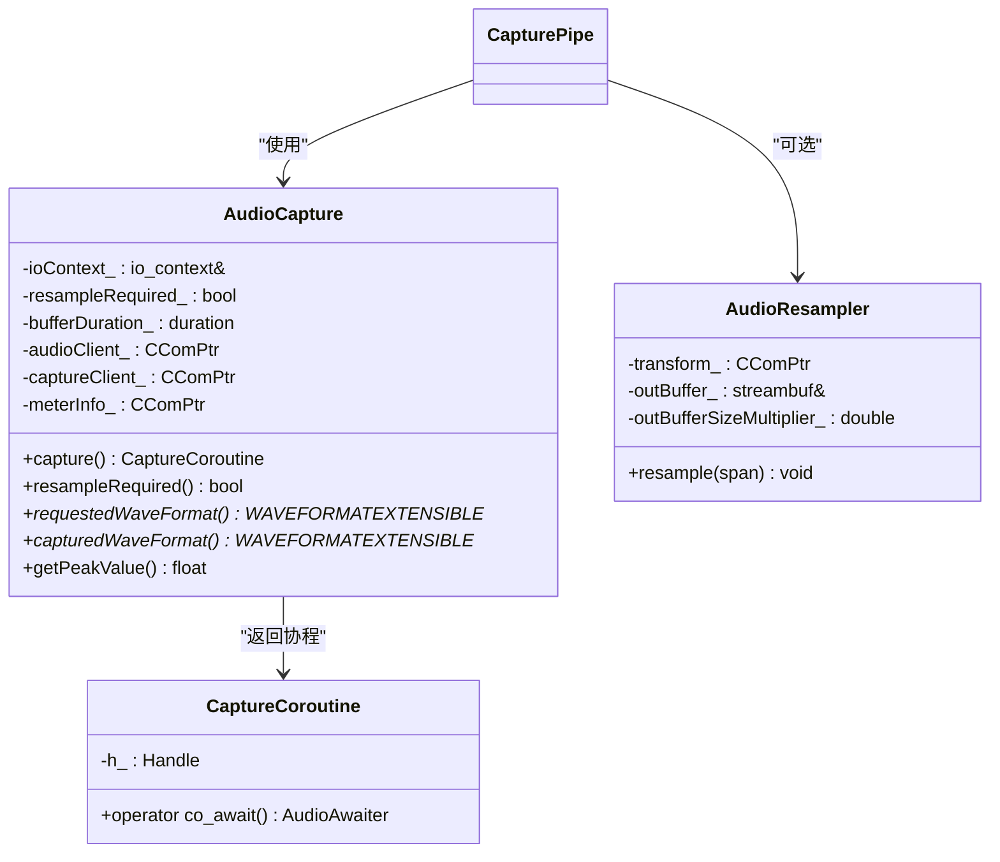
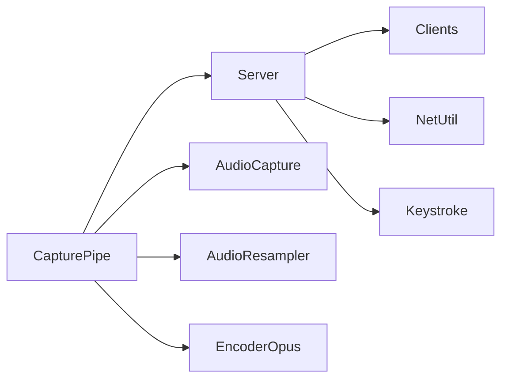

# 核心模块设计

<cite>
**本文引用的文件**   
- [Server.h](file://SoundRemote/Server.h)
- [Server.cpp](file://SoundRemote/Server.cpp)
- [Clients.h](file://SoundRemote/Clients.h)
- [Clients.cpp](file://SoundRemote/Clients.cpp)
- [CapturePipe.h](file://SoundRemote/CapturePipe.h)
- [CapturePipe.cpp](file://SoundRemote/CapturePipe.cpp)
- [AudioCapture.h](file://SoundRemote/AudioCapture.h)
- [AudioCapture.cpp](file://SoundRemote/AudioCapture.cpp)
- [AudioResampler.h](file://SoundRemote/AudioResampler.h)
- [EncoderOpus.h](file://SoundRemote/EncoderOpus.h)
- [NetDefines.h](file://SoundRemote/NetDefines.h)
- [NetUtil.h](file://SoundRemote/NetUtil.h)
- [Keystroke.h](file://SoundRemote/Keystroke.h)
- [AudioUtil.h](file://SoundRemote/AudioUtil.h)
- [SoundRemoteApp.h](file://SoundRemote/SoundRemoteApp.h)
</cite>

## 目录
1. [引言](#引言)
2. [项目结构](#项目结构)
3. [核心组件](#核心组件)
4. [架构总览](#架构总览)
5. [详细组件分析](#详细组件分析)
6. [依赖关系分析](#依赖关系分析)
7. [性能考量](#性能考量)
8. [故障排查指南](#故障排查指南)
9. [结论](#结论)
10. [附录](#附录)

## 引言
本设计文档聚焦于 SoundRemote-WinServer 的核心模块：Server、Clients、CapturePipe，以及与之紧密协作的音频采集与编码子系统。文档将系统阐述各模块的职责边界、接口定义、内部实现细节与依赖关系；重点解释基于 Boost.Asio 的异步 I/O 模型与协程在音频捕获和网络传输中的应用；并给出客户端连接管理、音频数据管道处理、键盘事件处理的内部逻辑说明，同时包含模块间调用关系与时序图、异常处理机制和资源管理模式。

## 项目结构
本项目采用分层与按功能组织相结合的结构：
- 网络层：Server（UDP 服务器）、Clients（客户端集合与状态维护）、NetDefines/NetUtil（协议与工具）
- 音频管线：CapturePipe（采集-重采样-编码-发送流水线）、AudioCapture（Windows Core Audio 采集）、AudioResampler（重采样）、EncoderOpus（Opus 编码）
- 输入事件：Keystroke（键盘事件封装与模拟）
- 应用入口：SoundRemoteApp（UI 与生命周期协调）



图表来源
- [Server.h:1-61](file://SoundRemote/Server.h#L1-L61)
- [Server.cpp:1-210](file://SoundRemote/Server.cpp#L1-L210)
- [Clients.h:1-60](file://SoundRemote/Clients.h#L1-L60)
- [Clients.cpp:1-125](file://SoundRemote/Clients.cpp#L1-L125)
- [CapturePipe.h:1-52](file://SoundRemote/CapturePipe.h#L1-L52)
- [CapturePipe.cpp:1-156](file://SoundRemote/CapturePipe.cpp#L1-L156)
- [AudioCapture.h:1-144](file://SoundRemote/AudioCapture.h#L1-L144)
- [AudioCapture.cpp:1-302](file://SoundRemote/AudioCapture.cpp#L1-L302)
- [AudioResampler.h:1-24](file://SoundRemote/AudioResampler.h#L1-L24)
- [EncoderOpus.h:1-37](file://SoundRemote/EncoderOpus.h#L1-L37)
- [NetDefines.h:1-69](file://SoundRemote/NetDefines.h#L1-L69)
- [NetUtil.h:1-41](file://SoundRemote/NetUtil.h#L1-L41)
- [Keystroke.h:1-41](file://SoundRemote/Keystroke.h#L1-L41)
- [SoundRemoteApp.h:1-152](file://SoundRemote/SoundRemoteApp.h#L1-L152)

章节来源
- [SoundRemoteApp.h:1-152](file://SoundRemote/SoundRemoteApp.h#L1-L152)

## 核心组件
本节概述三大核心模块的职责与关键接口。

- Server
  - 职责：监听 UDP 端口，解析客户端连接/断开/格式设置/心跳/按键事件；维护客户端缓存并按压缩类型广播音频；周期性发送心跳与清理超时客户端。
  - 关键接口：sendAudio、sendDisconnectBlocking、setKeystrokeCallback、onClientsUpdate。
  - 异步模型：使用 Boost.Asio awaitable/coroutine 进行接收循环；定时器驱动维护任务。

- Clients
  - 职责：维护已连接客户端地址与压缩格式、最后接触时间；提供添加/更新/移除/保持活跃能力；按超时清理并通知监听者。
  - 关键接口：add、setCompression、keep、remove、maintain、addClientsListener/removeClientsListener。
  - 并发安全：使用 shared_mutex 保护内部容器；监听器列表在启动期修改，读取时不额外同步。

- CapturePipe
  - 职责：驱动音频采集、按需重采样、按目标压缩格式编码、序列号递增、调用 Server 发送；根据客户端变化动态创建/销毁编码器实例。
  - 关键接口：start、getPeakValue、setMuted、onClientsUpdate。
  - 协程：内部 PipeCoroutine 驱动主循环，通过 co_await 等待音频帧。

章节来源
- [Server.h:1-61](file://SoundRemote/Server.h#L1-L61)
- [Server.cpp:1-210](file://SoundRemote/Server.cpp#L1-L210)
- [Clients.h:1-60](file://SoundRemote/Clients.h#L1-L60)
- [Clients.cpp:1-125](file://SoundRemote/Clients.cpp#L1-L125)
- [CapturePipe.h:1-52](file://SoundRemote/CapturePipe.h#L1-L52)
- [CapturePipe.cpp:1-156](file://SoundRemote/CapturePipe.cpp#L1-L156)

## 架构总览
下图展示从音频采集到网络分发的整体流程，以及按键事件的处理路径。

```mermaid
sequenceDiagram
participant App as "应用(SoundRemoteApp)"
participant Cap as "CapturePipe"
participant ACap as "AudioCapture"
participant Res as "AudioResampler"
participant Enc as "EncoderOpus"
participant Srv as "Server"
participant Cli as "Clients"
participant Net as "NetUtil/NetDefines"
participant Ks as "Keystroke"
App->>Srv : 初始化并启动
App->>Cap : start()
loop 每帧
Cap->>ACap : co_await capture()
alt 需要重采样
Cap->>Res : resample(pcm)
else 直接拷贝
Cap->>Cap : 写入streambuf
end
for each 压缩格式 in encoders_
alt none(未压缩)
Cap->>Srv : sendAudio(none, seq, pcm)
else Opus
Cap->>Enc : encode(pcm, outBuf)
Cap->>Srv : sendAudio(opus, seq, encoded)
end
end
Cap->>Cap : ++audioSequenceNumber_
end
Note over Srv,Cli : 客户端侧发起连接/设置格式/心跳
Srv->>Cli : add/setCompression/keep/remove
Srv-->>Srv : onClientsUpdate -> clientsCache_
Srv-->>Srv : keepalive() 定时发送心跳
Srv->>Ks : processKeystroke -> emulate()/回调
```

图表来源
- [CapturePipe.cpp:97-156](file://SoundRemote/CapturePipe.cpp#L97-L156)
- [AudioCapture.cpp:219-280](file://SoundRemote/AudioCapture.cpp#L219-L280)
- [Server.cpp:80-125](file://SoundRemote/Server.cpp#L80-L125)
- [Server.cpp:127-166](file://SoundRemote/Server.cpp#L127-L166)
- [Server.cpp:182-209](file://SoundRemote/Server.cpp#L182-L209)
- [Clients.cpp:5-80](file://SoundRemote/Clients.cpp#L5-L80)
- [NetDefines.h:47-58](file://SoundRemote/NetDefines.h#L47-L58)

## 详细组件分析

### Server 模块
- 职责边界
  - 负责 UDP 套接字收发、协议解析、客户端状态联动、音频广播、心跳与断连。
  - 不持有具体音频数据，仅转发由 CapturePipe 组装好的数据包。
- 关键流程
  - 接收循环：使用 awaitable 持续 async_receive_from，按 Category 分发至对应处理器。
  - 连接/格式/心跳：调用 Clients 增删改查，并回发 Ack 或更新缓存。
  - 音频发送：按压缩类型索引客户端地址列表，批量异步发送。
  - 维护定时器：每秒触发 keepalive 与 Clients::maintain。
- 异常与资源
  - receive 中捕获 boost::system::system_error 与 std::exception，非中止错误则显示错误并退出进程。
  - 析构关闭并关闭两个 UDP socket。
- 接口要点
  - sendAudio(compression, sequenceNumber, data)
  - sendDisconnectBlocking()
  - setKeystrokeCallback(callback)
  - onClientsUpdate(clients)



图表来源
- [Server.h:20-60](file://SoundRemote/Server.h#L20-L60)
- [Server.cpp:18-210](file://SoundRemote/Server.cpp#L18-L210)
- [NetUtil.h:11-40](file://SoundRemote/NetUtil.h#L11-L40)
- [Keystroke.h:6-41](file://SoundRemote/Keystroke.h#L6-L41)

章节来源
- [Server.h:1-61](file://SoundRemote/Server.h#L1-L61)
- [Server.cpp:1-210](file://SoundRemote/Server.cpp#L1-L210)
- [NetUtil.h:1-41](file://SoundRemote/NetUtil.h#L1-L41)
- [NetDefines.h:1-69](file://SoundRemote/NetDefines.h#L1-L69)
- [Keystroke.h:1-41](file://SoundRemote/Keystroke.h#L1-L41)

### Clients 模块
- 职责边界
  - 维护客户端地址与压缩格式映射、最后接触时间；支持监听器模式推送变更；按超时剔除。
- 数据结构与复杂度
  - clients_: unordered_map<Address, unique_ptr<Client>>，O(1) 查找/插入/删除。
  - clientInfos_: forward_list<ClientInfo>，用于快速遍历通知。
  - maintain(): O(N) 扫描并可能触发一次通知。
- 线程安全
  - 使用 shared_mutex 保护 clients_ 与 clientInfos_ 的读写。
  - listeners_ 为 forward_list，仅在程序启动和设备变更时修改，读取时不锁。
- 关键流程
  - add/setCompression/keep/remove 均会更新内部状态并在必要时 updateAndNotify。
  - maintain 计算 elapsedSeconds > timeoutSeconds_ 则删除并标记需通知。



图表来源
- [Clients.cpp:64-98](file://SoundRemote/Clients.cpp#L64-L98)

章节来源
- [Clients.h:1-60](file://SoundRemote/Clients.h#L1-L60)
- [Clients.cpp:1-125](file://SoundRemote/Clients.cpp#L1-L125)

### CapturePipe 模块
- 职责边界
  - 驱动音频采集、可选重采样、按压缩格式编码、序列号自增、调用 Server 发送；根据客户端压缩需求动态管理编码器。
- 协程与缓冲
  - PipeCoroutine 作为内部协程包装，process 主循环 co_await 音频帧。
  - streambuf 作为 PCM 缓冲，按固定 opusInputSize_ 切块处理。
- 编码器管理
  - encoders_: unordered_map<Compression, unique_ptr<EncoderOpus>>。
  - onClientsUpdate 对比新旧压缩集合，增量创建/销毁编码器。
- 发送策略
  - 对 none 压缩：直接复制 PCM 块发送。
  - 对 Opus 压缩：调用 encode 后发送有效载荷。
  - 每次处理完一个块，audioSequenceNumber_ 自增。

```mermaid
sequenceDiagram
participant CP as "CapturePipe"
participant AC as "AudioCapture"
participant RS as "AudioResampler"
participant EN as "EncoderOpus"
participant SR as "Server"
CP->>AC : capture() 返回协程
loop 每帧
CP->>CP : co_await audioCapture
alt muted=false 且有客户端
alt 需要重采样
CP->>RS : resample(pcm)
else 无需重采样
CP->>CP : sputn(pcm) 入流缓冲
end
while 缓冲>=opusInputSize_
for each (compression, encoder) in encoders_
alt none
CP->>SR : sendAudio(none, seq, pcmBlock)
else opus
CP->>EN : encode(pcmBlock, outBuf)
CP->>SR : sendAudio(opus, seq, encoded)
end
end
CP->>CP : ++seq; consume(opusInputSize_)
end
end
CP->>AC : h_() 推进采集协程
end
```

图表来源
- [CapturePipe.cpp:97-156](file://SoundRemote/CapturePipe.cpp#L97-L156)
- [AudioCapture.h:80-143](file://SoundRemote/AudioCapture.h#L80-L143)
- [AudioCapture.cpp:219-280](file://SoundRemote/AudioCapture.cpp#L219-L280)
- [EncoderOpus.h:9-36](file://SoundRemote/EncoderOpus.h#L9-L36)

章节来源
- [CapturePipe.h:1-52](file://SoundRemote/CapturePipe.h#L1-L52)
- [CapturePipe.cpp:1-156](file://SoundRemote/CapturePipe.cpp#L1-L156)
- [AudioCapture.h:1-144](file://SoundRemote/AudioCapture.h#L1-L144)
- [AudioCapture.cpp:1-302](file://SoundRemote/AudioCapture.cpp#L1-L302)
- [AudioResampler.h:1-24](file://SoundRemote/AudioResampler.h#L1-L24)
- [EncoderOpus.h:1-37](file://SoundRemote/EncoderOpus.h#L1-L37)

### 音频采集与重采样（AudioCapture / AudioResampler）
- AudioCapture
  - 基于 Windows Core Audio (IAudioClient/IAudioCaptureClient/IAudioMeterInformation)。
  - 构造阶段确定请求格式与实际支持格式，决定是否重采样。
  - capture() 协程：以 half-buffer 周期计时，GetNextPacketSize/GetBuffer 取数据，co_yield 输出 span<char>；无数据时填充静音缓冲补偿。
  - getPeakValue 通过 IAudioMeterInformation 获取峰值。
- AudioResampler
  - 基于 IMFTransform 的重采样器，将设备实际格式转换为期望格式，输出到 streambuf。



图表来源
- [AudioCapture.h:22-78](file://SoundRemote/AudioCapture.h#L22-L78)
- [AudioCapture.h:80-143](file://SoundRemote/AudioCapture.h#L80-L143)
- [AudioCapture.cpp:118-214](file://SoundRemote/AudioCapture.cpp#L118-L214)
- [AudioCapture.cpp:219-302](file://SoundRemote/AudioCapture.cpp#L219-L302)
- [AudioResampler.h:13-23](file://SoundRemote/AudioResampler.h#L13-L23)

章节来源
- [AudioCapture.h:1-144](file://SoundRemote/AudioCapture.h#L1-L144)
- [AudioCapture.cpp:1-302](file://SoundRemote/AudioCapture.cpp#L1-L302)
- [AudioResampler.h:1-24](file://SoundRemote/AudioResampler.h#L1-L24)

### 网络协议与工具（NetDefines / NetUtil）
- NetDefines
  - 定义协议签名、头部偏移、类别枚举（Connect/Disconnect/SetFormat/Keystroke/AudioData*/KeepAlive/Ack）、默认端口等。
- NetUtil
  - 提供本地地址枚举、压缩值转换、各类包的创建与解析函数。

章节来源
- [NetDefines.h:1-69](file://SoundRemote/NetDefines.h#L1-L69)
- [NetUtil.h:1-41](file://SoundRemote/NetUtil.h#L1-L41)

### 键盘事件（Keystroke）
- 封装虚拟键码与修饰键位域，提供 emulate() 模拟按键与 toString() 描述。
- Server 收到 Keystroke 包后，先执行 emulate()，再调用注册的回调。

章节来源
- [Keystroke.h:1-41](file://SoundRemote/Keystroke.h#L1-L41)
- [Server.cpp:155-162](file://SoundRemote/Server.cpp#L155-L162)

## 依赖关系分析
- 耦合与内聚
  - Server 与 Clients 高内聚低耦合：通过清晰接口交互，Server 仅依赖 Clients 的状态管理与通知。
  - CapturePipe 与 Server 解耦：通过 sendAudio 抽象发送，便于替换后端。
  - AudioCapture/AudioResampler/EncoderOpus 各自专注单一职责，CapturePipe 编排流程。
- 外部依赖
  - Boost.Asio：协程与异步 I/O。
  - Windows Core Audio：音频采集与度量。
  - Media Foundation：重采样。
  - Opus：音频编码。
- 潜在循环依赖
  - 当前未见循环 include；Server 与 CapturePipe 通过弱引用/共享指针避免强循环。



图表来源
- [Server.h:1-61](file://SoundRemote/Server.h#L1-L61)
- [CapturePipe.h:1-52](file://SoundRemote/CapturePipe.h#L1-L52)
- [AudioCapture.h:1-144](file://SoundRemote/AudioCapture.h#L1-L144)
- [AudioResampler.h:1-24](file://SoundRemote/AudioResampler.h#L1-L24)
- [EncoderOpus.h:1-37](file://SoundRemote/EncoderOpus.h#L1-L37)
- [NetUtil.h:1-41](file://SoundRemote/NetUtil.h#L1-L41)
- [Keystroke.h:1-41](file://SoundRemote/Keystroke.h#L1-L41)

章节来源
- [Server.h:1-61](file://SoundRemote/Server.h#L1-L61)
- [CapturePipe.h:1-52](file://SoundRemote/CapturePipe.h#L1-L52)

## 性能考量
- 零拷贝与缓冲
  - AudioCapture 直接 yield 底层缓冲区指针，减少拷贝；CapturePipe 使用 streambuf 累积 PCM 块，按固定大小切分，降低分配开销。
- 编码并行性
  - 当前为单线程顺序编码与发送；若 CPU 紧张，可考虑对多压缩格式编码并行化（注意线程安全）。
- 网络发送
  - Server 使用异步发送，避免阻塞；但 handleSend 中遇到错误抛出异常，建议改为记录日志并忽略个别失败，提高鲁棒性。
- 重采样
  - 仅在设备不支持请求格式时启用，避免不必要的 CPU 消耗。
- 心跳与清理
  - 合理设置超时阈值，平衡延迟与资源占用。

[本节为通用指导，不直接分析具体文件]

## 故障排查指南
- 常见问题定位
  - 接收异常：检查 receive 中的 system_error 分支，确认是否因 socket 关闭导致 operation_aborted。
  - 发送异常：handleSend 抛出的运行时错误应转为日志记录，避免崩溃。
  - 音频无声：确认 muted_ 标志、encoders_ 是否为空、是否有客户端连接。
  - 重采样问题：核对 requestedWaveFormat 与 capturedWaveFormat 差异，确保 AudioResampler 正确初始化。
- 调试建议
  - 打印 ClientInfo 列表与压缩类型，验证 onClientsUpdate 是否正确传播。
  - 观察 audioSequenceNumber_ 是否递增，确认发送路径是否可达。
  - 使用 Util::showError 输出的错误文本定位 HRESULT 位置。

章节来源
- [Server.cpp:111-124](file://SoundRemote/Server.cpp#L111-L124)
- [Server.cpp:176-180](file://SoundRemote/Server.cpp#L176-L180)
- [AudioUtil.h:130-169](file://SoundRemote/AudioUtil.h#L130-L169)

## 结论
SoundRemote-WinServer 的核心模块围绕“采集-处理-发送”的主干链路展开，借助 Boost.Asio 的协程与异步 I/O 实现了高效的音频流式传输。Server 与 Clients 解耦良好，CapturePipe 灵活编排重采样与编码流程，并通过客户端压缩需求动态管理编码器。整体设计职责清晰、扩展性强，具备较好的可维护性与性能潜力。

[本节为总结性内容，不直接分析具体文件]

## 附录
- 协议字段与常量参考
  - 参见 NetDefines 中的 Category、Header 偏移、默认端口等定义。
- 关键接口路径
  - Server::sendAudio: [Server.cpp:48-62](file://SoundRemote/Server.cpp#L48-L62)
  - CapturePipe::process: [CapturePipe.cpp:97-156](file://SoundRemote/CapturePipe.cpp#L97-L156)
  - AudioCapture::capture: [AudioCapture.cpp:219-280](file://SoundRemote/AudioCapture.cpp#L219-L280)
  - Clients::maintain: [Clients.cpp:64-80](file://SoundRemote/Clients.cpp#L64-L80)