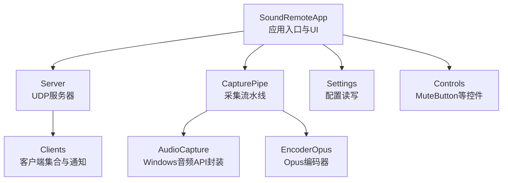
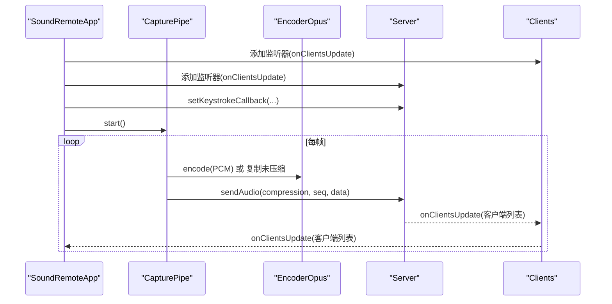
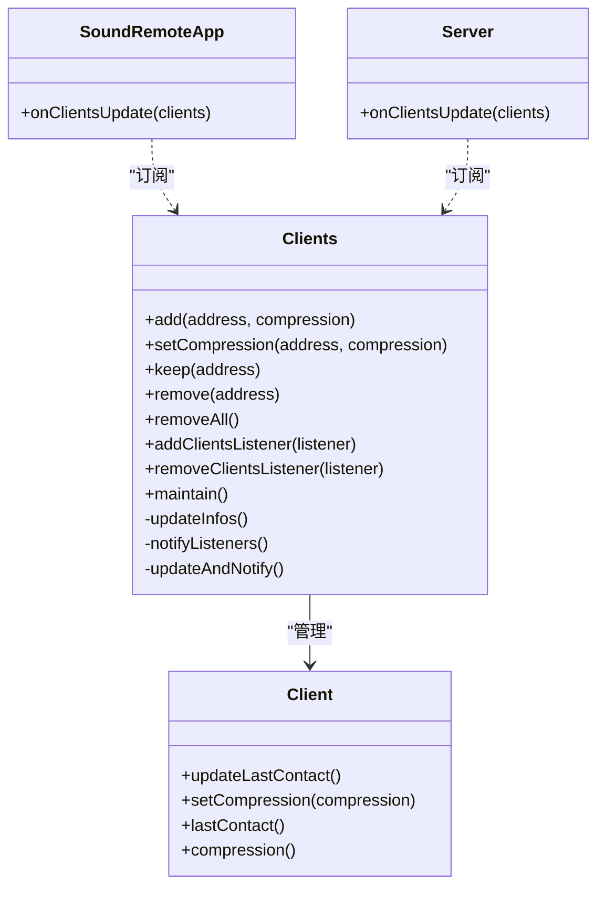
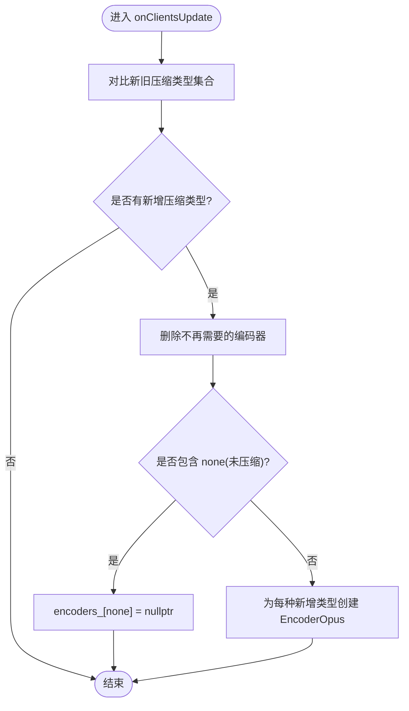
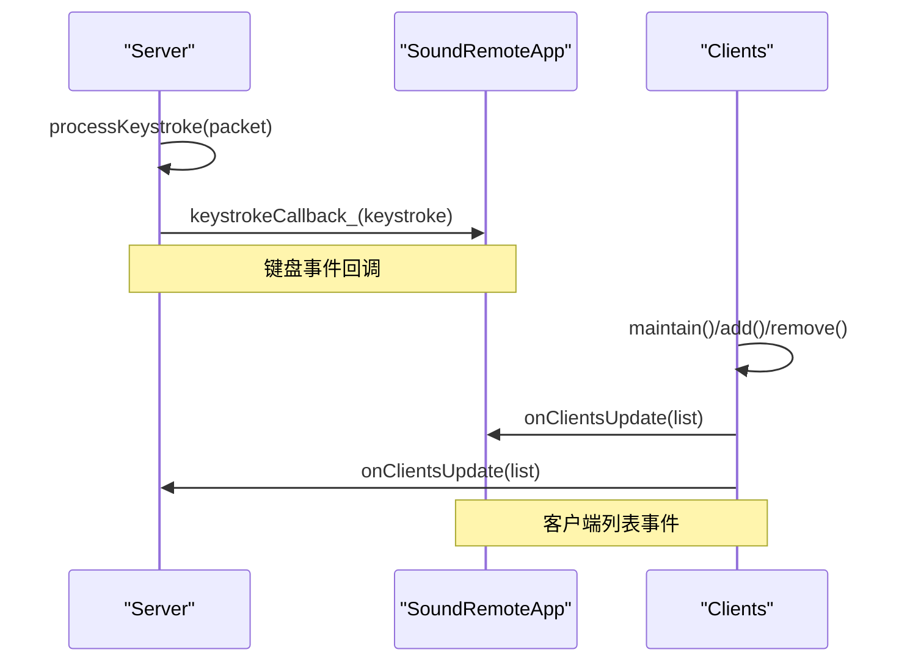
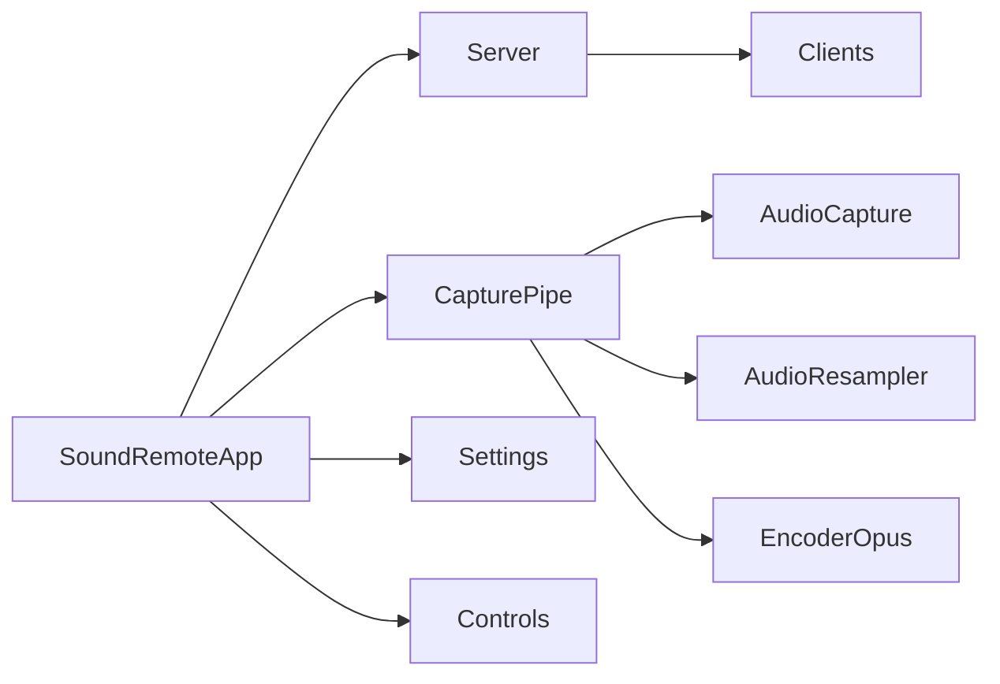

# 设计模式应用

<cite>
**本文引用的文件**   
- [SoundRemoteApp.h](file://SoundRemote/SoundRemoteApp.h)
- [SoundRemoteApp.cpp](file://SoundRemote/SoundRemoteApp.cpp)
- [Server.h](file://SoundRemote/Server.h)
- [Server.cpp](file://SoundRemote/Server.cpp)
- [Clients.h](file://SoundRemote/Clients.h)
- [Clients.cpp](file://SoundRemote/Clients.cpp)
- [CapturePipe.h](file://SoundRemote/CapturePipe.h)
- [CapturePipe.cpp](file://SoundRemote/CapturePipe.cpp)
- [AudioCapture.h](file://SoundRemote/AudioCapture.h)
- [AudioCapture.cpp](file://SoundRemote/AudioCapture.cpp)
- [EncoderOpus.h](file://SoundRemote/EncoderOpus.h)
- [EncoderOpus.cpp](file://SoundRemote/EncoderOpus.cpp)
- [Controls.h](file://SoundRemote/Controls.h)
- [Settings.h](file://SoundRemote/Settings.h)
</cite>

## 目录
1. [简介](#简介)
2. [项目结构](#项目结构)
3. [核心组件](#核心组件)
4. [架构总览](#架构总览)
5. [详细组件分析](#详细组件分析)
6. [依赖关系分析](#依赖关系分析)
7. [性能考量](#性能考量)
8. [故障排查指南](#故障排查指南)
9. [结论](#结论)
10. [附录](#附录)

## 简介
本文件聚焦于 SoundRemote-WinServer 的设计模式应用，重点阐述：
- 观察者模式在客户端状态更新中的应用
- 工厂模式在编码器创建中的使用
- RAII 模式在资源管理中的实践
- 回调机制与事件驱动架构的实现
- 模块化解耦的设计原则
并通过代码级图示与路径引用说明这些模式如何提升可维护性与可扩展性。

## 项目结构
本项目采用分层与模块化组织方式：
- 应用层：UI 与生命周期（SoundRemoteApp）
- 网络层：UDP 服务器与协议处理（Server）
- 客户端集合与状态：连接管理与通知（Clients）
- 音频采集与流水线：设备捕获、重采样、编码、发送（AudioCapture、CapturePipe、EncoderOpus）
- 配置与控件：设置持久化、界面控件（Settings、Controls）

图表来源
- [SoundRemoteApp.h:1-152](file://SoundRemote/SoundRemoteApp.h#L1-L152)
- [Server.h:1-61](file://SoundRemote/Server.h#L1-L61)
- [Clients.h:1-60](file://SoundRemote/Clients.h#L1-L60)
- [CapturePipe.h:1-52](file://SoundRemote/CapturePipe.h#L1-L52)
- [AudioCapture.h:1-144](file://SoundRemote/AudioCapture.h#L1-L144)
- [EncoderOpus.h:1-37](file://SoundRemote/EncoderOpus.h#L1-L37)
- [Controls.h:1-35](file://SoundRemote/Controls.h#L1-L35)
- [Settings.h:1-38](file://SoundRemote/Settings.h#L1-L38)

章节来源
- [SoundRemoteApp.h:1-152](file://SoundRemote/SoundRemoteApp.h#L1-L152)
- [SoundRemoteApp.cpp:1-200](file://SoundRemote/SoundRemoteApp.cpp#L1-L200)

## 核心组件
- SoundRemoteApp：应用装配器与事件循环，负责注册监听、启动服务、运行 UI 消息循环。
- Server：基于 Boost.Asio 的 UDP 服务端，解析协议包、转发音频数据、维护心跳与定时器。
- Clients：维护已连接客户端集合，提供增删改查与“客户端列表变更”通知能力。
- CapturePipe：将采集、可选重采样、按压缩类型分发到不同编码器并调用 Server 发送。
- AudioCapture：封装 Windows Core Audio API，暴露协程式 capture() 接口。
- EncoderOpus：封装 Opus 编码器，RAII 管理底层句柄。
- Controls：UI 控件封装（如静音按钮），通过回调与上层交互。
- Settings：INI 配置文件读写。

章节来源
- [SoundRemoteApp.h:1-152](file://SoundRemote/SoundRemoteApp.h#L1-L152)
- [Server.h:1-61](file://SoundRemote/Server.h#L1-L61)
- [Clients.h:1-60](file://SoundRemote/Clients.h#L1-L60)
- [CapturePipe.h:1-52](file://SoundRemote/CapturePipe.h#L1-L52)
- [AudioCapture.h:1-144](file://SoundRemote/AudioCapture.h#L1-L144)
- [EncoderOpus.h:1-37](file://SoundRemote/EncoderOpus.h#L1-L37)
- [Controls.h:1-35](file://SoundRemote/Controls.h#L1-L35)
- [Settings.h:1-38](file://SoundRemote/Settings.h#L1-L38)

## 架构总览
整体为事件驱动架构：
- 音频采集以协程形式产出 PCM 帧
- CapturePipe 根据当前客户端支持的压缩格式，选择对应编码器或直通未压缩数据
- Server 将音频帧打包并通过 UDP 广播给目标客户端
- Clients 作为“被观察对象”，在连接变化时通知所有订阅者（UI、Server 缓存等）

图表来源
- [SoundRemoteApp.cpp:91-125](file://SoundRemote/SoundRemoteApp.cpp#L91-L125)
- [CapturePipe.cpp:97-155](file://SoundRemote/CapturePipe.cpp#L97-L155)
- [Server.cpp:48-74](file://SoundRemote/Server.cpp#L48-L74)
- [Clients.cpp:53-98](file://SoundRemote/Clients.cpp#L53-L98)

## 详细组件分析

### 观察者模式：客户端状态更新
- 角色划分
  - 主题（Subject）：Clients，维护客户端集合与变更通知
  - 观察者（Observer）：SoundRemoteApp、Server，订阅客户端列表变化
- 关键实现要点
  - add/remove 监听器：支持动态注册与移除
  - updateAndNotify：内部更新 ClientInfo 快照后遍历通知
  - 线程安全：对共享数据加锁，监听器列表在启动期修改，避免频繁加锁
- 典型流程
  - 新连接/断开/超时清理 -> 更新 clientInfos_ -> 通知所有监听者
  - Server 收到通知后重建按压缩类型的地址缓存，优化发送路径
  - UI 收到通知后刷新列表显示

图表来源
- [Clients.h:15-52](file://SoundRemote/Clients.h#L15-L52)
- [Clients.cpp:53-98](file://SoundRemote/Clients.cpp#L53-L98)
- [SoundRemoteApp.cpp:104-108](file://SoundRemote/SoundRemoteApp.cpp#L104-L108)
- [Server.cpp:37-46](file://SoundRemote/Server.cpp#L37-L46)

章节来源
- [Clients.h:15-52](file://SoundRemote/Clients.h#L15-L52)
- [Clients.cpp:53-98](file://SoundRemote/Clients.cpp#L53-L98)
- [SoundRemoteApp.cpp:104-108](file://SoundRemote/SoundRemoteApp.cpp#L104-L108)
- [Server.cpp:37-46](file://SoundRemote/Server.cpp#L37-L46)

### 工厂模式：编码器创建
- 动机
  - 根据客户端压缩需求动态创建/销毁编码器实例，避免不必要的 CPU 与内存开销
- 实现位置
  - CapturePipe::onClientsUpdate 中依据 Compression 枚举决定是否需要新建 EncoderOpus 或保留空指针（未压缩路径）
- 扩展点
  - 新增压缩算法只需在 onClientsUpdate 分支中添加相应创建逻辑，并在 encoders_ 映射中统一管理

图表来源
- [CapturePipe.cpp:69-95](file://SoundRemote/CapturePipe.cpp#L69-L95)
- [EncoderOpus.h:9-36](file://SoundRemote/EncoderOpus.h#L9-L36)
- [EncoderOpus.cpp:10-25](file://SoundRemote/EncoderOpus.cpp#L10-L25)

章节来源
- [CapturePipe.cpp:69-95](file://SoundRemote/CapturePipe.cpp#L69-L95)
- [EncoderOpus.h:9-36](file://SoundRemote/EncoderOpus.h#L9-L36)
- [EncoderOpus.cpp:10-25](file://SoundRemote/EncoderOpus.cpp#L10-L25)

### RAII 模式：资源管理
- 编码器资源
  - EncoderOpus 内部使用自定义删除器的 unique_ptr 管理 Opus 编码器句柄，构造失败抛出异常，析构自动释放
- 音频捕获资源
  - AudioCapture 使用 CComPtr 智能指针管理 COM 接口；WAVEFORMATEXTENSIBLE 使用 CoDeleter 包装的 unique_ptr 管理 COM 分配内存
  - BufferReleaser 局部 RAII 确保 ReleaseBuffer 在作用域退出时被调用
- 定时器与异步 I/O
  - AwaitableTimer 在析构时标记 destroyed_，避免取消后的回调继续恢复协程
- 优势
  - 异常安全：构造失败即回滚已分配资源
  - 无泄漏：析构路径保证释放
  - 可读性：资源生命周期与对象绑定清晰

章节来源
- [EncoderOpus.cpp:10-25](file://SoundRemote/EncoderOpus.cpp#L10-L25)
- [EncoderOpus.cpp:50-53](file://SoundRemote/EncoderOpus.cpp#L50-L53)
- [AudioCapture.cpp:118-214](file://SoundRemote/AudioCapture.cpp#L118-L214)
- [AudioCapture.cpp:90-114](file://SoundRemote/AudioCapture.cpp#L90-L114)
- [AudioCapture.cpp:16-43](file://SoundRemote/AudioCapture.cpp#L16-L43)

### 回调机制与事件驱动
- 键盘事件回调
  - Server 解析 Keystroke 包后，先执行本地模拟，再调用注册的 keystrokeCallback_（由 SoundRemoteApp 注入）
- 客户端列表事件
  - Clients 在连接变化时触发 notifyListeners，UI 与服务端缓存分别响应
- 优点
  - 松耦合：模块间仅通过回调/事件通信
  - 可扩展：新增消费者只需注册新的监听器

图表来源
- [Server.cpp:155-162](file://SoundRemote/Server.cpp#L155-L162)
- [Server.h:22-38](file://SoundRemote/Server.h#L22-L38)
- [Clients.cpp:64-98](file://SoundRemote/Clients.cpp#L64-L98)
- [SoundRemoteApp.cpp:104-108](file://SoundRemote/SoundRemoteApp.cpp#L104-L108)

章节来源
- [Server.cpp:155-162](file://SoundRemote/Server.cpp#L155-L162)
- [Server.h:22-38](file://SoundRemote/Server.h#L22-L38)
- [Clients.cpp:64-98](file://SoundRemote/Clients.cpp#L64-L98)
- [SoundRemoteApp.cpp:104-108](file://SoundRemote/SoundRemoteApp.cpp#L104-L108)

### 模块化解耦原则
- 职责分离
  - 采集（AudioCapture）、流水线（CapturePipe）、网络（Server）、状态（Clients）、UI（SoundRemoteApp）各司其职
- 依赖方向
  - 高层模块（App）组装低层模块，低层模块不反向依赖高层
- 接口抽象
  - 通过函数对象/回调/协程返回值进行解耦，避免硬编码调用链

章节来源
- [SoundRemoteApp.h:22-152](file://SoundRemote/SoundRemoteApp.h#L22-L152)
- [CapturePipe.h:23-51](file://SoundRemote/CapturePipe.h#L23-L51)
- [Server.h:20-61](file://SoundRemote/Server.h#L20-L61)
- [Clients.h:15-52](file://SoundRemote/Clients.h#L15-L52)

## 依赖关系分析
- 直接依赖
  - SoundRemoteApp 依赖 Server、Clients、CapturePipe、Settings、Controls
  - CapturePipe 依赖 AudioCapture、AudioResampler、EncoderOpus、Server
  - Server 依赖 Clients、NetUtil、Util
- 潜在风险
  - 循环依赖：当前未见明显循环，但需注意未来扩展时的引入
  - 全局状态：静态序列号 audioSequenceNumber_ 需确保线程安全（当前单生产者场景下可行）

图表来源
- [SoundRemoteApp.h:1-152](file://SoundRemote/SoundRemoteApp.h#L1-L152)
- [CapturePipe.h:1-52](file://SoundRemote/CapturePipe.h#L1-L52)
- [Server.h:1-61](file://SoundRemote/Server.h#L1-L61)
- [Clients.h:1-60](file://SoundRemote/Clients.h#L1-L60)

章节来源
- [SoundRemoteApp.h:1-152](file://SoundRemote/SoundRemoteApp.h#L1-L152)
- [CapturePipe.h:1-52](file://SoundRemote/CapturePipe.h#L1-L52)
- [Server.h:1-61](file://SoundRemote/Server.h#L1-L61)
- [Clients.h:1-60](file://SoundRemote/Clients.h#L1-L60)

## 性能考量
- 零拷贝/最小拷贝
  - 未压缩路径直接复制固定大小帧，减少额外缓冲
- 按需编码
  - 仅在存在对应压缩类型的客户端时创建编码器，避免无用计算
- 批量发送
  - Server 按压缩类型聚合地址缓存，减少查找开销
- 协程与异步 I/O
  - 使用 Boost.Asio awaitable/coroutine 降低线程切换与回调嵌套成本

[本节为通用指导，无需源码引用]

## 故障排查指南
- 常见问题定位
  - 接收异常：检查 receive 协程中的错误分支与日志输出
  - 定时器异常：检查 maintain 回调的错误码处理
  - 编码器初始化失败：查看构造函数错误处理与抛出的异常信息
  - 音频缓冲区未释放：确认 BufferReleaser 是否被正确调用
- 建议
  - 统一错误上报路径（Util::showError）
  - 增加关键路径的断言与日志
  - 对跨线程访问的数据结构增加一致性校验

章节来源
- [Server.cpp:111-125](file://SoundRemote/Server.cpp#L111-L125)
- [Server.cpp:187-199](file://SoundRemote/Server.cpp#L187-L199)
- [EncoderOpus.cpp:10-25](file://SoundRemote/EncoderOpus.cpp#L10-L25)
- [AudioCapture.cpp:90-114](file://SoundRemote/AudioCapture.cpp#L90-L114)

## 结论
通过观察者模式、工厂模式与 RAII 的组合，项目在保持高内聚低耦合的同时，实现了良好的可扩展性与健壮性：
- 观察者模式使 UI 与网络层对客户端状态变化快速响应
- 工厂模式让编码器按需创建，兼顾性能与灵活性
- RAII 保障资源生命周期安全，简化异常路径处理
- 回调与事件驱动进一步解耦模块边界，便于测试与维护

[本节为总结，无需源码引用]

## 附录
- 关键路径参考
  - 应用启动与装配：[SoundRemoteApp.cpp:91-125](file://SoundRemote/SoundRemoteApp.cpp#L91-L125)
  - 客户端列表观察者：[Clients.cpp:53-98](file://SoundRemote/Clients.cpp#L53-L98)
  - 编码器工厂逻辑：[CapturePipe.cpp:69-95](file://SoundRemote/CapturePipe.cpp#L69-L95)
  - RAII 资源管理示例：[AudioCapture.cpp:118-214](file://SoundRemote/AudioCapture.cpp#L118-L214), [EncoderOpus.cpp:10-25](file://SoundRemote/EncoderOpus.cpp#L10-L25)
  - 键盘事件回调：[Server.cpp:155-162](file://SoundRemote/Server.cpp#L155-L162)