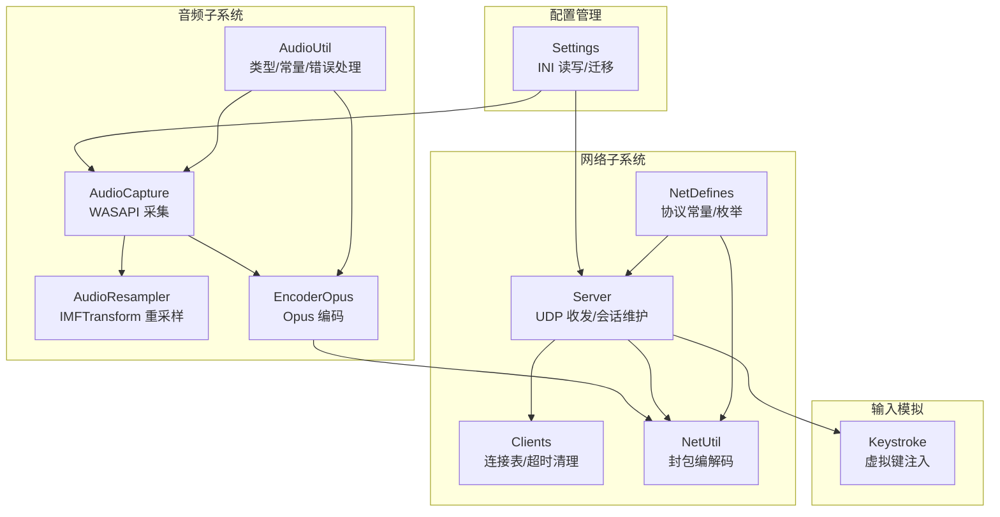
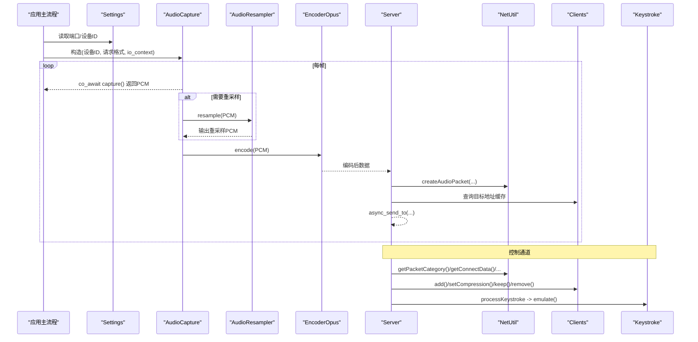
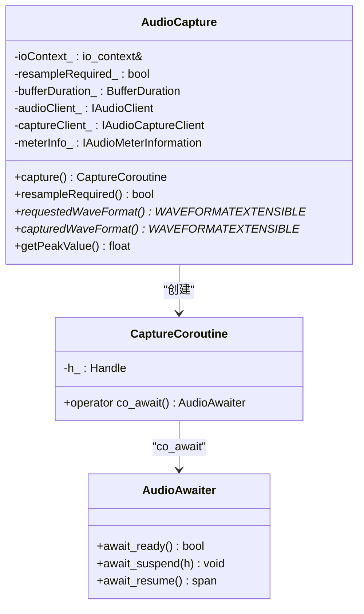
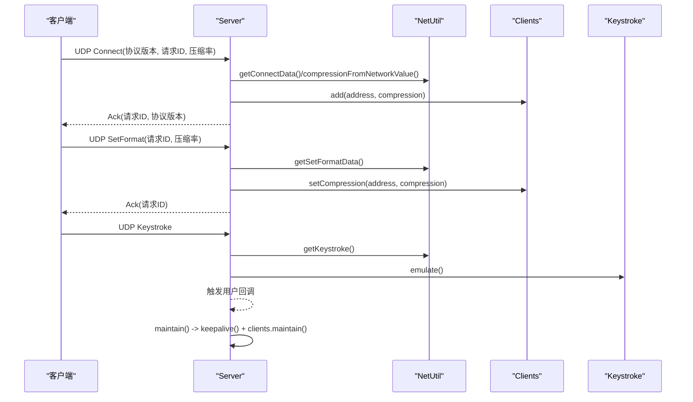
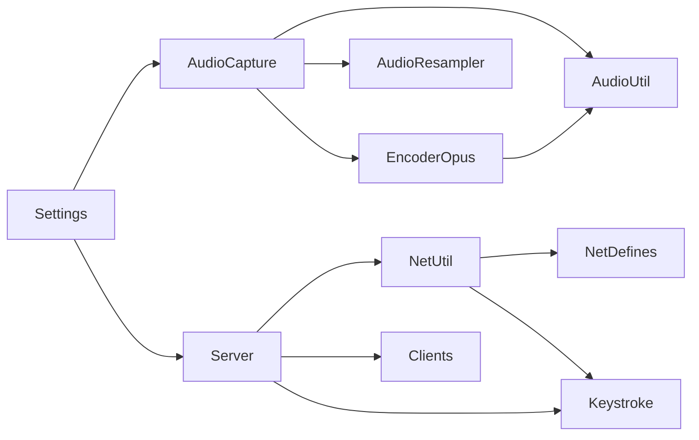

# 核心模块

<cite>
**本文引用的文件**   
- [AudioCapture.h](file://SoundRemote/AudioCapture.h)
- [AudioCapture.cpp](file://SoundRemote/AudioCapture.cpp)
- [AudioResampler.h](file://SoundRemote/AudioResampler.h)
- [EncoderOpus.h](file://SoundRemote/EncoderOpus.h)
- [Server.h](file://SoundRemote/Server.h)
- [Server.cpp](file://SoundRemote/Server.cpp)
- [Clients.h](file://SoundRemote/Clients.h)
- [Clients.cpp](file://SoundRemote/Clients.cpp)
- [NetUtil.h](file://SoundRemote/NetUtil.h)
- [NetUtil.cpp](file://SoundRemote/NetUtil.cpp)
- [Keystroke.h](file://SoundRemote/Keystroke.h)
- [Settings.h](file://SoundRemote/Settings.h)
- [Settings.cpp](file://SoundRemote/Settings.cpp)
- [AudioUtil.h](file://SoundRemote/AudioUtil.h)
- [NetDefines.h](file://SoundRemote/NetDefines.h)
</cite>

## 目录
1. [简介](#简介)
2. [项目结构](#项目结构)
3. [核心组件](#核心组件)
4. [架构总览](#架构总览)
5. [详细组件分析](#详细组件分析)
6. [依赖关系分析](#依赖关系分析)
7. [性能考虑](#性能考虑)
8. [故障排查指南](#故障排查指南)
9. [结论](#结论)
10. [附录](#附录)

## 简介
本文件为 SoundRemote-WinServer 的核心模块文档，聚焦于音频采集与编码、网络通信、输入模拟以及配置管理四大子系统。文档面向开发者与集成者，提供各模块的实现原理、接口参考、配置项说明、协作方式、性能优化建议与常见问题解决方案。读者无需深入底层即可理解系统如何完成“本地音频采集 -> 可选重采样 -> Opus 编码 -> UDP 广播 -> 客户端接收”的完整链路，以及如何通过键盘事件反向控制远端设备。

## 项目结构
仓库采用按功能划分的模块化组织方式：
- 音频子系统：AudioCapture、AudioResampler、EncoderOpus、AudioUtil
- 网络子系统：Server、Clients、NetUtil、NetDefines
- 输入模拟：Keystroke
- 配置管理：Settings
- 公共定义与工具：AudioUtil、NetDefines、Util（未在本节展开）

图表来源
- [AudioCapture.h:1-78](file://SoundRemote/AudioCapture.h#L1-L78)
- [AudioResampler.h:1-24](file://SoundRemote/AudioResampler.h#L1-L24)
- [EncoderOpus.h:1-37](file://SoundRemote/EncoderOpus.h#L1-L37)
- [Server.h:1-61](file://SoundRemote/Server.h#L1-L61)
- [Clients.h:1-60](file://SoundRemote/Clients.h#L1-L60)
- [NetUtil.h:1-41](file://SoundRemote/NetUtil.h#L1-L41)
- [NetDefines.h:1-69](file://SoundRemote/NetDefines.h#L1-L69)
- [Keystroke.h:1-41](file://SoundRemote/Keystroke.h#L1-L41)
- [Settings.h:1-38](file://SoundRemote/Settings.h#L1-L38)

章节来源
- [AudioCapture.h:1-78](file://SoundRemote/AudioCapture.h#L1-L78)
- [Server.h:1-61](file://SoundRemote/Server.h#L1-L61)
- [NetDefines.h:1-69](file://SoundRemote/NetDefines.h#L1-L69)

## 核心组件
本节概述各核心组件的职责与对外 API，后续章节将给出更深入的实现细节与流程图。

- 音频采集 AudioCapture
  - 基于 WASAPI 的共享模式采集或回环捕获，支持检测是否需要重采样，暴露协程式 capture() 以 yield PCM 数据块。
  - 关键 API：capture(), resampleRequired(), requestedWaveFormat(), capturedWaveFormat(), getPeakValue()。
- 重采样 AudioResampler
  - 使用 IMFTransform 在请求格式与实际设备格式不一致时进行重采样，输出到 streambuf。
  - 关键 API：resample(span<char>)。
- 编码器 EncoderOpus
  - 封装 Opus 编码器，提供帧大小与输入缓冲计算、encode 方法。
  - 关键 API：encode(const char*, char*), getFrameSize(), getInputSize()。
- 网络 Server
  - 基于 boost::asio UDP 的服务器端，负责握手、格式协商、心跳、断开、按键转发与音频广播。
  - 关键 API：sendAudio(), sendDisconnectBlocking(), setKeystrokeCallback(), onClientsUpdate()。
- 客户端集合 Clients
  - 维护已连接客户端地址与压缩率映射，支持监听器通知与超时清理。
  - 关键 API：add(), setCompression(), keep(), remove(), maintain(), addClientsListener()。
- 网络工具 NetUtil
  - 构建/解析数据包、获取本机 IPv4 列表、网络压缩值与内部枚举互转。
  - 关键 API：createAudioPacket(), createKeepAlivePacket(), createDisconnectPacket(), createAckConnectPacket(), createAckSetFormatPacket(), getPacketCategory(), getKeystroke(), getConnectData(), getSetFormatData(), compressionFromNetworkValue(), getLocalAddresses()。
- 输入模拟 Keystroke
  - 封装虚拟键码与修饰键，提供 emulate() 执行系统级输入注入。
  - 关键 API：emulate(), toString()。
- 配置 Settings
  - INI 配置文件读写，包含端口、更新检查开关、采集设备 ID 等；具备默认值填充与旧版本迁移逻辑。
  - 关键 API：getServerPort(), getClientPort(), getCheckUpdates(), getCaptureDevice(), setCheckUpdates(), setCaptureDevice()。

章节来源
- [AudioCapture.h:22-78](file://SoundRemote/AudioCapture.h#L22-L78)
- [AudioResampler.h:13-23](file://SoundRemote/AudioResampler.h#L13-L23)
- [EncoderOpus.h:9-36](file://SoundRemote/EncoderOpus.h#L9-L36)
- [Server.h:20-61](file://SoundRemote/Server.h#L20-L61)
- [Clients.h:15-60](file://SoundRemote/Clients.h#L15-L60)
- [NetUtil.h:11-40](file://SoundRemote/NetUtil.h#L11-L40)
- [Keystroke.h:6-41](file://SoundRemote/Keystroke.h#L6-L41)
- [Settings.h:11-38](file://SoundRemote/Settings.h#L11-L38)

## 架构总览
整体数据流与控制流如下：
- 音频路径：AudioCapture 采集 PCM -> 必要时经 AudioResampler 重采样 -> EncoderOpus 编码 -> Server.sendAudio 打包 UDP 广播。
- 控制路径：客户端发送 Connect/SetFormat/Keystroke/KeepAlive -> Server 解析并路由至 Clients/Keystroke/回调。
- 配置路径：Settings 读取端口、设备 ID 等，驱动 AudioCapture 与 Server 初始化。

图表来源
- [AudioCapture.cpp:118-200](file://SoundRemote/AudioCapture.cpp#L118-L200)
- [Server.cpp:18-28](file://SoundRemote/Server.cpp#L18-L28)
- [Server.cpp:80-125](file://SoundRemote/Server.cpp#L80-L125)
- [Server.cpp:127-166](file://SoundRemote/Server.cpp#L127-L166)
- [NetUtil.cpp:129-169](file://SoundRemote/NetUtil.cpp#L129-L169)
- [Clients.cpp:5-42](file://SoundRemote/Clients.cpp#L5-L42)

## 详细组件分析

### 音频采集与协程模型（AudioCapture）
- 实现要点
  - 使用 WASAPI IAudioClient/IAudioCaptureClient 在共享模式下初始化设备，自动判断是否支持请求格式，若不支持则启用重采样标记。
  - 通过自定义 AwaitableTimer 与协程 promise_type 实现可等待的 capture()，yield 每次可用的 PCM span。
  - 提供峰值电平查询 getPeakValue() 用于可视化或动态调整。
- 关键数据结构
  - CaptureCoroutine/promise_type：承载 PCM span 与挂起/恢复机制。
  - WAVEFORMATEXTENSIBLE*：请求与实际支持的波形格式指针。
- 复杂度与资源
  - 每帧 yield 操作为 O(n)（n 为帧样本数），内存分配集中在 CoTaskMemAlloc 与 buffer 管理。
  - 注意 BufferReleaser RAII 确保 ReleaseBuffer 被调用，避免泄漏。
- 错误处理
  - 统一通过 throwOnError/exitOnError 包装 HRESULT，定位 Location 枚举便于诊断。

图表来源
- [AudioCapture.h:22-78](file://SoundRemote/AudioCapture.h#L22-L78)
- [AudioCapture.h:80-143](file://SoundRemote/AudioCapture.h#L80-L143)

章节来源
- [AudioCapture.h:22-78](file://SoundRemote/AudioCapture.h#L22-L78)
- [AudioCapture.h:80-143](file://SoundRemote/AudioCapture.h#L80-L143)
- [AudioCapture.cpp:118-200](file://SoundRemote/AudioCapture.cpp#L118-L200)

### 重采样（AudioResampler）
- 实现要点
  - 基于 IMFTransform 建立输入/输出媒体类型，设置半滤波长度等属性，将输入 PCM 转换为输出格式。
  - 输出写入 boost::asio::streambuf，供上层消费。
- 接口
  - resample(span<char>)：将一段 PCM 送入变换管线。
- 注意事项
  - 需保证输入/输出格式一致且与 AudioCapture 的实际设备格式匹配。

章节来源
- [AudioResampler.h:13-23](file://SoundRemote/AudioResampler.h#L13-L23)

### 编码器（EncoderOpus）
- 实现要点
  - 根据采样率、声道数与压缩率初始化 Opus 编码器，提供静态方法计算帧大小与输入缓冲大小。
  - encode 将 16-bit signed int PCM 编码为 Opus 包，返回 0 表示 DTX（不发送）。
- 接口
  - encode(const char*, char*)
  - getFrameSize(SampleRate)
  - getInputSize(frameSize, Channels)
- 复杂度
  - 编码复杂度与帧长和比特率相关，典型 10ms 帧在 48kHz 下为 960 样本/声道。

章节来源
- [EncoderOpus.h:9-36](file://SoundRemote/EncoderOpus.h#L9-L36)
- [AudioUtil.h:29-39](file://SoundRemote/AudioUtil.h#L29-L39)

### 网络服务器（Server）
- 职责
  - 启动 UDP 接收协程，解析分类并分发到 connect/disconnect/setformat/keystroke/keepalive 处理器。
  - 维护客户端压缩率到地址列表的缓存，批量发送音频帧。
  - 定时任务：发送心跳、清理超时客户端。
- 关键流程
  - receive(): 循环异步接收，按类别分派。
  - sendAudio(): 选择类别（无压缩/Opus），组装包，遍历对应压缩率的客户端列表发送。
  - processConnect/processSetFormat：注册/更新客户端压缩率，返回 Ack。
  - processKeystroke：解析按键并注入系统输入，同时触发用户回调。
  - maintain(): 周期性 keepalive 与 clients.maintain()。
- 错误处理
  - 对 socket 异常与未知异常进行捕获并退出进程，避免不可恢复状态。

图表来源
- [Server.cpp:80-125](file://SoundRemote/Server.cpp#L80-L125)
- [Server.cpp:127-166](file://SoundRemote/Server.cpp#L127-L166)
- [Server.cpp:182-199](file://SoundRemote/Server.cpp#L182-L199)
- [NetUtil.cpp:193-218](file://SoundRemote/NetUtil.cpp#L193-L218)

章节来源
- [Server.h:20-61](file://SoundRemote/Server.h#L20-L61)
- [Server.cpp:18-28](file://SoundRemote/Server.cpp#L18-L28)
- [Server.cpp:80-125](file://SoundRemote/Server.cpp#L80-L125)
- [Server.cpp:127-166](file://SoundRemote/Server.cpp#L127-L166)
- [Server.cpp:182-199](file://SoundRemote/Server.cpp#L182-L199)

### 客户端集合（Clients）
- 职责
  - 线程安全地维护 address -> Client 映射，记录最后接触时间与压缩率。
  - 提供监听器机制，当集合变化时通知订阅者（如 Server 用于重建压缩率到地址的缓存）。
  - 定期清理超过阈值的客户端。
- 并发模型
  - 使用 shared_mutex 保护 clients_ 容器，监听器列表在程序启动和设备变更时修改，非同步访问。
- 接口
  - add/setCompression/keep/remove/removeAll/maintain/addClientsListener/removeClientsListener

章节来源
- [Clients.h:15-60](file://SoundRemote/Clients.h#L15-L60)
- [Clients.cpp:5-80](file://SoundRemote/Clients.cpp#L5-L80)

### 网络工具（NetUtil）
- 职责
  - 构建/解析各类数据包：音频、心跳、断开、ACK、按键、连接信息、格式设置。
  - 提供本机 IPv4 地址枚举与网络压缩值到内部枚举的转换。
- 协议要点
  - 固定头部：签名、类别、长度；数据区包含序列号、负载等。
  - 大端序字段用于签名与长度，小端序用于部分数据字段（见内部读写函数）。
- 接口
  - createAudioPacket/createKeepAlivePacket/createDisconnectPacket/createAckConnectPacket/createAckSetFormatPacket
  - getPacketCategory/getKeystroke/getConnectData/getSetFormatData/compressionFromNetworkValue/getLocalAddresses

章节来源
- [NetUtil.h:11-40](file://SoundRemote/NetUtil.h#L11-L40)
- [NetUtil.cpp:78-108](file://SoundRemote/NetUtil.cpp#L78-L108)
- [NetUtil.cpp:129-169](file://SoundRemote/NetUtil.cpp#L129-L169)
- [NetUtil.cpp:171-218](file://SoundRemote/NetUtil.cpp#L171-L218)

### 输入模拟（Keystroke）
- 职责
  - 封装虚拟键码与修饰键组合，提供 emulate() 执行系统级输入注入。
- 使用场景
  - 服务端收到 Keystroke 包后，解析并调用 emulate() 在本地执行按键动作，同时可触发上层回调。

章节来源
- [Keystroke.h:6-41](file://SoundRemote/Keystroke.h#L6-L41)
- [Server.cpp:155-162](file://SoundRemote/Server.cpp#L155-L162)

### 配置管理（Settings）
- 职责
  - 从 INI 文件加载/保存配置项，包括服务器端口、客户端端口、更新检查开关、采集设备 ID。
  - 首次运行或缺失键时写入默认值；兼容旧版本迁移逻辑。
- 接口
  - getServerPort/getClientPort/getCheckUpdates/getCaptureDevice
  - setCheckUpdates/setCaptureDevice

章节来源
- [Settings.h:11-38](file://SoundRemote/Settings.h#L11-L38)
- [Settings.cpp:24-33](file://SoundRemote/Settings.cpp#L24-L33)
- [Settings.cpp:67-106](file://SoundRemote/Settings.cpp#L67-L106)

## 依赖关系分析
- 低耦合高内聚
  - AudioCapture 仅依赖 AudioUtil 与 WASAPI；重采样与编码独立，通过 span<char> 传递数据。
  - Server 依赖 NetUtil 与 Clients，不直接感知音频细节。
  - NetUtil 依赖 NetDefines 与 Keystroke，保持协议层与业务层解耦。
- 外部依赖
  - boost::asio：异步 IO 与协程支持。
  - Windows WASAPI/Media Foundation：音频采集与重采样。
  - Opus：音频编码。
  - SimpleIni：INI 配置读写。
- 潜在循环依赖
  - 当前未见循环引用；Server 与 Clients 通过回调与接口交互，避免强耦合。

图表来源
- [AudioCapture.h:1-78](file://SoundRemote/AudioCapture.h#L1-L78)
- [EncoderOpus.h:1-37](file://SoundRemote/EncoderOpus.h#L1-L37)
- [Server.h:1-61](file://SoundRemote/Server.h#L1-L61)
- [NetUtil.h:1-41](file://SoundRemote/NetUtil.h#L1-L41)
- [Settings.h:1-38](file://SoundRemote/Settings.h#L1-L38)

章节来源
- [AudioUtil.h:24-169](file://SoundRemote/AudioUtil.h#L24-L169)
- [NetDefines.h:1-69](file://SoundRemote/NetDefines.h#L1-L69)

## 性能考虑
- 音频路径
  - 帧长与比特率权衡：10ms 帧在 48kHz 下平衡延迟与 CPU 占用；更高比特率提升音质但增加带宽与编码开销。
  - 重采样仅在设备不支持请求格式时启用，避免不必要的 CPU 消耗。
  - 使用 streambuf 减少拷贝，尽量零拷贝传递 PCM 片段。
- 网络路径
  - 按压缩率分组广播，避免重复构建包；使用 async_send_to 降低阻塞。
  - 心跳间隔与超时阈值需根据网络环境调优，避免误删活跃客户端。
- 协程与定时器
  - 使用 awaitable 与 steady_timer 实现非阻塞调度，避免忙轮询。
- 内存与对象生命周期
  - 使用 unique_ptr 与 CComPtr 管理 COM 对象与堆内存，RAII 释放，防止泄漏。

[本节为通用指导，不直接分析具体文件]

## 故障排查指南
- 音频采集失败
  - 检查设备 ID 是否正确，确认设备可用；查看 throwOnError 抛出的 Location 定位问题点。
  - 若 resampleRequired 为 true，确保 AudioResampler 输入/输出格式正确。
- 编码问题
  - 确认输入 PCM 为 16-bit signed int，帧大小与声道数匹配；DTX 返回 0 时不应发送包。
- 网络通信
  - 校验协议签名与类别；确认端口未被防火墙拦截；观察心跳与超时行为。
  - 若出现 operation_aborted，通常为关闭 socket 时的预期异常，应忽略。
- 配置问题
  - 检查 INI 文件是否存在与可读；缺失键将被迁移/补全；确认端口与设备 ID 有效。

章节来源
- [AudioUtil.h:130-169](file://SoundRemote/AudioUtil.h#L130-L169)
- [Server.cpp:111-125](file://SoundRemote/Server.cpp#L111-L125)
- [Settings.cpp:74-106](file://SoundRemote/Settings.cpp#L74-L106)

## 结论
SoundRemote-WinServer 的核心模块围绕“采集-重采样-编码-传输-控制”的主线设计，采用清晰的层次划分与协程化异步模型，具备良好的可扩展性与可维护性。通过合理的配置管理与健壮的错误处理，系统能够在不同硬件与网络环境下稳定工作。建议在部署时依据实际带宽与延迟需求调优帧长与比特率，并结合心跳策略优化客户端存活判定。

[本节为总结，不直接分析具体文件]

## 附录
- 协议常量与默认端口
  - 协议签名、类别、头部偏移、默认服务器/客户端端口等定义位于 NetDefines。
- 常用 API 路径参考
  - 音频采集与协程：[AudioCapture.h:22-78](file://SoundRemote/AudioCapture.h#L22-L78), [AudioCapture.h:80-143](file://SoundRemote/AudioCapture.h#L80-L143)
  - 重采样：[AudioResampler.h:13-23](file://SoundRemote/AudioResampler.h#L13-L23)
  - 编码：[EncoderOpus.h:9-36](file://SoundRemote/EncoderOpus.h#L9-L36)
  - 服务器收发与分发：[Server.cpp:80-125](file://SoundRemote/Server.cpp#L80-L125), [Server.cpp:127-166](file://SoundRemote/Server.cpp#L127-L166)
  - 客户端集合与监听：[Clients.cpp:5-80](file://SoundRemote/Clients.cpp#L5-L80)
  - 网络工具与封包：[NetUtil.cpp:129-169](file://SoundRemote/NetUtil.cpp#L129-L169), [NetUtil.cpp:171-218](file://SoundRemote/NetUtil.cpp#L171-L218)
  - 配置读写与迁移：[Settings.cpp:24-33](file://SoundRemote/Settings.cpp#L24-L33), [Settings.cpp:67-106](file://SoundRemote/Settings.cpp#L67-L106)