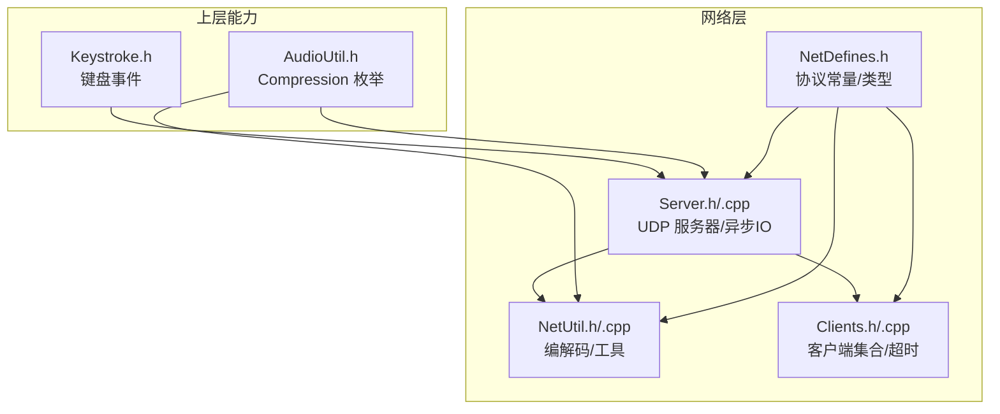
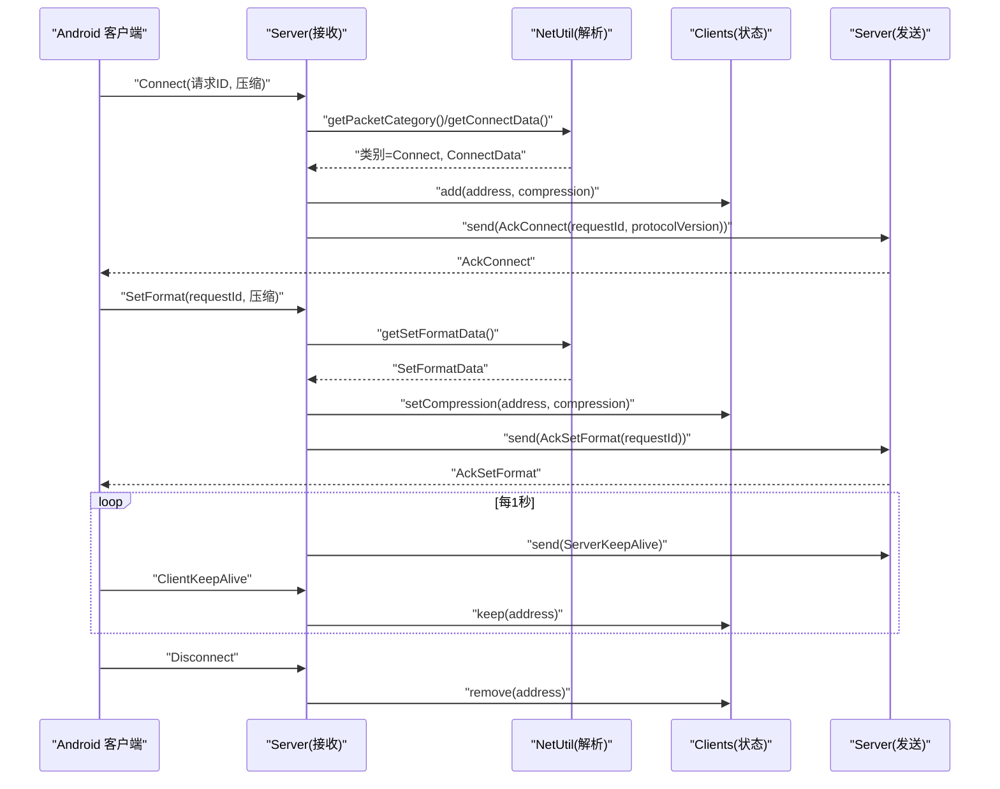
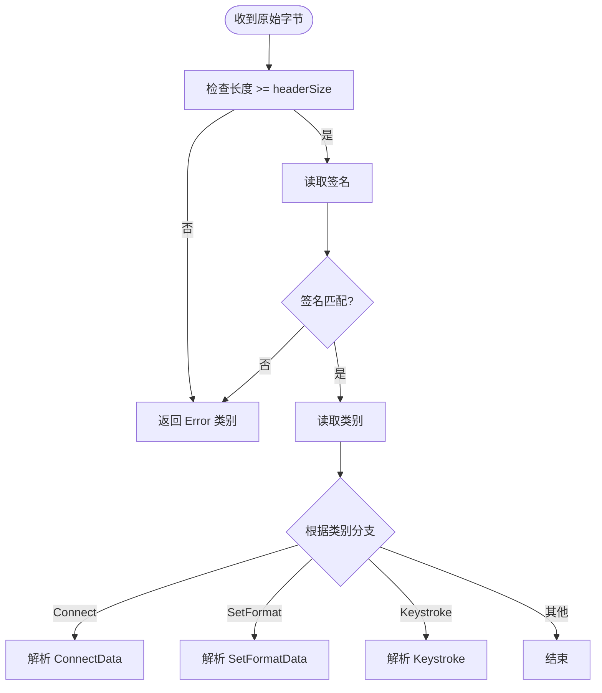
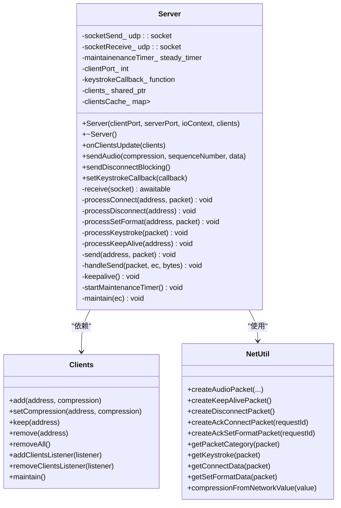
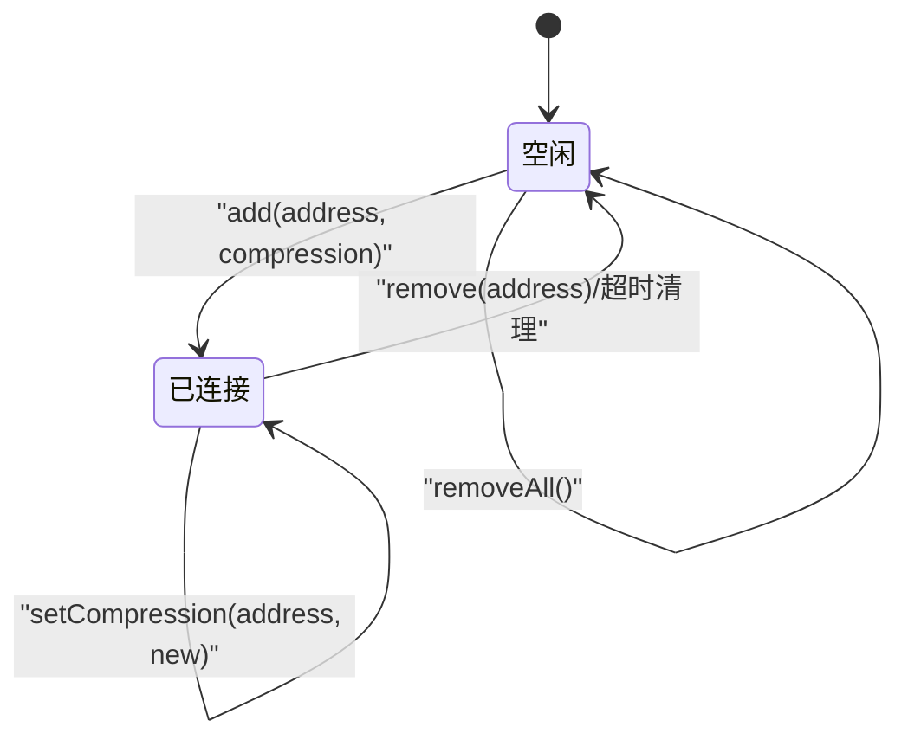
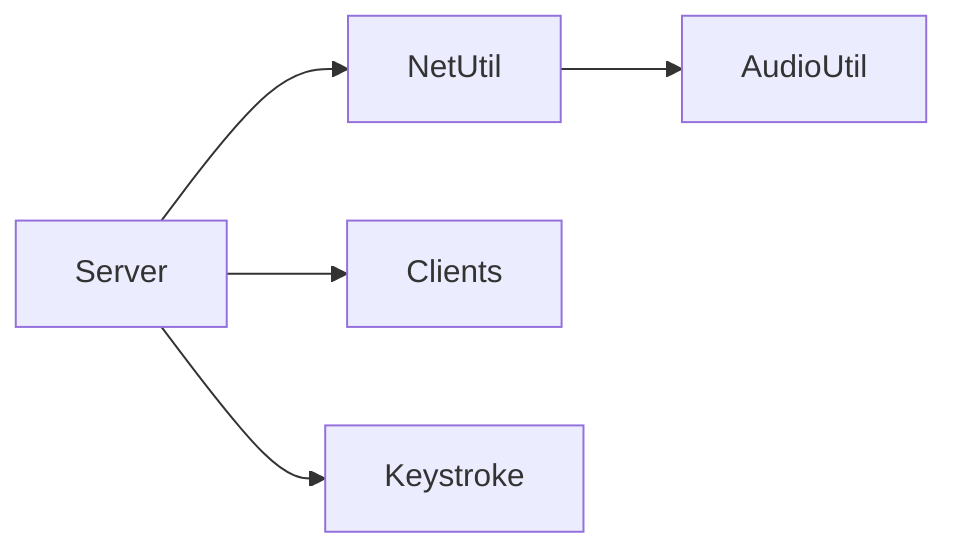
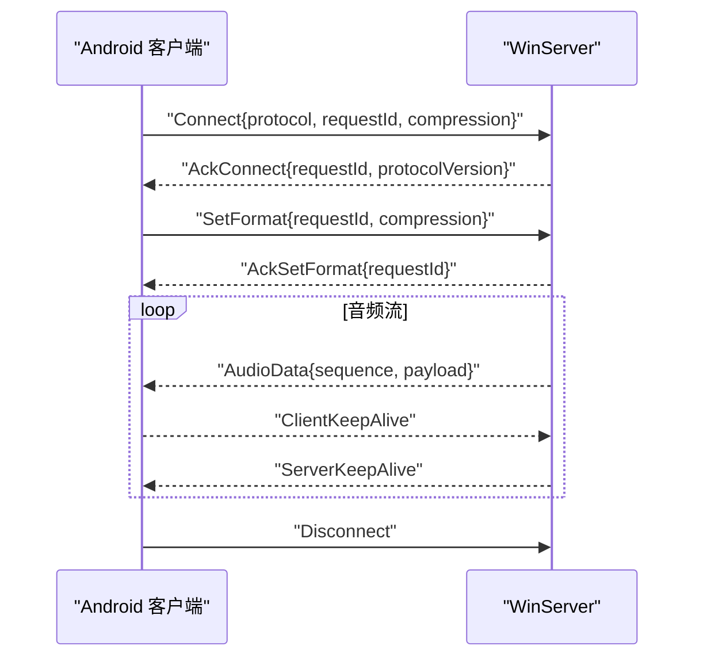

# 网络通信模块

<cite>
**本文引用的文件**   
- [NetDefines.h](file://SoundRemote/NetDefines.h)
- [NetUtil.h](file://SoundRemote/NetUtil.h)
- [NetUtil.cpp](file://SoundRemote/NetUtil.cpp)
- [Server.h](file://SoundRemote/Server.h)
- [Server.cpp](file://SoundRemote/Server.cpp)
- [Clients.h](file://SoundRemote/Clients.h)
- [Clients.cpp](file://SoundRemote/Clients.cpp)
- [AudioUtil.h](file://SoundRemote/AudioUtil.h)
- [Keystroke.h](file://SoundRemote/Keystroke.h)
- [NetUtilTest.cpp](file://Tests/NetUtilTest.cpp)
</cite>

## 目录
1. [简介](#简介)
2. [项目结构](#项目结构)
3. [核心组件](#核心组件)
4. [架构总览](#架构总览)
5. [详细组件分析](#详细组件分析)
6. [依赖关系分析](#依赖关系分析)
7. [性能考虑](#性能考虑)
8. [故障排查指南](#故障排查指南)
9. [结论](#结论)
10. [附录：协议规范与消息格式](#附录协议规范与消息格式)

## 简介
本文件为 SoundRemote-WinServer 的网络通信模块提供系统化文档，覆盖基于 Boost.Asio 的 UDP 服务器实现、客户端连接管理、网络协议定义与数据处理流程。重点说明 Server 类的异步 IO 处理、Clients 类的多客户端状态维护、NetUtil 的网络工具函数以及 NetDefines 的协议常量定义；并给出连接建立、数据包编解码、心跳检测机制、错误处理与重连策略，以及与 Android 客户端交互的流程与时序图。

## 项目结构
网络相关代码集中在 SoundRemote 目录下，按职责分层组织：
- 协议常量与类型：NetDefines.h
- 编解码与工具：NetUtil.h/.cpp
- 服务器与异步 IO：Server.h/.cpp
- 客户端集合与超时管理：Clients.h/.cpp
- 音频压缩枚举（与网络层映射）：AudioUtil.h
- 键盘事件封装：Keystroke.h

图表来源
- [NetDefines.h:1-69](file://SoundRemote/NetDefines.h#L1-L69)
- [NetUtil.h:1-41](file://SoundRemote/NetUtil.h#L1-L41)
- [NetUtil.cpp:1-218](file://SoundRemote/NetUtil.cpp#L1-L218)
- [Server.h:1-61](file://SoundRemote/Server.h#L1-L61)
- [Server.cpp:1-210](file://SoundRemote/Server.cpp#L1-L210)
- [Clients.h:1-60](file://SoundRemote/Clients.h#L1-L60)
- [Clients.cpp:1-125](file://SoundRemote/Clients.cpp#L1-L125)
- [AudioUtil.h:24-40](file://SoundRemote/AudioUtil.h#L24-L40)
- [Keystroke.h:1-41](file://SoundRemote/Keystroke.h#L1-L41)

章节来源
- [NetDefines.h:1-69](file://SoundRemote/NetDefines.h#L1-L69)
- [NetUtil.h:1-41](file://SoundRemote/NetUtil.h#L1-L41)
- [NetUtil.cpp:1-218](file://SoundRemote/NetUtil.cpp#L1-L218)
- [Server.h:1-61](file://SoundRemote/Server.h#L1-L61)
- [Server.cpp:1-210](file://SoundRemote/Server.cpp#L1-L210)
- [Clients.h:1-60](file://SoundRemote/Clients.h#L1-L60)
- [Clients.cpp:1-125](file://SoundRemote/Clients.cpp#L1-L125)
- [AudioUtil.h:24-40](file://SoundRemote/AudioUtil.h#L24-L40)
- [Keystroke.h:1-41](file://SoundRemote/Keystroke.h#L1-L41)

## 核心组件
- 协议常量与类型（NetDefines）
  - 定义包签名、类别、大小字段、偏移量、各消息体大小、默认端口、输入缓冲大小等。
  - 提供协议版本、地址别名、默认端口等全局常量。
- 网络工具（NetUtil）
  - 提供本地 IPv4 地址枚举、网络压缩值到内部枚举的转换。
  - 提供各类包的创建与解析：音频数据、心跳、断开、Ack 连接/设置格式、按键事件、连接参数、格式设置参数等。
- 服务器（Server）
  - 使用 Boost.Asio 协程接收 UDP 报文，按类别分发处理。
  - 维护发送 socket，向客户端广播音频、心跳、断开通知。
  - 定时任务触发心跳与客户端清理。
- 客户端集合（Clients）
  - 线程安全地维护已连接客户端列表（地址+压缩方式），支持更新压缩方式、保持活跃、移除、全清。
  - 通过监听器回调通知上层客户端列表变化。
  - 基于最后接触时间进行超时清理。

章节来源
- [NetDefines.h:1-69](file://SoundRemote/NetDefines.h#L1-L69)
- [NetUtil.h:1-41](file://SoundRemote/NetUtil.h#L1-L41)
- [NetUtil.cpp:1-218](file://SoundRemote/NetUtil.cpp#L1-L218)
- [Server.h:1-61](file://SoundRemote/Server.h#L1-L61)
- [Server.cpp:1-210](file://SoundRemote/Server.cpp#L1-L210)
- [Clients.h:1-60](file://SoundRemote/Clients.h#L1-L60)
- [Clients.cpp:1-125](file://SoundRemote/Clients.cpp#L1-L125)

## 架构总览
整体采用“单进程 + 协程”的 UDP 服务器模型：
- 接收端：一个 UDP socket 绑定服务端端口，协程循环异步接收报文。
- 发送端：另一个 UDP socket 用于向客户端端口发送响应或广播数据。
- 协议解析：统一由 NetUtil 完成，确保一致性与可测试性。
- 连接管理：Clients 集中维护客户端状态，Server 仅负责转发与调度。
- 心跳与保活：Server 定时发送心跳，客户端回显以刷新最后接触时间。

图表来源
- [Server.cpp:80-125](file://SoundRemote/Server.cpp#L80-L125)
- [Server.cpp:127-166](file://SoundRemote/Server.cpp#L127-L166)
- [Server.cpp:182-209](file://SoundRemote/Server.cpp#L182-L209)
- [NetUtil.cpp:171-217](file://SoundRemote/NetUtil.cpp#L171-L217)
- [Clients.cpp:5-42](file://SoundRemote/Clients.cpp#L5-L42)

## 详细组件分析

### 协议常量与类型（NetDefines）
- 包头字段
  - 签名（SignatureType）、类别（CategoryType）、长度（SizeType）。
  - 固定偏移：signatureOffset、categoryOffset、sizeOffset、dataOffset。
- 数据类型
  - 协议版本、请求ID、压缩类型、键码、修饰键、序列号等。
- 消息体大小
  - 按键、Ack、序列号、音频数据偏移等。
- 类别枚举
  - Error、Connect、Disconnect、SetFormat、Keystroke、AudioDataUncompressed、AudioDataOpus、ClientKeepAlive、ServerKeepAlive、Ack。
- 全局常量
  - 协议版本、默认服务端/客户端端口、输入包大小。

章节来源
- [NetDefines.h:1-69](file://SoundRemote/NetDefines.h#L1-L69)

### 网络工具（NetUtil）
- 编包函数
  - createAudioPacket：组装音频数据包（含头部、序列号、载荷）。
  - createKeepAlivePacket / createDisconnectPacket：构造控制类小包。
  - createAckConnectPacket / createAckSetFormatPacket：构造 Ack 响应，包含请求ID与可选自定义数据（如协议版本）。
- 解包函数
  - getPacketCategory：校验签名与长度后返回类别。
  - getKeystroke：解析按键与修饰位域。
  - getConnectData / getSetFormatData：解析连接与格式设置参数。
- 辅助函数
  - getLocalAddresses：获取本机 IPv4 地址列表。
  - compressionFromNetworkValue：将网络压缩值映射到 Audio::Compression。

图表来源
- [NetUtil.cpp:171-217](file://SoundRemote/NetUtil.cpp#L171-L217)

章节来源
- [NetUtil.h:1-41](file://SoundRemote/NetUtil.h#L1-L41)
- [NetUtil.cpp:1-218](file://SoundRemote/NetUtil.cpp#L1-L218)

### 服务器（Server）
- 生命周期
  - 构造函数中启动接收协程与定时维护任务。
  - 析构时关闭收发 socket。
- 接收协程 receive
  - 无限循环异步接收 UDP 报文，调用 NetUtil 解析类别后分派到对应处理器。
  - 捕获系统异常与未知异常，记录错误并退出进程。
- 处理器
  - processConnect：解析连接参数，注册客户端，回复 AckConnect。
  - processSetFormat：更新客户端压缩方式，回复 AckSetFormat。
  - processKeystroke：解析按键并模拟输入，同时触发回调。
  - processKeepAlive：刷新客户端最后接触时间。
- 发送
  - send：异步发送到客户端端口，使用 shared_ptr 保证回调期间内存有效。
  - handleSend：发送完成回调，若出错则抛出运行时异常。
- 广播
  - sendAudio：按压缩类型选择类别，构建音频包，遍历缓存地址批量发送。
  - sendDisconnectBlocking：阻塞式向所有已知客户端发送断开包。
  - keepalive：周期性向所有客户端发送心跳。
- 维护
  - startMaintenanceTimer/maintain：每秒触发一次，执行心跳与客户端清理。

图表来源
- [Server.h:1-61](file://SoundRemote/Server.h#L1-L61)
- [Server.cpp:1-210](file://SoundRemote/Server.cpp#L1-L210)
- [Clients.h:1-60](file://SoundRemote/Clients.h#L1-L60)
- [Clients.cpp:1-125](file://SoundRemote/Clients.cpp#L1-L125)
- [NetUtil.h:1-41](file://SoundRemote/NetUtil.h#L1-L41)
- [NetUtil.cpp:1-218](file://SoundRemote/NetUtil.cpp#L1-L218)

章节来源
- [Server.h:1-61](file://SoundRemote/Server.h#L1-L61)
- [Server.cpp:1-210](file://SoundRemote/Server.cpp#L1-L210)

### 客户端集合（Clients）
- 数据结构
  - 内部 Client：保存压缩方式与最后接触时间。
  - 外部 ClientInfo：对外暴露的地址与压缩方式组合。
- 并发安全
  - 使用互斥锁保护客户端容器与状态变更。
- 功能
  - add：新增或更新客户端压缩方式，并触发更新通知。
  - setCompression：仅当压缩方式变化时更新。
  - keep：刷新最后接触时间。
  - remove/removeAll：删除单个或全部客户端。
  - maintain：扫描并移除超过阈值的客户端，必要时通知。
  - 监听器：add/remove 监听器，并在状态变化时推送当前列表快照。

图表来源
- [Clients.h:15-52](file://SoundRemote/Clients.h#L15-L52)
- [Clients.cpp:5-80](file://SoundRemote/Clients.cpp#L5-L80)

章节来源
- [Clients.h:1-60](file://SoundRemote/Clients.h#L1-L60)
- [Clients.cpp:1-125](file://SoundRemote/Clients.cpp#L1-L125)

### 音频与按键集成
- 音频压缩
  - Audio::Compression 枚举与网络压缩值通过 NetUtil::compressionFromNetworkValue 双向映射。
  - 未压缩与 Opus 压缩分别对应不同类别，便于客户端区分。
- 按键事件
  - Keystroke 从网络包解析后，调用 emulate 在本地模拟输入，并可触发回调供上层处理。

章节来源
- [AudioUtil.h:24-40](file://SoundRemote/AudioUtil.h#L24-L40)
- [NetUtil.cpp:110-127](file://SoundRemote/NetUtil.cpp#L110-L127)
- [Keystroke.h:1-41](file://SoundRemote/Keystroke.h#L1-L41)
- [Server.cpp:155-162](file://SoundRemote/Server.cpp#L155-L162)

## 依赖关系分析
- 低耦合设计
  - Server 仅依赖抽象接口（Clients）与工具（NetUtil），不直接操作底层 socket 细节之外的逻辑。
  - NetUtil 无外部副作用，纯函数式编解码，易于单元测试。
- 关键依赖链
  - Server -> NetUtil（编解码）
  - Server -> Clients（连接管理）
  - NetUtil -> AudioUtil（压缩映射）
  - Server -> Keystroke（按键模拟）

图表来源
- [Server.h:1-61](file://SoundRemote/Server.h#L1-L61)
- [NetUtil.h:1-41](file://SoundRemote/NetUtil.h#L1-L41)
- [Clients.h:1-60](file://SoundRemote/Clients.h#L1-L60)
- [AudioUtil.h:24-40](file://SoundRemote/AudioUtil.h#L24-L40)
- [Keystroke.h:1-41](file://SoundRemote/Keystroke.h#L1-L41)

章节来源
- [Server.cpp:1-210](file://SoundRemote/Server.cpp#L1-L210)
- [NetUtil.cpp:1-218](file://SoundRemote/NetUtil.cpp#L1-L218)
- [Clients.cpp:1-125](file://SoundRemote/Clients.cpp#L1-L125)

## 性能考虑
- 零拷贝思路
  - 使用 std::span 避免不必要的复制，仅在最终发送时构造 vector<char>。
- 批量发送
  - onClientsUpdate 将客户端按压缩方式分组缓存，减少重复查找与分支判断。
- 定时器粒度
  - 心跳间隔为 1 秒，兼顾实时性与开销；可根据实际网络环境调整。
- 内存管理
  - 发送路径使用 shared_ptr 传递包对象，确保异步回调期间内存存活。
- 错误快速失败
  - 接收路径遇到非预期错误直接终止进程，避免进入不稳定状态。

[本节为通用指导，无需源码引用]

## 故障排查指南
- 常见错误定位
  - 接收异常：查看 receive 中的异常捕获与日志输出位置。
  - 发送异常：检查 handleSend 的错误处理逻辑。
  - 定时器异常：关注 maintain 的错误分支。
- 调试建议
  - 使用 NetUtilTest 验证编解码正确性。
  - 抓包确认握手与心跳时序是否符合协议。
  - 核对端口配置是否与客户端一致。

章节来源
- [Server.cpp:111-124](file://SoundRemote/Server.cpp#L111-L124)
- [Server.cpp:176-180](file://SoundRemote/Server.cpp#L176-L180)
- [Server.cpp:187-199](file://SoundRemote/Server.cpp#L187-L199)
- [NetUtilTest.cpp:1-133](file://Tests/NetUtilTest.cpp#L1-L133)

## 结论
该网络模块以清晰的协议定义与工具函数为基础，结合 Boost.Asio 协程实现高吞吐的 UDP 收发；通过独立的客户端集合管理连接状态与超时，配合心跳机制保障连接可靠性。整体设计具备良好可测试性与扩展性，适合与 Android 客户端协同工作。

[本节为总结，无需源码引用]

## 附录：协议规范与消息格式

### 包头与字段
- 固定字段
  - 签名：固定值，用于协议识别。
  - 类别：标识消息类型。
  - 长度：包体长度。
- 数据区起始偏移
  - 不同类别的数据区起始位置不同，例如音频数据前包含序列号。

章节来源
- [NetDefines.h:10-32](file://SoundRemote/NetDefines.h#L10-L32)

### 类别与用途
- Connect：客户端发起连接，携带协议版本、请求ID、压缩方式。
- Ack：服务器应答，包含请求ID与可选自定义数据（如协议版本）。
- SetFormat：客户端请求设置音频格式（压缩方式）。
- Keystroke：按键事件上报。
- AudioDataUncompressed / AudioDataOpus：音频数据流。
- ClientKeepAlive / ServerKeepAlive：心跳保活。
- Disconnect：主动断开。

章节来源
- [NetDefines.h:47-58](file://SoundRemote/NetDefines.h#L47-L58)

### 消息体示例（文字描述）
- Connect
  - 数据区：协议版本(uint8)、请求ID(uint16 BE)、压缩(uint8)。
- AckConnect
  - 数据区：请求ID(uint16 BE)、协议版本(uint8)、填充字节。
- AckSetFormat
  - 数据区：请求ID(uint16 BE)。
- SetFormat
  - 数据区：请求ID(uint16 BE)、压缩(uint8)。
- Keystroke
  - 数据区：键码(uint8)、修饰键(uint8)。
- AudioData
  - 数据区：序列号(uint32 BE)、音频载荷。
- KeepAlive/Disconnect
  - 无数据区。

章节来源
- [NetDefines.h:33-43](file://SoundRemote/NetDefines.h#L33-L43)
- [NetUtil.cpp:154-169](file://SoundRemote/NetUtil.cpp#L154-L169)
- [NetUtil.cpp:182-205](file://SoundRemote/NetUtil.cpp#L182-L205)
- [NetUtil.cpp:129-140](file://SoundRemote/NetUtil.cpp#L129-L140)

### 与 Android 客户端交互流程
- 连接建立
  - 客户端发送 Connect，服务器解析并注册客户端，返回 AckConnect。
- 格式协商
  - 客户端发送 SetFormat，服务器更新压缩方式并返回 AckSetFormat。
- 数据传输
  - 服务器按压缩方式选择类别，发送音频数据；客户端按需回显心跳。
- 保活与清理
  - 服务器周期发送心跳；客户端回显心跳刷新最后接触时间；超时自动清理。
- 断开
  - 任一方发送 Disconnect，服务器移除客户端。

图表来源
- [Server.cpp:127-153](file://SoundRemote/Server.cpp#L127-L153)
- [NetUtil.cpp:193-205](file://SoundRemote/NetUtil.cpp#L193-L205)
- [NetUtil.cpp:154-169](file://SoundRemote/NetUtil.cpp#L154-L169)

### 错误处理与重连策略
- 服务器侧
  - 接收异常：记录错误并退出进程，防止不可恢复状态。
  - 发送异常：抛出运行时异常，由上层决定处理策略。
  - 定时器异常：忽略中止信号，其他错误抛出异常。
- 客户端侧（Android）
  - 建议在客户端实现指数退避重连，并在握手失败时重置请求ID。
  - 心跳超时后主动断开并重试连接。

章节来源
- [Server.cpp:111-124](file://SoundRemote/Server.cpp#L111-L124)
- [Server.cpp:176-180](file://SoundRemote/Server.cpp#L176-L180)
- [Server.cpp:187-199](file://SoundRemote/Server.cpp#L187-L199)