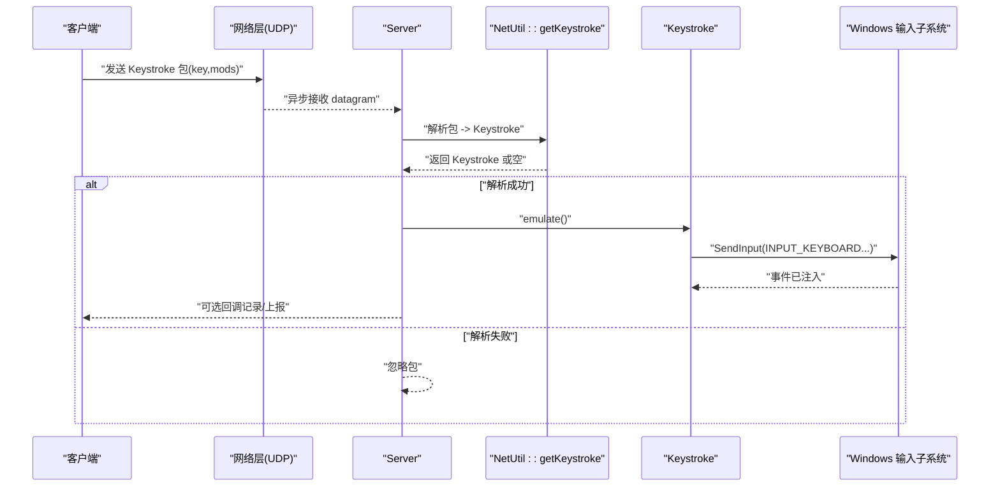
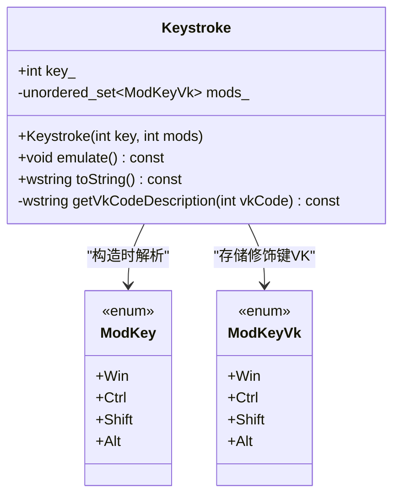
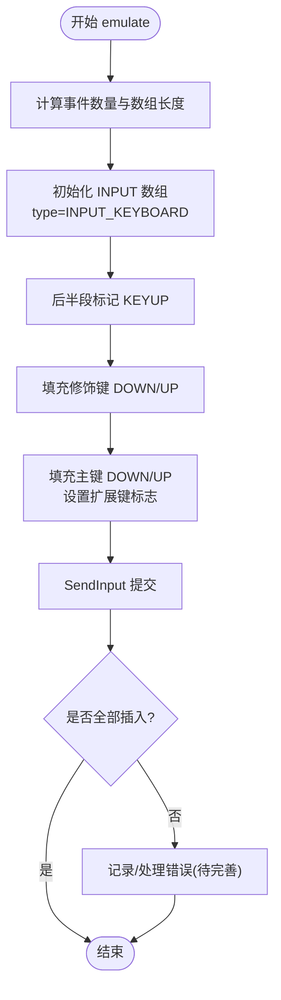
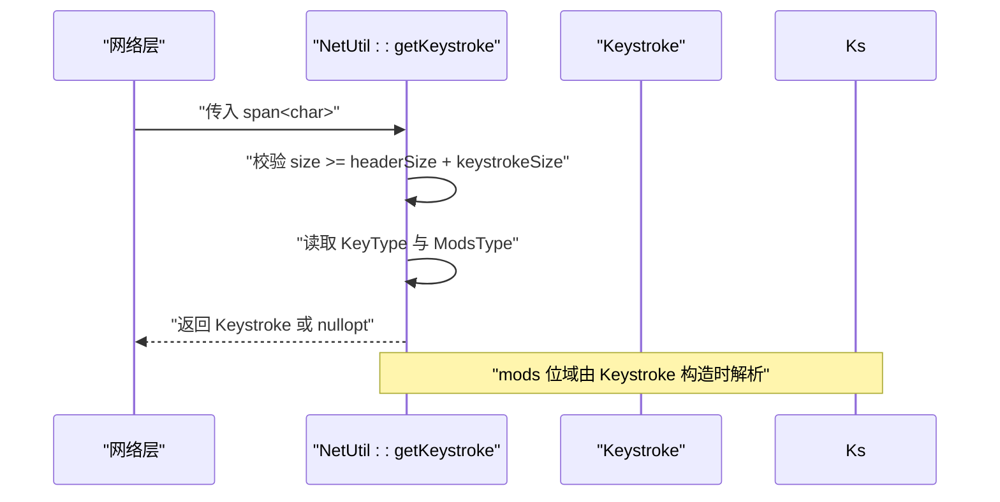
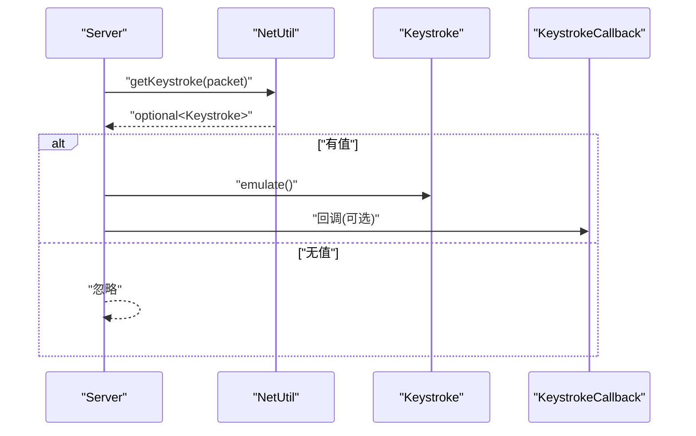
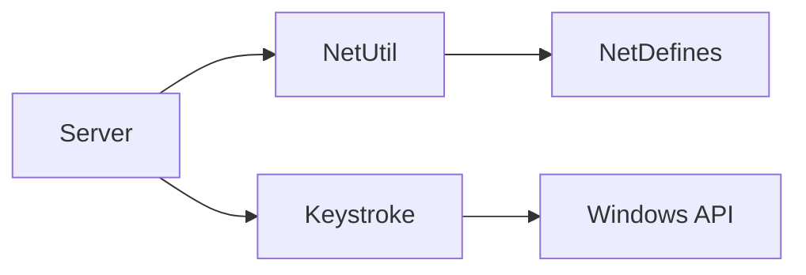

# 输入模拟模块

<cite>
**本文引用的文件**   
- [Keystroke.h](file://SoundRemote/Keystroke.h)
- [Keystroke.cpp](file://SoundRemote/Keystroke.cpp)
- [NetDefines.h](file://SoundRemote/NetDefines.h)
- [NetUtil.h](file://SoundRemote/NetUtil.h)
- [NetUtil.cpp](file://SoundRemote/NetUtil.cpp)
- [Server.h](file://SoundRemote/Server.h)
- [Server.cpp](file://SoundRemote/Server.cpp)
- [Settings.h](file://SoundRemote/Settings.h)
- [SoundRemoteApp.cpp](file://SoundRemote/SoundRemoteApp.cpp)
- [README.md](file://README.md)
- [KeystrokeTest.cpp](file://Tests/KeystrokeTest.cpp)
</cite>

## 目录
1. [简介](#简介)
2. [项目结构](#项目结构)
3. [核心组件](#核心组件)
4. [架构总览](#架构总览)
5. [详细组件分析](#详细组件分析)
6. [依赖关系分析](#依赖关系分析)
7. [性能考量](#性能考量)
8. [故障排查指南](#故障排查指南)
9. [结论](#结论)
10. [附录](#附录)

## 简介
本章节面向 SoundRemote-WinServer 的“输入模拟模块”，聚焦 Keystroke 类如何基于 Windows 输入系统实现键盘事件注入，以及与网络层、服务器层的集成方式。文档涵盖：
- 虚拟键码与修饰键映射
- 按键事件注入机制（SendInput）
- 安全限制与兼容性说明
- 键盘事件的接收、解析、验证与执行流程
- 快捷键映射配置思路、事件过滤方案
- 与网络模块的集成与错误处理策略
- 使用示例与常见问题解决方案

## 项目结构
输入模拟相关代码主要分布在以下位置：
- 输入模拟核心：Keystroke.h / Keystroke.cpp
- 网络协议定义与工具：NetDefines.h / NetUtil.h / NetUtil.cpp
- 服务端处理与回调：Server.h / Server.cpp
- 应用界面展示（日志显示）：SoundRemoteApp.cpp
- 设置接口（用于扩展快捷键映射配置）：Settings.h
- 单元测试：Tests/KeystrokeTest.cpp
- 项目说明：README.md

```mermaid
graph TB
subgraph "输入模拟"
K["Keystroke<br/>构造/toString/emulate"]
end
subgraph "网络层"
ND["NetDefines<br/>包格式/类型定义"]
NU["NetUtil<br/>getKeystroke/解析"]
end
subgraph "服务端"
S["Server<br/>processKeystroke/回调"]
end
subgraph "UI"
UI["SoundRemoteApp<br/>显示最近按键"]
end
subgraph "设置"
ST["Settings<br/>可扩展为快捷键映射配置"]
end
ND --> NU
NU --> S
S --> K
S --> UI
ST -.-> S
```

图表来源
- [NetDefines.h:1-69](file://SoundRemote/NetDefines.h#L1-L69)
- [NetUtil.cpp:171-191](file://SoundRemote/NetUtil.cpp#L171-L191)
- [Server.cpp:155-162](file://SoundRemote/Server.cpp#L155-L162)
- [Keystroke.h:6-40](file://SoundRemote/Keystroke.h#L6-L40)
- [Keystroke.cpp:20-52](file://SoundRemote/Keystroke.cpp#L20-L52)
- [SoundRemoteApp.cpp:449-463](file://SoundRemote/SoundRemoteApp.cpp#L449-L463)
- [Settings.h:11-37](file://SoundRemote/Settings.h#L11-L37)

章节来源
- [README.md:1-14](file://README.md#L1-L14)
- [Keystroke.h:6-40](file://SoundRemote/Keystroke.h#L6-L40)
- [Keystroke.cpp:20-52](file://SoundRemote/Keystroke.cpp#L20-L52)
- [NetDefines.h:1-69](file://SoundRemote/NetDefines.h#L1-L69)
- [NetUtil.cpp:171-191](file://SoundRemote/NetUtil.cpp#L171-L191)
- [Server.cpp:155-162](file://SoundRemote/Server.cpp#L155-L162)
- [SoundRemoteApp.cpp:449-463](file://SoundRemote/SoundRemoteApp.cpp#L449-L463)
- [Settings.h:11-37](file://SoundRemote/Settings.h#L11-L37)

## 核心组件
- Keystroke：封装一次按键动作（主键 + 修饰键集合），提供字符串描述与注入方法 emulate()。
- Net::Packet：定义网络包头部与数据字段，包括键盘数据包格式（KeyType + ModsType）。
- NetUtil::getKeystroke：从网络包中解析出 key 与 mods，构造 Keystroke 对象。
- Server::processKeystroke：根据类别分发到键盘处理，调用 getKeystroke 并执行 emulate，随后触发可选回调。
- Settings：当前未直接参与键盘逻辑，但可作为未来快捷键映射配置的持久化载体。

章节来源
- [Keystroke.h:6-40](file://SoundRemote/Keystroke.h#L6-L40)
- [Keystroke.cpp:20-52](file://SoundRemote/Keystroke.cpp#L20-L52)
- [NetDefines.h:17-28](file://SoundRemote/NetDefines.h#L17-L28)
- [NetUtil.cpp:182-191](file://SoundRemote/NetUtil.cpp#L182-L191)
- [Server.cpp:155-162](file://SoundRemote/Server.cpp#L155-L162)
- [Settings.h:11-37](file://SoundRemote/Settings.h#L11-L37)

## 架构总览
下图展示了从客户端发送键盘事件到服务端注入的完整链路。



图表来源
- [Server.cpp:80-103](file://SoundRemote/Server.cpp#L80-L103)
- [Server.cpp:155-162](file://SoundRemote/Server.cpp#L155-L162)
- [NetUtil.cpp:182-191](file://SoundRemote/NetUtil.cpp#L182-L191)
- [Keystroke.cpp:20-52](file://SoundRemote/Keystroke.cpp#L20-L52)

## 详细组件分析

### Keystroke 类设计
- 职责
  - 保存一次按键的主键（虚拟键码）与修饰键集合（Win/Ctrl/Shift/Alt）。
  - 将修饰键位图转换为内部集合，便于枚举和去重。
  - 生成可读字符串（如 “Ctrl + Shift + W”）。
  - 通过 SendInput 注入键盘事件。

- 关键数据结构
  - 修饰键位域 ModKey：用于构造时解析 mods 参数。
  - 修饰键虚拟键码 ModKeyVk：对应 Windows VK 值，用于注入。
  - 成员 key_：主键虚拟键码。
  - 成员 mods_：修饰键集合（无序集）。

- 重要行为
  - 构造函数：按位解析 mods，填充 mods_。
  - toString：拼接修饰键名称与主键描述。
  - emulate：批量构建 INPUT 数组，先按下所有修饰键，再按下主键，然后依次释放主键与修饰键，最后调用 SendInput 一次性提交。



图表来源
- [Keystroke.h:6-40](file://SoundRemote/Keystroke.h#L6-L40)
- [Keystroke.cpp:7-18](file://SoundRemote/Keystroke.cpp#L7-L18)

章节来源
- [Keystroke.h:6-40](file://SoundRemote/Keystroke.h#L6-L40)
- [Keystroke.cpp:7-18](file://SoundRemote/Keystroke.cpp#L7-L18)
- [Keystroke.cpp:54-77](file://SoundRemote/Keystroke.cpp#L54-L77)
- [Keystroke.cpp:79-152](file://SoundRemote/Keystroke.cpp#L79-L152)

### 虚拟键码映射与描述
- 内置特殊键名映射：浏览器控制键、媒体键、启动键、睡眠、打印屏幕、暂停等。
- 通用键名获取：通过 MapVirtualKeyW 将 VK 转为扫描码，必要时标记扩展键标志，再用 GetKeyNameTextW 获取本地化键名。
- 扩展键处理：对右 Ctrl、右 Alt、方向键、编辑键、数字键区除号、Win/App 键等显式设置扩展标志，确保兼容不同键盘布局与驱动。

章节来源
- [Keystroke.cpp:79-152](file://SoundRemote/Keystroke.cpp#L79-L152)

### 按键事件注入机制
- 事件序列
  - 计算需要的事件数量：修饰键数 + 主键，每个键包含 KEYDOWN 与 KEYUP，共两倍。
  - 初始化 INPUT 数组，前半段为 KEYDOWN，后半段为 KEYUP。
  - 将修饰键分别写入首尾对称位置，保证按下顺序与释放顺序一致。
  - 中间一对为主键的 KEYDOWN/KEYUP，并设置扩展键标志。
  - 调用 SendInput 一次性提交，减少上下文切换与调度开销。
- 返回值检查：若插入事件数不等于预期，则存在错误（当前为 TODO 占位）。



图表来源
- [Keystroke.cpp:20-52](file://SoundRemote/Keystroke.cpp#L20-L52)

章节来源
- [Keystroke.cpp:20-52](file://SoundRemote/Keystroke.cpp#L20-L52)

### 网络协议与解析
- 键盘数据包格式
  - 头部：签名、类别、长度。
  - 数据体：KeyType（主键虚拟键码）、ModsType（修饰键位域）。
- 解析流程
  - 校验包大小与签名。
  - 读取 dataOffset 后的 KeyType 与 ModsType。
  - 构造 Keystroke 对象并返回。



图表来源
- [NetDefines.h:17-28](file://SoundRemote/NetDefines.h#L17-L28)
- [NetUtil.cpp:182-191](file://SoundRemote/NetUtil.cpp#L182-L191)

章节来源
- [NetDefines.h:17-28](file://SoundRemote/NetDefines.h#L17-L28)
- [NetUtil.cpp:182-191](file://SoundRemote/NetUtil.cpp#L182-L191)

### 服务端处理与回调
- 接收循环：异步接收 UDP 数据报，解析类别后分派。
- 键盘处理：
  - 调用 NetUtil::getKeystroke 解析。
  - 若成功，调用 Keystroke::emulate 注入。
  - 若注册了回调，则触发 KeystrokeCallback，供 UI 或其他模块记录。



图表来源
- [Server.cpp:155-162](file://SoundRemote/Server.cpp#L155-L162)
- [Server.h:22](file://SoundRemote/Server.h#L22)

章节来源
- [Server.cpp:80-103](file://SoundRemote/Server.cpp#L80-L103)
- [Server.cpp:155-162](file://SoundRemote/Server.cpp#L155-L162)
- [Server.h:22](file://SoundRemote/Server.h#L22)

### UI 展示与日志
- 界面预留了“最近按键”列表控件，用于显示收到的按键信息。
- 通常通过 KeystrokeCallback 将 toString() 结果追加到该控件。

章节来源
- [SoundRemoteApp.cpp:449-463](file://SoundRemote/SoundRemoteApp.cpp#L449-L463)

### 快捷键映射配置与事件过滤
- 现状
  - 当前代码未实现快捷键映射配置与过滤逻辑。
  - Settings 提供了配置文件读写能力，可在此基础上扩展。
- 建议方案
  - 在 Settings 中新增“快捷键映射表”（例如 JSON/INI 文本），支持将远程键组合映射为本地键组合。
  - 在 processKeystroke 前增加过滤器：根据映射表转换 key/mods，或丢弃特定组合。
  - 提供运行时重载配置的能力，避免重启服务。

章节来源
- [Settings.h:11-37](file://SoundRemote/Settings.h#L11-L37)
- [Server.cpp:155-162](file://SoundRemote/Server.cpp#L155-L162)

### 安全限制与兼容性
- 已知限制
  - README 明确指出部分系统级快捷键（如 Ctrl+Alt+Delete、Win+L）目前不支持。
- 原因与建议
  - 这些组合受 Windows 安全桌面保护，常规 SendInput 无法注入。
  - 如需支持，需考虑更高权限进程、驱动级注入或替代交互方式（不在本项目范围内）。

章节来源
- [README.md:5-6](file://README.md#L5-L6)

## 依赖关系分析
- 组件耦合
  - Server 依赖 NetUtil 进行解析，依赖 Keystroke 进行注入。
  - Keystroke 仅依赖 Windows API（SendInput、MapVirtualKeyW、GetKeyNameTextW）。
  - NetUtil 依赖 NetDefines 定义的包格式。
- 外部依赖
  - Boost.Asio（网络 I/O）
  - Windows SDK（输入子系统）



图表来源
- [Server.h:13-16](file://SoundRemote/Server.h#L13-L16)
- [NetUtil.h:7-10](file://SoundRemote/NetUtil.h#L7-L10)
- [NetDefines.h:1-10](file://SoundRemote/NetDefines.h#L1-L10)
- [Keystroke.cpp:3](file://SoundRemote/Keystroke.cpp#L3)

章节来源
- [Server.h:13-16](file://SoundRemote/Server.h#L13-L16)
- [NetUtil.h:7-10](file://SoundRemote/NetUtil.h#L7-L10)
- [NetDefines.h:1-10](file://SoundRemote/NetDefines.h#L1-L10)
- [Keystroke.cpp:3](file://SoundRemote/Keystroke.cpp#L3)

## 性能考量
- 批量注入：通过单次 SendInput 提交多个 INPUT，降低系统调用次数与调度开销。
- 内存分配：INPUT 向量在栈上分配固定容量，避免频繁堆分配。
- 字符串描述：toString 仅在调试/日志路径使用，不应在热路径频繁调用。
- 潜在优化
  - 复用 INPUT 缓冲区（线程安全前提下）以减少分配。
  - 对高频按键做节流或合并（需谨慎，避免破坏语义）。

[本节为通用指导，不直接分析具体文件]

## 故障排查指南
- 现象：按键未被注入
  - 可能原因
    - 网络包长度不足或签名不匹配，导致解析失败。
    - SendInput 返回值小于预期，表示注入失败。
  - 定位步骤
    - 检查 getKeystroke 的返回值是否为空。
    - 检查 emulate 中 SendInput 的返回值。
- 现象：键名显示为“未知键”
  - 可能原因
    - 非标准 VK 或扫描码映射失败。
  - 定位步骤
    - 确认 MapVirtualKeyW 与 GetKeyNameTextW 的调用链路与扩展键标志是否正确。
- 现象：某些组合无效
  - 可能原因
    - 系统级快捷键受保护，无法通过 SendInput 注入。
  - 参考说明
    - README 明确列出受限组合。

章节来源
- [NetUtil.cpp:182-191](file://SoundRemote/NetUtil.cpp#L182-L191)
- [Keystroke.cpp:48-51](file://SoundRemote/Keystroke.cpp#L48-L51)
- [Keystroke.cpp:145-152](file://SoundRemote/Keystroke.cpp#L145-L152)
- [README.md:5-6](file://README.md#L5-L6)

## 结论
输入模拟模块以 Keystroke 为核心，结合网络层解析与服务端分发，实现了从客户端到 Windows 输入子系统的端到端键盘事件注入。其优势在于简洁的数据结构与高效的批量注入；同时，对于系统级快捷键的限制需在产品层面明确告知用户。后续可在 Settings 基础上扩展快捷键映射与过滤功能，以满足更复杂的业务需求。

[本节为总结性内容，不直接分析具体文件]

## 附录

### 使用示例（概念性）
- 构造一次按键：使用主键虚拟键码与修饰键位域构造 Keystroke。
- 注入按键：调用 emulate() 完成注入。
- 查看描述：调用 toString() 获取人类可读的按键描述，用于日志或 UI 展示。
- 网络侧：客户端打包 key 与 mods，服务端通过 getKeystroke 解析并执行。

章节来源
- [Keystroke.h:11-18](file://SoundRemote/Keystroke.h#L11-L18)
- [Keystroke.cpp:20-52](file://SoundRemote/Keystroke.cpp#L20-L52)
- [NetUtil.cpp:182-191](file://SoundRemote/NetUtil.cpp#L182-L191)

### 单元测试要点
- 覆盖无修饰键与全修饰键场景下的 toString 输出。
- 断言输出包含预期的修饰键名称片段。

章节来源
- [KeystrokeTest.cpp:12-30](file://Tests/KeystrokeTest.cpp#L12-L30)