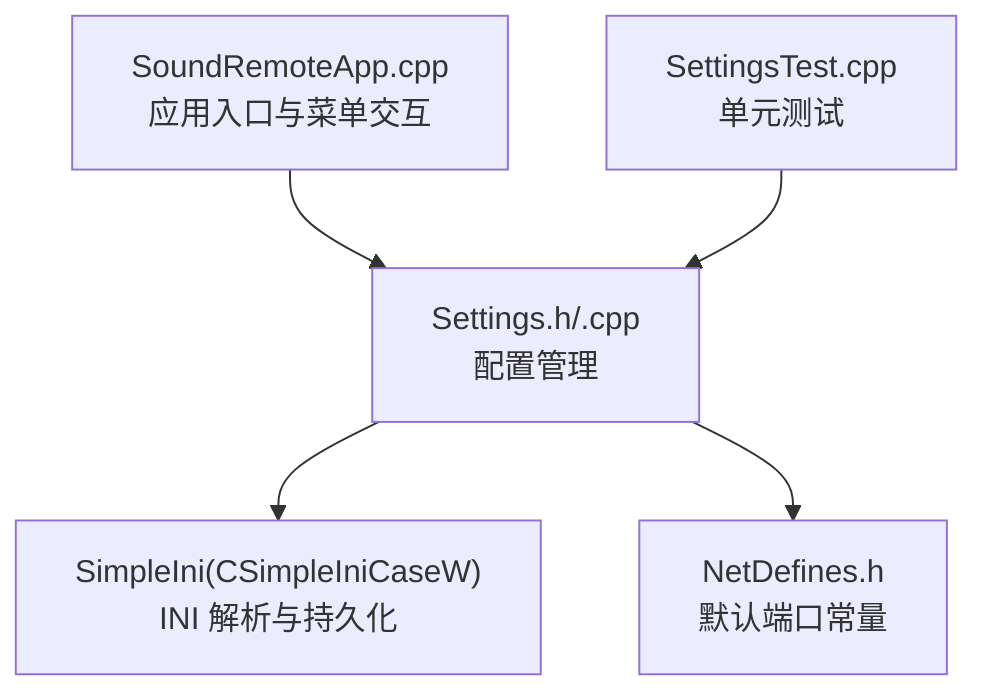
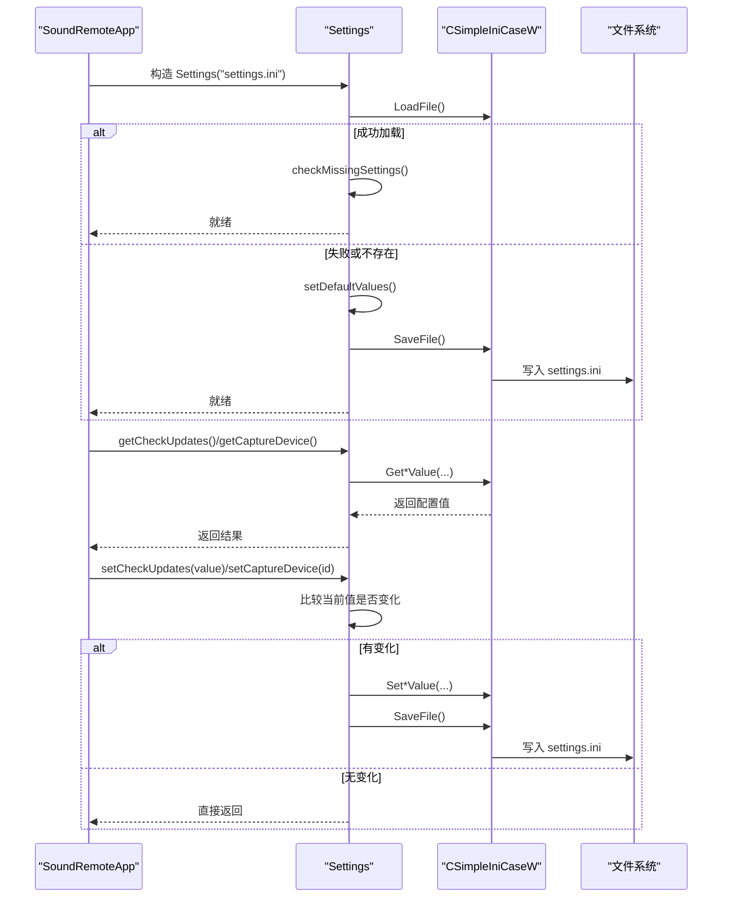
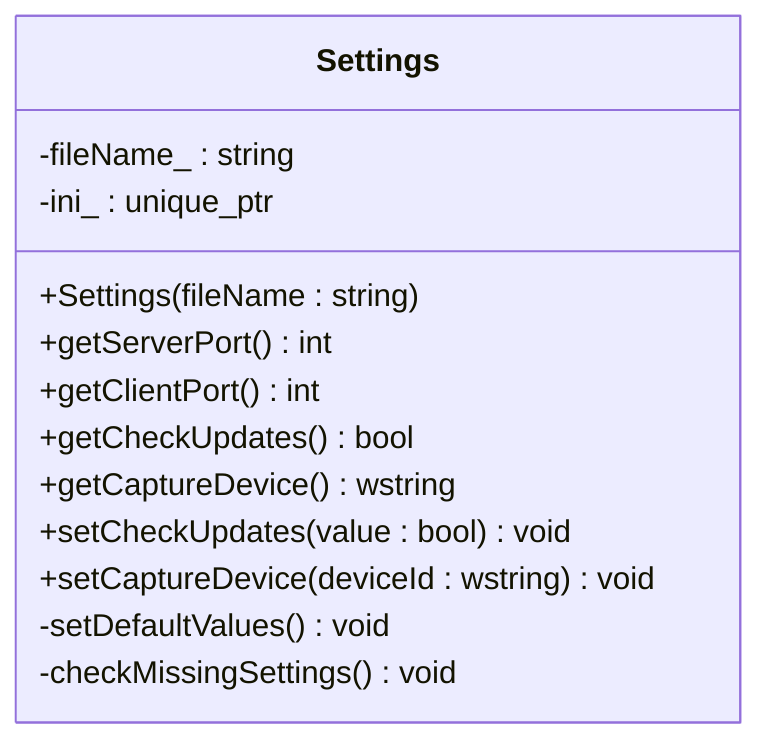
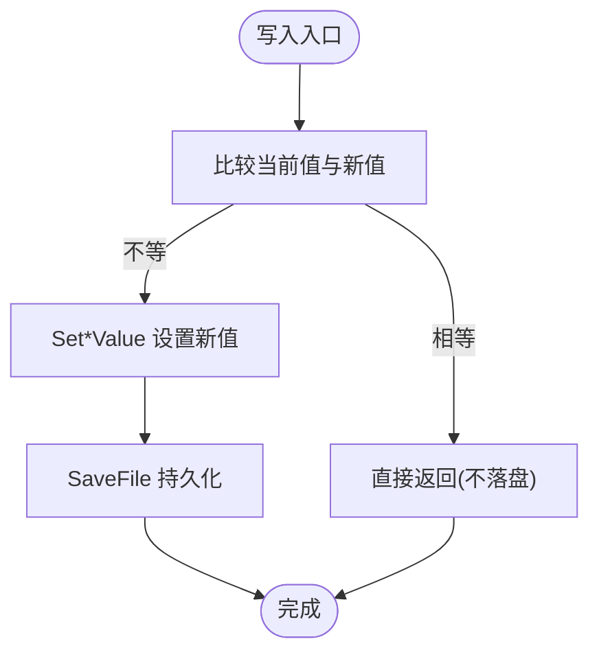
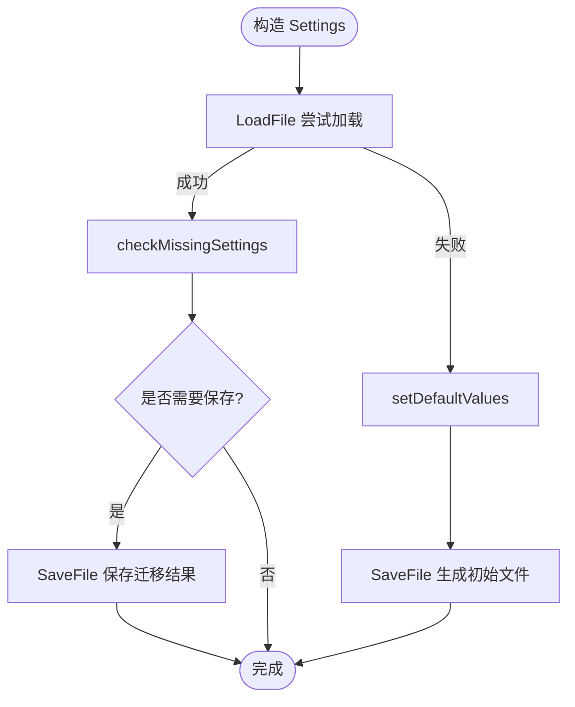
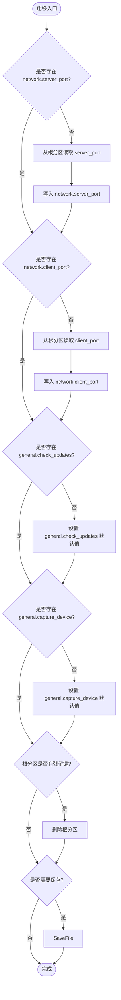
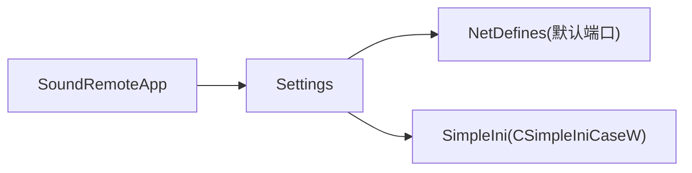

# 配置管理模块

<cite>
**本文引用的文件**   
- [Settings.h](file://SoundRemote/Settings.h)
- [Settings.cpp](file://SoundRemote/Settings.cpp)
- [NetDefines.h](file://SoundRemote/NetDefines.h)
- [SoundRemoteApp.cpp](file://SoundRemote/SoundRemoteApp.cpp)
- [SettingsTest.cpp](file://Tests/SettingsTest.cpp)
</cite>

## 目录
1. [简介](#简介)
2. [项目结构](#项目结构)
3. [核心组件](#核心组件)
4. [架构总览](#架构总览)
5. [详细组件分析](#详细组件分析)
6. [依赖分析](#依赖分析)
7. [性能考虑](#性能考虑)
8. [故障排查指南](#故障排查指南)
9. [结论](#结论)
10. [附录](#附录)

## 简介
本章节面向 SoundRemote-WinServer 的配置管理模块，聚焦 Settings 类对 INI 配置文件的读取、写入与持久化机制。文档涵盖：
- 配置项定义、默认值、迁移与版本兼容
- 读取、写入与验证流程
- 配置文件结构与参数说明
- 热重载现状与建议
- 错误处理策略
- 备份恢复与安全建议
- 最佳实践

## 项目结构
配置管理相关代码位于 SoundRemote 目录中，核心为 Settings 类及其实现；网络默认端口等常量由 NetDefines 提供；应用启动时初始化并读写配置；单元测试覆盖关键路径。

图表来源
- [SoundRemoteApp.cpp:505-520](file://SoundRemote/SoundRemoteApp.cpp#L505-L520)
- [Settings.h:11-37](file://SoundRemote/Settings.h#L11-L37)
- [Settings.cpp:24-33](file://SoundRemote/Settings.cpp#L24-L33)
- [NetDefines.h:64-65](file://SoundRemote/NetDefines.h#L64-L65)
- [SettingsTest.cpp:27-87](file://Tests/SettingsTest.cpp#L27-L87)

章节来源
- [Settings.h:11-37](file://SoundRemote/Settings.h#L11-L37)
- [Settings.cpp:24-33](file://SoundRemote/Settings.cpp#L24-L33)
- [NetDefines.h:64-65](file://SoundRemote/NetDefines.h#L64-L65)
- [SoundRemoteApp.cpp:505-520](file://SoundRemote/SoundRemoteApp.cpp#L505-L520)
- [SettingsTest.cpp:27-87](file://Tests/SettingsTest.cpp#L27-L87)

## 核心组件
- Settings 类
  - 负责加载/保存 INI 文件、提供配置的只读访问与受控写入接口
  - 内部使用 CSimpleIniCaseW 进行大小写不敏感的宽字符 INI 解析
  - 提供默认值填充与缺失键检测/迁移逻辑
- 配置常量与默认值
  - 网络端口默认值来自 NetDefines 中的常量
  - 捕获设备默认 ID 在头文件中定义
- 应用集成
  - 应用启动时创建 Settings 实例，并在 UI 交互中更新配置（如“启动时检查更新”）

章节来源
- [Settings.h:11-37](file://SoundRemote/Settings.h#L11-L37)
- [Settings.cpp:17-22](file://SoundRemote/Settings.cpp#L17-L22)
- [NetDefines.h:64-65](file://SoundRemote/NetDefines.h#L64-L65)
- [SoundRemoteApp.cpp:505-520](file://SoundRemote/SoundRemoteApp.cpp#L505-L520)

## 架构总览
配置生命周期从应用启动开始，到用户交互触发写入结束。整体流程如下：

图表来源
- [SoundRemoteApp.cpp:505-520](file://SoundRemote/SoundRemoteApp.cpp#L505-L520)
- [Settings.cpp:24-33](file://SoundRemote/Settings.cpp#L24-L33)
- [Settings.cpp:51-65](file://SoundRemote/Settings.cpp#L51-L65)
- [Settings.cpp:67-72](file://SoundRemote/Settings.cpp#L67-L72)
- [Settings.cpp:74-106](file://SoundRemote/Settings.cpp#L74-L106)

## 详细组件分析

### Settings 类设计与职责
- 公开接口
  - 构造函数：接收配置文件路径，完成加载/初始化
  - 读取接口：获取服务器端口、客户端端口、是否启动检查更新、捕获设备
  - 写入接口：设置“启动检查更新”和“捕获设备”，仅在值发生变化时落盘
- 私有成员
  - 文件名缓存、INI 解析器智能指针
  - 内部方法：设置默认值、检查缺失配置项并执行迁移

图表来源
- [Settings.h:11-37](file://SoundRemote/Settings.h#L11-L37)

章节来源
- [Settings.h:11-37](file://SoundRemote/Settings.h#L11-L37)

### INI 文件格式与字段说明
- 文件位置与命名
  - 默认文件名：settings.ini（由应用初始化时传入）
- 分区与键名
  - 分区 network
    - server_port：整数，服务端监听端口
    - client_port：整数，客户端连接端口
  - 分区 general
    - check_updates：布尔，是否在启动时检查更新
    - capture_device：字符串，音频捕获设备标识
- 默认值来源
  - 端口默认值来自 NetDefines 的常量
  - 捕获设备默认 ID 在头文件中定义
- 兼容性
  - 旧版（0.5.2 及更早）可能将端口键放在根分区，迁移逻辑会将其移动到 network 分区并清理根分区

示例结构（示意）
- [network]
  - server_port = <整数>
  - client_port = <整数>
- [general]
  - check_updates = <true|false>
  - capture_device = <设备ID字符串>

章节来源
- [Settings.cpp:5-22](file://SoundRemote/Settings.cpp#L5-L22)
- [NetDefines.h:64-65](file://SoundRemote/NetDefines.h#L64-L65)
- [Settings.h:8-9](file://SoundRemote/Settings.h#L8-L9)
- [SettingsTest.cpp:71-87](file://Tests/SettingsTest.cpp#L71-L87)

### 配置项定义、读取、写入与验证流程
- 定义
  - 分区与键名以常量集中管理，避免硬编码散落在各处
  - 默认值集中定义，并与网络层默认端口保持一致
- 读取
  - 通过 GetLongValue/GetBoolValue/GetValue 按分区+键名读取
- 写入
  - 先比较当前值，若未变化则跳过落盘，减少不必要的 I/O
  - 仅当值变化时才调用 Set*Value 并 SaveFile
- 验证
  - 当前实现未做范围校验（如端口范围），依赖调用方或系统约束
  - 可通过扩展 getter/setter 增加校验与异常/错误码返回

图表来源
- [Settings.cpp:51-65](file://SoundRemote/Settings.cpp#L51-L65)

章节来源
- [Settings.cpp:35-49](file://SoundRemote/Settings.cpp#L35-L49)
- [Settings.cpp:51-65](file://SoundRemote/Settings.cpp#L51-L65)

### 默认配置管理与初始化流程
- 首次运行或文件不可用时，自动填充所有必需键并保存
- 已存在文件时，进入缺失检测与迁移流程

图表来源
- [Settings.cpp:24-33](file://SoundRemote/Settings.cpp#L24-L33)
- [Settings.cpp:67-72](file://SoundRemote/Settings.cpp#L67-L72)
- [Settings.cpp:74-106](file://SoundRemote/Settings.cpp#L74-L106)

章节来源
- [Settings.cpp:24-33](file://SoundRemote/Settings.cpp#L24-L33)
- [Settings.cpp:67-72](file://SoundRemote/Settings.cpp#L67-L72)
- [Settings.cpp:74-106](file://SoundRemote/Settings.cpp#L74-L106)

### 配置迁移机制与版本兼容
- 目标
  - 兼容 0.5.2 及更早版本的无分区 INI 格式
- 行为
  - 若缺少 network.server_port/client_port，则从根分区迁移对应键值至 network 分区
  - 若缺少 general.check_updates/capture_device，则补全默认值
  - 若根分区仍有残留键，则删除根分区
  - 任何变更均触发一次 SaveFile
- 测试覆盖
  - 单元测试验证旧格式迁移后读取正确

图表来源
- [Settings.cpp:74-106](file://SoundRemote/Settings.cpp#L74-L106)
- [SettingsTest.cpp:71-87](file://Tests/SettingsTest.cpp#L71-L87)

章节来源
- [Settings.cpp:74-106](file://SoundRemote/Settings.cpp#L74-L106)
- [SettingsTest.cpp:71-87](file://Tests/SettingsTest.cpp#L71-L87)

### 配置热重载机制
- 现状
  - 当前实现未提供运行时热重载能力；UI 更改通过 setCheckUpdates 立即落盘，但不会通知其他模块实时刷新内存状态
- 建议方案
  - 引入观察者模式：配置变更事件回调，订阅者（如 UI、网络模块）收到事件后重新拉取配置
  - 增量更新：仅更新受影响模块，避免全量重建
  - 线程安全：确保并发读写一致性与原子性

[本节为概念性内容，无需源码引用]

### 错误处理策略
- 文件加载失败
  - 构造时若 LoadFile 失败，则回退到默认值并生成初始文件
- 写入失败
  - 当前实现未显式处理 SaveFile 的错误码；建议在关键路径记录日志并提示用户
- 数据一致性
  - 写入前比较值以避免无效 I/O；迁移阶段统一在末尾保存，降低中间态风险

章节来源
- [Settings.cpp:24-33](file://SoundRemote/Settings.cpp#L24-L33)
- [Settings.cpp:51-65](file://SoundRemote/Settings.cpp#L51-L65)
- [Settings.cpp:74-106](file://SoundRemote/Settings.cpp#L74-L106)

### 配置备份与恢复
- 建议策略
  - 在迁移或批量更新前，复制 settings.ini 为 .bak 或带时间戳的副本
  - 提供恢复入口：用备份覆盖当前配置并重启应用
- 实现要点
  - 使用标准文件 API 进行拷贝/替换
  - 恢复后触发一次完整的加载与迁移流程，确保一致性

[本节为通用建议，无需源码引用]

### 安全考虑
- 权限与路径
  - 确保进程对配置文件所在目录具有读写权限
  - 避免将敏感信息写入明文 INI；如需敏感配置，考虑加密存储或系统凭据管理器
- 输入合法性
  - 对端口等数值型配置增加范围校验与边界保护
- 防篡改
  - 可引入简单校验和或签名，防止外部恶意修改

[本节为通用建议，无需源码引用]

### 最佳实践建议
- 新增配置项
  - 在常量区集中声明分区与键名，并提供默认值
  - 在 checkMissingSettings 中补齐缺失项，保证向后兼容
- 写入优化
  - 保持“值不变不落盘”的策略，减少磁盘抖动
- 可观测性
  - 对关键 I/O 操作添加日志，便于定位问题
- 测试覆盖
  - 参考现有单元测试，为新配置项补充默认值、读写与迁移用例

章节来源
- [Settings.cpp:5-22](file://SoundRemote/Settings.cpp#L5-L22)
- [Settings.cpp:51-65](file://SoundRemote/Settings.cpp#L51-L65)
- [SettingsTest.cpp:27-87](file://Tests/SettingsTest.cpp#L27-L87)

## 依赖分析
- 内部依赖
  - Settings 依赖 NetDefines 提供的默认端口常量
  - Settings 依赖 SimpleIni 库进行 INI 解析与持久化
- 外部依赖
  - Windows 平台文件系统 API（通过 SimpleIni 封装）
- 耦合关系
  - Settings 与应用层松耦合，仅暴露稳定的读写接口
  - 迁移逻辑集中在一处，便于维护与演进

图表来源
- [SoundRemoteApp.cpp:505-520](file://SoundRemote/SoundRemoteApp.cpp#L505-L520)
- [Settings.cpp:17-22](file://SoundRemote/Settings.cpp#L17-L22)
- [Settings.h:6](file://SoundRemote/Settings.h#L6)

章节来源
- [Settings.h:6](file://SoundRemote/Settings.h#L6)
- [Settings.cpp:17-22](file://SoundRemote/Settings.cpp#L17-L22)
- [SoundRemoteApp.cpp:505-520](file://SoundRemote/SoundRemoteApp.cpp#L505-L520)

## 性能考虑
- 最小化 I/O
  - 写入前比较值，避免重复落盘
  - 迁移阶段合并保存，减少多次磁盘写入
- 内存占用
  - 使用智能指针管理 INI 对象，RAII 释放资源
- 可扩展性
  - 若未来配置项增多，可考虑懒加载或按需读取，避免一次性解析大文件

[本节为通用建议，无需源码引用]

## 故障排查指南
- 症状：启动后端口仍为默认值
  - 检查 settings.ini 是否存在且包含正确的分区与键名
  - 确认旧版无分区格式是否被正确迁移
- 症状：修改“启动检查更新”后未生效
  - 确认 UI 是否调用了 setCheckUpdates 并成功落盘
  - 重启应用后再次读取验证
- 症状：捕获设备未生效
  - 核对 capture_device 的值是否为有效设备 ID
  - 检查应用侧是否正确使用该值初始化音频捕获

章节来源
- [SettingsTest.cpp:27-87](file://Tests/SettingsTest.cpp#L27-L87)
- [SoundRemoteApp.cpp:505-520](file://SoundRemote/SoundRemoteApp.cpp#L505-L520)

## 结论
Settings 模块以简洁清晰的接口封装了 INI 配置的管理，具备完善的默认值填充与迁移机制，并通过“值不变不落盘”的策略提升性能。建议后续增强点包括：
- 增加配置校验与错误上报
- 引入热重载与观察者模式
- 完善备份恢复与安全加固
- 扩展单元测试覆盖更多边界场景

[本节为总结性内容，无需源码引用]

## 附录

### 配置项清单与含义
- network.server_port：整数，服务端监听端口，默认值来源于 NetDefines
- network.client_port：整数，客户端连接端口，默认值来源于 NetDefines
- general.check_updates：布尔，是否在启动时检查更新
- general.capture_device：字符串，音频捕获设备标识，默认值为头文件中定义的默认播放设备 ID

章节来源
- [Settings.cpp:5-22](file://SoundRemote/Settings.cpp#L5-L22)
- [NetDefines.h:64-65](file://SoundRemote/NetDefines.h#L64-L65)
- [Settings.h:8-9](file://SoundRemote/Settings.h#L8-L9)

### 使用示例（步骤说明）
- 首次运行
  - 应用构造 Settings 实例，若文件不存在则自动生成默认配置
- 读取配置
  - 通过 getServerPort/getClientPort/getCheckUpdates/getCaptureDevice 获取当前值
- 修改配置
  - 调用 setCheckUpdates/setCaptureDevice，仅在值变化时落盘
- 迁移旧配置
  - 若检测到旧格式，自动迁移至新版分区结构并保存

章节来源
- [Settings.cpp:24-33](file://SoundRemote/Settings.cpp#L24-L33)
- [Settings.cpp:35-49](file://SoundRemote/Settings.cpp#L35-L49)
- [Settings.cpp:51-65](file://SoundRemote/Settings.cpp#L51-L65)
- [Settings.cpp:74-106](file://SoundRemote/Settings.cpp#L74-L106)
- [SettingsTest.cpp:27-87](file://Tests/SettingsTest.cpp#L27-L87)