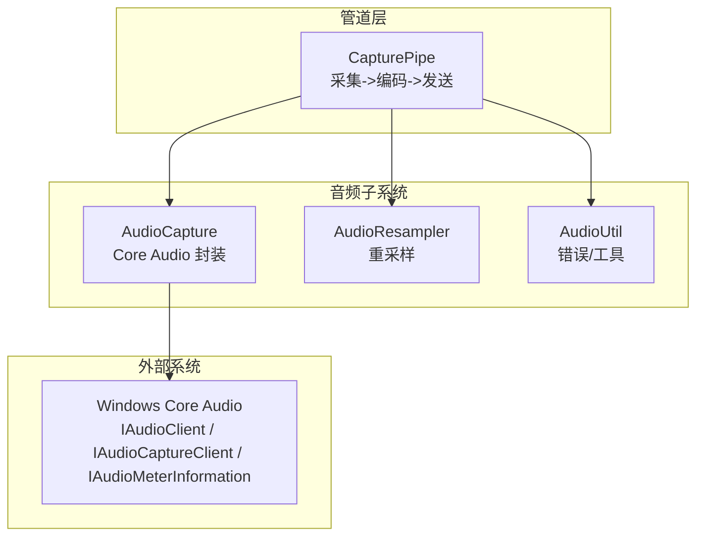
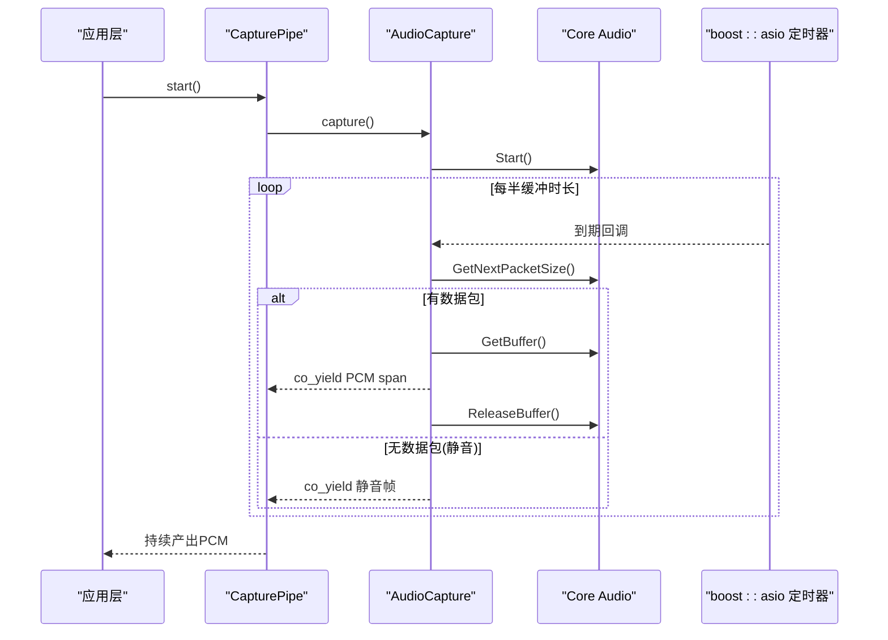
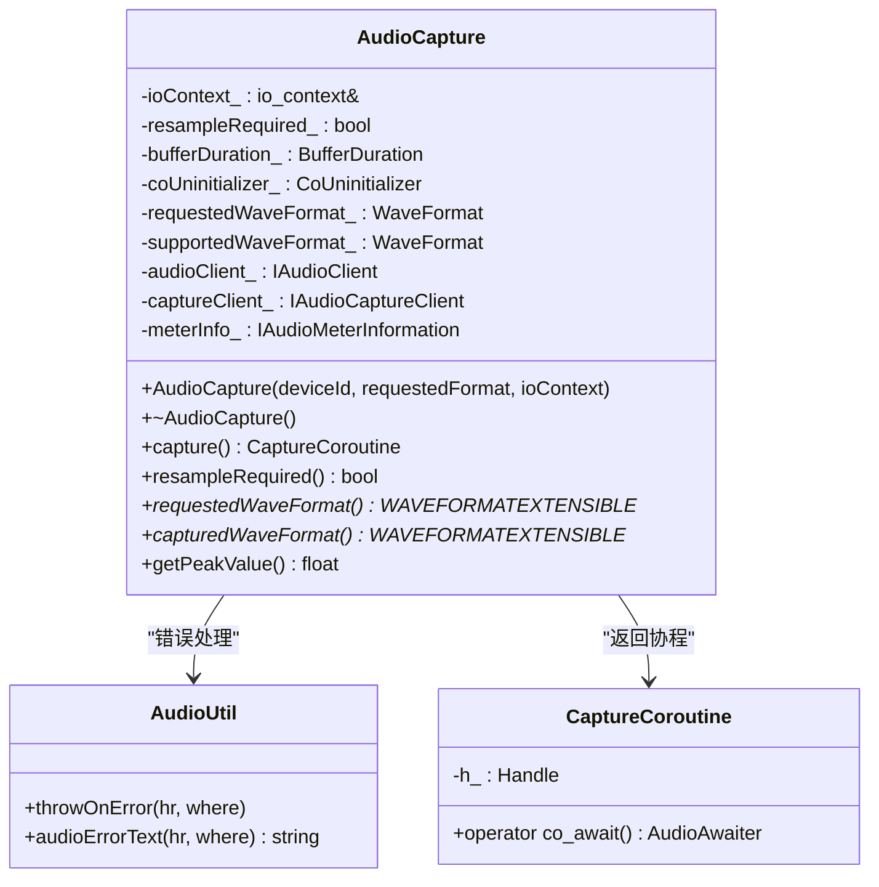
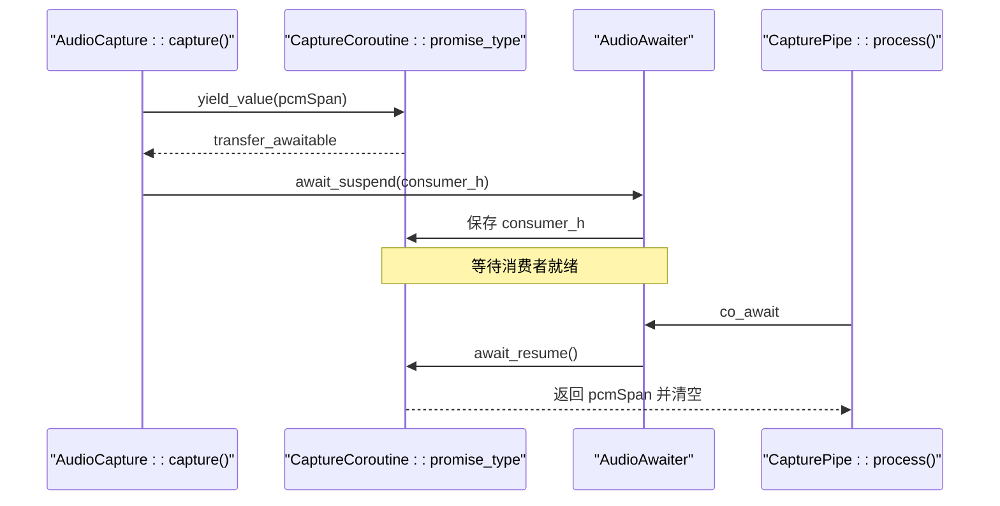
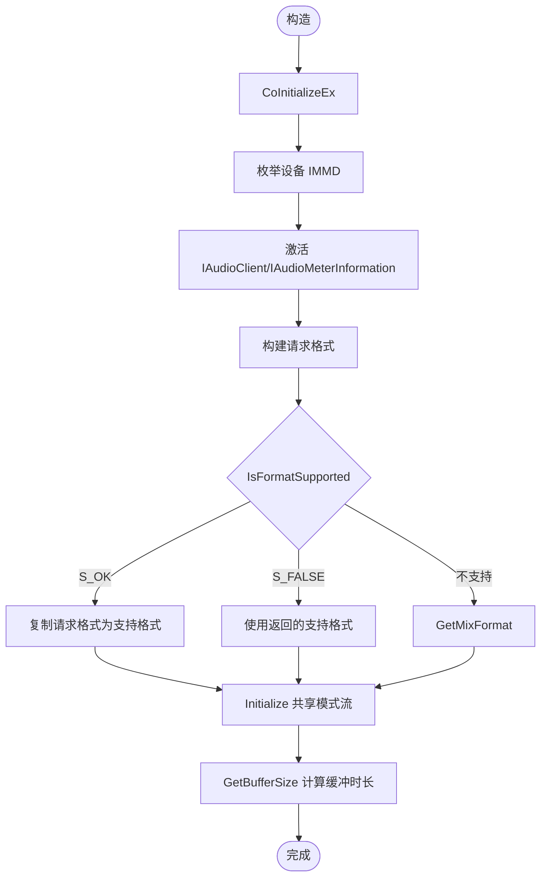
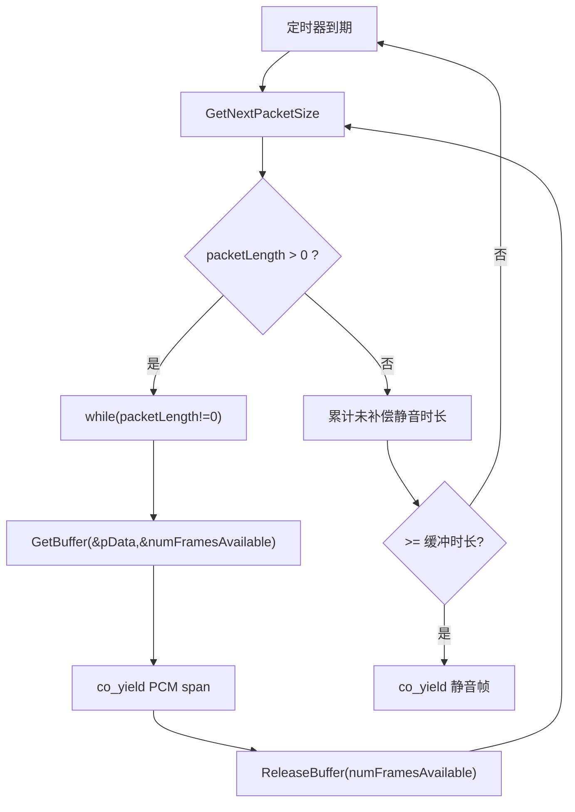
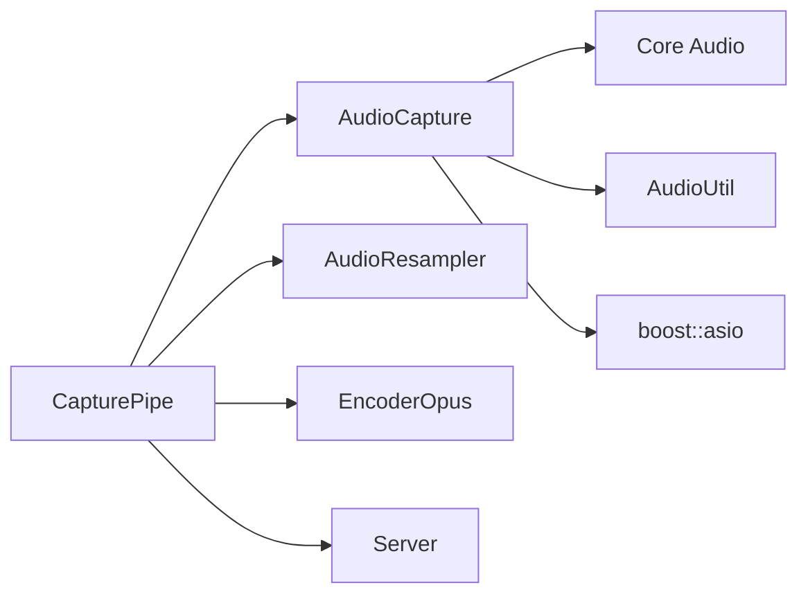

# AudioCapture 音频捕获

<cite>
**本文引用的文件**   
- [AudioCapture.h](file://SoundRemote/AudioCapture.h)
- [AudioCapture.cpp](file://SoundRemote/AudioCapture.cpp)
- [AudioUtil.h](file://SoundRemote/AudioUtil.h)
- [AudioUtil.cpp](file://SoundRemote/AudioUtil.cpp)
- [CapturePipe.h](file://SoundRemote/CapturePipe.h)
- [CapturePipe.cpp](file://SoundRemote/CapturePipe.cpp)
</cite>

## 目录
1. [简介](#简介)
2. [项目结构](#项目结构)
3. [核心组件](#核心组件)
4. [架构总览](#架构总览)
5. [详细组件分析](#详细组件分析)
6. [依赖关系分析](#依赖关系分析)
7. [性能考量](#性能考量)
8. [故障排查指南](#故障排查指南)
9. [结论](#结论)
10. [附录：使用示例与最佳实践](#附录使用示例与最佳实践)

## 简介
本文件面向开发者，系统性阐述基于 Windows Core Audio API 的音频捕获实现——AudioCapture 组件。内容涵盖 IAudioClient、IAudioCaptureClient、IAudioMeterInformation 接口的封装方式；C++20 协程在异步音频捕获中的应用与数据传递机制；设备初始化流程、格式协商、缓冲区管理与静音补偿；峰值检测能力；以及错误处理策略和资源管理最佳实践。同时提供从创建实例到启动捕获、处理 PCM 数据、获取峰值的端到端使用路径说明。

## 项目结构
本项目采用分层组织：
- 音频子系统：AudioCapture（Core Audio 封装）、AudioResampler（重采样）、AudioUtil（公共工具与错误处理）
- 管道层：CapturePipe（将采集到的 PCM 送入编码器并发送）
- 网络与服务：Server、Clients、EncoderOpus 等

图表来源
- [AudioCapture.h:22-78](file://SoundRemote/AudioCapture.h#L22-L78)
- [AudioCapture.cpp:118-214](file://SoundRemote/AudioCapture.cpp#L118-L214)
- [CapturePipe.cpp:40-51](file://SoundRemote/CapturePipe.cpp#L40-L51)

章节来源
- [AudioCapture.h:22-78](file://SoundRemote/AudioCapture.h#L22-L78)
- [AudioCapture.cpp:118-214](file://SoundRemote/AudioCapture.cpp#L118-L214)
- [CapturePipe.cpp:40-51](file://SoundRemote/CapturePipe.cpp#L40-L51)

## 核心组件
- AudioCapture：封装 Core Audio 设备枚举、激活、格式协商、缓冲初始化、循环捕获、静音补偿与峰值读取。对外暴露 capture() 协程以 yield 原始 PCM 数据。
- CaptureCoroutine：自定义 C++20 协程类型，通过 promise_type 持有待消费 PCM span，并通过 awaitable 机制将底层数据传递给上层协程。
- AudioUtil：提供 HRESULT 错误转换、位置定位、COM 资源释放辅助、默认设备与设备列表查询等。

章节来源
- [AudioCapture.h:22-78](file://SoundRemote/AudioCapture.h#L22-L78)
- [AudioCapture.h:80-143](file://SoundRemote/AudioCapture.h#L80-L143)
- [AudioUtil.h:120-170](file://SoundRemote/AudioUtil.h#L120-L170)

## 架构总览
AudioCapture 作为音频采集的核心，向上为 CapturePipe 提供协程化的 PCM 流；向下通过 COM 指针管理 Core Audio 接口对象，配合 boost::asio 定时器驱动周期性拉取数据，并在无数据时输出静音帧以保证时间连续性。

图表来源
- [AudioCapture.cpp:219-280](file://SoundRemote/AudioCapture.cpp#L219-L280)
- [CapturePipe.cpp:97-111](file://SoundRemote/CapturePipe.cpp#L97-L111)

## 详细组件分析

### AudioCapture 类设计
- 职责
  - 初始化 COM、枚举设备、激活 IAudioClient 与 IAudioMeterInformation
  - 请求格式与实际支持格式协商，记录是否需要重采样
  - 初始化共享模式流、计算实际缓冲时长
  - 提供 capture() 协程，周期性拉取 PCM 或静音帧
  - 提供 getPeakValue() 读取当前峰值
- 关键成员
  - ioContext_：用于内部定时器
  - resampleRequired_：标记是否需要重采样
  - bufferDuration_：实际缓冲时长（hns）
  - requestedWaveFormat_/supportedWaveFormat_：请求与实际格式
  - audioClient_/captureClient_/meterInfo_：Core Audio 接口智能指针

图表来源
- [AudioCapture.h:22-78](file://SoundRemote/AudioCapture.h#L22-L78)
- [AudioCapture.h:80-143](file://SoundRemote/AudioCapture.h#L80-L143)
- [AudioUtil.h:150-170](file://SoundRemote/AudioUtil.h#L150-L170)

章节来源
- [AudioCapture.h:22-78](file://SoundRemote/AudioCapture.h#L22-L78)
- [AudioCapture.cpp:118-214](file://SoundRemote/AudioCapture.cpp#L118-L214)

### C++20 协程与数据传递机制
- CaptureCoroutine.promise_type
  - 保存 pcmAudio（span<char>）与 awaiting_coroutine_（等待方协程句柄）
  - yield_value 将 PCM 写入 promise，并返回一个 transfer_awaitable，挂起调用方协程
- CaptureCoroutine::operator co_await
  - 返回 AudioAwaiter，其 await_ready 检查是否有可用数据
  - await_suspend 将调用方协程句柄保存到 promise.awaiting_coroutine_
  - await_resume 取出并清空 pcmAudio，供上层消费
- 上层使用
  - CapturePipe::process 中通过 co_await audioCapture 获得 PCM 片段，再转发给编码器或网络层

图表来源
- [AudioCapture.h:80-143](file://SoundRemote/AudioCapture.h#L80-L143)
- [CapturePipe.cpp:97-111](file://SoundRemote/CapturePipe.cpp#L97-L111)

章节来源
- [AudioCapture.h:80-143](file://SoundRemote/AudioCapture.h#L80-L143)
- [CapturePipe.cpp:97-111](file://SoundRemote/CapturePipe.cpp#L97-L111)

### 设备初始化与格式协商
- COM 初始化：多线程模型，构造时初始化，析构时由 CoUninitializer 自动清理
- 设备枚举与激活：IMMDeviceEnumerator -> IMMDevice -> IAudioClient、IAudioMeterInformation
- 格式协商：
  - IsFormatSupported：若 S_OK，则直接使用请求格式；若 S_FALSE 或 AUDCLNT_E_UNSUPPORTED_FORMAT，则使用 GetMixFormat 或已填充的支持格式
  - 根据结果设置 resampleRequired_ 与 supportedWaveFormat_
- 流初始化：Initialize(AUDCLNT_SHAREMODE_SHARED, streamFlags, hnsRequestedDuration=0, ...)
- 缓冲大小与周期：GetBufferSize 计算实际缓冲时长，用于定时器周期与静音补偿

图表来源
- [AudioCapture.cpp:118-214](file://SoundRemote/AudioCapture.cpp#L118-L214)

章节来源
- [AudioCapture.cpp:118-214](file://SoundRemote/AudioCapture.cpp#L118-L214)

### 缓冲区管理与静音补偿
- 定时器周期：bufferDuration_ / 2，确保及时拉取数据
- 静音补偿：当 GetNextPacketSize 返回 0 时，累积未补偿静音时长，超过一个缓冲周期后输出静音帧，避免上游出现长时间静默导致解码器卡顿
- 数据拉取：GetBuffer 获取 pData 与 numFramesAvailable，RAII 包装 BufferReleaser 保证 ReleaseBuffer 被调用

图表来源
- [AudioCapture.cpp:219-280](file://SoundRemote/AudioCapture.cpp#L219-L280)

章节来源
- [AudioCapture.cpp:219-280](file://SoundRemote/AudioCapture.cpp#L219-L280)

### 峰值检测
- 通过 IAudioMeterInformation::GetPeakValue 获取当前峰值（范围 0.0~1.0），失败返回 -1
- 该值可用于可视化电平表或动态调整编码参数

章节来源
- [AudioCapture.h:59-63](file://SoundRemote/AudioCapture.h#L59-L63)
- [AudioCapture.cpp:294-301](file://SoundRemote/AudioCapture.cpp#L294-L301)

## 依赖关系分析
- AudioCapture 依赖
  - Windows Core Audio：IAudioClient、IAudioCaptureClient、IAudioMeterInformation、IMMDeviceEnumerator、IMMDevice
  - boost::asio：io_context 与 steady_timer 驱动定时拉取
  - AudioUtil：统一错误处理与文本生成
- CapturePipe 依赖
  - AudioCapture：获取 PCM 流与峰值
  - AudioResampler：按需重采样
  - EncoderOpus：按客户端需求编码
  - Server：发送音频包

图表来源
- [AudioCapture.cpp:1-15](file://SoundRemote/AudioCapture.cpp#L1-L15)
- [CapturePipe.cpp:1-12](file://SoundRemote/CapturePipe.cpp#L1-L12)

章节来源
- [AudioCapture.cpp:1-15](file://SoundRemote/AudioCapture.cpp#L1-L15)
- [CapturePipe.cpp:1-12](file://SoundRemote/CapturePipe.cpp#L1-L12)

## 性能考量
- 共享模式流与零请求缓冲时长：由系统决定缓冲大小，降低延迟的同时需平衡抖动
- 定时器周期为缓冲时长的一半：提高响应性，减少丢帧风险
- 静音补偿：避免上游因长时间静默导致的解码器阻塞
- RAII 与异常安全：BufferReleaser 与 unique_ptr 确保资源正确释放，避免泄漏
- 峰值读取开销低，可周期性调用用于 UI 展示

[本节为通用指导，不直接分析具体文件]

## 故障排查指南
- 常见错误定位
  - 所有 COM 调用均通过 Audio::throwOnError 抛出带位置的错误信息，便于快速定位
  - 特殊错误提示：如麦克风访问被拒绝，会给出隐私设置相关提示
- 典型问题
  - 无法打开设备：检查设备 ID 是否正确、权限是否开启
  - 格式不支持：查看 resampleRequired() 返回值，必要时启用重采样
  - 无声输出：确认静音补偿逻辑与定时器是否正常触发
- 调试建议
  - 打印 capturedWaveFormat 与 requestedWaveFormat 对比差异
  - 观察 getPeakValue() 是否为 -1，判断 meter 接口是否可用

章节来源
- [AudioUtil.cpp:77-101](file://SoundRemote/AudioUtil.cpp#L77-L101)
- [AudioUtil.h:48-116](file://SoundRemote/AudioUtil.h#L48-L116)

## 结论
AudioCapture 以简洁的协程化接口封装了复杂的 Core Audio 交互，结合定时器与静音补偿实现了稳定、低延迟的 PCM 流输出。配合 CapturePipe 的重采样与编码管线，能够灵活适配不同客户端需求。完善的错误处理与 RAII 资源管理保障了健壮性与可维护性。

[本节为总结性内容，不直接分析具体文件]

## 附录：使用示例与最佳实践

- 创建 AudioCapture 实例
  - 需要提供设备 ID、请求格式与 boost::asio::io_context 引用
  - 参考路径：[AudioCapture 构造函数:118-214](file://SoundRemote/AudioCapture.cpp#L118-L214)

- 启动音频捕获协程
  - 调用 capture() 获取 CaptureCoroutine，并在上层协程中 co_await 消费 PCM
  - 参考路径：[AudioCapture::capture:219-280](file://SoundRemote/AudioCapture.cpp#L219-L280)、[CapturePipe::process:97-111](file://SoundRemote/CapturePipe.cpp#L97-111)

- 处理 PCM 数据
  - 若 resampleRequired() 为真，先进行重采样，再将数据送入编码器或网络层
  - 参考路径：[CapturePipe 构造与重采样分支:40-51](file://SoundRemote/CapturePipe.cpp#L40-51)、[CapturePipe::process:124-155](file://SoundRemote/CapturePipe.cpp#L124-155)

- 获取音频峰值
  - 调用 getPeakValue()，返回值范围 0.0~1.0，失败返回 -1
  - 参考路径：[AudioCapture::getPeakValue:294-301](file://SoundRemote/AudioCapture.cpp#L294-301)

- 错误处理策略
  - 使用 Audio::throwOnError 统一抛错，包含错误位置与可读文本
  - 参考路径：[AudioUtil 错误函数:77-101](file://SoundRemote/AudioUtil.cpp#L77-101)

- 资源管理最佳实践
  - 使用 CComPtr 与 std::unique_ptr 管理 COM 与堆内存
  - 使用 BufferReleaser RAII 确保 ReleaseBuffer 必调
  - 使用 CoUninitializer 在作用域结束时自动 CoUninitialize
  - 参考路径：[AudioCapture 成员与 RAII 包装:64-78](file://SoundRemote/AudioCapture.h#L64-78)、[BufferReleaser:90-114](file://SoundRemote/AudioCapture.cpp#L90-114)

章节来源
- [AudioCapture.cpp:118-214](file://SoundRemote/AudioCapture.cpp#L118-L214)
- [AudioCapture.cpp:219-280](file://SoundRemote/AudioCapture.cpp#L219-L280)
- [AudioCapture.cpp:294-301](file://SoundRemote/AudioCapture.cpp#L294-L301)
- [CapturePipe.cpp:40-51](file://SoundRemote/CapturePipe.cpp#L40-L51)
- [CapturePipe.cpp:97-111](file://SoundRemote/CapturePipe.cpp#L97-L111)
- [CapturePipe.cpp:124-155](file://SoundRemote/CapturePipe.cpp#L124-L155)
- [AudioUtil.cpp:77-101](file://SoundRemote/AudioUtil.cpp#L77-L101)