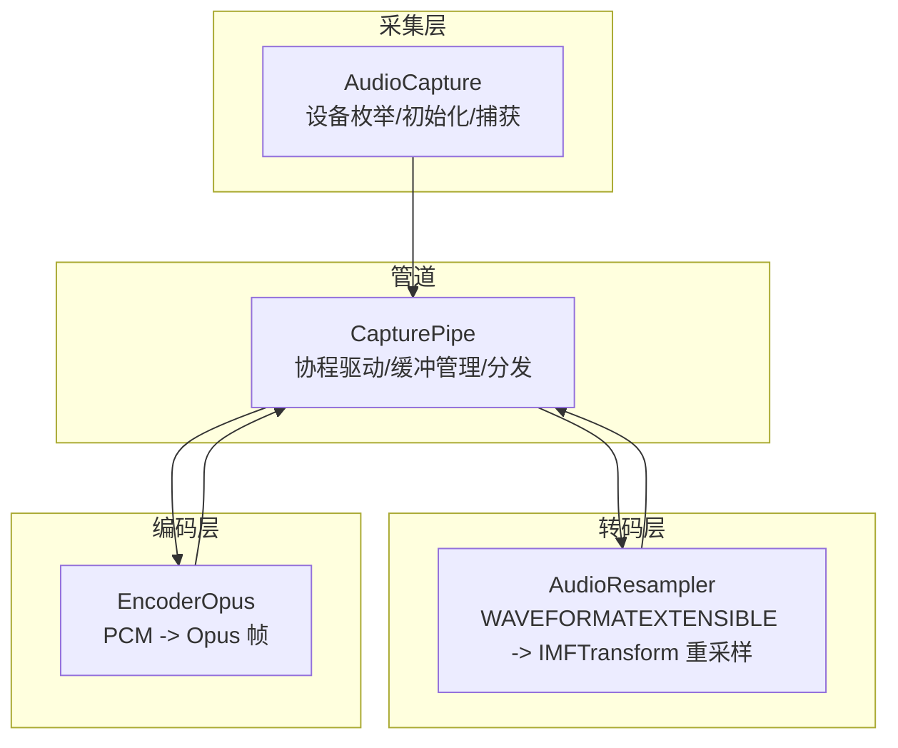
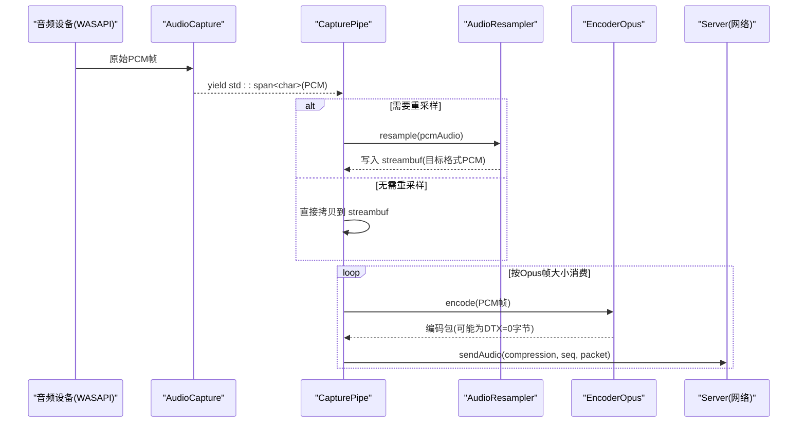
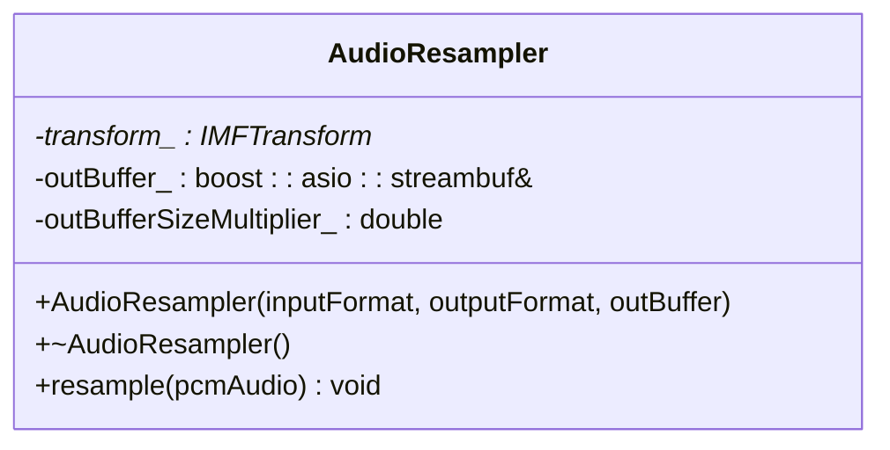
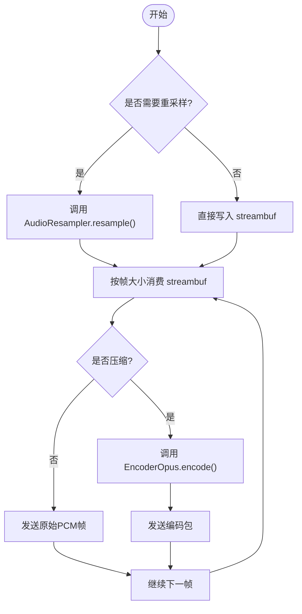
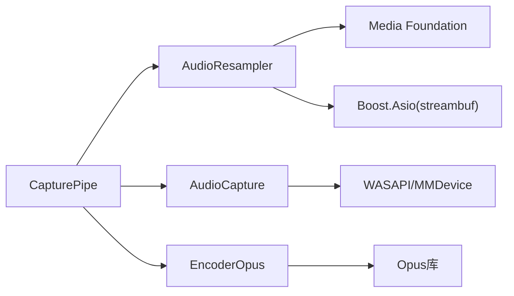

# AudioResampler 音频重采样

<cite>
**本文引用的文件**   
- [AudioResampler.h](file://SoundRemote/AudioResampler.h)
- [AudioResampler.cpp](file://SoundRemote/AudioResampler.cpp)
- [AudioCapture.h](file://SoundRemote/AudioCapture.h)
- [AudioCapture.cpp](file://SoundRemote/AudioCapture.cpp)
- [EncoderOpus.h](file://SoundRemote/EncoderOpus.h)
- [CapturePipe.h](file://SoundRemote/CapturePipe.h)
- [CapturePipe.cpp](file://SoundRemote/CapturePipe.cpp)
- [AudioUtil.h](file://SoundRemote/AudioUtil.h)
- [AudioUtil.cpp](file://SoundRemote/AudioUtil.cpp)
</cite>

## 目录
1. [简介](#简介)
2. [项目结构](#项目结构)
3. [核心组件](#核心组件)
4. [架构总览](#架构总览)
5. [详细组件分析](#详细组件分析)
6. [依赖关系分析](#依赖关系分析)
7. [性能与延迟调优](#性能与延迟调优)
8. [故障排查指南](#故障排查指南)
9. [结论](#结论)
10. [附录：集成示例与最佳实践](#附录集成示例与最佳实践)

## 简介
本文件围绕 AudioResampler 组件，系统阐述其在 Windows 平台上的音频格式转换与重采样实现。内容涵盖：
- 采样率转换、声道数调整、比特深度转换的实现原理
- WAVEFORMATEXTENSIBLE 格式的处理方式
- 音频数据缓冲管理与内存优化策略
- 重采样质量设置、延迟控制与性能调优方法
- 与 AudioCapture、EncoderOpus 的协作关系和数据流处理
- 在音频处理管道中的集成方式与配置要点

## 项目结构
本项目采用分层组织：采集层（AudioCapture）、转码层（AudioResampler）、编码层（EncoderOpus），并通过 CapturePipe 将三者串联为完整的音频处理管道。

图表来源
- [AudioCapture.h:22-78](file://SoundRemote/AudioCapture.h#L22-L78)
- [AudioResampler.h:13-23](file://SoundRemote/AudioResampler.h#L13-L23)
- [EncoderOpus.h:9-36](file://SoundRemote/EncoderOpus.h#L9-L36)
- [CapturePipe.h:23-51](file://SoundRemote/CapturePipe.h#L23-L51)

章节来源
- [AudioCapture.h:22-78](file://SoundRemote/AudioCapture.h#L22-L78)
- [AudioResampler.h:13-23](file://SoundRemote/AudioResampler.h#L13-L23)
- [EncoderOpus.h:9-36](file://SoundRemote/EncoderOpus.h#L9-L36)
- [CapturePipe.h:23-51](file://SoundRemote/CapturePipe.h#L23-L51)

## 核心组件
- AudioResampler：基于 Windows Media Foundation 的 CResamplerMediaObject，完成输入到输出格式的 PCM 重采样与格式转换；内部使用 boost::asio::streambuf 作为输出缓冲。
- AudioCapture：封装 WASAPI 采集，负责设备能力探测、请求格式与实际支持格式对比，决定是否需要重采样。
- EncoderOpus：对标准 PCM 帧进行 Opus 编码，提供帧大小与输入缓冲区大小计算工具。
- CapturePipe：协程驱动的音频管道，协调采集、可选重采样、编码与网络发送。

章节来源
- [AudioResampler.h:13-23](file://SoundRemote/AudioResampler.h#L13-L23)
- [AudioResampler.cpp:11-51](file://SoundRemote/AudioResampler.cpp#L11-L51)
- [AudioCapture.h:22-78](file://SoundRemote/AudioCapture.h#L22-L78)
- [EncoderOpus.h:9-36](file://SoundRemote/EncoderOpus.h#L9-L36)
- [CapturePipe.h:23-51](file://SoundRemote/CapturePipe.h#L23-L51)

## 架构总览
下图展示了从设备采集到最终编码输出的完整数据流，以及重采样在其中的位置。

图表来源
- [CapturePipe.cpp:97-155](file://SoundRemote/CapturePipe.cpp#L97-L155)
- [AudioResampler.cpp:60-133](file://SoundRemote/AudioResampler.cpp#L60-L133)
- [EncoderOpus.h:14-23](file://SoundRemote/EncoderOpus.h#L14-L23)

## 详细组件分析

### AudioResampler 组件
- 职责
  - 接收输入与输出 WAVEFORMATEXTENSIBLE 描述的目标格式
  - 通过 Media Foundation 的 CResamplerMediaObject 执行重采样与格式转换
  - 将结果写入外部提供的 boost::asio::streambuf，供上层消费
- 关键实现要点
  - 构造阶段：创建并配置 IMFTransform，设置输入/输出媒体类型，启动流
  - 质量参数：通过 IWMResamplerProps::SetHalfFilterLength 设置滤波器长度以调节质量
  - 输出缓冲估算：根据输入/输出平均字节速率比值估算输出样本大小，减少频繁分配
  - 处理流程：ProcessInput -> ProcessOutput 循环，按需分配或复用输出样本
  - 资源释放：析构时通知结束流并释放 MFT

图表来源
- [AudioResampler.h:13-23](file://SoundRemote/AudioResampler.h#L13-L23)

章节来源
- [AudioResampler.h:13-23](file://SoundRemote/AudioResampler.h#L13-L23)
- [AudioResampler.cpp:11-51](file://SoundRemote/AudioResampler.cpp#L11-L51)
- [AudioResampler.cpp:60-133](file://SoundRemote/AudioResampler.cpp#L60-L133)

#### 重采样算法与质量
- 算法来源：Windows Media Foundation 的 CResamplerMediaObject，内部实现由系统提供，通常包含高质量的重采样滤波与抗混叠处理。
- 质量设置：IWMResamplerProps::SetHalfFilterLength 取值范围通常为 1-60，值越大质量越高但 CPU 开销也越大。当前实现固定设置为最高质量。
- 适用场景：当设备实际支持的格式与期望格式不一致时（采样率、声道数、位深不同），必须启用重采样。

章节来源
- [AudioResampler.cpp:20-25](file://SoundRemote/AudioResampler.cpp#L20-L25)

#### WAVEFORMATEXTENSIBLE 处理
- 输入/输出媒体类型通过 MFInitMediaTypeFromWaveFormatEx 从 WAVEFORMATEXTENSIBLE 初始化，确保扩展字段（如通道掩码、有效位深）正确传递。
- 该结构用于描述 PCM 子类型（PCM/IEEE Float）、通道布局与位深等，是跨模块统一格式约定的基础。

章节来源
- [AudioResampler.cpp:26-43](file://SoundRemote/AudioResampler.cpp#L26-L43)
- [AudioCapture.cpp:52-87](file://SoundRemote/AudioCapture.cpp#L52-L87)

#### 缓冲管理与内存优化
- 输出缓冲估算：构造函数中依据输入/输出 nAvgBytesPerSec 计算倍数，用于预估输出样本大小，避免过小导致频繁扩容。
- 输出样本分配策略：若 MFT 不主动提供输出样本，则客户端自行分配；否则自动附加并释放。
- 零拷贝倾向：尽量通过 Lock/Unlock 访问底层缓冲区，减少中间复制。

章节来源
- [AudioResampler.cpp:44-51](file://SoundRemote/AudioResampler.cpp#L44-L51)
- [AudioResampler.cpp:84-103](file://SoundRemote/AudioResampler.cpp#L84-L103)
- [AudioResampler.cpp:118-132](file://SoundRemote/AudioResampler.cpp#L118-L132)

#### 错误处理
- 所有 COM/MF 调用均通过统一的 throwOnError 包装，定位到具体 Location 以便诊断。
- 典型错误点包括：对象创建、QueryInterface、媒体类型初始化、输入/输出样本处理等。

章节来源
- [AudioResampler.cpp:14-51](file://SoundRemote/AudioResampler.cpp#L14-L51)
- [AudioResampler.cpp:60-133](file://SoundRemote/AudioResampler.cpp#L60-L133)
- [AudioUtil.h:70-98](file://SoundRemote/AudioUtil.h#L70-L98)
- [AudioUtil.cpp:77-101](file://SoundRemote/AudioUtil.cpp#L77-L101)

### AudioCapture 组件（与重采样的协作）
- 职责
  - 根据请求格式构造 WAVEFORMATEXTENSIBLE
  - 查询设备是否支持请求格式；不支持时获取混合格式作为实际捕获格式
  - 暴露 resampleRequired()/requestedWaveFormat()/capturedWaveFormat() 供上层决策
- 与重采样协作
  - 当 resampleRequired() 为真时，CapturePipe 会创建 AudioResampler，并以 capturedWaveFormat 作为输入、requestedWaveFormat 作为输出
  - 当不需要重采样时，直接将 PCM 数据送入下游

章节来源
- [AudioCapture.h:39-57](file://SoundRemote/AudioCapture.h#L39-L57)
- [AudioCapture.cpp:151-185](file://SoundRemote/AudioCapture.cpp#L151-L185)
- [AudioCapture.cpp:281-289](file://SoundRemote/AudioCapture.cpp#L281-L289)
- [CapturePipe.cpp:44-49](file://SoundRemote/CapturePipe.cpp#L44-L49)

### EncoderOpus 组件（与重采样的协作）
- 职责
  - 将标准 PCM 帧编码为 Opus 包
  - 提供 getFrameSize/getInputSize 静态接口，便于上游按帧切分 PCM
- 与重采样协作
  - 上游保证进入编码器的是目标格式（例如 48kHz、立体声、16bit PCM）
  - 管道按 opusInputSize_ 从 streambuf 中取出整帧数据进行编码

章节来源
- [EncoderOpus.h:14-23](file://SoundRemote/EncoderOpus.h#L14-L23)
- [CapturePipe.cpp:50](file://SoundRemote/CapturePipe.cpp#L50)
- [CapturePipe.cpp:130-154](file://SoundRemote/CapturePipe.cpp#L130-L154)

### CapturePipe 管道（整体数据流）
- 协程驱动：process() 持续等待采集到的 PCM 帧
- 条件重采样：根据 resampleRequired() 决定是否调用 AudioResampler
- 缓冲消费：while 循环按 opusInputSize_ 消费 streambuf，分别走无压缩或 Opus 编码路径
- 多编码并行：维护多个 EncoderOpus 实例，对应不同压缩需求

图表来源
- [CapturePipe.cpp:124-155](file://SoundRemote/CapturePipe.cpp#L124-L155)

章节来源
- [CapturePipe.cpp:97-155](file://SoundRemote/CapturePipe.cpp#L97-L155)

## 依赖关系分析
- AudioResampler 依赖
  - Windows Media Foundation（IMFTransform、CResamplerMediaObject、IWMResamplerProps）
  - ATL 智能指针（CComPtr）
  - Boost.Asio（streambuf）
- AudioCapture 依赖
  - WASAPI（IAudioClient、IAudioCaptureClient、IAudioMeterInformation）
  - MMDevice API（设备枚举）
- EncoderOpus 依赖
  - Opus 库（OpusEncoder）
- CapturePipe 依赖
  - 以上三者，以及 Server 网络发送接口

图表来源
- [AudioResampler.cpp:1-10](file://SoundRemote/AudioResampler.cpp#L1-L10)
- [AudioCapture.cpp:1-10](file://SoundRemote/AudioCapture.cpp#L1-L10)
- [EncoderOpus.h:1-6](file://SoundRemote/EncoderOpus.h#L1-L6)
- [CapturePipe.cpp:1-12](file://SoundRemote/CapturePipe.cpp#L1-L12)

章节来源
- [AudioResampler.cpp:1-10](file://SoundRemote/AudioResampler.cpp#L1-L10)
- [AudioCapture.cpp:1-10](file://SoundRemote/AudioCapture.cpp#L1-L10)
- [EncoderOpus.h:1-6](file://SoundRemote/EncoderOpus.h#L1-L6)
- [CapturePipe.cpp:1-12](file://SoundRemote/CapturePipe.cpp#L1-L12)

## 性能与延迟调优
- 重采样质量
  - SetHalfFilterLength 越大，音质越好，CPU 占用越高。可根据终端算力与带宽权衡选择。
- 输出缓冲估算
  - 通过输入/输出 nAvgBytesPerSec 的比值估算输出样本大小，有助于减少动态分配次数，降低抖动。
- 帧切分与延迟
  - Opus 帧长固定为 10ms（可通过常量查看），结合采样率可计算每帧字节数。更小的帧可降低端到端延迟，但会增加编码与网络开销。
- 并发与线程模型
  - 采集与处理通过协程驱动，避免阻塞；注意 IO 上下文与定时器的一致性，避免跨线程竞争。
- 内存复用
  - 优先复用 streambuf 与样本缓冲，避免频繁 new/delete；MFT 输出样本可由其自身提供以减少分配。

章节来源
- [AudioResampler.cpp:20-25](file://SoundRemote/AudioResampler.cpp#L20-L25)
- [AudioResampler.cpp:44-51](file://SoundRemote/AudioResampler.cpp#L44-L51)
- [AudioUtil.h:34-38](file://SoundRemote/AudioUtil.h#L34-L38)
- [CapturePipe.cpp:130-154](file://SoundRemote/CapturePipe.cpp#L130-L154)

## 故障排查指南
- 常见错误定位
  - 通过 Location 枚举精确定位失败阶段（如 RESAMPLER_COCREATEINSTANCE、RESAMPLER_TRANSFORM_PROCESSINPUT 等）
  - 使用 audioErrorText 生成可读的错误信息，便于日志记录与用户提示
- 典型问题与建议
  - 设备访问被拒绝：检查系统隐私设置与麦克风权限
  - 格式不支持：确认请求格式与设备能力，必要时启用重采样
  - 编码包为空：Opus DTX 可能返回 0 字节，属于正常静音帧，不应发送

章节来源
- [AudioUtil.h:70-98](file://SoundRemote/AudioUtil.h#L70-L98)
- [AudioUtil.cpp:77-101](file://SoundRemote/AudioUtil.cpp#L77-L101)
- [AudioResampler.cpp:14-51](file://SoundRemote/AudioResampler.cpp#L14-L51)
- [AudioResampler.cpp:60-133](file://SoundRemote/AudioResampler.cpp#L60-L133)

## 结论
AudioResampler 借助 Media Foundation 的高质量重采样引擎，配合 WAVEFORMATEXTENSIBLE 的统一格式约定，实现了灵活的采样率、声道数与位深转换。通过合理的缓冲估算与 MFT 输出样本策略，在保证音质的同时兼顾了性能与延迟。在 CapturePipe 的编排下，AudioResampler 与 AudioCapture、EncoderOpus 形成稳定高效的音频处理流水线。

## 附录：集成示例与最佳实践
- 配置重采样参数
  - 在构造 AudioResampler 前，先通过 AudioCapture 判断是否需要重采样，并获取输入/输出 WAVEFORMATEXTENSIBLE
  - 如需调整质量，可在后续版本中暴露 SetHalfFilterLength 的配置入口
- 处理不同音频格式之间的转换
  - 使用 MFInitMediaTypeFromWaveFormatEx 初始化输入/输出媒体类型，确保扩展字段正确
  - 通过 ProcessInput/ProcessOutput 循环处理，直到返回 NEED_MORE_INPUT
- 集成到音频处理管道
  - 在 CapturePipe 中根据 resampleRequired() 分支调用 resample 或直接拷贝
  - 按 opusInputSize_ 消费 streambuf，分别走无压缩或 Opus 编码路径
- 与 AudioCapture 和 EncoderOpus 的协作
  - AudioCapture 负责设备能力探测与格式协商
  - EncoderOpus 负责将标准 PCM 帧编码为 Opus 包
  - CapturePipe 负责调度与缓冲管理

章节来源
- [CapturePipe.cpp:44-49](file://SoundRemote/CapturePipe.cpp#L44-L49)
- [CapturePipe.cpp:124-155](file://SoundRemote/CapturePipe.cpp#L124-L155)
- [AudioResampler.cpp:26-43](file://SoundRemote/AudioResampler.cpp#L26-L43)
- [AudioResampler.cpp:82-133](file://SoundRemote/AudioResampler.cpp#L82-L133)
- [EncoderOpus.h:14-23](file://SoundRemote/EncoderOpus.h#L14-L23)