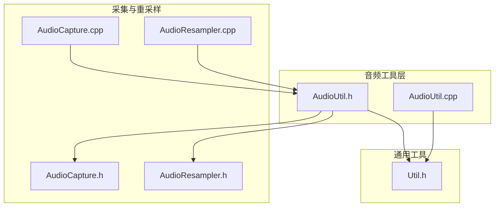
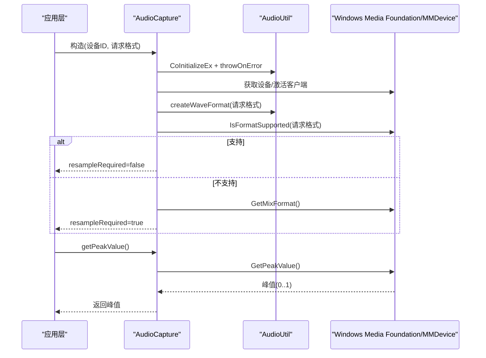
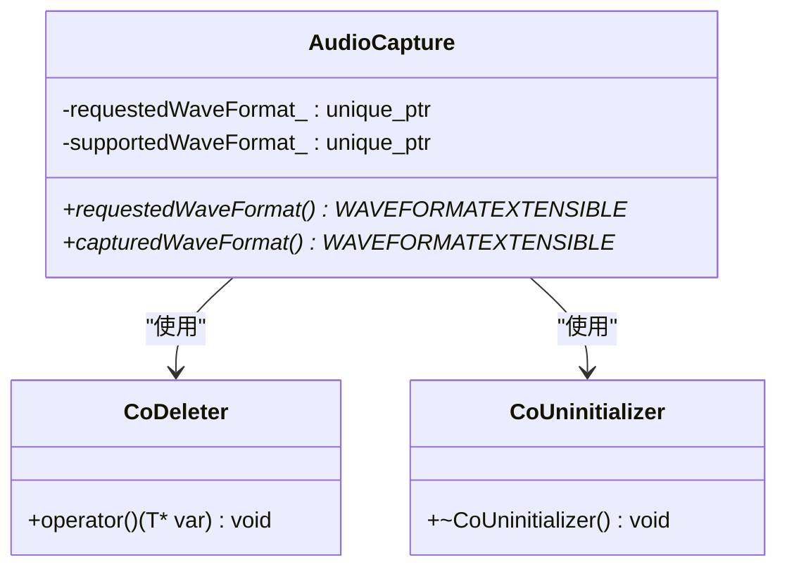
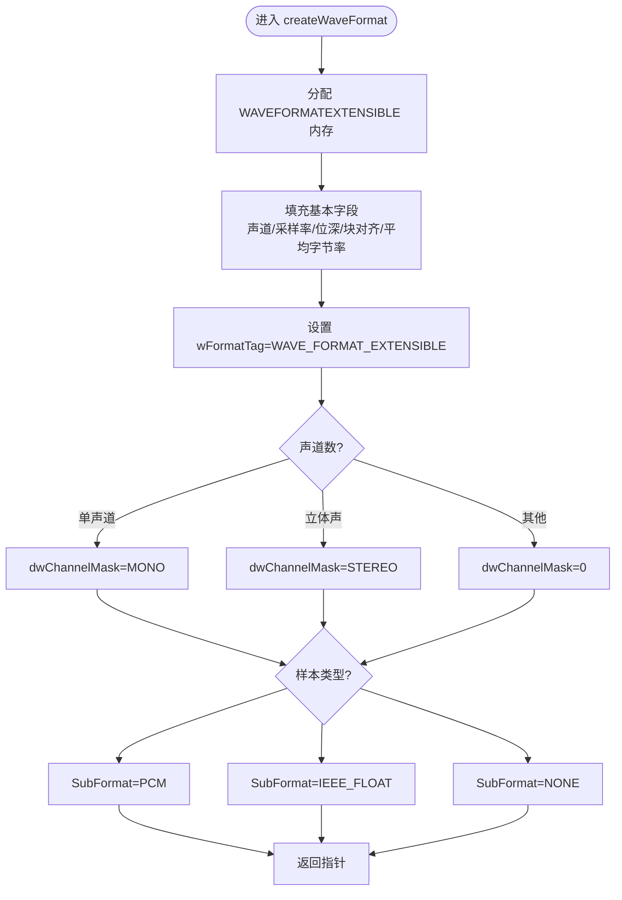
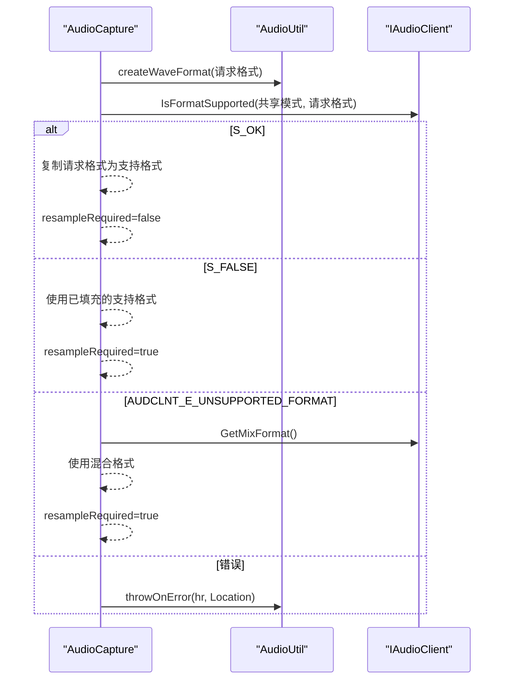
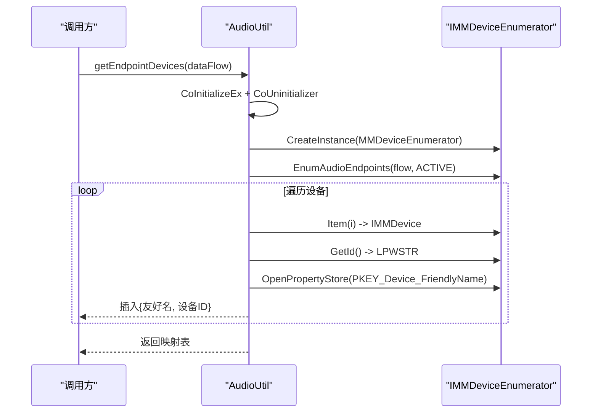
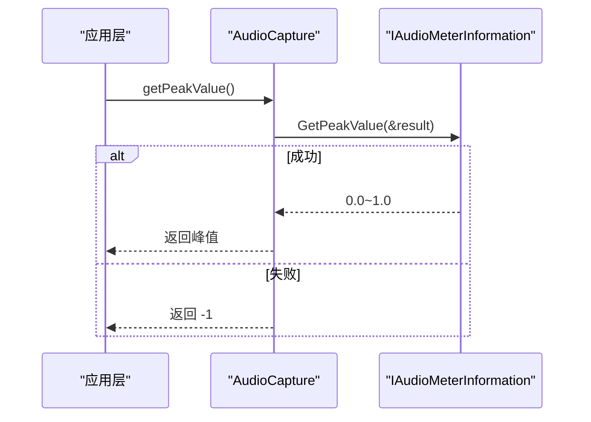
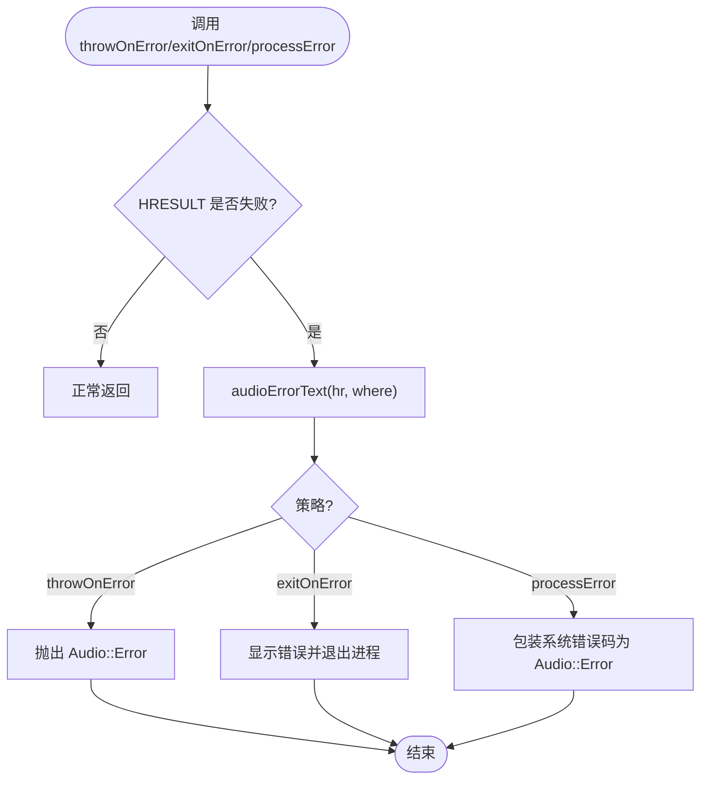
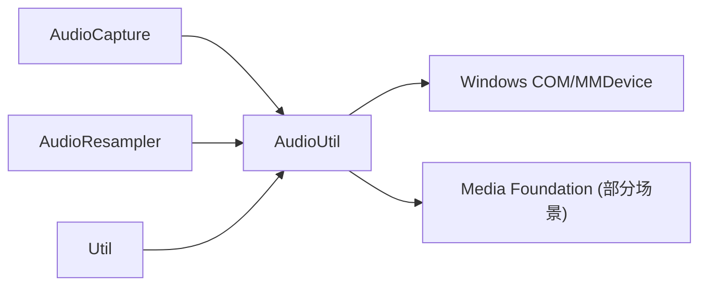

# AudioUtil 音频工具

<cite>
**本文引用的文件**   
- [AudioUtil.h](file://SoundRemote/AudioUtil.h)
- [AudioUtil.cpp](file://SoundRemote/AudioUtil.cpp)
- [AudioCapture.h](file://SoundRemote/AudioCapture.h)
- [AudioCapture.cpp](file://SoundRemote/AudioCapture.cpp)
- [AudioResampler.h](file://SoundRemote/AudioResampler.h)
- [AudioResampler.cpp](file://SoundRemote/AudioResampler.cpp)
- [Util.h](file://SoundRemote/Util.h)
</cite>

## 目录
1. [简介](#简介)
2. [项目结构](#项目结构)
3. [核心组件](#核心组件)
4. [架构总览](#架构总览)
5. [详细组件分析](#详细组件分析)
6. [依赖关系分析](#依赖关系分析)
7. [性能与资源管理](#性能与资源管理)
8. [故障排查指南](#故障排查指南)
9. [结论](#结论)
10. [附录：使用示例与最佳实践](#附录使用示例与最佳实践)

## 简介
本文件为 AudioUtil 工具模块的权威技术文档，聚焦于以下能力：
- 音频设备枚举与默认设备获取
- WAVEFORMATEXTENSIBLE 结构的创建、填充与生命周期管理（RAII）
- 音频格式兼容性检查流程与结果判定
- 峰值采样值获取与音量统计接口
- 错误处理与诊断信息生成
- CoDeleter 智能指针删除器与 RAII 资源管理模式
- 在音频采集、重采样、编码链路中的复用价值与最佳实践

## 项目结构
AudioUtil 位于 SoundRemote 子项目中，提供跨模块复用的音频基础能力。其关键文件包括：
- 头文件定义类型、常量、异常与工具函数声明
- 实现文件完成 COM 初始化、设备枚举、错误文本生成等
- 上层模块（如 AudioCapture、AudioResampler）通过包含该头文件复用工具能力

图示来源
- [AudioUtil.h:1-170](file://SoundRemote/AudioUtil.h#L1-L170)
- [AudioUtil.cpp:1-102](file://SoundRemote/AudioUtil.cpp#L1-L102)
- [AudioCapture.h:1-144](file://SoundRemote/AudioCapture.h#L1-L144)
- [AudioCapture.cpp:1-200](file://SoundRemote/AudioCapture.cpp#L1-L200)
- [AudioResampler.h:1-24](file://SoundRemote/AudioResampler.h#L1-L24)
- [AudioResampler.cpp:1-30](file://SoundRemote/AudioResampler.cpp#L1-L30)
- [Util.h:1-70](file://SoundRemote/Util.h#L1-L70)

章节来源
- [AudioUtil.h:1-170](file://SoundRemote/AudioUtil.h#L1-L170)
- [AudioUtil.cpp:1-102](file://SoundRemote/AudioUtil.cpp#L1-L102)
- [AudioCapture.h:1-144](file://SoundRemote/AudioCapture.h#L1-L144)
- [AudioResampler.h:1-24](file://SoundRemote/AudioResampler.h#L1-L24)
- [Util.h:1-70](file://SoundRemote/Util.h#L1-L70)

## 核心组件
本节概述 AudioUtil 提供的关键类型与函数，并说明其在整体音频管线中的作用。

- 数据与常量
  - Format：描述目标音频格式（采样率、声道数、位深、样本类型、字节序）
  - SampleType：样本数据类型（有符号整型、无符号整型、浮点）
  - Opus 命名空间：Opus 帧长、最大包大小、支持采样率与声道枚举
  - Compression：压缩码率常量（用于计算包大小等）

- 资源管理与 RAII
  - CoDeleter<T>：基于 CoTaskMemFree 的智能指针删除器，配合 std::unique_ptr 自动释放 COM 分配内存
  - CoUninitializer：析构时调用 CoUninitialize，确保 COM 线程环境正确关闭

- 设备与格式工具
  - getEndpointDevices：枚举活动音频端点，返回友好名到设备 ID 的映射
  - getDefaultDevice：获取指定数据流方向的默认设备 ID
  - createWaveFormat（内部辅助）：从 Audio::Format 构造 WAVEFORMATEXTENSIBLE 结构体

- 错误处理与诊断
  - throwOnError / exitOnError / processError：统一 HRESULT 或系统错误码的错误抛出/退出策略
  - audioErrorText：将错误位置与错误码转换为可读文本，含特殊场景提示（如麦克风访问被拒绝）

- 峰值与质量评估
  - getPeakValue（由 AudioCapture 暴露）：读取 IAudioMeterInformation 峰值，范围 0.0~1.0，失败返回 -1

章节来源
- [AudioUtil.h:24-170](file://SoundRemote/AudioUtil.h#L24-L170)
- [AudioUtil.cpp:8-102](file://SoundRemote/AudioUtil.cpp#L8-L102)
- [AudioCapture.cpp:52-88](file://SoundRemote/AudioCapture.cpp#L52-L88)
- [AudioCapture.cpp:294-301](file://SoundRemote/AudioCapture.cpp#L294-L301)

## 架构总览
AudioUtil 作为底层工具层，向上为采集与重采样模块提供：
- 设备发现与默认设备选择
- 格式构建与兼容性判断
- 统一的错误处理与诊断输出
- RAII 资源管理，避免手动释放导致的泄漏

图示来源
- [AudioCapture.cpp:118-200](file://SoundRemote/AudioCapture.cpp#L118-L200)
- [AudioCapture.cpp:282-301](file://SoundRemote/AudioCapture.cpp#L282-L301)
- [AudioUtil.cpp:77-101](file://SoundRemote/AudioUtil.cpp#L77-L101)

## 详细组件分析

### 组件一：CoDeleter 与 RAII 资源管理
CoDeleter 是 AudioUtil 中关键的 RAII 抽象，专门用于自动释放由 COM 分配的内存（CoTaskMemAlloc/Created）。它与 std::unique_ptr 组合，形成“拥有即释放”的安全模式，避免忘记释放或异常路径下的泄漏。

图示来源
- [AudioUtil.h:135-147](file://SoundRemote/AudioUtil.h#L135-L147)
- [AudioCapture.h:64-78](file://SoundRemote/AudioCapture.h#L64-L78)
- [AudioCapture.cpp:152-185](file://SoundRemote/AudioCapture.cpp#L152-L185)

章节来源
- [AudioUtil.h:135-147](file://SoundRemote/AudioUtil.h#L135-L147)
- [AudioCapture.h:64-78](file://SoundRemote/AudioCapture.h#L64-L78)
- [AudioCapture.cpp:152-185](file://SoundRemote/AudioCapture.cpp#L152-L185)

### 组件二：WAVEFORMATEXTENSIBLE 结构与格式构建
createWaveFormat 负责根据 Audio::Format 构造 WAVEFORMATEXTENSIBLE，设置声道掩码、位宽、有效位、子格式（PCM/IEEE_FLOAT）等关键字段，供后续 IsFormatSupported 与 Initialize 使用。

图示来源
- [AudioCapture.cpp:52-88](file://SoundRemote/AudioCapture.cpp#L52-L88)

章节来源
- [AudioCapture.cpp:52-88](file://SoundRemote/AudioCapture.cpp#L52-L88)

### 组件三：音频格式兼容性检查流程
AudioCapture 在构造阶段进行格式兼容性检查，依据 IsFormatSupported 返回值决定是否需要重采样，并在不支持时回退到混合格式。

图示来源
- [AudioCapture.cpp:156-185](file://SoundRemote/AudioCapture.cpp#L156-L185)
- [AudioUtil.cpp:77-87](file://SoundRemote/AudioUtil.cpp#L77-L87)

章节来源
- [AudioCapture.cpp:156-185](file://SoundRemote/AudioCapture.cpp#L156-L185)
- [AudioUtil.cpp:77-87](file://SoundRemote/AudioUtil.cpp#L77-L87)

### 组件四：设备枚举与默认设备
AudioUtil 提供设备枚举与默认设备查询，封装了 COM 初始化、枚举器创建、属性读取与字符串释放等细节。

图示来源
- [AudioUtil.cpp:8-51](file://SoundRemote/AudioUtil.cpp#L8-L51)

章节来源
- [AudioUtil.cpp:8-51](file://SoundRemote/AudioUtil.cpp#L8-L51)

### 组件五：峰值采样与音量统计
getPeakValue 通过 IAudioMeterInformation 获取当前音频流的峰值，用于实时音量指示与质量评估。

图示来源
- [AudioCapture.cpp:294-301](file://SoundRemote/AudioCapture.cpp#L294-L301)

章节来源
- [AudioCapture.cpp:294-301](file://SoundRemote/AudioCapture.cpp#L294-L301)

### 组件六：错误处理与诊断
AudioUtil 提供统一的错误处理入口，结合 Util 的消息框能力与自定义错误文本生成，便于定位问题。

图示来源
- [AudioUtil.cpp:77-101](file://SoundRemote/AudioUtil.cpp#L77-L101)
- [Util.h:16-22](file://SoundRemote/Util.h#L16-L22)

章节来源
- [AudioUtil.cpp:77-101](file://SoundRemote/AudioUtil.cpp#L77-L101)
- [Util.h:16-22](file://SoundRemote/Util.h#L16-L22)

## 依赖关系分析
AudioUtil 对 Windows COM/MMDevice/Media Foundation 存在直接依赖；同时被采集与重采样模块广泛复用。

图示来源
- [AudioUtil.h:1-23](file://SoundRemote/AudioUtil.h#L1-L23)
- [AudioUtil.cpp:1-10](file://SoundRemote/AudioUtil.cpp#L1-L10)
- [AudioCapture.h:1-14](file://SoundRemote/AudioCapture.h#L1-L14)
- [AudioResampler.h:1-10](file://SoundRemote/AudioResampler.h#L1-L10)

章节来源
- [AudioUtil.h:1-23](file://SoundRemote/AudioUtil.h#L1-L23)
- [AudioUtil.cpp:1-10](file://SoundRemote/AudioUtil.cpp#L1-L10)
- [AudioCapture.h:1-14](file://SoundRemote/AudioCapture.h#L1-L14)
- [AudioResampler.h:1-10](file://SoundRemote/AudioResampler.h#L1-L10)

## 性能与资源管理
- RAII 优先：使用 CoDeleter 与 std::unique_ptr 管理 WAVEFORMATEXTENSIBLE 等 COM 分配对象，避免泄漏与重复释放
- 最小化 COM 初始化开销：在需要时按需初始化 COM，并通过 CoUninitializer 保证析构路径正确关闭
- 缓冲区与帧长度：Opus 帧长与最大包大小常量有助于预估网络传输与编码缓冲需求
- 峰值采样：IAudioMeterInformation 的 GetPeakValue 为轻量级查询，适合周期性读取用于 UI 反馈

[本节为通用指导，不直接分析具体文件]

## 故障排查指南
- 麦克风访问被拒绝：当初始化捕获流返回 E_ACCESSDENIED 时，audioErrorText 会给出隐私设置相关提示
- 设备不可用或权限不足：检查 getEndpointDevices 返回的设备列表是否为空，确认设备状态与权限
- 格式不支持：若 IsFormatSupported 返回非 S_OK，需启用重采样或使用 GetMixFormat 回退
- 资源未释放：确认所有 CoTaskMemAlloc 的对象均通过 CoDeleter 或显式 CoTaskMemFree 释放

章节来源
- [AudioUtil.cpp:93-101](file://SoundRemote/AudioUtil.cpp#L93-L101)
- [AudioCapture.cpp:156-185](file://SoundRemote/AudioCapture.cpp#L156-L185)

## 结论
AudioUtil 提供了音频子系统的基础设施：设备发现、格式构建、兼容性检查、错误诊断与 RAII 资源管理。通过 CoDeleter 与 CoUninitializer，显著降低了 COM 资源管理的复杂度与出错概率。上层模块可安全复用这些能力，快速构建稳定的采集与重采样流水线。

[本节为总结性内容，不直接分析具体文件]

## 附录：使用示例与最佳实践
以下为常见用法的路径指引（不包含代码片段），帮助读者快速上手：

- 使用 CoDeleter 管理 WAVEFORMATEXTENSIBLE
  - 参考：[AudioCapture.h:64-78](file://SoundRemote/AudioCapture.h#L64-L78)
  - 参考：[AudioUtil.h:135-140](file://SoundRemote/AudioUtil.h#L135-L140)

- 构造 WAVEFORMATEXTENSIBLE 并检查兼容性
  - 参考：[AudioCapture.cpp:52-88](file://SoundRemote/AudioCapture.cpp#L52-L88)
  - 参考：[AudioCapture.cpp:156-185](file://SoundRemote/AudioCapture.cpp#L156-L185)

- 枚举设备与获取默认设备
  - 参考：[AudioUtil.cpp:8-51](file://SoundRemote/AudioUtil.cpp#L8-L51)
  - 参考：[AudioUtil.cpp:53-75](file://SoundRemote/AudioUtil.cpp#L53-L75)

- 统一错误处理与诊断
  - 参考：[AudioUtil.cpp:77-101](file://SoundRemote/AudioUtil.cpp#L77-L101)
  - 参考：[Util.h:16-22](file://SoundRemote/Util.h#L16-L22)

- 获取峰值用于音量指示
  - 参考：[AudioCapture.cpp:294-301](file://SoundRemote/AudioCapture.cpp#L294-L301)

- 重采样集成（当格式不兼容时）
  - 参考：[AudioResampler.h:14-23](file://SoundRemote/AudioResampler.h#L14-L23)
  - 参考：[AudioResampler.cpp:11-30](file://SoundRemote/AudioResampler.cpp#L11-L30)

最佳实践建议
- 始终使用 CoDeleter 包裹 COM 分配对象，避免手动 Release/Free
- 在构造期完成格式兼容性检查与回退策略，避免运行时频繁切换
- 使用 throwOnError/exitOnError 统一错误路径，保持日志与用户提示一致
- 周期性读取峰值用于 UI 反馈，但避免高频阻塞主循环

[本节为使用指引，不直接分析具体文件]