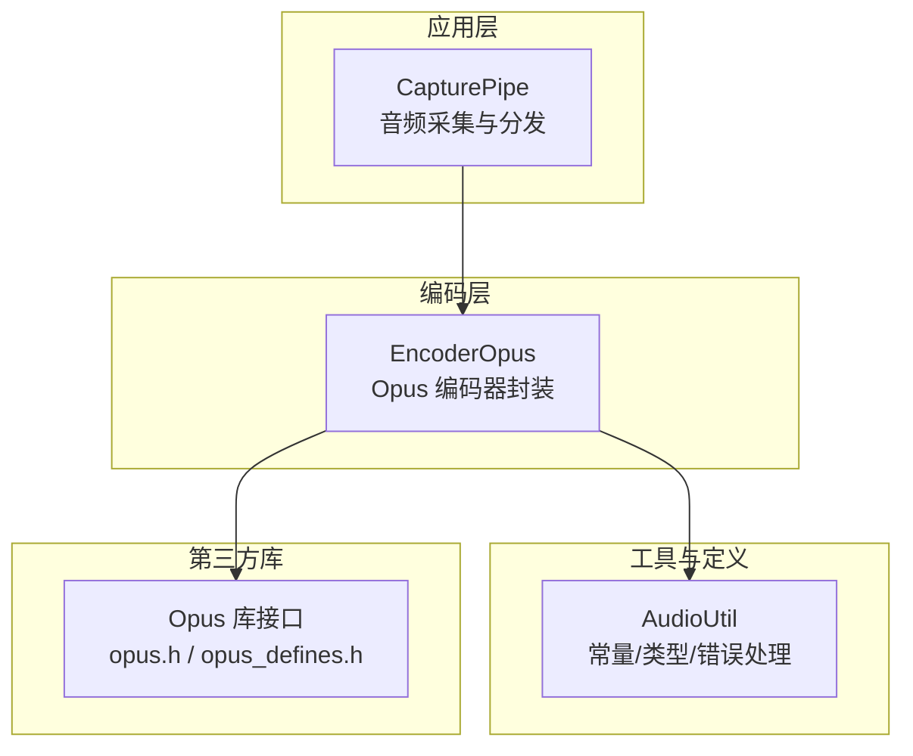
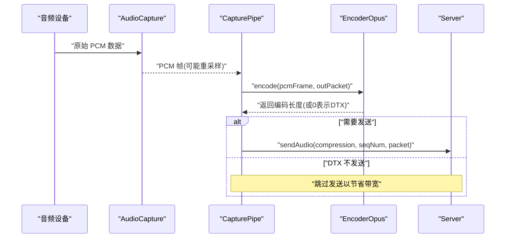
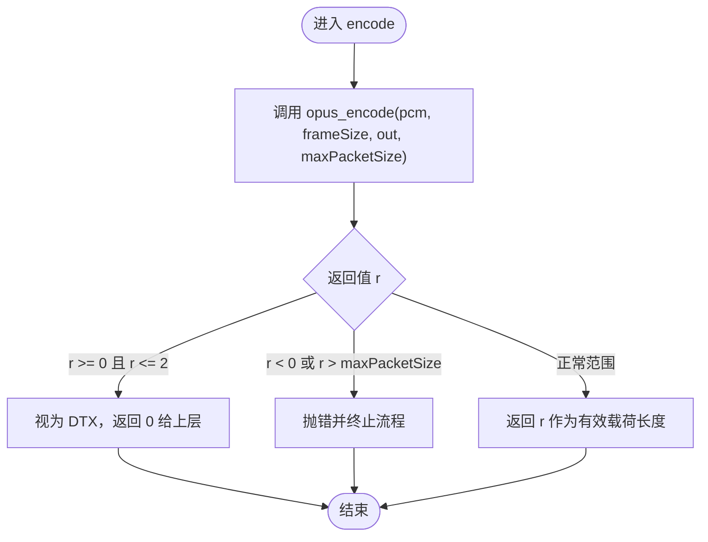
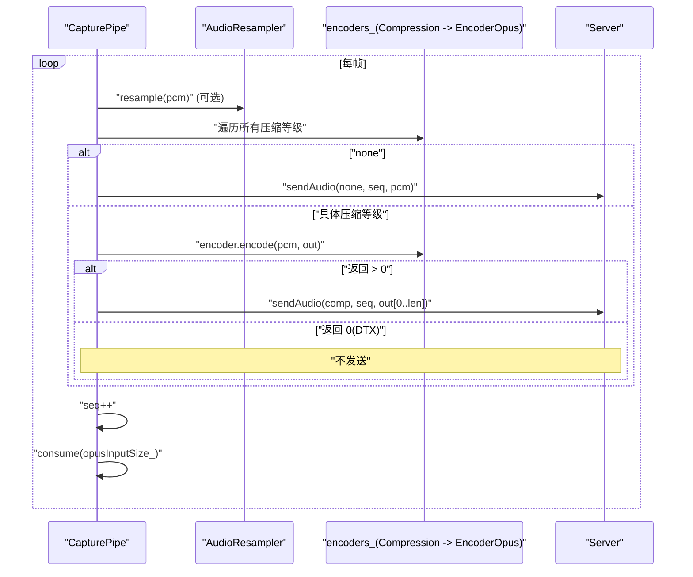
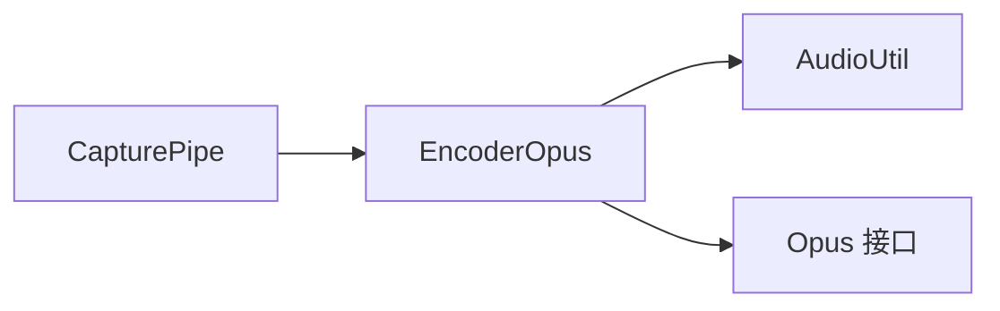

# EncoderOpus 音频编码器

<cite>
**本文引用的文件**   
- [EncoderOpus.h](file://SoundRemote/EncoderOpus.h)
- [EncoderOpus.cpp](file://SoundRemote/EncoderOpus.cpp)
- [AudioUtil.h](file://SoundRemote/AudioUtil.h)
- [AudioUtil.cpp](file://SoundRemote/AudioUtil.cpp)
- [CapturePipe.h](file://SoundRemote/CapturePipe.h)
- [CapturePipe.cpp](file://SoundRemote/CapturePipe.cpp)
- [opus.h](file://include/opus/opus.h)
- [opus_defines.h](file://include/opus/opus_defines.h)
- [EncoderOpusTest.cpp](file://Tests/EncoderOpusTest.cpp)
</cite>

## 目录
1. [简介](#简介)
2. [项目结构](#项目结构)
3. [核心组件](#核心组件)
4. [架构总览](#架构总览)
5. [详细组件分析](#详细组件分析)
6. [依赖关系分析](#依赖关系分析)
7. [性能与延迟优化](#性能与延迟优化)
8. [故障排查指南](#故障排查指南)
9. [结论](#结论)
10. [附录：使用示例路径](#附录使用示例路径)

## 简介
本文件围绕 SoundRemote-WinServer 中的 EncoderOpus 组件，系统化阐述 Opus 音频编解码库的集成方式、编码器初始化、参数配置与实时编码流程。文档重点覆盖以下方面：
- 编码器创建与资源管理（RAII）
- 关键参数：采样率、声道数、帧长、比特率控制
- PCM 到 Opus 压缩的转换过程与错误处理
- 与音频采集管道 CapturePipe 的集成方式
- 性能与延迟优化建议
- 测试用例覆盖的关键场景

## 项目结构
与 EncoderOpus 直接相关的代码位于 SoundRemote 目录，外部依赖为 include/opus 下的 Opus 头文件；集成点主要在 CapturePipe 中完成。



图表来源
- [CapturePipe.cpp:124-155](file://SoundRemote/CapturePipe.cpp#L124-L155)
- [EncoderOpus.cpp:10-38](file://SoundRemote/EncoderOpus.cpp#L10-L38)
- [AudioUtil.h:27-39](file://SoundRemote/AudioUtil.h#L27-L39)
- [opus.h:176-200](file://include/opus/opus.h#L176-L200)

章节来源
- [EncoderOpus.h:1-37](file://SoundRemote/EncoderOpus.h#L1-L37)
- [EncoderOpus.cpp:1-53](file://SoundRemote/EncoderOpus.cpp#L1-L53)
- [AudioUtil.h:24-116](file://SoundRemote/AudioUtil.h#L24-L116)
- [CapturePipe.h:23-51](file://SoundRemote/CapturePipe.h#L23-L51)
- [CapturePipe.cpp:40-95](file://SoundRemote/CapturePipe.cpp#L40-L95)

## 核心组件
- EncoderOpus：对 Opus 编码器进行 RAII 封装，提供编码器创建、比特率设置、PCM 帧编码、帧大小与输入缓冲大小计算等能力。
- AudioUtil：集中定义采样率、声道、帧长、最大包大小、压缩等级枚举以及统一的错误处理函数。
- CapturePipe：负责从音频设备采集 PCM，按固定帧长切分并调用各压缩等级的 EncoderOpus 实例进行编码，再将结果发送到服务端。

章节来源
- [EncoderOpus.h:9-36](file://SoundRemote/EncoderOpus.h#L9-L36)
- [EncoderOpus.cpp:10-46](file://SoundRemote/EncoderOpus.cpp#L10-L46)
- [AudioUtil.h:27-39](file://SoundRemote/AudioUtil.h#L27-L39)
- [CapturePipe.cpp:124-155](file://SoundRemote/CapturePipe.cpp#L124-L155)

## 架构总览
下图展示了从音频采集到 Opus 编码再到网络发送的整体数据流。



图表来源
- [CapturePipe.cpp:124-155](file://SoundRemote/CapturePipe.cpp#L124-L155)
- [EncoderOpus.cpp:27-38](file://SoundRemote/EncoderOpus.cpp#L27-L38)

## 详细组件分析

### EncoderOpus 类设计
- 构造阶段
  - 根据采样率计算每帧样本数 frameSize_
  - 调用底层 opus_encoder_create 创建编码器状态，应用模式为“音频”
  - 通过 opus_encoder_ctl 设置目标比特率（来自 Compression 枚举值）
  - 若失败则抛出统一错误
- 编码阶段
  - encode 将 PCM 指针转换为 opus_int16* 传入 opus_encode
  - 当返回值在 [0, 2] 时视为 DTX（静音抑制），上层应丢弃该包
  - 其他负值或超出 maxPacketSize 的情况走统一错误处理
- 资源管理
  - 使用自定义删除器释放 Opus 编码器状态，避免手动管理

```mermaid
classDiagram
class EncoderOpus {
+EncoderOpus(compression, sampleRate, channels)
+encode(pcmAudio, encodedPacket) int
+getFrameSize(sampleRate) static int
+getInputSize(frameSize, channels) static int
-encoder_ : unique_ptr<OpusEncoder, EncoderDeleter>
-frameSize_ : int
}
class EncoderDeleter {
+operator()(OpusEncoder*) void
}
class AudioUtil {
<<namespace>>
+enum Compression
+namespace Opus {
+enum SampleRate
+enum Channels
+constexpr int frameLength
+constexpr int maxPacketSize
}
+processError(errorCode, where)
}
EncoderOpus --> AudioUtil : "使用常量/错误处理"
EncoderOpus ..> EncoderDeleter : "RAII 释放"
```

图表来源
- [EncoderOpus.h:9-36](file://SoundRemote/EncoderOpus.h#L9-L36)
- [EncoderOpus.cpp:10-52](file://SoundRemote/EncoderOpus.cpp#L10-L52)
- [AudioUtil.h:27-39](file://SoundRemote/AudioUtil.h#L27-L39)

章节来源
- [EncoderOpus.h:9-36](file://SoundRemote/EncoderOpus.h#L9-L36)
- [EncoderOpus.cpp:10-52](file://SoundRemote/EncoderOpus.cpp#L10-L52)
- [AudioUtil.h:27-39](file://SoundRemote/AudioUtil.h#L27-L39)

### 编码器初始化与参数配置
- 采样率与声道
  - 支持 8/12/16/24/48 kHz，单声道或立体声
  - 由构造函数参数指定，并在内部用于计算 frameSize_
- 帧长与输入缓冲
  - 帧长以毫秒为单位，当前固定为 10ms
  - getFrameSize 根据采样率换算成每通道样本数
  - getInputSize 根据 frameSize 和声道数计算 PCM 输入字节数（16bit = 2 字节/样本）
- 比特率控制
  - 通过 OPUS_SET_BITRATE 设置 CBR 目标比特率
  - 支持的压缩等级包括 64/128/192/256/320 kbps
- 应用模式
  - 使用 OPUS_APPLICATION_AUDIO，适合音乐与非语音内容，兼顾质量与低延迟

章节来源
- [EncoderOpus.cpp:10-25](file://SoundRemote/EncoderOpus.cpp#L10-L25)
- [EncoderOpus.cpp:40-46](file://SoundRemote/EncoderOpus.cpp#L40-L46)
- [AudioUtil.h:27-39](file://SoundRemote/AudioUtil.h#L27-L39)
- [opus.h:176-200](file://include/opus/opus.h#L176-L200)

### 实时编码流程与 DTX 处理
- 输入格式
  - PCM 为 16 位有符号整型，按帧组织，每帧包含 frameSize * channels 个样本
- 编码输出
  - 返回值为实际写入的字节数；若 <= 2 且 >= 0，表示 DTX，上层不应发送
  - 若 < 0 或 > maxPacketSize，触发统一错误处理
- 缓冲区大小
  - 输出缓冲至少为 Audio::Opus::maxPacketSize，该值基于最高比特率和帧长计算



图表来源
- [EncoderOpus.cpp:27-38](file://SoundRemote/EncoderOpus.cpp#L27-L38)
- [AudioUtil.h:38](file://SoundRemote/AudioUtil.h#L38)

章节来源
- [EncoderOpus.cpp:27-38](file://SoundRemote/EncoderOpus.cpp#L27-L38)
- [AudioUtil.h:38](file://SoundRemote/AudioUtil.h#L38)

### 与音频管道的集成（CapturePipe）
- 编码器池
  - 维护一个按压缩等级映射的编码器集合 encoders_
  - 客户端更新时按需创建/销毁对应压缩等级的编码器
- 数据处理
  - 若需要重采样，先经 AudioResampler 转换至 48kHz 立体声
  - 按 opusInputSize_ 切分 PCM 帧，循环对所有编码器执行 encode
  - 对于 none 压缩等级，直接转发未压缩 PCM；否则发送编码后的包
- 序列号与静音抑制
  - 每个音频包附带自增序列号
  - 若 encode 返回 0（DTX），则跳过发送，降低带宽占用



图表来源
- [CapturePipe.cpp:124-155](file://SoundRemote/CapturePipe.cpp#L124-L155)
- [CapturePipe.cpp:69-95](file://SoundRemote/CapturePipe.cpp#L69-L95)

章节来源
- [CapturePipe.cpp:69-95](file://SoundRemote/CapturePipe.cpp#L69-L95)
- [CapturePipe.cpp:124-155](file://SoundRemote/CapturePipe.cpp#L124-L155)

### 错误处理与异常恢复
- 统一错误入口
  - Audio::processError 将 Opus 错误码转换为可读文本并抛出异常
  - 错误位置通过 Location 枚举标注，便于定位问题
- 典型错误点
  - ENCODER_CREATE：编码器创建失败
  - ENCODER_SET_BITRATE：设置比特率失败
  - ENCODER_ENCODE：编码失败或输出越界
- 恢复策略
  - 上层捕获异常后，可记录日志、回退到更低比特率或降级为未压缩传输

章节来源
- [AudioUtil.cpp:89-91](file://SoundRemote/AudioUtil.cpp#L89-L91)
- [AudioUtil.h:100-102](file://SoundRemote/AudioUtil.h#L100-L102)
- [EncoderOpus.cpp:18-24](file://SoundRemote/EncoderOpus.cpp#L18-L24)
- [EncoderOpus.cpp:34-36](file://SoundRemote/EncoderOpus.cpp#L34-L36)

## 依赖关系分析
- 模块耦合
  - EncoderOpus 仅依赖 AudioUtil 提供的常量与错误处理，保持内聚
  - CapturePipe 聚合多个 EncoderOpus 实例，按客户端需求动态管理
- 外部依赖
  - Opus 库通过 opus.h 暴露 API，本项目仅使用必要的创建、控制与编码接口
- 潜在风险
  - 当前未启用 VBR、复杂度、信号类型等高级 CTL，如需进一步优化可在后续扩展



图表来源
- [CapturePipe.cpp:124-155](file://SoundRemote/CapturePipe.cpp#L124-L155)
- [EncoderOpus.cpp:10-38](file://SoundRemote/EncoderOpus.cpp#L10-L38)
- [AudioUtil.h:27-39](file://SoundRemote/AudioUtil.h#L27-L39)

章节来源
- [CapturePipe.cpp:124-155](file://SoundRemote/CapturePipe.cpp#L124-L155)
- [EncoderOpus.cpp:10-38](file://SoundRemote/EncoderOpus.cpp#L10-L38)
- [AudioUtil.h:27-39](file://SoundRemote/AudioUtil.h#L27-L39)

## 性能与延迟优化
- 帧长与延迟
  - 当前固定 10ms 帧长，平衡了音质与端到端延迟
  - 若需更低延迟，可考虑更小的帧长（如 5ms），但会提升 CPU 与开销
- 比特率与质量
  - 多路编码器并行针对不同客户端提供不同比特率，避免重复编码
  - 高比特率带来更高音质与更大带宽占用，需结合网络状况权衡
- 复杂度与信号类型
  - 当前未显式设置复杂度与信号类型，默认适用于通用音频
  - 若主要为语音，可考虑调整信号类型为语音以提升同等比特率下的清晰度
- 内存与拷贝
  - 输入 PCM 直接使用 span<char> 视图，减少额外拷贝
  - 输出缓冲复用 std::vector<char>，按需 resize，避免频繁分配

章节来源
- [AudioUtil.h:34-38](file://SoundRemote/AudioUtil.h#L34-L38)
- [CapturePipe.cpp:124-155](file://SoundRemote/CapturePipe.cpp#L124-L155)
- [EncoderOpus.cpp:40-46](file://SoundRemote/EncoderOpus.cpp#L40-L46)

## 故障排查指南
- 常见问题
  - 编码器创建失败：检查采样率、声道数是否受支持；确认系统音频权限
  - 设置比特率失败：确认传入的 Compression 值合法且在 Opus 支持范围内
  - 编码返回负值：检查输入 PCM 是否为 16bit 有符号整型、帧大小是否正确
  - 输出超过 maxPacketSize：检查网络 MTU 与上层打包逻辑
- 定位方法
  - 利用 Location 枚举与错误文本快速定位出错阶段
  - 打印或记录 audioSequenceNumber_ 与当前压缩等级，辅助复现问题

章节来源
- [AudioUtil.cpp:93-101](file://SoundRemote/AudioUtil.cpp#L93-L101)
- [AudioUtil.h:100-102](file://SoundRemote/AudioUtil.h#L100-L102)
- [EncoderOpus.cpp:18-24](file://SoundRemote/EncoderOpus.cpp#L18-L24)
- [EncoderOpus.cpp:34-36](file://SoundRemote/EncoderOpus.cpp#L34-L36)

## 结论
EncoderOpus 以简洁清晰的 RAII 封装对接 Opus 库，配合 CapturePipe 的多路编码器管理与 DTX 静音抑制，实现了高效稳定的实时音频编码与传输。当前实现聚焦于 CBR 与基础参数，具备良好扩展性，可按需在复杂度、VBR、信号类型等方面进一步调优以满足不同场景的质量与延迟需求。

## 附录：使用示例路径
- 创建编码器实例（不同采样率与声道组合）
  - [Tests/EncoderOpusTest.cpp:15-18](file://Tests/EncoderOpusTest.cpp#L15-L18)
- 创建编码器实例（不同压缩等级）
  - [Tests/EncoderOpusTest.cpp:38-41](file://Tests/EncoderOpusTest.cpp#L38-L41)
- 计算帧大小与输入缓冲大小
  - [EncoderOpus.cpp:40-46](file://SoundRemote/EncoderOpus.cpp#L40-L46)
- 编码一帧 PCM 并处理 DTX
  - [EncoderOpus.cpp:27-38](file://SoundRemote/EncoderOpus.cpp#L27-L38)
- 在管道中按帧编码并发送
  - [CapturePipe.cpp:124-155](file://SoundRemote/CapturePipe.cpp#L124-L155)
- 动态创建/销毁编码器（按客户端压缩等级）
  - [CapturePipe.cpp:69-95](file://SoundRemote/CapturePipe.cpp#L69-L95)