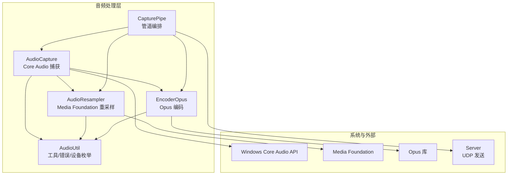
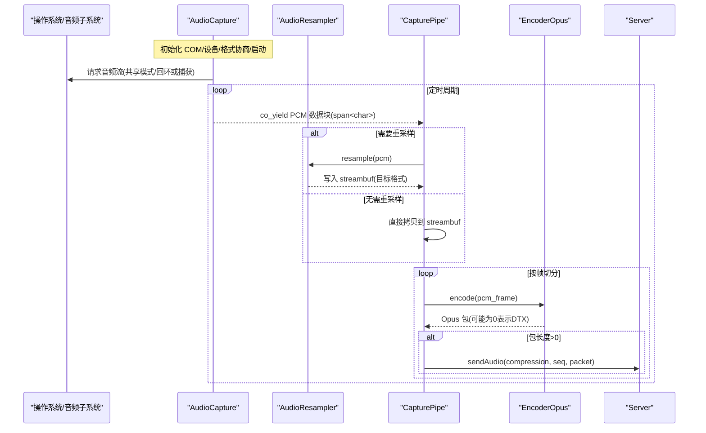
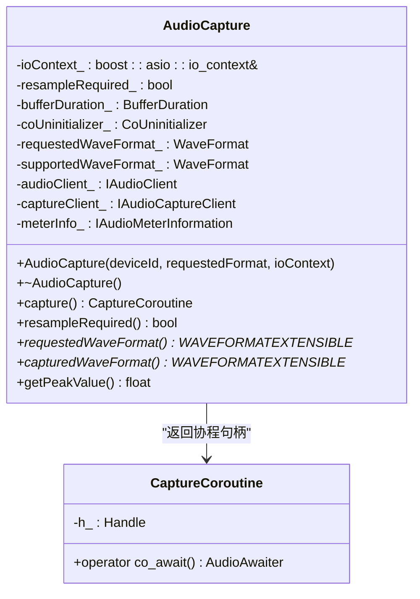
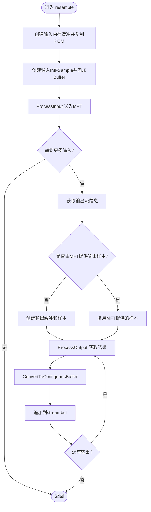
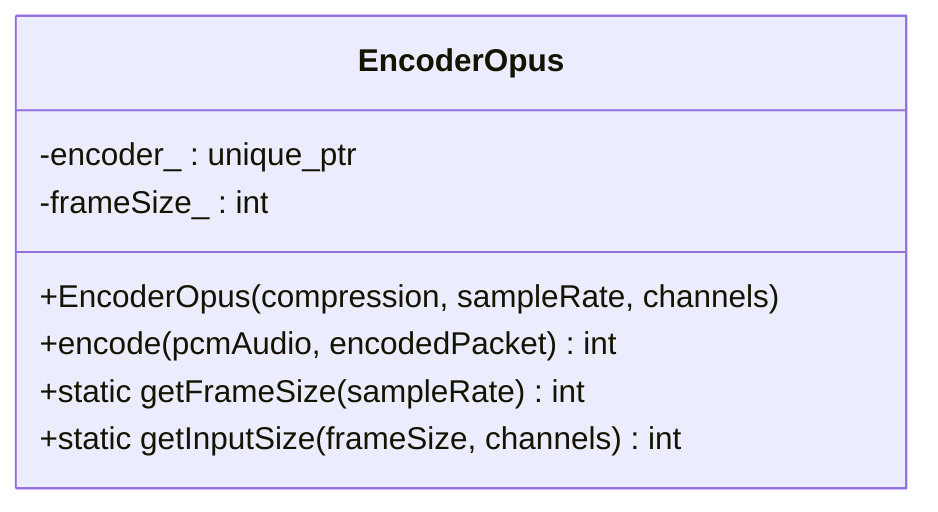
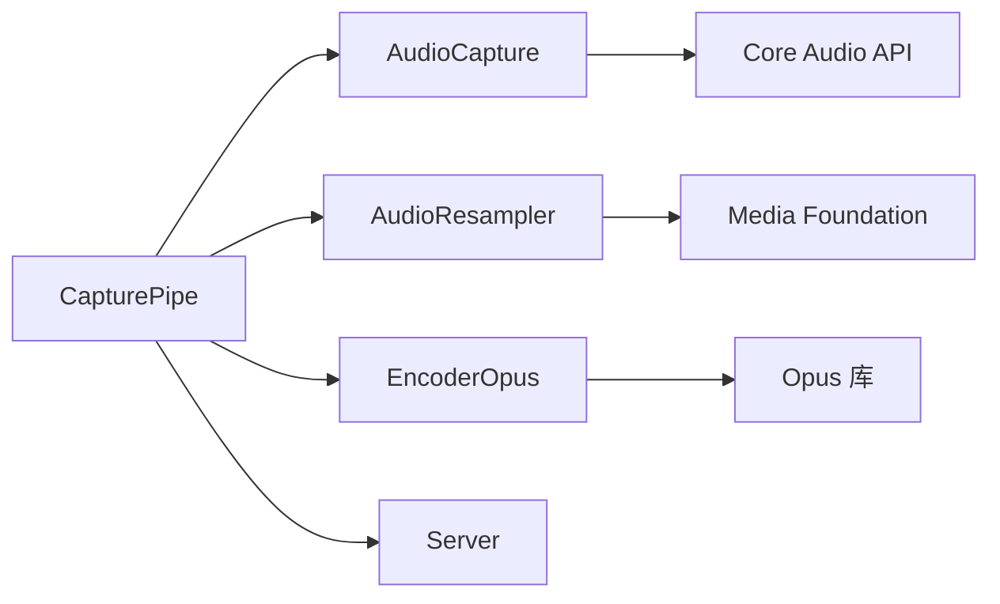

# 音频处理模块

<cite>
**本文引用的文件**
- [AudioCapture.h](file://SoundRemote/AudioCapture.h)
- [AudioCapture.cpp](file://SoundRemote/AudioCapture.cpp)
- [AudioResampler.h](file://SoundRemote/AudioResampler.h)
- [AudioResampler.cpp](file://SoundRemote/AudioResampler.cpp)
- [EncoderOpus.h](file://SoundRemote/EncoderOpus.h)
- [EncoderOpus.cpp](file://SoundRemote/EncoderOpus.cpp)
- [AudioUtil.h](file://SoundRemote/AudioUtil.h)
- [AudioUtil.cpp](file://SoundRemote/AudioUtil.cpp)
- [CapturePipe.h](file://SoundRemote/CapturePipe.h)
- [CapturePipe.cpp](file://SoundRemote/CapturePipe.cpp)
- [Server.h](file://SoundRemote/Server.h)
- [README.md](file://README.md)
</cite>

## 目录
1. [简介](#简介)
2. [项目结构](#项目结构)
3. [核心组件](#核心组件)
4. [架构总览](#架构总览)
5. [详细组件分析](#详细组件分析)
6. [依赖关系分析](#依赖关系分析)
7. [性能考虑](#性能考虑)
8. [故障排查指南](#故障排查指南)
9. [结论](#结论)
10. [附录：使用示例与最佳实践](#附录使用示例与最佳实践)

## 简介
本文件面向 SoundRemote-WinServer 的音频处理模块，系统性梳理并深入解析以下核心组件的实现原理与使用方法：
- AudioCapture：基于 Windows Core Audio API 的音频捕获封装，提供 C++20 协程驱动的 PCM 数据流。
- AudioResampler：基于 Media Foundation 的重采样器，负责在设备实际格式与目标格式不一致时进行转换。
- EncoderOpus：基于 Opus 库的编码器，将 PCM 帧编码为 Opus 包，支持多种码率与声道配置。
- AudioUtil：通用工具与错误处理、设备枚举、默认设备获取等辅助能力。
- CapturePipe：音频处理管道编排者，串联捕获、重采样、编码与网络发送。

该模块的目标是在 Windows 平台上高效采集系统或麦克风音频，按需重采样至统一目标格式（如 48kHz 立体声），并以 Opus 编码后通过网络发送给客户端。

章节来源
- [README.md:1-14](file://README.md#L1-L14)

## 项目结构
音频相关代码集中在 SoundRemote 目录下，采用“按功能分层 + 小粒度组件”的组织方式：
- 音频捕获层：AudioCapture
- 音频格式转换层：AudioResampler
- 音频编码层：EncoderOpus
- 公共工具与错误处理：AudioUtil
- 管道编排与业务集成：CapturePipe
- 网络发送接口：Server（仅暴露 sendAudio 等）



图表来源
- [AudioCapture.h:22-78](file://SoundRemote/AudioCapture.h#L22-L78)
- [AudioResampler.h:13-23](file://SoundRemote/AudioResampler.h#L13-L23)
- [EncoderOpus.h:9-36](file://SoundRemote/EncoderOpus.h#L9-L36)
- [AudioUtil.h:24-169](file://SoundRemote/AudioUtil.h#L24-L169)
- [CapturePipe.h:23-51](file://SoundRemote/CapturePipe.h#L23-L51)
- [Server.h:20-61](file://SoundRemote/Server.h#L20-L61)

章节来源
- [AudioCapture.h:22-78](file://SoundRemote/AudioCapture.h#L22-L78)
- [AudioResampler.h:13-23](file://SoundRemote/AudioResampler.h#L13-L23)
- [EncoderOpus.h:9-36](file://SoundRemote/EncoderOpus.h#L9-L36)
- [AudioUtil.h:24-169](file://SoundRemote/AudioUtil.h#L24-L169)
- [CapturePipe.h:23-51](file://SoundRemote/CapturePipe.h#L23-L51)
- [Server.h:20-61](file://SoundRemote/Server.h#L20-L61)

## 核心组件
本节概述各组件的职责与关键接口，便于快速理解整体设计。

- AudioCapture
  - 职责：初始化 COM、枚举设备、协商音频格式、启动循环缓冲区、以协程形式产出 PCM 数据块；提供峰值检测。
  - 关键接口：capture()、resampleRequired()、requestedWaveFormat()、capturedWaveFormat()、getPeakValue()。
  - 技术要点：C++20 协程 yield_value 传递 span<char>；Boost.Asio 定时器驱动周期读取；静音补偿策略。

- AudioResampler
  - 职责：当设备输出格式与目标格式不一致时，将输入 PCM 转换为目标格式（采样率/位深/声道）。
  - 关键接口：resample(const std::span<char>&)。
  - 技术要点：基于 Media Foundation 的 CResamplerMediaObject；通过 IMFTransform 设置输入/输出媒体类型；输出写入 streambuf。

- EncoderOpus
  - 职责：将 16bit PCM 帧编码为 Opus 包，支持多码率与多声道。
  - 关键接口：encode(pcm, encodedPacket)、getFrameSize(sampleRate)、getInputSize(frameSize, channels)。
  - 技术要点：OPUS_APPLICATION_AUDIO；DTX 静默包丢弃；最大包长常量。

- AudioUtil
  - 职责：错误处理、设备枚举、默认设备获取、CoTaskMemFree 释放器等。
  - 关键接口：throwOnError、exitOnError、processError、audioErrorText、getEndpointDevices、getDefaultDevice。

- CapturePipe
  - 职责：编排音频管道，协调捕获、重采样、编码与网络发送；管理多码率编码器实例；维护序列号。
  - 关键接口：start()、onClientsUpdate(clients)、setMuted(muted)、getPeakValue()。

章节来源
- [AudioCapture.h:22-78](file://SoundRemote/AudioCapture.h#L22-L78)
- [AudioResampler.h:13-23](file://SoundRemote/AudioResampler.h#L13-L23)
- [EncoderOpus.h:9-36](file://SoundRemote/EncoderOpus.h#L9-L36)
- [AudioUtil.h:24-169](file://SoundRemote/AudioUtil.h#L24-L169)
- [CapturePipe.h:23-51](file://SoundRemote/CapturePipe.h#L23-L51)

## 架构总览
下图展示了从音频采集到网络发送的整体流程，以及各组件之间的协作关系。



图表来源
- [AudioCapture.cpp:219-280](file://SoundRemote/AudioCapture.cpp#L219-L280)
- [AudioResampler.cpp:60-133](file://SoundRemote/AudioResampler.cpp#L60-L133)
- [EncoderOpus.cpp:27-38](file://SoundRemote/EncoderOpus.cpp#L27-L38)
- [CapturePipe.cpp:97-155](file://SoundRemote/CapturePipe.cpp#L97-L155)
- [Server.h:27-31](file://SoundRemote/Server.h#L27-L31)

## 详细组件分析

### AudioCapture：Windows Core Audio 封装与协程驱动
- 初始化与设备激活
  - 创建 MMDeviceEnumerator，根据设备 ID 获取 IMMDevice，激活 IAudioClient 与 IAudioMeterInformation。
  - 查询端点数据流方向（eRender/eCapture），决定是否启用回环标志。
- 格式协商
  - 构造请求的 WAVEFORMATEXTENSIBLE，调用 IsFormatSupported 判断设备是否支持。
  - 若不支持，则取 GetMixFormat 作为实际支持的格式，并标记是否需要重采样。
- 缓冲与周期
  - Initialize 指定共享模式与缓冲时长（0 表示由系统决定），随后计算实际缓冲时长用于定时器周期。
- 协程数据流
  - capture() 返回 CaptureCoroutine，内部使用 Boost.Asio steady_timer 周期性触发。
  - 每次周期内循环读取 IAudioCaptureClient 数据包，co_yield 原始 PCM 数据块。
  - 静音补偿：当连续无数据达到一个缓冲周期时，向下游推送预置静音缓冲，避免下游卡顿。
- 峰值检测
  - 通过 IAudioMeterInformation::GetPeakValue 获取当前峰值（范围 0.0~1.0，失败返回 -1）。



图表来源
- [AudioCapture.h:22-78](file://SoundRemote/AudioCapture.h#L22-L78)
- [AudioCapture.h:80-143](file://SoundRemote/AudioCapture.h#L80-L143)

章节来源
- [AudioCapture.cpp:118-214](file://SoundRemote/AudioCapture.cpp#L118-L214)
- [AudioCapture.cpp:219-280](file://SoundRemote/AudioCapture.cpp#L219-L280)
- [AudioCapture.cpp:294-301](file://SoundRemote/AudioCapture.cpp#L294-L301)
- [AudioCapture.h:22-78](file://SoundRemote/AudioCapture.h#L22-L78)
- [AudioCapture.h:80-143](file://SoundRemote/AudioCapture.h#L80-L143)

### AudioResampler：Media Foundation 重采样实现
- 初始化
  - 创建 CResamplerMediaObject，查询 IWMResamplerProps 设置滤波器长度（质量）。
  - 设置输入/输出 IMFMediaType（基于 WAVEFORMATEXTENSIBLE），通知开始流式处理。
  - 计算输出缓冲大小乘数，用于预估输出缓冲容量。
- 处理流程
  - 将输入 PCM 包装为 IMFSample，ProcessInput 送入 MFT。
  - 循环 ProcessOutput，直到需要更多输入；将输出数据追加到 streambuf。
- 资源管理
  - 析构时发送结束流消息，确保 MFT 状态正确清理。



图表来源
- [AudioResampler.cpp:11-51](file://SoundRemote/AudioResampler.cpp#L11-L51)
- [AudioResampler.cpp:60-133](file://SoundRemote/AudioResampler.cpp#L60-L133)

章节来源
- [AudioResampler.cpp:11-51](file://SoundRemote/AudioResampler.cpp#L11-L51)
- [AudioResampler.cpp:60-133](file://SoundRemote/AudioResampler.cpp#L60-L133)
- [AudioResampler.h:13-23](file://SoundRemote/AudioResampler.h#L13-L23)

### EncoderOpus：Opus 编码配置与帧处理
- 初始化
  - 根据采样率计算每帧样本数，创建 opus_encoder_create，设置应用类型为 AUDIO。
  - 通过控制命令设置比特率（Compression）。
- 编码
  - encode 接收 16bit PCM 指针与输出缓冲，返回编码后的字节数。
  - DTX 优化：返回长度 ≤ 2 视为静默包，上层可忽略发送。
- 静态工具
  - getFrameSize：根据采样率与固定帧长（毫秒）计算每帧样本数。
  - getInputSize：根据帧样本数与声道数计算输入 PCM 字节数。



图表来源
- [EncoderOpus.h:9-36](file://SoundRemote/EncoderOpus.h#L9-L36)
- [EncoderOpus.cpp:10-46](file://SoundRemote/EncoderOpus.cpp#L10-L46)

章节来源
- [EncoderOpus.cpp:10-46](file://SoundRemote/EncoderOpus.cpp#L10-L46)
- [EncoderOpus.h:9-36](file://SoundRemote/EncoderOpus.h#L9-L36)

### AudioUtil：错误处理、设备枚举与默认设备
- 错误处理
  - throwOnError：HRESULT 失败时抛出带位置信息的异常。
  - exitOnError：失败时显示错误并退出进程。
  - processError：对非 HRESULT 的错误码进行处理。
  - audioErrorText：生成可读的错误文本，包含特殊场景提示（如麦克风访问被拒绝）。
- 设备枚举
  - getEndpointDevices：枚举指定数据流方向的活跃设备，返回友好名到设备ID映射。
  - getDefaultDevice：获取控制台用途的默认设备ID。

章节来源
- [AudioUtil.cpp:77-101](file://SoundRemote/AudioUtil.cpp#L77-L101)
- [AudioUtil.cpp:8-75](file://SoundRemote/AudioUtil.cpp#L8-L75)
- [AudioUtil.h:120-169](file://SoundRemote/AudioUtil.h#L120-L169)

### CapturePipe：音频处理管道编排
- 构造与初始化
  - 创建 AudioCapture，若需要重采样则创建 AudioResampler。
  - 计算 Opus 输入帧大小（目标 48kHz 立体声）。
- 协程主循环
  - start 启动 PipeCoroutine，循环等待 AudioCapture 的 co_yield 数据。
  - 若未静音且有客户端，则进入处理流程。
- 数据处理
  - 需要重采样：调用 AudioResampler 将数据写入 streambuf。
  - 否则：直接将 PCM 数据拷贝到 streambuf。
  - 当 streambuf 中累积至少一帧大小：
    - 遍历 encoders_（按客户端所需压缩格式动态维护）：
      - none：直接发送未压缩 PCM。
      - 其他：调用 EncoderOpus 编码，若返回长度 > 0 则发送。
    - 递增全局序列号，消费已处理帧。
- 编码器管理
  - onClientsUpdate：根据客户端列表增删对应压缩格式的编码器实例，避免重复创建。

```mermaid
sequenceDiagram
participant CP as "CapturePipe"
participant AC as "AudioCapture"
participant AR as "AudioResampler"
participant EO as "EncoderOpus"
participant SRV as "Server"
CP->>AC : capture() 获取协程
loop 持续
AC-->>CP : co_yield PCM
alt muted?
CP-->>CP : 跳过处理
else 有客户端
alt 需要重采样
CP->>AR : resample(pcm)
else 不需要
CP->>CP : sputn(pcm)
end
loop 帧切分
for each encoder in encoders_
alt none
CP->>SRV : sendAudio(none, seq, pcm_frame)
else
CP->>EO : encode(pcm_frame)
EO-->>CP : packet(可能为0)
alt packet>0
CP->>SRV : sendAudio(compression, seq, packet)
end
end
end
CP->>CP : ++seq, consume frame
end
end
end
```

图表来源
- [CapturePipe.cpp:40-51](file://SoundRemote/CapturePipe.cpp#L40-L51)
- [CapturePipe.cpp:97-155](file://SoundRemote/CapturePipe.cpp#L97-L155)
- [CapturePipe.cpp:69-95](file://SoundRemote/CapturePipe.cpp#L69-L95)
- [Server.h:27-31](file://SoundRemote/Server.h#L27-L31)

章节来源
- [CapturePipe.cpp:40-51](file://SoundRemote/CapturePipe.cpp#L40-L51)
- [CapturePipe.cpp:97-155](file://SoundRemote/CapturePipe.cpp#L97-L155)
- [CapturePipe.cpp:69-95](file://SoundRemote/CapturePipe.cpp#L69-L95)
- [CapturePipe.h:23-51](file://SoundRemote/CapturePipe.h#L23-L51)

## 依赖关系分析
- 组件耦合
  - CapturePipe 聚合 AudioCapture、AudioResampler、EncoderOpus 与 Server，承担编排职责。
  - AudioCapture 依赖 Windows Core Audio API（IAudioClient/IAudioCaptureClient/IAudioMeterInformation）。
  - AudioResampler 依赖 Media Foundation（IMFTransform、CResamplerMediaObject）。
  - EncoderOpus 依赖 Opus 库（opus_encoder_*）。
- 外部依赖
  - Boost.Asio：定时器与异步 IO。
  - ATL/COM：智能指针与 COM 对象生命周期管理。
- 潜在循环依赖
  - 当前设计中 CapturePipe 持有上游组件，不反向依赖，避免循环。



图表来源
- [CapturePipe.h:23-51](file://SoundRemote/CapturePipe.h#L23-L51)
- [AudioCapture.h:22-78](file://SoundRemote/AudioCapture.h#L22-L78)
- [AudioResampler.h:13-23](file://SoundRemote/AudioResampler.h#L13-L23)
- [EncoderOpus.h:9-36](file://SoundRemote/EncoderOpus.h#L9-L36)
- [Server.h:20-61](file://SoundRemote/Server.h#L20-L61)

章节来源
- [CapturePipe.h:23-51](file://SoundRemote/CapturePipe.h#L23-L51)
- [AudioCapture.h:22-78](file://SoundRemote/AudioCapture.h#L22-L78)
- [AudioResampler.h:13-23](file://SoundRemote/AudioResampler.h#L13-L23)
- [EncoderOpus.h:9-36](file://SoundRemote/EncoderOpus.h#L9-L36)
- [Server.h:20-61](file://SoundRemote/Server.h#L20-L61)

## 性能考虑
- 缓冲与周期
  - 定时器周期为缓冲时长的一半，兼顾实时性与 CPU 占用；静音补偿避免下游饥饿。
- 零拷贝与最小分配
  - AudioCapture 直接 yield 底层缓冲指针，减少拷贝；重采样输出直接追加到 streambuf。
- 批量处理
  - CapturePipe 按帧切分并批量编码/发送，降低函数调用与锁竞争开销。
- 编码器池
  - 根据客户端需求动态维护不同压缩格式的编码器实例，避免重复创建销毁。
- DTX 优化
  - Opus 静默包返回长度极短，上层忽略发送，降低带宽与 CPU。
- 峰值检测
  - 通过 IAudioMeterInformation 获取峰值，可用于自动增益或可视化，但注意其频率与成本。

[本节为通用性能建议，不直接分析具体文件]

## 故障排查指南
- 常见错误定位
  - 使用 AudioUtil 的错误处理函数，所有关键 API 调用均携带 Location 标识，便于快速定位问题阶段。
  - 麦克风访问被拒绝：错误文本会给出隐私设置提示。
- 典型症状与对策
  - 无声或断续：检查静音补偿逻辑与定时器周期；确认设备是否为回环模式。
  - 格式不匹配：查看 resampleRequired 返回值，必要时调整目标格式或启用重采样。
  - 编码失败：检查输入 PCM 尺寸是否符合 getFrameSize/getInputSize 要求；确认码率与采样率组合合法。
- 调试建议
  - 打印/记录 Location 与错误码；在关键路径增加日志（例如 ProcessOutput 状态码）。
  - 使用单元测试验证编码器在不同采样率/码率下的行为。

章节来源
- [AudioUtil.cpp:77-101](file://SoundRemote/AudioUtil.cpp#L77-L101)
- [AudioUtil.h:48-116](file://SoundRemote/AudioUtil.h#L48-L116)

## 结论
本模块通过清晰的层次划分与轻量级组件协作，实现了高可靠、低延迟的音频采集与传输管线。AudioCapture 利用 Core Audio 与协程简化了异步数据流；AudioResampler 借助 Media Foundation 完成高质量重采样；EncoderOpus 提供灵活的编码配置；CapturePipe 将上述能力有机整合，并根据客户端需求动态管理编码器实例。配合完善的错误处理与性能优化策略，该方案适用于桌面端到移动端的远程音频传输场景。

[本节为总结性内容，不直接分析具体文件]

## 附录：使用示例与最佳实践
- 初始化音频设备
  - 使用 AudioUtil::getDefaultDevice 获取默认设备 ID，或直接传入已知设备 ID。
  - 构造 AudioCapture 时传入请求的 Audio::Format（采样率、声道、位深、类型）。
  - 参考路径：[AudioUtil.cpp:53-75](file://SoundRemote/AudioUtil.cpp#L53-L75)、[AudioCapture.cpp:118-214](file://SoundRemote/AudioCapture.cpp#L118-L214)
- 设置音频格式与协商
  - 通过 AudioCapture::requestedWaveFormat 与 capturedWaveFormat 对比，决定是否启用重采样。
  - 参考路径：[AudioCapture.cpp:152-185](file://SoundRemote/AudioCapture.cpp#L152-L185)
- 处理音频数据
  - 启动 CapturePipe::start，并在回调中监听 getPeakValue 用于可视化或自适应控制。
  - 参考路径：[CapturePipe.cpp:57-63](file://SoundRemote/CapturePipe.cpp#L57-L63)
- 集成编码器
  - 根据客户端上报的压缩格式，调用 CapturePipe::onClientsUpdate 更新编码器集合。
  - 参考路径：[CapturePipe.cpp:69-95](file://SoundRemote/CapturePipe.cpp#L69-L95)
- 发送音频数据
  - 管道内部通过 Server::sendAudio 将数据发送至客户端，无需手动组装网络包。
  - 参考路径：[Server.h:27-31](file://SoundRemote/Server.h#L27-L31)

章节来源
- [AudioUtil.cpp:53-75](file://SoundRemote/AudioUtil.cpp#L53-L75)
- [AudioCapture.cpp:118-214](file://SoundRemote/AudioCapture.cpp#L118-L214)
- [CapturePipe.cpp:57-63](file://SoundRemote/CapturePipe.cpp#L57-L63)
- [CapturePipe.cpp:69-95](file://SoundRemote/CapturePipe.cpp#L69-L95)
- [Server.h:27-31](file://SoundRemote/Server.h#L27-L31)