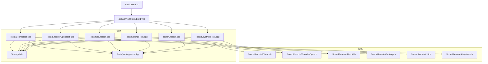
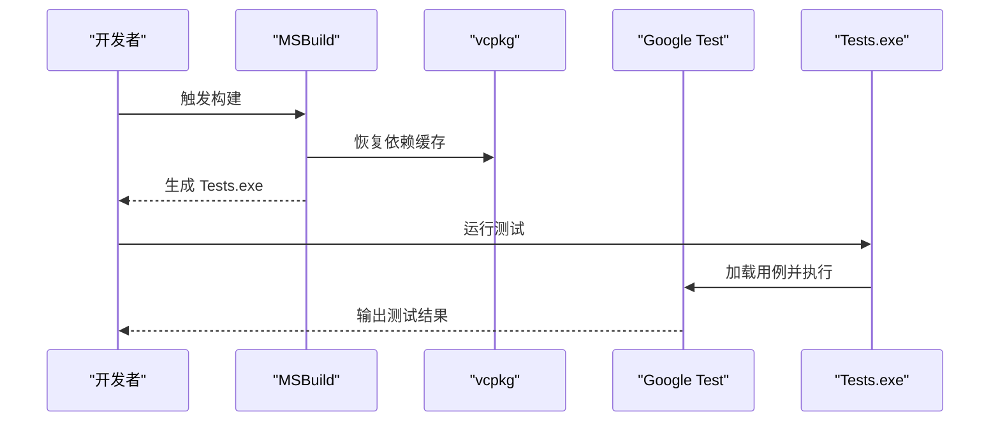
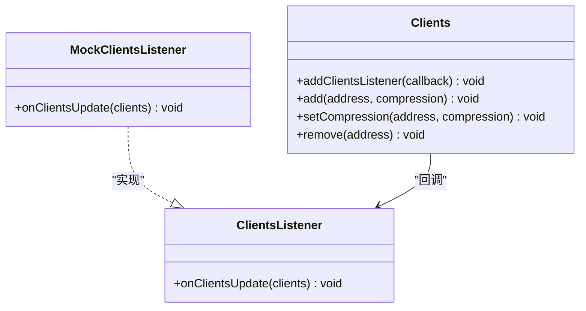
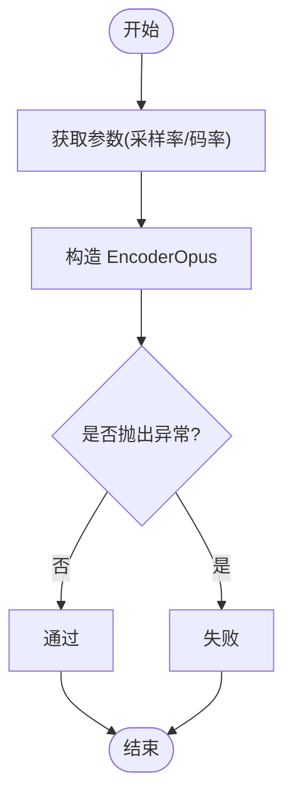
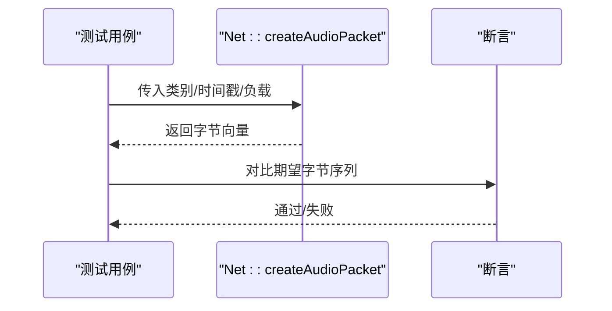
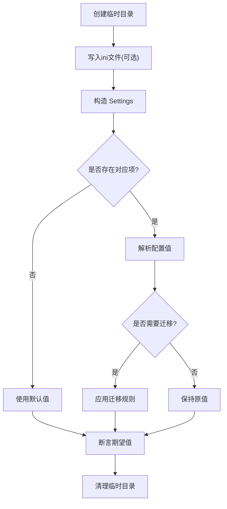
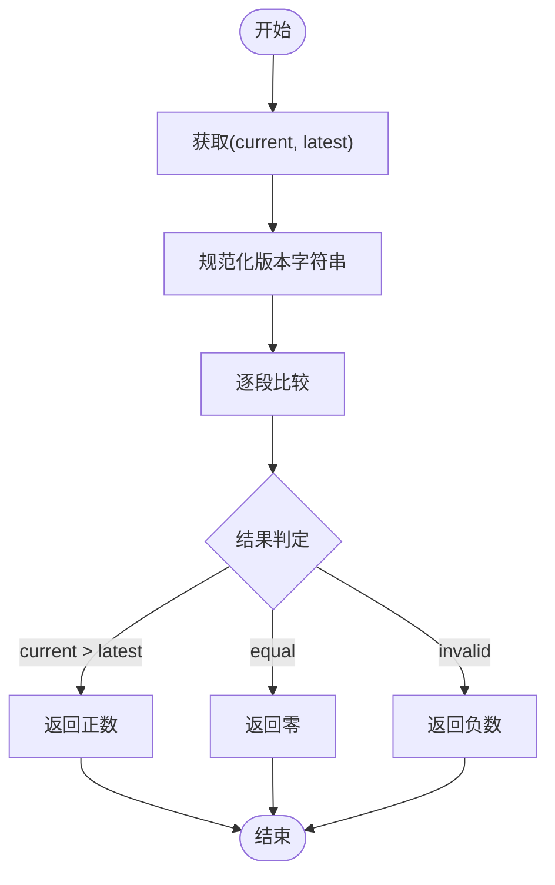
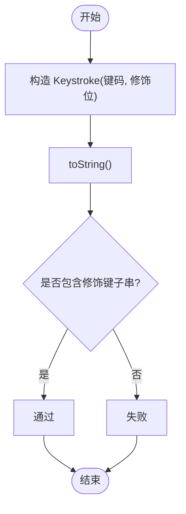
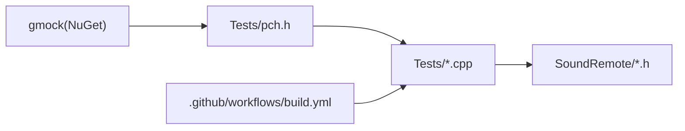

# 测试指南

<cite>
**本文引用的文件**   
- [README.md](file://README.md)
- [build.yml](file://.github/workflows/build.yml)
- [pch.h](file://Tests/pch.h)
- [packages.config](file://Tests/packages.config)
- [ClientsTest.cpp](file://Tests/ClientsTest.cpp)
- [EncoderOpusTest.cpp](file://Tests/EncoderOpusTest.cpp)
- [KeystrokeTest.cpp](file://Tests/KeystrokeTest.cpp)
- [NetUtilTest.cpp](file://Tests/NetUtilTest.cpp)
- [SettingsTest.cpp](file://Tests/SettingsTest.cpp)
- [UtilTest.cpp](file://Tests/UtilTest.cpp)
- [Clients.h](file://SoundRemote/Clients.h)
- [EncoderOpus.h](file://SoundRemote/EncoderOpus.h)
- [Keystroke.h](file://SoundRemote/Keystroke.h)
- [NetUtil.h](file://SoundRemote/NetUtil.h)
- [Settings.h](file://SoundRemote/Settings.h)
- [Util.h](file://SoundRemote/Util.h)
</cite>

## 目录
1. [简介](#简介)
2. [项目结构](#项目结构)
3. [核心组件](#核心组件)
4. [架构总览](#架构总览)
5. [详细组件分析](#详细组件分析)
6. [依赖分析](#依赖分析)
7. [性能考虑](#性能考虑)
8. [故障排查指南](#故障排查指南)
9. [结论](#结论)
10. [附录](#附录)

## 简介
本指南面向 SoundRemote-WinServer 的测试工作，覆盖基于 Google Test/Mock 的单元测试框架使用、测试用例设计、Mock 对象创建、测试策略与覆盖率要求、持续集成配置，以及音频处理、网络通信、输入模拟和配置管理等关键模块的具体实现指导。同时提供测试环境搭建、测试数据准备、测试结果分析方法，并给出性能测试方法、压力测试场景与回归测试策略，帮助团队建立稳定的代码质量保证流程。

## 项目结构
仓库采用“源码 + 测试工程”的分层组织方式：
- 源码位于 SoundRemote 目录，包含音频采集、重采样、编码（Opus）、网络封装、客户端管理、设置持久化、更新检查等模块。
- 测试工程位于 Tests 目录，使用 Google Test/Mock，按功能域拆分测试文件，便于定位与维护。
- 持续集成通过 GitHub Actions 在 Windows 环境构建并运行 Tests.exe。

图表来源
- [build.yml:1-61](file://.github/workflows/build.yml#L1-L61)
- [pch.h:1-9](file://Tests/pch.h#L1-L9)
- [packages.config:1-4](file://Tests/packages.config#L1-L4)
- [ClientsTest.cpp:1-134](file://Tests/ClientsTest.cpp#L1-L134)
- [EncoderOpusTest.cpp:1-54](file://Tests/EncoderOpusTest.cpp#L1-L54)
- [NetUtilTest.cpp:1-133](file://Tests/NetUtilTest.cpp#L1-L133)
- [SettingsTest.cpp:1-127](file://Tests/SettingsTest.cpp#L1-L127)
- [UtilTest.cpp:1-50](file://Tests/UtilTest.cpp#L1-L50)
- [KeystrokeTest.cpp:1-32](file://Tests/KeystrokeTest.cpp#L1-L32)
- [Clients.h](file://SoundRemote/Clients.h)
- [EncoderOpus.h](file://SoundRemote/EncoderOpus.h)
- [NetUtil.h](file://SoundRemote/NetUtil.h)
- [Settings.h](file://SoundRemote/Settings.h)
- [Util.h](file://SoundRemote/Util.h)
- [Keystroke.h](file://SoundRemote/Keystroke.h)

章节来源
- [README.md:1-14](file://README.md#L1-L14)
- [build.yml:1-61](file://.github/workflows/build.yml#L1-L61)
- [pch.h:1-9](file://Tests/pch.h#L1-L9)
- [packages.config:1-4](file://Tests/packages.config#L1-L4)

## 核心组件
本节聚焦测试工程中已实现的各模块测试要点与最佳实践。

- 客户端连接与并发控制（Clients）
  - 使用 Mock 监听器验证初始更新与后续变更回调次数。
  - 多线程并发添加/删除客户端，配合 barrier 同步启动，确保竞态条件可重现。
  - 压缩参数并发修改时，断言监听器收到预期状态序列。
  - 参考路径：[ClientsTest.cpp:1-134](file://Tests/ClientsTest.cpp#L1-L134)、[Clients.h](file://SoundRemote/Clients.h)

- Opus 编码器初始化（EncoderOpus）
  - 使用参数化测试覆盖多种采样率与码率组合，构造编码器实例不抛异常。
  - 参考路径：[EncoderOpusTest.cpp:1-54](file://Tests/EncoderOpusTest.cpp#L1-L54)、[EncoderOpus.h](file://SoundRemote/EncoderOpus.h)

- 网络协议包构造与解析（NetUtil）
  - 校验未压缩与 Opus 音频包的字节序与字段填充。
  - 校验心跳、断开、握手应答等控制包格式。
  - 校验网络值到压缩枚举的映射。
  - 参考路径：[NetUtilTest.cpp:1-133](file://Tests/NetUtilTest.cpp#L1-L133)、[NetUtil.h](file://SoundRemote/NetUtil.h)

- 设置持久化与迁移（Settings）
  - 默认值读取、写入后跨实例读取一致性。
  - 旧版无节 ini 文件的端口迁移兼容。
  - 设备选择与更新检查开关读写。
  - 参考路径：[SettingsTest.cpp:1-127](file://Tests/SettingsTest.cpp#L1-L127)、[Settings.h](file://SoundRemote/Settings.h)

- 版本比较工具（Util）
  - 参数化覆盖正常比较、前缀/后缀变体、非法版本串等边界情况。
  - 参考路径：[UtilTest.cpp:1-50](file://Tests/UtilTest.cpp#L1-L50)、[Util.h](file://SoundRemote/Util.h)

- 键盘事件字符串化（Keystroke）
  - 无修饰键与多修饰键组合下的输出子串断言。
  - 参考路径：[KeystrokeTest.cpp:1-32](file://Tests/KeystrokeTest.cpp#L1-L32)、[Keystroke.h](file://SoundRemote/Keystroke.h)

章节来源
- [ClientsTest.cpp:1-134](file://Tests/ClientsTest.cpp#L1-L134)
- [EncoderOpusTest.cpp:1-54](file://Tests/EncoderOpusTest.cpp#L1-L54)
- [NetUtilTest.cpp:1-133](file://Tests/NetUtilTest.cpp#L1-L133)
- [SettingsTest.cpp:1-127](file://Tests/SettingsTest.cpp#L1-L127)
- [UtilTest.cpp:1-50](file://Tests/UtilTest.cpp#L1-L50)
- [KeystrokeTest.cpp:1-32](file://Tests/KeystrokeTest.cpp#L1-L32)

## 架构总览
测试工程围绕被测模块进行隔离验证，借助 Google Test/Mock 对回调与外部依赖进行替换，保证测试的可重复性与确定性。CI 在 Windows 环境执行 Tests.exe，快速反馈构建与单测结果。

图表来源
- [build.yml:1-61](file://.github/workflows/build.yml#L1-L61)
- [pch.h:1-9](file://Tests/pch.h#L1-L9)

## 详细组件分析

### 客户端管理与并发回调（Clients）
- 测试目标
  - 监听器注册与初始更新通知。
  - 并发添加/删除客户端时的回调次数与顺序。
  - 并发修改压缩参数时的状态广播。
- 关键模式
  - 使用 Mock 监听器断言回调次数与参数。
  - 使用 barrier 同步多线程启动，构造高并发场景。
- 建议扩展
  - 增加超时与重试失败路径的断言。
  - 针对无效地址或非法压缩值的错误分支补充用例。

图表来源
- [ClientsTest.cpp:1-134](file://Tests/ClientsTest.cpp#L1-L134)
- [Clients.h](file://SoundRemote/Clients.h)

章节来源
- [ClientsTest.cpp:1-134](file://Tests/ClientsTest.cpp#L1-L134)

### Opus 编码器初始化（EncoderOpus）
- 测试目标
  - 不同采样率与码率组合下构造成功。
- 关键模式
  - 参数化测试减少重复代码，提高覆盖率。
- 建议扩展
  - 增加编码/解码往返质量与延迟的基准测试。
  - 覆盖非法参数导致的异常路径。

图表来源
- [EncoderOpusTest.cpp:1-54](file://Tests/EncoderOpusTest.cpp#L1-L54)
- [EncoderOpus.h](file://SoundRemote/EncoderOpus.h)

章节来源
- [EncoderOpusTest.cpp:1-54](file://Tests/EncoderOpusTest.cpp#L1-L54)

### 网络协议包构造与解析（NetUtil）
- 测试目标
  - 音频包（未压缩/Opus）头部与负载拼接正确。
  - 心跳、断开、握手应答等控制包格式正确。
  - 网络值到压缩枚举映射一致。
- 关键模式
  - 以期望字节序列为基准进行精确断言。
  - 参数化测试覆盖所有压缩级别。
- 建议扩展
  - 增加长度越界、未知类别、校验失败等异常路径。
  - 引入随机负载与边界长度提升健壮性。

图表来源
- [NetUtilTest.cpp:1-133](file://Tests/NetUtilTest.cpp#L1-L133)
- [NetUtil.h](file://SoundRemote/NetUtil.h)

章节来源
- [NetUtilTest.cpp:1-133](file://Tests/NetUtilTest.cpp#L1-L133)

### 设置持久化与迁移（Settings）
- 测试目标
  - 默认端口、客户端端口、更新检查开关、捕获设备的默认值。
  - 写入后跨实例读取一致性。
  - 旧版无节 ini 文件的端口迁移兼容。
- 关键模式
  - 使用临时目录隔离测试数据，避免污染文件系统。
  - 断言默认值与读写一致性。
- 建议扩展
  - 覆盖损坏/缺失配置文件回退逻辑。
  - 增加权限不足、路径不存在等异常路径。

图表来源
- [SettingsTest.cpp:1-127](file://Tests/SettingsTest.cpp#L1-L127)
- [Settings.h](file://SoundRemote/Settings.h)

章节来源
- [SettingsTest.cpp:1-127](file://Tests/SettingsTest.cpp#L1-L127)

### 版本比较工具（Util）
- 测试目标
  - 正常比较、带前缀/后缀、语义化版本差异、非法版本串。
- 关键模式
  - 参数化用例集中表达多组输入输出关系。
- 建议扩展
  - 增加超长版本号、特殊字符、空串等极端输入。

图表来源
- [UtilTest.cpp:1-50](file://Tests/UtilTest.cpp#L1-L50)
- [Util.h](file://SoundRemote/Util.h)

章节来源
- [UtilTest.cpp:1-50](file://Tests/UtilTest.cpp#L1-L50)

### 键盘事件字符串化（Keystroke）
- 测试目标
  - 无修饰键与多修饰键组合的输出包含预期子串。
- 关键模式
  - 使用 HasSubstr 断言子串存在，增强鲁棒性。
- 建议扩展
  - 覆盖平台相关修饰键映射与未知键码。

图表来源
- [KeystrokeTest.cpp:1-32](file://Tests/KeystrokeTest.cpp#L1-L32)
- [Keystroke.h](file://SoundRemote/Keystroke.h)

章节来源
- [KeystrokeTest.cpp:1-32](file://Tests/KeystrokeTest.cpp#L1-L32)

## 依赖分析
- 测试框架依赖
  - Google Test/Mock 通过 NuGet 包 gmock 引入，统一在 pch.h 中预编译头包含。
- 构建与运行
  - GitHub Actions 在 windows-latest 上执行 MSBuild 构建，随后直接运行 Tests.exe。
- 耦合关系
  - 测试文件仅依赖被测模块的头文件与公共接口，遵循最小依赖原则。

图表来源
- [packages.config:1-4](file://Tests/packages.config#L1-L4)
- [pch.h:1-9](file://Tests/pch.h#L1-L9)
- [build.yml:1-61](file://.github/workflows/build.yml#L1-L61)

章节来源
- [packages.config:1-4](file://Tests/packages.config#L1-L4)
- [pch.h:1-9](file://Tests/pch.h#L1-L9)
- [build.yml:1-61](file://.github/workflows/build.yml#L1-L61)

## 性能考虑
- 基准测试建议
  - 对编码器构造/销毁、网络包构造、设置读写等热点路径增加计时断言，设定阈值告警。
- 压力测试场景
  - 客户端并发增删与压缩切换：参考现有并发用例，扩大线程数与操作次数，观察回调风暴与锁竞争。
  - 大负载音频包连续发送：验证内存分配与拷贝开销。
- 回归策略
  - 将关键性能断言纳入单测，防止回归；对不稳定指标使用统计断言（如均值/方差）。

## 故障排查指南
- 常见环境问题
  - vcpkg 未集成或缓存失效：确认 actions 步骤中的 vcpkg integrate install 与缓存路径。
  - NuGet 包未恢复：检查 restore 步骤与 packages.config。
- 测试失败定位
  - 回调次数不符：检查监听器注册时机与并发屏障位置。
  - 字节序不一致：核对网络端大小端转换与字段偏移。
  - 配置文件路径冲突：确认临时目录隔离与清理逻辑。
- 日志与诊断
  - 在关键路径打印上下文信息（如地址、压缩级别、请求ID），便于复现问题。

章节来源
- [build.yml:1-61](file://.github/workflows/build.yml#L1-L61)
- [packages.config:1-4](file://Tests/packages.config#L1-L4)
- [ClientsTest.cpp:1-134](file://Tests/ClientsTest.cpp#L1-L134)
- [NetUtilTest.cpp:1-133](file://Tests/NetUtilTest.cpp#L1-L133)
- [SettingsTest.cpp:1-127](file://Tests/SettingsTest.cpp#L1-L127)

## 结论
本指南梳理了 SoundRemote-WinServer 的测试体系现状与改进方向。通过 Google Test/Mock 的模块化测试、参数化用例与并发场景覆盖，结合 CI 自动化执行，可有效保障音频处理、网络通信、输入模拟与配置管理等核心功能的稳定性。建议在后续迭代中完善性能基准、异常路径与更细粒度的覆盖率度量，持续提升代码质量与交付效率。

## 附录
- 测试环境搭建
  - 安装 Visual Studio 2022 并与 vcpkg 集成。
  - 使用 NuGet 恢复 gmock 依赖，或通过 vcpkg 安装 gtest/gmock。
  - 在本地执行 Tests.exe 验证单测通过。
- 测试数据准备
  - 使用临时目录存放 ini 配置文件，避免污染用户环境。
  - 构造固定字节序列作为网络包期望值，确保断言稳定。
- 测试结果分析
  - 关注失败用例的断言消息与堆栈，优先修复高频失败点。
  - 对并发用例增加重试与超时策略，降低偶发失败影响。
- 持续集成配置
  - 在 push/PR 到 main 分支时自动构建并运行 Tests.exe。
  - 上传产物以便人工复核。

章节来源
- [README.md:1-14](file://README.md#L1-L14)
- [build.yml:1-61](file://.github/workflows/build.yml#L1-L61)
- [SettingsTest.cpp:1-127](file://Tests/SettingsTest.cpp#L1-L127)
- [NetUtilTest.cpp:1-133](file://Tests/NetUtilTest.cpp#L1-L133)