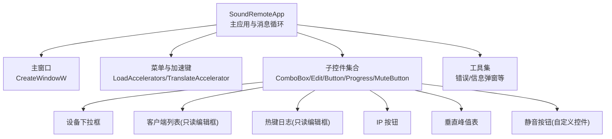
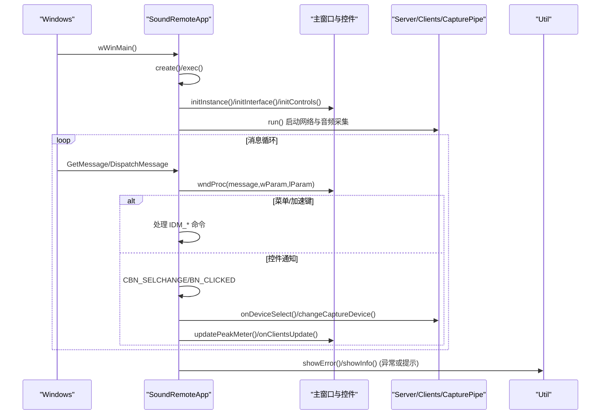
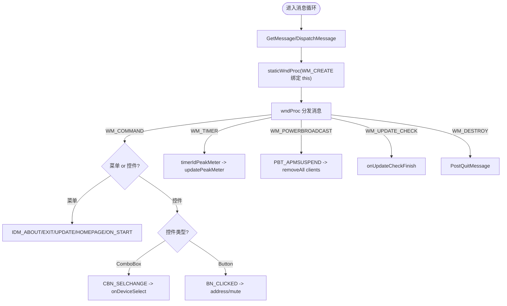
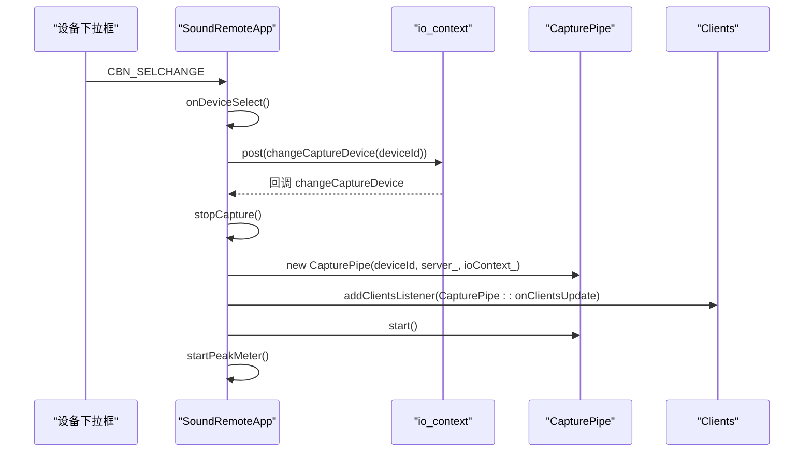
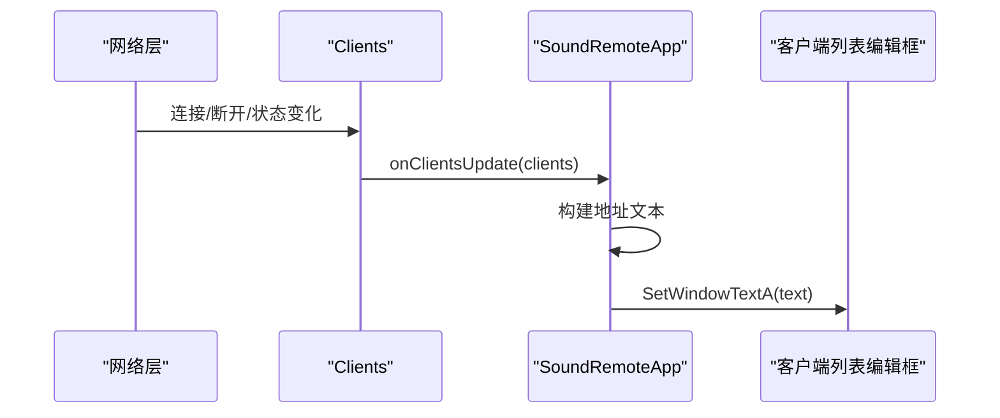
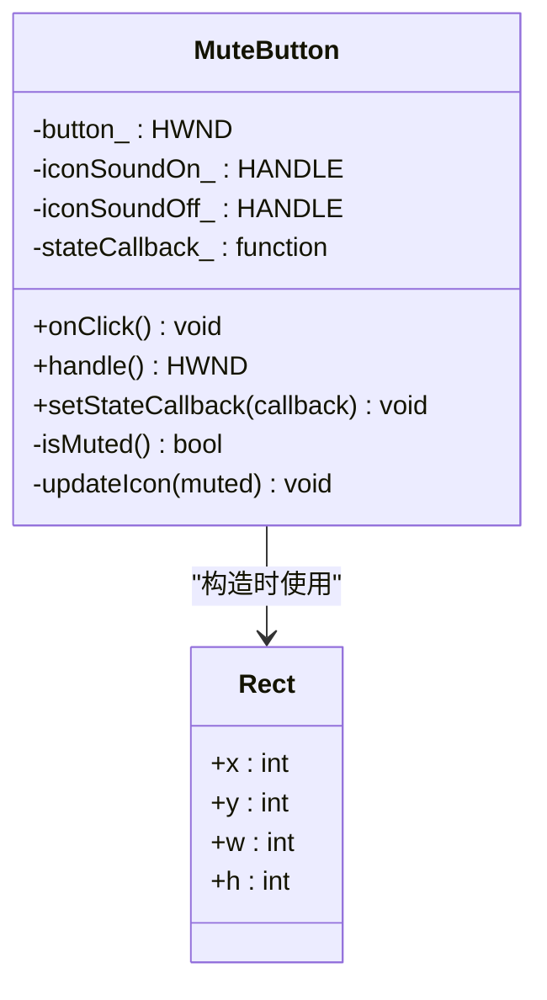
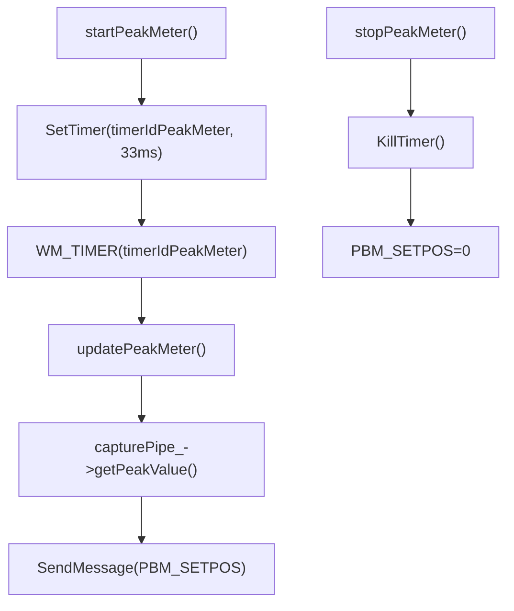
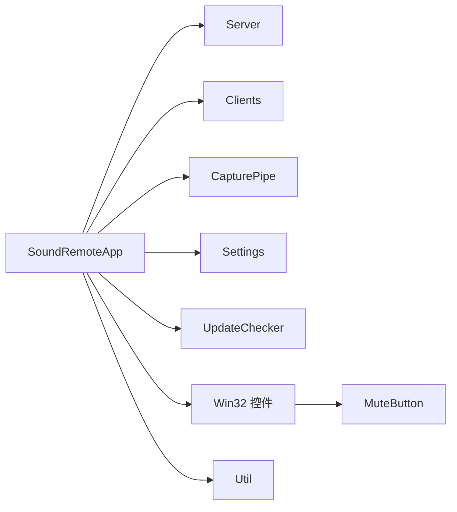

# 用户界面

<cite>
**本文引用的文件**   
- [SoundRemoteApp.cpp](file://SoundRemote/SoundRemoteApp.cpp)
- [SoundRemoteApp.h](file://SoundRemote/SoundRemoteApp.h)
- [Controls.cpp](file://SoundRemote/Controls.cpp)
- [Controls.h](file://SoundRemote/Controls.h)
- [resource.h](file://SoundRemote/resource.h)
- [Util.cpp](file://SoundRemote/Util.cpp)
- [Util.h](file://SoundRemote/Util.h)
</cite>

## 目录
1. [简介](#简介)
2. [项目结构](#项目结构)
3. [核心组件](#核心组件)
4. [架构总览](#架构总览)
5. [详细组件分析](#详细组件分析)
6. [依赖关系分析](#依赖关系分析)
7. [性能考虑](#性能考虑)
8. [故障排查指南](#故障排查指南)
9. [结论](#结论)
10. [附录](#附录)

## 简介
本章节面向 SoundRemote-WinServer 的用户界面，聚焦基于 Win32 API 的 GUI 架构、窗口消息处理机制与用户交互流程。文档覆盖控制面板实现、设备选择界面、客户端列表显示、静音控制功能，并给出界面布局、控件行为与用户体验设计原则；同时提供主题定制、国际化支持与可访问性建议，以及界面扩展指南、自定义控件开发建议与性能优化最佳实践。

## 项目结构
本项目采用“单进程 + 主窗口 + 子控件”的经典 Win32 应用模式：
- 主窗口负责注册窗口类、创建窗口、加载资源、初始化菜单与设置、启动网络与音频采集线程、分发消息循环。
- 子控件包括设备下拉框、客户端列表编辑框、热键日志编辑框、IP 按钮、垂直峰值表进度条、静音按钮（自定义控件）。
- 资源与字符串通过资源 ID 管理，支持多语言替换。

图表来源
- [SoundRemoteApp.cpp:536-567](file://SoundRemote/SoundRemoteApp.cpp#L536-L567)
- [SoundRemoteApp.cpp:410-486](file://SoundRemote/SoundRemoteApp.cpp#L410-L486)
- [Controls.cpp:7-14](file://SoundRemote/Controls.cpp#L7-L14)
- [Util.cpp:15-21](file://SoundRemote/Util.cpp#L15-L21)

章节来源
- [SoundRemoteApp.cpp:36-79](file://SoundRemote/SoundRemoteApp.cpp#L36-L79)
- [SoundRemoteApp.cpp:536-567](file://SoundRemote/SoundRemoteApp.cpp#L536-L567)
- [SoundRemoteApp.cpp:410-486](file://SoundRemote/SoundRemoteApp.cpp#L410-L486)

## 核心组件
- 主应用与消息循环
  - 入口 wWinMain 创建应用实例并进入 exec，执行 initInstance、run 后进入消息循环，使用 IsDialogMessage 与 TranslateAccelerator 处理对话框与快捷键。
  - 静态窗口过程 staticWndProc 将 WM_CREATE 中的 lpCreateParams 绑定到对象指针，后续消息转发至实例方法 wndProc。
- 界面初始化与布局
  - initInterface 根据父窗口尺寸计算各控件位置与大小，创建设备下拉框、标签、只读编辑框、按钮、进度条等。
  - initControls 重置并填充设备下拉框，恢复上次选择的捕获设备。
- 资源与国际化
  - initStrings 通过 LoadStringW 加载标题、标签、提示文本等资源字符串，便于本地化。
- 工具与错误提示
  - Util::showError/showInfo 统一弹出错误与信息对话框，利用全局保存的主窗口句柄确保父窗口正确。

章节来源
- [SoundRemoteApp.cpp:36-79](file://SoundRemote/SoundRemoteApp.cpp#L36-L79)
- [SoundRemoteApp.cpp:586-601](file://SoundRemote/SoundRemoteApp.cpp#L586-L601)
- [SoundRemoteApp.cpp:410-486](file://SoundRemote/SoundRemoteApp.cpp#L410-L486)
- [SoundRemoteApp.cpp:522-534](file://SoundRemote/SoundRemoteApp.cpp#L522-L534)
- [Util.cpp:15-21](file://SoundRemote/Util.cpp#L15-L21)

## 架构总览
下图展示主窗口、控件与后台服务之间的交互关系，以及关键消息流。

图表来源
- [SoundRemoteApp.cpp:36-79](file://SoundRemote/SoundRemoteApp.cpp#L36-L79)
- [SoundRemoteApp.cpp:586-719](file://SoundRemote/SoundRemoteApp.cpp#L586-L719)
- [SoundRemoteApp.cpp:410-486](file://SoundRemote/SoundRemoteApp.cpp#L410-L486)
- [Util.cpp:15-21](file://SoundRemote/Util.cpp#L15-L21)

## 详细组件分析

### 主窗口与消息处理
- 窗口类注册与创建
  - 使用 WNDCLASSEXW 注册类，设置图标、背景色、菜单与窗口过程。
  - CreateWindowW 创建主窗口，随后调用 initInterface/initControls 完成子控件创建与数据填充。
- 消息分发
  - staticWndProc 在 WM_CREATE 时保存 this 指针，并将后续消息转发给实例方法 wndProc。
  - wndProc 处理 WM_COMMAND（菜单/控件）、WM_TIMER（峰值表刷新）、WM_POWERBROADCAST（系统挂起清理）、WM_UPDATE_CHECK（更新检查回调）等。
- 对话框与关于
  - 通过 DialogBox 打开关于对话框，由 about 回调处理关闭。

图表来源
- [SoundRemoteApp.cpp:536-567](file://SoundRemote/SoundRemoteApp.cpp#L536-L567)
- [SoundRemoteApp.cpp:586-719](file://SoundRemote/SoundRemoteApp.cpp#L586-L719)

章节来源
- [SoundRemoteApp.cpp:536-567](file://SoundRemote/SoundRemoteApp.cpp#L536-L567)
- [SoundRemoteApp.cpp:586-719](file://SoundRemote/SoundRemoteApp.cpp#L586-L719)

### 设备选择界面
- 设备枚举与默认项
  - addDevices 为指定 EDataFlow 添加设备项，并在 eRender/eCapture 时插入“默认播放/默认录制”特殊项。
  - deviceIds_ 映射 ComboBox 项数据（int key）到设备 ID（wstring），getDeviceId/getDeviceKey 用于双向查找。
- 选择与切换
  - onDeviceSelect 读取当前选中项，转换为 deviceId，post 到 ioContext 异步切换 capturePipe，并记住设置。
  - changeCaptureDevice 停止旧采集、重建 CapturePipe 并启动，同时订阅客户端更新以刷新 UI。
- 恢复与持久化
  - restoreCaptureDevice 从设置中读取上次设备并选中对应项。
  - rememberCaptureDevice 将选择结果写入设置，支持“默认播放/默认录制”的特殊标识。

图表来源
- [SoundRemoteApp.cpp:133-187](file://SoundRemote/SoundRemoteApp.cpp#L133-L187)
- [SoundRemoteApp.cpp:255-279](file://SoundRemote/SoundRemoteApp.cpp#L255-L279)
- [SoundRemoteApp.cpp:281-293](file://SoundRemote/SoundRemoteApp.cpp#L281-L293)
- [SoundRemoteApp.cpp:488-495](file://SoundRemote/SoundRemoteApp.cpp#L488-L495)

章节来源
- [SoundRemoteApp.cpp:133-187](file://SoundRemote/SoundRemoteApp.cpp#L133-L187)
- [SoundRemoteApp.cpp:255-279](file://SoundRemote/SoundRemoteApp.cpp#L255-L279)
- [SoundRemoteApp.cpp:281-293](file://SoundRemote/SoundRemoteApp.cpp#L281-L293)
- [SoundRemoteApp.cpp:488-495](file://SoundRemote/SoundRemoteApp.cpp#L488-L495)

### 客户端列表显示
- 数据来源
  - onClientsUpdate 接收来自 Clients 的更新事件，遍历 ClientInfo 地址，拼接为文本。
- 界面更新
  - SetWindowTextA 直接写入只读编辑框，保留换行分隔。
- 键盘输入日志
  - onReceiveKeystroke 追加时间戳与按键描述到热键日志编辑框。

图表来源
- [SoundRemoteApp.cpp:303-309](file://SoundRemote/SoundRemoteApp.cpp#L303-L309)
- [SoundRemoteApp.cpp:330-340](file://SoundRemote/SoundRemoteApp.cpp#L330-L340)

章节来源
- [SoundRemoteApp.cpp:303-309](file://SoundRemote/SoundRemoteApp.cpp#L303-L309)
- [SoundRemoteApp.cpp:330-340](file://SoundRemote/SoundRemoteApp.cpp#L330-L340)

### 静音控制功能
- 自定义控件
  - MuteButton 封装 BS_ICON | BS_AUTOCHECKBOX | BS_PUSHLIKE 按钮，维护开/关图标，暴露 onClick/isMuted/handle/setStateCallback。
- 集成与回调
  - 主界面创建 MuteButton，设置 stateCallback 为 capturePipe_->setMuted(v)，从而联动音频管道静音状态。
  - 按钮点击由 BN_CLICKED 路由到 muteButton_->onClick()，内部更新图标并触发回调。

图表来源
- [Controls.h:10-24](file://SoundRemote/Controls.h#L10-L24)
- [Controls.h:26-34](file://SoundRemote/Controls.h#L26-L34)
- [Controls.cpp:7-44](file://SoundRemote/Controls.cpp#L7-L44)

章节来源
- [Controls.h:10-24](file://SoundRemote/Controls.h#L10-L24)
- [Controls.cpp:7-44](file://SoundRemote/Controls.cpp#L7-L44)
- [SoundRemoteApp.cpp:474-478](file://SoundRemote/SoundRemoteApp.cpp#L474-L478)
- [SoundRemoteApp.cpp:647-656](file://SoundRemote/SoundRemoteApp.cpp#L647-L656)

### 峰值表与定时器
- 定时器驱动
  - startPeakMeter/stopPeakMeter 使用 SetTimer/KillTimer 控制周期刷新。
  - WM_TIMER 中 timerIdPeakMeter 触发 updatePeakMeter，读取 CapturePipe 峰值并设置进度条位置。
- 进度条
  - 垂直进度条使用 PROGRESS_CLASS 与 PBS_VERTICAL | PBS_SMOOTH 样式。

图表来源
- [SoundRemoteApp.cpp:497-504](file://SoundRemote/SoundRemoteApp.cpp#L497-L504)
- [SoundRemoteApp.cpp:320-328](file://SoundRemote/SoundRemoteApp.cpp#L320-L328)
- [SoundRemoteApp.cpp:479-486](file://SoundRemote/SoundRemoteApp.cpp#L479-L486)

章节来源
- [SoundRemoteApp.cpp:497-504](file://SoundRemote/SoundRemoteApp.cpp#L497-L504)
- [SoundRemoteApp.cpp:320-328](file://SoundRemote/SoundRemoteApp.cpp#L320-L328)
- [SoundRemoteApp.cpp:479-486](file://SoundRemote/SoundRemoteApp.cpp#L479-L486)

### 地址查看与更新检查
- 地址查看
  - onAddressButtonClick 获取本机地址列表并以信息框展示。
- 更新检查
  - checkUpdates 委托 UpdateChecker 执行，完成后通过 WM_UPDATE_CHECK 回调 onUpdateCheckFinish，根据结果弹出提示或引导下载页面。

章节来源
- [SoundRemoteApp.cpp:311-318](file://SoundRemote/SoundRemoteApp.cpp#L311-L318)
- [SoundRemoteApp.cpp:342-375](file://SoundRemote/SoundRemoteApp.cpp#L342-L375)

### 界面布局与用户体验设计原则
- 布局策略
  - 左侧区域放置设备选择、客户端列表、热键日志；右侧窄列放置 IP 按钮、垂直峰值表与静音按钮，形成紧凑的控制面板。
  - 使用 getCharHeight 动态计算标签高度，保证在不同 DPI/字体下对齐一致。
- 交互反馈
  - 设备切换即时重启采集并刷新峰值表；静音按钮图标随状态切换；地址查看与更新检查均提供明确提示。
- 可访问性
  - 控件启用 WS_TABSTOP，配合 IsDialogMessage 支持 Tab 导航；Tooltip 为按钮提供辅助说明。

章节来源
- [SoundRemoteApp.cpp:410-486](file://SoundRemote/SoundRemoteApp.cpp#L410-L486)
- [SoundRemoteApp.cpp:230-247](file://SoundRemote/SoundRemoteApp.cpp#L230-L247)
- [SoundRemoteApp.cpp:70-76](file://SoundRemote/SoundRemoteApp.cpp#L70-L76)

## 依赖关系分析
- 模块耦合
  - SoundRemoteApp 聚合 Server、Clients、CapturePipe、Settings、UpdateChecker，并通过 boost::asio::io_context 与线程进行异步事件处理。
  - 控件与业务解耦：MuteButton 仅暴露回调接口，具体静音逻辑由上层注入。
- 外部依赖
  - Windows 通用控件库（CommCtrl）、Shell API（ShellExecute）、多媒体设备 API（mmdeviceapi.h）。
- 潜在循环依赖
  - 通过监听器模式（addClientsListener）避免强耦合；注意移除监听器顺序以避免悬挂引用。

图表来源
- [SoundRemoteApp.h:57-63](file://SoundRemote/SoundRemoteApp.h#L57-L63)
- [Controls.h:10-24](file://SoundRemote/Controls.h#L10-L24)
- [Util.h:10-62](file://SoundRemote/Util.h#L10-L62)

章节来源
- [SoundRemoteApp.h:57-63](file://SoundRemote/SoundRemoteApp.h#L57-L63)
- [Controls.h:10-24](file://SoundRemote/Controls.h#L10-L24)
- [Util.h:10-62](file://SoundRemote/Util.h#L10-L62)

## 性能考虑
- 消息循环与 UI 响应
  - 使用 IsDialogMessage 与 TranslateAccelerator 减少不必要的消息转换开销。
  - 峰值表定时器周期 33ms，兼顾刷新频率与 CPU 占用。
- 文本更新
  - 客户端列表与热键日志采用一次性 SetWindowTextA/ReplaceSel，避免频繁重绘。
- 资源加载
  - 图标与字符串仅在初始化阶段加载，运行时复用句柄。
- 异步处理
  - 设备切换与网络事件通过 io_context 派发，避免阻塞 UI 线程。

[本节为通用指导，不直接分析具体文件]

## 故障排查指南
- 常见错误提示
  - Util::showError/showInfo 统一弹出错误与信息框，便于快速定位问题。
- 致命错误
  - makeFatalErrorText 生成包含 ErrorCode 的致命错误文本，用于不可恢复场景。
- 电源事件
  - 系统挂起时清空客户端列表，防止残留状态影响恢复。
- 更新检查失败
  - 更新检查错误路径会显示提示信息，必要时引导用户手动检查。

章节来源
- [Util.cpp:15-31](file://SoundRemote/Util.cpp#L15-L31)
- [Util.h:6-57](file://SoundRemote/Util.h#L6-L57)
- [SoundRemoteApp.cpp:707-713](file://SoundRemote/SoundRemoteApp.cpp#L707-L713)
- [SoundRemoteApp.cpp:342-375](file://SoundRemote/SoundRemoteApp.cpp#L342-L375)

## 结论
该用户界面采用经典 Win32 架构，围绕主窗口与子控件组织，结合异步事件循环与轻量级自定义控件，实现了设备选择、客户端监控、静音控制与峰值指示等核心功能。通过资源字符串与 Tooltip 提升可本地化性与可用性。建议在后续迭代中引入更灵活的布局管理器、主题系统与无障碍增强，以提升可扩展性与用户体验。

[本节为总结性内容，不直接分析具体文件]

## 附录

### 主题定制建议
- 背景与控件颜色
  - 可在 WNDCLASSEXW 中调整 hbrBackground，或在 WM_PAINT 中绘制自定义背景。
- 图标与视觉风格
  - 通过资源替换 IDI_SOUND_ON/OFF 与程序图标，实现不同主题外观。
- 字体与 DPI
  - 使用 getCharHeight 动态度量字体，适配高 DPI 环境。

章节来源
- [SoundRemoteApp.cpp:536-567](file://SoundRemote/SoundRemoteApp.cpp#L536-L567)
- [SoundRemoteApp.cpp:222-228](file://SoundRemote/SoundRemoteApp.cpp#L222-L228)
- [Controls.cpp:11-13](file://SoundRemote/Controls.cpp#L11-L13)

### 国际化支持
- 资源字符串
  - 所有可见文本通过 LoadStringW 加载，资源 ID 集中在 resource.h，便于多语言资源包替换。
- 建议
  - 新增文案一律走资源 ID，避免硬编码字符串；对日期/时间格式使用本地化函数。

章节来源
- [SoundRemoteApp.cpp:522-534](file://SoundRemote/SoundRemoteApp.cpp#L522-L534)
- [resource.h:7-29](file://SoundRemote/resource.h#L7-L29)

### 可访问性考虑
- 键盘导航
  - 控件启用 WS_TABSTOP，IsDialogMessage 自动处理对话框式导航。
- 工具提示
  - setTooltip 为按钮提供 Tooltip，改善无鼠标操作体验。
- 建议
  - 为关键控件增加 accessible name/role（如使用 UI Automation 扩展）。

章节来源
- [SoundRemoteApp.cpp:70-76](file://SoundRemote/SoundRemoteApp.cpp#L70-L76)
- [SoundRemoteApp.cpp:230-247](file://SoundRemote/SoundRemoteApp.cpp#L230-L247)

### 界面扩展指南
- 新增控件
  - 在 initInterface 中按布局规则创建控件，保持右侧窄列与左侧宽区的比例；为控件设置 Tooltip 与 TabStop。
- 事件处理
  - 在 wndProc 的 WM_COMMAND 分支中添加控件通知处理，遵循现有命名约定（如 onXxx）。
- 自定义控件
  - 参考 MuteButton 模式：封装底层控件、暴露简洁接口、通过回调与上层解耦。

章节来源
- [SoundRemoteApp.cpp:410-486](file://SoundRemote/SoundRemoteApp.cpp#L410-L486)
- [SoundRemoteApp.cpp:603-664](file://SoundRemote/SoundRemoteApp.cpp#L603-L664)
- [Controls.h:10-24](file://SoundRemote/Controls.h#L10-L24)
- [Controls.cpp:7-44](file://SoundRemote/Controls.cpp#L7-L44)

### 自定义控件开发建议
- 职责单一
  - 每个控件聚焦一个交互语义（如静音开关），通过回调与业务层通信。
- 资源管理
  - 图标/位图在构造时加载，析构时释放；避免重复加载造成内存抖动。
- 状态同步
  - 对外暴露 isMuted 等查询接口，方便上层校验与调试。

章节来源
- [Controls.h:10-24](file://SoundRemote/Controls.h#L10-L24)
- [Controls.cpp:7-44](file://SoundRemote/Controls.cpp#L7-L44)

### 响应式设计最佳实践
- 动态度量
  - 使用 getCharHeight 与窗口尺寸计算控件位置，适应不同分辨率与字体。
- 最小化重绘
  - 批量更新文本后再刷新，避免频繁 BeginPaint/EndPaint。
- 异步优先
  - 耗时操作（网络、音频）放入 io_context 线程，UI 仅做轻量更新。

章节来源
- [SoundRemoteApp.cpp:222-228](file://SoundRemote/SoundRemoteApp.cpp#L222-L228)
- [SoundRemoteApp.cpp:303-309](file://SoundRemote/SoundRemoteApp.cpp#L303-L309)
- [SoundRemoteApp.cpp:388-408](file://SoundRemote/SoundRemoteApp.cpp#L388-L408)