# 用户界面

<cite>
**本文引用的文件**   
- [SoundRemoteApp.cpp](file://SoundRemote/SoundRemoteApp.cpp)
- [SoundRemoteApp.h](file://SoundRemote/SoundRemoteApp.h)
- [Controls.cpp](file://SoundRemote/Controls.cpp)
- [Controls.h](file://SoundRemote/Controls.h)
- [resource.h](file://SoundRemote/resource.h)
- [Util.cpp](file://SoundRemote/Util.cpp)
- [Settings.cpp](file://SoundRemote/Settings.cpp)
</cite>

## 更新摘要
**所做更改**   
- 增强了光标反馈系统，现在为更多交互元素提供手形光标显示，包括标签页控件、设备选择组合框、地址按钮和静音按钮
- 通过改进的 WM_SETCURSOR 消息处理机制实现增强的光标反馈
- 更新了相关章节以反映新的光标行为和改进的用户体验

## 目录
1. [简介](#简介)
2. [项目结构](#项目结构)
3. [核心组件](#核心组件)
4. [架构总览](#架构总览)
5. [详细组件分析](#详细组件分析)
6. [依赖关系分析](#依赖关系分析)
7. [性能考虑](#性能考虑)
8. [故障排查指南](#故障排查指南)
9. [结论](#结论)
10. [附录](#附录)

## 简介
本章节面向 SoundRemote-WinServer 的用户界面，聚焦基于 Win32 API 的 GUI 架构、窗口消息处理机制与用户交互流程。文档覆盖标签页界面实现、设备选择界面、客户端列表显示、静音控制功能，并给出界面布局、控件行为与用户体验设计原则；同时提供主题定制、国际化支持与可访问性建议，以及界面扩展指南、自定义控件开发建议与性能优化最佳实践。

**更新** 应用现已采用标签页界面架构，通过WC_TABCONTROL将功能区域组织为"客户端"和"快捷键"两个标签页，显著改善了信息组织和用户体验。主窗口尺寸优化至600x450提供了更宽敞的操作空间，增强的光标反馈系统和优化的初始化流程提升了整体交互质量。

## 项目结构
本项目采用"单进程 + 主窗口 + 子控件"的经典 Win32 应用模式，现已升级为标签页界面架构：
- 主窗口负责注册窗口类、创建窗口、加载资源、初始化菜单与设置、启动网络与音频采集线程、分发消息循环。
- 标签页控件(WC_TABCONTROL)作为主要容器，管理"客户端"和"快捷键"两个标签页的内容。
- 子控件包括设备下拉框、标签页内的客户端列表编辑框、热键日志编辑框、IP 按钮、垂直峰值表进度条、静音按钮（自定义控件）。
- 资源与字符串通过资源 ID 管理，支持多语言替换。
- **更新** 主窗口尺寸调整为600x450，标签页界面提供更清晰的功能分区和更好的视觉效果，增强的光标反馈系统为所有交互元素提供一致的手形光标提示。

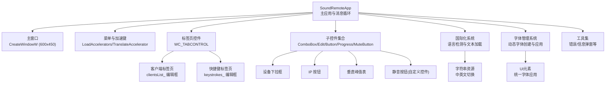

**图表来源**
- [SoundRemoteApp.cpp:26-27](file://SoundRemote/SoundRemoteApp.cpp#L26-L27)
- [SoundRemoteApp.cpp:635-636](file://SoundRemote/SoundRemoteApp.cpp#L635-L636)
- [SoundRemoteApp.cpp:445-446](file://SoundRemote/SoundRemoteApp.cpp#L445-L446)
- [SoundRemoteApp.cpp:467-473](file://SoundRemote/SoundRemoteApp.cpp#L467-L473)
- [SoundRemoteApp.cpp:72-79](file://SoundRemote/SoundRemoteApp.cpp#L72-L79)
- [SoundRemoteApp.cpp:417-492](file://SoundRemote/SoundRemoteApp.cpp#L417-L492)
- [SoundRemoteApp.cpp:494-501](file://SoundRemote/SoundRemoteApp.cpp#L494-L501)
- [Controls.cpp:7-14](file://SoundRemote/Controls.cpp#L7-L14)
- [Util.cpp:15-21](file://SoundRemote/Util.cpp#L15-L21)

**章节来源**
- [SoundRemoteApp.cpp:36-79](file://SoundRemote/SoundRemoteApp.cpp#L36-L79)
- [SoundRemoteApp.cpp:635-636](file://SoundRemote/SoundRemoteApp.cpp#L635-L636)
- [SoundRemoteApp.cpp:417-492](file://SoundRemote/SoundRemoteApp.cpp#L417-L492)

## 核心组件
- 主应用与消息循环
  - 入口 wWinMain 创建应用实例并进入 exec，执行 initInstance、run 后进入消息循环，使用 IsDialogMessage 与 TranslateAccelerator 处理对话框与快捷键。
  - 静态窗口过程 staticWndProc 将 WM_CREATE 中的 lpCreateParams 绑定到对象指针，后续消息转发至实例方法 wndProc。
- 标签页界面架构
  - initInterface 方法现在创建 WC_TABCONTROL 标签页控件，包含"客户端"和"快捷键"两个标签页。
  - 每个标签页内嵌独立的编辑框控件，用于显示不同的内容类型。
  - 标签页切换通过 WM_NOTIFY 消息处理 TCN_SELCHANGE 通知实现。
- 界面初始化与布局
  - 根据父窗口尺寸计算各控件位置与大小，创建设备下拉框、标签页控件、标签页内容编辑框、按钮、进度条等。
  - initControls 重置并填充设备下拉框，恢复上次选择的捕获设备。
- 资源与国际化系统
  - initStrings 通过 LoadStringW 加载标题、标签、提示文本等资源字符串，支持中文本地化。
  - 根据 settings_->getLanguage() 动态选择语言资源，中文时直接使用硬编码字符串，其他语言使用资源ID加载。
- 字体管理系统
  - initFont 从设置中读取字体名称、大小、粗体属性，动态创建字体并应用到所有子控件。
  - 支持 DPI 感知的字体大小计算，确保在不同分辨率下显示一致。
- 工具与错误提示
  - Util::showError/showInfo 统一弹出错误与信息对话框，利用全局保存的主窗口句柄确保父窗口正确。

**更新** 应用现已采用标签页界面架构，主窗口尺寸优化为600x450，提供更宽敞的操作空间；字符高度计算精度提升，确保不同字体下的布局一致性；初始化顺序优化确保字体在界面创建前正确加载；增强的光标反馈系统为所有交互元素提供一致的手形光标提示，显著提升用户体验。

**章节来源**
- [SoundRemoteApp.cpp:36-79](file://SoundRemote/SoundRemoteApp.cpp#L36-L79)
- [SoundRemoteApp.cpp:613-654](file://SoundRemote/SoundRemoteApp.cpp#L613-L654)
- [SoundRemoteApp.cpp:417-492](file://SoundRemote/SoundRemoteApp.cpp#L417-L492)
- [SoundRemoteApp.cpp:557-583](file://SoundRemote/SoundRemoteApp.cpp#L557-L583)
- [SoundRemoteApp.cpp:585-611](file://SoundRemote/SoundRemoteApp.cpp#L585-L611)
- [Util.cpp:15-21](file://SoundRemote/Util.cpp#L15-L21)

## 架构总览
下图展示主窗口、标签页控件与后台服务之间的交互关系，以及关键消息流。

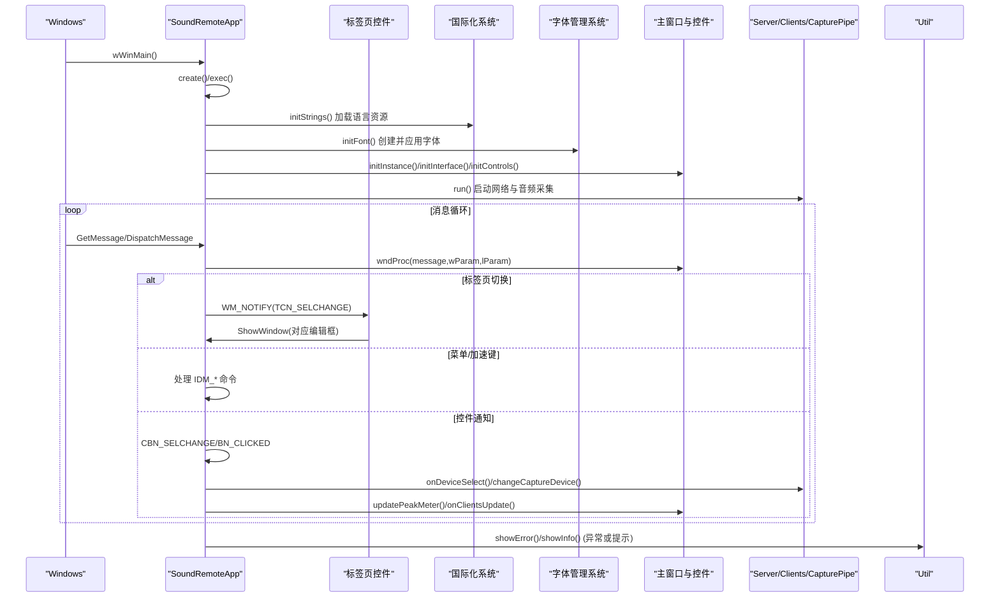

**图表来源**
- [SoundRemoteApp.cpp:36-79](file://SoundRemote/SoundRemoteApp.cpp#L36-L79)
- [SoundRemoteApp.cpp:613-654](file://SoundRemote/SoundRemoteApp.cpp#L613-L654)
- [SoundRemoteApp.cpp:417-492](file://SoundRemote/SoundRemoteApp.cpp#L417-L492)
- [SoundRemoteApp.cpp:763-772](file://SoundRemote/SoundRemoteApp.cpp#L763-L772)
- [Util.cpp:15-21](file://SoundRemote/Util.cpp#L15-L21)

## 详细组件分析

### 主窗口与消息处理
- 窗口类注册与创建
  - 使用 WNDCLASSEXW 注册类，设置图标、背景色、菜单与窗口过程。
  - CreateWindowW 创建主窗口，尺寸为600x450，随后调用 initInterface/initControls 完成子控件创建与数据填充。
- 消息分发
  - staticWndProc 在 WM_CREATE 时保存 this 指针，并将后续消息转发给实例方法 wndProc。
  - wndProc 处理 WM_COMMAND（菜单/控件）、WM_TIMER（峰值表刷新）、WM_POWERBROADCAST（系统挂起清理）、WM_UPDATE_CHECK（更新检查回调）等。
- 标签页消息处理
  - 新增 WM_NOTIFY 消息处理，专门处理标签页控件的 TCN_SELCHANGE 通知。
  - 根据选中标签页索引显示对应的编辑框内容。
- **更新** 增强的光标反馈系统
  - 改进的 WM_SETCURSOR 消息处理现在为更多交互元素提供手形光标反馈。
  - 支持的元素包括：标签页控件、设备下拉框、地址按钮和静音按钮。
  - 当鼠标悬停在这些可交互元素上时，自动显示 IDC_HAND 手形光标，提供更好的视觉提示。
- 对话框与关于
  - 通过 DialogBox 打开关于对话框，由 about 回调处理关闭。

**更新** 主窗口尺寸从300x300调整为600x450，标签页界面架构完全替代了之前的扁平布局，增强的光标反馈系统为所有交互元素提供一致的手形光标提示，显著提升用户交互体验。

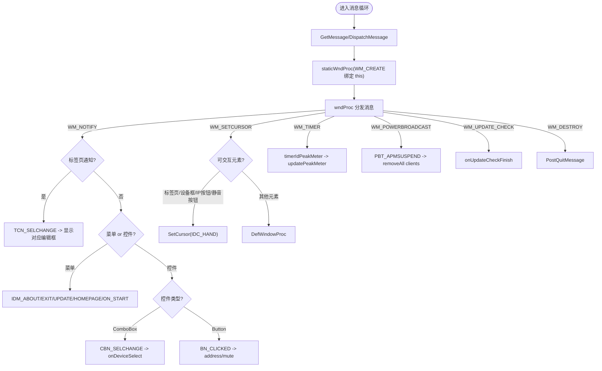

**图表来源**
- [SoundRemoteApp.cpp:674-688](file://SoundRemote/SoundRemoteApp.cpp#L674-L688)
- [SoundRemoteApp.cpp:690-827](file://SoundRemote/SoundRemoteApp.cpp#L690-L827)
- [SoundRemoteApp.cpp:753-761](file://SoundRemote/SoundRemoteApp.cpp#L753-L761)
- [SoundRemoteApp.cpp:763-772](file://SoundRemote/SoundRemoteApp.cpp#L763-L772)

**章节来源**
- [SoundRemoteApp.cpp:674-688](file://SoundRemote/SoundRemoteApp.cpp#L674-L688)
- [SoundRemoteApp.cpp:690-827](file://SoundRemote/SoundRemoteApp.cpp#L690-L827)
- [SoundRemoteApp.cpp:753-761](file://SoundRemote/SoundRemoteApp.cpp#L753-L761)
- [SoundRemoteApp.cpp:763-772](file://SoundRemote/SoundRemoteApp.cpp#L763-L772)

### 标签页界面架构实现
**更新** 全新的标签页界面架构取代了之前的扁平布局，提供了更好的信息组织和用户体验。

- 标签页控件创建
  - 使用 WC_TABCONTROL 创建标签页控件，配置 WS_CHILD | WS_VISIBLE | WS_CLIPSIBLINGS 样式。
  - 通过 TabCtrl_InsertItem 添加"客户端"和"快捷键"两个标签页。
  - 使用 TabCtrl_SetMinTabWidth 和 TabCtrl_SetPadding 优化标签页外观。
- 标签页内容管理
  - 每个标签页内嵌独立的编辑框控件，分别用于显示客户端列表和快捷键日志。
  - 通过 TabCtrl_AdjustRect 获取标签页内部显示区域，确保内容正确定位。
- 标签页切换逻辑
  - 在 WM_NOTIFY 消息处理中监听 TCN_SELCHANGE 通知。
  - 根据选中标签页索引使用 ShowWindow 显示/隐藏对应的编辑框。
- 布局适配
  - 标签页控件位于设备下拉框下方，右侧保留窄列放置IP按钮、峰值表和静音按钮。
  - 使用增强的 getCharHeight 动态计算标签宽度，确保中文等宽字符的正确显示。

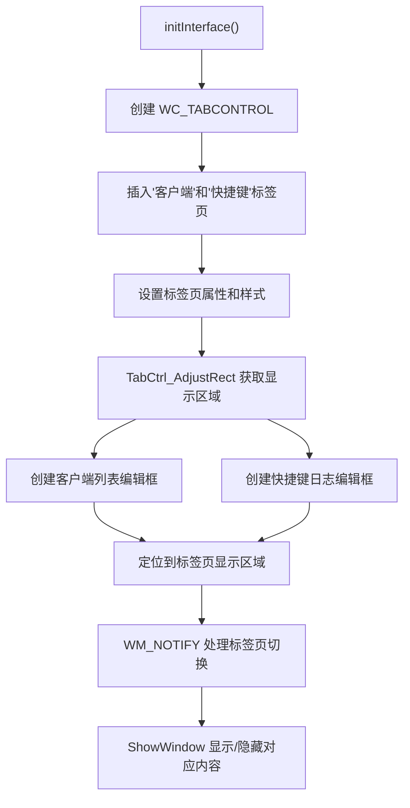

**图表来源**
- [SoundRemoteApp.cpp:440-473](file://SoundRemote/SoundRemoteApp.cpp#L440-L473)
- [SoundRemoteApp.cpp:763-772](file://SoundRemote/SoundRemoteApp.cpp#L763-L772)

**章节来源**
- [SoundRemoteApp.cpp:440-473](file://SoundRemote/SoundRemoteApp.cpp#L440-L473)
- [SoundRemoteApp.cpp:763-772](file://SoundRemote/SoundRemoteApp.cpp#L763-L772)

### 界面初始化与布局优化
**更新** 界面初始化流程得到显著优化，确保字体在界面创建前正确加载，并提供更合理的窗口尺寸和标签页布局。

- 窗口尺寸配置
  - 主窗口常量定义从300x300调整为600x450，提供更好的用户体验和更宽敞的操作空间。
  - windowWidth = 600, windowHeight = 450 常量定义位于文件开头，便于统一管理。
- 初始化顺序优化
  - initInstance() 方法中字体初始化提前到界面创建之前，确保所有控件都能正确应用字体。
  - initFont() 在 CreateWindowW 之后立即调用，然后才是 initInterface 和 initControls。
  - 字体应用逻辑优化，避免重复应用和内存泄漏。
- 字符高度计算增强
  - getCharHeight() 方法现在包含 tmExternalLeading 支持，提高字符高度计算的准确性。
  - 返回 tm.tmHeight + tm.tmExternalLeading，确保在不同字体和DPI设置下的布局一致性。
- 标签页布局适配
  - 标签页控件自动适应新的窗口尺寸，提供更大的内容显示区域。
  - 右侧窄列布局保持不变，保持界面的紧凑性和功能性。

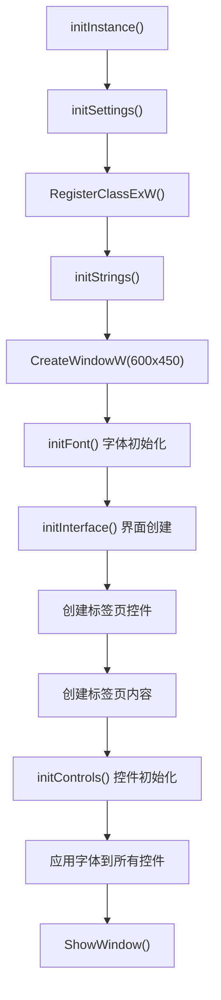

**图表来源**
- [SoundRemoteApp.cpp:26-27](file://SoundRemote/SoundRemoteApp.cpp#L26-L27)
- [SoundRemoteApp.cpp:613-654](file://SoundRemote/SoundRemoteApp.cpp#L613-L654)
- [SoundRemoteApp.cpp:224-235](file://SoundRemote/SoundRemoteApp.cpp#L224-L235)
- [SoundRemoteApp.cpp:440-473](file://SoundRemote/SoundRemoteApp.cpp#L440-L473)

**章节来源**
- [SoundRemoteApp.cpp:26-27](file://SoundRemote/SoundRemoteApp.cpp#L26-L27)
- [SoundRemoteApp.cpp:613-654](file://SoundRemote/SoundRemoteApp.cpp#L613-L654)
- [SoundRemoteApp.cpp:224-235](file://SoundRemote/SoundRemoteApp.cpp#L224-L235)
- [SoundRemoteApp.cpp:440-473](file://SoundRemote/SoundRemoteApp.cpp#L440-L473)

### 国际化支持系统
全面的国际化支持，支持中文本地化和其他语言的资源加载。

- 语言检测与资源加载
  - initStrings 首先检查 settings_->getLanguage() 是否为 "Chinese"。
  - 中文模式下直接设置硬编码的中文字符串到各个 UI 文本变量。
  - 非中文模式下使用 loadStringResource 函数通过资源 ID 加载对应语言的字符串。
- 菜单项本地化
  - initMenu 中针对中文环境动态修改菜单项文本，包括"文件(&F)"、"帮助(&H)"等。
  - 使用 ModifyMenuW 和 SetMenuItemInfo 实时更新菜单显示。
- 标签页文本本地化
  - 标签页标题"客户端"和"快捷键"通过 clientListLabel_ 和 keystrokeListLabel_ 变量支持本地化。
  - 中文环境下显示中文字符，其他语言环境下显示对应翻译。
- 字符串资源管理
  - loadStringResource 封装 LoadStringW 调用，返回 std::wstring 便于内存管理。
  - 所有可见文本都通过统一的接口加载，便于维护和扩展。

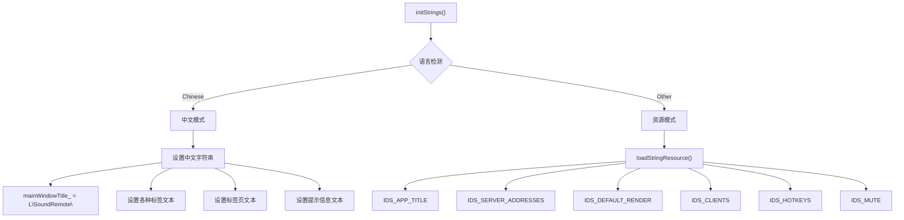

**图表来源**
- [SoundRemoteApp.cpp:557-583](file://SoundRemote/SoundRemoteApp.cpp#L557-L583)
- [SoundRemoteApp.cpp:524-555](file://SoundRemote/SoundRemoteApp.cpp#L524-L555)
- [SoundRemoteApp.cpp:256-260](file://SoundRemote/SoundRemoteApp.cpp#L256-L260)

**章节来源**
- [SoundRemoteApp.cpp:557-583](file://SoundRemote/SoundRemoteApp.cpp#L557-L583)
- [SoundRemoteApp.cpp:524-555](file://SoundRemote/SoundRemoteApp.cpp#L524-L555)
- [SoundRemoteApp.cpp:256-260](file://SoundRemote/SoundRemoteApp.cpp#L256-L260)

### 字体管理系统
复杂的字体管理系统，支持动态字体创建和批量应用到所有控件。

- 字体配置读取
  - 从 Settings 中获取字体名称、大小、粗体属性。
  - 支持 getFont()、getFontSize()、getFontBold() 三个配置项。
- 动态字体创建
  - initFont 使用 CreateFontW 创建字体对象，支持 DPI 感知的字体大小计算。
  - 使用 MulDiv 和 GetDeviceCaps 进行精确的像素到点转换。
  - 支持清屏质量 CLEARTYPE_QUALITY 以获得更好的显示效果。
- 批量字体应用
  - 使用 EnumChildWindows 遍历所有子控件。
  - 对每个控件发送 WM_SETFONT 消息应用新字体。
  - 自动释放旧字体对象避免内存泄漏。
- 标签页字体适配
  - 标签页控件及其内容编辑框都应用统一的字体设置。
  - 确保标签页文本和内容文本的一致性。

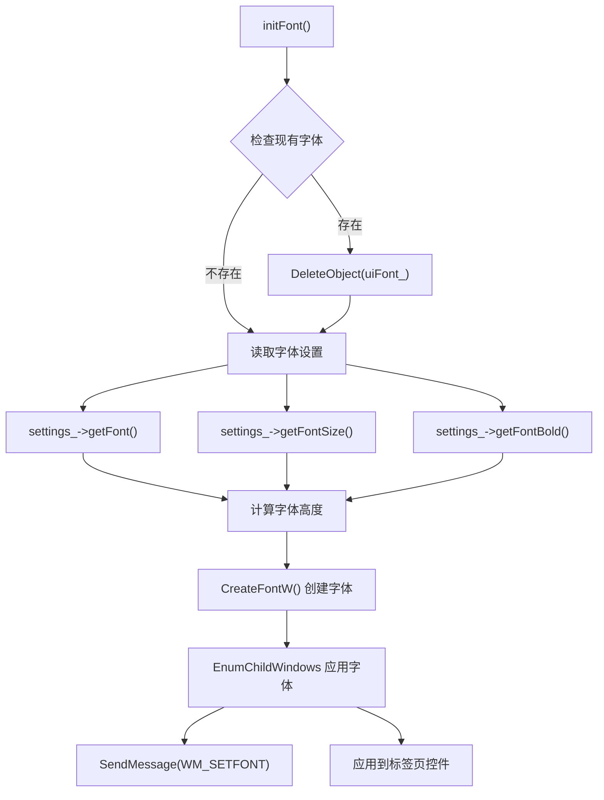

**图表来源**
- [SoundRemoteApp.cpp:585-611](file://SoundRemote/SoundRemoteApp.cpp#L585-L611)
- [Settings.cpp:64-74](file://SoundRemote/Settings.cpp#L64-L74)

**章节来源**
- [SoundRemoteApp.cpp:585-611](file://SoundRemote/SoundRemoteApp.cpp#L585-L611)
- [Settings.cpp:64-74](file://SoundRemote/Settings.cpp#L64-L74)

### 设备选择界面
- 设备枚举与默认项
  - addDevices 为指定 EDataFlow 添加设备项，并在 eRender/eCapture 时插入"默认播放/默认录制"特殊项。
  - deviceIds_ 映射 ComboBox 项数据（int key）到设备 ID（wstring），getDeviceId/getDeviceKey 用于双向查找。
- 选择与切换
  - onDeviceSelect 读取当前选中项，转换为 deviceId，post 到 ioContext 异步切换 capturePipe，并记住设置。
  - changeCaptureDevice 停止旧采集、重建 CapturePipe 并启动，同时订阅客户端更新以刷新 UI。
- 恢复与持久化
  - restoreCaptureDevice 从设置中读取上次设备并选中对应项。
  - rememberCaptureDevice 将选择结果写入设置，支持"默认播放/默认录制"的特殊标识。

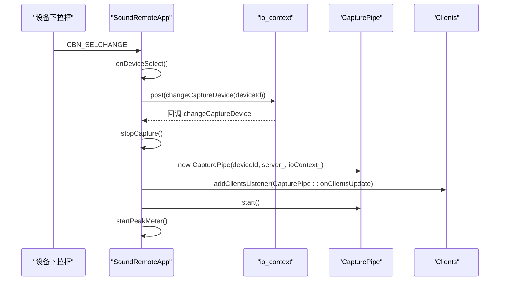

**图表来源**
- [SoundRemoteApp.cpp:262-274](file://SoundRemote/SoundRemoteApp.cpp#L262-L274)
- [SoundRemoteApp.cpp:276-286](file://SoundRemote/SoundRemoteApp.cpp#L276-L286)
- [SoundRemoteApp.cpp:288-300](file://SoundRemote/SoundRemoteApp.cpp#L288-L300)
- [SoundRemoteApp.cpp:498-505](file://SoundRemote/SoundRemoteApp.cpp#L498-L505)

**章节来源**
- [SoundRemoteApp.cpp:262-274](file://SoundRemote/SoundRemoteApp.cpp#L262-L274)
- [SoundRemoteApp.cpp:276-286](file://SoundRemote/SoundRemoteApp.cpp#L276-L286)
- [SoundRemoteApp.cpp:288-300](file://SoundRemote/SoundRemoteApp.cpp#L288-L300)
- [SoundRemoteApp.cpp:498-505](file://SoundRemote/SoundRemoteApp.cpp#L498-L505)

### 标签页内容管理
**更新** 标签页界面架构实现了内容分离管理，客户端列表和快捷键日志现在分别显示在不同的标签页中。

- 客户端列表标签页
  - 第一个标签页显示连接的客户端地址列表。
  - onClientsUpdate 接收来自 Clients 的更新事件，遍历 ClientInfo 地址，拼接为文本。
  - SetWindowTextA 直接写入只读编辑框，保留换行分隔。
- 快捷键日志标签页
  - 第二个标签页显示接收到的键盘输入事件。
  - onReceiveKeystroke 追加时间戳与按键描述到热键日志编辑框。
  - 使用 Edit_ReplaceSel 实现增量更新，避免频繁重绘。
- 标签页切换逻辑
  - 通过 WM_NOTIFY 消息处理 TCN_SELCHANGE 通知。
  - 根据选中标签页索引使用 ShowWindow 显示/隐藏对应的编辑框。
  - 确保同一时间只有一个标签页内容可见。

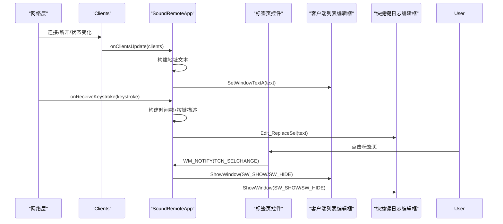

**图表来源**
- [SoundRemoteApp.cpp:310-316](file://SoundRemote/SoundRemoteApp.cpp#L310-L316)
- [SoundRemoteApp.cpp:337-347](file://SoundRemote/SoundRemoteApp.cpp#L337-L347)
- [SoundRemoteApp.cpp:763-772](file://SoundRemote/SoundRemoteApp.cpp#L763-L772)

**章节来源**
- [SoundRemoteApp.cpp:310-316](file://SoundRemote/SoundRemoteApp.cpp#L310-L316)
- [SoundRemoteApp.cpp:337-347](file://SoundRemote/SoundRemoteApp.cpp#L337-L347)
- [SoundRemoteApp.cpp:763-772](file://SoundRemote/SoundRemoteApp.cpp#L763-L772)

### 静音控制功能
- 自定义控件
  - MuteButton 封装 BS_ICON | BS_AUTOCHECKBOX | BS_PUSHLIKE 按钮，维护开/关图标，暴露 onClick/isMuted/handle/setStateCallback。
- 集成与回调
  - 主界面创建 MuteButton，设置 stateCallback 为 capturePipe_->setMuted(v)，从而联动音频管道静音状态。
  - 按钮点击由 BN_CLICKED 路由到 muteButton_->onClick()，内部更新图标并触发回调。
- **更新** 增强的光标反馈
  - 静音按钮现在提供手形光标反馈，当鼠标悬停时显示 IDC_HAND 光标，与其他交互元素保持一致的视觉提示。

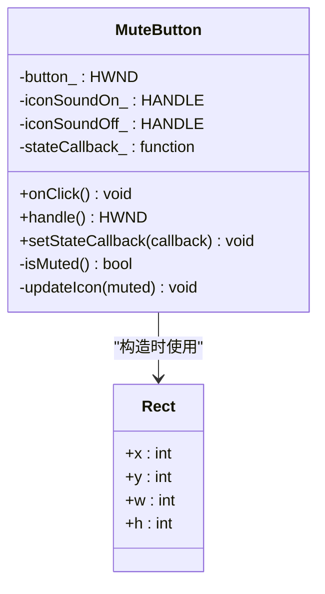

**图表来源**
- [Controls.h:10-24](file://SoundRemote/Controls.h#L10-L24)
- [Controls.h:26-34](file://SoundRemote/Controls.h#L26-L34)
- [Controls.cpp:7-44](file://SoundRemote/Controls.cpp#L7-L44)

**章节来源**
- [Controls.h:10-24](file://SoundRemote/Controls.h#L10-L24)
- [Controls.cpp:7-44](file://SoundRemote/Controls.cpp#L7-L44)
- [SoundRemoteApp.cpp:484-487](file://SoundRemote/SoundRemoteApp.cpp#L484-L487)
- [SoundRemoteApp.cpp:739-742](file://SoundRemote/SoundRemoteApp.cpp#L739-L742)

### 峰值表与定时器
- 定时器驱动
  - startPeakMeter/stopPeakMeter 使用 SetTimer/KillTimer 控制周期刷新。
  - WM_TIMER 中 timerIdPeakMeter 触发 updatePeakMeter，读取 CapturePipe 峰值并设置进度条位置。
- 进度条
  - 垂直进度条使用 PROGRESS_CLASS 与 PBS_VERTICAL | PBS_SMOOTH 样式。

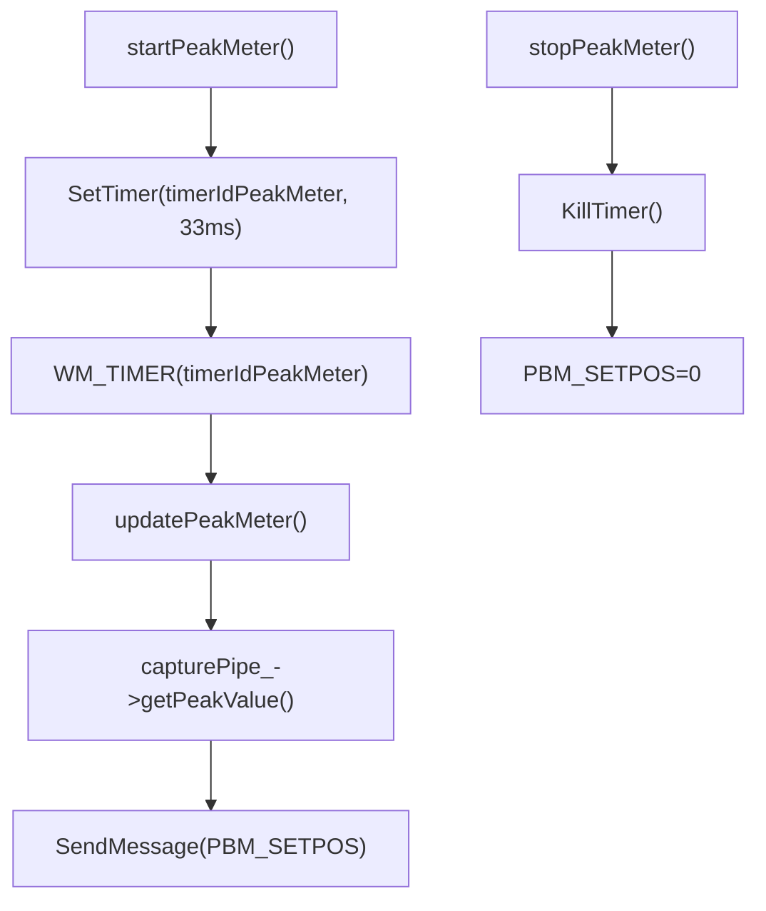

**图表来源**
- [SoundRemoteApp.cpp:507-514](file://SoundRemote/SoundRemoteApp.cpp#L507-L514)
- [SoundRemoteApp.cpp:327-335](file://SoundRemote/SoundRemoteApp.cpp#L327-L335)
- [SoundRemoteApp.cpp:489-495](file://SoundRemote/SoundRemoteApp.cpp#L489-L495)

**章节来源**
- [SoundRemoteApp.cpp:507-514](file://SoundRemote/SoundRemoteApp.cpp#L507-L514)
- [SoundRemoteApp.cpp:327-335](file://SoundRemote/SoundRemoteApp.cpp#L327-L335)
- [SoundRemoteApp.cpp:489-495](file://SoundRemote/SoundRemoteApp.cpp#L489-L495)

### 地址查看与更新检查
- 地址查看
  - onAddressButtonClick 获取本机地址列表并以信息框展示。
- 更新检查
  - checkUpdates 委托 UpdateChecker 执行，完成后通过 WM_UPDATE_CHECK 回调 onUpdateCheckFinish，根据结果弹出提示或引导下载页面。

**章节来源**
- [SoundRemoteApp.cpp:318-325](file://SoundRemote/SoundRemoteApp.cpp#L318-325)
- [SoundRemoteApp.cpp:349-382](file://SoundRemote/SoundRemoteApp.cpp#L349-L382)

### 界面布局与用户体验设计原则
**更新** 界面布局采用全新的标签页架构，提供更清晰的信息组织和更好的用户体验。

- 布局策略
  - 顶部区域放置设备选择下拉框，中部区域采用标签页界面组织客户端列表和快捷键日志。
  - 右侧窄列放置 IP 按钮、垂直峰值表与静音按钮，形成紧凑的控制面板。
  - 使用增强的 getCharHeight 动态计算标签宽度，保证在不同 DPI/字体下对齐一致，现在包含 tmExternalLeading 支持。
  - 主窗口尺寸600x450提供更宽敞的操作空间，改善整体视觉效果。
- **更新** 增强的交互反馈
  - 设备切换即时重启采集并刷新峰值表；静音按钮图标随状态切换；地址查看与更新检查均提供明确提示。
  - 增强的手形光标反馈系统，当鼠标悬停在标签页控件、设备下拉框、地址按钮和静音按钮等可交互元素上时显示手形光标，提升用户感知。
  - 所有交互元素现在提供一致的光标反馈，改善用户体验的一致性。
- 可访问性
  - 控件启用 WS_TABSTOP，配合 IsDialogMessage 支持 Tab 导航；Tooltip 为按钮提供辅助说明。
  - 标签页界面符合 Windows 标准交互模式，易于用户理解和使用。

**章节来源**
- [SoundRemoteApp.cpp:417-496](file://SoundRemote/SoundRemoteApp.cpp#L417-L496)
- [SoundRemoteApp.cpp:224-235](file://SoundRemote/SoundRemoteApp.cpp#L224-L235)
- [SoundRemoteApp.cpp:237-254](file://SoundRemote/SoundRemoteApp.cpp#L237-L254)
- [SoundRemoteApp.cpp:753-761](file://SoundRemote/SoundRemoteApp.cpp#L753-L761)

## 依赖关系分析
- 模块耦合
  - SoundRemoteApp 聚合 Server、Clients、CapturePipe、Settings、UpdateChecker，并通过 boost::asio::io_context 与线程进行异步事件处理。
  - 控件与业务解耦：MuteButton 仅暴露回调接口，具体静音逻辑由上层注入。
  - 标签页控件作为新的UI容器，管理内容编辑框的生命周期和显示逻辑。
- 外部依赖
  - Windows 通用控件库（CommCtrl）、Shell API（ShellExecute）、多媒体设备 API（mmdeviceapi.h）。
- 潜在循环依赖
  - 通过监听器模式（addClientsListener）避免强耦合；注意移除监听器顺序以避免悬挂引用。

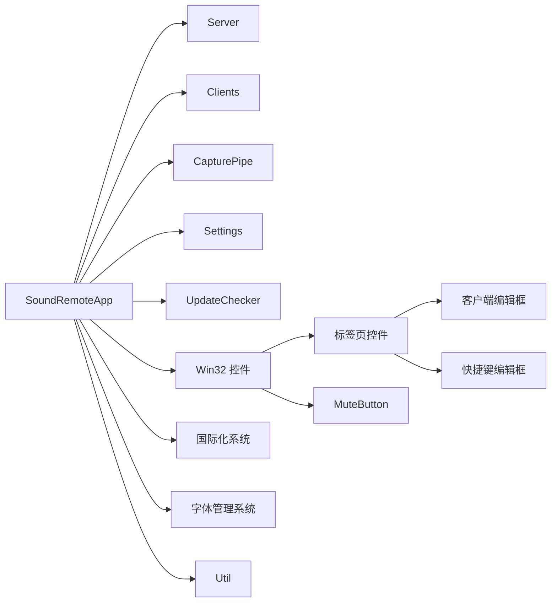

**图表来源**
- [SoundRemoteApp.h:57-65](file://SoundRemote/SoundRemoteApp.h#L57-L65)
- [Controls.h:10-24](file://SoundRemote/Controls.h#L10-L24)
- [Util.h:10-62](file://SoundRemote/Util.h#L10-L62)

**章节来源**
- [SoundRemoteApp.h:57-65](file://SoundRemote/SoundRemoteApp.h#L57-L65)
- [Controls.h:10-24](file://SoundRemote/Controls.h#L10-L24)
- [Util.h:10-62](file://SoundRemote/Util.h#L10-L62)

## 性能考虑
- 消息循环与 UI 响应
  - 使用 IsDialogMessage 与 TranslateAccelerator 减少不必要的消息转换开销。
  - 峰值表定时器周期 33ms，兼顾刷新频率与 CPU 占用。
- 文本更新
  - 客户端列表与热键日志采用一次性 SetWindowTextA/ReplaceSel，避免频繁重绘。
  - 标签页切换通过 ShowWindow 控制显示/隐藏，避免不必要的重绘操作。
- 资源加载
  - 图标与字符串仅在初始化阶段加载，运行时复用句柄。
- 异步处理
  - 设备切换与网络事件通过 io_context 派发，避免阻塞 UI 线程。
- 字体管理优化
  - 字体对象在析构时自动释放，避免内存泄漏。
  - 批量应用字体使用 WM_SETFONT 消息，比逐个设置更高效。
- **更新** 增强的光标反馈系统轻量高效，通过简单的 WM_SETCURSOR 消息处理实现，不影响整体性能；标签页界面架构减少了同时显示的控件数量，提高了渲染效率；初始化顺序优化减少了重复的字体应用操作，提升了启动性能。

[本节为通用指导，不直接分析具体文件]

## 故障排查指南
- 常见错误提示
  - Util::showError/showInfo 统一弹出错误与信息框，便于快速定位问题。
- 致命错误
  - makeFatalErrorText 生成包含 ErrorCode 的致命错误文本，用于不可恢复场景。
- 电源事件
  - 系统挂起时清空客户端列表，防止残留状态影响恢复。
- 更新检查失败
  - 更新检查错误路径会显示提示信息，必要时引导用户手动检查。
- 国际化问题排查
  - 检查 settings_->getLanguage() 返回值是否正确。
  - 验证资源文件中的字符串 ID 是否完整。
- 字体问题排查
  - 确认字体名称在系统中可用。
  - 检查字体大小是否在合理范围内。
- **更新** 光标反馈问题排查
  - 检查 WM_SETCURSOR 消息处理是否正确实现。
  - 确认目标控件句柄比较逻辑是否正常。
  - 验证 IDC_HAND 光标资源是否可用。
  - 检查标签页控件、设备下拉框、地址按钮和静音按钮的句柄是否正确初始化。
  - 确认标签页界面问题排查
    - 检查标签页控件创建是否成功，确认 WC_TABCONTROL 类已正确注册。
    - 验证标签页切换逻辑是否正常，检查 WM_NOTIFY 消息处理。
    - 确认标签页内容编辑框的定位和尺寸计算是否正确。
    - 验证主窗口尺寸常量是否正确设置为600x450。
    - 确认 getCharHeight() 方法是否正确包含 tmExternalLeading 计算。
    - 确认 initInstance() 中字体初始化顺序是否正确。

**章节来源**
- [Util.cpp:15-31](file://SoundRemote/Util.cpp#L15-L31)
- [Util.h:6-57](file://SoundRemote/Util.h#L6-L57)
- [SoundRemoteApp.cpp:815-821](file://SoundRemote/SoundRemoteApp.cpp#L815-L821)
- [SoundRemoteApp.cpp:349-382](file://SoundRemote/SoundRemoteApp.cpp#L349-L382)
- [SoundRemoteApp.cpp:763-772](file://SoundRemote/SoundRemoteApp.cpp#L763-L772)
- [SoundRemoteApp.cpp:753-761](file://SoundRemote/SoundRemoteApp.cpp#L753-L761)

## 结论
该用户界面采用经典 Win32 架构，现已升级为标签页界面设计，围绕主窗口与子控件组织，结合异步事件循环与轻量级自定义控件，实现了设备选择、客户端监控、静音控制与峰值指示等核心功能。通过资源字符串与 Tooltip 提升可本地化性与可用性。

**更新** 全新的标签页界面架构显著改善了信息组织和用户体验，主窗口尺寸优化至600x450提供了更好的视觉体验和操作空间，字符高度计算精度的提升确保了界面布局的一致性，初始化流程的优化改善了启动性能，增强的光标反馈系统为所有交互元素提供一致的手形光标提示，全面提升了用户交互体验，中文本地化支持进一步改善了用户体验。建议在后续迭代中引入更灵活的布局管理器、主题系统与无障碍增强，以提升可扩展性与用户体验。

[本节为总结性内容，不直接分析具体文件]

## 附录

### 主题定制建议
- 背景与控件颜色
  - 可在 WNDCLASSEXW 中调整 hbrBackground，或在 WM_PAINT 中绘制自定义背景。
- 图标与视觉风格
  - 通过资源替换 IDI_SOUND_ON/OFF 与程序图标，实现不同主题外观。
- 字体与 DPI
  - 使用增强的 getCharHeight 动态度量字体，适配高 DPI 环境，现在包含 tmExternalLeading 支持。
- 窗口尺寸定制
  - 可通过修改 windowWidth 和 windowHeight 常量来调整主窗口尺寸。
- **更新** 标签页主题定制
  - 可通过自定义标签页控件的绘制逻辑实现主题化。
  - 调整标签页间距、边框颜色和字体样式。

**章节来源**
- [SoundRemoteApp.cpp:613-627](file://SoundRemote/SoundRemoteApp.cpp#L613-L627)
- [SoundRemoteApp.cpp:224-235](file://SoundRemote/SoundRemoteApp.cpp#L224-L235)
- [Controls.cpp:11-13](file://SoundRemote/Controls.cpp#L11-L13)
- [SoundRemoteApp.cpp:445-457](file://SoundRemote/SoundRemoteApp.cpp#L445-L457)

### 国际化支持
完整的国际化架构，支持中文本地化和其他语言的资源加载。

- 语言检测与资源加载
  - 支持中文本地化，通过 settings_->getLanguage() 检测语言环境。
  - 中文模式下直接使用硬编码字符串，其他语言使用资源 ID 加载。
  - 菜单项、对话框文本、提示信息等都支持动态本地化。
- 标签页文本本地化
  - 标签页标题"客户端"和"快捷键"通过独立变量支持本地化。
  - 确保不同语言环境下标签页文本的正确显示。
- 资源字符串
  - 所有可见文本通过 LoadStringW 加载，资源 ID 集中在 resource.h，便于多语言资源包替换。
- 建议
  - 新增文案一律走资源 ID，避免硬编码字符串；对日期/时间格式使用本地化函数。
  - 考虑 RTL（从右到左）语言的支持。

**章节来源**
- [SoundRemoteApp.cpp:557-583](file://SoundRemote/SoundRemoteApp.cpp#L557-L583)
- [SoundRemoteApp.cpp:524-555](file://SoundRemote/SoundRemoteApp.cpp#L524-L555)
- [resource.h:7-29](file://SoundRemote/resource.h#L7-L29)

### 字体管理系统
高级字体管理功能，支持动态字体创建和批量应用。

- 动态字体创建
  - 支持从设置中读取字体名称、大小、粗体属性。
  - 使用 CreateFontW 创建字体对象，支持清屏质量渲染。
- 批量应用机制
  - 使用 EnumChildWindows 遍历所有子控件并应用统一字体。
  - 自动管理字体对象的创建和销毁，避免内存泄漏。
- DPI 感知支持
  - 使用 MulDiv 和 GetDeviceCaps 进行精确的像素到点转换。
  - 确保在不同分辨率下显示一致性。
- **更新** 标签页字体适配
  - 标签页控件及其内容编辑框都应用统一的字体设置。
  - 确保标签页文本和内容文本的一致性和可读性。

**章节来源**
- [SoundRemoteApp.cpp:585-611](file://SoundRemote/SoundRemoteApp.cpp#L585-L611)
- [Settings.cpp:64-74](file://SoundRemote/Settings.cpp#L64-L74)

### 可访问性考虑
- 键盘导航
  - 控件启用 WS_TABSTOP，IsDialogMessage 自动处理对话框式导航。
- 工具提示
  - setTooltip 为按钮提供 Tooltip，改善无鼠标操作体验。
- 标签页可访问性
  - 标签页控件遵循 Windows 标准可访问性规范。
  - 支持键盘导航在标签页之间切换。
- **更新** 增强的光标反馈可访问性
  - 手形光标反馈为所有交互元素提供一致的视觉提示，改善可访问性。
  - 符合 Windows 标准交互模式，易于屏幕阅读器识别。
- 建议
  - 为关键控件增加 accessible name/role（如使用 UI Automation 扩展）。
  - 考虑屏幕阅读器的兼容性，确保文本内容可被正确读取。

**章节来源**
- [SoundRemoteApp.cpp:237-254](file://SoundRemote/SoundRemoteApp.cpp#L237-L254)
- [SoundRemoteApp.cpp:476-482](file://SoundRemote/SoundRemoteApp.cpp#L476-L482)
- [SoundRemoteApp.cpp:763-772](file://SoundRemote/SoundRemoteApp.cpp#L763-L772)
- [SoundRemoteApp.cpp:753-761](file://SoundRemote/SoundRemoteApp.cpp#L753-L761)

### 界面扩展指南
- 新增控件
  - 在 initInterface 中按布局规则创建控件，保持右侧窄列与左侧宽区的比例；为控件设置 Tooltip 与 TabStop。
  - 考虑新的600x450窗口尺寸和标签页布局，重新计算控件位置和大小。
- 事件处理
  - 在 wndProc 的 WM_COMMAND 分支中添加控件通知处理，遵循现有命名约定（如 onXxx）。
- 自定义控件
  - 参考 MuteButton 模式：封装底层控件、暴露简洁接口、通过回调与上层解耦。
- 国际化扩展
  - 为新控件的文本添加对应的资源 ID 或在中文字符串分支中添加硬编码文本。
  - 确保新控件在所有语言环境下都能正确显示。
- **更新** 标签页扩展指南
  - 如需新增标签页，在 initInterface 中使用 TabCtrl_InsertItem 添加新标签。
  - 为新标签页创建对应的内容控件，并确保在 WM_NOTIFY 中处理显示/隐藏逻辑。
  - 考虑标签页内容的本地化和字体适配。
- **更新** 光标反馈扩展
  - 如需为新控件添加手形光标反馈，在 WM_SETCURSOR 消息处理中添加相应的判断逻辑。
  - 确保新控件的句柄比较逻辑正确实现。

**章节来源**
- [SoundRemoteApp.cpp:417-496](file://SoundRemote/SoundRemoteApp.cpp#L417-L496)
- [SoundRemoteApp.cpp:690-751](file://SoundRemote/SoundRemoteApp.cpp#L690-L751)
- [Controls.h:10-24](file://SoundRemote/Controls.h#L10-L24)
- [Controls.cpp:7-44](file://SoundRemote/Controls.cpp#L7-L44)
- [SoundRemoteApp.cpp:449-454](file://SoundRemote/SoundRemoteApp.cpp#L449-L454)
- [SoundRemoteApp.cpp:763-772](file://SoundRemote/SoundRemoteApp.cpp#L763-L772)
- [SoundRemoteApp.cpp:753-761](file://SoundRemote/SoundRemoteApp.cpp#L753-L761)

### 自定义控件开发建议
- 职责单一
  - 每个控件聚焦一个交互语义（如静音开关），通过回调与业务层通信。
- 资源管理
  - 图标/位图在构造时加载，析构时释放；避免重复加载造成内存抖动。
- 状态同步
  - 对外暴露 isMuted 等查询接口，方便上层校验与调试。
- 国际化兼容
  - 确保控件文本支持动态本地化。
  - 考虑不同语言下的布局适配需求。
- **更新** 光标反馈集成
  - 参考现有的 WM_SETCURSOR 处理模式，为自定义控件提供手形光标反馈。
  - 在控件构造函数中记录自身句柄，便于在主窗口消息处理中进行识别。
  - 确保控件句柄在 WM_SETCURSOR 消息中正确比较。

**章节来源**
- [Controls.h:10-24](file://SoundRemote/Controls.h#L10-L24)
- [Controls.cpp:7-44](file://SoundRemote/Controls.cpp#L7-L44)
- [SoundRemoteApp.cpp:753-761](file://SoundRemote/SoundRemoteApp.cpp#L753-L761)

### 响应式设计最佳实践
- 动态度量
  - 使用增强的 getCharHeight 与窗口尺寸计算控件位置，适应不同分辨率与字体，现在包含 tmExternalLeading 支持。
  - 考虑新的600x450窗口尺寸和标签页布局进行适配。
- 最小化重绘
  - 批量更新文本后再刷新，避免频繁 BeginPaint/EndPaint。
  - 标签页切换通过 ShowWindow 控制显示/隐藏，避免不必要的重绘。
- 异步优先
  - 耗时操作（网络、音频）放入 io_context 线程，UI 仅做轻量更新。
- 字体自适应
  - 使用 initFont 确保在不同字体设置下保持一致的布局。
  - 考虑大字体模式下的界面适配。
- **更新** 标签页响应式设计
  - 标签页内容编辑框自动适应标签页显示区域的大小变化。
  - 使用 TabCtrl_AdjustRect 确保内容控件正确定位在标签页内部。
  - 初始化顺序优化确保字体在界面创建前正确加载，避免了布局闪烁问题；字符高度计算优化提高了布局精度。
- **更新** 光标反馈响应式设计
  - 增强的光标反馈系统轻量高效，不影响界面响应性能。
  - 手形光标反馈在所有交互元素上保持一致，提升用户体验的一致性。

**章节来源**
- [SoundRemoteApp.cpp:224-235](file://SoundRemote/SoundRemoteApp.cpp#L224-L235)
- [SoundRemoteApp.cpp:310-316](file://SoundRemote/SoundRemoteApp.cpp#L310-L316)
- [SoundRemoteApp.cpp:384-393](file://SoundRemote/SoundRemoteApp.cpp#L384-L393)
- [SoundRemoteApp.cpp:585-611](file://SoundRemote/SoundRemoteApp.cpp#L585-L611)
- [SoundRemoteApp.cpp:459-465](file://SoundRemote/SoundRemoteApp.cpp#L459-L465)
- [SoundRemoteApp.cpp:753-761](file://SoundRemote/SoundRemoteApp.cpp#L753-L761)