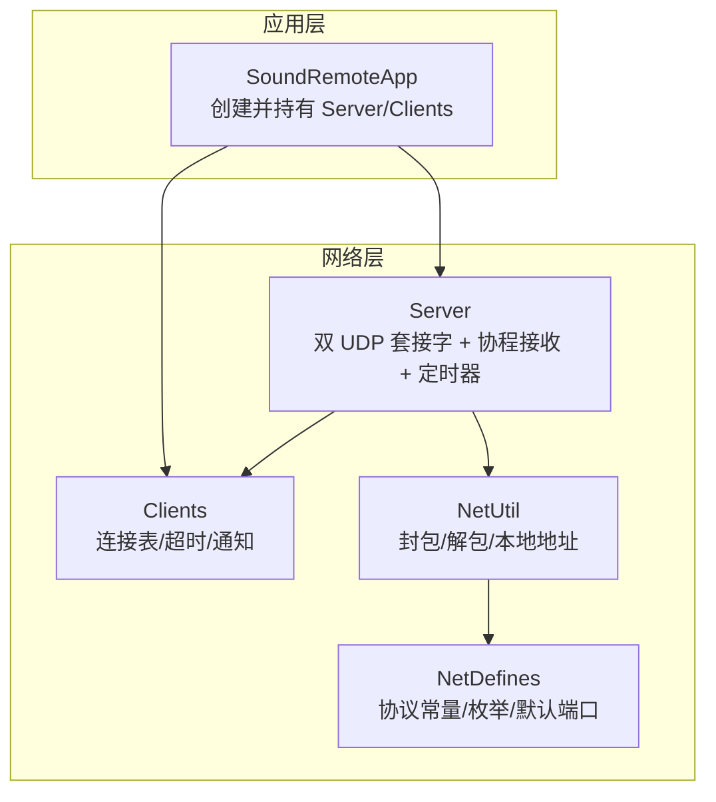
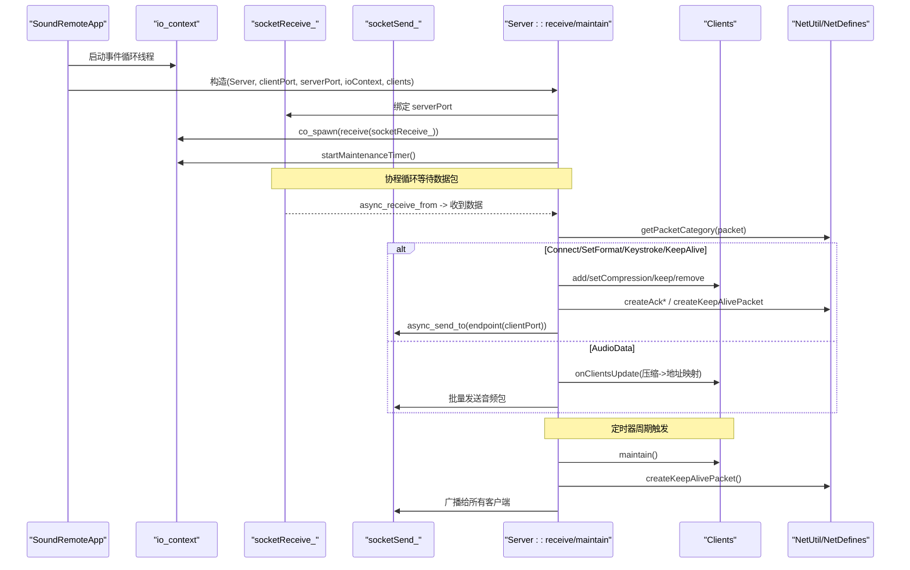
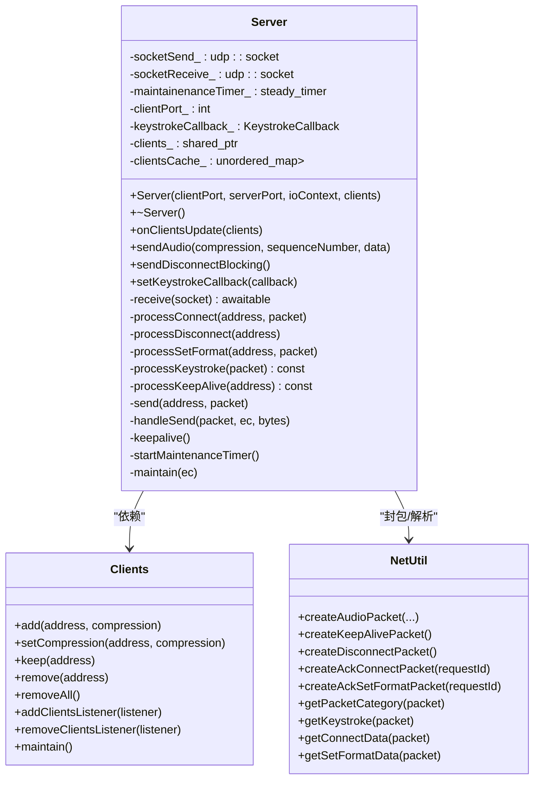
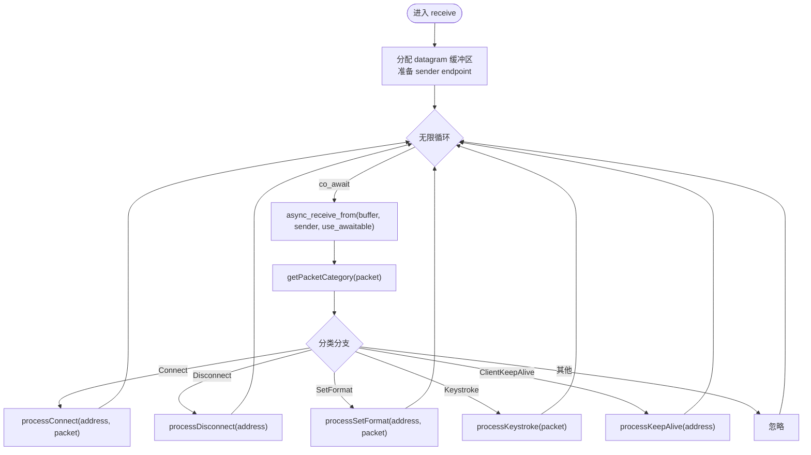
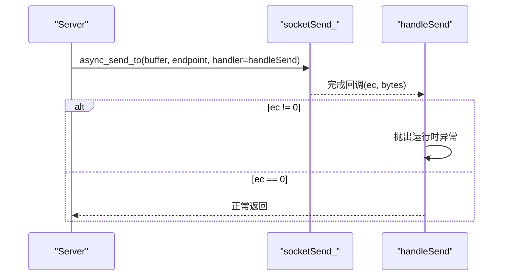
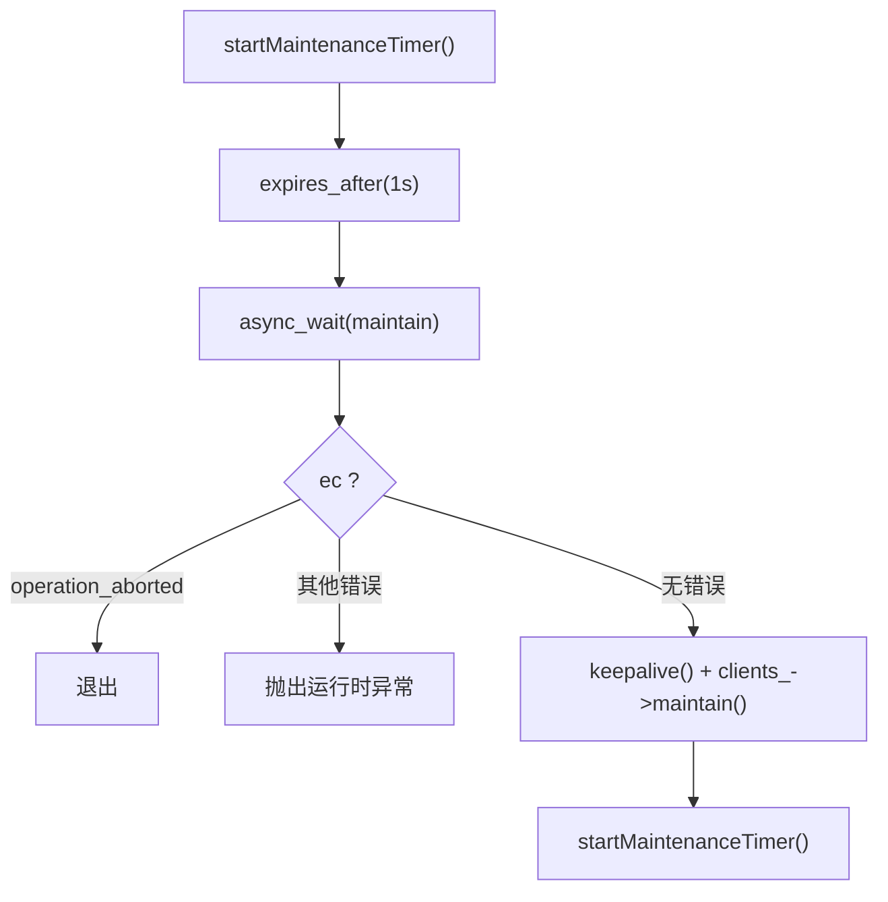
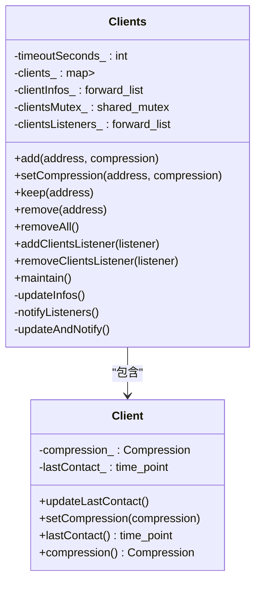
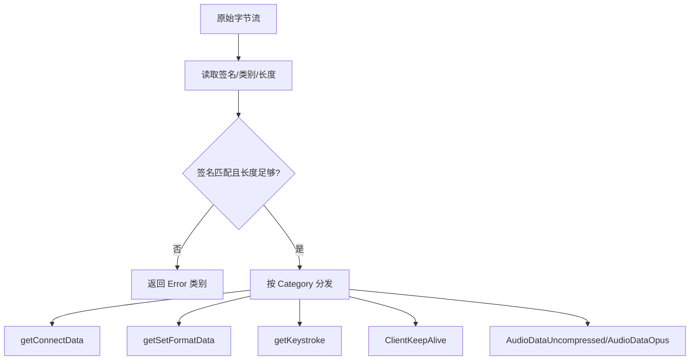
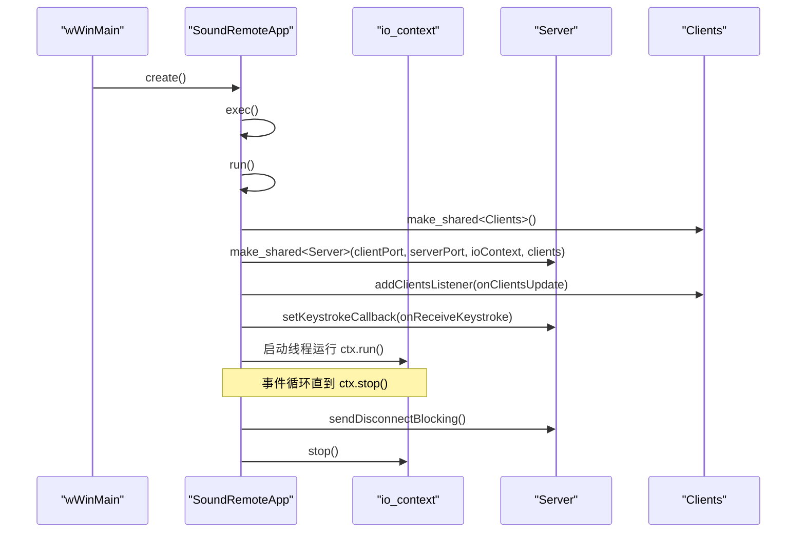
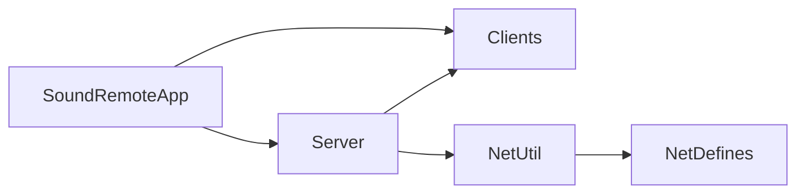

# UDP 服务器

<cite>
**本文引用的文件**   
- [Server.h](file://SoundRemote/Server.h)
- [Server.cpp](file://SoundRemote/Server.cpp)
- [NetDefines.h](file://SoundRemote/NetDefines.h)
- [NetUtil.h](file://SoundRemote/NetUtil.h)
- [NetUtil.cpp](file://SoundRemote/NetUtil.cpp)
- [Clients.h](file://SoundRemote/Clients.h)
- [Clients.cpp](file://SoundRemote/Clients.cpp)
- [SoundRemoteApp.h](file://SoundRemote/SoundRemoteApp.h)
- [SoundRemoteApp.cpp](file://SoundRemote/SoundRemoteApp.cpp)
</cite>

## 目录
1. [简介](#简介)
2. [项目结构](#项目结构)
3. [核心组件](#核心组件)
4. [架构总览](#架构总览)
5. [详细组件分析](#详细组件分析)
6. [依赖关系分析](#依赖关系分析)
7. [性能与优化](#性能与优化)
8. [故障排查指南](#故障排查指南)
9. [结论](#结论)
10. [附录：集成示例与最佳实践](#附录集成示例与最佳实践)

## 简介
本文件面向 SoundRemote-WinServer 的 UDP 服务器组件，聚焦于基于 Boost.Asio 的异步 UDP 实现。文档深入解释以下主题：
- 双套接字架构（发送与接收分离）
- 协程驱动的异步 I/O 模型与事件循环机制
- 服务器初始化流程、端口绑定、数据包接收处理与发送队列管理
- keepalive 心跳机制、定时器维护与资源清理策略
- 错误处理、异常安全与性能优化技巧
- 如何启动服务器、处理网络事件并集成到应用程序中

## 项目结构
UDP 服务器相关代码主要分布在以下文件中：
- 协议定义与工具：NetDefines.h、NetUtil.h、NetUtil.cpp
- 服务器核心：Server.h、Server.cpp
- 客户端集合与超时管理：Clients.h、Clients.cpp
- 应用入口与事件循环：SoundRemoteApp.h、SoundRemoteApp.cpp

图表来源
- [Server.cpp:18-28](file://SoundRemote/Server.cpp#L18-L28)
- [SoundRemoteApp.cpp:100-125](file://SoundRemote/SoundRemoteApp.cpp#L100-L125)
- [NetUtil.cpp:129-169](file://SoundRemote/NetUtil.cpp#L129-L169)
- [NetDefines.h:45-68](file://SoundRemote/NetDefines.h#L45-L68)

章节来源
- [Server.h:20-61](file://SoundRemote/Server.h#L20-L61)
- [Server.cpp:18-28](file://SoundRemote/Server.cpp#L18-L28)
- [NetDefines.h:45-68](file://SoundRemote/NetDefines.h#L45-L68)
- [NetUtil.h:26-40](file://SoundRemote/NetUtil.h#L26-L40)
- [NetUtil.cpp:129-169](file://SoundRemote/NetUtil.cpp#L129-L169)
- [Clients.h:15-52](file://SoundRemote/Clients.h#L15-L52)
- [Clients.cpp:64-80](file://SoundRemote/Clients.cpp#L64-L80)
- [SoundRemoteApp.cpp:100-125](file://SoundRemote/SoundRemoteApp.cpp#L100-L125)

## 核心组件
- Server：封装 UDP 收发、协程接收循环、定时维护、心跳广播、按键转发等核心逻辑。
- Clients：维护已连接客户端列表、压缩格式、最后接触时间、超时剔除与变更通知。
- NetUtil/NetDefines：协议头、类别、字段偏移、封包/拆包函数、本地地址获取等。
- SoundRemoteApp：应用主循环、创建 Server/Clients、启动 io_context 线程、UI 交互与生命周期管理。

章节来源
- [Server.h:20-61](file://SoundRemote/Server.h#L20-L61)
- [Clients.h:15-52](file://SoundRemote/Clients.h#L15-L52)
- [NetDefines.h:45-68](file://SoundRemote/NetDefines.h#L45-L68)
- [NetUtil.h:26-40](file://SoundRemote/NetUtil.h#L26-L40)
- [SoundRemoteApp.h:57-63](file://SoundRemote/SoundRemoteApp.h#L57-L63)

## 架构总览
整体采用“双套接字 + 协程 + 定时器”的异步架构：
- 接收端 socketReceive_ 绑定 serverPort，使用协程持续 async_receive_from，按协议类别分发处理。
- 发送端 socketSend_ 用于向 clientPort 发送数据，通过回调 handleSend 完成异步发送。
- steady_timer 周期性触发 maintain，执行 keepalive 广播与客户端超时维护。
- Clients 提供连接状态缓存与变更回调，Server 将结果缓存到 clientsCache_ 以高效广播。

图表来源
- [Server.cpp:18-28](file://SoundRemote/Server.cpp#L18-L28)
- [Server.cpp:80-125](file://SoundRemote/Server.cpp#L80-L125)
- [Server.cpp:182-199](file://SoundRemote/Server.cpp#L182-L199)
- [Server.cpp:201-209](file://SoundRemote/Server.cpp#L201-L209)
- [NetUtil.cpp:129-169](file://SoundRemote/NetUtil.cpp#L129-L169)
- [NetDefines.h:45-68](file://SoundRemote/NetDefines.h#L45-L68)
- [SoundRemoteApp.cpp:100-125](file://SoundRemote/SoundRemoteApp.cpp#L100-L125)

## 详细组件分析

### 服务器类 Server
职责与关键点：
- 双套接字：socketReceive_ 负责接收，socketSend_ 负责发送，避免同一 socket 并发读写竞争。
- 协程接收：receive 使用 boost::asio::awaitable 与 use_awaitable 进行非阻塞接收循环。
- 协议分发：根据 Net::getPacketCategory 分派到 processConnect/processSetFormat/processKeystroke/processKeepAlive。
- 发送路径：send 使用 async_send_to，handleSend 作为完成回调；对错误抛出运行时异常。
- 定时器：startMaintenanceTimer/maintain 每 1s 触发 keepalive 与客户端维护。
- 客户端缓存：onClientsUpdate 将 Clients 的变更合并为 compression->addresses 的缓存，便于批量发送。

图表来源
- [Server.h:20-61](file://SoundRemote/Server.h#L20-L61)
- [Clients.h:15-52](file://SoundRemote/Clients.h#L15-L52)
- [NetUtil.h:26-40](file://SoundRemote/NetUtil.h#L26-L40)

章节来源
- [Server.h:20-61](file://SoundRemote/Server.h#L20-L61)
- [Server.cpp:18-28](file://SoundRemote/Server.cpp#L18-L28)
- [Server.cpp:80-125](file://SoundRemote/Server.cpp#L80-L125)
- [Server.cpp:168-180](file://SoundRemote/Server.cpp#L168-L180)
- [Server.cpp:182-199](file://SoundRemote/Server.cpp#L182-L199)
- [Server.cpp:201-209](file://SoundRemote/Server.cpp#L201-L209)

#### 协程接收流程

图表来源
- [Server.cpp:80-125](file://SoundRemote/Server.cpp#L80-L125)
- [NetUtil.cpp:171-180](file://SoundRemote/NetUtil.cpp#L171-L180)

章节来源
- [Server.cpp:80-125](file://SoundRemote/Server.cpp#L80-L125)

#### 发送路径与错误处理
- send 使用 async_send_to 将包发送到目标 endpoint(clientPort)。
- handleSend 在发生错误时抛出运行时异常；成功则无操作。
- sendDisconnectBlocking 使用同步 send_to 向所有已知客户端发送断开包。

图表来源
- [Server.cpp:168-180](file://SoundRemote/Server.cpp#L168-L180)

章节来源
- [Server.cpp:168-180](file://SoundRemote/Server.cpp#L168-L180)

#### 定时器与心跳
- startMaintenanceTimer 设置 1s 过期并注册 async_wait。
- maintain 检查错误码，调用 keepalive 与 clients_->maintain，然后再次调度下一次定时器。
- keepalive 遍历 clientsCache_，为每个客户端发送 ServerKeepAlive 包。

图表来源
- [Server.cpp:182-199](file://SoundRemote/Server.cpp#L182-L199)
- [Server.cpp:201-209](file://SoundRemote/Server.cpp#L201-L209)

章节来源
- [Server.cpp:182-199](file://SoundRemote/Server.cpp#L182-L199)
- [Server.cpp:201-209](file://SoundRemote/Server.cpp#L201-L209)

### 客户端集合 Clients
职责与关键点：
- 线程安全的客户端表，记录每个客户端的压缩格式与最后接触时间。
- 支持添加、更新压缩格式、保持活跃、删除、全部删除。
- 维护监听器列表，当内部状态变化时通知上层（如 UI 或 Server）。
- maintain 基于超时阈值剔除长时间未活跃的客户端。

图表来源
- [Clients.h:30-52](file://SoundRemote/Clients.h#L30-L52)

章节来源
- [Clients.h:15-52](file://SoundRemote/Clients.h#L15-L52)
- [Clients.cpp:5-18](file://SoundRemote/Clients.cpp#L5-L18)
- [Clients.cpp:64-80](file://SoundRemote/Clients.cpp#L64-L80)

### 协议与工具 NetUtil/NetDefines
- NetDefines 定义协议签名、类别枚举、头部字段偏移、默认端口、输入包大小等。
- NetUtil 提供封包/拆包函数：
  - createAudioPacket：组装音频数据包（含序列号与数据负载）
  - createKeepAlivePacket/createDisconnectPacket：控制包
  - createAckConnectPacket/createAckSetFormatPacket：应答包
  - getPacketCategory/getKeystroke/getConnectData/getSetFormatData：解析各类包
  - getLocalAddresses：获取本机 IPv4 地址列表

图表来源
- [NetDefines.h:45-68](file://SoundRemote/NetDefines.h#L45-L68)
- [NetUtil.cpp:171-180](file://SoundRemote/NetUtil.cpp#L171-L180)
- [NetUtil.cpp:182-217](file://SoundRemote/NetUtil.cpp#L182-L217)

章节来源
- [NetDefines.h:45-68](file://SoundRemote/NetDefines.h#L45-L68)
- [NetUtil.h:26-40](file://SoundRemote/NetUtil.h#L26-L40)
- [NetUtil.cpp:129-169](file://SoundRemote/NetUtil.cpp#L129-L169)
- [NetUtil.cpp:171-180](file://SoundRemote/NetUtil.cpp#L171-L180)
- [NetUtil.cpp:182-217](file://SoundRemote/NetUtil.cpp#L182-L217)

### 应用集成 SoundRemoteApp
- 创建 io_context 并在独立线程运行 asioEventLoop。
- 构造 Clients 与 Server，注册监听器，设置键盘回调。
- shutdown 阶段发送断开包并停止 io_context。

图表来源
- [SoundRemoteApp.cpp:36-46](file://SoundRemote/SoundRemoteApp.cpp#L36-L46)
- [SoundRemoteApp.cpp:100-125](file://SoundRemote/SoundRemoteApp.cpp#L100-L125)
- [SoundRemoteApp.cpp:127-131](file://SoundRemote/SoundRemoteApp.cpp#L127-L131)
- [SoundRemoteApp.cpp:388-408](file://SoundRemote/SoundRemoteApp.cpp#L388-L408)

章节来源
- [SoundRemoteApp.h:57-63](file://SoundRemote/SoundRemoteApp.h#L57-L63)
- [SoundRemoteApp.cpp:100-125](file://SoundRemote/SoundRemoteApp.cpp#L100-L125)
- [SoundRemoteApp.cpp:127-131](file://SoundRemote/SoundRemoteApp.cpp#L127-L131)
- [SoundRemoteApp.cpp:388-408](file://SoundRemote/SoundRemoteApp.cpp#L388-L408)

## 依赖关系分析
- Server 依赖 Clients 管理连接状态，依赖 NetUtil/NetDefines 进行封包/解析。
- SoundRemoteApp 作为应用容器，协调 Server 与 Clients 的生命周期与事件循环。
- 网络层与业务层解耦清晰：Server 仅关注网络协议与 I/O，Clients 专注连接管理与超时。

图表来源
- [Server.cpp:18-28](file://SoundRemote/Server.cpp#L18-L28)
- [NetUtil.cpp:129-169](file://SoundRemote/NetUtil.cpp#L129-L169)
- [NetDefines.h:45-68](file://SoundRemote/NetDefines.h#L45-L68)
- [SoundRemoteApp.cpp:100-125](file://SoundRemote/SoundRemoteApp.cpp#L100-L125)

章节来源
- [Server.h:20-61](file://SoundRemote/Server.h#L20-L61)
- [Clients.h:15-52](file://SoundRemote/Clients.h#L15-L52)
- [NetUtil.h:26-40](file://SoundRemote/NetUtil.h#L26-L40)
- [NetDefines.h:45-68](file://SoundRemote/NetDefines.h#L45-L68)
- [SoundRemoteApp.h:57-63](file://SoundRemote/SoundRemoteApp.h#L57-L63)

## 性能与优化
- 双套接字设计避免同一 socket 的并发读写冲突，降低锁竞争与上下文切换开销。
- 协程接收循环减少回调嵌套，提高可读性与可维护性；use_awaitable 与非阻塞 I/O 结合提升吞吐。
- 客户端缓存 clientsCache_ 按压缩类型分组，批量发送音频数据时减少查找与重复构建 endpoint 的开销。
- 定时器间隔 1s 平衡了心跳频率与系统开销；可根据网络环境调整。
- 发送路径使用 shared_ptr 传递包数据，确保回调期间内存有效，避免拷贝与悬垂指针。
- 建议：
  - 在高并发场景下考虑为发送路径增加轻量级队列与批处理，进一步降低系统调用次数。
  - 对高频音频数据发送，可使用零拷贝缓冲池与复用 buffer，减少内存分配。
  - 监控网络丢包与延迟，动态调整 keepalive 间隔与客户端超时阈值。

[本节为通用性能讨论，不直接分析具体文件]

## 故障排查指南
- 接收异常：
  - receive 捕获 boost::system::system_error 与 std::exception，若非 operation_aborted 则显示错误并终止进程。
  - 若出现未知异常，同样展示错误并退出，便于快速定位问题。
- 发送异常：
  - handleSend 在 ec 非空时抛出运行时异常；需确保上层能捕获或日志记录。
- 定时器异常：
  - maintain 对 operation_aborted 做静默处理，其他错误抛出运行时异常。
- 资源清理：
  - ~Server 关闭并关闭两个 socket，确保资源释放。
  - SoundRemoteApp::shutdown 发送断开包并调用 io_context.stop()，保证优雅退出。

章节来源
- [Server.cpp:111-125](file://SoundRemote/Server.cpp#L111-L125)
- [Server.cpp:176-180](file://SoundRemote/Server.cpp#L176-L180)
- [Server.cpp:187-199](file://SoundRemote/Server.cpp#L187-L199)
- [Server.cpp:30-35](file://SoundRemote/Server.cpp#L30-L35)
- [SoundRemoteApp.cpp:127-131](file://SoundRemote/SoundRemoteApp.cpp#L127-L131)

## 结论
该 UDP 服务器组件采用清晰的模块化设计与高效的异步 I/O 模型，具备稳定的心跳与超时管理机制。双套接字与协程驱动的结合提升了系统的可扩展性与可维护性。通过合理的错误处理与资源清理策略，能够在复杂网络环境下保持稳定运行。

[本节为总结性内容，不直接分析具体文件]

## 附录：集成示例与最佳实践
- 启动服务器：
  - 在应用 run 中创建 Clients 与 Server，注册客户端更新监听与键盘回调，启动 io_context 线程。
  - 参考路径：[run 方法:91-125](file://SoundRemote/SoundRemoteApp.cpp#L91-L125)
- 处理网络事件：
  - 接收循环自动分发 Connect/SetFormat/Keystroke/KeepAlive 等事件，业务侧通过回调或监听器响应。
  - 参考路径：[receive 协程:80-125](file://SoundRemote/Server.cpp#L80-L125)
- 发送音频数据：
  - 调用 sendAudio 传入压缩类型、序列号与数据，内部按客户端缓存批量发送。
  - 参考路径：[sendAudio:48-62](file://SoundRemote/Server.cpp#L48-L62)
- 优雅退出：
  - 在 shutdown 中发送断开包并停止事件循环。
  - 参考路径：[shutdown:127-131](file://SoundRemote/SoundRemoteApp.cpp#L127-L131)

章节来源
- [SoundRemoteApp.cpp:91-125](file://SoundRemote/SoundRemoteApp.cpp#L91-L125)
- [Server.cpp:48-62](file://SoundRemote/Server.cpp#L48-L62)
- [Server.cpp:80-125](file://SoundRemote/Server.cpp#L80-L125)
- [SoundRemoteApp.cpp:127-131](file://SoundRemote/SoundRemoteApp.cpp#L127-L131)