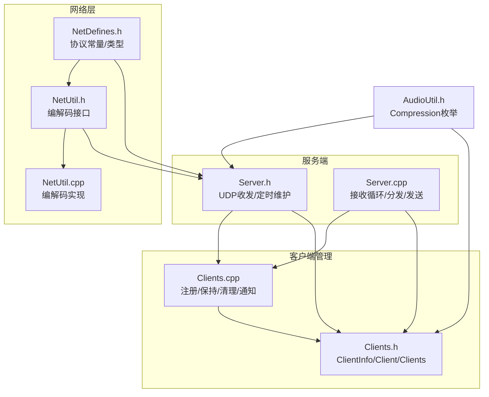
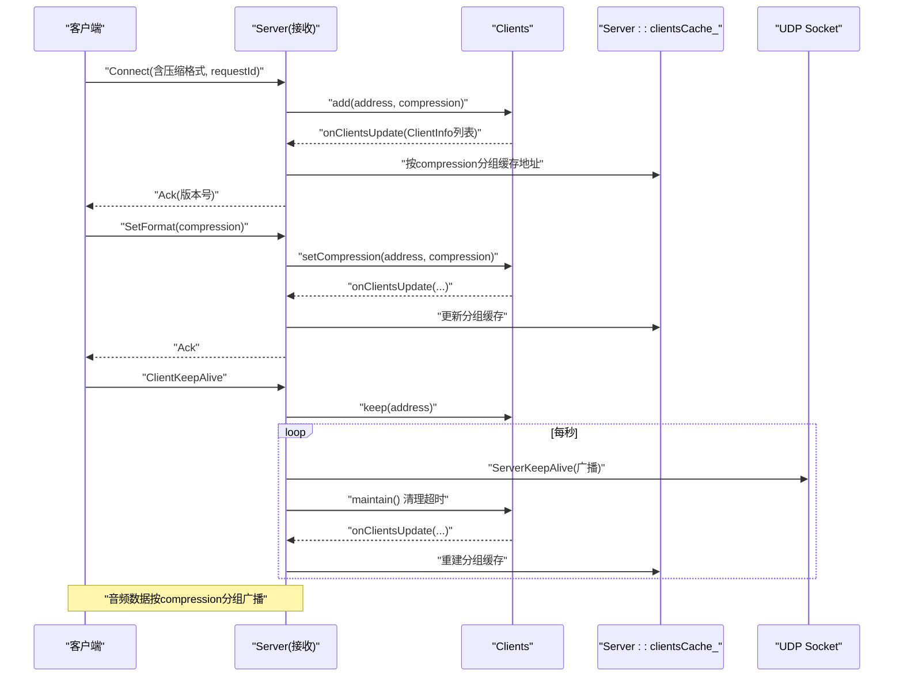
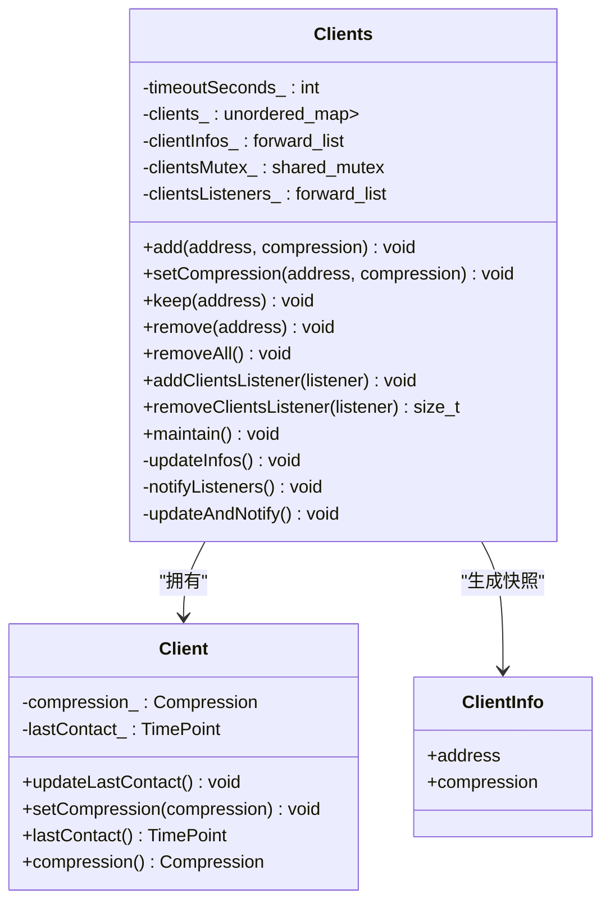
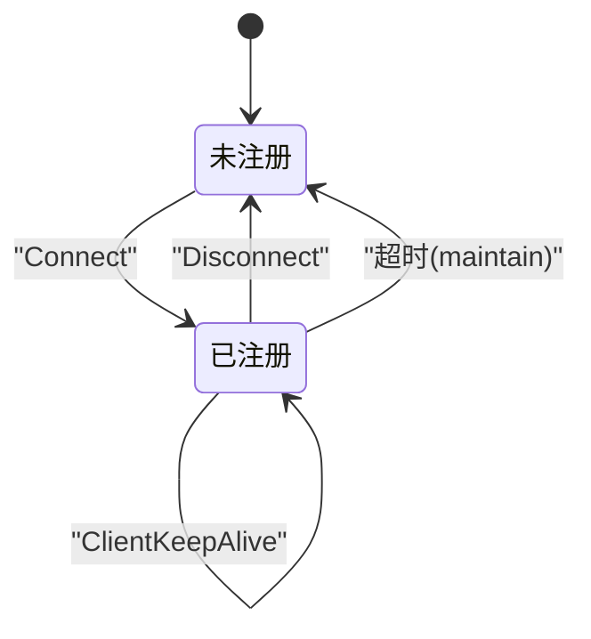
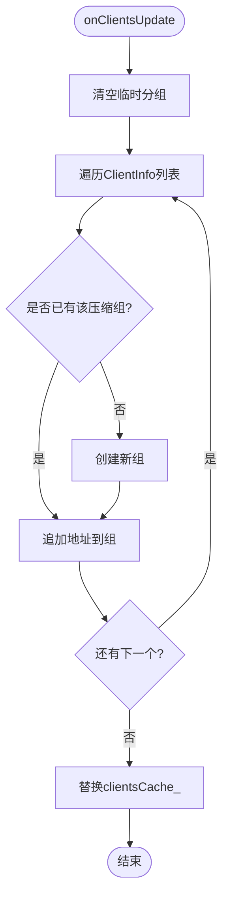
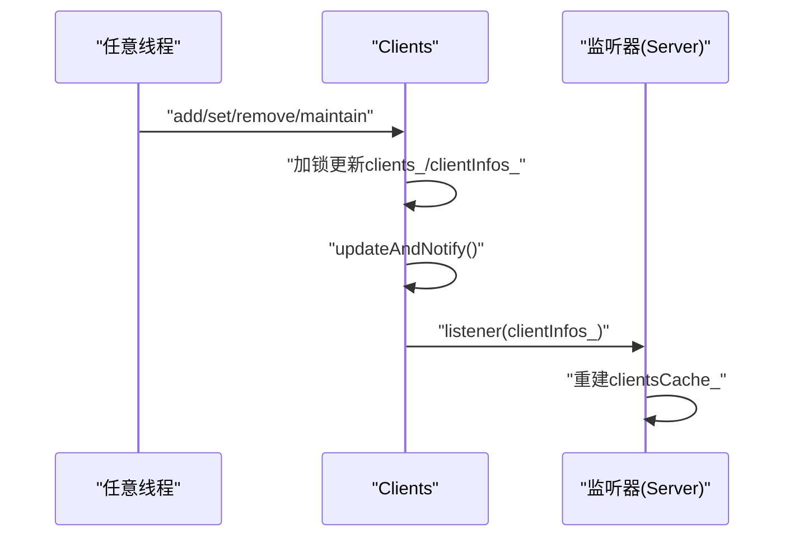
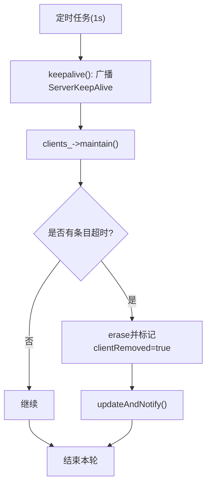
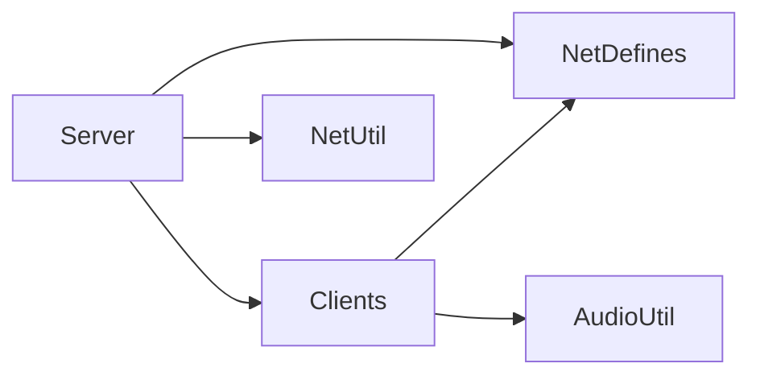

# 客户端管理

<cite>
**本文引用的文件**   
- [Clients.h](file://SoundRemote/Clients.h)
- [Clients.cpp](file://SoundRemote/Clients.cpp)
- [Server.h](file://SoundRemote/Server.h)
- [Server.cpp](file://SoundRemote/Server.cpp)
- [NetDefines.h](file://SoundRemote/NetDefines.h)
- [NetUtil.h](file://SoundRemote/NetUtil.h)
- [NetUtil.cpp](file://SoundRemote/NetUtil.cpp)
- [AudioUtil.h](file://SoundRemote/AudioUtil.h)
- [README.md](file://README.md)
</cite>

## 目录
1. [简介](#简介)
2. [项目结构](#项目结构)
3. [核心组件](#核心组件)
4. [架构总览](#架构总览)
5. [详细组件分析](#详细组件分析)
6. [依赖关系分析](#依赖关系分析)
7. [性能与内存特性](#性能与内存特性)
8. [故障排除指南](#故障排除指南)
9. [结论](#结论)
10. [附录：扩展与最佳实践](#附录扩展与最佳实践)

## 简介
本文件聚焦 SoundRemote-WinServer 的“客户端管理系统”，围绕多客户端连接管理机制展开，涵盖客户端注册、状态跟踪、连接池维护与内存管理；解释 ClientInfo 数据结构设计、地址映射与连接生命周期；文档化客户端发现机制、自动重连逻辑（由客户端侧实现）和连接超时处理；并说明线程安全、并发访问控制与观察者模式实现。最后提供监控、调试与排障建议，以及扩展客户端管理功能的方法。

## 项目结构
与客户端管理直接相关的核心代码位于以下文件：
- 客户端管理与状态：Clients.h / Clients.cpp
- 网络服务与协议处理：Server.h / Server.cpp
- 网络协议定义与编解码：NetDefines.h / NetUtil.h / NetUtil.cpp
- 音频压缩枚举：AudioUtil.h
- 项目背景：README.md

图表来源
- [Server.h:20-60](file://SoundRemote/Server.h#L20-L60)
- [Server.cpp:18-28](file://SoundRemote/Server.cpp#L18-L28)
- [Clients.h:15-52](file://SoundRemote/Clients.h#L15-L52)
- [Clients.cpp:1-125](file://SoundRemote/Clients.cpp#L1-L125)
- [NetDefines.h:7-69](file://SoundRemote/NetDefines.h#L7-L69)
- [NetUtil.h:11-41](file://SoundRemote/NetUtil.h#L11-L41)
- [NetUtil.cpp:129-169](file://SoundRemote/NetUtil.cpp#L129-L169)
- [AudioUtil.h:24-39](file://SoundRemote/AudioUtil.h#L24-L39)

章节来源
- [README.md:1-14](file://README.md#L1-L14)

## 核心组件
- Clients：维护已注册客户端集合、压缩格式、最后接触时间；提供添加、更新、保持、移除、批量清理、监听器订阅与定期维护能力。
- ClientInfo：对外暴露的轻量快照结构，包含客户端地址与压缩格式，用于观察者回调。
- Server：基于 Boost.Asio 的 UDP 服务端，负责接收客户端报文、解析协议、调用 Clients 进行状态管理，并按压缩格式缓存的地址列表广播音频数据与心跳。

章节来源
- [Clients.h:15-52](file://SoundRemote/Clients.h#L15-L52)
- [Clients.cpp:1-125](file://SoundRemote/Clients.cpp#L1-L125)
- [Server.h:20-60](file://SoundRemote/Server.h#L20-L60)
- [Server.cpp:18-28](file://SoundRemote/Server.cpp#L18-L28)

## 架构总览
整体流程：
- 客户端通过 UDP 向服务器发起 Connect/SetFormat/KeepAlive/Disconnect 等请求。
- Server 解析报文后，调用 Clients 完成注册、格式设置、心跳刷新或移除。
- Clients 内部维护客户端映射表，并在变更时通过观察者通知 Server。
- Server 根据压缩格式将客户端地址分组缓存，用于高效广播音频数据与心跳。

图表来源
- [Server.cpp:80-125](file://SoundRemote/Server.cpp#L80-L125)
- [Server.cpp:127-166](file://SoundRemote/Server.cpp#L127-L166)
- [Server.cpp:182-209](file://SoundRemote/Server.cpp#L182-L209)
- [Clients.cpp:5-35](file://SoundRemote/Clients.cpp#L5-L35)
- [Clients.cpp:64-80](file://SoundRemote/Clients.cpp#L64-L80)
- [Clients.cpp:82-98](file://SoundRemote/Clients.cpp#L82-L98)
- [Server.cpp:37-46](file://SoundRemote/Server.cpp#L37-L46)

## 详细组件分析

### 客户端信息模型与数据结构
- ClientInfo：仅包含地址与压缩格式，作为对外快照，避免外部直接持有内部对象引用。
- Clients::Client：内部封装每个客户端的最后接触时间与压缩格式，供超时判断与广播选择使用。
- Clients::clients_：以地址为键的哈希表，保存唯一 Client 实例，确保同一地址只存在一个活跃条目。
- Clients::clientInfos_：最近一次快照，用于快速通知观察者。
- Clients::clientsListeners_：观察者列表，采用 forward_list 提升插入/删除效率。

图表来源
- [Clients.h:15-52](file://SoundRemote/Clients.h#L15-L52)
- [Clients.h:54-59](file://SoundRemote/Clients.h#L54-L59)
- [Clients.cpp:100-125](file://SoundRemote/Clients.cpp#L100-L125)

章节来源
- [Clients.h:15-59](file://SoundRemote/Clients.h#L15-L59)
- [Clients.cpp:100-125](file://SoundRemote/Clients.cpp#L100-L125)

### 连接生命周期与状态机
- 连接建立：收到 Connect 包 -> add -> 返回 Ack。
- 格式协商：收到 SetFormat -> setCompression -> 返回 Ack。
- 心跳保活：收到 ClientKeepAlive -> keep -> 刷新 lastContact。
- 断开：收到 Disconnect -> remove。
- 超时清理：定时 maintain -> 超过 timeoutSeconds_ 的条目被移除。

图表来源
- [Server.cpp:127-141](file://SoundRemote/Server.cpp#L127-L141)
- [Server.cpp:143-153](file://SoundRemote/Server.cpp#L143-L153)
- [Server.cpp:164-166](file://SoundRemote/Server.cpp#L164-L166)
- [Clients.cpp:5-42](file://SoundRemote/Clients.cpp#L5-L42)
- [Clients.cpp:64-80](file://SoundRemote/Clients.cpp#L64-L80)

章节来源
- [Server.cpp:127-166](file://SoundRemote/Server.cpp#L127-L166)
- [Clients.cpp:5-42](file://SoundRemote/Clients.cpp#L5-L42)
- [Clients.cpp:64-80](file://SoundRemote/Clients.cpp#L64-L80)

### 地址映射与广播优化
- Server 在 onClientsUpdate 中按压缩格式对地址进行分组缓存，形成 clientsCache_。
- sendAudio 与 keepalive 均基于该缓存进行批量发送，避免重复遍历与查找。

图表来源
- [Server.cpp:37-46](file://SoundRemote/Server.cpp#L37-L46)

章节来源
- [Server.cpp:37-46](file://SoundRemote/Server.cpp#L37-L46)

### 观察者模式与并发安全
- 观察者：Clients 维护 listeners 列表，任何内部状态变化都会触发 updateAndNotify，进而调用所有 listener。
- 并发安全：
  - 共享互斥锁：clientsMutex_ 保护 clients_ 与 clientInfos_ 的读写。
  - 观察者列表不持锁：注释表明仅在程序启动或设备变更时修改，避免在高频路径加锁。
  - 读多写少场景下，可考虑将 clients_ 改为共享读写锁策略以提升并发读性能（当前实现使用独占锁）。

图表来源
- [Clients.cpp:5-17](file://SoundRemote/Clients.cpp#L5-L17)
- [Clients.cpp:82-98](file://SoundRemote/Clients.cpp#L82-L98)
- [Server.cpp:37-46](file://SoundRemote/Server.cpp#L37-L46)

章节来源
- [Clients.h:46-52](file://SoundRemote/Clients.h#L46-L52)
- [Clients.cpp:53-62](file://SoundRemote/Clients.cpp#L53-L62)
- [Clients.cpp:82-98](file://SoundRemote/Clients.cpp#L82-L98)
- [Server.cpp:37-46](file://SoundRemote/Server.cpp#L37-L46)

### 连接超时与心跳机制
- 客户端心跳：客户端周期性发送 ClientKeepAlive，Server 调用 keep 刷新 lastContact。
- 服务端心跳：Server 每秒发送 ServerKeepAlive，提醒客户端存活。
- 超时清理：maintain 每 1s 扫描，若 lastContact 距今超过 timeoutSeconds_，则移除该客户端并通知观察者。

图表来源
- [Server.cpp:182-209](file://SoundRemote/Server.cpp#L182-L209)
- [Clients.cpp:64-80](file://SoundRemote/Clients.cpp#L64-L80)
- [Clients.cpp:82-98](file://SoundRemote/Clients.cpp#L82-L98)

章节来源
- [Server.cpp:182-209](file://SoundRemote/Server.cpp#L182-L209)
- [Clients.cpp:64-80](file://SoundRemote/Clients.cpp#L64-L80)

### 自动重连与客户端发现
- 自动重连：由客户端侧实现（例如 Android 客户端），服务端无重连逻辑；服务端仅响应 Connect/SetFormat/KeepAlive/Disconnect。
- 客户端发现：服务端被动接收来自任意地址的连接请求，无需主动发现；可通过本地地址枚举辅助 UI 展示（NetUtil::getLocalAddresses）。

章节来源
- [NetUtil.h:11-16](file://SoundRemote/NetUtil.h#L11-L16)
- [NetUtil.cpp:78-108](file://SoundRemote/NetUtil.cpp#L78-L108)
- [Server.cpp:80-125](file://SoundRemote/Server.cpp#L80-L125)

### 协议与编解码要点
- 协议签名与类别：统一在 NetDefines.h 中定义，包括 Connect、Disconnect、SetFormat、Keystroke、AudioData*、KeepAlive、Ack 等。
- 编解码：NetUtil 提供 create/get 系列函数，负责组装/解析头部、数据区与校验。
- 压缩格式：网络值通过 compressionFromNetworkValue 转换为 Audio::Compression。

章节来源
- [NetDefines.h:7-69](file://SoundRemote/NetDefines.h#L7-L69)
- [NetUtil.cpp:129-169](file://SoundRemote/NetUtil.cpp#L129-L169)
- [NetUtil.cpp:110-127](file://SoundRemote/NetUtil.cpp#L110-L127)

## 依赖关系分析
- Server 依赖 Clients 进行状态管理，并通过观察者回调同步自身缓存。
- Clients 依赖 Net::Address 与 Audio::Compression，前者来自 Boost.Asio，后者来自 AudioUtil。
- 网络层依赖 NetDefines 与 NetUtil 提供的协议常量与编解码工具。

图表来源
- [Server.h:20-60](file://SoundRemote/Server.h#L20-L60)
- [Clients.h:15-52](file://SoundRemote/Clients.h#L15-L52)
- [NetDefines.h:7-69](file://SoundRemote/NetDefines.h#L7-L69)
- [NetUtil.h:11-41](file://SoundRemote/NetUtil.h#L11-L41)
- [AudioUtil.h:24-39](file://SoundRemote/AudioUtil.h#L24-L39)

章节来源
- [Server.h:20-60](file://SoundRemote/Server.h#L20-L60)
- [Clients.h:15-52](file://SoundRemote/Clients.h#L15-L52)
- [NetDefines.h:7-69](file://SoundRemote/NetDefines.h#L7-L69)
- [NetUtil.h:11-41](file://SoundRemote/NetUtil.h#L11-L41)
- [AudioUtil.h:24-39](file://SoundRemote/AudioUtil.h#L24-L39)

## 性能与内存特性
- 内存管理
  - 使用 std::unique_ptr<Client> 管理单个客户端资源，离开作用域自动释放。
  - 发送路径使用 std::shared_ptr<std::vector<char>> 传递数据包，确保异步回调期间数据有效。
- 并发与锁
  - Clients 内部使用独占锁保护关键区域，保证多线程安全。
  - 观察者列表不加锁，减少临界区长度，但要求调用方在注册/注销时串行化。
- 广播优化
  - 按压缩格式分组缓存地址，避免每次广播都遍历全量客户端。
- 复杂度
  - add/remove/keep：平均 O(1)。
  - maintain：O(N)，N 为当前客户端数。
  - onClientsUpdate：O(M)，M 为客户端总数（分组构建）。

[本节为通用性能讨论，不直接分析具体文件]

## 故障排除指南
- 常见问题定位
  - 客户端无法注册：检查 Connect 包是否携带有效压缩值；确认服务端端口与防火墙规则。
  - 频繁掉线：核对客户端 KeepAlive 频率与服务端 timeoutSeconds_ 配置；观察 maintain 日志。
  - 音频未到达：确认客户端 SetFormat 成功且服务端已更新分组缓存；检查 sendAudio 调用路径。
- 错误处理
  - 接收异常：receive 捕获系统错误与未知异常，记录错误文本并退出进程。
  - 发送异常：handleSend 在出现错误码时抛出运行时异常。
  - 定时器异常：maintain 忽略 operation_aborted，其他错误抛出异常。
- 调试建议
  - 在 onClientsUpdate 中打印客户端数量与压缩分布，验证缓存一致性。
  - 在 processKeepAlive 与 maintain 前后输出时间戳，评估心跳与清理节奏。
  - 使用抓包工具验证协议字段（签名、类别、大小、序列号等）。

章节来源
- [Server.cpp:111-124](file://SoundRemote/Server.cpp#L111-L124)
- [Server.cpp:176-180](file://SoundRemote/Server.cpp#L176-L180)
- [Server.cpp:187-199](file://SoundRemote/Server.cpp#L187-L199)

## 结论
客户端管理系统以简洁的数据结构与清晰的职责划分实现了高内聚、低耦合的多客户端管理：
- Clients 专注状态与生命周期，Server 专注网络与调度。
- 通过观察者模式解耦状态变更与广播缓存更新。
- 基于压缩格式的分组缓存显著提升了广播效率。
- 心跳与超时机制保障连接健康度。

[本节为总结性内容，不直接分析具体文件]

## 附录：扩展与最佳实践
- 扩展点
  - 新增客户端属性：在 ClientInfo 与 Client 中扩展字段，并在 updateInfos 中传播。
  - 新增消息类型：在 NetDefines 增加 Category，在 NetUtil 增加编解码函数，在 Server 的 receive 分支处理。
  - 更细粒度统计：在 Clients 中添加计数器与指标导出接口，便于监控。
- 并发改进
  - 将 clients_ 的读取路径改为共享锁，降低写操作对读的影响。
  - 对 listeners 列表加锁或使用无锁容器，避免极端情况下竞态。
- 健壮性增强
  - 在 onClientsUpdate 中对无效压缩值做防御性过滤。
  - 在 sendDisconnectBlocking 中增加重试与失败计数。
- 测试建议
  - 覆盖并发 add/remove/setCompression 场景，验证观察者调用次数与最终一致性。
  - 模拟网络丢包与乱序，验证超时清理与重连行为。

[本节为概念性指导，不直接分析具体文件]