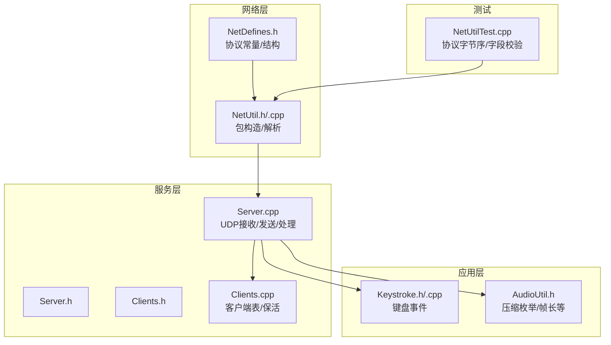
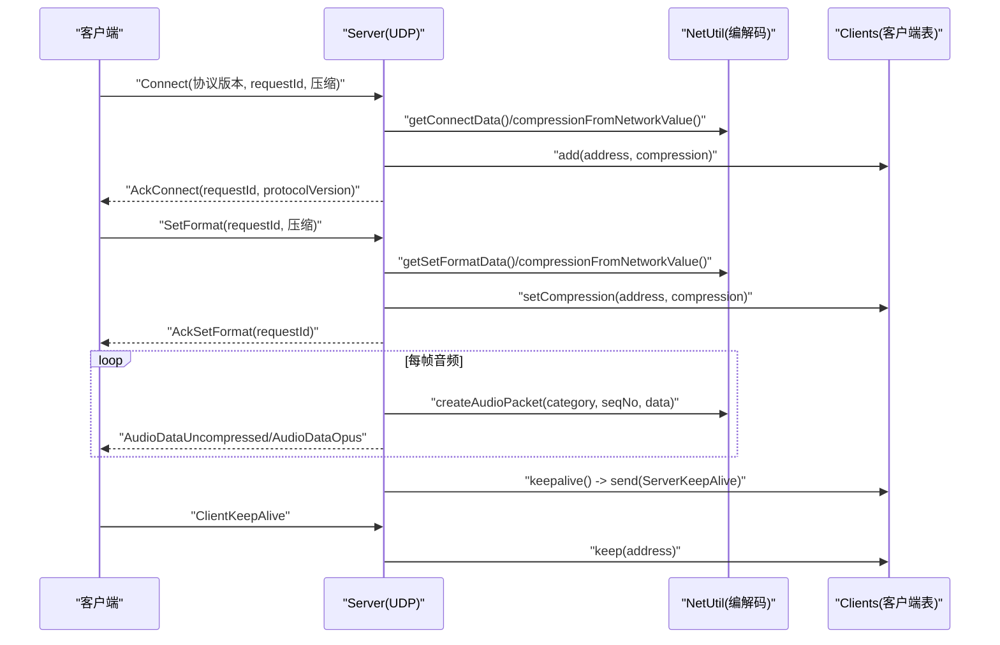
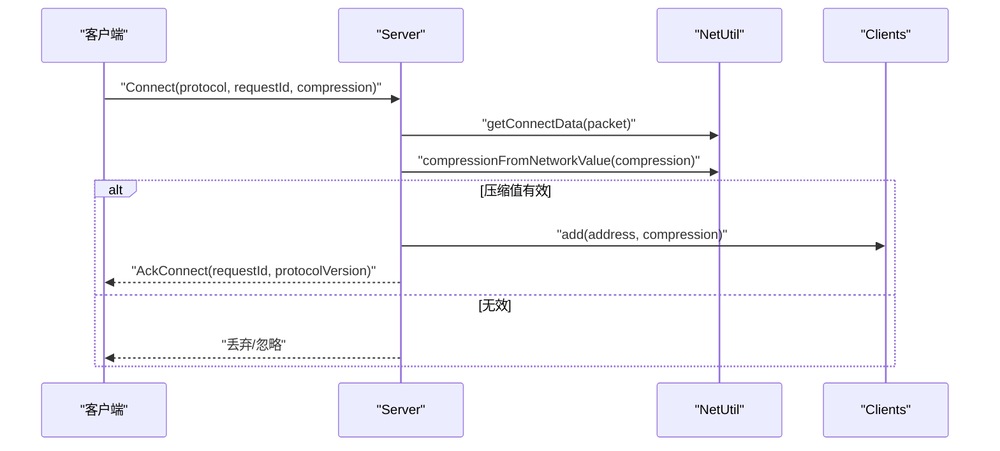
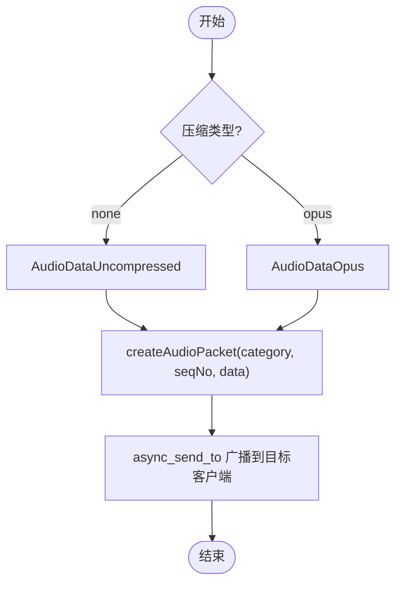
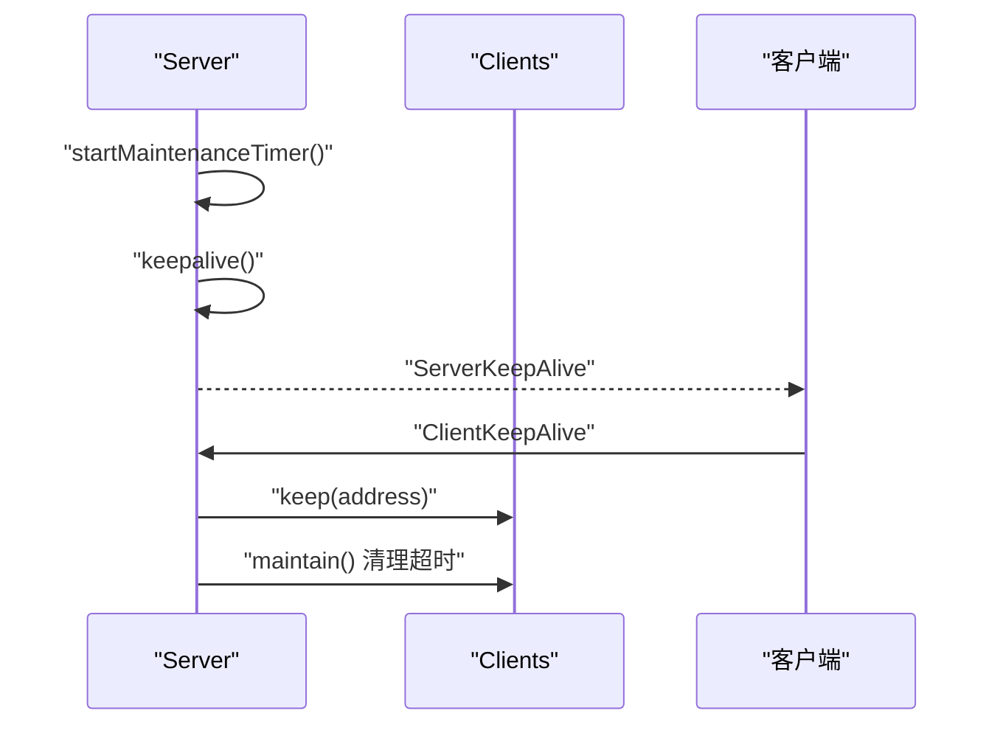
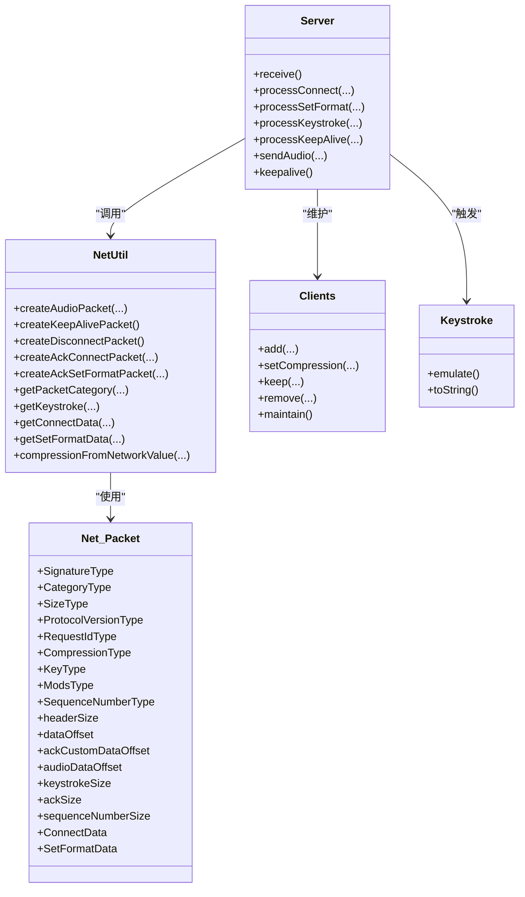

# 网络协议

<cite>
**本文引用的文件**   
- [NetDefines.h](file://SoundRemote/NetDefines.h)
- [NetUtil.cpp](file://SoundRemote/NetUtil.cpp)
- [NetUtil.h](file://SoundRemote/NetUtil.h)
- [Server.cpp](file://SoundRemote/Server.cpp)
- [Server.h](file://SoundRemote/Server.h)
- [Clients.cpp](file://SoundRemote/Clients.cpp)
- [Clients.h](file://SoundRemote/Clients.h)
- [Keystroke.cpp](file://SoundRemote/Keystroke.cpp)
- [Keystroke.h](file://SoundRemote/Keystroke.h)
- [AudioUtil.h](file://SoundRemote/AudioUtil.h)
- [NetUtilTest.cpp](file://Tests/NetUtilTest.cpp)
</cite>

## 目录
1. [简介](#简介)
2. [项目结构](#项目结构)
3. [核心组件](#核心组件)
4. [架构总览](#架构总览)
5. [详细组件分析](#详细组件分析)
6. [依赖关系分析](#依赖关系分析)
7. [性能考虑](#性能考虑)
8. [故障排查指南](#故障排查指南)
9. [结论](#结论)
10. [附录](#附录)

## 简介
本规范文档面向 SoundRemote-WinServer 的 UDP 网络通信协议，覆盖以下方面：
- 数据包格式、消息类型枚举与协议版本控制
- 连接建立流程、音频数据传输、键盘事件传输与心跳检测机制
- Net::Packet 结构体定义、序列号管理与数据压缩选项
- 地址解析、端口协商与错误码约定
- 安全性考虑、数据验证规则与兼容性处理
- 协议测试方法、调试工具与性能分析指南
- 扩展新消息类型与实现协议版本迁移的方法

## 项目结构
与网络协议直接相关的核心代码位于 SoundRemote 目录下，主要包含：
- 协议常量与数据结构：NetDefines.h
- 编解码与包构造：NetUtil.h/.cpp
- 服务端逻辑与异步收发：Server.h/.cpp
- 客户端列表与保活管理：Clients.h/.cpp
- 键盘事件封装与模拟：Keystroke.h/.cpp
- 音频相关常量与压缩枚举：AudioUtil.h
- 单元测试用例（用于验证协议字节序与字段布局）：Tests/NetUtilTest.cpp

图表来源
- [NetDefines.h:1-69](file://SoundRemote/NetDefines.h#L1-L69)
- [NetUtil.cpp:1-218](file://SoundRemote/NetUtil.cpp#L1-L218)
- [Server.cpp:1-210](file://SoundRemote/Server.cpp#L1-L210)
- [Clients.cpp:1-125](file://SoundRemote/Clients.cpp#L1-L125)
- [Keystroke.cpp:1-153](file://SoundRemote/Keystroke.cpp#L1-L153)
- [AudioUtil.h:1-170](file://SoundRemote/AudioUtil.h#L1-L170)
- [NetUtilTest.cpp:1-133](file://Tests/NetUtilTest.cpp#L1-L133)

章节来源
- [NetDefines.h:1-69](file://SoundRemote/NetDefines.h#L1-L69)
- [NetUtil.h:1-41](file://SoundRemote/NetUtil.h#L1-L41)
- [NetUtil.cpp:1-218](file://SoundRemote/NetUtil.cpp#L1-L218)
- [Server.h:1-61](file://SoundRemote/Server.h#L1-L61)
- [Server.cpp:1-210](file://SoundRemote/Server.cpp#L1-L210)
- [Clients.h:1-60](file://SoundRemote/Clients.h#L1-L60)
- [Clients.cpp:1-125](file://SoundRemote/Clients.cpp#L1-L125)
- [Keystroke.h:1-41](file://SoundRemote/Keystroke.h#L1-L41)
- [Keystroke.cpp:1-153](file://SoundRemote/Keystroke.cpp#L1-L153)
- [AudioUtil.h:1-170](file://SoundRemote/AudioUtil.h#L1-L170)
- [NetUtilTest.cpp:1-133](file://Tests/NetUtilTest.cpp#L1-L133)

## 核心组件
- 协议常量与包结构：定义在 NetDefines.h，包括签名、类别、长度、偏移、各消息体大小、默认端口、协议版本号等。
- 包构造与解析：NetUtil.h/.cpp 提供 create* 系列函数与 get* 系列函数，负责按大端序写入/读取头部与数据域。
- 服务端：Server.h/.cpp 基于 Boost.Asio 协程进行 UDP 接收分发，维护客户端列表并广播音频。
- 客户端表：Clients.h/.cpp 维护活跃客户端集合、压缩配置与超时清理，并通过回调通知更新。
- 键盘事件：Keystroke.h/.cpp 将网络键值与修饰键映射为 Windows 输入事件。
- 音频参数：AudioUtil.h 定义压缩等级、Opus 帧长与最大包尺寸等。

章节来源
- [NetDefines.h:1-69](file://SoundRemote/NetDefines.h#L1-L69)
- [NetUtil.h:1-41](file://SoundRemote/NetUtil.h#L1-L41)
- [NetUtil.cpp:1-218](file://SoundRemote/NetUtil.cpp#L1-L218)
- [Server.h:1-61](file://SoundRemote/Server.h#L1-L61)
- [Server.cpp:1-210](file://SoundRemote/Server.cpp#L1-L210)
- [Clients.h:1-60](file://SoundRemote/Clients.h#L1-L60)
- [Clients.cpp:1-125](file://SoundRemote/Clients.cpp#L1-L125)
- [Keystroke.h:1-41](file://SoundRemote/Keystroke.h#L1-L41)
- [Keystroke.cpp:1-153](file://SoundRemote/Keystroke.cpp#L1-L153)
- [AudioUtil.h:1-170](file://SoundRemote/AudioUtil.h#L1-L170)

## 架构总览
整体采用“服务器监听 + 客户端主动发起”的 UDP 模式：
- 客户端向服务器指定端口发送 Connect/SetFormat/Keystroke/ClientKeepAlive 等消息
- 服务器回复 AckConnect/AckSetFormat/ServerKeepAlive/Disconnect 等消息
- 音频流由服务器按压缩方式选择不同类别的消息推送给所有已注册客户端

图表来源
- [Server.cpp:80-125](file://SoundRemote/Server.cpp#L80-L125)
- [Server.cpp:127-166](file://SoundRemote/Server.cpp#L127-L166)
- [Server.cpp:201-209](file://SoundRemote/Server.cpp#L201-L209)
- [NetUtil.cpp:129-169](file://SoundRemote/NetUtil.cpp#L129-L169)
- [NetUtil.cpp:193-217](file://SoundRemote/NetUtil.cpp#L193-L217)
- [Clients.cpp:5-27](file://SoundRemote/Clients.cpp#L5-L27)

## 详细组件分析

### 协议常量与包结构（Net::Packet）
- 固定头部
  - 签名：2 字节，固定值，用于快速识别协议
  - 类别：1 字节，标识消息类型
  - 长度：2 字节，表示整个包的长度（含头部）
- 数据区
  - 通用字段：协议版本、请求 ID、压缩类型、按键、修饰键、序列号等
  - 特定消息体：ConnectData、SetFormatData、Ack 自定义数据、音频数据等
- 关键偏移与大小
  - headerSize、dataOffset、ackCustomDataOffset、audioDataOffset、keystrokeSize、ackSize、sequenceNumberSize 等常量定义了各字段的布局
- 协议版本
  - 全局常量 protocolVersion 用于握手确认
- 默认端口
  - defaultServerPort、defaultClientPort 作为默认监听/源端口参考

章节来源
- [NetDefines.h:1-69](file://SoundRemote/NetDefines.h#L1-L69)

### 消息类型与用途
- Error：非法或无法处理的包
- Connect：客户端发起连接，携带协议版本、请求 ID、压缩能力
- Disconnect：客户端断开连接
- SetFormat：客户端设置音频格式/压缩
- Keystroke：键盘事件（键码 + 修饰键位图）
- AudioDataUncompressed：未压缩音频帧
- AudioDataOpus：Opus 编码音频帧
- ClientKeepAlive / ServerKeepAlive：双向心跳
- Ack：应答包，包含请求 ID 与可选自定义数据（如协议版本）

章节来源
- [NetDefines.h:47-58](file://SoundRemote/NetDefines.h#L47-L58)

### 数据包格式与字节序
- 字节序：全部使用大端序（网络序），通过 writeUInt16B/writeUInt32B 等写入
- 头部布局
  - 偏移 0：签名（2B）
  - 偏移 2：类别（1B）
  - 偏移 3：长度（2B）
- 数据区布局（示例）
  - 音频类：紧随头部的是 4B 序列号，其后是音频载荷
  - Ack 类：紧随头部的是 2B 请求 ID，其后是 4B 自定义数据（例如协议版本）
  - 键盘类：紧随头部的是 1B 键码 + 1B 修饰键位图
- 长度校验
  - 解析前检查包长度是否满足最小要求，否则返回错误类别

章节来源
- [NetUtil.cpp:67-71](file://SoundRemote/NetUtil.cpp#L67-L71)
- [NetUtil.cpp:171-180](file://SoundRemote/NetUtil.cpp#L171-L180)
- [NetUtil.cpp:129-140](file://SoundRemote/NetUtil.cpp#L129-L140)
- [NetUtil.cpp:154-169](file://SoundRemote/NetUtil.cpp#L154-L169)
- [NetUtil.cpp:182-191](file://SoundRemote/NetUtil.cpp#L182-L191)

### 连接建立流程
- 客户端发送 Connect：包含协议版本、请求 ID、压缩能力
- 服务器解析 ConnectData，校验压缩值，登记客户端并记录压缩配置
- 服务器回复 AckConnect：包含请求 ID 与协议版本
- 后续可通过 SetFormat 动态调整压缩

图表来源
- [Server.cpp:127-137](file://SoundRemote/Server.cpp#L127-L137)
- [NetUtil.cpp:193-205](file://SoundRemote/NetUtil.cpp#L193-L205)
- [NetUtil.cpp:110-127](file://SoundRemote/NetUtil.cpp#L110-L127)

章节来源
- [Server.cpp:127-137](file://SoundRemote/Server.cpp#L127-L137)
- [NetUtil.cpp:193-205](file://SoundRemote/NetUtil.cpp#L193-L205)
- [NetUtil.cpp:110-127](file://SoundRemote/NetUtil.cpp#L110-L127)

### 音频数据传输协议
- 类别选择
  - 未压缩：AudioDataUncompressed
  - Opus 压缩：AudioDataOpus
- 负载结构
  - 头部后紧跟 4B 大端序列号，随后是音频载荷
- 序列号
  - 单调递增的 32 位无符号整数，便于丢包统计与乱序检测
- 压缩映射
  - 网络侧 CompressionType 到内部 Audio::Compression 的映射由 compressionFromNetworkValue 完成
- 发送路径
  - Server::sendAudio 根据压缩类型选择类别，调用 Net::createAudioPacket 生成包，再广播至对应压缩组的所有客户端

图表来源
- [Server.cpp:48-62](file://SoundRemote/Server.cpp#L48-L62)
- [NetUtil.cpp:129-140](file://SoundRemote/NetUtil.cpp#L129-L140)

章节来源
- [Server.cpp:48-62](file://SoundRemote/Server.cpp#L48-L62)
- [NetUtil.cpp:129-140](file://SoundRemote/NetUtil.cpp#L129-L140)
- [AudioUtil.h:27-39](file://SoundRemote/AudioUtil.h#L27-L39)

### 键盘事件传输格式
- 类别：Keystroke
- 负载：1B 键码 + 1B 修饰键位图（Win/Ctrl/Shift/Alt）
- 解析：getKeystroke 返回 Keystroke 对象，服务器可调用 emulate 模拟本地输入
- 注意：仅支持标准修饰键组合，键码范围需符合平台虚拟键码约定

章节来源
- [NetDefines.h:17-18](file://SoundRemote/NetDefines.h#L17-L18)
- [NetUtil.cpp:182-191](file://SoundRemote/NetUtil.cpp#L182-L191)
- [Keystroke.h:23-34](file://SoundRemote/Keystroke.h#L23-L34)
- [Keystroke.cpp:20-52](file://SoundRemote/Keystroke.cpp#L20-L52)

### 心跳检测机制
- 服务器侧
  - 定时任务 keepalive 周期性地发送 ServerKeepAlive 给所有已知客户端
- 客户端侧
  - 定期发送 ClientKeepAlive 以刷新服务器侧最后接触时间
- 超时清理
  - Clients::maintain 依据超时阈值移除长时间无心跳的客户端

图表来源
- [Server.cpp:182-199](file://SoundRemote/Server.cpp#L182-L199)
- [Server.cpp:201-209](file://SoundRemote/Server.cpp#L201-L209)
- [Clients.cpp:64-80](file://SoundRemote/Clients.cpp#L64-L80)

章节来源
- [Server.cpp:182-209](file://SoundRemote/Server.cpp#L182-L209)
- [Clients.cpp:64-80](file://SoundRemote/Clients.cpp#L64-L80)

### 地址解析与端口协商
- 地址解析
  - getLocalAddresses 获取本机 IPv4 地址列表（Windows API）
- 端口
  - defaultServerPort/defaultClientPort 为默认端口；实际运行时通过构造函数传入 clientPort/serverPort
- 协商
  - 连接阶段通过 Connect 中的协议版本与压缩能力进行协商，服务器回显协议版本于 AckConnect

章节来源
- [NetUtil.cpp:78-108](file://SoundRemote/NetUtil.cpp#L78-L108)
- [NetDefines.h:64-65](file://SoundRemote/NetDefines.h#L64-L65)
- [Server.cpp:18-28](file://SoundRemote/Server.cpp#L18-L28)
- [NetUtil.cpp:154-161](file://SoundRemote/NetUtil.cpp#L154-L161)

### 错误码与异常处理
- 协议层
  - 当包长度不足或签名不匹配时，解析返回 Error 类别
- 系统层
  - 接收循环捕获 boost::system::system_error 与 std::exception，显示错误并退出进程
  - 定时器回调对 operation_aborted 做特殊处理，其他错误抛出运行时异常
- 发送回调
  - handleSend 中若出现错误则抛出运行时异常

章节来源
- [NetUtil.cpp:171-180](file://SoundRemote/NetUtil.cpp#L171-L180)
- [Server.cpp:111-124](file://SoundRemote/Server.cpp#L111-L124)
- [Server.cpp:176-180](file://SoundRemote/Server.cpp#L176-L180)
- [Server.cpp:187-194](file://SoundRemote/Server.cpp#L187-L194)

### 数据验证规则与兼容性
- 长度校验：所有解析函数在进入前均检查包长度是否满足最小需求
- 签名校验：getPacketCategory 会校验协议签名
- 压缩值校验：compressionFromNetworkValue 仅接受已知映射，未知值返回空
- 版本兼容：AckConnect 回显协议版本，客户端应据此决定是否继续会话

章节来源
- [NetUtil.cpp:171-180](file://SoundRemote/NetUtil.cpp#L171-L180)
- [NetUtil.cpp:110-127](file://SoundRemote/NetUtil.cpp#L110-L127)
- [NetUtil.cpp:154-161](file://SoundRemote/NetUtil.cpp#L154-L161)

### 安全性考虑
- 当前协议未包含加密与认证机制，建议在网络边界部署安全网关或隧道
- 建议增加来源白名单与速率限制，防止滥用
- 对任意外部输入均应进行严格长度与范围校验（已在解析层实现基础校验）

[本节为通用安全建议，不直接分析具体文件]

## 依赖关系分析

图表来源
- [NetDefines.h:1-69](file://SoundRemote/NetDefines.h#L1-L69)
- [NetUtil.h:1-41](file://SoundRemote/NetUtil.h#L1-L41)
- [NetUtil.cpp:129-169](file://SoundRemote/NetUtil.cpp#L129-L169)
- [Server.h:1-61](file://SoundRemote/Server.h#L1-L61)
- [Server.cpp:48-62](file://SoundRemote/Server.cpp#L48-L62)
- [Clients.h:1-60](file://SoundRemote/Clients.h#L1-L60)
- [Keystroke.h:1-41](file://SoundRemote/Keystroke.h#L1-L41)

章节来源
- [NetDefines.h:1-69](file://SoundRemote/NetDefines.h#L1-L69)
- [NetUtil.h:1-41](file://SoundRemote/NetUtil.h#L1-L41)
- [NetUtil.cpp:129-169](file://SoundRemote/NetUtil.cpp#L129-L169)
- [Server.h:1-61](file://SoundRemote/Server.h#L1-L61)
- [Server.cpp:48-62](file://SoundRemote/Server.cpp#L48-L62)
- [Clients.h:1-60](file://SoundRemote/Clients.h#L1-L60)
- [Keystroke.h:1-41](file://SoundRemote/Keystroke.h#L1-L41)

## 性能考虑
- 包大小与帧长
  - Opus 最大包尺寸由压缩率与帧长决定，避免超过 MTU 导致分片
- 并发与异步
  - 使用协程与异步 IO 提升吞吐，减少线程切换开销
- 批量发送
  - 相同压缩类型的客户端缓存地址列表，减少重复构建与查找
- 内存分配
  - 复用缓冲与共享指针降低频繁分配带来的抖动

[本节为通用性能建议，不直接分析具体文件]

## 故障排查指南
- 常见症状
  - 无法建立连接：检查 Connect 包长度、签名与压缩值映射
  - 音频无声：核对类别是否为 Uncompressed/Opus，序列号是否连续，压缩映射是否正确
  - 客户端掉线：检查心跳间隔与超时阈值
- 定位步骤
  - 使用抓包工具验证头部签名、类别与长度
  - 对照单元测试期望字节序，确认大端序一致性
  - 查看服务器日志与异常输出，关注 receive/maintain/send 的错误分支

章节来源
- [NetUtilTest.cpp:30-68](file://Tests/NetUtilTest.cpp#L30-L68)
- [NetUtilTest.cpp:98-120](file://Tests/NetUtilTest.cpp#L98-L120)
- [Server.cpp:111-124](file://SoundRemote/Server.cpp#L111-L124)
- [Server.cpp:176-180](file://SoundRemote/Server.cpp#L176-L180)

## 结论
本规范明确了 SoundRemote-WinServer 的 UDP 协议细节，涵盖包格式、消息类型、连接与音频传输流程、心跳与超时、错误处理与兼容性策略。通过严格的长度与签名校验、明确的字节序与大端序约定，以及可扩展的压缩映射，协议具备良好的健壮性与演进空间。

[本节为总结性内容，不直接分析具体文件]

## 附录

### 协议版本与迁移
- 当前版本：protocolVersion = 1
- 迁移建议
  - 新增字段时保持向后兼容，旧客户端忽略未知字段
  - 变更字段顺序时需升级版本号并在 AckConnect 中回显新版本
  - 废弃字段保留占位以避免破坏对齐

章节来源
- [NetDefines.h:60](file://SoundRemote/NetDefines.h#L60)
- [NetUtil.cpp:154-161](file://SoundRemote/NetUtil.cpp#L154-L161)

### 扩展新消息类型
- 步骤
  - 在 Category 枚举中新增类别值
  - 在 NetDefines.h 中定义数据体结构与大小/偏移
  - 在 NetUtil.cpp 中实现 createXxxPacket/getXxxData 函数
  - 在 Server.cpp 的 receive 分发处添加处理分支
- 注意事项
  - 确保长度校验与字节序一致
  - 如需请求-应答，引入 RequestId 并在 Ack 中回显

章节来源
- [NetDefines.h:47-58](file://SoundRemote/NetDefines.h#L47-L58)
- [NetUtil.cpp:171-180](file://SoundRemote/NetUtil.cpp#L171-L180)
- [Server.cpp:80-125](file://SoundRemote/Server.cpp#L80-L125)

### 测试方法与调试工具
- 单元测试
  - 验证音频包、心跳包、断开包、ACK 包的字节序与字段布局
- 抓包验证
  - 使用 Wireshark 等工具抓取 UDP 流量，校验签名、类别与长度
- 压力测试
  - 多客户端并发连接与高频心跳，观察服务器资源占用与丢包情况

章节来源
- [NetUtilTest.cpp:30-68](file://Tests/NetUtilTest.cpp#L30-L68)
- [NetUtilTest.cpp:98-120](file://Tests/NetUtilTest.cpp#L98-L120)