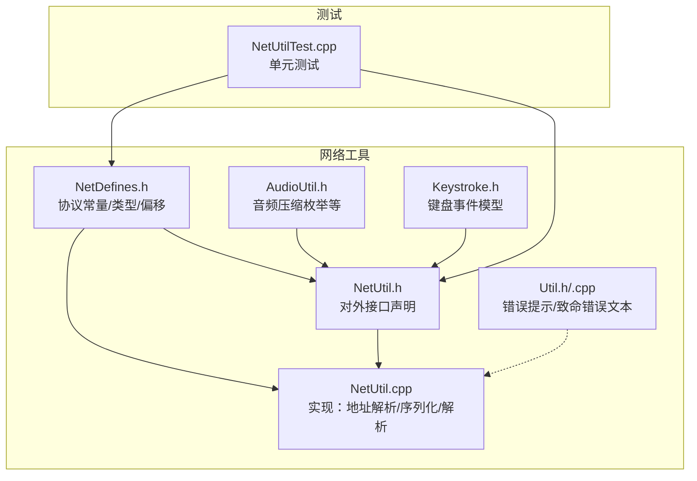
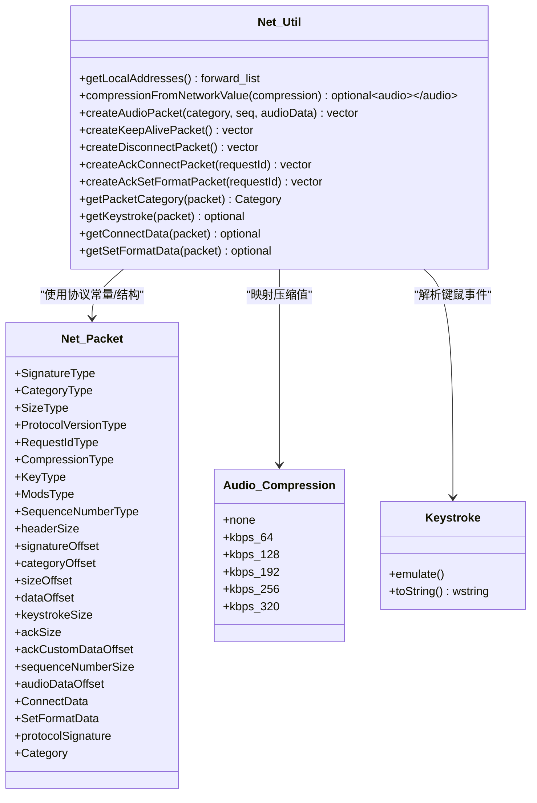
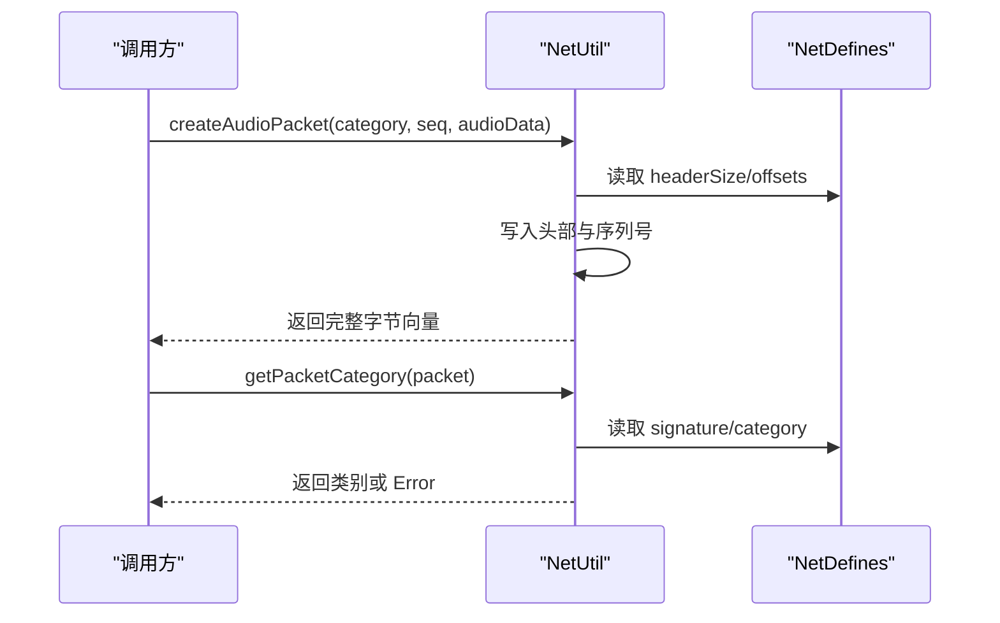
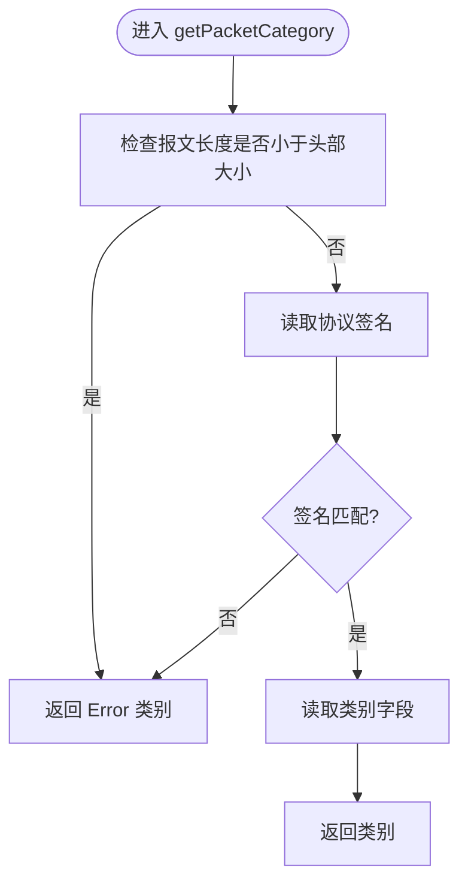
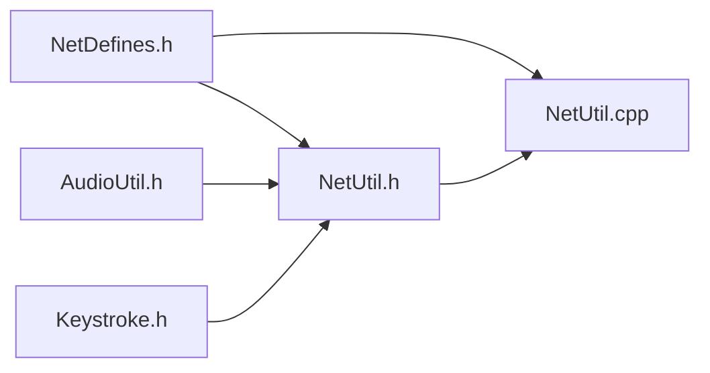

# 网络工具

<cite>
**本文引用的文件**
- [NetUtil.h](file://SoundRemote/NetUtil.h)
- [NetUtil.cpp](file://SoundRemote/NetUtil.cpp)
- [NetDefines.h](file://SoundRemote/NetDefines.h)
- [AudioUtil.h](file://SoundRemote/AudioUtil.h)
- [Keystroke.h](file://SoundRemote/Keystroke.h)
- [Util.h](file://SoundRemote/Util.h)
- [Util.cpp](file://SoundRemote/Util.cpp)
- [NetUtilTest.cpp](file://Tests/NetUtilTest.cpp)
</cite>

## 目录
1. [简介](#简介)
2. [项目结构](#项目结构)
3. [核心组件](#核心组件)
4. [架构总览](#架构总览)
5. [详细组件分析](#详细组件分析)
6. [依赖关系分析](#依赖关系分析)
7. [性能与监控](#性能与监控)
8. [故障排查指南](#故障排查指南)
9. [结论](#结论)
10. [附录：复用与集成示例](#附录复用与集成示例)

## 简介
本文件为 SoundRemote-WinServer 的网络工具函数库提供系统化文档，覆盖以下能力：
- 网络地址解析：获取本机 IPv4 地址列表
- 字符串与数据序列化：协议头/负载的读写、音频包构造与解析、控制类包（心跳、断开、确认）构造
- 压缩值转换：将网络协议中的压缩标识映射到音频压缩枚举
- 错误处理与调试辅助：基于通用工具的错误提示与致命错误文本生成
- 网络配置常量：默认端口、协议签名、数据包结构与偏移定义
- 使用与复用：在自定义模块中如何调用这些工具函数

注意：当前仓库未包含网络延迟测量、带宽统计或专用日志记录实现。相关章节给出概念性建议与集成方式，但不直接对应具体源码。

## 项目结构
与网络工具相关的核心文件位于 SoundRemote 目录下，测试用例位于 Tests 目录。

图表来源
- [NetDefines.h:1-69](file://SoundRemote/NetDefines.h#L1-L69)
- [NetUtil.h:1-41](file://SoundRemote/NetUtil.h#L1-L41)
- [NetUtil.cpp:1-218](file://SoundRemote/NetUtil.cpp#L1-L218)
- [AudioUtil.h:1-170](file://SoundRemote/AudioUtil.h#L1-L170)
- [Keystroke.h:1-41](file://SoundRemote/Keystroke.h#L1-L41)
- [Util.h:1-70](file://SoundRemote/Util.h#L1-L70)
- [Util.cpp:1-69](file://SoundRemote/Util.cpp#L1-L69)
- [NetUtilTest.cpp:1-133](file://Tests/NetUtilTest.cpp#L1-L133)

章节来源
- [NetDefines.h:1-69](file://SoundRemote/NetDefines.h#L1-L69)
- [NetUtil.h:1-41](file://SoundRemote/NetUtil.h#L1-L41)
- [NetUtil.cpp:1-218](file://SoundRemote/NetUtil.cpp#L1-L218)
- [AudioUtil.h:1-170](file://SoundRemote/AudioUtil.h#L1-L170)
- [Keystroke.h:1-41](file://SoundRemote/Keystroke.h#L1-L41)
- [Util.h:1-70](file://SoundRemote/Util.h#L1-L70)
- [Util.cpp:1-69](file://SoundRemote/Util.cpp#L1-L69)
- [NetUtilTest.cpp:1-133](file://Tests/NetUtilTest.cpp#L1-L133)

## 核心组件
- 协议常量与数据结构（NetDefines.h）
  - 定义协议签名、类别枚举、字段大小与偏移、连接/格式设置载荷结构、默认端口等
- 网络工具接口（NetUtil.h）
  - 本地 IPv4 地址获取
  - 压缩值转换
  - 各类包的创建与解析
- 网络工具实现（NetUtil.cpp）
  - 字节序读写辅助
  - 头部写入与校验
  - 各功能函数的具体实现
- 音频压缩枚举（AudioUtil.h）
  - 用于将网络压缩值映射到的目标枚举
- 键盘事件模型（Keystroke.h）
  - 作为解析结果返回的类型之一
- 通用错误与提示（Util.h/.cpp）
  - 错误消息框、致命错误文本生成

章节来源
- [NetDefines.h:1-69](file://SoundRemote/NetDefines.h#L1-L69)
- [NetUtil.h:1-41](file://SoundRemote/NetUtil.h#L1-L41)
- [NetUtil.cpp:1-218](file://SoundRemote/NetUtil.cpp#L1-L218)
- [AudioUtil.h:1-170](file://SoundRemote/AudioUtil.h#L1-L170)
- [Keystroke.h:1-41](file://SoundRemote/Keystroke.h#L1-L41)
- [Util.h:1-70](file://SoundRemote/Util.h#L1-L70)
- [Util.cpp:1-69](file://SoundRemote/Util.cpp#L1-L69)

## 架构总览
下图展示了网络工具的核心职责与交互关系：外部模块通过 NetUtil 提供的 API 完成地址解析、包构造与解析；底层依赖 Windows 网络 API 与系统类型；同时与音频和键盘模块进行类型桥接。

图表来源
- [NetDefines.h:1-69](file://SoundRemote/NetDefines.h#L1-L69)
- [NetUtil.h:1-41](file://SoundRemote/NetUtil.h#L1-L41)
- [NetUtil.cpp:1-218](file://SoundRemote/NetUtil.cpp#L1-L218)
- [AudioUtil.h:1-170](file://SoundRemote/AudioUtil.h#L1-L170)
- [Keystroke.h:1-41](file://SoundRemote/Keystroke.h#L1-L41)

## 详细组件分析

### 协议常量与数据结构（NetDefines.h）
- 协议签名与版本
  - 固定签名用于快速校验报文合法性
  - 全局协议版本号用于握手确认
- 头部与偏移
  - 统一头部由签名、类别、长度组成
  - 数据区起始偏移固定，便于解析器定位
- 数据包类别
  - 涵盖连接、断开、设置格式、按键、音频数据（无损/Opus）、心跳、确认等
- 载荷结构
  - ConnectData/SetFormatData 明确字段布局与大小，便于跨端一致解析
- 默认端口
  - 服务器与客户端默认端口常量

章节来源
- [NetDefines.h:1-69](file://SoundRemote/NetDefines.h#L1-L69)

### 本地 IPv4 地址解析（NetUtil::getLocalAddresses）
- 功能
  - 获取本机所有 IPv4 地址的字符串表示
- 关键点
  - 使用系统 API 获取地址表并遍历
  - 失败时返回空列表
- 复杂度
  - O(n)，n 为网卡条目数
- 适用场景
  - 自动选择监听地址、诊断界面展示

章节来源
- [NetUtil.cpp:78-108](file://SoundRemote/NetUtil.cpp#L78-L108)

### 压缩值转换（NetUtil::compressionFromNetworkValue）
- 功能
  - 将网络协议中的压缩标识映射到音频压缩枚举
- 返回值
  - 合法值返回对应枚举，非法值返回空可选
- 复杂度
  - O(1)

章节来源
- [NetUtil.cpp:110-127](file://SoundRemote/NetUtil.cpp#L110-L127)
- [AudioUtil.h:24-28](file://SoundRemote/AudioUtil.h#L24-L28)

### 数据包构造与解析
- 构造
  - createAudioPacket：组装音频数据包（含序列号与音频负载）
  - createKeepAlivePacket / createDisconnectPacket：控制类包
  - createAckConnectPacket / createAckSetFormatPacket：确认包，携带请求 ID 与协议版本（连接确认）
- 解析
  - getPacketCategory：校验签名并提取类别
  - getKeystroke：从数据区解析按键与修饰键
  - getConnectData / getSetFormatData：解析连接与格式设置载荷
- 字节序
  - 内部提供大端/小端读写辅助，确保跨平台一致性
- 复杂度
  - 构造/解析均为 O(k)，k 为负载长度

图表来源
- [NetUtil.cpp:129-169](file://SoundRemote/NetUtil.cpp#L129-L169)
- [NetUtil.cpp:171-180](file://SoundRemote/NetUtil.cpp#L171-L180)
- [NetDefines.h:22-32](file://SoundRemote/NetDefines.h#L22-L32)

章节来源
- [NetUtil.cpp:129-169](file://SoundRemote/NetUtil.cpp#L129-L169)
- [NetUtil.cpp:171-180](file://SoundRemote/NetUtil.cpp#L171-L180)
- [NetDefines.h:22-32](file://SoundRemote/NetDefines.h#L22-L32)

### 关键算法流程：数据包类别判定

图表来源
- [NetUtil.cpp:171-180](file://SoundRemote/NetUtil.cpp#L171-L180)
- [NetDefines.h:22-32](file://SoundRemote/NetDefines.h#L22-L32)

章节来源
- [NetUtil.cpp:171-180](file://SoundRemote/NetUtil.cpp#L171-L180)
- [NetDefines.h:22-32](file://SoundRemote/NetDefines.h#L22-L32)

### 错误处理与调试辅助（Util）
- 错误提示
  - 提供错误信息弹窗与通用错误文本拼接
- 致命错误
  - 根据错误码生成致命错误文本
- 与网络工具的协作
  - 上层可在捕获异常或错误码后，调用该工具进行用户提示或记录

章节来源
- [Util.h:16-44](file://SoundRemote/Util.h#L16-L44)
- [Util.cpp:15-31](file://SoundRemote/Util.cpp#L15-L31)

## 依赖关系分析
- 内部依赖
  - NetUtil 依赖 NetDefines 的协议常量与结构
  - 压缩值转换依赖 AudioUtil 的压缩枚举
  - 键盘事件解析依赖 Keystroke 类型
- 外部依赖
  - 使用 Windows 网络 API 获取本机地址
- 耦合度
  - 工具层仅暴露稳定接口，对上层屏蔽细节，耦合度低
- 循环依赖
  - 无循环依赖迹象

图表来源
- [NetDefines.h:1-69](file://SoundRemote/NetDefines.h#L1-L69)
- [NetUtil.h:1-41](file://SoundRemote/NetUtil.h#L1-L41)
- [NetUtil.cpp:1-218](file://SoundRemote/NetUtil.cpp#L1-L218)
- [AudioUtil.h:1-170](file://SoundRemote/AudioUtil.h#L1-L170)
- [Keystroke.h:1-41](file://SoundRemote/Keystroke.h#L1-L41)

章节来源
- [NetDefines.h:1-69](file://SoundRemote/NetDefines.h#L1-L69)
- [NetUtil.h:1-41](file://SoundRemote/NetUtil.h#L1-L41)
- [NetUtil.cpp:1-218](file://SoundRemote/NetUtil.cpp#L1-L218)
- [AudioUtil.h:1-170](file://SoundRemote/AudioUtil.h#L1-L170)
- [Keystroke.h:1-41](file://SoundRemote/Keystroke.h#L1-L41)

## 性能与监控
- 当前状态
  - 代码库未提供网络延迟测量、带宽统计或专用日志记录实现
- 建议方案（概念性）
  - 延迟测量：在发送/接收关键路径前后记录时间戳，计算往返或端到端延迟
  - 带宽统计：累计单位时间内收发字节数，按秒/分钟窗口聚合
  - 日志记录：结合现有错误提示工具，增加结构化日志输出（文件/控制台），区分级别（Info/Warn/Error）
- 注意事项
  - 避免在高吞吐路径引入昂贵操作
  - 统计指标应可开关，以减少生产环境开销

[本节为概念性建议，不直接分析具体文件]

## 故障排查指南
- 常见问题
  - 无法获取本机 IP：检查系统网络栈与权限，确认 API 调用成功
  - 解析失败：验证报文长度、签名与偏移是否正确
  - 压缩值无效：确认远端发送的压缩标识在支持范围内
- 定位步骤
  - 使用 getPacketCategory 快速判断报文类别与合法性
  - 针对特定类别调用相应解析函数（如 getConnectData/getSetFormatData/getKeystroke）
  - 若出现异常或错误码，利用 Util 的工具生成可读错误信息
- 参考用例
  - 单元测试覆盖了多种包构造与解析场景，可作为对照验证

章节来源
- [NetUtil.cpp:78-108](file://SoundRemote/NetUtil.cpp#L78-L108)
- [NetUtil.cpp:171-180](file://SoundRemote/NetUtil.cpp#L171-L180)
- [NetUtil.cpp:182-217](file://SoundRemote/NetUtil.cpp#L182-L217)
- [Util.h:16-44](file://SoundRemote/Util.h#L16-L44)
- [Util.cpp:15-31](file://SoundRemote/Util.cpp#L15-L31)
- [NetUtilTest.cpp:30-130](file://Tests/NetUtilTest.cpp#L30-L130)

## 结论
网络工具库提供了稳定的协议常量、地址解析、包构造与解析能力，并通过简洁的接口与类型桥接，降低了上层模块的集成成本。尽管当前未内置延迟、带宽与日志功能，但可通过扩展在现有基础上平滑添加。

[本节为总结性内容，不直接分析具体文件]

## 附录：复用与集成示例
- 在自定义模块中复用
  - 引入头文件：包含 NetUtil.h 与 NetDefines.h
  - 获取本机地址：调用 getLocalAddresses，遍历结果用于监听或展示
  - 构造音频包：使用 createAudioPacket，传入类别、序列号与音频数据
  - 解析收到报文：先 getPacketCategory，再按需调用 getConnectData/getSetFormatData/getKeystroke
  - 压缩值转换：使用 compressionFromNetworkValue 将网络值转为音频压缩枚举
- 错误处理
  - 对可能失败的调用进行空值/空容器检查
  - 使用 Util 的错误提示工具向用户反馈问题
- 参考测试
  - 查看 NetUtilTest.cpp 中的用例，了解典型用法与边界情况

章节来源
- [NetUtil.h:11-40](file://SoundRemote/NetUtil.h#L11-L40)
- [NetUtil.cpp:78-217](file://SoundRemote/NetUtil.cpp#L78-L217)
- [NetDefines.h:1-69](file://SoundRemote/NetDefines.h#L1-L69)
- [Util.h:16-44](file://SoundRemote/Util.h#L16-L44)
- [Util.cpp:15-31](file://SoundRemote/Util.cpp#L15-L31)
- [NetUtilTest.cpp:30-130](file://Tests/NetUtilTest.cpp#L30-L130)