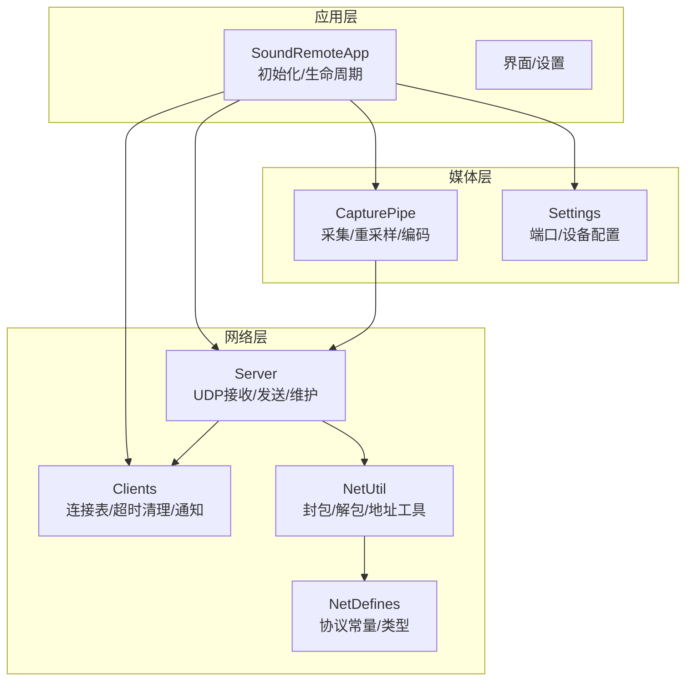
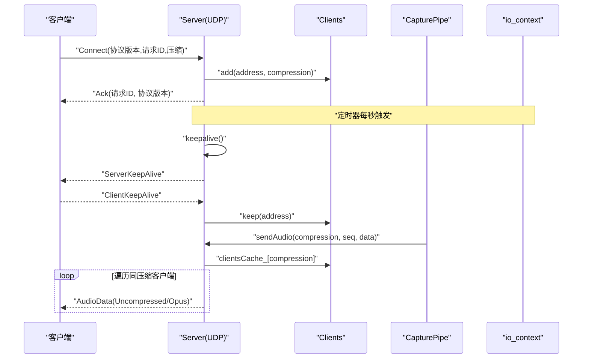
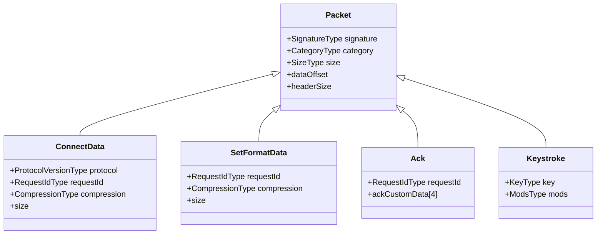
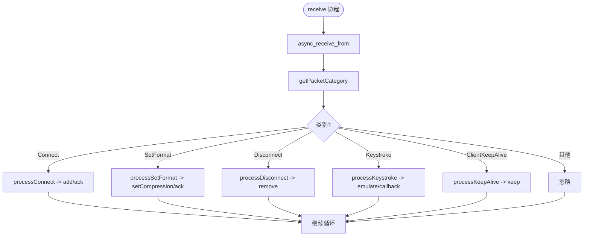
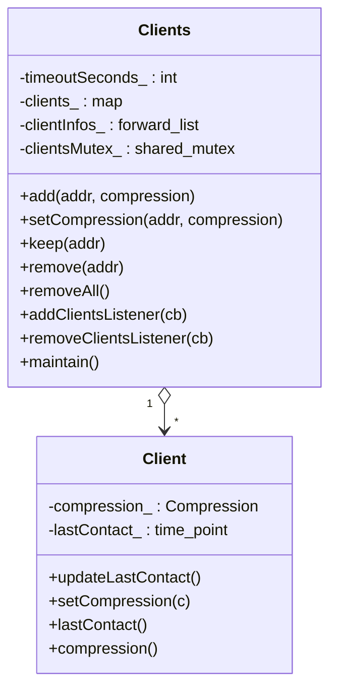
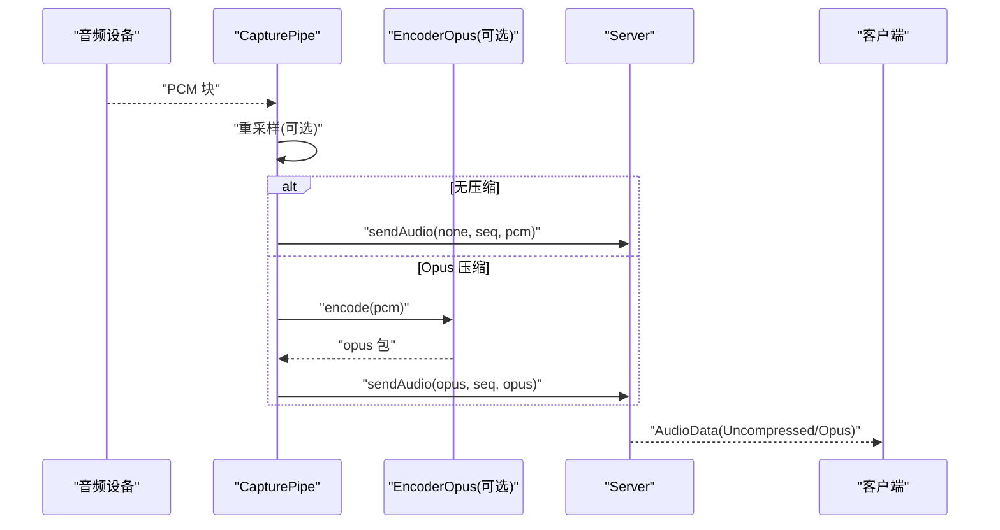
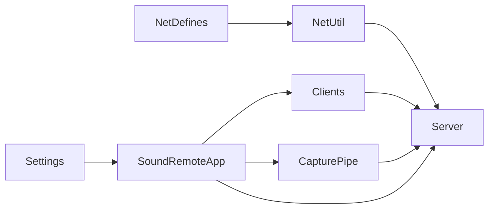

# 网络通信

<cite>
**本文引用的文件**   
- [NetDefines.h](file://SoundRemote/NetDefines.h)
- [NetUtil.cpp](file://SoundRemote/NetUtil.cpp)
- [NetUtil.h](file://SoundRemote/NetUtil.h)
- [Server.cpp](file://SoundRemote/Server.cpp)
- [Server.h](file://SoundRemote/Server.h)
- [Clients.cpp](file://SoundRemote/Clients.cpp)
- [Clients.h](file://SoundRemote/Clients.h)
- [CapturePipe.cpp](file://SoundRemote/CapturePipe.cpp)
- [CapturePipe.h](file://SoundRemote/CapturePipe.h)
- [Settings.cpp](file://SoundRemote/Settings.cpp)
- [Settings.h](file://SoundRemote/Settings.h)
- [SoundRemoteApp.cpp](file://SoundRemote/SoundRemoteApp.cpp)
- [SoundRemoteApp.h](file://SoundRemote/SoundRemoteApp.h)
- [NetUtilTest.cpp](file://Tests/NetUtilTest.cpp)
</cite>

## 目录
1. [简介](#简介)
2. [项目结构](#项目结构)
3. [核心组件](#核心组件)
4. [架构总览](#架构总览)
5. [详细组件分析](#详细组件分析)
6. [依赖关系分析](#依赖关系分析)
7. [性能考虑](#性能考虑)
8. [故障排除指南](#故障排除指南)
9. [结论](#结论)
10. [附录](#附录)

## 简介
本文件面向 SoundRemote-WinServer 的网络通信子系统，系统性说明基于 Boost.Asio 的 UDP 服务器实现、异步 I/O 与协程驱动的事件模型、客户端连接管理、心跳检测机制、状态同步协议、数据包格式与错误处理策略。同时提供网络安全建议、性能优化技巧、调试方法、客户端集成要点与协议扩展建议，并给出实际通信示例与排障指导。

## 项目结构
围绕网络通信的核心代码分布在以下模块：
- 协议定义与工具：NetDefines.h、NetUtil.h/.cpp
- 服务器与事件循环：Server.h/.cpp、SoundRemoteApp.h/.cpp
- 客户端管理与监听：Clients.h/.cpp
- 音频采集与编码管道：CapturePipe.h/.cpp
- 配置与端口默认值：Settings.h/.cpp
- 单元测试（验证协议构造）：NetUtilTest.cpp

图表来源
- [Server.cpp:18-28](file://SoundRemote/Server.cpp#L18-L28)
- [Server.cpp:80-125](file://SoundRemote/Server.cpp#L80-L125)
- [Server.cpp:182-209](file://SoundRemote/Server.cpp#L182-L209)
- [Clients.cpp:64-80](file://SoundRemote/Clients.cpp#L64-L80)
- [CapturePipe.cpp:97-155](file://SoundRemote/CapturePipe.cpp#L97-L155)
- [Settings.cpp:17-22](file://SoundRemote/Settings.cpp#L17-L22)
- [NetDefines.h:45-68](file://SoundRemote/NetDefines.h#L45-L68)

章节来源
- [Server.cpp:18-28](file://SoundRemote/Server.cpp#L18-L28)
- [Server.cpp:80-125](file://SoundRemote/Server.cpp#L80-L125)
- [Server.cpp:182-209](file://SoundRemote/Server.cpp#L182-L209)
- [Clients.cpp:64-80](file://SoundRemote/Clients.cpp#L64-L80)
- [CapturePipe.cpp:97-155](file://SoundRemote/CapturePipe.cpp#L97-L155)
- [Settings.cpp:17-22](file://SoundRemote/Settings.cpp#L17-L22)
- [NetDefines.h:45-68](file://SoundRemote/NetDefines.h#L45-L68)

## 核心组件
- 协议定义与工具
  - 统一的数据包头部、类别枚举、字段偏移与大小常量；提供创建/解析各类包的函数与本地地址查询等工具。
- 服务器（Server）
  - 基于 Boost.Asio 的 UDP socket 异步接收与发送；协程化 receive 循环；按类别分发处理；定时维护心跳与过期清理；将音频数据广播到已注册客户端。
- 客户端管理（Clients）
  - 线程安全的客户端集合，记录最后接触时间与压缩格式；支持添加/更新/移除/全清；周期性维护清理超时客户端；通过回调向订阅者推送变更。
- 采集管道（CapturePipe）
  - 从系统音频设备捕获 PCM，按需重采样，按目标压缩格式编码或直通，生成带序列号的音频帧并通过 Server 发送。
- 应用入口（SoundRemoteApp）
  - 启动 io_context 事件循环，装配 Server、Clients、CapturePipe，绑定回调，处理 UI 事件与系统电源事件。
- 配置（Settings）
  - 读取/写入 INI 配置，包含服务端/客户端端口默认值与迁移逻辑。

章节来源
- [NetDefines.h:45-68](file://SoundRemote/NetDefines.h#L45-L68)
- [NetUtil.cpp:67-76](file://SoundRemote/NetUtil.cpp#L67-L76)
- [NetUtil.cpp:129-169](file://SoundRemote/NetUtil.cpp#L129-L169)
- [Server.cpp:18-28](file://SoundRemote/Server.cpp#L18-L28)
- [Server.cpp:80-125](file://SoundRemote/Server.cpp#L80-L125)
- [Server.cpp:182-209](file://SoundRemote/Server.cpp#L182-L209)
- [Clients.cpp:5-27](file://SoundRemote/Clients.cpp#L5-L27)
- [Clients.cpp:64-80](file://SoundRemote/Clients.cpp#L64-L80)
- [CapturePipe.cpp:97-155](file://SoundRemote/CapturePipe.cpp#L97-L155)
- [SoundRemoteApp.cpp:100-125](file://SoundRemote/SoundRemoteApp.cpp#L100-L125)
- [Settings.cpp:17-22](file://SoundRemote/Settings.cpp#L17-L22)

## 架构总览
整体采用“事件驱动 + 协程”的异步模型：
- 应用启动后创建 io_context 并在独立线程运行事件循环。
- Server 在接收端使用协程持续等待 UDP 报文，按类别分派处理。
- 定时器周期触发 keepalive 与客户端维护。
- CapturePipe 作为生产者，将音频帧经 Server 广播至各客户端。
- Clients 集中管理连接状态，按压缩格式分组缓存，供 Server 快速查找目标地址。

图表来源
- [Server.cpp:80-125](file://SoundRemote/Server.cpp#L80-L125)
- [Server.cpp:127-166](file://SoundRemote/Server.cpp#L127-L166)
- [Server.cpp:182-209](file://SoundRemote/Server.cpp#L182-L209)
- [Server.cpp:48-62](file://SoundRemote/Server.cpp#L48-L62)
- [Clients.cpp:5-27](file://SoundRemote/Clients.cpp#L5-L27)
- [CapturePipe.cpp:124-155](file://SoundRemote/CapturePipe.cpp#L124-L155)

## 详细组件分析

### 协议与数据包格式
- 通用头部
  - 固定签名、类别、长度字段；后续为具体数据体。
- 类别枚举
  - 包括错误、连接、断开、设置格式、按键、未压缩音频、Opus 音频、客户端心跳、服务端心跳、确认等。
- 关键数据结构
  - Connect/SetFormat/Ack/Keystroke 等数据体字段与大小常量明确定义。
- 字节序与偏移
  - 多数字段采用大端序存储；工具函数提供读写与校验。

图表来源
- [NetDefines.h:9-58](file://SoundRemote/NetDefines.h#L9-L58)
- [NetDefines.h:22-32](file://SoundRemote/NetDefines.h#L22-L32)

章节来源
- [NetDefines.h:9-58](file://SoundRemote/NetDefines.h#L9-L58)
- [NetDefines.h:22-32](file://SoundRemote/NetDefines.h#L22-L32)
- [NetUtil.cpp:67-76](file://SoundRemote/NetUtil.cpp#L67-L76)
- [NetUtil.cpp:129-169](file://SoundRemote/NetUtil.cpp#L129-L169)
- [NetUtilTest.cpp:29-120](file://Tests/NetUtilTest.cpp#L29-L120)

### 服务器（Server）
- 职责
  - 负责 UDP 接收/发送、协议解析、连接/断开/格式协商、按键转发、心跳广播与客户端维护。
- 异步接收
  - 使用协程封装 receive 循环，非阻塞等待 datagram，解析类别后路由到对应处理器。
- 发送路径
  - 根据压缩类型选择音频类别，组装包后按客户端缓存批量异步发送。
- 心跳与维护
  - 定时器每秒触发 keepalive 与 clients_->maintain()，确保连接活跃与过期清理。

图表来源
- [Server.cpp:80-125](file://SoundRemote/Server.cpp#L80-L125)
- [Server.cpp:127-166](file://SoundRemote/Server.cpp#L127-L166)

章节来源
- [Server.cpp:18-28](file://SoundRemote/Server.cpp#L18-L28)
- [Server.cpp:80-125](file://SoundRemote/Server.cpp#L80-L125)
- [Server.cpp:127-166](file://SoundRemote/Server.cpp#L127-L166)
- [Server.cpp:182-209](file://SoundRemote/Server.cpp#L182-L209)

### 客户端管理（Clients）
- 职责
  - 维护客户端地址与压缩格式映射；记录最后接触时间；周期性清理超时；以 forward_list 形式通知订阅者。
- 并发安全
  - 对内部容器加锁，保证多线程访问安全。
- 超时策略
  - 超过配置的 timeoutSeconds_ 即判定离线并从表中移除，随后触发一次更新通知。

图表来源
- [Clients.h:15-52](file://SoundRemote/Clients.h#L15-L52)
- [Clients.cpp:5-27](file://SoundRemote/Clients.cpp#L5-L27)
- [Clients.cpp:64-80](file://SoundRemote/Clients.cpp#L64-L80)

章节来源
- [Clients.h:15-52](file://SoundRemote/Clients.h#L15-L52)
- [Clients.cpp:5-27](file://SoundRemote/Clients.cpp#L5-L27)
- [Clients.cpp:64-80](file://SoundRemote/Clients.cpp#L64-L80)

### 采集管道（CapturePipe）
- 职责
  - 从指定设备采集 PCM，必要时进行重采样；按当前客户端支持的压缩格式集动态维护编码器；生成带序列号的音频帧并调用 Server::sendAudio 发送。
- 编码器管理
  - 当客户端压缩格式集合变化时，增删对应的 EncoderOpus 实例；none 表示不压缩直通。
- 序列号
  - 全局递增的 SequenceNumberType，用于客户端侧乱序/丢包处理参考。

图表来源
- [CapturePipe.cpp:97-155](file://SoundRemote/CapturePipe.cpp#L97-L155)
- [Server.cpp:48-62](file://SoundRemote/Server.cpp#L48-L62)

章节来源
- [CapturePipe.cpp:97-155](file://SoundRemote/CapturePipe.cpp#L97-L155)
- [Server.cpp:48-62](file://SoundRemote/Server.cpp#L48-L62)

### 应用入口与事件循环（SoundRemoteApp）
- 职责
  - 初始化窗口与菜单、加载设置、创建并装配 Server/Clients/CapturePipe、启动 io_context 事件循环、响应 UI 与系统事件。
- 关键点
  - 在独立线程运行 io_context.run()；关闭时先发送断开包再停止事件循环。

章节来源
- [SoundRemoteApp.cpp:100-125](file://SoundRemote/SoundRemoteApp.cpp#L100-L125)
- [SoundRemoteApp.cpp:388-408](file://SoundRemote/SoundRemoteApp.cpp#L388-L408)
- [SoundRemoteApp.cpp:127-131](file://SoundRemote/SoundRemoteApp.cpp#L127-L131)

### 配置（Settings）
- 职责
  - 读取/写入 INI 配置项，包含服务端/客户端端口默认值与旧版本迁移逻辑。
- 默认端口
  - 服务端与客户端端口默认值来自 NetDefines 中的常量。

章节来源
- [Settings.cpp:17-22](file://SoundRemote/Settings.cpp#L17-L22)
- [Settings.cpp:67-72](file://SoundRemote/Settings.cpp#L67-L72)
- [Settings.cpp:74-106](file://SoundRemote/Settings.cpp#L74-L106)
- [NetDefines.h:64-68](file://SoundRemote/NetDefines.h#L64-L68)

## 依赖关系分析
- 松耦合设计
  - Server 仅依赖 Clients 提供的接口与 NetUtil 的封包工具；CapturePipe 通过 Server 对外广播，避免直接耦合客户端列表。
- 外部依赖
  - Boost.Asio 提供 UDP 套接字、协程与定时器；Windows API 用于获取本地 IP 列表。
- 潜在环依赖
  - 通过弱引用/回调避免强引用环；Server 持有 Clients 共享指针，CapturePipe 以弱引用持有 Server。

图表来源
- [Server.cpp:18-28](file://SoundRemote/Server.cpp#L18-L28)
- [CapturePipe.cpp:40-51](file://SoundRemote/CapturePipe.cpp#L40-L51)
- [Settings.cpp:17-22](file://SoundRemote/Settings.cpp#L17-L22)

章节来源
- [Server.cpp:18-28](file://SoundRemote/Server.cpp#L18-L28)
- [CapturePipe.cpp:40-51](file://SoundRemote/CapturePipe.cpp#L40-L51)
- [Settings.cpp:17-22](file://SoundRemote/Settings.cpp#L17-L22)

## 性能考虑
- 零拷贝与缓冲
  - 使用 std::span 减少拷贝；音频缓冲区累积到固定帧大小后再编码/发送，降低系统调用次数。
- 批量发送
  - 按压缩类型聚合目标地址，减少重复构建 endpoint 与多次分配。
- 编码器复用
  - 针对每种压缩格式维护一个编码器实例，避免频繁创建销毁。
- 事件循环隔离
  - io_context 运行在高优先级进程类中，降低 UI 线程干扰。
- 建议
  - 合理设置输入包大小与音频帧长；在网络拥塞时优先选择更低码率压缩；监控 CPU 占用与丢包率。

章节来源
- [CapturePipe.cpp:124-155](file://SoundRemote/CapturePipe.cpp#L124-L155)
- [Server.cpp:48-62](file://SoundRemote/Server.cpp#L48-L62)
- [SoundRemoteApp.cpp:112-113](file://SoundRemote/SoundRemoteApp.cpp#L112-L113)

## 故障排除指南
- 常见问题定位
  - 无法收到客户端连接：检查防火墙与端口配置；确认客户端与服务端端口一致。
  - 音频无声：确认设备选择正确、静音开关未开启、客户端压缩格式匹配。
  - 客户端频繁掉线：调整心跳间隔与超时阈值；检查网络质量。
- 日志与断点
  - 在 receive 与 send 回调处设置断点；观察异常分支与错误码。
- 典型错误
  - 接收协程捕获到 asio 错误或未知异常时会弹出错误提示并退出；请检查系统资源与权限。
  - 定时器异常会抛出运行时错误；确认系统时钟与定时器对象状态。

章节来源
- [Server.cpp:111-125](file://SoundRemote/Server.cpp#L111-L125)
- [Server.cpp:176-180](file://SoundRemote/Server.cpp#L176-L180)
- [Server.cpp:187-199](file://SoundRemote/Server.cpp#L187-L199)
- [SoundRemoteApp.cpp:388-408](file://SoundRemote/SoundRemoteApp.cpp#L388-L408)

## 结论
该网络子系统以简洁清晰的协议与分层架构实现了低延迟的远程音频传输。通过协程驱动的异步 I/O、统一的客户端管理与可插拔的压缩编码，系统在易用性与性能之间取得良好平衡。遵循本文档的集成与排障建议，可快速完成客户端对接与问题定位。

## 附录

### 通信协议规范（摘要）
- 头部
  - 签名：固定值；类别：见枚举；长度：自描述。
- 类别
  - Connect/SetFormat/Disconnect/Keystroke/AudioDataUncompressed/AudioDataOpus/ClientKeepAlive/ServerKeepAlive/Ack/Error。
- 关键字段
  - 协议版本、请求 ID、压缩类型、序列号、自定义 ACK 数据。
- 字节序
  - 多字节整数采用大端序。

章节来源
- [NetDefines.h:9-58](file://SoundRemote/NetDefines.h#L9-L58)
- [NetDefines.h:22-32](file://SoundRemote/NetDefines.h#L22-L32)
- [NetUtil.cpp:67-76](file://SoundRemote/NetUtil.cpp#L67-L76)
- [NetUtil.cpp:129-169](file://SoundRemote/NetUtil.cpp#L129-L169)
- [NetUtilTest.cpp:29-120](file://Tests/NetUtilTest.cpp#L29-L120)

### 客户端集成指南
- 握手流程
  - 客户端发送 Connect（含协议版本、请求 ID、压缩类型），服务端返回 Ack（含请求 ID、协议版本）。
- 格式协商
  - 客户端发送 SetFormat（请求 ID、压缩类型），服务端返回 Ack（请求 ID）。
- 心跳
  - 客户端定期发送 ClientKeepAlive；服务端周期性发送 ServerKeepAlive。
- 音频流
  - 服务端按客户端协商的压缩类型发送 AudioDataUncompressed 或 AudioDataOpus，携带序列号。
- 断开
  - 客户端发送 Disconnect；服务端移除连接。

章节来源
- [Server.cpp:127-166](file://SoundRemote/Server.cpp#L127-L166)
- [Server.cpp:182-209](file://SoundRemote/Server.cpp#L182-L209)
- [NetUtil.cpp:154-169](file://SoundRemote/NetUtil.cpp#L154-L169)

### 网络安全考虑
- 信任边界
  - 当前实现未内置认证与加密，建议在可信局域网内使用；如需跨网段，应在上层增加鉴权与加密通道。
- 端口暴露
  - 仅开放必要端口；结合主机防火墙限制源地址。
- 输入校验
  - 严格校验头部签名与长度，拒绝非法包；对未知类别保持静默丢弃。

章节来源
- [NetDefines.h:45-58](file://SoundRemote/NetDefines.h#L45-L58)
- [NetUtil.cpp:171-180](file://SoundRemote/NetUtil.cpp#L171-L180)

### 性能优化技巧
- 帧长与码率权衡
  - 增大帧长可降低开销但增加延迟；码率越高带宽占用越大。
- 编码器选择
  - 根据网络状况动态切换压缩等级；无压缩仅在极低延迟且高带宽场景使用。
- 批量发送
  - 合并小包发送，减少系统调用与上下文切换。

章节来源
- [CapturePipe.cpp:124-155](file://SoundRemote/CapturePipe.cpp#L124-L155)
- [Server.cpp:48-62](file://SoundRemote/Server.cpp#L48-L62)

### 调试方法
- 抓包验证
  - 使用抓包工具核对头部签名、类别与字节序是否符合预期。
- 单测辅助
  - 参考 NetUtilTest 中对音频包、心跳包、ACK 包的构造断言，快速比对期望输出。
- 日志注入
  - 在 receive/send 与 maintain 回调处打印关键信息，便于追踪时序与异常。

章节来源
- [NetUtilTest.cpp:29-120](file://Tests/NetUtilTest.cpp#L29-L120)
- [Server.cpp:80-125](file://SoundRemote/Server.cpp#L80-L125)
- [Server.cpp:182-209](file://SoundRemote/Server.cpp#L182-L209)