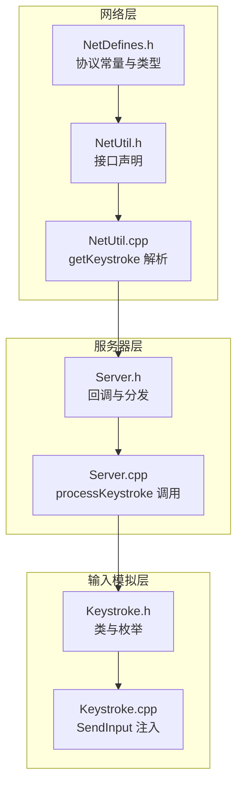
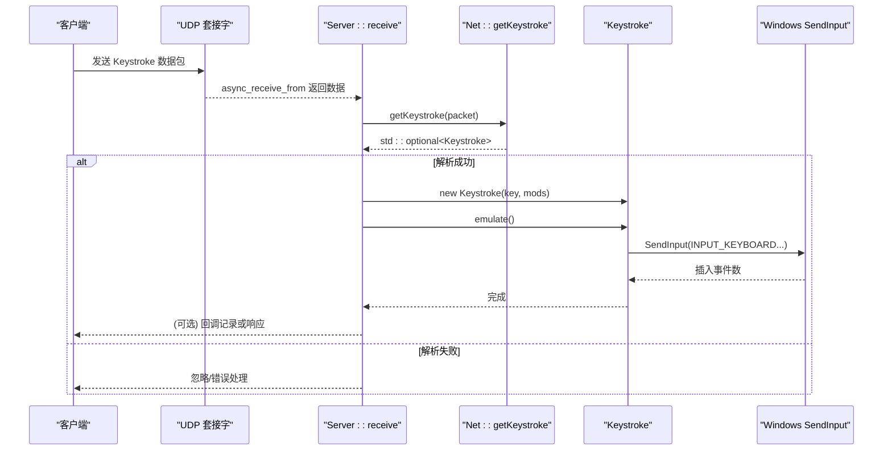
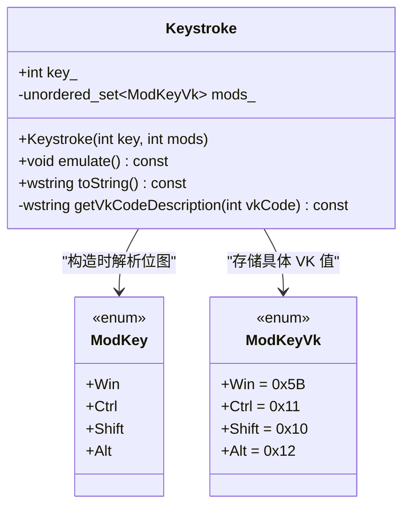
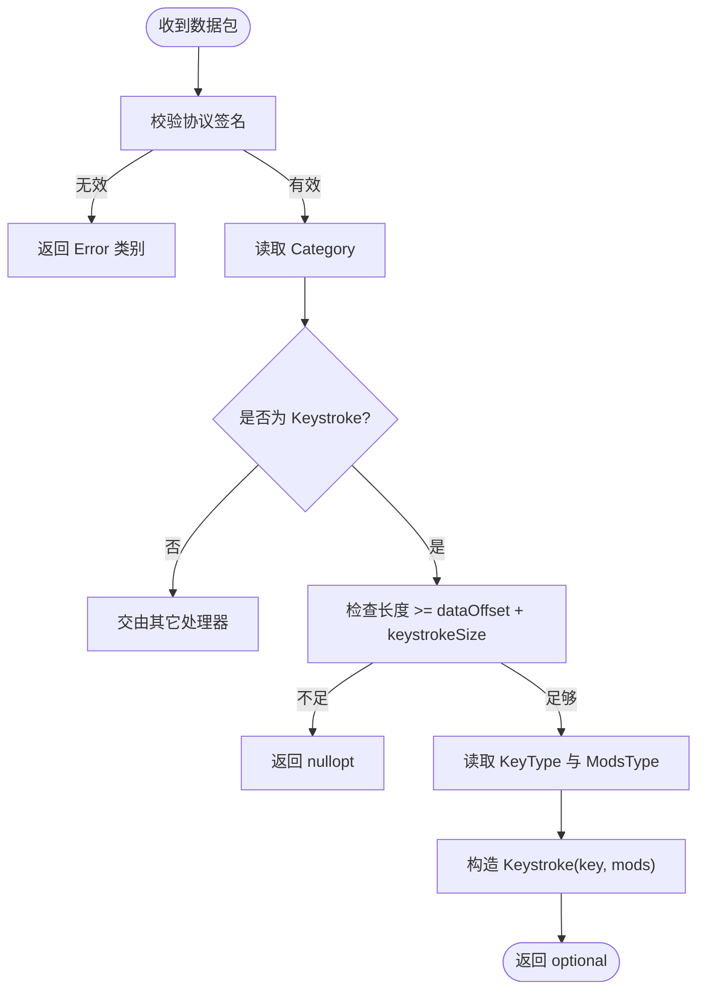
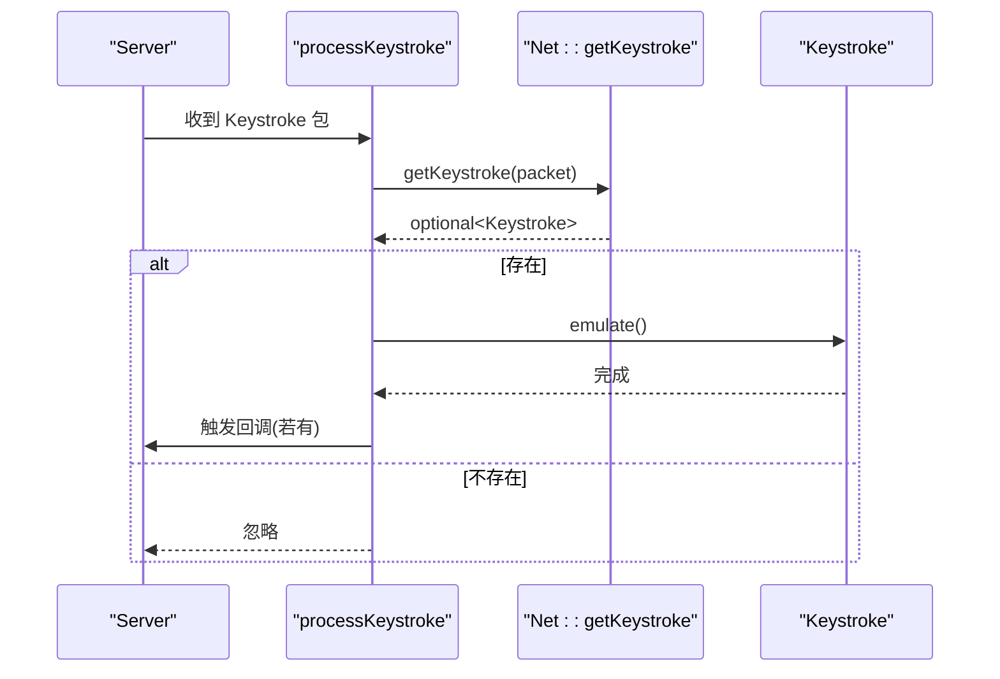
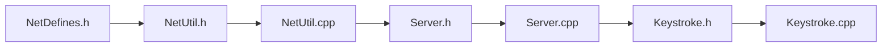

# 输入模拟

<cite>
**本文引用的文件**   
- [SoundRemote/Keystroke.h](file://SoundRemote/Keystroke.h)
- [SoundRemote/Keystroke.cpp](file://SoundRemote/Keystroke.cpp)
- [SoundRemote/NetDefines.h](file://SoundRemote/NetDefines.h)
- [SoundRemote/NetUtil.h](file://SoundRemote/NetUtil.h)
- [SoundRemote/NetUtil.cpp](file://SoundRemote/NetUtil.cpp)
- [SoundRemote/Server.h](file://SoundRemote/Server.h)
- [SoundRemote/Server.cpp](file://SoundRemote/Server.cpp)
- [Tests/KeystrokeTest.cpp](file://Tests/KeystrokeTest.cpp)
</cite>

## 目录
1. [简介](#简介)
2. [项目结构](#项目结构)
3. [核心组件](#核心组件)
4. [架构总览](#架构总览)
5. [详细组件分析](#详细组件分析)
6. [依赖关系分析](#依赖关系分析)
7. [性能考虑](#性能考虑)
8. [故障排除指南](#故障排除指南)
9. [结论](#结论)
10. [附录](#附录)

## 简介
本文件聚焦于 SoundRemote-WinServer 的键盘输入模拟能力，系统性说明以下方面：
- Windows Input API 的集成方式与事件注入机制
- 虚拟键码（VK）映射、修饰键组合与按键描述生成
- 网络协议中的键盘数据包格式与解析流程
- 快捷键支持范围、安全限制与权限要求
- 按键组合处理顺序、事件优先级与兼容性注意事项
- 配置项与扩展点（当前实现中未暴露外部配置）
- 最佳实践、性能优化与安全建议
- 实际使用示例与常见问题排查

## 项目结构
与键盘输入模拟直接相关的代码主要分布在以下模块：
- Keystroke：封装一次按键动作（含修饰键），负责通过 SendInput 注入系统级键盘事件
- NetDefines/NetUtil：定义并解析键盘数据包（类别、键码、修饰键位图）
- Server：接收 UDP 数据报，按类别分发到 processKeystroke，调用 Keystroke::emulate 执行注入
- Tests：对 toString 输出进行断言验证

图表来源
- [SoundRemote/NetDefines.h:1-69](file://SoundRemote/NetDefines.h#L1-L69)
- [SoundRemote/NetUtil.h:1-40](file://SoundRemote/NetUtil.h#L1-L40)
- [SoundRemote/NetUtil.cpp:176-217](file://SoundRemote/NetUtil.cpp#L176-L217)
- [SoundRemote/Server.h:1-60](file://SoundRemote/Server.h#L1-L60)
- [SoundRemote/Server.cpp:71-174](file://SoundRemote/Server.cpp#L71-L174)
- [SoundRemote/Keystroke.h:1-41](file://SoundRemote/Keystroke.h#L1-L41)
- [SoundRemote/Keystroke.cpp:1-153](file://SoundRemote/Keystroke.cpp#L1-L153)

章节来源
- [SoundRemote/NetDefines.h:1-69](file://SoundRemote/NetDefines.h#L1-L69)
- [SoundRemote/NetUtil.h:1-40](file://SoundRemote/NetUtil.h#L1-L40)
- [SoundRemote/NetUtil.cpp:176-217](file://SoundRemote/NetUtil.cpp#L176-L217)
- [SoundRemote/Server.h:1-60](file://SoundRemote/Server.h#L1-L60)
- [SoundRemote/Server.cpp:71-174](file://SoundRemote/Server.cpp#L71-L174)
- [SoundRemote/Keystroke.h:1-41](file://SoundRemote/Keystroke.h#L1-L41)
- [SoundRemote/Keystroke.cpp:1-153](file://SoundRemote/Keystroke.cpp#L1-L153)

## 核心组件
- Keystroke 类
  - 职责：表示一次按键（主键 + 可选修饰键），提供 emulate() 注入系统事件与 toString() 可读化描述
  - 关键成员：key_（虚拟键码）、mods_（修饰键集合）
  - 修饰键枚举：Win/Ctrl/Shift/Alt，内部映射至对应 VK 值
- 网络协议相关
  - NetDefines：定义 Keystroke 数据包大小、字段类型与类别常量
  - NetUtil：从原始字节流解析出 Keystroke（读取 KeyType 与 ModsType）
- 服务器路由
  - Server：根据包类别将数据交给 processKeystroke，后者解析为 Keystroke 并调用 emulate()

章节来源
- [SoundRemote/Keystroke.h:1-41](file://SoundRemote/Keystroke.h#L1-L41)
- [SoundRemote/Keystroke.cpp:1-153](file://SoundRemote/Keystroke.cpp#L1-L153)
- [SoundRemote/NetDefines.h:1-69](file://SoundRemote/NetDefines.h#L1-L69)
- [SoundRemote/NetUtil.h:1-40](file://SoundRemote/NetUtil.h#L1-L40)
- [SoundRemote/NetUtil.cpp:176-217](file://SoundRemote/NetUtil.cpp#L176-L217)
- [SoundRemote/Server.h:1-60](file://SoundRemote/Server.h#L1-L60)
- [SoundRemote/Server.cpp:71-174](file://SoundRemote/Server.cpp#L71-L174)

## 架构总览
下图展示了从客户端发送键盘事件到服务端注入系统的完整链路。

图表来源
- [SoundRemote/Server.cpp:80-162](file://SoundRemote/Server.cpp#L80-L162)
- [SoundRemote/NetUtil.cpp:182-191](file://SoundRemote/NetUtil.cpp#L182-L191)
- [SoundRemote/Keystroke.cpp:20-52](file://SoundRemote/Keystroke.cpp#L20-L52)

## 详细组件分析

### Keystroke 类与 Windows Input API 集成
- 构造阶段
  - 将传入的修饰键位图转换为内部 ModKeyVk 集合，用于后续构建 INPUT 数组
- emulate() 注入流程
  - 计算需要的事件数量：修饰键个数 + 主键，再乘以 2（按下与抬起各一次）
  - 填充 INPUT 数组：前半段为 KEYDOWN，后半段为 KEYUP；中间一对为主键，其余为修饰键
  - 设置 dwFlags：KEYEVENTF_KEYUP 与 KEYEVENTF_EXTENDEDKEY（主键始终标记为扩展键）
  - 调用 SendInput 一次性提交所有事件，减少上下文切换开销
- toString() 与键名获取
  - 将修饰键名称与主键名称拼接为“Win + Ctrl + Shift + Alt + W”形式
  - 特殊键（浏览器、媒体、电源等）有硬编码描述；其他键通过 MapVirtualKeyW + GetKeyNameTextW 获取本地化名称
  - 针对扩展键（如右控制、方向键、Insert/Delete/Home/End/PgUp/PgDn/Numpad 除号等）手动置位 KF_EXTENDED，确保 GetKeyNameTextW 正确识别

图表来源
- [SoundRemote/Keystroke.h:6-40](file://SoundRemote/Keystroke.h#L6-L40)
- [SoundRemote/Keystroke.cpp:7-18](file://SoundRemote/Keystroke.cpp#L7-L18)

章节来源
- [SoundRemote/Keystroke.h:1-41](file://SoundRemote/Keystroke.h#L1-L41)
- [SoundRemote/Keystroke.cpp:20-52](file://SoundRemote/Keystroke.cpp#L20-L52)
- [SoundRemote/Keystroke.cpp:54-77](file://SoundRemote/Keystroke.cpp#L54-L77)
- [SoundRemote/Keystroke.cpp:79-152](file://SoundRemote/Keystroke.cpp#L79-L152)

### 网络协议与数据包解析
- 数据包结构
  - 类别：Category::Keystroke
  - 数据体：KeyType（单字节虚拟键码）+ ModsType（单字节修饰键位图）
  - keystrokeSize = sizeof(KeyType) + sizeof(ModsType)
- 解析流程
  - 校验签名与长度后，从 dataOffset 开始依次读取 key 与 mods
  - 构造 Keystroke 对象并返回 optional，若长度不足则返回空

图表来源
- [SoundRemote/NetDefines.h:27-29](file://SoundRemote/NetDefines.h#L27-L29)
- [SoundRemote/NetUtil.cpp:182-191](file://SoundRemote/NetUtil.cpp#L182-L191)

章节来源
- [SoundRemote/NetDefines.h:1-69](file://SoundRemote/NetDefines.h#L1-L69)
- [SoundRemote/NetUtil.cpp:176-217](file://SoundRemote/NetUtil.cpp#L176-L217)

### 服务器端处理与回调
- receive 循环中根据类别分发，Keystroke 类别进入 processKeystroke
- processKeystroke 解析得到 Keystroke 后调用 emulate() 注入系统事件
- 可选回调：若注册了 KeystrokeCallback，则在注入后触发，便于 UI 显示最近按键列表

图表来源
- [SoundRemote/Server.cpp:155-162](file://SoundRemote/Server.cpp#L155-L162)
- [SoundRemote/NetUtil.cpp:182-191](file://SoundRemote/NetUtil.cpp#L182-L191)

章节来源
- [SoundRemote/Server.cpp:80-162](file://SoundRemote/Server.cpp#L80-L162)
- [SoundRemote/Server.h:20-48](file://SoundRemote/Server.h#L20-L48)

### 按键组合处理与事件优先级
- 修饰键集合以 unordered_set 存储，保证去重与 O(1) 查找
- emulate() 构造 INPUT 序列的策略：
  - 先按下所有修饰键，再按下主键，随后按相反顺序抬起修饰键，最后抬起主键
  - 该顺序可避免目标应用因修饰键状态不一致而误判组合键
- 主键始终带 KEYEVENTF_EXTENDEDKEY，以确保某些键（如方向键、Numpad 除号等）被正确识别

章节来源
- [SoundRemote/Keystroke.cpp:20-52](file://SoundRemote/Keystroke.cpp#L20-L52)

### 快捷键支持范围与兼容性
- 支持的修饰键：Win、Ctrl、Shift、Alt
- 特殊键内置描述：浏览器导航键、多媒体键、电源键、打印屏幕、暂停等
- 普通字母/数字/功能键：通过 GetKeyNameTextW 动态获取本地化名称
- 兼容性与边界：
  - 仅支持标准虚拟键码（1–254），超出范围的行为未定义
  - 扩展键需显式设置 KF_EXTENDED，否则可能无法获得正确的键名或行为异常

章节来源
- [SoundRemote/Keystroke.h:11-13](file://SoundRemote/Keystroke.h#L11-L13)
- [SoundRemote/Keystroke.cpp:79-152](file://SoundRemote/Keystroke.cpp#L79-L152)

### 安全限制与权限要求
- 注入位置：SendInput 会将事件注入到前台窗口的输入队列，受 Windows 安全策略影响
- UAC/桌面隔离：若进程运行在较低完整性级别或被沙箱限制，可能被拒绝注入
- 建议：以管理员权限运行服务端，或在用户交互上下文中启动，以避免注入失败

章节来源
- [SoundRemote/Keystroke.cpp:48-51](file://SoundRemote/Keystroke.cpp#L48-L51)

### 配置与自定义快捷键
- 当前实现未提供外部配置文件项来定义或修改快捷键映射
- 如需扩展，可在 Keystroke 构造处增加映射表或从配置加载，并在网络层保持向后兼容

章节来源
- [SoundRemote/Settings.h:1-38](file://SoundRemote/Settings.h#L1-L38)
- [SoundRemote/Settings.cpp:1-107](file://SoundRemote/Settings.cpp#L1-L107)

## 依赖关系分析
- 低耦合设计：
  - Server 仅依赖 Keystroke 的公共接口，不关心注入细节
  - NetUtil 仅负责解析，不持有 Keystroke 实例的生命周期
- 潜在风险：
  - 若未来引入更多修饰键或组合规则，需同步更新网络协议与解析逻辑
  - 当前未对 SendInput 返回值做错误处理，可能导致静默失败

图表来源
- [SoundRemote/NetDefines.h:1-69](file://SoundRemote/NetDefines.h#L1-L69)
- [SoundRemote/NetUtil.h:1-40](file://SoundRemote/NetUtil.h#L1-L40)
- [SoundRemote/NetUtil.cpp:176-217](file://SoundRemote/NetUtil.cpp#L176-L217)
- [SoundRemote/Server.h:1-60](file://SoundRemote/Server.h#L1-L60)
- [SoundRemote/Server.cpp:71-174](file://SoundRemote/Server.cpp#L71-L174)
- [SoundRemote/Keystroke.h:1-41](file://SoundRemote/Keystroke.h#L1-L41)
- [SoundRemote/Keystroke.cpp:1-153](file://SoundRemote/Keystroke.cpp#L1-L153)

章节来源
- [SoundRemote/NetDefines.h:1-69](file://SoundRemote/NetDefines.h#L1-L69)
- [SoundRemote/NetUtil.h:1-40](file://SoundRemote/NetUtil.h#L1-L40)
- [SoundRemote/NetUtil.cpp:176-217](file://SoundRemote/NetUtil.cpp#L176-L217)
- [SoundRemote/Server.h:1-60](file://SoundRemote/Server.h#L1-L60)
- [SoundRemote/Server.cpp:71-174](file://SoundRemote/Server.cpp#L71-L174)
- [SoundRemote/Keystroke.h:1-41](file://SoundRemote/Keystroke.h#L1-L41)
- [SoundRemote/Keystroke.cpp:1-153](file://SoundRemote/Keystroke.cpp#L1-L153)

## 性能考虑
- 批量注入：单次 SendInput 提交多个 INPUT，降低系统调用次数，提高吞吐
- 最小内存分配：INPUT 向量在栈上预分配，避免频繁堆分配
- 字符串描述：toString 仅在调试/日志路径使用，不应在热路径频繁调用
- 建议：
  - 在高并发场景下，可对 Keystroke 对象进行复用或池化（需谨慎管理生命周期）
  - 避免在回调中进行阻塞操作，防止阻塞接收线程

章节来源
- [SoundRemote/Keystroke.cpp:20-52](file://SoundRemote/Keystroke.cpp#L20-L52)
- [SoundRemote/Server.cpp:155-162](file://SoundRemote/Server.cpp#L155-L162)

## 故障排除指南
- 现象：按键无反应
  - 检查进程权限：尝试以管理员身份运行服务端
  - 检查前台窗口是否接受键盘输入（例如全屏游戏或受保护的进程可能屏蔽注入）
  - 查看 SendInput 返回值是否等于预期事件数（当前实现未处理错误分支）
- 现象：组合键失效
  - 确认修饰键位图是否正确传递（ModsType 位域）
  - 确认目标应用是否支持相应组合键
- 现象：键名显示为“未知键”
  - 检查 GetKeyNameTextW 返回值为 0 的情况，可能是非法 VK 或扫描码转换失败
  - 对于扩展键，确保已设置 KF_EXTENDED
- 现象：网络解析失败
  - 校验数据包长度是否满足 dataOffset + keystrokeSize
  - 校验协议签名与类别

章节来源
- [SoundRemote/Keystroke.cpp:48-51](file://SoundRemote/Keystroke.cpp#L48-L51)
- [SoundRemote/Keystroke.cpp:145-152](file://SoundRemote/Keystroke.cpp#L145-L152)
- [SoundRemote/NetUtil.cpp:182-191](file://SoundRemote/NetUtil.cpp#L182-L191)

## 结论
SoundRemote-WinServer 的键盘输入模拟采用简洁清晰的三层结构：网络协议解析、服务器路由与 Keystroke 注入。其优势在于：
- 使用 SendInput 批量注入，兼顾效率与可靠性
- 通过修饰键集合与扩展键标志，覆盖常见组合键场景
- 借助 GetKeyNameTextW 提供本地化键名，便于调试与展示

改进建议：
- 完善 SendInput 错误处理与日志上报
- 增加单元测试覆盖 emulate 路径（可结合测试框架模拟 INPUT 数组）
- 按需扩展修饰键与快捷键配置能力，同时保持网络协议向后兼容

## 附录

### 网络协议字段速查
- 类别：Category::Keystroke
- 数据体：KeyType（1 字节）+ ModsType（1 字节）
- 长度约束：keystrokeSize = sizeof(KeyType) + sizeof(ModsType)

章节来源
- [SoundRemote/NetDefines.h:27-29](file://SoundRemote/NetDefines.h#L27-L29)

### 单元测试要点
- toString 在无修饰键情况下应返回单个键名
- toString 在多修饰键情况下应包含所有修饰键名称片段

章节来源
- [Tests/KeystrokeTest.cpp:12-30](file://Tests/KeystrokeTest.cpp#L12-L30)