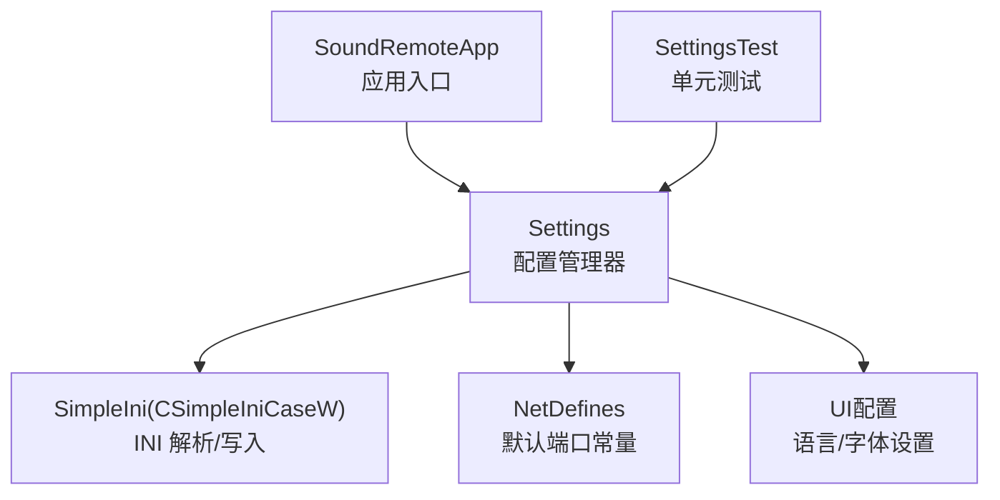
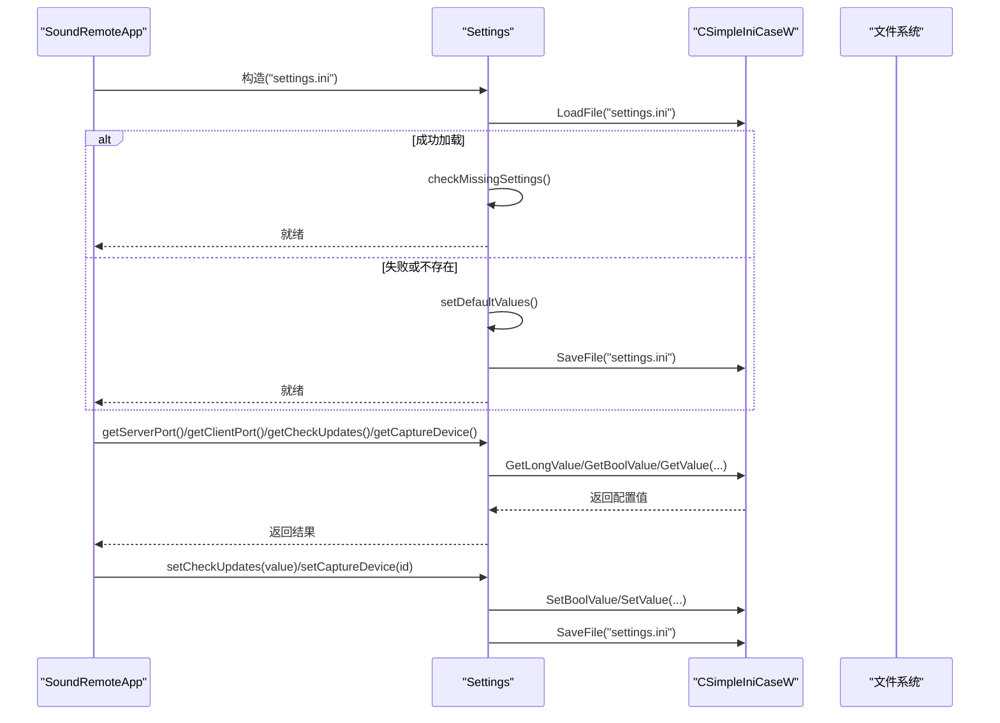
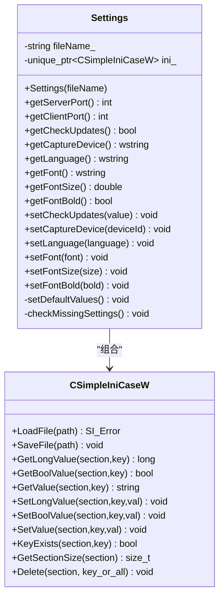
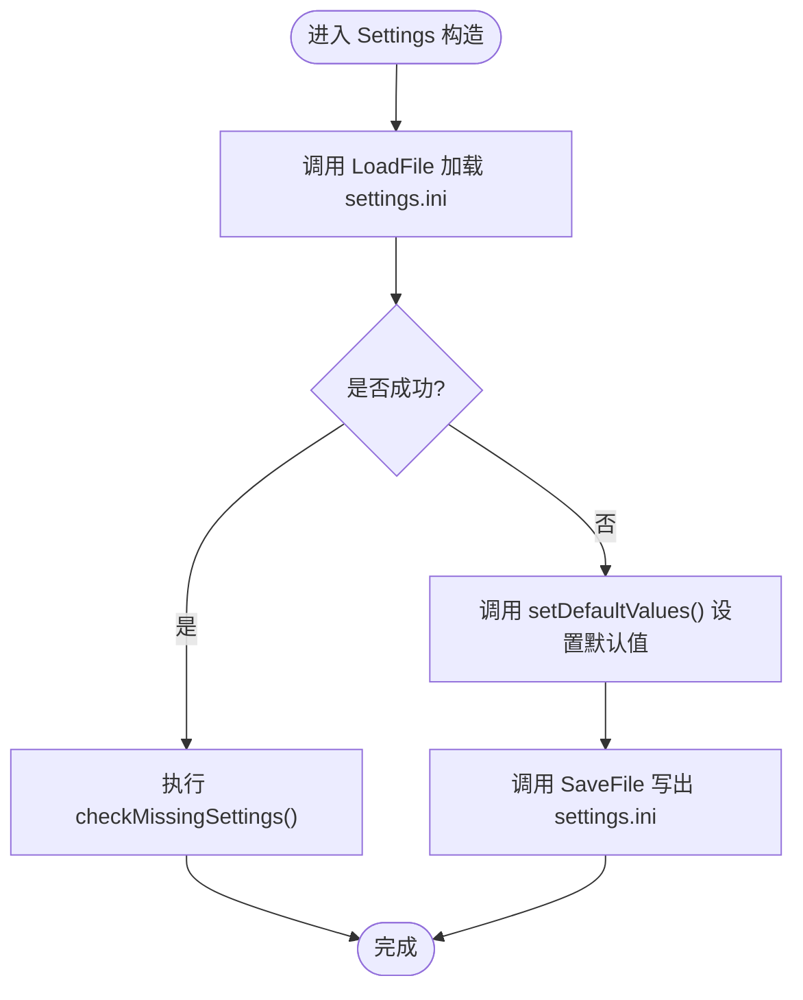
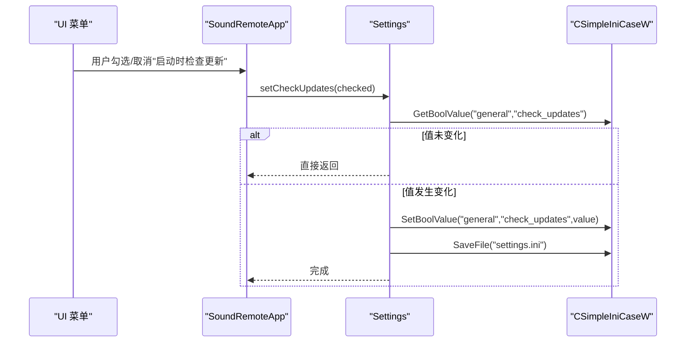
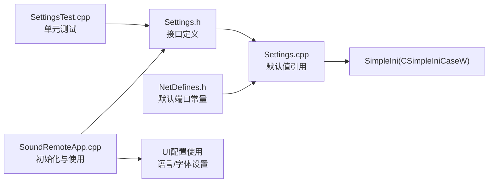

# 配置管理

<cite>
**本文引用的文件**   
- [Settings.h](file://SoundRemote/Settings.h)
- [Settings.cpp](file://SoundRemote/Settings.cpp)
- [NetDefines.h](file://SoundRemote/NetDefines.h)
- [SoundRemoteApp.cpp](file://SoundRemote/SoundRemoteApp.cpp)
- [SettingsTest.cpp](file://Tests/SettingsTest.cpp)
</cite>

## 更新摘要
**变更内容**   
- 新增UI相关配置选项：Language、Font、Font.Size、Font.Bold设置项
- 在settings.ini中新增'ui'配置段
- 扩展Settings类以支持新的UI配置读写操作
- 应用启动时根据语言设置动态加载界面文本
- 字体配置支持自定义字体名称、大小和粗体样式

## 目录
1. [简介](#简介)
2. [项目结构](#项目结构)
3. [核心组件](#核心组件)
4. [架构总览](#架构总览)
5. [详细组件分析](#详细组件分析)
6. [依赖关系分析](#依赖关系分析)
7. [性能与并发特性](#性能与并发特性)
8. [故障排除指南](#故障排除指南)
9. [结论](#结论)
10. [附录：配置参考与示例](#附录配置参考与示例)

## 简介
本章节面向 SoundRemote-WinServer 的配置管理系统，聚焦基于 SimpleIni 的 INI 配置文件解析、配置项定义与数据持久化机制。文档将详细说明配置文件的结构与默认值管理、迁移与版本兼容策略、动态更新流程，并提供最佳实践、安全注意事项与故障排除建议。同时给出完整的配置项参考与示例配置，帮助读者快速上手并稳定运维。

**更新** 系统现已支持用户界面相关的配置选项，包括语言设置和字体配置，允许用户自定义应用程序的显示外观和本地化行为。

## 项目结构
配置管理相关代码集中在以下位置：
- 配置抽象与实现：SoundRemote/Settings.h、SoundRemote/Settings.cpp
- 网络默认端口常量：SoundRemote/NetDefines.h
- 应用初始化与配置使用：SoundRemote/SoundRemoteApp.cpp
- 单元测试覆盖：Tests/SettingsTest.cpp



**图表来源**
- [SoundRemoteApp.cpp:506-508](file://SoundRemote/SoundRemoteApp.cpp#L506-L508)
- [Settings.h:11-37](file://SoundRemote/Settings.h#L11-L37)
- [Settings.cpp:24-33](file://SoundRemote/Settings.cpp#L24-L33)
- [NetDefines.h:64-65](file://SoundRemote/NetDefines.h#L64-L65)
- [SettingsTest.cpp:27-33](file://Tests/SettingsTest.cpp#L27-L33)

**章节来源**
- [Settings.h:1-46](file://SoundRemote/Settings.h#L1-L46)
- [Settings.cpp:1-177](file://SoundRemote/Settings.cpp#L1-L177)
- [NetDefines.h:64-65](file://SoundRemote/NetDefines.h#L64-L65)
- [SoundRemoteApp.cpp:506-508](file://SoundRemote/SoundRemoteApp.cpp#L506-L508)
- [SettingsTest.cpp:27-33](file://Tests/SettingsTest.cpp#L27-L33)

## 核心组件
- Settings 类：封装 INI 配置的加载、读取、写入、缺失项检测与迁移逻辑。对外暴露统一的 getter/setter 接口，屏蔽底层 SimpleIni 细节。
- SimpleIni（CSimpleIniCaseW）：大小写不敏感的宽字符 INI 解析器，提供 LoadFile/SaveFile 等 API。
- NetDefines：集中定义网络相关的默认端口常量，供配置默认值使用。
- 应用集成：SoundRemoteApp 在启动时创建 Settings 实例，并在 UI 交互中触发配置变更与持久化。

**更新** 新增UI配置支持，包括语言切换和字体自定义功能。

**章节来源**
- [Settings.h:11-37](file://SoundRemote/Settings.h#L11-L37)
- [Settings.cpp:24-33](file://SoundRemote/Settings.cpp#L24-L33)
- [NetDefines.h:64-65](file://SoundRemote/NetDefines.h#L64-L65)
- [SoundRemoteApp.cpp:506-508](file://SoundRemote/SoundRemoteApp.cpp#L506-L508)

## 架构总览
配置系统采用"薄封装 + 简单持久化"的架构：应用层通过 Settings 访问配置；Settings 内部维护一个 CSimpleIniCaseW 实例，负责从 settings.ini 加载或生成默认配置，并在需要时增量保存。



**图表来源**
- [Settings.cpp:24-33](file://SoundRemote/Settings.cpp#L24-L33)
- [Settings.cpp:35-49](file://SoundRemote/Settings.cpp#L35-L49)
- [Settings.cpp:51-65](file://SoundRemote/Settings.cpp#L51-L65)
- [Settings.cpp:67-72](file://SoundRemote/Settings.cpp#L67-L72)
- [Settings.cpp:74-106](file://SoundRemote/Settings.cpp#L74-L106)

## 详细组件分析

### Settings 类设计与职责
- 构造函数：尝试加载现有 settings.ini；若失败则生成默认配置并立即落盘。
- 读取接口：提供端口、检查更新开关、捕获设备 ID、语言、字体设置的只读访问。
- 写入接口：仅在值发生变化时才进行持久化，避免不必要的 I/O。
- 默认值管理：集中定义各配置项的默认值，来源于 NetDefines 与内置常量。
- 缺失项检测与迁移：对旧版无 section 的 INI 进行自动迁移，补齐缺失键并清理空 section。

**更新** 新增UI配置相关的getter/setter方法，支持语言、字体名称、字体大小和粗体样式的配置。



**图表来源**
- [Settings.h:11-37](file://SoundRemote/Settings.h#L11-L37)
- [Settings.cpp:24-33](file://SoundRemote/Settings.cpp#L24-L33)
- [Settings.cpp:35-49](file://SoundRemote/Settings.cpp#L35-L49)
- [Settings.cpp:51-65](file://SoundRemote/Settings.cpp#L51-L65)
- [Settings.cpp:67-72](file://SoundRemote/Settings.cpp#L67-L72)
- [Settings.cpp:74-106](file://SoundRemote/Settings.cpp#L74-L106)

**章节来源**
- [Settings.h:11-46](file://SoundRemote/Settings.h#L11-L46)
- [Settings.cpp:24-33](file://SoundRemote/Settings.cpp#L24-L33)
- [Settings.cpp:35-49](file://SoundRemote/Settings.cpp#L35-L49)
- [Settings.cpp:51-65](file://SoundRemote/Settings.cpp#L51-L65)
- [Settings.cpp:67-72](file://SoundRemote/Settings.cpp#L67-L72)
- [Settings.cpp:74-106](file://SoundRemote/Settings.cpp#L74-L106)

### 配置项定义与默认值
- Section 与 Setting 常量：以命名空间组织，避免硬编码字符串散落各处。
- DefaultValue 常量：集中声明默认值，其中端口默认值来自 NetDefines。
- 默认设备 ID：内置两个默认设备标识符，用于捕获设备选择。

**更新** 新增UI配置段的定义和默认值：
- ui.Language：默认值为"English"
- ui.Font：默认值为"Segoe UI"  
- ui.Font.Size：默认值为9.0
- ui.Font.Bold：默认值为false

**章节来源**
- [Settings.cpp:5-22](file://SoundRemote/Settings.cpp#L5-L22)
- [NetDefines.h:64-65](file://SoundRemote/NetDefines.h#L64-L65)
- [Settings.h:8-9](file://SoundRemote/Settings.h#L8-L9)

### 配置加载与默认值生成流程
- 首次运行或文件不可用时，自动生成包含所有必需键的 settings.ini。
- 已存在文件时，按 section/key 读取；缺失键由迁移逻辑补齐。

**更新** 新增UI配置项的默认值生成和迁移支持。



**图表来源**
- [Settings.cpp:24-33](file://SoundRemote/Settings.cpp#L24-L33)
- [Settings.cpp:67-72](file://SoundRemote/Settings.cpp#L67-L72)
- [Settings.cpp:74-106](file://SoundRemote/Settings.cpp#L74-L106)

**章节来源**
- [Settings.cpp:24-33](file://SoundRemote/Settings.cpp#L24-L33)
- [Settings.cpp:67-72](file://SoundRemote/Settings.cpp#L67-L72)
- [Settings.cpp:74-106](file://SoundRemote/Settings.cpp#L74-L106)

### 缺失项检测与迁移机制
- 针对旧版（0.5.2 及更早）无 section 的 INI，自动将 server_port/client_port 迁移至 network section。
- 为 general section 补齐 check_updates 与 capture_device 键。
- **新增** 为 ui section 补齐 language、font、fontSize、fontBold 键。
- 清理根级空 section，确保文件结构整洁。
- 仅当有改动时才触发一次 SaveFile，减少磁盘写入次数。

**更新** 新增对UI配置项的迁移支持，确保旧版本配置文件能够正确升级到新版本格式。

```mermaid
flowchart TD
MStart(["进入 checkMissingSettings"]) --> CheckSP["检查 network/server_port 是否存在"]
CheckSP --> SPFound{"存在?"}
SPFound --> |否| ReadOldSP["从根段读取旧 server_port(带默认值回退)"]
ReadOldSP --> WriteSP["写入 network/server_port"]
SPFound --> |是| CheckCP["检查 network/client_port 是否存在"]
WriteSP --> CheckCP
CheckCP --> CPFound{"存在?"}
CPFound --> |否| ReadOldCP["从根段读取旧 client_port(带默认值回退)"]
ReadOldCP --> WriteCP["写入 network/client_port"]
CPFound --> |是| CheckCU["检查 general/check_updates 是否存在"]
WriteCP --> CheckCU
CheckCU --> CUFound{"存在?"}
CUFound --> |否| SetCU["设置 general/check_updates 默认值"]
CUFound --> |是| CheckCD["检查 general/capture_device 是否存在"]
SetCU --> CheckCD
CheckCD --> CDFound{"存在?"}
CDFound --> |否| SetCD["设置 general/capture_device 默认值"]
CDFound --> |是| CheckLang["检查 ui/Language 是否存在"]
SetCD --> CheckLang
CheckLang --> LangFound{"存在?"}
LangFound --> |否| SetLang["设置 ui/Language 默认值"]
LangFound --> |是| CheckFont["检查 ui/Font 是否存在"]
SetLang --> CheckFont
CheckFont --> FontFound{"存在?"}
FontFound --> |否| SetFont["设置 ui/Font 默认值"]
FontFound --> |是| CheckFontSize["检查 ui/Font.Size 是否存在"]
SetFont --> CheckFontSize
CheckFontSize --> SizeFound{"存在?"}
SizeFound --> |否| SetSize["设置 ui/Font.Size 默认值"]
SizeFound --> |是| CheckBold["检查 ui/Font.Bold 是否存在"]
SetSize --> CheckBold
CheckBold --> BoldFound{"存在?"}
BoldFound --> |否| SetBold["设置 ui/Font.Bold 默认值"]
BoldFound --> |是| CleanRoot["删除根段(空 section)"]
SetBold --> CleanRoot
CleanRoot --> NeedSave{"是否需要保存?"}
NeedSave --> |是| DoSave["SaveFile"]
NeedSave --> |否| MEnd(["结束"])
DoSave --> MEnd
```



**图表来源**
- [Settings.cpp:74-106](file://SoundRemote/Settings.cpp#L74-L106)

**章节来源**
- [Settings.cpp:74-106](file://SoundRemote/Settings.cpp#L74-L106)

### 动态配置更新与持久化
- setCheckUpdates：比较新旧值，仅在变化时写入并持久化。
- setCaptureDevice：同上，避免重复 I/O。
- **新增** setLanguage、setFont、setFontSize、setFontBold：同样遵循值变化检测机制。
- 应用层在菜单勾选"启动时检查更新"时触发保存。

**更新** 新增UI配置项的动态更新支持，所有setter方法都实现了智能保存机制。



**图表来源**
- [Settings.cpp:51-57](file://SoundRemote/Settings.cpp#L51-L57)
- [SoundRemoteApp.cpp:629-633](file://SoundRemote/SoundRemoteApp.cpp#L629-L633)

**章节来源**
- [Settings.cpp:51-57](file://SoundRemote/Settings.cpp#L51-L57)
- [SoundRemoteApp.cpp:629-633](file://SoundRemote/SoundRemoteApp.cpp#L629-L633)

### 配置验证规则
当前实现未引入显式校验逻辑，主要依赖：
- 类型安全：通过 GetLongValue/GetBoolValue/GetValue 获取强类型值。
- 默认值回退：缺失键时由迁移逻辑或默认值填充。
- 范围约束：未在代码中对端口号范围做额外校验，遵循操作系统与网络栈限制。

**更新** UI配置项的验证：
- 语言设置：支持"Chinese"和其他语言标识符
- 字体名称：直接使用系统可用的字体名称
- 字体大小：double类型，支持小数点精度
- 粗体样式：布尔值控制

**章节来源**
- [Settings.cpp:35-49](file://SoundRemote/Settings.cpp#L35-L49)
- [Settings.cpp:74-106](file://SoundRemote/Settings.cpp#L74-L106)

### 环境变量集成与模板
- 当前实现未支持环境变量注入或外部模板机制。
- 如需扩展，可在构造阶段优先读取环境变量作为覆盖源，再合并到 INI 配置。

[本节为概念性说明，不涉及具体源码]

### 备份与恢复
- 当前实现未内置备份与恢复功能。
- 建议方案：在关键操作前复制 settings.ini 为 .bak；恢复时将 .bak 重命名为 settings.ini 后重启应用。

[本节为概念性说明，不涉及具体源码]

## 依赖关系分析
- Settings 依赖 SimpleIni 进行 INI 读写。
- Settings 依赖 NetDefines 中的默认端口常量。
- SoundRemoteApp 在初始化阶段创建 Settings 实例，并在 UI 事件回调中更新配置。
- 单元测试覆盖默认值、读写与迁移行为。

**更新** SoundRemoteApp 现在使用UI配置来：
- 动态加载界面文本（中文/英文）
- 应用自定义字体设置到所有控件



**图表来源**
- [NetDefines.h:64-65](file://SoundRemote/NetDefines.h#L64-L65)
- [Settings.cpp:17-22](file://SoundRemote/Settings.cpp#L17-L22)
- [Settings.h:11-37](file://SoundRemote/Settings.h#L11-L37)
- [SoundRemoteApp.cpp:506-508](file://SoundRemote/SoundRemoteApp.cpp#L506-L508)
- [SettingsTest.cpp:27-33](file://Tests/SettingsTest.cpp#L27-L33)

**章节来源**
- [NetDefines.h:64-65](file://SoundRemote/NetDefines.h#L64-L65)
- [Settings.cpp:17-22](file://SoundRemote/Settings.cpp#L17-L22)
- [Settings.h:11-37](file://SoundRemote/Settings.h#L11-L37)
- [SoundRemoteApp.cpp:506-508](file://SoundRemote/SoundRemoteApp.cpp#L506-L508)
- [SettingsTest.cpp:27-33](file://Tests/SettingsTest.cpp#L27-L33)

## 性能与并发特性
- 写入优化：仅在值变化时触发 SaveFile，降低磁盘 I/O。
- 单次迁移批量保存：checkMissingSettings 内累计 saveNeeded，最终一次性 SaveFile。
- 线程模型：当前未见多线程并发访问 Settings 的代码路径；若未来引入并发，需增加互斥保护以避免竞态条件。

**更新** UI配置更新同样遵循性能优化原则，避免不必要的文件写入操作。

[本节为通用性能讨论，不涉及具体源码片段]

## 故障排除指南
- 无法读取配置或端口异常
  - 确认 settings.ini 所在目录可写可读。
  - 检查是否存在权限问题导致 SaveFile 失败。
  - 查看迁移逻辑是否正确处理旧格式（无 section）。
- 配置未生效
  - 确认 UI 触发了 setCheckUpdates/setCaptureDevice 且值确实发生变化。
  - 检查是否有其他进程持有文件句柄导致写入失败。
- 迁移失败或丢失配置
  - 备份 settings.ini 后再升级。
  - 确认旧版文件中 server_port/client_port 位于根段，迁移逻辑会将其移动到 network section。
- **新增** UI配置相关问题
  - 字体名称无效：确认使用的字体名称在系统中可用。
  - 语言设置不生效：检查语言标识符是否为"Chinese"或其他支持的标识符。
  - 字体大小异常：确认字体大小为正数，建议使用合理范围（如8-24磅）。

**章节来源**
- [Settings.cpp:24-33](file://SoundRemote/Settings.cpp#L24-L33)
- [Settings.cpp:74-106](file://SoundRemote/Settings.cpp#L74-L106)
- [Settings.cpp:51-65](file://SoundRemote/Settings.cpp#L51-L65)

## 结论
该配置管理系统以简洁可靠的 INI 持久化为核心，通过 Settings 类统一封装了加载、默认值、迁移与写入逻辑，满足日常使用需求。**更新** 新增的UI配置功能进一步增强了系统的灵活性和用户体验，支持多语言界面和自定义字体设置。建议在后续迭代中补充配置校验、环境变量覆盖、备份恢复与并发安全等能力，以提升健壮性与可维护性。

[本节为总结性内容，不涉及具体源码]

## 附录：配置参考与示例

### 配置文件位置与名称
- 文件名：settings.ini
- 位置：应用程序工作目录（由应用构造 Settings 时指定）

**章节来源**
- [SoundRemoteApp.cpp:506-508](file://SoundRemote/SoundRemoteApp.cpp#L506-L508)

### 配置项参考
- Section: network
  - server_port
    - 类型：整数
    - 默认值：Net::defaultServerPort
    - 说明：服务器监听端口
  - client_port
    - 类型：整数
    - 默认值：Net::defaultClientPort
    - 说明：客户端连接端口
- Section: general
  - check_updates
    - 类型：布尔
    - 默认值：true
    - 说明：启动时是否检查更新
  - capture_device
    - 类型：宽字符串
    - 默认值：defaultRenderDeviceId
    - 说明：音频捕获设备标识
- **新增** Section: ui
  - Language
    - 类型：宽字符串
    - 默认值："English"
    - 说明：界面语言设置，支持"Chinese"等语言标识符
  - Font
    - 类型：宽字符串
    - 默认值："Segoe UI"
    - 说明：界面字体名称，需为系统可用字体
  - Font.Size
    - 类型：双精度浮点数
    - 默认值：9.0
    - 说明：界面字体大小（磅值）
  - Font.Bold
    - 类型：布尔
    - 默认值：false
    - 说明：是否使用粗体字体

**章节来源**
- [Settings.cpp:5-22](file://SoundRemote/Settings.cpp#L5-L22)
- [NetDefines.h:64-65](file://SoundRemote/NetDefines.h#L64-L65)
- [Settings.h:8-9](file://SoundRemote/Settings.h#L8-L9)

### 示例配置
以下为符合当前结构的示例配置（仅供参考）：
```ini
[network]
server_port = 15711
client_port = 15712

[general]
check_updates = true
capture_device = default_playback

[ui]
Language = Chinese
Font = Microsoft YaHei
Font.Size = 10.0
Font.Bold = false
```

**更新** 新增UI配置段的完整示例，展示多语言界面和自定义字体的配置方式。

**章节来源**
- [SettingsTest.cpp:35-46](file://Tests/SettingsTest.cpp#L35-L46)
- [SettingsTest.cpp:57-69](file://Tests/SettingsTest.cpp#L57-L69)
- [SettingsTest.cpp:89-95](file://Tests/SettingsTest.cpp#L89-L95)
- [SettingsTest.cpp:108-114](file://Tests/SettingsTest.cpp#L108-L114)

### UI配置使用示例
应用启动时会根据UI配置动态调整界面：

**语言切换**：当Language设置为"Chinese"时，界面文本会自动切换到中文显示。

**字体应用**：系统会读取Font、Font.Size和Font.Bold设置，创建相应的字体对象并应用到所有窗口控件。

**章节来源**
- [SoundRemoteApp.cpp:526-546](file://SoundRemote/SoundRemoteApp.cpp#L526-L546)
- [SoundRemoteApp.cpp:577-603](file://SoundRemote/SoundRemoteApp.cpp#L577-L603)