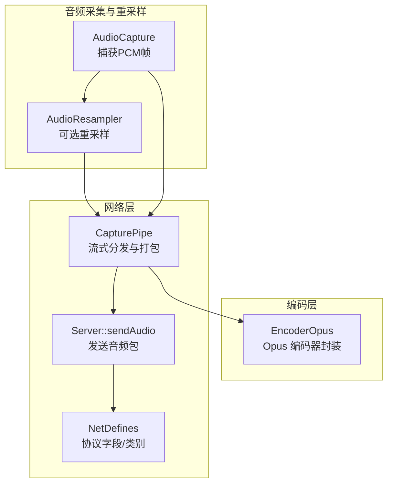
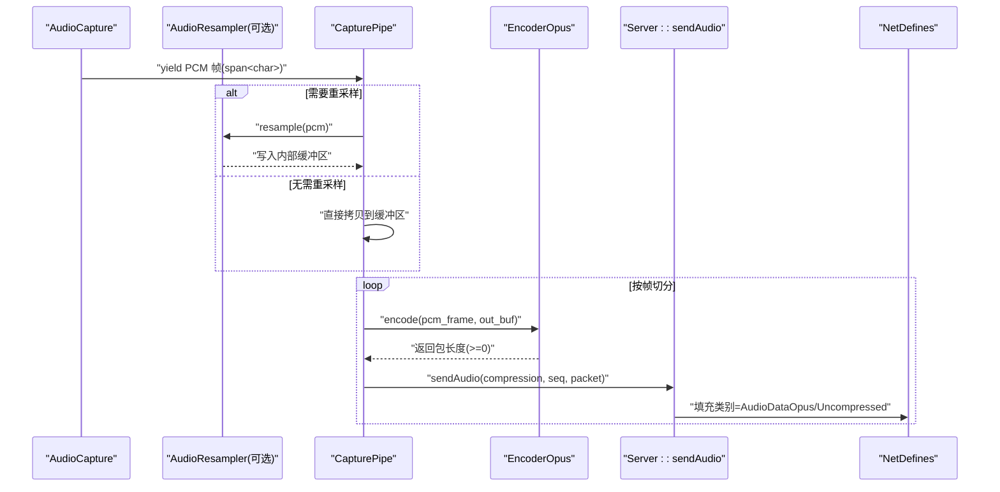
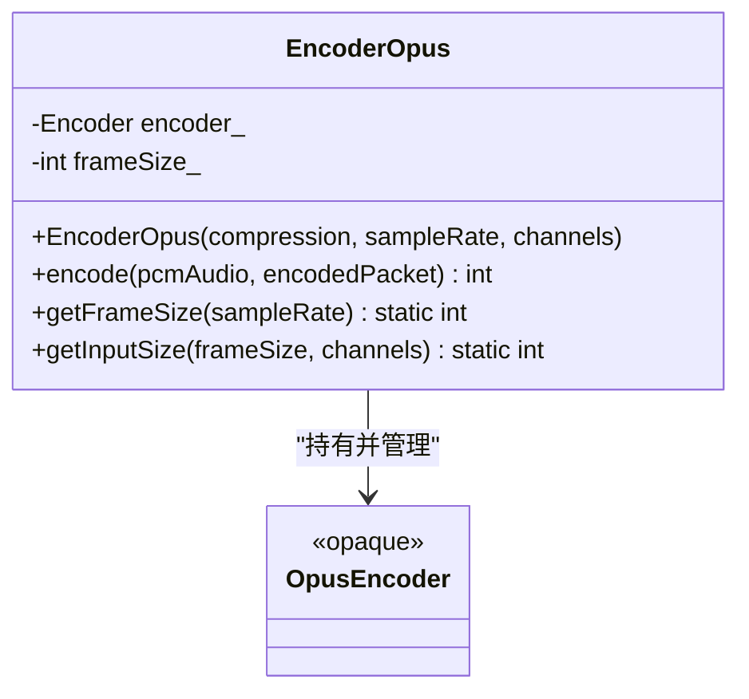
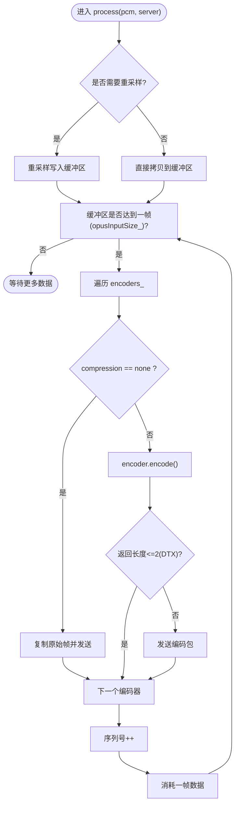
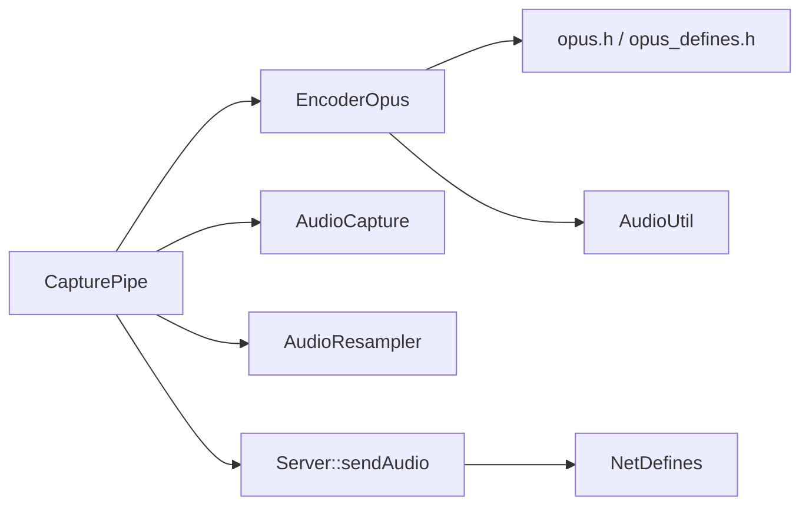

# Opus 音频编码

<cite>
**本文引用的文件**   
- [EncoderOpus.h](file://SoundRemote/EncoderOpus.h)
- [EncoderOpus.cpp](file://SoundRemote/EncoderOpus.cpp)
- [AudioUtil.h](file://SoundRemote/AudioUtil.h)
- [AudioUtil.cpp](file://SoundRemote/AudioUtil.cpp)
- [CapturePipe.h](file://SoundRemote/CapturePipe.h)
- [CapturePipe.cpp](file://SoundRemote/CapturePipe.cpp)
- [NetDefines.h](file://SoundRemote/NetDefines.h)
- [opus.h](file://include/opus/opus.h)
- [opus_defines.h](file://include/opus/opus_defines.h)
- [EncoderOpusTest.cpp](file://Tests/EncoderOpusTest.cpp)
</cite>

## 目录
1. [简介](#简介)
2. [项目结构](#项目结构)
3. [核心组件](#核心组件)
4. [架构总览](#架构总览)
5. [详细组件分析](#详细组件分析)
6. [依赖关系分析](#依赖关系分析)
7. [性能与延迟优化](#性能与延迟优化)
8. [故障诊断与排错](#故障诊断与排错)
9. [结论](#结论)
10. [附录：配置示例与对比](#附录配置示例与对比)

## 简介
本文件面向 SoundRemote-WinServer 的 Opus 音频编码器模块，系统性阐述其集成方式、初始化流程、参数配置、编码主循环、状态管理、错误处理以及与网络传输模块的协作。文档同时提供质量调优指南、延迟优化技巧、常见问题排查方法，以及不同应用场景下的配置建议与性能对比思路，帮助读者快速掌握并高效使用该模块。

## 项目结构
围绕 Opus 编码的关键代码分布在以下文件中：
- 编码器封装：EncoderOpus.h/.cpp
- 音频常量与错误处理：AudioUtil.h/.cpp
- 采集与管道编排：CapturePipe.h/.cpp
- 网络数据包定义：NetDefines.h
- Opus 官方头文件：include/opus/opus.h, include/opus/opus_defines.h
- 单元测试：Tests/EncoderOpusTest.cpp

图表来源
- [CapturePipe.cpp:97-156](file://SoundRemote/CapturePipe.cpp#L97-L156)
- [EncoderOpus.cpp:10-38](file://SoundRemote/EncoderOpus.cpp#L10-L38)
- [NetDefines.h:47-58](file://SoundRemote/NetDefines.h#L47-L58)

章节来源
- [EncoderOpus.h:1-37](file://SoundRemote/EncoderOpus.h#L1-L37)
- [EncoderOpus.cpp:1-53](file://SoundRemote/EncoderOpus.cpp#L1-L53)
- [AudioUtil.h:24-39](file://SoundRemote/AudioUtil.h#L24-L39)
- [CapturePipe.h:23-51](file://SoundRemote/CapturePipe.h#L23-L51)
- [CapturePipe.cpp:1-156](file://SoundRemote/CapturePipe.cpp#L1-L156)
- [NetDefines.h:1-69](file://SoundRemote/NetDefines.h#L1-L69)

## 核心组件
- EncoderOpus：对 Opus 编码器的轻量 C++ 封装，负责创建/销毁编码器实例、设置比特率、计算帧大小与输入缓冲大小、执行单帧编码。
- AudioUtil：集中定义采样率、声道数、帧长、最大包长等常量，并提供统一的错误处理接口（抛出异常）。
- CapturePipe：将采集到的 PCM 数据按固定帧长度切分，为每个目标客户端压缩率维护一个编码器实例，并将编码后的 Opus 包通过 Server 发送。
- NetDefines：定义音频数据包类别（如 AudioDataOpus）、头部偏移、序列号等协议字段。

章节来源
- [EncoderOpus.h:9-36](file://SoundRemote/EncoderOpus.h#L9-L36)
- [EncoderOpus.cpp:10-46](file://SoundRemote/EncoderOpus.cpp#L10-L46)
- [AudioUtil.h:29-39](file://SoundRemote/AudioUtil.h#L29-L39)
- [CapturePipe.cpp:40-51](file://SoundRemote/CapturePipe.cpp#L40-L51)
- [NetDefines.h:47-58](file://SoundRemote/NetDefines.h#L47-L58)

## 架构总览
下图展示了从音频采集到网络发送的端到端流程，重点标注了 Opus 编码在其中的位置与职责。

图表来源
- [CapturePipe.cpp:124-155](file://SoundRemote/CapturePipe.cpp#L124-L155)
- [EncoderOpus.cpp:27-38](file://SoundRemote/EncoderOpus.cpp#L27-L38)
- [NetDefines.h:47-58](file://SoundRemote/NetDefines.h#L47-L58)

## 详细组件分析

### 编码器类 EncoderOpus
- 设计要点
  - 使用智能指针 + 自定义删除器管理底层 OpusEncoder 生命周期，避免资源泄漏。
  - 构造时根据采样率计算每帧样本数，创建编码器并设置比特率。
  - encode 函数完成一次帧编码，支持 DTX（静音不发包）语义。
  - 提供静态工具方法用于计算帧大小与输入缓冲大小。

- 关键行为
  - 初始化：调用 opus_encoder_create 并设置 OPUS_APPLICATION_AUDIO；随后通过 opus_encoder_ctl 设置比特率。
  - 编码：调用 opus_encode，若返回值 <= 2 视为 DTX，上层应跳过发送。
  - 错误处理：统一通过 Audio::processError 抛出异常，携带 Location 信息便于定位。

图表来源
- [EncoderOpus.h:9-36](file://SoundRemote/EncoderOpus.h#L9-L36)
- [EncoderOpus.cpp:10-53](file://SoundRemote/EncoderOpus.cpp#L10-L53)

章节来源
- [EncoderOpus.h:9-36](file://SoundRemote/EncoderOpus.h#L9-L36)
- [EncoderOpus.cpp:10-53](file://SoundRemote/EncoderOpus.cpp#L10-L53)

### 音频常量与错误处理（AudioUtil）
- 常量与类型
  - SampleRate：支持的采样率集合（8k/12k/16k/24k/48k）。
  - Channels：mono/stereo。
  - frameLength：默认 10ms 帧长。
  - maxPacketSize：基于最高比特率与帧长推导的最大包字节数。
- 错误处理
  - processError：将 Opus/HRESULT 错误码转换为带位置的异常，便于上层捕获与日志记录。

章节来源
- [AudioUtil.h:29-39](file://SoundRemote/AudioUtil.h#L29-L39)
- [AudioUtil.cpp:89-101](file://SoundRemote/AudioUtil.cpp#L89-L101)

### 编码流水线与网络集成（CapturePipe）
- 编码器池
  - 根据客户端协商的压缩率动态创建/销毁 EncoderOpus 实例，none 表示不压缩直发。
- 流式处理
  - 以固定 opusInputSize_ 为单位从缓冲区取帧，逐帧编码并发送。
  - 使用全局序列号递增，保证接收端可排序与丢包检测。
- 网络协议
  - 音频类别：AudioDataOpus（已压缩）与 AudioDataUncompressed（未压缩）。
  - 头部包含签名、类别、长度、序列号等字段。

图表来源
- [CapturePipe.cpp:124-155](file://SoundRemote/CapturePipe.cpp#L124-L155)
- [NetDefines.h:47-58](file://SoundRemote/NetDefines.h#L47-L58)

章节来源
- [CapturePipe.h:23-51](file://SoundRemote/CapturePipe.h#L23-L51)
- [CapturePipe.cpp:40-95](file://SoundRemote/CapturePipe.cpp#L40-L95)
- [CapturePipe.cpp:124-155](file://SoundRemote/CapturePipe.cpp#L124-L155)
- [NetDefines.h:47-58](file://SoundRemote/NetDefines.h#L47-L58)

### Opus 库集成要点（参考官方头文件）
- 应用模式：OPUS_APPLICATION_AUDIO（适合音乐/混合内容，低延迟 <15ms）。
- 控制接口：OPUS_SET_BITRATE、OPUS_SET_COMPLEXITY、OPUS_SET_VBR 等。
- 帧时长：支持 2.5/5/10/20/40/60 ms 等。
- 错误码：OPUS_OK、OPUS_BUFFER_TOO_SMALL、OPUS_INVALID_STATE 等。

章节来源
- [opus.h:176-200](file://include/opus/opus.h#L176-L200)
- [opus_defines.h:200-236](file://include/opus/opus_defines.h#L200-L236)
- [opus_defines.h:264-351](file://include/opus/opus_defines.h#L264-L351)

## 依赖关系分析
- 模块耦合
  - EncoderOpus 仅依赖 Opus 原生 API 与 AudioUtil 的错误处理。
  - CapturePipe 聚合 AudioCapture、AudioResampler、EncoderOpus，并通过 Server 发送数据。
  - NetDefines 被 CapturePipe 和 Server 共同引用，定义协议字段。
- 外部依赖
  - Opus 库（C API），通过 include/opus 头文件集成。
  - Windows Audio API（WASAPI）由 AudioCapture 使用。
  - Boost.Asio 用于异步 I/O 与定时器。

图表来源
- [EncoderOpus.cpp:1-9](file://SoundRemote/EncoderOpus.cpp#L1-L9)
- [CapturePipe.cpp:1-12](file://SoundRemote/CapturePipe.cpp#L1-L12)
- [NetDefines.h:1-69](file://SoundRemote/NetDefines.h#L1-L69)

章节来源
- [EncoderOpus.cpp:1-9](file://SoundRemote/EncoderOpus.cpp#L1-L9)
- [CapturePipe.cpp:1-12](file://SoundRemote/CapturePipe.cpp#L1-L12)
- [NetDefines.h:1-69](file://SoundRemote/NetDefines.h#L1-L69)

## 性能与延迟优化
- 帧大小与延迟
  - 当前默认帧长为 10ms（见 AudioUtil 常量），在 48kHz 下对应 480 样本/通道。更小的帧（如 5ms）可降低端到端延迟，但会增加包头开销与 CPU 占用。
- 比特率与音质
  - 比特率越高，音质越好，带宽占用越大。测试用例覆盖了 64/128/192/256/320 kbps 等档位。
- 复杂度与 CPU
  - Opus 复杂度范围 0-10，值越高编码质量越好但 CPU 占用更高。可在高保真场景适当提高，在低延迟或弱设备场景降低。
- VBR 与 CBR
  - 可变比特率（VBR）能提升感知质量，但在严格带宽限制的网络中可考虑约束型 VBR 或硬 CBR。
- 多路并发
  - CapturePipe 为每个目标压缩率维护独立编码器实例，避免重复转换，减少内存拷贝与锁竞争。
- 内存与缓存
  - 使用 streambuf 累积 PCM 并按固定帧切分，减少频繁分配；DTX 机制避免无意义小包发送。

章节来源
- [AudioUtil.h:34-38](file://SoundRemote/AudioUtil.h#L34-L38)
- [EncoderOpus.cpp:40-46](file://SoundRemote/EncoderOpus.cpp#L40-L46)
- [EncoderOpusTest.cpp:43-52](file://Tests/EncoderOpusTest.cpp#L43-L52)
- [opus_defines.h:264-351](file://include/opus/opus_defines.h#L264-L351)

## 故障诊断与排错
- 常见错误来源
  - 编码器创建失败：检查采样率、声道数与应用模式是否合法。
  - 设置比特率失败：确认比特率范围与当前应用模式兼容。
  - 编码失败：检查输入帧长度是否为预期值、输出缓冲是否足够大。
- 错误定位
  - 所有错误均通过 Audio::processError 抛出，异常文本中包含 Location 枚举，可快速定位到具体步骤（如 ENCODER_CREATE、ENCODER_SET_BITRATE、ENCODER_ENCODE）。
- 调试建议
  - 打印每次编码返回长度，关注 DTX 情况（<=2 字节）是否导致“无声”现象。
  - 校验 maxPacketSize 与实际包长，避免越界。
  - 在多客户端场景，观察 encoders_ 的动态增删是否符合预期。

章节来源
- [EncoderOpus.cpp:18-24](file://SoundRemote/EncoderOpus.cpp#L18-L24)
- [EncoderOpus.cpp:27-38](file://SoundRemote/EncoderOpus.cpp#L27-L38)
- [AudioUtil.cpp:89-101](file://SoundRemote/AudioUtil.cpp#L89-L101)

## 结论
本模块以简洁清晰的封装将 Opus 编码器融入实时音频链路：CapturePipe 负责流式切分与分发，EncoderOpus 专注编码细节，AudioUtil 统一错误处理，NetDefines 明确协议边界。通过合理选择帧长、比特率与复杂度，可在音质、延迟与 CPU/带宽之间取得平衡。结合 DTX 与多编码器池策略，系统具备良好的可扩展性与鲁棒性。

## 附录：配置示例与对比
以下为典型场景的配置建议与对比维度（不展示具体代码，仅提供思路与参考路径）：
- 语音通话（低延迟优先）
  - 帧长：5ms 或 10ms
  - 比特率：64-128 kbps
  - 复杂度：4-6
  - 参考路径
    - [AudioUtil.h:34-38](file://SoundRemote/AudioUtil.h#L34-L38)
    - [EncoderOpusTest.cpp:43-52](file://Tests/EncoderOpusTest.cpp#L43-L52)
- 音乐直播（音质优先）
  - 帧长：10-20ms
  - 比特率：192-320 kbps
  - 复杂度：7-10
  - 参考路径
    - [EncoderOpusTest.cpp:43-52](file://Tests/EncoderOpusTest.cpp#L43-L52)
- 弱网环境（稳定优先）
  - 帧长：10-20ms
  - 比特率：96-128 kbps
  - 复杂度：4-6
  - 参考路径
    - [opus_defines.h:264-351](file://include/opus/opus_defines.h#L264-L351)

评估指标建议
- 主观听感：MOS 评分或 A/B 盲测
- 客观指标：PSNR/SSIM（不适用于音频）、频带能量分布、瞬态失真
- 系统指标：CPU 占用、内存峰值、端到端延迟、丢包恢复效果