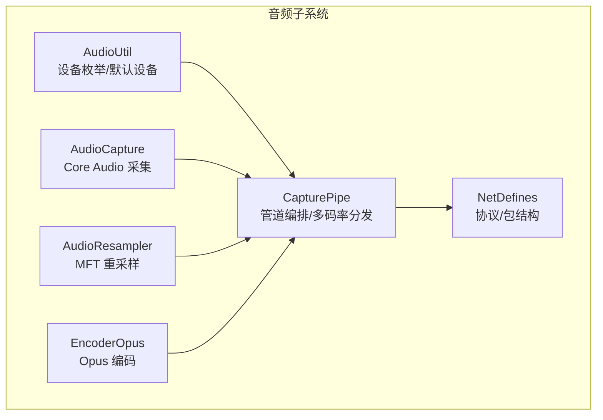
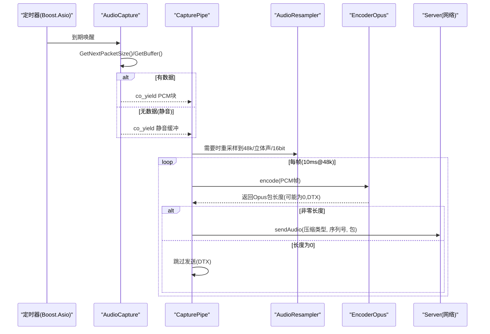
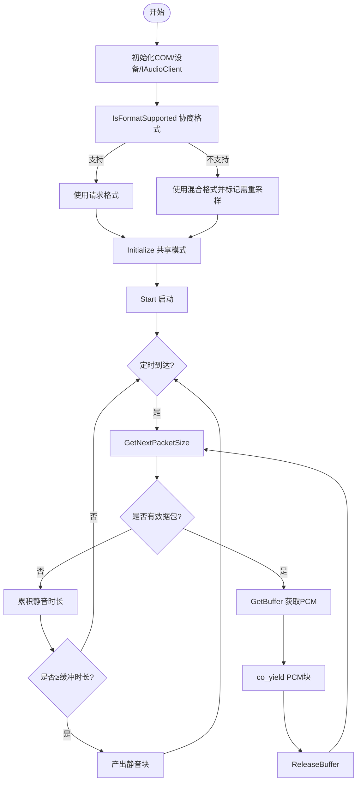
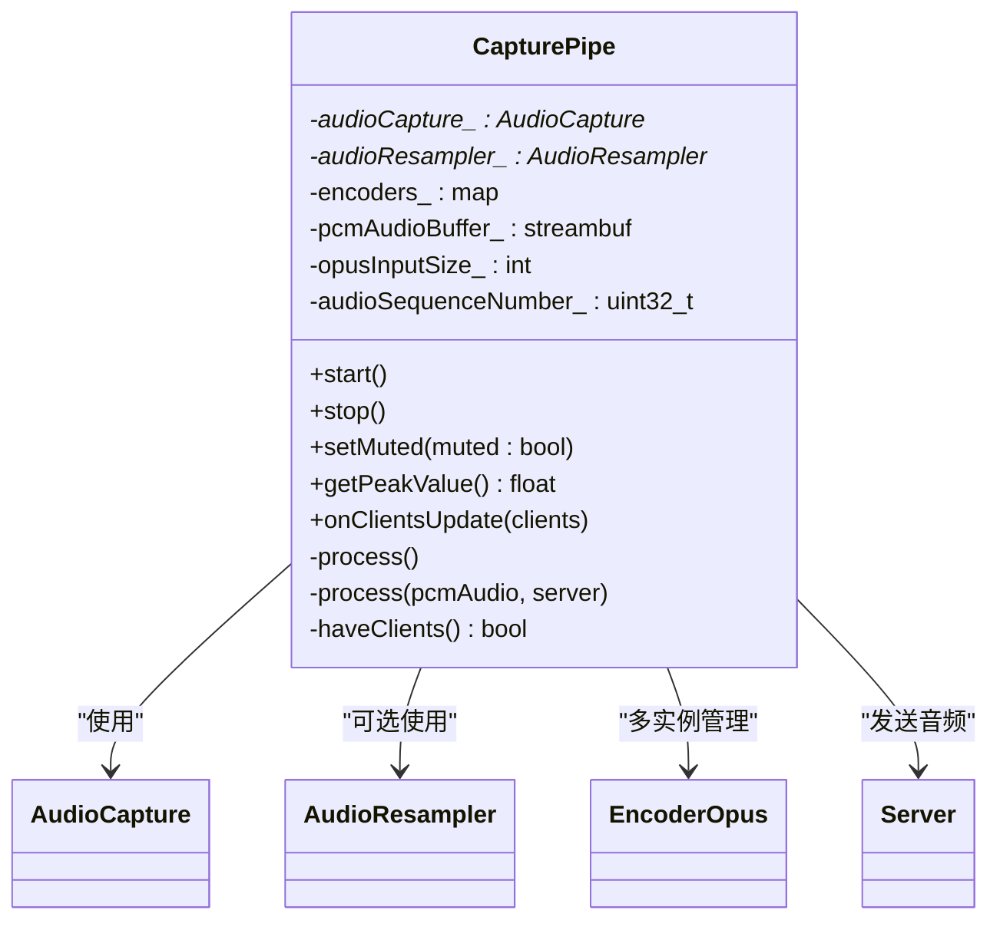
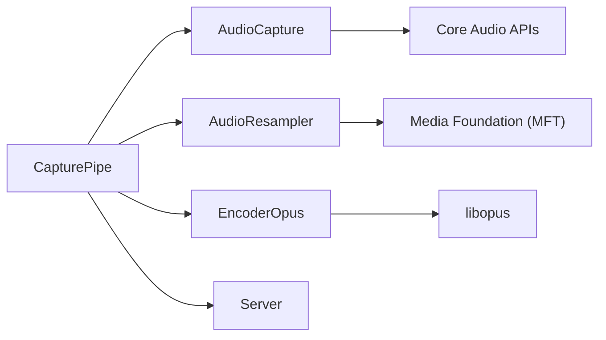
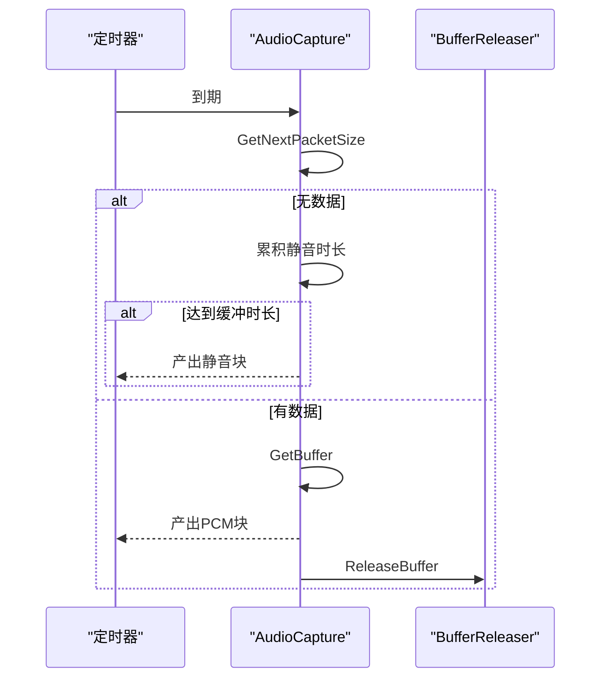
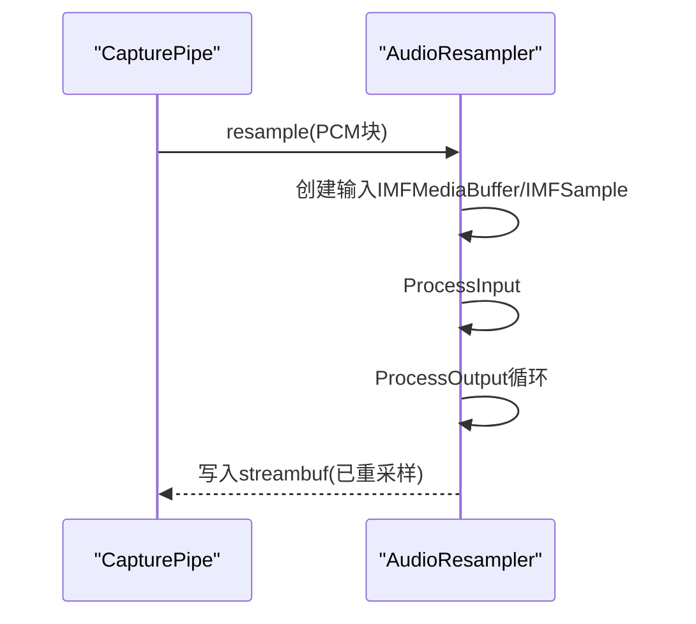
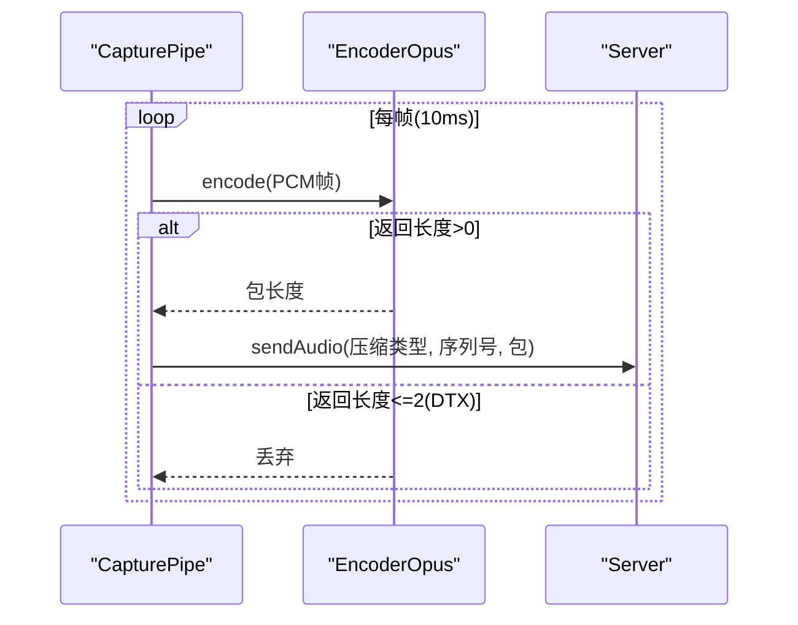

# 音频处理

<cite>
**本文引用的文件**   
- [AudioCapture.cpp](file://SoundRemote/AudioCapture.cpp)
- [AudioCapture.h](file://SoundRemote/AudioCapture.h)
- [AudioResampler.cpp](file://SoundRemote/AudioResampler.cpp)
- [AudioResampler.h](file://SoundRemote/AudioResampler.h)
- [EncoderOpus.cpp](file://SoundRemote/EncoderOpus.cpp)
- [EncoderOpus.h](file://SoundRemote/EncoderOpus.h)
- [CapturePipe.cpp](file://SoundRemote/CapturePipe.cpp)
- [CapturePipe.h](file://SoundRemote/CapturePipe.h)
- [AudioUtil.cpp](file://SoundRemote/AudioUtil.cpp)
- [AudioUtil.h](file://SoundRemote/AudioUtil.h)
- [NetDefines.h](file://SoundRemote/NetDefines.h)
- [README.md](file://README.md)
</cite>

## 目录
1. [简介](#简介)
2. [项目结构](#项目结构)
3. [核心组件](#核心组件)
4. [架构总览](#架构总览)
5. [详细组件分析](#详细组件分析)
6. [依赖关系分析](#依赖关系分析)
7. [性能与延迟优化](#性能与延迟优化)
8. [音频质量调优指南](#音频质量调优指南)
9. [基准测试方法](#基准测试方法)
10. [故障诊断与排错](#故障诊断与排错)
11. [结论](#结论)
12. [附录：关键流程时序图](#附录关键流程时序图)

## 简介
本文件面向 SoundRemote-WinServer 的音频子系统，系统性阐述 Windows Core Audio API 集成、音频捕获机制、格式协商、重采样与编码（Opus）流程，以及实时管道设计、内存管理与延迟优化策略。文档同时提供质量调优建议、性能基准方法与常见问题的诊断技巧，帮助读者快速理解并高效使用该系统。

## 项目结构
音频相关代码集中在 SoundRemote 目录下，围绕“采集—重采样—编码—网络发送”的流水线组织：
- 设备枚举与默认设备获取：AudioUtil.*
- 音频采集与静音补偿：AudioCapture.*
- 重采样（MFT Resampler）：AudioResampler.*
- Opus 编码器封装：EncoderOpus.*
- 音频管道编排与多码率分发：CapturePipe.*
- 网络包定义与类别：NetDefines.h

图表来源
- [AudioUtil.cpp:8-51](file://SoundRemote/AudioUtil.cpp#L8-L51)
- [AudioCapture.cpp:118-214](file://SoundRemote/AudioCapture.cpp#L118-L214)
- [AudioResampler.cpp:11-51](file://SoundRemote/AudioResampler.cpp#L11-L51)
- [EncoderOpus.cpp:10-25](file://SoundRemote/EncoderOpus.cpp#L10-L25)
- [CapturePipe.cpp:40-51](file://SoundRemote/CapturePipe.cpp#L40-L51)
- [NetDefines.h:47-58](file://SoundRemote/NetDefines.h#L47-L58)

章节来源
- [README.md:1-14](file://README.md#L1-L14)

## 核心组件
- 设备与工具层（AudioUtil）
  - 枚举录音/播放端点、获取默认设备、统一错误处理与文本化。
- 采集层（AudioCapture）
  - 基于 Core Audio（IMMDeviceEnumerator、IAudioClient、IAudioCaptureClient）实现共享模式采集；支持回环捕获（渲染流）；内置静音补偿；协程驱动。
- 重采样层（AudioResampler）
  - 基于 Media Foundation Transform（CResamplerMediaObject）进行采样率/位深/声道数转换；设置高质量滤波器参数；输出到 streambuf。
- 编码层（EncoderOpus）
  - 封装 opus_encoder_create/encode，固定帧长（10ms），按目标码率配置；支持 DTX 静默丢弃。
- 管道层（CapturePipe）
  - 协调采集、可选重采样、按客户端需求动态维护多个 Opus 编码器实例，批量分片后通过网络发送；支持静音开关与峰值检测。

章节来源
- [AudioUtil.h:120-126](file://SoundRemote/AudioUtil.h#L120-L126)
- [AudioUtil.cpp:77-101](file://SoundRemote/AudioUtil.cpp#L77-L101)
- [AudioCapture.h:22-78](file://SoundRemote/AudioCapture.h#L22-L78)
- [AudioCapture.cpp:118-214](file://SoundRemote/AudioCapture.cpp#L118-L214)
- [AudioResampler.h:13-23](file://SoundRemote/AudioResampler.h#L13-L23)
- [AudioResampler.cpp:11-51](file://SoundRemote/AudioResampler.cpp#L11-L51)
- [EncoderOpus.h:9-36](file://SoundRemote/EncoderOpus.h#L9-L36)
- [EncoderOpus.cpp:10-46](file://SoundRemote/EncoderOpus.cpp#L10-L46)
- [CapturePipe.h:23-51](file://SoundRemote/CapturePipe.h#L23-L51)
- [CapturePipe.cpp:40-51](file://SoundRemote/CapturePipe.cpp#L40-L51)

## 架构总览
整体采用“生产者-消费者”异步协程模型：
- 采集协程以定时器周期触发，从 IAudioCaptureClient 拉取数据块；若设备未产生数据则填充静音缓冲，保证下游稳定消费。
- 管道根据设备实际支持的格式决定是否启用重采样器，将数据规整为统一的 48kHz 立体声 16bit PCM。
- 编码器池按客户端请求的动态压缩类型维护，逐帧送入对应编码器，生成 Opus 包或透传原始 PCM。
- 网络层通过 Server 接口发送，携带序列号与压缩类别标识。

图表来源
- [AudioCapture.cpp:219-280](file://SoundRemote/AudioCapture.cpp#L219-L280)
- [CapturePipe.cpp:97-155](file://SoundRemote/CapturePipe.cpp#L97-L155)
- [AudioResampler.cpp:60-133](file://SoundRemote/AudioResampler.cpp#L60-L133)
- [EncoderOpus.cpp:27-38](file://SoundRemote/EncoderOpus.cpp#L27-L38)
- [NetDefines.h:47-58](file://SoundRemote/NetDefines.h#L47-L58)

## 详细组件分析

### 设备与工具（AudioUtil）
- 功能要点
  - 枚举指定数据流方向的活跃端点，返回友好名到设备ID映射。
  - 获取系统默认设备ID。
  - 统一 HRESULT 错误抛出/退出与错误文本生成，包含特殊提示（如麦克风访问被拒绝）。
- 复杂度与资源
  - 枚举过程线性遍历设备集合；COM 对象由智能指针管理，避免泄漏。
- 最佳实践
  - 在 UI 线程初始化 COM 环境；对隐私权限错误给出明确提示。

章节来源
- [AudioUtil.cpp:8-51](file://SoundRemote/AudioUtil.cpp#L8-L51)
- [AudioUtil.cpp:53-75](file://SoundRemote/AudioUtil.cpp#L53-L75)
- [AudioUtil.cpp:77-101](file://SoundRemote/AudioUtil.cpp#L77-L101)

### 音频采集（AudioCapture）
- 核心流程
  - 初始化 COM 与 IMMDeviceEnumerator，定位设备并激活 IAudioClient/IAudioMeterInformation。
  - 构造请求格式 WAVEFORMATEXTENSIBLE，调用 IsFormatSupported 协商实际支持格式；若不匹配则记录需重采样。
  - Initialize 共享模式流，获取缓冲区大小并计算实际时长；启动 Start。
  - 协程循环：定时等待→查询下一包长度→若无数据则累积静音时长并按缓冲时长阈值产出静音块；若有数据则 GetBuffer 并 yield。
  - 释放 Buffer 使用 RAII 包装确保异常路径安全。
- 静音补偿
  - 当 GetNextPacketSize 返回 0 时，累计未补偿静音时长，超过一个缓冲时长即产出静音数据，避免下游卡顿。
- 峰值检测
  - 通过 IAudioMeterInformation::GetPeakValue 获取当前峰值（0~1），失败返回 -1。
- 复杂度与内存
  - 每次 GetBuffer 直接引用内核缓冲，yield 后尽快 ReleaseBuffer，降低拷贝与内存占用。
- 注意事项
  - 渲染流（eRender）启用回环标志；捕获流（eCapture）不启用。

图表来源
- [AudioCapture.cpp:118-214](file://SoundRemote/AudioCapture.cpp#L118-L214)
- [AudioCapture.cpp:219-280](file://SoundRemote/AudioCapture.cpp#L219-L280)

章节来源
- [AudioCapture.h:22-78](file://SoundRemote/AudioCapture.h#L22-L78)
- [AudioCapture.cpp:118-214](file://SoundRemote/AudioCapture.cpp#L118-L214)
- [AudioCapture.cpp:219-280](file://SoundRemote/AudioCapture.cpp#L219-L280)

### 重采样（AudioResampler）
- 核心流程
  - 创建 CResamplerMediaObject MFT，设置高质量半滤波器长度（60）。
  - 设置输入/输出 IMFMediaType（由 WAVEFORMATEXTENSIBLE 初始化）。
  - 通知 BeginStreaming/StartOfStream，计算输出缓冲倍数（考虑字节率变化）。
  - resample：将输入 PCM 放入 IMFSample，ProcessInput，循环 ProcessOutput 直到需要更多输入；将连续缓冲写入外部 streambuf。
- 性能与质量
  - 半滤波器长度越大音质越好但 CPU 开销更高；60 为最高档。
  - 输出缓冲按输入大小乘以字节率比例预分配，减少频繁扩容。
- 错误处理
  - 所有 MF 操作均检查 HRESULT 并抛出带位置信息的错误。

章节来源
- [AudioResampler.h:13-23](file://SoundRemote/AudioResampler.h#L13-L23)
- [AudioResampler.cpp:11-51](file://SoundRemote/AudioResampler.cpp#L11-L51)
- [AudioResampler.cpp:60-133](file://SoundRemote/AudioResampler.cpp#L60-L133)

### 编码（EncoderOpus）
- 核心流程
  - 构造时创建 opus_encoder，应用类型为 OPUS_APPLICATION_AUDIO，设置固定码率（来自 Compression 枚举值）。
  - encode：按 10ms 帧长（48kHz=480样本/通道）输入 16bit PCM，输出 Opus 包；返回值≤2 表示 DTX 静默包，可丢弃。
- 参数与约束
  - 帧长固定 10ms；最大包大小按 320kbps 上限估算。
  - 输入尺寸 = 帧样本数 × 声道数 × 2 字节。
- 错误处理
  - 编码失败或超出最大包大小时抛出错误。

章节来源
- [EncoderOpus.h:9-36](file://SoundRemote/EncoderOpus.h#L9-L36)
- [EncoderOpus.cpp:10-46](file://SoundRemote/EncoderOpus.cpp#L10-L46)
- [AudioUtil.h:29-39](file://SoundRemote/AudioUtil.h#L29-L39)

### 管道（CapturePipe）
- 职责
  - 组合 AudioCapture、AudioResampler、EncoderOpus，形成端到端音频管线。
  - 根据客户端压缩能力动态维护编码器池（none 直通 PCM，其他为不同码率的 Opus）。
  - 将统一格式的 PCM 切分为 10ms 帧，逐个编码并发送；维护全局序列号。
- 实时性
  - 使用协程驱动主循环，避免阻塞；仅在必要时执行重采样。
  - 使用 streambuf 作为中间缓冲，按需消费固定大小的帧。
- 控制面
  - setMuted 静音开关；getPeakValue 暴露峰值；onClientsUpdate 响应客户端能力变化。

图表来源
- [CapturePipe.h:23-51](file://SoundRemote/CapturePipe.h#L23-L51)
- [CapturePipe.cpp:40-51](file://SoundRemote/CapturePipe.cpp#L40-L51)
- [CapturePipe.cpp:97-155](file://SoundRemote/CapturePipe.cpp#L97-L155)

章节来源
- [CapturePipe.h:23-51](file://SoundRemote/CapturePipe.h#L23-L51)
- [CapturePipe.cpp:40-51](file://SoundRemote/CapturePipe.cpp#L40-L51)
- [CapturePipe.cpp:97-155](file://SoundRemote/CapturePipe.cpp#L97-L155)

## 依赖关系分析
- 内部依赖
  - CapturePipe 聚合 AudioCapture、AudioResampler、EncoderOpus，并通过 Server 发送数据。
  - AudioCapture 依赖 Core Audio（MMDevice、AudioClient、CaptureClient、MeterInfo）。
  - AudioResampler 依赖 Media Foundation（MFT Resampler）。
  - EncoderOpus 依赖 libopus。
- 外部依赖
  - Boost.Asio（定时器、streambuf、io_context）。
  - Windows SDK（Core Audio/Media Foundation）。
  - vcpkg 管理的 opus 库。

图表来源
- [CapturePipe.cpp:1-12](file://SoundRemote/CapturePipe.cpp#L1-L12)
- [AudioCapture.cpp:1-11](file://SoundRemote/AudioCapture.cpp#L1-L11)
- [AudioResampler.cpp:1-9](file://SoundRemote/AudioResampler.cpp#L1-L9)
- [EncoderOpus.cpp:1-8](file://SoundRemote/EncoderOpus.cpp#L1-L8)

章节来源
- [CapturePipe.cpp:1-12](file://SoundRemote/CapturePipe.cpp#L1-L12)

## 性能与延迟优化
- 采集与静音补偿
  - 定时器周期设为缓冲时长的一半，既保证及时消费又避免频繁唤醒；静音补偿阈值等于缓冲时长，防止下游饥饿。
- 重采样
  - 仅当设备不支持请求格式时才启用；输出缓冲按字节率比例放大，减少二次分配。
- 编码
  - 固定 10ms 帧长平衡延迟与效率；DTX 静默包丢弃降低带宽。
- 内存
  - 采集阶段尽量零拷贝（直接 yield 内核缓冲指针）；重采样与编码阶段使用局部 buffer 与 streambuf 复用。
- 并发
  - 协程驱动主循环，避免阻塞；网络发送在独立线程上下文（由 io_context 调度）。

[本节为通用指导，无需源码引用]

## 音频质量调优指南
- 重采样质量
  - 半滤波器长度设置为最高（60）以获得最佳音质；CPU 占用相应增加。
- 采样率与声道
  - 统一输出 48kHz 立体声 16bit，便于编码器工作并兼容多数客户端。
- 码率选择
  - 根据网络条件与音质需求选择 64/128/192/256/320 kbps；语音为主建议 ≥128kbps，音乐/高保真建议 ≥192kbps。
- 帧长
  - 固定 10ms，兼顾低延迟与编码效率；如需更低延迟可考虑 5ms（需调整帧大小计算与缓冲策略）。
- 静音处理
  - 保持静音补偿逻辑，避免网络抖动导致的断续。

章节来源
- [AudioResampler.cpp:20-25](file://SoundRemote/AudioResampler.cpp#L20-L25)
- [AudioUtil.h:29-39](file://SoundRemote/AudioUtil.h#L29-L39)
- [EncoderOpus.cpp:10-25](file://SoundRemote/EncoderOpus.cpp#L10-L25)

## 基准测试方法
- 指标
  - 端到端延迟（采集到网络发出）、CPU 占用、内存峰值、丢包/重传影响下的稳定性。
- 方法
  - 使用高精度计时器测量从 GetBuffer 到 sendAudio 的时间跨度。
  - 在不同码率与网络条件下对比平均/尾延迟（P95/P99）。
  - 监控编码器 DTX 丢弃比例与网络负载。
- 工具
  - Windows Performance Toolkit、Visual Studio Profiler、自定义日志埋点。

[本节为通用指导，无需源码引用]

## 故障诊断与排错
- 常见问题
  - 麦克风访问被拒绝：系统隐私设置中允许应用访问麦克风。
  - 设备不支持请求格式：自动降级至混合格式并启用重采样。
  - 编码失败或包过大：检查输入帧大小与最大包大小常量是否匹配。
- 定位手段
  - 利用 Location 枚举与错误文本函数快速定位失败阶段。
  - 观察 getPeakValue 是否为 -1 判断采集链路是否正常。
- 恢复策略
  - 对网络异常与设备热插拔进行重试与重建；管道停止/重启需销毁协程并清理资源。

章节来源
- [AudioUtil.cpp:93-101](file://SoundRemote/AudioUtil.cpp#L93-L101)
- [AudioCapture.cpp:156-185](file://SoundRemote/AudioCapture.cpp#L156-L185)
- [EncoderOpus.cpp:27-38](file://SoundRemote/EncoderOpus.cpp#L27-L38)
- [CapturePipe.cpp:113-118](file://SoundRemote/CapturePipe.cpp#L113-L118)

## 结论
该音频子系统以 Core Audio 为基础，结合 Media Foundation 重采样与 Opus 编码，构建了低延迟、可扩展的实时音频管道。通过协程驱动的采集与静音补偿、按客户端能力动态维护编码器池、以及严格的错误处理与资源管理，系统在复杂环境下仍能保持稳定与高质量传输。后续可在帧长、码率自适应与更精细的延迟度量方面持续优化。

[本节为总结，无需源码引用]

## 附录：关键流程时序图

### 采集与静音补偿时序

图表来源
- [AudioCapture.cpp:219-280](file://SoundRemote/AudioCapture.cpp#L219-L280)

### 重采样处理时序

图表来源
- [AudioResampler.cpp:60-133](file://SoundRemote/AudioResampler.cpp#L60-L133)

### 编码与发送时序

图表来源
- [EncoderOpus.cpp:27-38](file://SoundRemote/EncoderOpus.cpp#L27-L38)
- [CapturePipe.cpp:124-155](file://SoundRemote/CapturePipe.cpp#L124-L155)
- [NetDefines.h:47-58](file://SoundRemote/NetDefines.h#L47-L58)