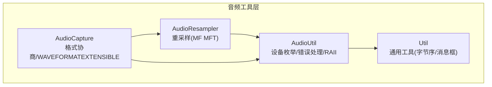
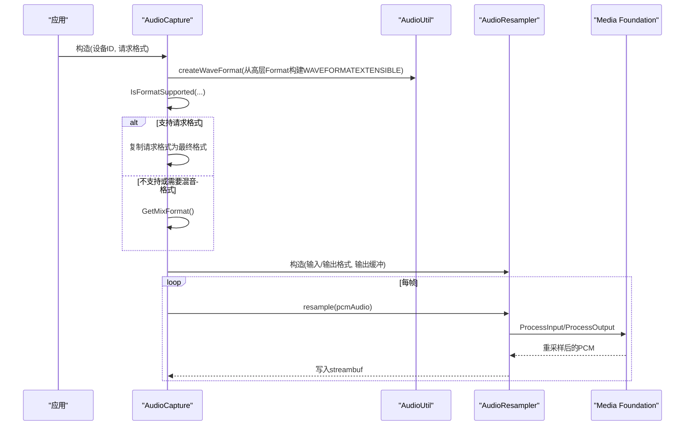
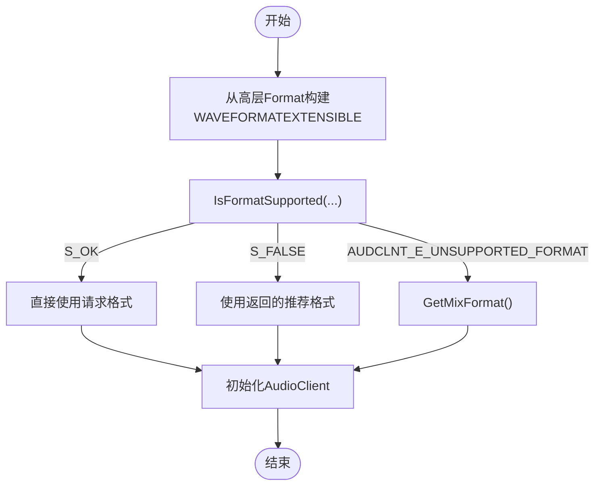
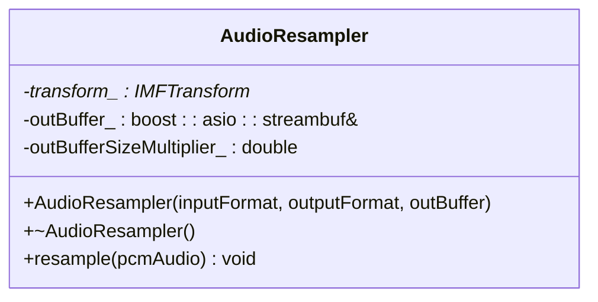
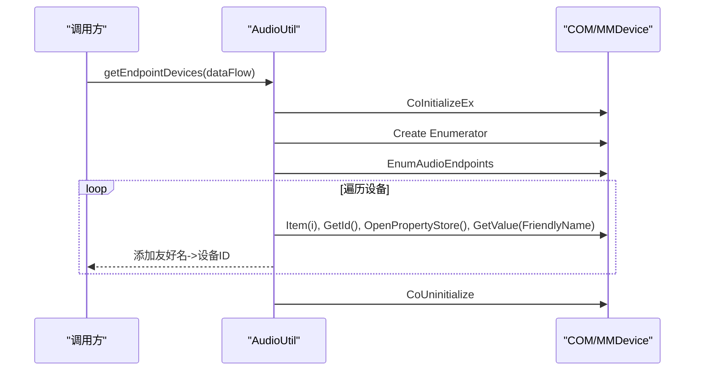
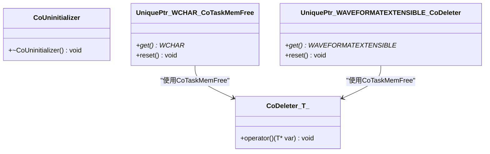
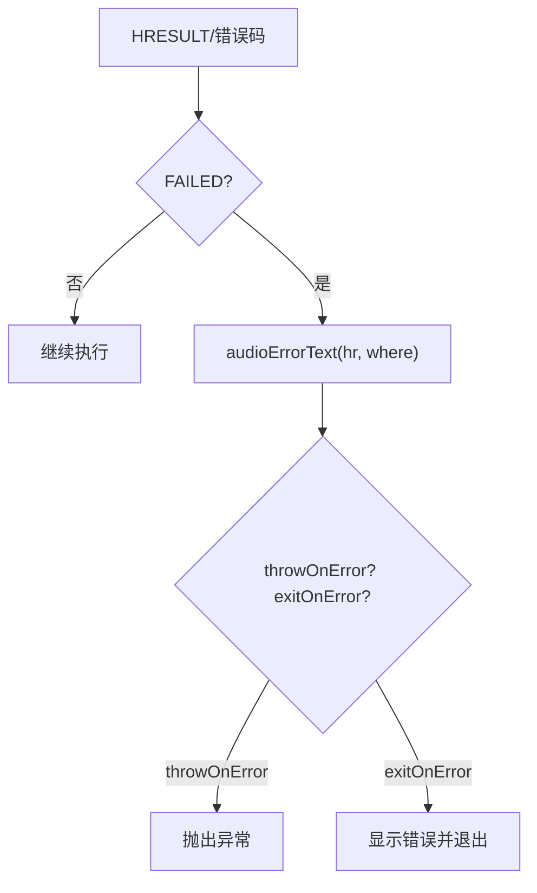
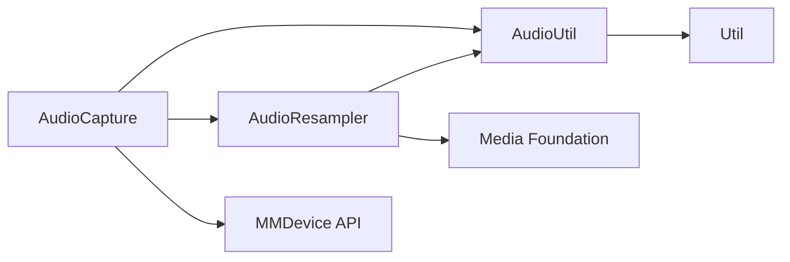

# 音频工具函数

<cite>
**本文引用的文件**
- [AudioUtil.h](file://SoundRemote/AudioUtil.h)
- [AudioUtil.cpp](file://SoundRemote/AudioUtil.cpp)
- [AudioResampler.h](file://SoundRemote/AudioResampler.h)
- [AudioResampler.cpp](file://SoundRemote/AudioResampler.cpp)
- [AudioCapture.cpp](file://SoundRemote/AudioCapture.cpp)
- [Util.h](file://SoundRemote/Util.h)
</cite>

## 目录
1. [简介](#简介)
2. [项目结构](#项目结构)
3. [核心组件](#核心组件)
4. [架构总览](#架构总览)
5. [详细组件分析](#详细组件分析)
6. [依赖关系分析](#依赖关系分析)
7. [性能考量](#性能考量)
8. [故障排查指南](#故障排查指南)
9. [结论](#结论)
10. [附录](#附录)

## 简介
本文件聚焦于 SoundRemote-WinServer 的音频工具函数模块，围绕以下目标展开：
- 音频格式转换与 WAVEFORMATEXTENSIBLE 结构操作
- 音频数据处理工具函数（采样率、声道数、位深、字节序等）
- CoDeleter 智能指针删除器与 RAII 资源管理模式
- 音频格式验证、兼容性检查与格式协商辅助流程
- 音频数据转换、字节序处理与内存操作的实用模式
- Windows 音频 API 常用操作与最佳实践
- 常见开发模式示例与性能优化建议

## 项目结构
该模块位于 SoundRemote 子项目中，关键源文件如下：
- AudioUtil.h/.cpp：通用音频工具、错误处理、设备枚举、RAII 辅助
- AudioResampler.h/.cpp：基于 Media Foundation 的重采样器封装
- AudioCapture.cpp：捕获端格式协商、WAVEFORMATEXTENSIBLE 构建与使用
- Util.h：通用工具（含字节序枚举、错误提示等）

图表来源
- [AudioUtil.h:1-170](file://SoundRemote/AudioUtil.h#L1-L170)
- [AudioUtil.cpp:1-102](file://SoundRemote/AudioUtil.cpp#L1-L102)
- [AudioResampler.h:1-24](file://SoundRemote/AudioResampler.h#L1-L24)
- [AudioResampler.cpp:1-134](file://SoundRemote/AudioResampler.cpp#L1-L134)
- [AudioCapture.cpp:45-244](file://SoundRemote/AudioCapture.cpp#L45-L244)
- [Util.h:1-70](file://SoundRemote/Util.h#L1-L70)

章节来源
- [AudioUtil.h:1-170](file://SoundRemote/AudioUtil.h#L1-L170)
- [AudioUtil.cpp:1-102](file://SoundRemote/AudioUtil.cpp#L1-L102)
- [AudioResampler.h:1-24](file://SoundRemote/AudioResampler.h#L1-L24)
- [AudioResampler.cpp:1-134](file://SoundRemote/AudioResampler.cpp#L1-L134)
- [AudioCapture.cpp:45-244](file://SoundRemote/AudioCapture.cpp#L45-L244)
- [Util.h:1-70](file://SoundRemote/Util.h#L1-L70)

## 核心组件
- 音频格式描述与类型
  - Format：包含采样率、声道数、位深、采样数据类型、字节序等字段，作为高层格式抽象。
  - SampleType：定义 PCM 整数/浮点等采样类型。
  - Opus 常量：用于编码侧帧长与最大包大小计算。
- RAII 与智能指针删除器
  - CoDeleter<T>：以 CoTaskMemFree 为释放策略的智能指针删除器，确保 COM 分配内存正确释放。
  - CoUninitializer：在析构时调用 CoUninitialize，管理 COM 线程初始化生命周期。
- 设备与默认设备枚举
  - getEndpointDevices：枚举活动音频端点并返回友好名到设备 ID 的映射。
  - getDefaultDevice：获取指定数据流方向的默认设备 ID。
- 错误处理
  - throwOnError/exitOnError/processError/audioErrorText：统一 HRESULT 错误处理与用户可见的错误文本生成。

章节来源
- [AudioUtil.h:24-170](file://SoundRemote/AudioUtil.h#L24-L170)
- [AudioUtil.cpp:8-102](file://SoundRemote/AudioUtil.cpp#L8-L102)
- [Util.h:10-70](file://SoundRemote/Util.h#L10-L70)

## 架构总览
音频工具层提供“设备发现 + 格式协商 + 重采样 + 错误处理”的基础能力，上层捕获/渲染逻辑通过组合这些能力完成端到端音频管线。

图表来源
- [AudioCapture.cpp:151-214](file://SoundRemote/AudioCapture.cpp#L151-L214)
- [AudioResampler.cpp:11-51](file://SoundRemote/AudioResampler.cpp#L11-L51)
- [AudioResampler.cpp:60-133](file://SoundRemote/AudioResampler.cpp#L60-L133)

## 详细组件分析

### 组件一：音频格式与 WAVEFORMATEXTENSIBLE 操作
- 高层格式到系统格式的转换
  - 通过 createWaveFormat 将高层 Format 转换为 WAVEFORMATEXTENSIBLE，设置声道掩码、有效位深、SubFormat 等关键字段。
  - 根据采样类型选择 PCM 或 IEEE_FLOAT 子格式；根据声道数选择单声道/立体声掩码。
- 格式协商
  - 使用 IsFormatSupported 判断是否可直接使用请求格式；若返回 S_FALSE，则使用返回的推荐格式；若返回 AUDCLNT_E_UNSUPPORTED_FORMAT，则回退到 GetMixFormat。
- 内存管理
  - 使用 CoTaskMemAlloc 分配 WAVEFORMATEXTENSIBLE，并通过智能指针包装（如 std::unique_ptr<WCHAR, decltype(&CoTaskMemFree)> 或自定义 CoDeleter）确保释放。

图表来源
- [AudioCapture.cpp:52-88](file://SoundRemote/AudioCapture.cpp#L52-L88)
- [AudioCapture.cpp:156-185](file://SoundRemote/AudioCapture.cpp#L156-L185)

章节来源
- [AudioCapture.cpp:45-120](file://SoundRemote/AudioCapture.cpp#L45-L120)
- [AudioCapture.cpp:151-214](file://SoundRemote/AudioCapture.cpp#L151-L214)

### 组件二：重采样器（基于 Media Foundation）
- 初始化流程
  - 创建 CResamplerMediaObject，查询 IMFTransform 与 IWMResamplerProps，设置高质量参数（半滤波器长度）。
  - 使用 MFInitMediaTypeFromWaveFormatEx 从 WAVEFORMATEXTENSIBLE 初始化输入/输出媒体类型，并设置到变换对象。
  - 发送 BEGIN_STREAMING 与 START_OF_STREAM 消息启动流。
- 处理流程
  - 将输入 PCM 数据放入 IMFMediaBuffer，再包装为 IMFSample，调用 ProcessInput。
  - 循环调用 ProcessOutput，必要时由客户端分配输出缓冲区；将结果转换为连续缓冲区后写入外部 streambuf。
- 尺寸估算
  - 根据输入/输出的平均字节速率计算输出缓冲倍数，避免频繁扩容。

图表来源
- [AudioResampler.h:13-23](file://SoundRemote/AudioResampler.h#L13-L23)
- [AudioResampler.cpp:11-51](file://SoundRemote/AudioResampler.cpp#L11-L51)
- [AudioResampler.cpp:60-133](file://SoundRemote/AudioResampler.cpp#L60-L133)

章节来源
- [AudioResampler.h:1-24](file://SoundRemote/AudioResampler.h#L1-L24)
- [AudioResampler.cpp:1-134](file://SoundRemote/AudioResampler.cpp#L1-L134)

### 组件三：设备枚举与默认设备
- 设备枚举
  - 初始化 COM，创建 IMMDeviceEnumerator，枚举活动端点，遍历每个设备获取设备 ID 与友好名称，填充映射表。
  - 对 CoTaskMemAlloc 的设备 ID 字符串使用智能指针自动释放。
- 默认设备
  - 通过 GetDefaultAudioEndpoint 获取默认设备 ID，注意手动释放返回的 LPWSTR。

图表来源
- [AudioUtil.cpp:8-51](file://SoundRemote/AudioUtil.cpp#L8-L51)

章节来源
- [AudioUtil.cpp:8-75](file://SoundRemote/AudioUtil.cpp#L8-L75)

### 组件四：RAII 与智能指针删除器（CoDeleter/CoUninitializer）
- CoDeleter<T>
  - 作为 std::unique_ptr 的自定义删除器，内部调用 CoTaskMemFree，适用于所有由 COM 分配的内存块（如 WAVEFORMATEX/WAVEFORMATEXTENSIBLE、LPWSTR 等）。
- CoUninitializer
  - 栈上对象析构时调用 CoUninitialize，保证 COM 线程环境正确清理。
- 典型用法
  - 使用 std::unique_ptr<WCHAR, decltype(&CoTaskMemFree)> 包裹设备 ID 字符串。
  - 使用 std::unique_ptr<WAVEFORMATEXTENSIBLE, Audio::CoDeleter<WAVEFORMATEXTENSIBLE>> 管理格式结构体。

图表来源
- [AudioUtil.h:135-147](file://SoundRemote/AudioUtil.h#L135-L147)
- [AudioUtil.cpp:35-36](file://SoundRemote/AudioUtil.cpp#L35-L36)
- [AudioUtil.cpp:72-74](file://SoundRemote/AudioUtil.cpp#L72-L74)

章节来源
- [AudioUtil.h:135-147](file://SoundRemote/AudioUtil.h#L135-L147)
- [AudioUtil.cpp:35-36](file://SoundRemote/AudioUtil.cpp#L35-L36)
- [AudioUtil.cpp:72-74](file://SoundRemote/AudioUtil.cpp#L72-L74)

### 组件五：错误处理与诊断
- 统一入口
  - throwOnError：失败时抛出带位置信息的异常。
  - exitOnError：失败时显示错误并终止进程。
  - processError：针对非 HRESULT 错误码进行包装。
- 错误文本
  - audioErrorText：根据 Location 与 HRESULT 生成可读信息，包含特殊场景（如麦克风访问被拒绝）的友好提示。

图表来源
- [AudioUtil.cpp:77-101](file://SoundRemote/AudioUtil.cpp#L77-L101)

章节来源
- [AudioUtil.cpp:77-101](file://SoundRemote/AudioUtil.cpp#L77-L101)

## 依赖关系分析
- 模块内依赖
  - AudioResampler 依赖 AudioUtil 的错误处理与 RAII 工具。
  - AudioCapture 依赖 AudioUtil 的 RAII 与错误处理，并在格式协商阶段使用 WAVEFORMATEXTENSIBLE。
- 外部依赖
  - Media Foundation（IMFTransform、CResamplerMediaObject、MFCreateMediaType 等）
  - MMDevice API（IMMDeviceEnumerator、IAudioClient、IAudioCaptureClient 等）
  - ATL 智能指针（CComPtr）简化 COM 引用计数管理

图表来源
- [AudioUtil.h:1-170](file://SoundRemote/AudioUtil.h#L1-L170)
- [AudioResampler.h:1-24](file://SoundRemote/AudioResampler.h#L1-L24)
- [AudioResampler.cpp:1-134](file://SoundRemote/AudioResampler.cpp#L1-L134)
- [AudioCapture.cpp:45-244](file://SoundRemote/AudioCapture.cpp#L45-L244)

章节来源
- [AudioUtil.h:1-170](file://SoundRemote/AudioUtil.h#L1-L170)
- [AudioResampler.h:1-24](file://SoundRemote/AudioResampler.h#L1-L24)
- [AudioResampler.cpp:1-134](file://SoundRemote/AudioResampler.cpp#L1-L134)
- [AudioCapture.cpp:45-244](file://SoundRemote/AudioCapture.cpp#L45-L244)

## 性能考量
- 重采样缓冲预估
  - 依据输入/输出平均字节速率计算输出缓冲倍数，减少动态扩容开销。
- 零拷贝路径
  - 尽可能复用 buffer，避免不必要的中间拷贝；在重采样输出阶段直接写入外部 streambuf。
- 线程模型
  - COM 使用多线程初始化，避免跨线程同步问题；重采样过程尽量保持短小、可流水线化。
- 格式选择
  - 优先使用设备支持的格式以避免重采样；当必须重采样时，选择合适的采样率与位深以降低 CPU 占用。

[本节为通用指导，不直接分析具体文件]

## 故障排查指南
- 麦克风访问被拒绝
  - 现象：初始化捕获时返回特定错误码。
  - 处理：audioErrorText 会给出隐私设置相关提示；引导用户在系统隐私设置中允许麦克风访问。
- 格式不支持
  - 现象：IsFormatSupported 返回不支持或需混音格式。
  - 处理：回退到 GetMixFormat 或推荐的兼容格式，必要时启用重采样。
- 内存泄漏风险
  - 现象：未释放 CoTaskMemAlloc 分配的内存。
  - 处理：使用 CoDeleter 或 std::unique_ptr 配合 CoTaskMemFree 的删除器，确保 RAII 语义。

章节来源
- [AudioUtil.cpp:93-101](file://SoundRemote/AudioUtil.cpp#L93-L101)
- [AudioCapture.cpp:156-185](file://SoundRemote/AudioCapture.cpp#L156-L185)
- [AudioUtil.h:135-147](file://SoundRemote/AudioUtil.h#L135-L147)

## 结论
音频工具函数模块通过统一的 RAII 与错误处理机制，结合 Media Foundation 重采样与 MMDevice API 的格式协商，提供了稳定高效的音频采集与处理能力。遵循本文的最佳实践与模式，可在不同设备上获得一致的音频体验，同时降低内存与性能风险。

[本节为总结性内容，不直接分析具体文件]

## 附录

### 音频格式标准参考
- WAVEFORMATEXTENSIBLE
  - 关键字段：Format.nChannels、nSamplesPerSec、wBitsPerSample、nBlockAlign、nAvgBytesPerSec、wFormatTag、Samples.wValidBitsPerSample、dwChannelMask、SubFormat。
  - 用途：扩展 WAVEFORMATEX，支持多声道掩码与浮点采样等高级特性。
- 采样类型
  - PCM 整数（SignedInt/UnSignedInt）、IEEE_FLOAT。
- 声道掩码
  - KSAUDIO_SPEAKER_MONO、KSAUDIO_SPEAKER_STEREO 等。

章节来源
- [AudioCapture.cpp:52-88](file://SoundRemote/AudioCapture.cpp#L52-L88)
- [AudioUtil.h:120-126](file://SoundRemote/AudioUtil.h#L120-L126)

### Windows 音频 API 常用操作
- 设备枚举：IMMDeviceEnumerator::EnumAudioEndpoints
- 默认设备：IMMDeviceEnumerator::GetDefaultAudioEndpoint
- 格式协商：IAudioClient::IsFormatSupported / GetMixFormat
- 初始化与缓冲：IAudioClient::Initialize / GetBufferSize
- 数据读取：IAudioCaptureClient::GetNextPacketSize / GetBuffer / ReleaseBuffer

章节来源
- [AudioUtil.cpp:8-75](file://SoundRemote/AudioUtil.cpp#L8-L75)
- [AudioCapture.cpp:151-214](file://SoundRemote/AudioCapture.cpp#L151-L214)

### 常见模式与最佳实践
- RAII 管理 COM 内存
  - 使用 CoDeleter 或 unique_ptr 包裹 CoTaskMemAlloc 的结果，避免手动释放遗漏。
- 错误处理一致性
  - 集中式 throwOnError/exitOnError，统一错误文本生成，便于定位与调试。
- 格式协商策略
  - 先尝试请求格式，其次接受推荐格式，最后回退到混音格式；必要时启用重采样。
- 重采样质量与性能平衡
  - 调整半滤波器长度以获得更高质量的转换；合理预估输出缓冲大小以减少拷贝与扩容。

章节来源
- [AudioUtil.h:135-147](file://SoundRemote/AudioUtil.h#L135-L147)
- [AudioUtil.cpp:77-101](file://SoundRemote/AudioUtil.cpp#L77-L101)
- [AudioResampler.cpp:20-25](file://SoundRemote/AudioResampler.cpp#L20-L25)
- [AudioResampler.cpp:49-51](file://SoundRemote/AudioResampler.cpp#L49-L51)