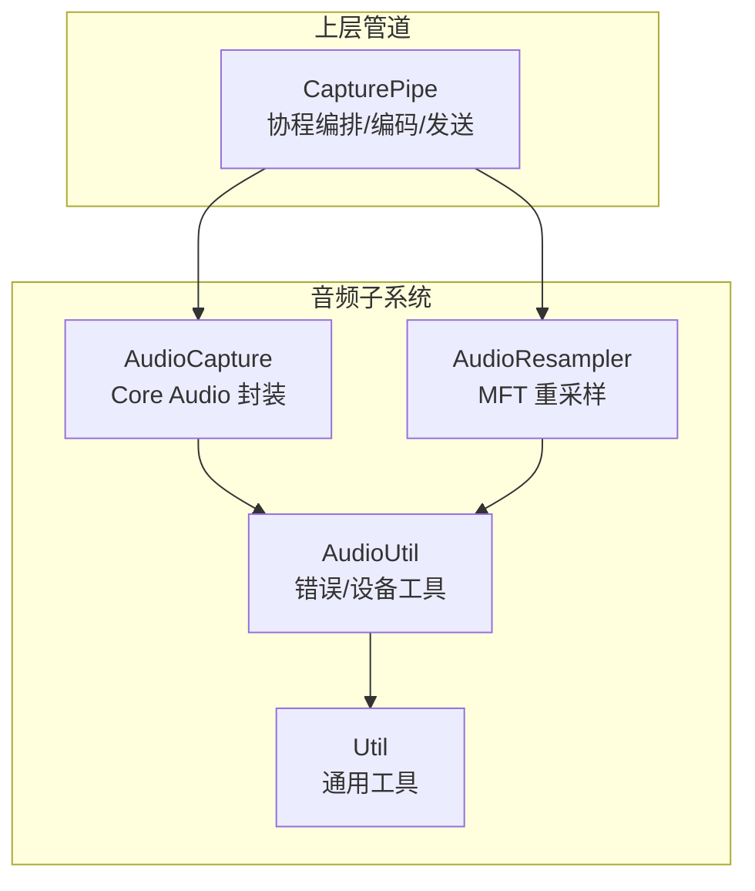
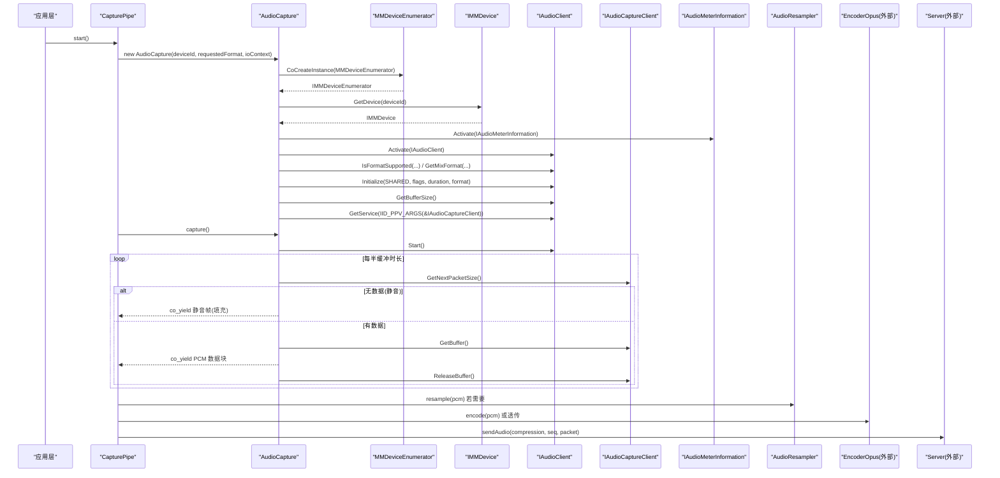
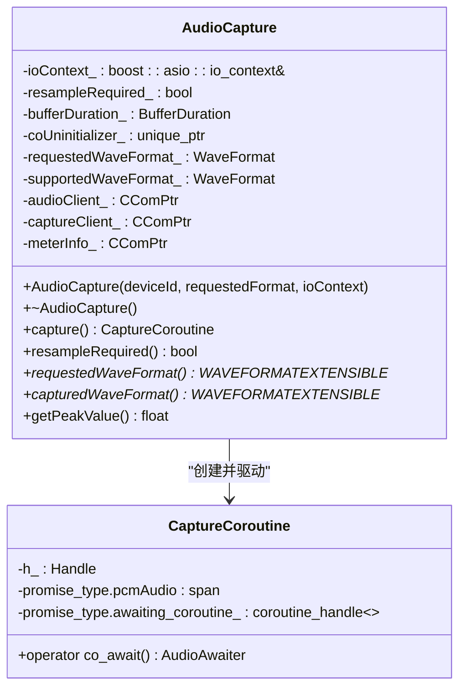
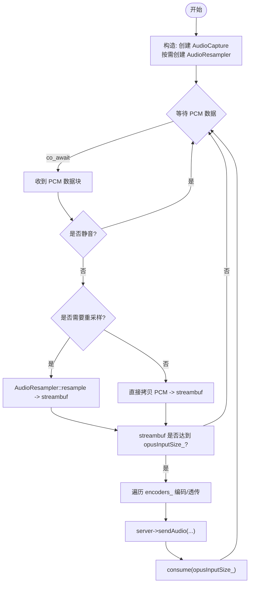
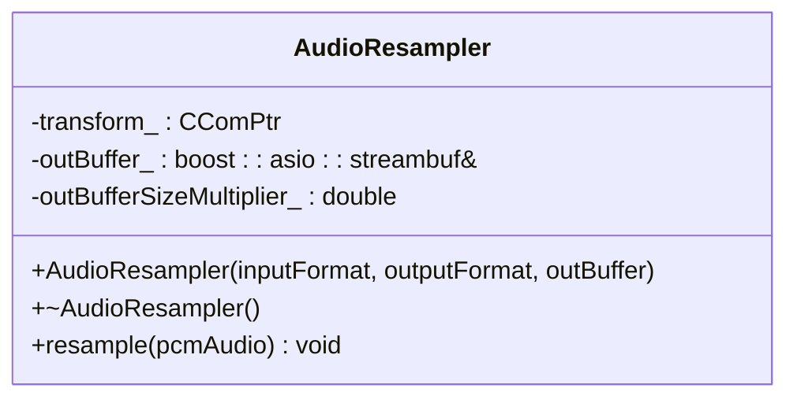
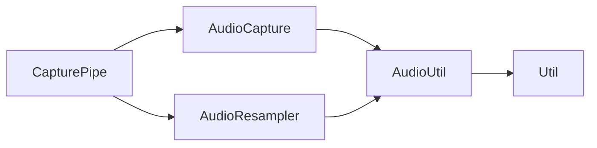

# 音频捕获

<cite>
**本文引用的文件**   
- [AudioCapture.h](file://SoundRemote/AudioCapture.h)
- [AudioCapture.cpp](file://SoundRemote/AudioCapture.cpp)
- [AudioUtil.h](file://SoundRemote/AudioUtil.h)
- [AudioUtil.cpp](file://SoundRemote/AudioUtil.cpp)
- [AudioResampler.h](file://SoundRemote/AudioResampler.h)
- [AudioResampler.cpp](file://SoundRemote/AudioResampler.cpp)
- [CapturePipe.h](file://SoundRemote/CapturePipe.h)
- [CapturePipe.cpp](file://SoundRemote/CapturePipe.cpp)
- [Util.h](file://SoundRemote/Util.h)
- [Util.cpp](file://SoundRemote/Util.cpp)
</cite>

## 目录
1. [简介](#简介)
2. [项目结构](#项目结构)
3. [核心组件](#核心组件)
4. [架构总览](#架构总览)
5. [详细组件分析](#详细组件分析)
6. [依赖关系分析](#依赖关系分析)
7. [性能与延迟特性](#性能与延迟特性)
8. [故障排查指南](#故障排查指南)
9. [结论](#结论)
10. [附录：最佳实践与调试技巧](#附录最佳实践与调试技巧)

## 简介
本文件聚焦于 SoundRemote-WinServer 的音频捕获模块，系统性阐述其基于 Windows Core Audio API 的实现细节，包括 IAudioClient、IAudioCaptureClient 和 IAudioMeterInformation 的使用；设备枚举与格式协商流程；C++20 协程在音频数据流中的设计；缓冲区管理、延迟控制与峰值检测机制；以及音频格式转换、错误处理与资源管理的最佳实践。文档同时提供面向实际使用的代码片段路径与调试建议，帮助读者快速定位问题并优化性能。

## 项目结构
音频捕获相关代码主要分布在以下文件中：
- 音频捕获核心：AudioCapture.h/.cpp
- 工具与错误处理：AudioUtil.h/.cpp、Util.h/.cpp
- 重采样（格式转换）：AudioResampler.h/.cpp
- 上层管道编排：CapturePipe.h/.cpp

图表来源
- [AudioCapture.h:22-78](file://SoundRemote/AudioCapture.h#L22-L78)
- [AudioCapture.cpp:118-214](file://SoundRemote/AudioCapture.cpp#L118-L214)
- [AudioResampler.h:13-23](file://SoundRemote/AudioResampler.h#L13-L23)
- [AudioResampler.cpp:11-51](file://SoundRemote/AudioResampler.cpp#L11-L51)
- [AudioUtil.h:120-169](file://SoundRemote/AudioUtil.h#L120-L169)
- [AudioUtil.cpp:77-101](file://SoundRemote/AudioUtil.cpp#L77-L101)
- [CapturePipe.h:23-51](file://SoundRemote/CapturePipe.h#L23-L51)
- [CapturePipe.cpp:40-51](file://SoundRemote/CapturePipe.cpp#L40-L51)

章节来源
- [AudioCapture.h:22-78](file://SoundRemote/AudioCapture.h#L22-L78)
- [AudioCapture.cpp:118-214](file://SoundRemote/AudioCapture.cpp#L118-L214)
- [AudioResampler.h:13-23](file://SoundRemote/AudioResampler.h#L13-L23)
- [AudioResampler.cpp:11-51](file://SoundRemote/AudioResampler.cpp#L11-L51)
- [AudioUtil.h:120-169](file://SoundRemote/AudioUtil.h#L120-L169)
- [AudioUtil.cpp:77-101](file://SoundRemote/AudioUtil.cpp#L77-L101)
- [CapturePipe.h:23-51](file://SoundRemote/CapturePipe.h#L23-L51)
- [CapturePipe.cpp:40-51](file://SoundRemote/CapturePipe.cpp#L40-L51)

## 核心组件
- AudioCapture：封装 Windows Core Audio 的 IAudioClient、IAudioCaptureClient、IAudioMeterInformation，负责设备激活、格式协商、缓冲初始化、周期读取与静音补偿，并提供 C++20 协程接口 capture()。
- CapturePipe：将音频捕获与后续处理（可选重采样、Opus 编码、网络发送）通过协程串联，管理编码器集合与静音开关。
- AudioResampler：基于 Media Foundation Transform (MFT) 的重采样器，用于将设备实际输出格式转换为请求的目标格式。
- AudioUtil：统一的错误处理、设备枚举与默认设备获取等工具函数。
- Util：通用 UI 提示与文本构造工具。

章节来源
- [AudioCapture.h:22-78](file://SoundRemote/AudioCapture.h#L22-L78)
- [CapturePipe.h:23-51](file://SoundRemote/CapturePipe.h#L23-L51)
- [AudioResampler.h:13-23](file://SoundRemote/AudioResampler.h#L13-L23)
- [AudioUtil.h:120-169](file://SoundRemote/AudioUtil.h#L120-L169)
- [Util.h:10-62](file://SoundRemote/Util.h#L10-L62)

## 架构总览
下图展示了从设备到上层管道的整体数据流与关键交互点。

图表来源
- [AudioCapture.cpp:118-214](file://SoundRemote/AudioCapture.cpp#L118-L214)
- [AudioCapture.cpp:219-280](file://SoundRemote/AudioCapture.cpp#L219-L280)
- [CapturePipe.cpp:97-155](file://SoundRemote/CapturePipe.cpp#L97-L155)
- [AudioResampler.cpp:60-133](file://SoundRemote/AudioResampler.cpp#L60-L133)

## 详细组件分析

### AudioCapture：Windows Core Audio 集成与协程化捕获
- 设备与 COM 初始化
  - 使用 CoInitializeEx 初始化 COM 线程环境，并通过 RAII 对象确保析构时调用 CoUninitialize。
  - 通过 IMMDeviceEnumerator 获取指定 deviceId 的 IMMDevice，并激活 IAudioMeterInformation 与 IAudioClient。
- 端点方向判断
  - 查询 IMMEndpoint::GetDataFlow 以区分 eRender 与 eCapture，从而设置 AUDCLNT_STREAMFLAGS_LOOPBACK 标志（渲染回环）或留空（真实采集）。
- 格式协商
  - 构造请求的 WAVEFORMATEXTENSIBLE，调用 IAudioClient::IsFormatSupported 检查是否支持。
  - 若不支持，根据返回码选择已提供的 supportedWaveFormat 或通过 GetMixFormat 获取系统混音格式。
  - 记录是否需要重采样 resampleRequired_。
- 初始化与缓冲
  - 调用 Initialize 传入共享模式、流标志、请求时长（此处为 0）、目标格式。
  - 通过 GetBufferSize 计算实际缓冲时长 bufferDuration_，作为定时器周期的一半。
  - 通过 GetService 获取 IAudioCaptureClient。
- 协程化捕获循环
  - 启动后，按 timerPeriod = bufferDuration_/2 定时触发。
  - 使用 IAudioCaptureClient::GetNextPacketSize 轮询数据包长度。
  - 静音补偿：当连续多个周期无数据时，向协程 yield 预先生成的静音帧，避免下游断流。
  - 有数据时，GetBuffer 获取指针与帧数，RAII BufferReleaser 保证 ReleaseBuffer 被调用。
  - 通过 co_yield 将 PCM 数据块传递给上层协程。
- 峰值检测
  - getPeakValue 调用 IAudioMeterInformation::GetPeakValue，失败时返回 -1。

图表来源
- [AudioCapture.h:22-78](file://SoundRemote/AudioCapture.h#L22-L78)
- [AudioCapture.h:80-143](file://SoundRemote/AudioCapture.h#L80-L143)
- [AudioCapture.cpp:118-214](file://SoundRemote/AudioCapture.cpp#L118-L214)
- [AudioCapture.cpp:219-280](file://SoundRemote/AudioCapture.cpp#L219-L280)

章节来源
- [AudioCapture.h:22-78](file://SoundRemote/AudioCapture.h#L22-L78)
- [AudioCapture.h:80-143](file://SoundRemote/AudioCapture.h#L80-L143)
- [AudioCapture.cpp:118-214](file://SoundRemote/AudioCapture.cpp#L118-L214)
- [AudioCapture.cpp:219-280](file://SoundRemote/AudioCapture.cpp#L219-L280)

### CapturePipe：协程编排与数据处理流水线
- 构造阶段
  - 创建 AudioCapture，并根据 resampleRequired() 决定是否创建 AudioResampler，将输入格式设为设备实际输出格式，输出格式设为请求格式。
  - 计算 Opus 输入帧大小 opusInputSize_，用于批量处理。
- 运行阶段
  - process() 协程持续 co_await 来自 AudioCapture 的 PCM 数据块。
  - 若未静音且有客户端，则进入 process(pcm, server)：
    - 如需重采样，调用 AudioResampler::resample 将数据写入 streambuf。
    - 否则直接将 PCM 拷贝进 streambuf。
    - 当 streambuf 中累积足够字节，遍历 encoders_：
      - 对 Compression::none 直接透传原始 PCM。
      - 对其他压缩类型调用 EncoderOpus::encode 编码后发送。
    - 每次发送递增序列号 audioSequenceNumber_，并从 streambuf 消费对应字节。
- 生命周期
  - stop() 销毁 PipeCoroutine，释放底层资源。

图表来源
- [CapturePipe.cpp:40-51](file://SoundRemote/CapturePipe.cpp#L40-L51)
- [CapturePipe.cpp:97-155](file://SoundRemote/CapturePipe.cpp#L97-L155)

章节来源
- [CapturePipe.h:23-51](file://SoundRemote/CapturePipe.h#L23-L51)
- [CapturePipe.cpp:40-51](file://SoundRemote/CapturePipe.cpp#L40-L51)
- [CapturePipe.cpp:97-155](file://SoundRemote/CapturePipe.cpp#L97-L155)

### AudioResampler：基于 MFT 的格式转换
- 初始化
  - 创建 CResamplerMediaObject，配置最高质量（半滤波器长度 60）。
  - 设置输入/输出媒体类型为 WAVEFORMATEXTENSIBLE，分别对应设备实际格式与请求格式。
  - 通知流开始并开始处理消息。
  - 计算输出缓冲倍数 outBufferSizeMultiplier_，用于预估输出缓冲大小。
- 处理
  - 将输入 PCM 包装为 IMFMediaBuffer 与 IMFSample，调用 ProcessInput。
  - 循环 ProcessOutput，直到 MF_E_TRANSFORM_NEED_MORE_INPUT。
  - 将输出样本转换为连续缓冲，锁定后写入 streambuf，解锁并累加计数。

图表来源
- [AudioResampler.h:13-23](file://SoundRemote/AudioResampler.h#L13-L23)
- [AudioResampler.cpp:11-51](file://SoundRemote/AudioResampler.cpp#L11-L51)
- [AudioResampler.cpp:60-133](file://SoundRemote/AudioResampler.cpp#L60-L133)

章节来源
- [AudioResampler.h:13-23](file://SoundRemote/AudioResampler.h#L13-L23)
- [AudioResampler.cpp:11-51](file://SoundRemote/AudioResampler.cpp#L11-L51)
- [AudioResampler.cpp:60-133](file://SoundRemote/AudioResampler.cpp#L60-L133)

### 设备枚举与默认设备
- 枚举活动端点
  - 通过 IMMDeviceEnumerator::EnumAudioEndpoints 获取所有活动设备，遍历每个设备获取 ID 与友好名称，构建映射表。
- 获取默认设备
  - 通过 GetDefaultAudioEndpoint 获取默认录音或播放设备，返回其设备 ID。

章节来源
- [AudioUtil.cpp:8-51](file://SoundRemote/AudioUtil.cpp#L8-L51)
- [AudioUtil.cpp:53-75](file://SoundRemote/AudioUtil.cpp#L53-L75)
- [AudioUtil.h:151-158](file://SoundRemote/AudioUtil.h#L151-L158)

## 依赖关系分析
- 组件耦合
  - CapturePipe 依赖 AudioCapture 与 AudioResampler，形成“采集-转换-编码-发送”的清晰分层。
  - AudioCapture 依赖 AudioUtil 的错误处理与 COM 工具，内部持有 Core Audio 接口智能指针。
  - AudioResampler 依赖 Media Foundation 接口进行格式转换。
- 外部依赖
  - Boost.Asio：提供 io_context 与 steady_timer，支撑协程定时器。
  - Media Foundation：提供重采样 MFT。
  - Windows Core Audio API：提供设备与音频流访问。

图表来源
- [CapturePipe.cpp:1-12](file://SoundRemote/CapturePipe.cpp#L1-L12)
- [AudioCapture.cpp:1-14](file://SoundRemote/AudioCapture.cpp#L1-L14)
- [AudioResampler.cpp:1-9](file://SoundRemote/AudioResampler.cpp#L1-L9)
- [AudioUtil.cpp:1-6](file://SoundRemote/AudioUtil.cpp#L1-L6)

章节来源
- [CapturePipe.cpp:1-12](file://SoundRemote/CapturePipe.cpp#L1-L12)
- [AudioCapture.cpp:1-14](file://SoundRemote/AudioCapture.cpp#L1-L14)
- [AudioResampler.cpp:1-9](file://SoundRemote/AudioResampler.cpp#L1-L9)
- [AudioUtil.cpp:1-6](file://SoundRemote/AudioUtil.cpp#L1-L6)

## 性能与延迟特性
- 缓冲与定时器
  - 缓冲时长由 IAudioClient::GetBufferSize 决定，定时器周期设置为缓冲时长的一半，兼顾实时性与 CPU 占用。
  - 静音补偿策略：当连续多个周期无数据时，周期性 yield 静音帧，防止下游解码卡顿。
- 重采样开销
  - 仅在设备实际格式与请求格式不一致时启用，且使用高质量参数（半滤波器长度 60），在音质与延迟间取得平衡。
- 批处理与编码
  - 将 PCM 累积至固定帧大小后再编码/发送，减少系统调用与网络包数量，提升吞吐。
- 峰值检测
  - 通过 IAudioMeterInformation::GetPeakValue 获取峰值，可用于可视化或动态调整编码参数。

[本节为通用性能讨论，不直接分析具体文件]

## 故障排查指南
- 常见错误与定位
  - 初始化失败：COM 初始化、设备激活、格式协商、Initialize、GetBufferSize、GetService 等步骤均通过 throwOnError 抛出带位置信息的异常。
  - 麦克风访问被拒绝：audioErrorText 针对 CAPTURE_AC_INITIALIZE_CAPTURE 的 E_ACCESSDENIED 给出隐私设置提示。
  - 定时器回调异常：AwaitableTimer 在 async_wait 回调中遇到非中止错误会抛出运行时异常。
- 调试技巧
  - 在关键路径添加日志或断点，关注 HRESULT 返回值与 Location 枚举值，快速定位失败阶段。
  - 观察 bufferDuration_ 与 timerPeriod 的关系，确认静音补偿逻辑是否符合预期。
  - 对比 requestedWaveFormat 与 capturedWaveFormat，验证是否需要重采样及重采样后的输出格式。
  - 使用 getPeakValue 监控音频电平，辅助判断设备是否正常输出。

章节来源
- [AudioUtil.h:48-116](file://SoundRemote/AudioUtil.h#L48-L116)
- [AudioUtil.cpp:77-101](file://SoundRemote/AudioUtil.cpp#L77-L101)
- [AudioCapture.cpp:118-214](file://SoundRemote/AudioCapture.cpp#L118-L214)
- [AudioCapture.cpp:219-280](file://SoundRemote/AudioCapture.cpp#L219-L280)

## 结论
该音频捕获模块以清晰的层次结构与现代 C++ 协程模型实现了高内聚、低耦合的音频采集管线。通过 Core Audio API 的设备与格式协商、MFT 重采样、Boost.Asio 定时器与 RAII 资源管理，系统在稳定性、可维护性与性能之间取得了良好平衡。结合静音补偿与峰值检测，进一步提升了用户体验与可观测性。

[本节为总结性内容，不直接分析具体文件]

## 附录：最佳实践与调试技巧
- 资源管理
  - 使用 CComPtr 与 std::unique_ptr 配合自定义删除器（如 CoDeleter）管理 COM 与 CoTaskMem 分配的对象，避免泄漏。
  - 使用 RAII 包装 IAudioCaptureClient 的 ReleaseBuffer 调用，确保异常路径下也能正确释放。
- 错误处理
  - 统一通过 throwOnError/exitOnError 处理 HRESULT，附带 Location 信息便于诊断。
  - 对特定错误（如隐私权限）提供用户友好的提示信息。
- 协程使用
  - 在捕获协程中使用 co_await 与 co_yield 实现非阻塞的数据流传递，避免忙轮询。
  - 在上层协程中显式推进底层协程（例如 audioCapture.h_()），确保资源及时回收。
- 调试建议
  - 打印设备 ID、请求格式与实际格式，确认协商结果。
  - 记录 bufferFrameCount、bufferDuration_ 与 timerPeriod，评估延迟与抖动。
  - 在重采样前后对比数据大小与时间戳，验证转换正确性。
  - 使用 getPeakValue 与 UI 展示联动，辅助定位无声或爆音问题。

章节来源
- [AudioCapture.h:64-78](file://SoundRemote/AudioCapture.h#L64-L78)
- [AudioCapture.cpp:90-114](file://SoundRemote/AudioCapture.cpp#L90-L114)
- [AudioUtil.h:135-147](file://SoundRemote/AudioUtil.h#L135-L147)
- [AudioUtil.cpp:77-101](file://SoundRemote/AudioUtil.cpp#L77-L101)
- [CapturePipe.cpp:97-155](file://SoundRemote/CapturePipe.cpp#L97-L155)