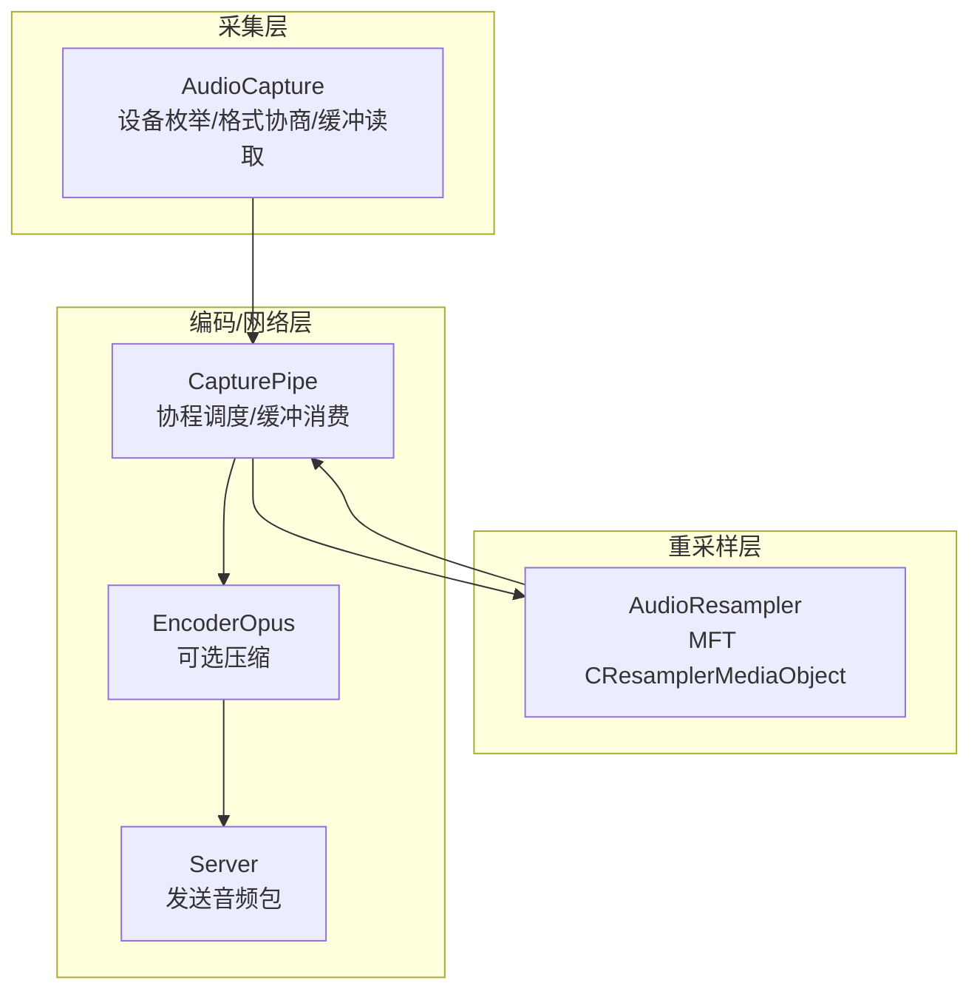
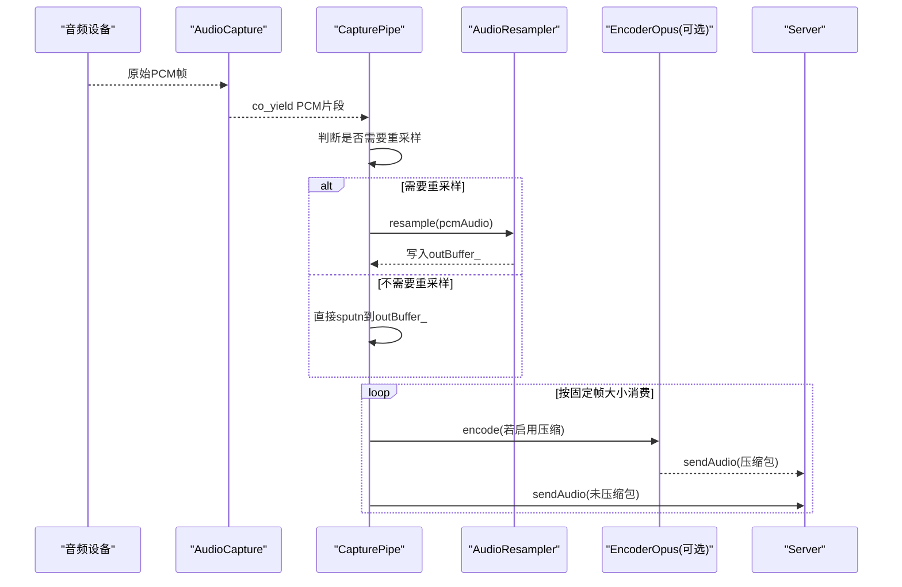
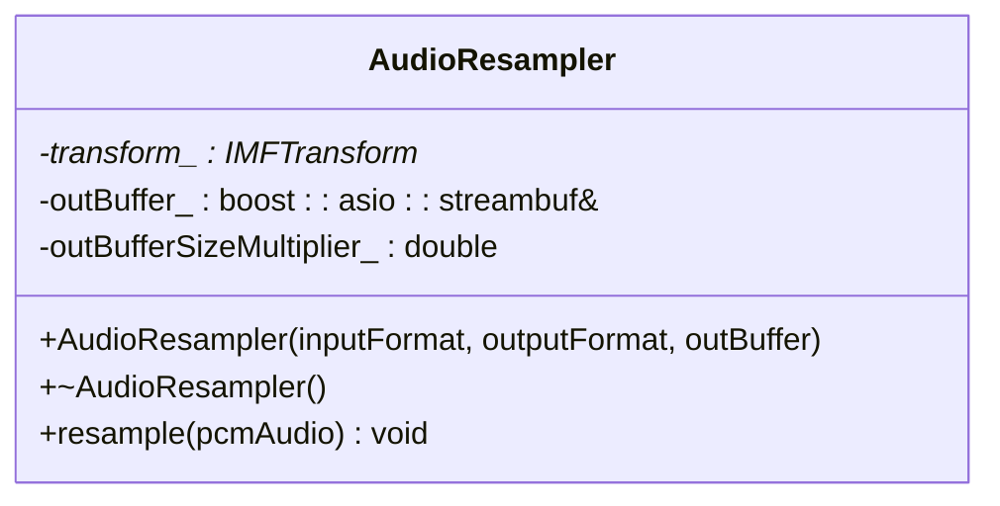
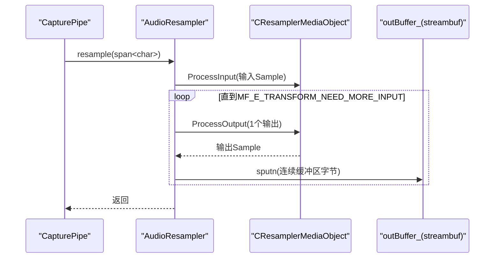
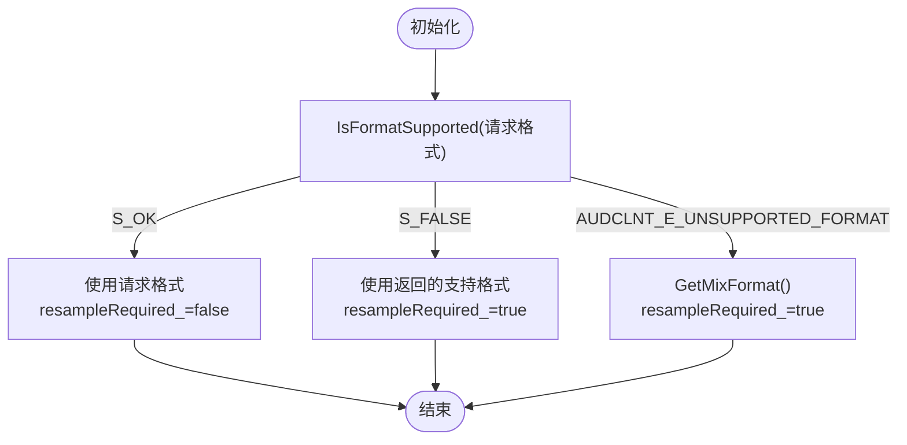
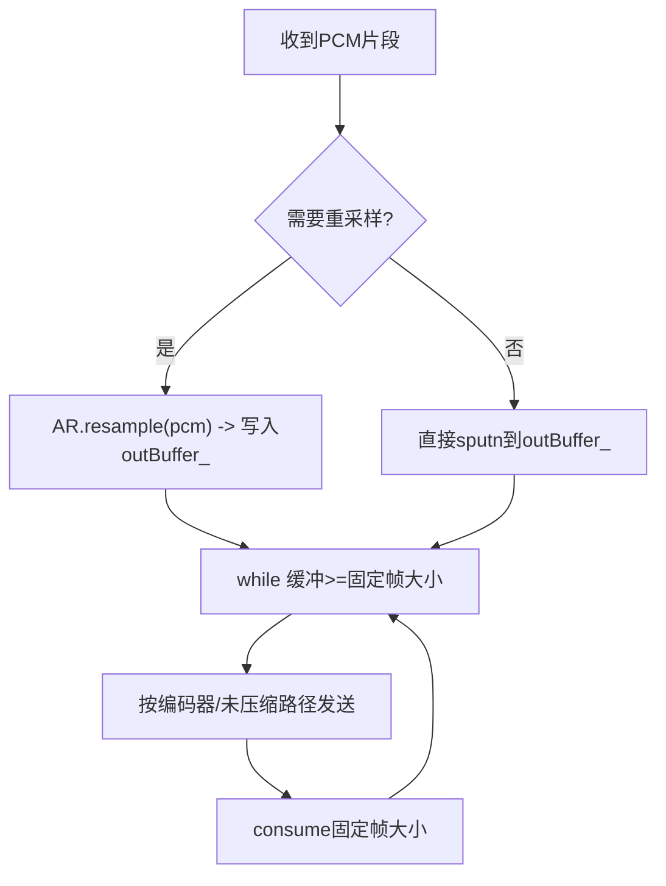
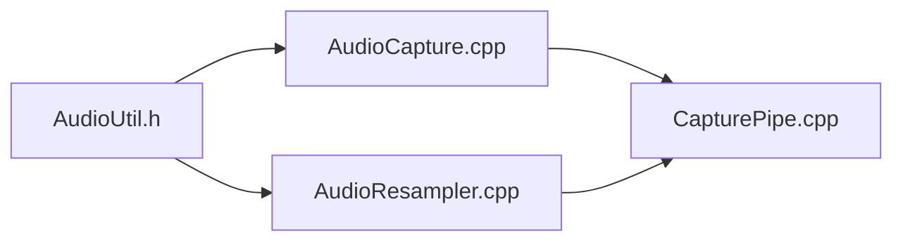

# 音频重采样

<cite>
**本文引用的文件**   
- [AudioResampler.h](file://SoundRemote/AudioResampler.h)
- [AudioResampler.cpp](file://SoundRemote/AudioResampler.cpp)
- [AudioCapture.h](file://SoundRemote/AudioCapture.h)
- [AudioCapture.cpp](file://SoundRemote/AudioCapture.cpp)
- [CapturePipe.h](file://SoundRemote/CapturePipe.h)
- [CapturePipe.cpp](file://SoundRemote/CapturePipe.cpp)
- [AudioUtil.h](file://SoundRemote/AudioUtil.h)
</cite>

## 目录
1. [简介](#简介)
2. [项目结构](#项目结构)
3. [核心组件](#核心组件)
4. [架构总览](#架构总览)
5. [详细组件分析](#详细组件分析)
6. [依赖关系分析](#依赖关系分析)
7. [性能与内存管理](#性能与内存管理)
8. [故障排查指南](#故障排查指南)
9. [结论](#结论)
10. [附录：参数调优与基准测试建议](#附录参数调优与基准测试建议)

## 简介
本文件聚焦于 SoundRemote-WinServer 的音频重采样模块，系统性阐述在音频格式不匹配时的重采样实现、质量与性能权衡、内存与缓冲管理、以及与 AudioCapture 模块的协作机制。文档同时提供数据对齐、实时处理要求、参数调优指南和质量评估方法，并给出可操作的配置示例与基准测试建议。

## 项目结构
与重采样相关的核心代码位于以下文件：
- 重采样器：AudioResampler.h/.cpp
- 采集器：AudioCapture.h/.cpp
- 管道编排：CapturePipe.h/.cpp
- 公共工具与错误定位：AudioUtil.h

图表来源
- [AudioCapture.cpp:118-214](file://SoundRemote/AudioCapture.cpp#L118-L214)
- [AudioResampler.cpp:11-51](file://SoundRemote/AudioResampler.cpp#L11-L51)
- [CapturePipe.cpp:40-51](file://SoundRemote/CapturePipe.cpp#L40-L51)
- [CapturePipe.cpp:124-155](file://SoundRemote/CapturePipe.cpp#L124-L155)

章节来源
- [AudioResampler.h:13-23](file://SoundRemote/AudioResampler.h#L13-L23)
- [AudioResampler.cpp:11-51](file://SoundRemote/AudioResampler.cpp#L11-L51)
- [AudioCapture.h:22-78](file://SoundRemote/AudioCapture.h#L22-L78)
- [AudioCapture.cpp:118-214](file://SoundRemote/AudioCapture.cpp#L118-L214)
- [CapturePipe.h:23-51](file://SoundRemote/CapturePipe.h#L23-L51)
- [CapturePipe.cpp:40-51](file://SoundRemote/CapturePipe.cpp#L40-L51)
- [CapturePipe.cpp:124-155](file://SoundRemote/CapturePipe.cpp#L124-L155)

## 核心组件
- AudioResampler：基于 Windows Media Foundation 的重采样 MFT（CResamplerMediaObject），负责将输入 PCM 转换为输出格式（采样率、声道数、比特深度等）。
- AudioCapture：使用 Core Audio API 获取设备能力、协商实际支持的 WAVEFORMATEXTENSIBLE 格式，并提供协程式 PCM 数据流。
- CapturePipe：协调采集与重采样，维护统一缓冲，按固定帧大小分片后送入编码器或透传。

章节来源
- [AudioResampler.h:13-23](file://SoundRemote/AudioResampler.h#L13-L23)
- [AudioResampler.cpp:11-51](file://SoundRemote/AudioResampler.cpp#L11-L51)
- [AudioCapture.h:22-78](file://SoundRemote/AudioCapture.h#L22-L78)
- [AudioCapture.cpp:118-214](file://SoundRemote/AudioCapture.cpp#L118-L214)
- [CapturePipe.h:23-51](file://SoundRemote/CapturePipe.h#L23-L51)
- [CapturePipe.cpp:40-51](file://SoundRemote/CapturePipe.cpp#L40-L51)

## 架构总览
重采样流程从设备采集开始，根据是否支持请求格式决定是否启用重采样；随后统一进入缓冲队列，按固定帧大小切块，再分发到编码器或直接透传。

图表来源
- [AudioCapture.cpp:219-280](file://SoundRemote/AudioCapture.cpp#L219-L280)
- [CapturePipe.cpp:124-155](file://SoundRemote/CapturePipe.cpp#L124-L155)
- [AudioResampler.cpp:60-133](file://SoundRemote/AudioResampler.cpp#L60-L133)

## 详细组件分析

### AudioResampler 类
- 职责
  - 初始化 MFT 重采样对象，设置输入/输出媒体类型，启动流。
  - 对每段 PCM 输入执行 ProcessInput/ProcessOutput 循环，将结果追加到外部 streambuf。
- 关键设计点
  - 质量设置：通过 IWMResamplerProps::SetHalfFilterLength 设置滤波器半长，值越大音质越高但延迟和 CPU 开销也越大。
  - 输出缓冲估算：构造时依据输入/输出的 nAvgBytesPerSec 计算 outBufferSizeMultiplier_，用于按需分配输出缓冲区，避免频繁分配。
  - 资源生命周期：析构时发送结束流消息，确保 MFT 状态正确释放。
- 接口
  - 构造函数：接收输入/输出 WAVEFORMATEXTENSIBLE 及外部输出缓冲引用。
  - resample：将 std::span<char> 的 PCM 数据转换为目标格式并写入 outBuffer_。

图表来源
- [AudioResampler.h:13-23](file://SoundRemote/AudioResampler.h#L13-L23)
- [AudioResampler.cpp:11-51](file://SoundRemote/AudioResampler.cpp#L11-L51)
- [AudioResampler.cpp:60-133](file://SoundRemote/AudioResampler.cpp#L60-L133)

章节来源
- [AudioResampler.h:13-23](file://SoundRemote/AudioResampler.h#L13-L23)
- [AudioResampler.cpp:11-51](file://SoundRemote/AudioResampler.cpp#L11-L51)
- [AudioResampler.cpp:60-133](file://SoundRemote/AudioResampler.cpp#L60-L133)

#### 重采样算法与转换维度
- 采样率转换：由 MFT 内部算法完成，支持任意输入/输出采样率组合。
- 声道数调整：支持多声道到多声道的重映射与混音/扩展。
- 比特深度转换：支持 PCM/IEEE Float 等子类型的位深转换。
- 质量控制：通过 SetHalfFilterLength 调节滤波器长度，影响频率响应与相位失真。

章节来源
- [AudioResampler.cpp:20-25](file://SoundRemote/AudioResampler.cpp#L20-L25)
- [AudioResampler.cpp:26-43](file://SoundRemote/AudioResampler.cpp#L26-L43)

#### 重采样主流程（序列图）

图表来源
- [AudioResampler.cpp:60-133](file://SoundRemote/AudioResampler.cpp#L60-L133)

### AudioCapture 与重采样判定逻辑
- 设备能力协商
  - 使用 IsFormatSupported 检查请求格式是否被设备支持。
  - 若不支持，则通过 GetMixFormat 获取混合格式作为实际捕获格式。
- 判定标志
  - resampleRequired_ 为 true 表示需要重采样；false 表示无需重采样。
- 暴露接口
  - resampleRequired()：供上层决定是否需要构建 AudioResampler。
  - requestedWaveFormat()/capturedWaveFormat()：分别返回请求与实际捕获的 WAVEFORMATEXTENSIBLE。

图表来源
- [AudioCapture.cpp:156-185](file://SoundRemote/AudioCapture.cpp#L156-L185)
- [AudioCapture.cpp:281-284](file://SoundRemote/AudioCapture.cpp#L281-L284)

章节来源
- [AudioCapture.h:39-57](file://SoundRemote/AudioCapture.h#L39-L57)
- [AudioCapture.cpp:156-185](file://SoundRemote/AudioCapture.cpp#L156-L185)
- [AudioCapture.cpp:281-284](file://SoundRemote/AudioCapture.cpp#L281-L284)

### CapturePipe 中的协作与缓冲管理
- 条件创建重采样器
  - 若 resampleRequired() 为真，则用 capturedWaveFormat 作为输入、requestedWaveFormat 作为输出构造 AudioResampler。
- 统一缓冲
  - 无论是否重采样，最终都写入 pcmAudioBuffer_（boost::asio::streambuf）。
- 固定帧消费
  - 以 opusInputSize_ 为单位从缓冲中取出数据，进行编码或直接透传，保证下游编码器/网络层的帧对齐。

图表来源
- [CapturePipe.cpp:44-49](file://SoundRemote/CapturePipe.cpp#L44-L49)
- [CapturePipe.cpp:124-155](file://SoundRemote/CapturePipe.cpp#L124-L155)

章节来源
- [CapturePipe.h:40-51](file://SoundRemote/CapturePipe.h#L40-L51)
- [CapturePipe.cpp:40-51](file://SoundRemote/CapturePipe.cpp#L40-L51)
- [CapturePipe.cpp:124-155](file://SoundRemote/CapturePipe.cpp#L124-L155)

## 依赖关系分析
- 运行时依赖
  - Windows Media Foundation（mfapi/mftransform/wmcodecdsp）
  - Core Audio API（IAudioClient/IAudioCaptureClient）
  - Boost.Asio（io_context/streambuf）
- 内部耦合
  - CapturePipe 依赖 AudioCapture 与 AudioResampler，并通过 streambuf 解耦数据传递。
  - AudioResampler 仅依赖 AudioUtil 的错误处理与位置标记。

图表来源
- [AudioUtil.h:150-169](file://SoundRemote/AudioUtil.h#L150-L169)
- [AudioResampler.cpp:1-10](file://SoundRemote/AudioResampler.cpp#L1-L10)
- [AudioCapture.cpp:1-14](file://SoundRemote/AudioCapture.cpp#L1-L14)
- [CapturePipe.cpp:1-12](file://SoundRemote/CapturePipe.cpp#L1-L12)

章节来源
- [AudioUtil.h:150-169](file://SoundRemote/AudioUtil.h#L150-L169)
- [AudioResampler.cpp:1-10](file://SoundRemote/AudioResampler.cpp#L1-L10)
- [AudioCapture.cpp:1-14](file://SoundRemote/AudioCapture.cpp#L1-L14)
- [CapturePipe.cpp:1-12](file://SoundRemote/CapturePipe.cpp#L1-L12)

## 性能与内存管理
- 质量与延迟权衡
  - SetHalfFilterLength 越大，频响越平坦、相位失真越小，但 CPU 占用与处理延迟增加。当前设置为最高档（60）。
- 输出缓冲估算
  - 构造时依据输入/输出 nAvgBytesPerSec 计算倍数，动态预估输出样本大小，减少多次分配带来的开销。
- 零拷贝优化
  - 输入数据通过 Lock/Memcpy 复制到 MFT 内部缓冲；输出通过 ConvertToContiguousBuffer 获得连续内存后直接 sputn 到 streambuf，避免额外复制。
- 实时性保障
  - CapturePipe 以固定帧大小消费缓冲，确保编码器/网络发送节奏稳定；AudioCapture 内部定时器周期为缓冲时长的一半，有助于平滑丢包与静音补偿。
- 内存安全
  - 所有 COM 指针使用智能包装自动 Release；MFT 输出 Sample 的生命周期在循环内受控；异常路径通过 throwOnError 统一上报。

章节来源
- [AudioResampler.cpp:20-25](file://SoundRemote/AudioResampler.cpp#L20-L25)
- [AudioResampler.cpp:49-51](file://SoundRemote/AudioResampler.cpp#L49-L51)
- [AudioResampler.cpp:104-133](file://SoundRemote/AudioResampler.cpp#L104-L133)
- [AudioCapture.cpp:231-255](file://SoundRemote/AudioCapture.cpp#L231-L255)

## 故障排查指南
- 常见错误定位
  - 所有 HRESULT 均通过 Audio::throwOnError 抛出，附带 Location 枚举，便于快速定位失败阶段（如 RESAMPLER_CREATE_OUTPUT_BUFFER、RESAMPLER_TRANSFORM_PROCESSOUTPUT 等）。
- 典型症状与建议
  - 输出断续/卡顿：检查 outBufferSizeMultiplier_ 是否足够大；确认 CapturePipe 的固定帧大小与编码器输入一致。
  - 爆音/失真：降低 SetHalfFilterLength 以降低延迟；检查输入/输出格式是否一致（采样率、声道、位深）。
  - 内存泄漏：确认 MFT 结束流消息已发送；确保所有 IMFSample/IMFMediaBuffer 生命周期受 RAII 管理。
- 调试手段
  - 记录每次 ProcessOutput 的返回值与 dwStatus，关注 MF_E_TRANSFORM_NEED_MORE_INPUT 的正常退出条件。
  - 对比输入/输出 nAvgBytesPerSec 与 BufferDuration，验证缓冲策略是否符合实时需求。

章节来源
- [AudioUtil.h:70-98](file://SoundRemote/AudioUtil.h#L70-L98)
- [AudioResampler.cpp:104-133](file://SoundRemote/AudioResampler.cpp#L104-L133)
- [AudioResampler.cpp:53-58](file://SoundRemote/AudioResampler.cpp#L53-L58)

## 结论
该重采样模块基于系统级 MFT 实现，具备高兼容性与高质量特性。通过 CapturePipe 的统一缓冲与固定帧消费策略，实现了与采集、编码、网络的松耦合对接。合理设置滤波器长度与缓冲策略，可在音质、延迟与 CPU 之间取得平衡。

## 附录：参数调优与基准测试建议

### 重采样参数调优指南
- 滤波器长度（质量）
  - 范围：1-60，当前设为 60（最佳质量）。如需更低延迟，可降低至 30-40 区间观察效果。
- 输出缓冲倍数
  - 构造时按 nAvgBytesPerSec 比例估算，必要时可根据实测峰值放大系数，避免 ProcessOutput 频繁分配。
- 固定帧大小
  - 与编码器输入帧大小严格一致，避免跨帧边界导致的抖动或重复消费。

章节来源
- [AudioResampler.cpp:20-25](file://SoundRemote/AudioResampler.cpp#L20-L25)
- [AudioResampler.cpp:49-51](file://SoundRemote/AudioResampler.cpp#L49-L51)
- [CapturePipe.cpp:124-155](file://SoundRemote/CapturePipe.cpp#L124-L155)

### 质量评估方法
- 主观听感：在不同源格式（44.1k/48k，立体声/单声道，16bit/32bit float）下对比直通与重采样后的听感差异。
- 客观指标：测量 THD+N、频率响应曲线、群延迟变化；比较不同滤波器长度下的指标。
- 一致性校验：统计输出帧大小分布与丢弃/重复帧次数，确保无越界与错位。

### 实际重采样配置示例（步骤说明）
- 当 resampleRequired() 为真时：
  - 使用 capturedWaveFormat 作为输入格式，requestedWaveFormat 作为输出格式构造 AudioResampler。
  - 将 PCM 片段传入 resample，结果写入 streambuf。
- 当 resampleRequired() 为假时：
  - 直接将 PCM 片段写入 streambuf，跳过重采样。

章节来源
- [CapturePipe.cpp:44-49](file://SoundRemote/CapturePipe.cpp#L44-L49)
- [CapturePipe.cpp:124-155](file://SoundRemote/CapturePipe.cpp#L124-L155)

### 性能基准测试建议
- 测试场景
  - 不同采样率组合（44.1k→48k、48k→44.1k）、不同声道（立体声/单声道）、不同位深（16bit/32bit float）。
- 指标
  - 平均/最大处理延迟、CPU 占用、内存峰值、吞吐（MB/s）。
- 方法
  - 使用高精度计时器测量从 capture 到 sendAudio 的端到端延迟；统计 ProcessOutput 调用次数与耗时；监控 streambuf 增长与消耗速率。

[本节为通用指导，不直接分析具体文件]