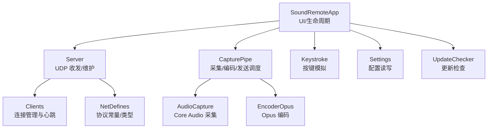
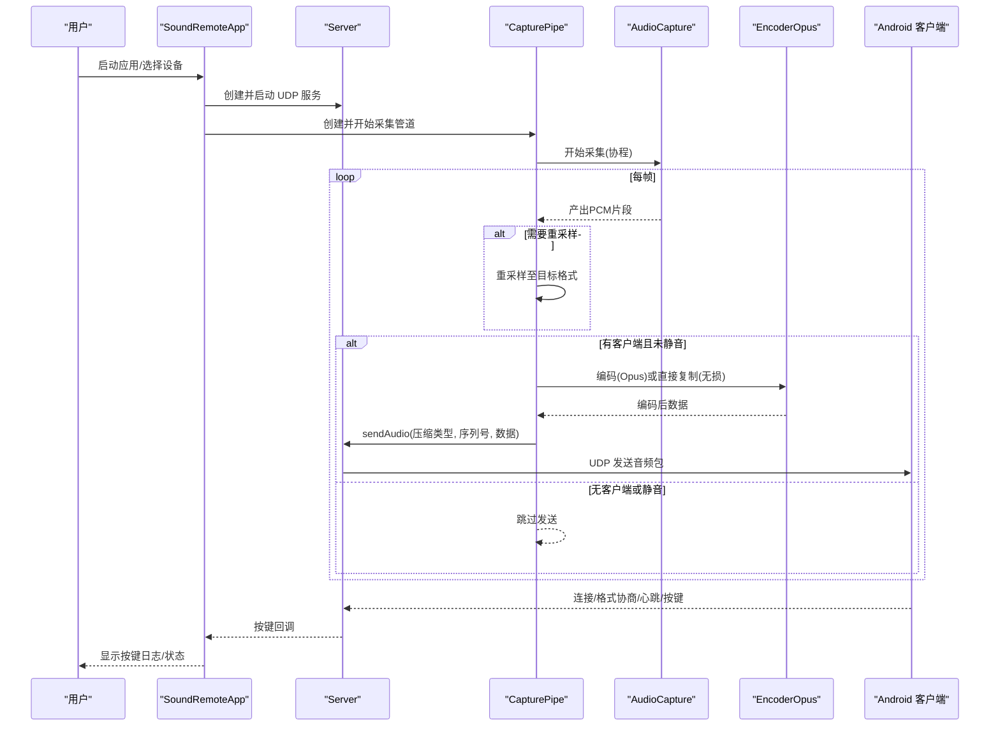
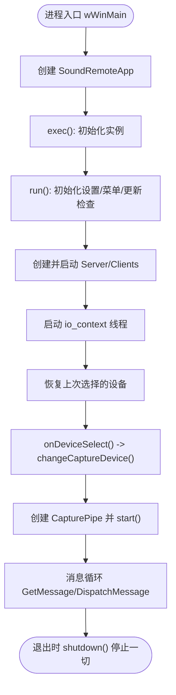
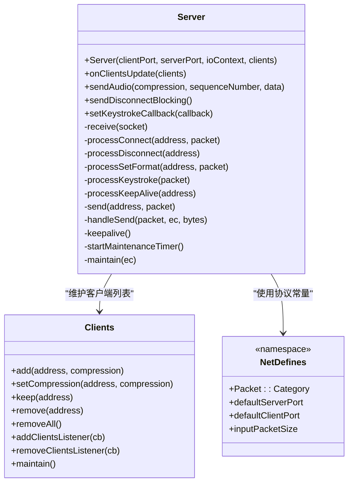
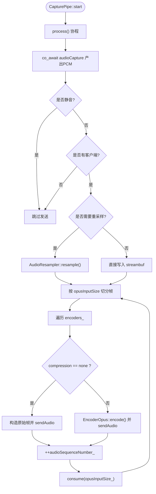
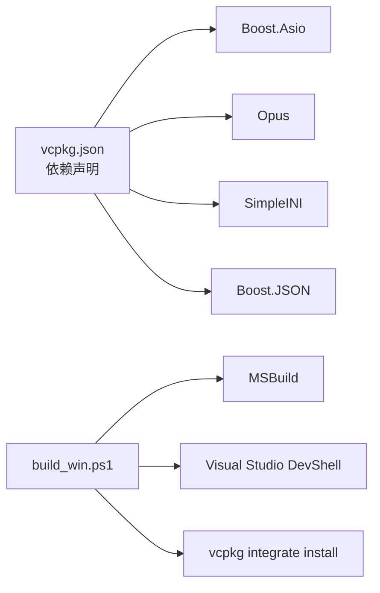

# 项目概述

<cite>
**本文引用的文件**   
- [README.md](file://README.md)
- [SoundRemoteApp.h](file://SoundRemote/SoundRemoteApp.h)
- [SoundRemoteApp.cpp](file://SoundRemote/SoundRemoteApp.cpp)
- [Server.h](file://SoundRemote/Server.h)
- [Server.cpp](file://SoundRemote/Server.cpp)
- [CapturePipe.h](file://SoundRemote/CapturePipe.h)
- [CapturePipe.cpp](file://SoundRemote/CapturePipe.cpp)
- [AudioCapture.h](file://SoundRemote/AudioCapture.h)
- [EncoderOpus.h](file://SoundRemote/EncoderOpus.h)
- [Clients.h](file://SoundRemote/Clients.h)
- [NetDefines.h](file://SoundRemote/NetDefines.h)
- [AudioUtil.h](file://SoundRemote/AudioUtil.h)
- [Keystroke.h](file://SoundRemote/Keystroke.h)
- [vcpkg.json](file://vcpkg.json)
- [build_win.ps1](file://build_win.ps1)
</cite>

## 目录
1. [简介](#简介)
2. [项目结构](#项目结构)
3. [核心组件](#核心组件)
4. [架构总览](#架构总览)
5. [详细组件分析](#详细组件分析)
6. [依赖关系分析](#依赖关系分析)
7. [性能考量](#性能考量)
8. [故障排查指南](#故障排查指南)
9. [结论](#结论)
10. [附录](#附录)

## 简介
SoundRemote-WinServer 是一个基于 Windows 平台的桌面应用程序，作为服务端与 Android 客户端协同工作。其核心目标是通过 UDP 网络将本地音频流低延迟地传输到远端设备，同时支持从客户端回传的键盘快捷键事件在本地模拟执行。该应用适用于远程会议、跨设备协作、移动设备操控桌面等场景。

主要特性：
- 音频捕获与实时传输：支持多种压缩码率（如 64/128/192/256/320 kbps）与无损直通模式，使用 Opus 编码降低带宽占用。
- 键盘远程控制：接收客户端的按键事件并在本地模拟输入，便于通过手机或平板控制桌面。
- 轻量 UDP 协议：自定义数据包格式，包含连接、断开、格式协商、心跳、按键与音频数据等类别。
- 可插拔音频设备：枚举系统默认与所有播放/录制设备，支持运行时切换。
- 用户界面：提供设备选择、客户端列表、按键日志、静音开关、峰值表等交互控件。

技术栈概览：
- C++20（协程、span、模块式组织）
- Boost.Asio（异步 I/O、协程 awaitable）
- Opus（音频编码）
- Windows Core Audio API（IAudioClient、IAudioMeterInformation 等）
- vcpkg 管理第三方库（boost-asio、opus、simpleini、boost-json）

与其他组件的关系：
- 与 Android 客户端通过 UDP 协议通信，遵循统一的包格式与握手流程。
- 与 Windows 音频子系统交互，负责采集、重采样与峰值检测。
- 与操作系统输入子系统交互，实现按键事件的注入。

章节来源
- [README.md:1-14](file://README.md#L1-L14)

## 项目结构
项目采用分层与按功能划分的组织方式：
- UI 与应用生命周期：SoundRemoteApp
- 网络服务：Server、Clients、NetDefines、NetUtil
- 音频管线：CapturePipe、AudioCapture、AudioResampler、EncoderOpus、AudioUtil
- 输入模拟：Keystroke
- 构建与脚本：build_win.ps1、run_win.bat、vcpkg.json

图表来源
- [SoundRemoteApp.h:22-151](file://SoundRemote/SoundRemoteApp.h#L22-L151)
- [Server.h:20-60](file://SoundRemote/Server.h#L20-L60)
- [CapturePipe.h:23-51](file://SoundRemote/CapturePipe.h#L23-L51)
- [AudioCapture.h:22-78](file://SoundRemote/AudioCapture.h#L22-L78)
- [EncoderOpus.h:9-36](file://SoundRemote/EncoderOpus.h#L9-L36)
- [Clients.h:15-52](file://SoundRemote/Clients.h#L15-L52)
- [NetDefines.h:7-68](file://SoundRemote/NetDefines.h#L7-L68)
- [Keystroke.h:6-40](file://SoundRemote/Keystroke.h#L6-L40)

章节来源
- [SoundRemoteApp.h:22-151](file://SoundRemote/SoundRemoteApp.h#L22-L151)
- [Server.h:20-60](file://SoundRemote/Server.h#L20-L60)
- [CapturePipe.h:23-51](file://SoundRemote/CapturePipe.h#L23-L51)
- [AudioCapture.h:22-78](file://SoundRemote/AudioCapture.h#L22-L78)
- [EncoderOpus.h:9-36](file://SoundRemote/EncoderOpus.h#L9-L36)
- [Clients.h:15-52](file://SoundRemote/Clients.h#L15-L52)
- [NetDefines.h:7-68](file://SoundRemote/NetDefines.h#L7-L68)
- [Keystroke.h:6-40](file://SoundRemote/Keystroke.h#L6-L40)

## 核心组件
- SoundRemoteApp：应用入口、窗口消息循环、设置加载、菜单与控件初始化、设备枚举与选择、启动服务器与音频管道、处理按键回调与更新检查。
- Server：基于 Boost.Asio 的 UDP 服务端，处理连接/断开/格式协商/心跳/按键事件；维护客户端缓存并按压缩类型分发音频数据。
- CapturePipe：封装音频采集、可选重采样、按需创建编码器实例、按帧切分 PCM 并调用 Server 发送；支持静音与峰值读取。
- AudioCapture：基于 Windows Core Audio API 的采集协程，暴露 yield_value 以非阻塞方式产出 PCM 片段，并提供峰值信息。
- EncoderOpus：封装 Opus 编码器，提供帧大小与输入尺寸计算、编码接口。
- Clients：线程安全的客户端集合，记录地址、压缩能力、最后接触时间，支持监听器通知与超时清理。
- NetDefines：定义协议签名、包类别、字段偏移、默认端口、最大包大小等。
- Keystroke：封装虚拟键码与修饰键位图，提供 emulate 方法调用系统输入注入。

章节来源
- [SoundRemoteApp.cpp:36-125](file://SoundRemote/SoundRemoteApp.cpp#L36-L125)
- [Server.cpp:18-28](file://SoundRemote/Server.cpp#L18-L28)
- [CapturePipe.cpp:40-51](file://SoundRemote/CapturePipe.cpp#L40-L51)
- [AudioCapture.h:22-78](file://SoundRemote/AudioCapture.h#L22-L78)
- [EncoderOpus.h:9-36](file://SoundRemote/EncoderOpus.h#L9-L36)
- [Clients.h:15-52](file://SoundRemote/Clients.h#L15-L52)
- [NetDefines.h:7-68](file://SoundRemote/NetDefines.h#L7-L68)
- [Keystroke.h:6-40](file://SoundRemote/Keystroke.h#L6-L40)

## 架构总览
整体架构围绕“采集-编码-网络-渲染”链路展开，UI 仅用于配置与监控，核心路径尽量保持无锁与低延迟。

图表来源
- [SoundRemoteApp.cpp:91-125](file://SoundRemote/SoundRemoteApp.cpp#L91-L125)
- [Server.cpp:80-125](file://SoundRemote/Server.cpp#L80-L125)
- [CapturePipe.cpp:97-156](file://SoundRemote/CapturePipe.cpp#L97-L156)
- [AudioCapture.h:80-143](file://SoundRemote/AudioCapture.h#L80-L143)
- [EncoderOpus.h:11-23](file://SoundRemote/EncoderOpus.h#L11-L23)

## 详细组件分析

### 应用主类 SoundRemoteApp
职责：
- 初始化窗口、控件、字符串资源与菜单项
- 加载配置、注册系统挂起事件
- 创建并运行 Asio io_context 线程
- 创建 Server、Clients、CapturePipe 并建立回调链
- 处理设备选择、静音、峰值表刷新、更新检查与主页跳转

关键流程要点：
- exec() 中进入消息循环，run() 内完成服务与管道的启动
- asioEventLoop() 捕获异常并提示错误，必要时停止采集
- onDeviceSelect() 触发 changeCaptureDevice()，重建 CapturePipe 并重启采集
- onReceiveKeystroke() 将按键描述追加到日志框

图表来源
- [SoundRemoteApp.cpp:36-79](file://SoundRemote/SoundRemoteApp.cpp#L36-L79)
- [SoundRemoteApp.cpp:91-125](file://SoundRemote/SoundRemoteApp.cpp#L91-L125)
- [SoundRemoteApp.cpp:255-279](file://SoundRemote/SoundRemoteApp.cpp#L255-L279)
- [SoundRemoteApp.cpp:388-408](file://SoundRemote/SoundRemoteApp.cpp#L388-L408)

章节来源
- [SoundRemoteApp.h:22-151](file://SoundRemote/SoundRemoteApp.h#L22-L151)
- [SoundRemoteApp.cpp:36-125](file://SoundRemote/SoundRemoteApp.cpp#L36-L125)
- [SoundRemoteApp.cpp:255-279](file://SoundRemote/SoundRemoteApp.cpp#L255-L279)
- [SoundRemoteApp.cpp:388-408](file://SoundRemote/SoundRemoteApp.cpp#L388-L408)

### 网络服务 Server
职责：
- 绑定 UDP 接收端口，异步接收客户端报文
- 解析包类别并路由到对应处理器（连接、断开、格式协商、按键、心跳）
- 维护客户端缓存（按压缩类型分组），定时发送心跳与清理超时
- 对外暴露 sendAudio()/sendDisconnectBlocking()/setKeystrokeCallback()

协议与端口：
- 默认服务器端口与客户端端口由 NetDefines 定义
- 包类别包括 Connect/Disconnect/SetFormat/Keystroke/AudioDataUncompressed/AudioDataOpus/KeepAlive/Ack 等

图表来源
- [Server.h:20-60](file://SoundRemote/Server.h#L20-L60)
- [Server.cpp:18-28](file://SoundRemote/Server.cpp#L18-L28)
- [Server.cpp:80-125](file://SoundRemote/Server.cpp#L80-L125)
- [Clients.h:15-52](file://SoundRemote/Clients.h#L15-L52)
- [NetDefines.h:7-68](file://SoundRemote/NetDefines.h#L7-L68)

章节来源
- [Server.h:20-60](file://SoundRemote/Server.h#L20-L60)
- [Server.cpp:18-28](file://SoundRemote/Server.cpp#L18-L28)
- [Server.cpp:80-125](file://SoundRemote/Server.cpp#L80-L125)
- [Clients.h:15-52](file://SoundRemote/Clients.h#L15-L52)
- [NetDefines.h:7-68](file://SoundRemote/NetDefines.h#L7-L68)

### 音频管道 CapturePipe
职责：
- 根据设备 ID 创建 AudioCapture，必要时创建 AudioResampler
- 维护每个压缩类型的编码器实例（none 表示直通）
- 协程驱动采集循环，按固定帧大小切分 PCM，逐路编码并调用 Server 发送
- 提供静音开关与峰值读取

图表来源
- [CapturePipe.cpp:97-156](file://SoundRemote/CapturePipe.cpp#L97-L156)
- [CapturePipe.h:23-51](file://SoundRemote/CapturePipe.h#L23-L51)
- [AudioCapture.h:80-143](file://SoundRemote/AudioCapture.h#L80-L143)
- [EncoderOpus.h:11-23](file://SoundRemote/EncoderOpus.h#L11-L23)

章节来源
- [CapturePipe.h:23-51](file://SoundRemote/CapturePipe.h#L23-L51)
- [CapturePipe.cpp:40-51](file://SoundRemote/CapturePipe.cpp#L40-L51)
- [CapturePipe.cpp:97-156](file://SoundRemote/CapturePipe.cpp#L97-L156)
- [AudioCapture.h:80-143](file://SoundRemote/AudioCapture.h#L80-L143)
- [EncoderOpus.h:11-23](file://SoundRemote/EncoderOpus.h#L11-L23)

### 音频采集 AudioCapture
职责：
- 基于 Core Audio API 初始化 IAudioClient/IAudioCaptureClient/IAudioMeterInformation
- 暴露 capture() 返回协程，yield_value 产出 PCM span
- 提供 resampleRequired() 与 requested/captured WaveFormat 查询
- 提供 getPeakValue() 获取当前峰值

设计要点：
- 使用 CoUninitializer 确保 COM 正确释放
- 通过自定义 Awaiter 实现 co_await 语义，避免额外拷贝

章节来源
- [AudioCapture.h:22-78](file://SoundRemote/AudioCapture.h#L22-L78)
- [AudioCapture.h:80-143](file://SoundRemote/AudioCapture.h#L80-L143)

### 按键模拟 Keystroke
职责：
- 封装虚拟键码与修饰键位图
- emulate() 调用系统 API 注入按键事件
- toString() 生成可读描述用于日志展示

章节来源
- [Keystroke.h:6-40](file://SoundRemote/Keystroke.h#L6-L40)

### 客户端管理 Clients
职责：
- 维护客户端地址与压缩能力映射
- keep/remove/add/setCompression 等操作
- maintain() 清理超时连接
- 通过监听器向 UI 推送客户端列表变化

章节来源
- [Clients.h:15-52](file://SoundRemote/Clients.h#L15-L52)

### 网络协议 NetDefines
职责：
- 定义包头部字段、偏移、类别枚举、默认端口、最大包大小
- 为 Server 与客户端提供一致的协议契约

章节来源
- [NetDefines.h:7-68](file://SoundRemote/NetDefines.h#L7-L68)

## 依赖关系分析
外部依赖与工具链：
- vcpkg 管理 boost-asio、opus、simpleini、boost-json
- 构建脚本 build_win.ps1 自动初始化 VS 环境、集成 vcpkg、MSBuild 构建与测试

图表来源
- [vcpkg.json:1-10](file://vcpkg.json#L1-L10)
- [build_win.ps1:28-59](file://build_win.ps1#L28-L59)
- [build_win.ps1:61-106](file://build_win.ps1#L61-L106)

章节来源
- [vcpkg.json:1-10](file://vcpkg.json#L1-L10)
- [build_win.ps1:28-59](file://build_win.ps1#L28-L59)
- [build_win.ps1:61-106](file://build_win.ps1#L61-L106)

## 性能考量
- 零拷贝与缓冲复用：CapturePipe 使用 streambuf 累积 PCM，按固定帧大小消费，减少内存分配与拷贝。
- 多编码器并行：根据客户端支持的压缩类型动态创建编码器实例，避免重复编码开销。
- 协程与异步 I/O：AudioCapture 与 Server 均使用协程/awaitable，避免阻塞 UI 与提升吞吐。
- 心跳与超时：Server 定期发送心跳并清理长时间无响应的客户端，防止资源泄漏。
- 峰值表与静音：UI 侧通过定时器轮询峰值，静音路径直接跳过发送，降低 CPU 占用。

[本节为通用指导，不直接分析具体文件]

## 故障排查指南
常见问题与定位建议：
- 无法启动服务或崩溃：检查 Server 构造函数与 receive 协程中的异常处理路径，确认端口未被占用。
- 无音频输出：确认已选择有效设备、CapturePipe 已启动且有客户端连接；检查静音开关与峰值表是否正常。
- 按键无效：确认客户端发送的按键类别与修饰键位图符合协议；查看按键日志是否收到回调。
- 构建失败：确认已安装 Visual Studio 2022 及 C++ 工作负载，vcpkg 已集成；使用 build_win.ps1 进行一键构建与测试。

章节来源
- [Server.cpp:111-125](file://SoundRemote/Server.cpp#L111-L125)
- [SoundRemoteApp.cpp:388-408](file://SoundRemote/SoundRemoteApp.cpp#L388-L408)
- [build_win.ps1:108-121](file://build_win.ps1#L108-L121)

## 结论
SoundRemote-WinServer 以清晰的模块化设计与现代 C++ 特性实现了低延迟的音频远程传输与键盘远程控制。通过 Boost.Asio 的协程与 Windows Core Audio API 的高效采集，结合 Opus 编码与自定义 UDP 协议，项目在易用性与性能之间取得良好平衡。对于初学者，可从 UI 与设备选择入手理解整体流程；对于有经验的开发者，可深入音频管线与网络协议的细节进行优化与扩展。

[本节为总结性内容，不直接分析具体文件]

## 附录
- 应用场景示例：
  - 远程会议：将 PC 音频转发到手机，并通过手机按键快捷操作桌面应用。
  - 演示与教学：讲师通过平板控制电脑课件，并将系统声音同步到学生设备。
  - 游戏直播辅助：主播通过手机快捷键快速切换场景或推流控制。

- 术语说明：
  - 压缩类型：none 表示无损直通，kbps_* 表示不同码率的 Opus 编码。
  - 序列号：音频包的单调递增序号，便于客户端排序与丢包检测。
  - 心跳：客户端与服务端周期性互发 KeepAlive 包，维持连接健康。

[本节为概念性内容，不直接分析具体文件]